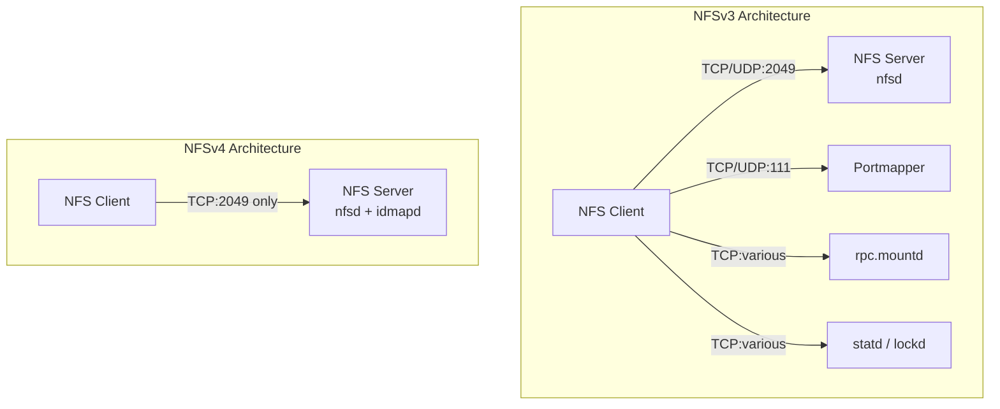
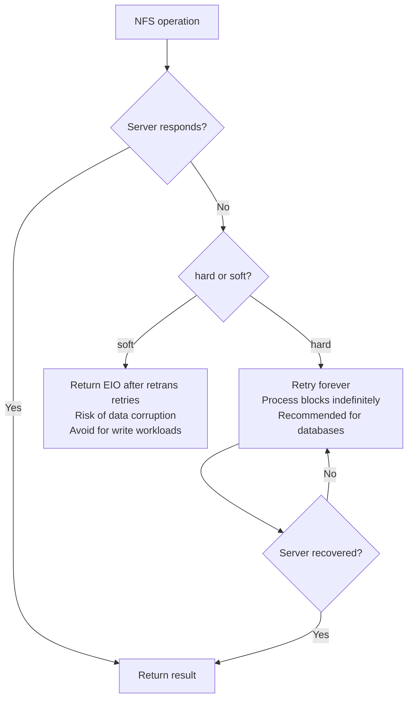

# NFS — Network File System

## Introduction

NFS (Network File System) is the standard POSIX-compliant network filesystem for Unix and Linux, originally developed by Sun Microsystems in 1984. It allows clients to mount remote directories over a network as if they were local. Linux supports NFSv2 (obsolete), NFSv3, and NFSv4 (including NFSv4.1 and NFSv4.2).

NFS has been the workhorse of enterprise Unix storage for decades. It remains critical in HPC clusters, enterprise data centers, and cloud environments where shared file access across multiple machines is required.

## NFSv3 vs NFSv4

### Protocol Comparison



| Feature | NFSv3 | NFSv4 / NFSv4.2 |
|---------|-------|-----------------|
| **Transport** | UDP or TCP | TCP only |
| **Ports** | Dynamic (portmapper + rpc.mountd + statd) | Single port: 2049 |
| **State** | Stateless protocol | Stateful (leases, delegations) |
| **Locking** | Separate NLM protocol (vulnerable to reboots) | Integrated locking (survives reboots better) |
| **Security** | AUTH_SYS (IP-based), Kerberos optional | Kerberos built-in, RPCSEC_GSS mandatory |
| **ACLs** | NFS ACLs (vendor-specific) | NFSv4 ACLs (draft POSIX) |
| **File handles** | Opaque, up to 64 bytes | Variable length, string-based |
| **Namespace** | Mount protocol exports | Pseudo-filesystem (single root namespace) |
| **Delegation** | Not supported | Read/write delegations (client caching) |
| **pnfs** | Not supported | Parallel NFS (NFSv4.1+) for scalable I/O |
| **Recovery** | Manual after server reboot | Client-side state recovery (grace period) |
| **Sparse files** | No SEEK support | SEEK_HOLE / SEEK_DATA (NFSv4.2) |
| **Server-side copy** | Not supported | `copy_file_range` offload (NFSv4.2) |

### NFSv4.2 New Features

NFSv4.2 (RFC 7862) introduced several important improvements over NFSv4.1:

#### Server-Side Copy (CLONE / copy_file_range)

NFSv4.2 supports offloaded server-side copy operations that don't consume client network bandwidth. The data stays on the server:

```bash
# Server-side copy (offloaded, doesn't consume client bandwidth)
cp --reflink=always /mnt/nfs/source /mnt/nfs/dest  # if supported

# Or using copy_file_range syscall
# The kernel detects NFS and sends CLONE/COMMIT to the server
```

The server-side copy uses two operations:
- `CLONE` — Copy a range from one file to another on the same server
- `COPY` — Copy data between files (may be cross-server in future)

#### Sparse File Support (SEEK_HOLE / SEEK_DATA)

NFSv4.2 supports `SEEK_HOLE` and `SEEK_DATA` operations, enabling efficient sparse file handling:

```bash
# Create a sparse file
$ dd if=/dev/zero of=/mnt/nfs/sparse bs=1M count=0 seek=100
$ ls -lh /mnt/nfs/sparse
-rw-r--r-- 1 user user 100M ... sparse

# Find data segments
$ xfs_io -c "seek -d 0" /mnt/nfs/sparse
```

#### Application Data Hints

Applications can provide hints to the server about expected I/O patterns, allowing the server to optimize its caching and prefetching behavior.

#### NFS over TLS

NFSv4.2 supports encryption via TLS with the `rpc-with-tls` mechanism (requires kernel 5.11+ and `ktls-utils`). This provides in-transit encryption without requiring Kerberos:

```bash
# Configure server-side TLS
# Requires ktls-utils and configured certificates
$ sudo systemctl enable --now tlshd
```

#### Layout Improvements in pNFS

NFSv4.2 improves pNFS (parallel NFS) with:
- **Flexfiles layout**: Allows metadata server and data servers to be different
- **SCSI layout**: Direct SCSI device access for pNFS

## Server Configuration

### exports File

The `/etc/exports` file controls which directories are shared and with what permissions:

```bash
# /etc/exports format:
# /path  client(options) client2(options) ...

# Basic export: share /data with a single host
/data  192.168.1.100(rw,sync,no_subtree_check)

# Export to a subnet
/shared  192.168.1.0/24(rw,sync,no_subtree_check,root_squash)

# Export to multiple clients with different options
/home  192.168.1.0/24(rw,sync) 10.0.0.0/8(ro,sync)

# Wildcard and netgroup
/projects  *.example.com(rw,sync,no_subtree_check)
/projects  @developers(rw,sync,no_subtree_check)

# NFSv4 with Kerberos
/secure  192.168.1.0/24(rw,sync,sec=krb5p)

# Kerberos options:
# sys    — AUTH_SYS (default, IP-based authentication)
# krb5   — Kerberos authentication only
# krb5i  — Kerberos + integrity checking
# krb5p  — Kerberos + privacy (encryption)
```

### Export Options Explained

| Option | Description |
|--------|-------------|
| `rw` | Read-write access |
| `ro` | Read-only access (default) |
| `sync` | Write data to disk before replying (required since NFSv3) |
| `async` | Reply before writing to disk (data loss risk, deprecated) |
| `no_subtree_check` | Disable subtree checking (recommended for reliability) |
| `subtree_check` | Verify file is in exported subtree (causes issues with renames) |
| `root_squash` | Map root (UID 0) to `nobody` (default, security) |
| `no_root_squash` | Allow root access (dangerous, use only for diskless clients) |
| `all_squash` | Map all users to `nobody` (good for public shares) |
| `anonuid=<uid>` | UID for anonymous/squashed users |
| `anongid=<gid>` | GID for anonymous/squashed users |
| `sec=<flavor>` | Security flavor: `sys`, `krb5`, `krb5i`, `krb5p` |
| `fsid=<id>` | Filesystem identifier (required for NFSv4 root export) |
| `crossmnt` | Allow crossing to mounted filesystems within export |
| `nohide` | Don't hide mounted filesystems within export |

### Starting the NFS Server

```bash
# Modern systemd-based systems
$ sudo systemctl enable --now nfs-server

# Export all shares after editing /etc/exports
$ sudo exportfs -ra

# Verify exports
$ sudo exportfs -v
/shared  192.168.1.0/24(rw,wdelay,no_subtree_check,sec=sys,rw,secure,no_root_squash,no_all_squash)

# Show current exports for a specific client
$ sudo exportfs 192.168.1.100
```

### rpc.mountd and Auxiliary Services

NFSv3 requires several auxiliary daemons:

```bash
# rpc.mountd — handles mount/unmount requests
# Runs automatically with nfs-server.service
$ rpcinfo -p | grep mountd
    100005    3   tcp  43257  mountd

# rpc.statd — Network Status Monitor (for lock recovery)
$ sudo systemctl enable --now rpc-statd

# rpc.idmapd — NFSv4 ID mapper (translates UIDs to names)
$ sudo systemctl enable --now nfs-idmapd

# rpcbind — portmapper (required for NFSv3)
$ sudo systemctl enable --now rpcbind
```

## Client Configuration

### Mounting NFS Shares

```bash
# Basic mount (auto-detect NFS version)
mount -t nfs server:/shared /mnt/shared

# Explicit NFSv4 mount
mount -t nfs -o vers=4.2 server:/shared /mnt/shared

# NFSv3 mount
mount -t nfs -o vers=3 server:/shared /mnt/shared

# Common mount options
mount -t nfs -o vers=4.2,hard,timeo=100,retrans=3,rsize=1048576,wsize=1048576 \
    server:/data /mnt/data

# /etc/fstab entry
server:/shared  /mnt/shared  nfs  defaults,vers=4.2,hard,timeo=100,_netdev  0  0
```

### Mount Options

| Option | Description | Default |
|--------|-------------|---------|
| `vers=<n>` | NFS version | Auto-negotiate (4.2 → 4.1 → 3) |
| `hard` | Retry indefinitely on server not responding | Yes |
| `soft` | Return EIO after timeout | No |
| `timeo=<tenths>` | Timeout in deciseconds | 600 (60s) for NFSv4 |
| `retrans=<n>` | Number of retries before giving up (soft) or logging (hard) | 3 |
| `rsize=<bytes>` | Read block size | Negotiated |
| `wsize=<bytes>` | Write block size | Negotiated |
| `actimeo=<seconds>` | Attribute cache timeout | 60 |
| `noac` | Disable attribute caching (slow but consistent) | No |
| `nolock` | Disable NFS file locking | No |
| `noatime` | Don't update access time | No |
| `sec=<flavor>` | Security flavor | `sys` |
| `_netdev` | Wait for network before mounting | — |
| `fsc` | Enable local caching with cachefilesd | No |

### Hard vs Soft Mounts



**Best practice**: Always use `hard` mounts for write workloads. Soft mounts can cause data corruption because the application gets an error while the server may still be processing the request.

## Performance Tuning

### Read/Write Size

```bash
# Check current negotiated sizes
$ nfsstat -m | grep rsize
  rsize = 1048576

# Increase to maximum (1MB for modern kernels)
mount -t nfs -o rsize=1048576,wsize=1048576 server:/data /mnt/data

# NFSv3 with large reads (64KB was the old max)
mount -t nfs -o vers=3,rsize=32768,wsize=32768 server:/data /mnt/data
```

### Attribute Caching

```bash
# Default: attributes cached for 60 seconds
# For frequently changing files, reduce actimeo:
mount -t nfs -o actimeo=5 server:/data /mnt/data

# For read-heavy workloads with stable files:
mount -t nfs -o actimeo=300 server:/data /mnt/data

# Disable caching entirely (slow):
mount -t nfs -o noac server:/data /mnt/data
```

### TCP Tuning

```bash
# Increase NFS server thread count
$ sudo sysctl sunrpc.tcp_slot_table_entries=128
$ sudo sysctl sunrpc.tcp_max_slot_table_entries=128

# Client: increase number of RPC slots
$ echo 128 | sudo tee /proc/sys/sunrpc/tcp_slot_table_entries

# Network buffer sizes
$ sudo sysctl -w net.core.rmem_max=16777216
$ sudo sysctl -w net.core.wmem_max=16777216
$ sudo sysctl -w net.ipv4.tcp_rmem="4096 131072 16777216"
$ sudo sysctl -w net.ipv4.tcp_wmem="4096 131072 16777216"
```

### Local Caching (FS-Cache)

```bash
# Enable FS-Cache for NFS
mount -t nfs -o fsc server:/data /mnt/data

# Configure cachefilesd
$ sudo systemctl enable --now cachefilesd
$ cat /etc/cachefilesd.conf
dir /var/cache/fscache
tag nfs_cache
brun 30%
bcull 15%
bstop 5%
frun 10%
fcull 7%
fstop 3%
```

## Security

### Kerberos Authentication

```bash
# Server-side: require Kerberos for specific exports
# /etc/exports
/secure  client.example.com(rw,sync,sec=krb5p)

# Client-side: mount with Kerberos
mount -t nfs -o sec=krb5p server:/secure /mnt/secure

# Verify security flavor
$ nfsstat -m | grep sec
  sec = krb5p
```

### Firewall Configuration

```bash
# NFSv4 only needs port 2049
$ sudo firewall-cmd --add-service=nfs --permanent
$ sudo firewall-cmd --reload

# NFSv3 also needs: rpcbind (111), mountd (dynamic), statd (dynamic), nlm (dynamic)
# Fixed ports in /etc/sysconfig/nfs:
MOUNTD_PORT=892
STATD_PORT=662
LOCKD_TCPPORT=32803
LOCKD_UDPPORT=32769

$ sudo firewall-cmd --permanent --add-port={111,662,892,2049,32769,32803}/tcp
```

### NFS over TLS (NFSv4.2 + Upcall)

NFSv4.2 supports encryption via TLS with the `rpc-with-tls` mechanism (requires kernel 5.11+ and `ktls-utils`):

```bash
# Configure server-side TLS
# /etc/exports with sec=tls
# Requires ktls-utils and configured certificates
$ sudo systemctl enable --now tlshd
```

## NFS Monitoring and Debugging

```bash
# Show NFS client statistics
$ nfsstat -c
Client rpc stats:
calls      retrans    authrefrsh
845734     12         845730

# Show per-mount statistics
$ nfsstat -m
/mnt/data from server:/data
 Flags: rw,relatime,vers=4.2,rsize=1048576,wsize=1048576,namlen=255,hard,proto=tcp
 ...

# Server-side statistics
$ nfsstat -s

# RPC debugging
$ rpcinfo -p server
$ rpcdebug -m nfsd -s all    # Enable all NFS server debug messages
$ dmesg -w | grep nfs         # Watch kernel messages

# Trace NFS operations
$ cat /proc/fs/nfsfs/volumes  # Client volume info
$ cat /proc/fs/nfsd/threads    # Server thread count
```

## Implementation Details

### Key Source Files

- **`fs/nfs/`** — NFS client implementation
  - `client.c` — Client management
  - `dir.c` — Directory operations
  - `file.c` — File operations
  - `write.c` — Write-back and write-through
  - `nfs4proc.c` — NFSv4 protocol operations
- **`fs/nfsd/`** — NFS server (in-kernel nfsd)
  - `nfsctl.c` — Control interface
  - `nfsproc.c` — NFSv2/3 procedure dispatch
  - `nfs4proc.c` — NFSv4 procedure dispatch
  - `vfs.c` — VFS integration
- **`net/sunrpc/`** — SunRPC transport layer

### RPC Layer

NFS uses Sun RPC (ONC RPC) for communication:

```c
/* Simplified NFSv4 compound operation */
struct compound_args {
    uint32_t           tag_len;
    char              *tag;
    uint32_t           minorversion;
    uint32_t           argarray_len;
    struct nfs4_op_arg *argarray;  /* Array of operations */
};

/* Example: LOOKUP + OPEN + READ in one compound */
struct nfs4_op_arg ops[] = {
    { OP_LOOKUP,    {.lookup.name = "file.txt"} },
    { OP_OPEN,      {.open.flags = O_RDONLY} },
    { OP_READ,      {.read.offset = 0, .read.count = 4096} },
    { OP_CLOSE,     {.close.stateid = ...} },
};
```

## References

- [NFS kernel documentation](https://www.kernel.org/doc/html/latest/filesystems/nfs/index.html)
- [RFC 7530 — NFSv4.0](https://tools.ietf.org/html/rfc7530)
- [RFC 8881 — NFSv4.1](https://tools.ietf.org/html/rfc8881)
- [RFC 7862 — NFSv4.2](https://tools.ietf.org/html/rfc7862)
- [NFS man page](https://man7.org/linux/man-pages/man5/nfs.5.html)
- [exports man page](https://man7.org/linux/man-pages/man5/exports.5.html)

## Further Reading

- [The Linux Kernel Documentation](https://docs.kernel.org/)
- [LWN.net - Linux and free software news](https://lwn.net/)
- [GNU Project Documentation](https://www.gnu.org/doc/doc.html)
- [GNU Manuals](https://www.gnu.org/manual/manual.html)
- [Free Software Directory](https://directory.fsf.org/wiki/Main_Page)
- [Planet GNU](https://planet.gnu.org/)
- [Free Software Books](https://www.gnu.org/doc/other-free-books.html)

- https://www.kernel.org/doc/html/latest/filesystems/nfs/index.html
- https://docs.kernel.org/filesystems/nfs/index.html
- https://man7.org/linux/man-pages/man5/exports.5.html
- https://man7.org/linux/man-pages/man5/nfs.5.html
- https://wiki.archlinux.org/title/NFS
- https://access.redhat.com/documentation/en-us/red_hat_enterprise_linux/9/html/managing_file_systems/exporting-nfs-shares

## Related Topics

- [mounting](./mounting.md) — NFS mount system calls and mount namespaces
- [file-ops](./file-ops.md) — NFS file operations implementation
- [superblock](./superblock.md) — NFS superblock management
- [inode](./inode.md) — NFS inode caching and attribute management
