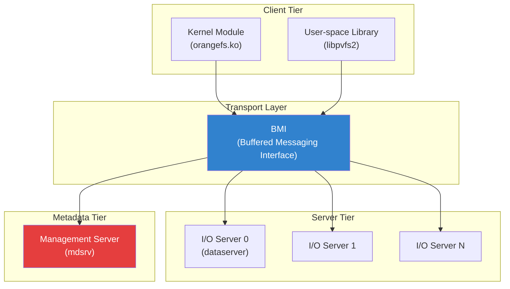
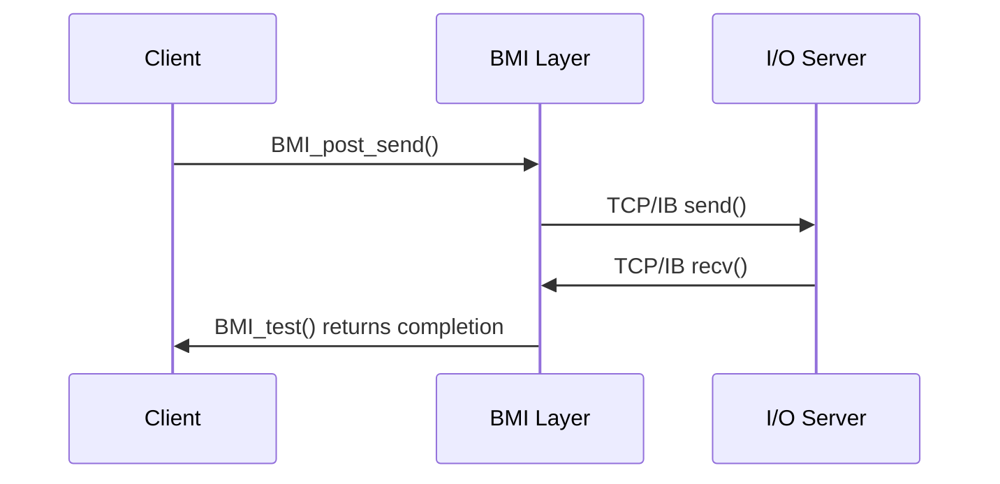
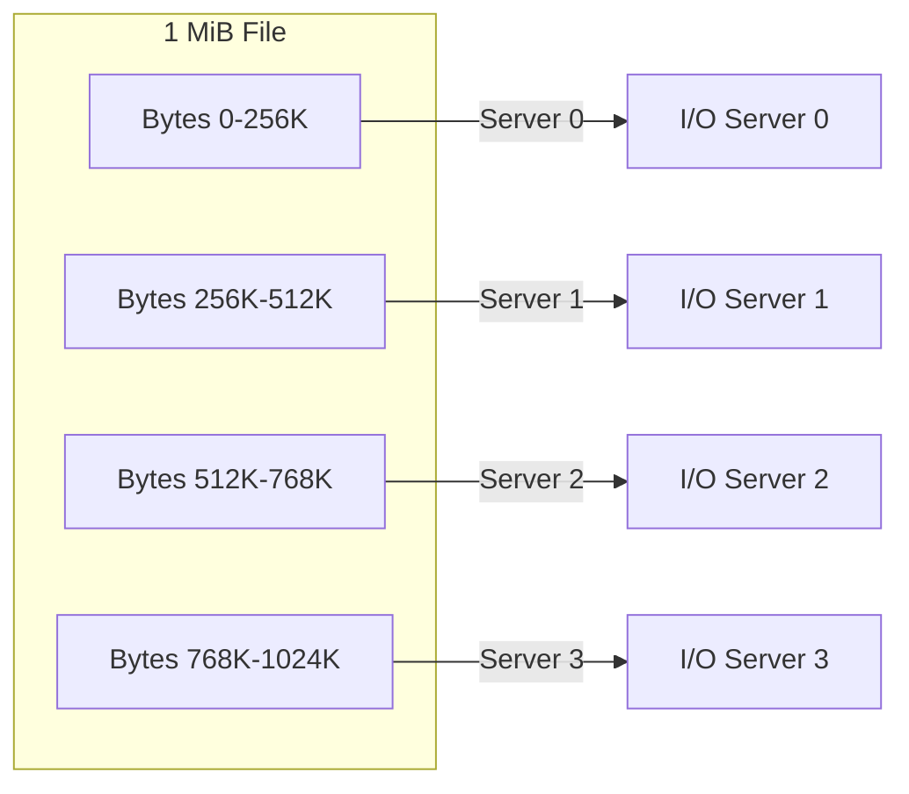
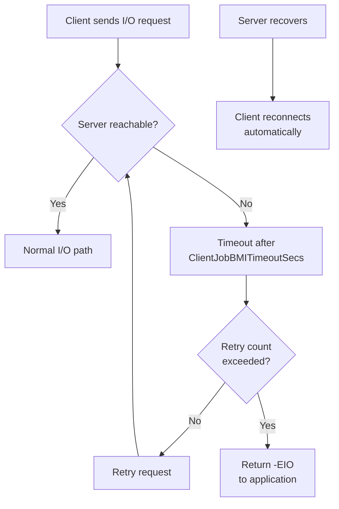

# OrangeFS

OrangeFS (Orange File System) is an open-source **distributed parallel file
system** designed for high-performance computing (HPC) clusters.  It evolved
from the Parallel Virtual File System (PVFS2) and was merged into the Linux
kernel tree as an out-of-tree client with upstream VFS patches beginning in
4.x kernels.

---

## 1. History

| Year | Event |
|---|---|
| 1993 | PVFS1 developed at Clemson University |
| 2003 | PVFS2 rewritten with modular architecture |
| 2011 | Renamed to OrangeFS (Orange = "Open-source Rapid Network Geometry File System") |
| 2016 | Kernel client merged in Linux 4.6 |
| 2018 | Out-of-tree client stabilised for production HPC |

OrangeFS is maintained by the Parallel Architecture Research Lab (PARL) at
Clemson University and Omnibond Systems.

---

## 2. Architecture

OrangeFS has three tiers:



### 2.1 Management Server

The management server (mdsrv) is a **single** process that:

* Stores and serves **metadata** (file names, permissions, timestamps,
  stripe configurations).
* Manages the **namespace** — the directory tree.
* Handles **distributed locking** for metadata consistency.
* Maintains the **file system configuration** (server topology, striping
  parameters).

It is the single point of consistency for metadata.  Data, however, flows
directly between clients and I/O servers.

### 2.2 I/O Servers (Data Servers)

Each I/O server:

* Stores file data in a local filesystem (ext4, XFS, etc.) under a
  designated storage directory.
* Serves read/write requests from clients.
* Can be distributed across many nodes for parallel I/O.

### 2.3 Clients

Two client modes:

| Mode | How | Use Case |
|---|---|---|
| **Kernel module** | VFS mount, standard POSIX I/O | Transparent to applications |
| **User-space library** | `libpvfs2`, direct API | MPI-IO, specialized apps |

---

## 3. BMI — Buffered Messaging Interface

BMI is the **transport abstraction layer** used by OrangeFS.  It provides a
uniform API over multiple network fabrics:

### 3.1 Supported Transports

| Transport | Module | Typical Use |
|---|---|---|
| TCP | `bmi_tcp` | Ethernet clusters |
| InfiniBand | `bmi_ib` | HPC clusters |
| Gemini/Aries | `bmi_gm` | Cray systems |
| Myrinet | `bmi_gm` | Legacy HPC |

### 3.2 BMI API

```c
int BMI_initialize(void *method_info, BMI_addr_t *listen_addr, int flags);
int BMI_post_send(BMI_addr_t addr, void *buffer, size_t size,
                  BMI_op_id_t *op_id, void *user_ptr);
int BMI_post_recv(BMI_addr_t addr, void *buffer, size_t size,
                  BMI_op_id_t *op_id, void *user_ptr);
int BMI_test(BMI_op_id_t op_id, int *outcount, BMI_error_t *error,
             void **user_ptr, int max_idle_time_ms);
```

The API is **asynchronous** — posts are non-blocking, and `BMI_test()` or
`BMI_testsome()` polls for completion.  This matches the event-driven
architecture of the OrangeFS servers.

### 3.3 Flow



---

## 4. Data Distribution (Striping)

OrangeFS distributes file data across I/O servers using **striping**:

### 4.1 Striping Parameters

| Parameter | Meaning | Typical |
|---|---|---|
| `stripe_size` | Bytes per stripe per server | 64 KiB – 1 MiB |
| `stripe_count` | Number of I/O servers for this file | 4 – 64 |
| `distribution` | Round-robin, simple, or custom | round-robin |

### 4.2 Round-Robin Example

With 4 servers and 256 KiB stripes, a 1 MiB write distributes as:



### 4.3 MPI-IO Integration

OrangeFS is a popular backend for MPI-IO (ROMIO).  The MPI-IO driver maps
MPI file views to OrangeFS stripes, enabling parallel I/O from hundreds of
MPI ranks without coordination through the metadata server.

```c
/* MPI-IO example with OrangeFS backend */
#include <mpi.h>
#include <stdio.h>

int main(int argc, char **argv)
{
    MPI_Init(&argc, &argv);

    int rank, size;
    MPI_Comm_rank(MPI_COMM_WORLD, &rank);
    MPI_Comm_size(MPI_COMM_WORLD, &size);

    MPI_File fh;
    MPI_File_open(MPI_COMM_WORLD, "/mnt/orangefs/data.bin",
                  MPI_MODE_CREATE | MPI_MODE_WRONLY,
                  MPI_INFO_NULL, &fh);

    /* Each rank writes its portion — OrangeFS stripes across servers */
    char buf[1024 * 1024]; /* 1 MiB per rank */
    MPI_Offset offset = rank * sizeof(buf);
    MPI_File_write_at(fh, offset, buf, sizeof(buf), MPI_BYTE,
                      MPI_STATUS_IGNORE);

    MPI_File_close(&fh);
    MPI_Finalize();
    return 0;
}
```

---

## 5. Kernel VFS Client

### 5.1 Mounting

```bash
mount -t pvfs2 tcp://mgmt-server:3334 /mnt/orangefs
```

The kernel module (`orangefs.ko`) implements:

* `sb->s_op` (super operations)
* `inode->i_op` (inode operations)
* `file->f_op` (file operations)

Standard POSIX calls (`open`, `read`, `write`, `mmap`, `stat`) are
translated to OrangeFS protocol messages.

### 5.2 Key VFS Operations

```c
/* fs/orangefs/inode.c — simplified */
static const struct inode_operations orangefs_inode_ops = {
    .lookup     = orangefs_lookup,
    .create     = orangefs_create,
    .unlink     = orangefs_unlink,
    .mkdir      = orangefs_mkdir,
    .rmdir      = orangefs_rmdir,
    .rename     = orangefs_rename,
    .setattr    = orangefs_setattr,
    .getattr    = orangefs_getattr,
    .symlink    = orangefs_symlink,
    .link       = orangefs_link,
    .permission = orangefs_permission,
};

static const struct file_operations orangefs_file_ops = {
    .read_iter  = orangefs_read_iter,
    .write_iter = orangefs_write_iter,
    .mmap       = orangefs_mmap,
    .open       = orangefs_open,
    .release    = orangefs_release,
    .fsync      = orangefs_fsync,
    .llseek     = generic_file_llseek,
};
```

### 5.3 Protocol

OrangeFS uses a custom binary protocol over BMI:

```
┌──────────┬──────────┬──────────┬──────────┐
│  Magic   │  Opcode  │  Size    │  Payload │
│  4 bytes │  4 bytes │  4 bytes │  N bytes │
└──────────┴──────────┴──────────┴──────────┘
```

Opcodes include `PVFS_VFS_READ`, `PVFS_VFS_WRITE`, `PVFS_VFS_LOOKUP`,
`PVFS_VFS_CREATE`, `PVFS_VFS_REMOVE`, etc.

### 5.4 Caching

The kernel client has a **directory entry cache** (dcache integration) and
an **attribute cache** (timeout-based).  There is **no data cache** in the
kernel client — every read goes to the I/O server.  This is by design: the
client trusts the server for data consistency.

### 5.5 Kernel Client Source Structure

```
fs/orangefs/
├── orangefs-mod.c          # Module init/exit
├── super.c                 # Superblock operations
├── inode.c                 # inode operations (create, lookup, etc.)
├── file.c                  # file operations (read, write, mmap)
├── dir.c                   # directory operations
├── namei.c                 # name resolution (path lookup)
├── devorangefs-req.c       # Device communication (user-kernel)
├── orangefs-bufmap.c       # Buffer mapping for DMA
├── orangefs-sysfs.c        # sysfs interface
├── orangefs-debugfs.c      # debugfs interface
├── acl.c                   # POSIX ACL support
├── xattr.c                 # Extended attributes
└── orangefs-debug.c        # Debug/logging
```

---

## 6. Security Model

### 6.1 Credential Handling

OrangeFS maps POSIX credentials (UID/GID) to server-side access control.
Every request includes the client's credential:

```c
/* Credential structure sent with each operation */
struct PVFS_credential {
    uint32_t uid;
    uint32_t gid;
    uint32_t num_groups;
    uint32_t groups[ORANGEFS_MAX_GROUPS];
    /* Optional: capability-based tokens */
};
```

### 6.2 Security Flavors

OrangeFS supports multiple security flavors:

| Flavor | Description | Use Case |
|---|---|---|
| `none` | No authentication | Development/testing |
| `key` | Shared secret key | Small trusted clusters |
| `cert` | X.509 certificates | Production environments |

```ini
# orangefs.conf — security configuration
[ORANGEFS_DEFAULTS]
SecurityFlavor = key
KeyFilePath = /etc/orangefs/keyfile
```

### 6.3 Extended Attributes

OrangeFS supports POSIX extended attributes:

```bash
# Set extended attribute
setfattr -n user.description -v "test file" /mnt/orangefs/data.bin

# Get extended attribute
getfattr -n user.description /mnt/orangefs/data.bin
# file: mnt/orangefs/data.bin
# user.description="test file"

# List all attributes
getfattr -d /mnt/orangefs/data.bin
```

---

## 7. Configuration

### 7.1 Server Configuration (`orangefs.conf`)

```ini
[ORANGEFS_DEFAULTS]
EventLogging = none
ServerJobBMITimeoutSecs = 30
ClientJobBMITimeoutSecs = 30
PerformanceHistory = 0
PerformanceHistoryWindow = 0

[server]
Name = iorange
ID = 101
EventLogging = /var/log/orangefs-server.log
```

### 7.2 File System Configuration (`fs.conf`)

```ini
[fs]
Name = orangefs
ID = 104
RootHandle = 1073741823
StripeSize = 1048576
StripeCount = 4
DistributionName = roundrobin
```

### 7.3 Tuning for Different Workloads

```ini
# Large sequential I/O (HPC simulations)
[fs]
StripeSize = 4194304      # 4 MiB stripes
StripeCount = 16           # Spread across 16 servers

# Small file intensive (metadata-heavy)
[fs]
StripeSize = 65536         # 64 KiB stripes
StripeCount = 4            # Fewer servers per file

# Mixed workload (balanced)
[fs]
StripeSize = 1048576       # 1 MiB stripes
StripeCount = 8            # 8 servers per file
```

---

## 8. Fault Tolerance and Recovery

### 8.1 Server Failure Handling

OrangeFS handles I/O server failures gracefully:



### 8.2 Metadata Server Redundancy

While the metadata server is a single point of consistency, OrangeFS
supports backup metadata servers for failover:

```bash
# Backup metadata server configuration
# In orangefs.conf:
[server]
Name = mds-backup
ID = 102
Role = backup-mgr
```

### 8.3 Data Integrity

OrangeFS provides data integrity through:

* **Checksums**: Optional per-stripe checksums to detect corruption
* **Mirroring**: Optional data replication across I/O servers
* **fsck tool**: `orangefs-fsck` for offline consistency checking

```bash
# Run OrangeFS filesystem check
orangefs-fsck fs.conf

# Verify data integrity
orangefs-fsck --verify-checksums fs.conf
```

---

## 9. Performance Characteristics

| Metric | Typical (1GbE) | Typical (100Gb IB) |
|---|---|---|
| Sequential read | 100 MB/s | 50+ GB/s (aggregate) |
| Sequential write | 80 MB/s | 40+ GB/s |
| Metadata ops | 10K ops/s | 50K+ ops/s |
| Small file IOPS | 5K | 100K+ |

Performance scales nearly linearly with the number of I/O servers for
large sequential transfers.  Metadata performance is limited by the single
management server.

### 9.1 Performance Tuning

```bash
# Client-side tuning
# Increase read-ahead for sequential workloads
echo 2048 > /sys/block/sda/queue/read_ahead_kb

# Server-side: adjust BMI buffer sizes
# In orangefs.conf:
[ORANGEFS_DEFAULTS]
BMIUnexpectedBufferSize = 65536
BMIMaxUnexpectedSize = 65536

# Network tuning for InfiniBand
# Set RDMA transfer size
[ORANGEFS_DEFAULTS]
BMIIBThreshold = 4096
```

### 9.2 Benchmarking

```bash
# Using pvfs2-fs-bm (OrangeFS benchmark tool)
pvfs2-fs-bm -t write -s 1G -n 4 /mnt/orangefs/testfile

# Using IOR (Interleaved or Random) benchmark
mpirun -np 64 ior -a MPIIO -t 1m -b 64m -s 16 -o /mnt/orangefs/ior_test

# fio with OrangeFS
fio --name=orangefs-seq \
    --directory=/mnt/orangefs \
    --rw=read \
    --bs=1m \
    --size=10g \
    --numjobs=8 \
    --ioengine=psync \
    --direct=1
```

---

## 10. Comparison with Other Distributed File Systems

| Feature | OrangeFS | Lustre | CephFS | BeeGFS |
|---|---|---|---|---|
| Metadata | Single server | MDS cluster | MDS cluster | Single/HA |
| Data | Direct to servers | OST-based | OSD-based | Direct |
| Striping | Configurable | Per-file | Object | Per-file |
| HPC focus | Yes | Yes | Less | Yes |
| POSIX | Yes | Yes | Yes (loose) | Yes |
| In-kernel client | Yes | Yes (ldiskfs) | Via FUSE/kclient | Yes |
| License | Apache-2.0 | GPLv2 | LGPL | GPLv2 |

---

## 11. Use Cases

* **HPC clusters** — parallel I/O for scientific simulations.
* **MPI applications** — native MPI-IO support via ROMIO.
* **Big data** — large-scale analytics with Hadoop (via FUSE or native).
* **Training clusters** — model checkpoint storage with parallel writes.
* **Genomics** — large genome databases with parallel access patterns.

---

## 12. Deployment Example

### 12.1 Multi-Node Cluster Setup

```bash
# Node 1: Management server + I/O server
# Node 2-4: I/O servers
# Node 5-8: Clients

# On management server (node1):
# Generate configuration
orangefs-genconf \
    --protocol tcp \
    --servers node1:3334,node2:3334,node3:3334,node4:3334 \
    --mountpoint /mnt/orangefs \
    --confdir /etc/orangefs

# Distribute configuration to all nodes
scp /etc/orangefs/* node2:/etc/orangefs/
scp /etc/orangefs/* node3:/etc/orangefs/
scp /etc/orangefs/* node4:/etc/orangefs/

# Start servers
pvfs2-server /etc/orangefs/fs.conf
pvfs2-server /etc/orangefs/orangefs.conf

# On clients:
mount -t pvfs2 tcp://node1:3334 /mnt/orangefs
```

### 12.2 Monitoring

```bash
# View OrangeFS server status
pvfs2-statfs /mnt/orangefs

# Monitor server performance
cat /proc/fs/orangefs/perf_stats

# Debug client operations
echo 1 > /sys/kernel/debug/orangefs/client-debug
cat /sys/kernel/debug/orangefs/client-debug

# View kernel client logs
dmesg | grep orangefs
```

---

## 13. Further Reading

* **OrangeFS documentation: https://docs.orangefs.io/**
* **LWN: [OrangeFS: a new direction for PVFS](https://lwn.net/Articles/662090/)**
* **PVFS2 project page: https://www.pvfs.org/**
* **Source code: https://github.com/waltligon/orangefs**
* **Source: `fs/orangefs/` in the kernel tree**
* **LPC 2016: "Upstreaming the OrangeFS Kernel Client"**
* **[OrangeFS FAQ](http://www.orangefs.org/faq)**

---

## Cross-References

* [VFS Layer](./vfs.md) — the virtual filesystem interface
* [ext4](./ext4.md) — common backend filesystem for I/O servers
* [Distributed Locking](../sync/distributed-locking.md) — metadata consistency
* [NFS](./nfs.md) — another network filesystem approach
* [BeeGFS](./beegfs.md) — similar HPC filesystem
* [Block Layer](../block/overview.md) — underlying storage I/O
* [Page Cache](../memory/page-cache.md) — caching behavior
