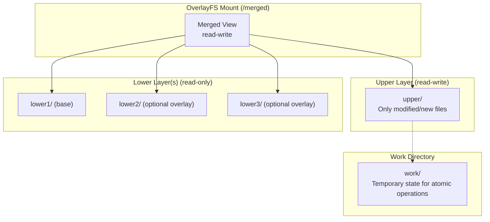
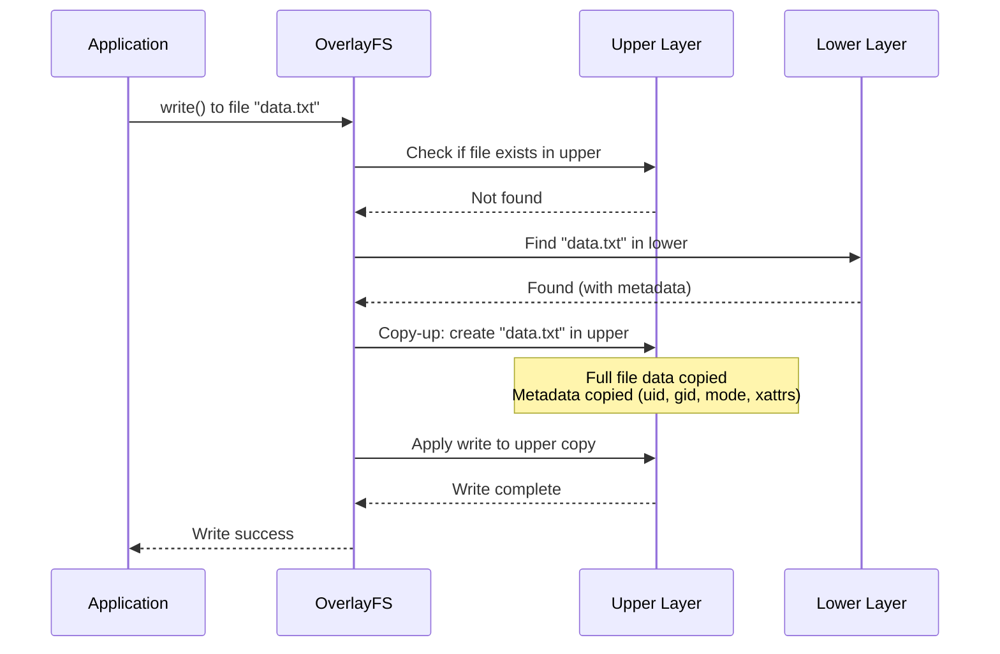
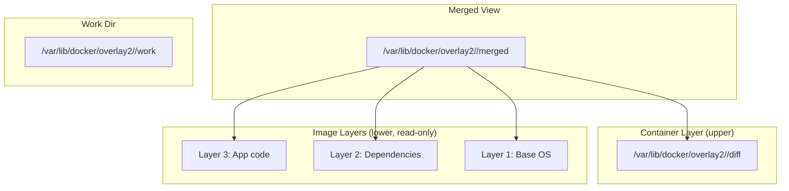

# OverlayFS

## Introduction

OverlayFS (also written as "overlayfs") is a union filesystem for Linux that merges two directory trees — a read-only **lower** layer and a writable **upper** layer — into a single coherent view presented as the **merged** mount. First merged into the mainline kernel in version 3.18 (2014), OverlayFS has become the dominant storage driver for container runtimes (Docker, Podman, containerd) and is widely used in Live CDs, embedded systems, and package management overlays.

The key insight of OverlayFS is that it operates at the directory level rather than the block level. It doesn't virtualize block devices or maintain its own on-disk format — instead, it wraps existing filesystems (ext4, XFS, btrfs, etc.) and presents their contents through a merged directory view.

## Architecture

### Layers

OverlayFS uses three directories on the underlying filesystem:



- **Lower layer(s)**: One or more read-only directory trees. Multiple lower layers are stacked with the first listed being the topmost (highest priority). Typically contains the base OS image.
- **Upper layer**: A single read-write directory tree. All modifications (writes, creates, deletes) are captured here.
- **Work directory**: A temporary directory on the same filesystem as the upper layer, used internally for atomic operations (must not be shared between overlays).
- **Merged view**: The mount point that combines all layers into a single coherent tree.

### Mount Syntax

```bash
# Single lower layer
mount -t overlay overlay \
    -o lowerdir=/lower,upperdir=/upper,workdir=/work \
    /merged

# Multiple lower layers (topmost first)
mount -t overlay overlay \
    -o lowerdir=/lower2:/lower1,upperdir=/upper,workdir=/work \
    /merged
```

**Important**: The `workdir` must be on the same filesystem as `upperdir`, and must be empty. It cannot be shared between different overlay mounts.

## Upper and Lower Layers in Detail

OverlayFS combines two filesystem layers into a single merged view:

- **Lower layer(s)**: One or more read-only directory trees. Multiple lower layers are stacked with the first listed being topmost (highest priority). The lower filesystem does not need to be writable and can even be another OverlayFS. It can be any filesystem supported by Linux that has the necessary features.
- **Upper layer**: A single read-write directory tree that must support the creation of `trusted.*` and/or `user.*` extended attributes and must provide valid `d_type` in `readdir` responses (NFS is not suitable as upper). For a read-only overlay of two read-only filesystems, any filesystem type may be used.

When a name exists in both upper and lower, the upper object is visible. For non-directories, the lower object is hidden. For directories, the upper and lower are **merged** — their name lists are combined, though only the upper directory's metadata and extended attributes are reported.

### Merged Directory Behavior

At mount time, the directories specified by `lowerdir` and `upperdir` are combined:

```bash
mount -t overlay overlay -o lowerdir=/lower,upperdir=/upper,workdir=/work /merged
```

On lookup in a merged directory, OverlayFS searches both actual directories and caches the combined result in the overlay dentry. If both lookups find directories, both are stored and a merged directory is created; otherwise only one is stored (upper takes priority).

### Whiteouts and Opaque Directories

Since lower layers are read-only, OverlayFS uses **whiteouts** and **opaque directories** to record deletions:

- A **whiteout** is created as a character device with 0/0 device number (legacy) or a zero-size regular file with the `trusted.overlay.whiteout` xattr (Linux 5.11+). When found in the upper level, any matching name in the lower level is ignored.
- A directory is made **opaque** by setting `trusted.overlay.opaque=y`. An opaque upper directory completely hides any same-named lower directory.

### rename() and redirect_dir

Renaming a lower-layer or merged directory is handled in two ways:

1. **EXDEV** (default): `rename()` returns EXDEV, and applications (like `mv`) handle it by recursive copy
2. **redirect_dir**: The directory is copied up and a `trusted.overlay.redirect` xattr stores the original path. Configurable via:
   - Kernel config: `OVERLAY_FS_REDIRECT_DIR`
   - Module param: `redirect_dir=BOOL`
   - Mount option: `redirect_dir=on|follow|nofollow|off`

### xino (Extended Inode Numbers)

On 64-bit systems, the `xino` feature composes unique inode identifiers from the real `st_ino` and an underlying fsid, using high inode number bits for fsid. This makes overlay inodes distinguishable from underlying inodes:

```bash
# Enable xino
mount -t overlay overlay -o xino=on,lowerdir=/lower,upperdir=/upper,workdir=/work /merged

# Auto-enable only if persistent st_ino is guaranteed
mount -t overlay overlay -o xino=auto,...
```

## Copy-Up Mechanism

The central operation in OverlayFS is **copy-up**: when a file in a lower layer is modified, OverlayFS first copies it to the upper layer, then applies the modification there. This preserves the read-only nature of lower layers.

### Copy-Up Flow



### Copy-Up Behavior Details

1. **Data copy**: The entire file content is copied, not just the modified bytes. This is a known performance consideration.
2. **Metadata preservation**: Permissions, ownership, timestamps, and extended attributes are copied.
3. **Directory copy-up**: Directories are "created" in the upper layer with `opaque` xattr (`trusted.overlay.opaque=y`) to indicate the directory should completely replace the lower version.
4. **Character/block devices**: Metadata-only copy-up; no data copy needed.
5. **Hard links**: Maintained within the upper layer after copy-up.

### Partial Copy-Up (Linux 4.19+)

For large files, copy-up is expensive. OverlayFS supports **data-only copy-up** where only the metadata layer is created in the upper directory, and the data pages are shared via reflinks or the page cache:

```bash
# With XFS (supports reflinks), copy-up is nearly instant
# The upper file gets a reflink to the lower file's data blocks
# Only modified pages trigger actual data copy
```

## Whiteouts and Deletion

Since lower layers are read-only, "deleting" a lower file requires special markers:

### Whiteout Entries

- **Character device whiteout** (legacy): A character device with 0/0 major/minor in the upper directory at the path of the deleted file.
- **Overlayfs whiteout xattr** (Linux 5.11+): Uses `trusted.overlay.whiteout` extended attribute, avoiding the need for character devices.

```bash
# Create a whiteout manually (educational; don't do this in practice)
mknod /upper/deleted_file c 0 0

# Opaque directory (marks a directory that masks lower layers)
setfattr -n trusted.overlay.opaque -v y /upper/dir
```

### Directory Opaque Flag

When a directory exists in both upper and lower, OverlayFS merges their contents. But if the upper directory should completely replace (hide) the lower one, it's marked `opaque`:

```bash
# This happens automatically when:
# 1. A lower directory is renamed over
# 2. A lower directory is removed and recreated
# 3. OverlayFS needs to mask a lower directory entirely
```

## Container Use Cases

### Docker Storage Driver

Docker's `overlay2` storage driver uses OverlayFS to implement container image layering:



```bash
# Inspect Docker's overlay mounts
$ docker run -d --name test nginx:alpine
$ mount | grep overlay
overlay on /var/lib/docker/overlay2/abc123.../merged type overlay
  (rw,lowerdir=/var/lib/docker/overlay2/l/L1:/var/lib/docker/overlay2/l/L2,
   upperdir=/var/lib/docker/overlay2/abc123.../diff,
   workdir=/var/lib/docker/overlay2/abc123.../work)

# View the layers
$ docker inspect test --format '{{.GraphDriver.Data}}'
```

### Container Image Sharing

Multiple containers can share the same lower layers (image), with each having its own upper layer:

```bash
# Two containers from the same image share the lower layers
$ docker run -d --name c1 nginx:alpine
$ docker run -d --name c2 nginx:alpine
# Both c1 and c2 have the same lowerdir, different upperdir
```

### Live CDs and Embedded Systems

```bash
# SquashFS as lower (read-only compressed image), tmpfs as upper
mount -t squashfs /dev/sr0 /lower
mount -t tmpfs -o size=1G tmpfs /upper
mkdir /upper/data /upper/work
mount -t overlay overlay \
    -o lowerdir=/lower,upperdir=/upper/data,workdir=/upper/work \
    /merged
```

## Performance Considerations

### Copy-Up Overhead

The biggest performance concern is copy-up:

- **Small files**: Negligible overhead.
- **Large files (GBs)**: First write triggers full file copy. Mitigation: use XFS with reflinks.
- **Metadata operations** (chmod, chown): Also trigger copy-up even if data doesn't change.

### Directory Operations

Merging multiple layers for `readdir()` requires OverlayFS to:
1. Read all lower directories
2. Read the upper directory
3. Remove whiteouts from the result
4. Deduplicate entries
5. Return the merged listing

This is slower than native filesystems for directories with many entries across layers.

### Optimization Tips

```bash
# Use XFS with reflinks for upper layer (fast copy-up)
mkfs.xfs -m reflink=1 /dev/sdb1

# Use noatime to reduce metadata copy-ups
mount -t overlay overlay -o noatime,lowerdir=/lower,upperdir=/upper,workdir=/work /merged

# Limit lower layers (fewer = faster merges)
# Each additional lower layer adds overhead
```

## Nested Overlays

OverlayFS supports nesting: an overlay mount can be used as a lower layer of another overlay.

### Restrictions

```bash
# Linux < 5.8: nesting was NOT supported for the upper layer
# Linux >= 5.8: upper can also be an overlay

# Example: overlay as lower layer
mount -t overlay overlay -o lowerdir=/base /overlay1
mount -t overlay overlay -o lowerdir=/overlay1,upperdir=/upper2,workdir=/work2 /merged

# Example: overlay as both lower and upper (5.8+)
mount -t overlay overlay -o lowerdir=/base /overlay1
mount -t overlay overlay -o lowerdir=/base,upperdir=/overlay1,workdir=/work2 /nested
```

### Verification

```bash
# Check kernel version for nesting support
$ uname -r
5.15.0

# Test nesting
$ mkdir -p /base/{a,b} /upper1/{data,work} /upper2/{data,work}
$ echo "base file" > /base/a/base.txt
$ mount -t overlay overlay -o lowerdir=/base,upperdir=/upper1/data,workdir=/upper1/work /mnt/layer1
$ echo "layer1 file" > /mnt/layer1/a/layer1.txt

# Use layer1 as lower for layer2
$ mount -t overlay overlay -o lowerdir=/mnt/layer1,upperdir=/upper2/data,workdir=/upper2/work /mnt/merged
$ ls /mnt/merged/a/
base.txt  layer1.txt
```

## Limitations

1. **No copy-down**: Deleting or modifying files in lower layers is impossible; only upper is writable.
2. **Stale NFS file handles**: After copy-up, lower-layer file handles become stale.
3. **fanotify/inotify**: File watching on overlay mounts has limitations (events from lower layers may not be fully reported).
4. **No page cache sharing between layers**: Files accessed through the overlay get their own page cache entries, separate from direct access to the underlying layers.
5. **xattr support**: Requires the underlying filesystem to support extended attributes.
6. **Filesystem quotas**: Not supported on overlay mounts.
7. **Lower layer modification**: Changing lower layer contents while overlay is mounted can cause inconsistencies.

## Implementation Details

### Key Source Files

- **`fs/overlayfs/super.c`** — Mount/unmount, superblock operations
- **`fs/overlayfs/dir.c`** — Directory operations (lookup, readdir, rename)
- **`fs/overlayfs/file.c`** — File operations (read, write, mmap)
- **`fs/overlayfs/copy_up.c`** — Copy-up implementation
- **`fs/overlayfs/util.c`** — Utility functions

### OVL Inode Structure

```c
/* Simplified from fs/overlayfs/ovl_entry.h */
struct ovl_inode {
    struct inode vfs_inode;        /* VFS inode */
    struct dentry *upperdentry;    /* Upper layer dentry (NULL if lower only) */
    struct ovl_entry *oe;          /* Lower layer entries */
    loff_t i_size;                 /* Cached size */
    unsigned long flags;           /* OVL_* flags */
    struct inode *lowerdata;       /* Real inode for data (if redirected) */
};
```

## References

- [OverlayFS kernel documentation](https://www.kernel.org/doc/html/latest/filesystems/overlayfs.html)
- [Docker overlay2 storage driver](https://docs.docker.com/storage/storagedriver/overlayfs-driver/)
- [OverlayFS design document](https://git.kernel.org/pub/scm/linux/kernel/git/torvalds/linux.git/plain/Documentation/filesystems/overlayfs.rst)

## Further Reading

- [The Linux Kernel Documentation](https://docs.kernel.org/)
- [GNU Project Documentation](https://www.gnu.org/doc/doc.html)
- [GNU Manuals](https://www.gnu.org/manual/manual.html)
- [Free Software Directory](https://directory.fsf.org/wiki/Main_Page)
- [Planet GNU](https://planet.gnu.org/)
- [Free Software Books](https://www.gnu.org/doc/other-free-books.html)

- https://www.kernel.org/doc/html/latest/filesystems/overlayfs.html
- https://docs.kernel.org/filesystems/overlayfs.html — Official kernel OverlayFS documentation
- https://man7.org/linux/man-pages/man5/overlayfs.5.html (mount options)
- https://lwn.net/Articles/396439/ — "An union filesystem for Linux"
- https://lwn.net/Articles/612930/ — "Overlayfs: improvements and more"
- https://docs.docker.com/storage/storagedriver/select-storage-driver/

## Related Topics

- [tmpfs](./tmpfs.md) — Often used as the upper layer for ephemeral overlays
- [mounting](./mounting.md) — Mount system calls and mount namespaces used by overlay
- [superblock](./superblock.md) — How OverlayFS manages its superblock
- [inode](./inode.md) — OVL inode management and VFS integration
