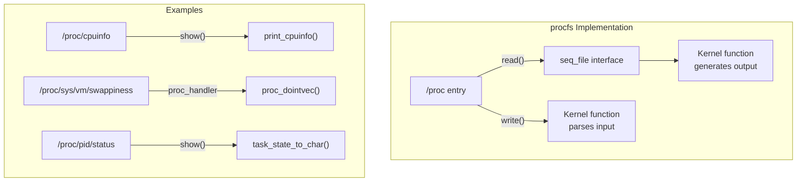

# procfs (/proc Filesystem)

## Introduction

The proc filesystem (procfs) is a special pseudo-filesystem in Linux that provides a window into
the kernel's internal data structures. Mounted at `/proc`, it doesn't represent actual files on
disk — instead, it dynamically generates content when files are read and accepts input when files
are written. procfs is the primary mechanism for userspace tools to query and configure kernel
parameters, process information, hardware details, and system statistics.

Originally derived from Unix's `/proc` (which only contained process information), the Linux
version has expanded enormously to encompass kernel tunables, network statistics, memory management
parameters, device information, and much more. Tools like `ps`, `top`, `free`, `lscpu`, and
`sysctl` all read from `/proc`.

## Architecture

### Mounting

```bash
# View proc mount
$ mount | grep proc
proc on /proc type proc (rw,nosuid,nodev,noexec,relatime)

# Mount options
# hidepid=0: All /proc/PID visible to all users (default)
# hidepid=1: Hide processes owned by other users
# hidepid=2: Like 1, but also hide /proc/PID directories
# gid=GID: Group that can access all PIDs regardless of hidepid
$ sudo mount -o remount,hidepid=2,gid=proc /proc
```

### Implementation

procfs is implemented as a kernel module (`fs/proc/`). Each file/directory under `/proc` is backed
by kernel functions that generate content on demand:



The `proc_dir_entry` structure represents each entry:

```c
struct proc_dir_entry {
    unsigned int        low_ino;
    umode_t             mode;
    nlink_t             nlink;
    kuid_t              uid;
    kgid_t              gid;
    loff_t              size;
    const struct proc_ops *proc_ops;  /* Operations */
    const struct inode_operations *proc_iops;
    union {
        const struct seq_operations *seq_ops;
        int (*single_show)(struct seq_file *, void *);
    };
    proc_write_t        write;
    void                *data;
    unsigned int        state_size;
    unsigned int        parent_ino;
    atomic_t            count;
    struct rb_node      subdir_node;
    struct rb_root      subdir;
    struct proc_dir_entry *parent;
    struct rb_root      name_rb;
    /* ... */
};
```

## /proc/pid/* — Process Information

Each running process has a directory `/proc/<pid>/` containing detailed information:

```bash
$ ls /proc/self/
attr/        cmdline      comm         coredump_filter  cpu/
cwd -> /proc exe -> /usr/bin/ls  fd/     fdinfo/     gid_map
io           limits       map_files/   maps         mem
mountinfo    mounts       net/         ns/          oom_adj
oom_score    oom_score_adj  pagemap   personality  root -> /
sched        sessionid    setgroups    smaps        smaps_rollup
stack        stat         statm        status       syscall
task/        timers       timerslack_ns  uid_map    wchan
```

### Key Process Files

#### `/proc/pid/status` — Process Status Summary

```bash
$ cat /proc/self/status
Name:   cat
Umask:  0022
State:  R (running)
Tgid:   12345
Ngid:   0
Pid:    12345
PPid:   12340
TracerPid:  0
Uid:    1000    1000    1000    1000
Gid:    1000    1000    1000    1000
FDSize: 256
Groups: 4 24 27 30 46 109 1000
NStgid: 12345
NSpid:  12345
NSpgid: 12345
NSsid:  12340
VmPeak:   132456 kB
VmSize:   132456 kB
VmLck:         0 kB
VmPin:      1234 kB
VmHWM:      4567 kB
VmRSS:      4567 kB
RssAnon:    1234 kB
RssFile:    3333 kB
RssShmem:      0 kB
VmData:    12345 kB
VmStk:       136 kB
VmExe:        64 kB
VmLib:      2048 kB
VmPTE:        88 kB
VmSwap:        0 kB
Threads:    1
SigQ:   0/12345
SigPnd: 0000000000000000
ShdPnd: 0000000000000000
SigBlk: 0000000000000000
SigIgn: 0000000000000000
SigCgt: 0000000000000000
CapInh: 0000000000000000
CapPrm: 0000000000000000
CapEff: 0000000000000000
CapBnd: 0000003fffffffff
CapAmb: 0000000000000000
NoNewPrivs: 0
Seccomp:    0
Seccomp_filters: 0
Speculation_Store_Bypass:   thread vulnerable
Cpus_allowed:   ffffffff
Cpus_allowed_list:  0-31
Mems_allowed:   00000000,00000000,00000000,00000001
Mems_allowed_list:  0
voluntary_ctxt_switches:    123
nonvoluntary_ctxt_switches: 45
```

#### `/proc/pid/maps` — Memory Maps

```bash
$ cat /proc/self/maps
address           perms offset  dev   inode       pathname
00400000-0040b000 r-xp 00000000 08:01 1234567     /usr/bin/cat
0060a000-0060b000 r--p 0000a000 08:01 1234567     /usr/bin/cat
0060b000-0060c000 rw-p 0000b000 08:01 1234567     /usr/bin/cat
7f1234567000-7f1234589000 r-xp 00000000 08:01 2345678 /usr/lib/libc-2.31.so
7f1234589000-7f1234789000 ---p 00022000 08:01 2345678 /usr/lib/libc-2.31.so
7f1234789000-7f123478d000 r--p 00022000 08:01 2345678 /usr/lib/libc-2.31.so
7f123478d000-7f123478f000 rw-p 00026000 08:01 2345678 /usr/lib/libc-2.31.so
7f123478f000-7f1234795000 rw-p 00000000 00:00 0
7ffd12345000-7ffd12367000 rw-p 00000000 00:00 0          [stack]
7ffd12378000-7ffd1237b000 r--p 00000000 00:00 0          [vvar]
7ffd1237b000-7ffd1237c000 r-xp 00000000 00:00 0          [vdso]
ffffffffff600000-ffffffffff601000 r-xp 00000000 00:00 0  [vsyscall]
```

#### `/proc/pid/fd/` — File Descriptors

```bash
$ ls -la /proc/self/fd
total 0
lrwx------ 1 user user 64 Jan 15 10:00 0 -> /dev/pts/0
lrwx------ 1 user user 64 Jan 15 10:00 1 -> /dev/pts/0
lrwx------ 1 user user 64 Jan 15 10:00 2 -> /dev/pts/0
lr-x------ 1 user user 64 Jan 15 10:00 3 -> /proc/12345/fd

# Count open files for a process
$ ls /proc/1234/fd | wc -l

# Find which process has a file open
$ sudo ls -la /proc/*/fd 2>/dev/null | grep deleted
```

#### `/proc/pid/io` — I/O Statistics

```bash
$ cat /proc/self/io
rchar: 3216       # Bytes read (including from cache)
wchar: 0          # Bytes written
syscr: 5          # Read syscalls
syscw: 0          # Write syscalls
read_bytes: 0     # Bytes actually read from storage
write_bytes: 0    # Bytes actually written to storage
cancelled_write_bytes: 0
```

#### `/proc/pid/smaps` — Detailed Memory Maps

```bash
$ cat /proc/self/smaps | head -30
00400000-0040b000 r-xp 00000000 08:01 1234567     /usr/bin/cat
Size:                 44 kB
KernelPageSize:        4 kB
MMUPageSize:           4 kB
Rss:                  44 kB
Pss:                  44 kB
Shared_Clean:          0 kB
Shared_Dirty:          0 kB
Private_Clean:        44 kB
Private_Dirty:         0 kB
Referenced:           44 kB
Anonymous:             0 kB
LazyFree:              0 kB
AnonHugePages:         0 kB
ShmemPmdMapped:        0 kB
Shared_Hugetlb:        0 kB
Private_Hugetlb:       0 kB
Swap:                  0 kB
SwapPss:               0 kB
Locked:                0 kB
THPeligible:           0
ProtectionKey:         0
VmFlags: rd ex mr mw me dw
```

#### `/proc/pid/ns/` — Namespaces

```bash
$ ls -la /proc/self/ns/
total 0
lrwxrwxrwx 1 user user 0 Jan 15 10:00 cgroup -> 'cgroup:[4026531835]'
lrwxrwxrwx 1 user user 0 Jan 15 10:00 ipc -> 'ipc:[4026531839]'
lrwxrwxrwx 1 user user 0 Jan 15 10:00 mnt -> 'mnt:[4026531841]'
lrwxrwxrwx 1 user user 0 Jan 15 10:00 net -> 'net:[4026531840]'
lrwxrwxrwx 1 user user 0 Jan 15 10:00 pid -> 'pid:[4026531836]'
lrwxrwxrwx 1 user user 0 Jan 15 10:00 pid_for_children -> 'pid:[4026531836]'
lrwxrwxrwx 1 user user 0 Jan 15 10:00 user -> 'user:[4026531837]'
lrwxrwxrwx 1 user user 0 Jan 15 10:00 uts -> 'uts:[4026531838]'
```

## /proc/sys/* — Kernel Tunables

The `/proc/sys/` hierarchy exposes kernel parameters that can be read and often written:

### Virtual Memory (`/proc/sys/vm/`)

```bash
$ ls /proc/sys/vm/
block_dump           dirty_expire_centisecs  min_free_kbytes
compact_memory       dirty_ratio             mmap_min_addr
dirty_background_bytes  dirty_writeback_centisecs  nr_hugepages
dirty_background_ratio  drop_caches           nr_overcommit_hugepages
dirty_bytes          extfrag_threshold       oom_dump_tasks
dirty_expire_interval  hugepages_tlb        oom_kill_allocating_task
                    _backend               overcommit_memory
                    ms                     overcommit_ratio
                     swappiness            vfs_cache_pressure
                     watermark_boost_factor
                     watermark_scale_factor
```

#### Key VM Tunables

```bash
# Swappiness (0-200): How aggressively to swap
$ cat /proc/sys/vm/swappiness
60
$ echo 10 > /proc/sys/vm/swappiness

# Dirty ratio: % of memory that can be dirty before sync writes
$ cat /proc/sys/vm/dirty_ratio
20

# Dirty background ratio: % of memory for background writeback
$ cat /proc/sys/vm/dirty_background_ratio
10

# VFS cache pressure: how aggressively to reclaim dentry/inode cache
$ cat /proc/sys/vm/vfs_cache_pressure
100

# Overcommit memory policy
$ cat /proc/sys/vm/overcommit_memory
0  # 0=heuristic, 1=always, 2=strict

# Drop caches (1=pagecache, 2=dentries/inodes, 3=both)
$ echo 3 > /proc/sys/vm/drop_caches

# Minimum free memory
$ cat /proc/sys/vm/min_free_kbytes
67584
```

### Kernel Parameters (`/proc/sys/kernel/`)

```bash
# Hostname
$ cat /proc/sys/kernel/hostname
myserver

# Maximum PID value
$ cat /proc/sys/kernel/pid_max
4194304

# SysRq key (emergency operations)
$ cat /proc/sys/kernel/sysrq
176  # bitmask of allowed operations

# Enable SysRq
$ echo 1 > /proc/sys/kernel/sysrq

# Panic timeout (auto-reboot after panic)
$ echo 60 > /proc/sys/kernel/panic

# Shared memory max
$ cat /proc/sys/kernel/shmmax
18446744073692774399

# Message queue limits
$ cat /proc/sys/kernel/msgmnb
16384
$ cat /proc/sys/kernel/msgmax
8192
```

### Network Parameters (`/proc/sys/net/`)

```bash
$ ls /proc/sys/net/
core/  ipv4/  ipv6/  netfilter/  unix/

# TCP/IP tuning
$ cat /proc/sys/net/ipv4/tcp_fin_timeout
60

$ cat /proc/sys/net/ipv4/tcp_max_syn_backlog
1024

$ cat /proc/sys/net/core/somaxconn
4096

# Enable IP forwarding
$ echo 1 > /proc/sys/net/ipv4/ip_forward

# Increase connection tracking table size
$ echo 262144 > /proc/sys/net/netfilter/nf_conntrack_max

# TCP buffer sizes
$ cat /proc/sys/net/ipv4/tcp_rmem
4096    131072  6291456
$ cat /proc/sys/net/ipv4/tcp_wmem
4096    16384   4194304
```

### File System Parameters (`/proc/sys/fs/`)

```bash
$ ls /proc/sys/fs/
aio-max-nr       file-max         inotify      pipe-user-pages-hard
aio-nr           file-nr          lease-break-time  pipe-user-pages-max
binfmt_misc/     inode-nr         leases-enable     protected_fifos
dentry-state     inode-state      mount-max         protected_hardlinks
epoll            mqueue/          nr_open           protected_regular
                 overflowgid      protected_symlinks
                 overflowuid      suid_dumpable

# Maximum open files system-wide
$ cat /proc/sys/fs/file-max
9223372036854775807

# Current open files
$ cat /proc/sys/fs/file-nr
12345   0   9223372036854775807

# Inode cache stats
$ cat /proc/sys/fs/inode-nr
24832   134

# Maximum inotify instances and watches
$ cat /proc/sys/fs/inotify/max_user_instances
128
$ cat /proc/sys/fs/inotify/max_user_watches
65536
```

## System Information Files

### `/proc/cpuinfo`

```bash
$ cat /proc/cpuinfo
processor   : 0
vendor_id   : GenuineIntel
cpu family  : 6
model       : 142
model name  : Intel(R) Core(TM) i7-8550U CPU @ 1.80GHz
stepping    : 10
microcode   : 0xca
cpu MHz     : 1800.000
cache size  : 8192 KB
physical id : 0
siblings    : 8
core id     : 0
cpu cores   : 4
apicid      : 0
initial apicid  : 0
fpu     : yes
fpu_exception   : yes
cpuid level : 22
wp      : yes
flags       : fpu vme de pse tsc msr pae mce cx8 apic sep mtrr pge mca
              cmov pat pse36 clflush dts acpi mmx fxsr sse sse2 ss ht tm
              pbe syscall nx pdpe1gb rdtscp lm constant_tsc art arch_perfmon
              pebs bts rep_good nopl xtopology nonstop_tsc cpuid aperfmperf
              pni pclmulqdq dtes64 monitor ds_cpl vmx est tm2 ssse3 sdbg
              fma cx16 xtpr pdcm pcid sse4_1 sse4_2 x2apic movbe popcnt
              tsc_deadline_timer aes xsave avx f16c rdrand lahf_lm abm
              3dnowprefetch cpuid_fault invpcid_single ssbd ibrs ibpb stibp
              tpr_shadow vnmi flexpriority ept vpid ept_ad fsgsbase tsc_adjust
              bmi1 avx2 smep bmi2 erms invpcid xsaveopt dtherm ida arat pln
              pts hwp hwp_notify hwp_act_window hwp_epp md_clear flush_l1d
bogomips    : 3984.00
clflush size    : 64
cache_alignment : 64
address sizes   : 39 bits physical, 48 bits virtual
power management:
```

### `/proc/meminfo`

```bash
$ cat /proc/meminfo
MemTotal:       16384000 kB
MemFree:         8192000 kB
MemAvailable:   12288000 kB
Buffers:          512000 kB
Cached:          3072000 kB
SwapCached:            0 kB
Active:          4096000 kB
Inactive:        2048000 kB
Active(anon):    1024000 kB
Inactive(anon):   512000 kB
Active(file):    3072000 kB
Inactive(file):  1536000 kB
Unevictable:          0 kB
Mlocked:              0 kB
SwapTotal:       2097152 kB
SwapFree:        2097152 kB
Zswap:                 0 kB
Zswapped:              0 kB
Dirty:             12345 kB
Writeback:             0 kB
AnonPages:       1536000 kB
Mapped:           768000 kB
Shmem:            256000 kB
KReclaimable:    1024000 kB
Slab:             512000 kB
SReclaimable:     384000 kB
SUnreclaim:       128000 kB
KernelStack:       16384 kB
PageTables:        32768 kB
NFS_Unstable:          0 kB
Bounce:                0 kB
WritebackTmp:          0 kB
CommitLimit:    10289152 kB
Committed_AS:    6144000 kB
VmallocTotal:   34359738367 kB
VmallocUsed:       65536 kB
VmallocChunk:          0 kB
Percpu:             4096 kB
HardwareCorrupted:     0 kB
AnonHugePages:         0 kB
ShmemHugePages:        0 kB
ShmemPmdMapped:        0 kB
FileHugePages:         0 kB
FilePmdMapped:         0 kB
CmaTotal:              0 kB
CmaFree:               0 kB
HugePages_Total:       0
HugePages_Free:        0
HugePages_Rsvd:        0
HugePages_Surp:        0
Hugepagesize:       2048 kB
Hugetlb:               0 kB
DirectMap4k:      524288 kB
DirectMap2M:    16252928 kB
DirectMap1G:     1048576 kB
```

### `/proc/mounts` and `/proc/self/mountinfo`

```bash
$ cat /proc/mounts
sysfs /sys sysfs rw,nosuid,nodev,noexec,relatime 0 0
proc /proc proc rw,nosuid,nodev,noexec,relatime 0 0
devtmpfs /dev devtmpfs rw,nosuid,size=8192k,nr_inodes=2048000 0 0
/dev/sda1 / ext4 rw,relatime,errors=remount-ro 0 0

# More detailed mount info
$ cat /proc/self/mountinfo | head -5
22 1 0:21 / /sys rw,nosuid,nodev,noexec,relatime shared:7 - sysfs sysfs rw
23 1 0:22 / /proc rw,nosuid,nodev,noexec,relatime shared:12 - proc proc rw
```

## Creating proc Entries (Kernel Module)

Kernel modules can create their own entries under `/proc`:

```c
#include <linux/module.h>
#include <linux/proc_fs.h>
#include <linux/seq_file.h>

static int my_proc_show(struct seq_file *m, void *v)
{
    seq_printf(m, "Hello from my proc entry!\n");
    seq_printf(m, "Current jiffies: %lu\n", jiffies);
    return 0;
}

static int my_proc_open(struct inode *inode, struct file *file)
{
    return single_open(file, my_proc_show, NULL);
}

static ssize_t my_proc_write(struct file *file, const char __user *buf,
                              size_t count, loff_t *ppos)
{
    char kbuf[64];
    if (count > sizeof(kbuf) - 1)
        return -EINVAL;
    if (copy_from_user(kbuf, buf, count))
        return -EFAULT;
    kbuf[count] = '\0';
    pr_info("proc write: %s\n", kbuf);
    return count;
}

static const struct proc_ops my_proc_ops = {
    .proc_open    = my_proc_open,
    .proc_read    = seq_read,
    .proc_write   = my_proc_write,
    .proc_lseek   = seq_lseek,
    .proc_release = single_release,
};

static struct proc_dir_entry *my_entry;

static int __init my_init(void)
{
    /* Create /proc/my_entry */
    my_entry = proc_create("my_entry", 0666, NULL, &my_proc_ops);
    if (!my_entry)
        return -ENOMEM;

    /* Create /proc/mydir/my_entry (subdirectory) */
    proc_mkdir("mydir", NULL);
    proc_create("my_entry2", 0444, NULL, &my_proc_ops);

    return 0;
}

static void __exit my_exit(void)
{
    proc_remove(my_entry);
    remove_proc_entry("mydir", NULL);
}

module_init(my_init);
module_exit(my_exit);
MODULE_LICENSE("GPL");
```

### seq_file Interface

For files that produce more than one page of output, use the `seq_file` interface:

```c
static void *my_seq_start(struct seq_file *m, loff_t *pos)
{
    if (*pos >= MAX_ITEMS)
        return NULL;
    return pos;
}

static void *my_seq_next(struct seq_file *m, void *v, loff_t *pos)
{
    (*pos)++;
    if (*pos >= MAX_ITEMS)
        return NULL;
    return pos;
}

static void my_seq_stop(struct seq_file *m, void *v)
{
    /* Nothing to do */
}

static int my_seq_show(struct seq_file *m, void *v)
{
    loff_t *pos = v;
    seq_printf(m, "Item %lld\n", *pos);
    return 0;
}

static const struct seq_operations my_seq_ops = {
    .start = my_seq_start,
    .next  = my_seq_next,
    .stop  = my_seq_stop,
    .show  = my_seq_show,
};
```

## procfs Security

### hidepid Mount Option

```bash
# Hide other users' processes
$ sudo mount -o remount,hidepid=2 /proc

# Users can only see their own processes
$ ps aux
# Only shows current user's processes
```

### Proc File Permissions

```c
/* Restrict access to proc entries */
proc_create("sensitive_data", 0600, parent_dir, &my_ops);

/* Only root-readable */
proc_create("root_only", 0400, parent_dir, &my_ops);
```

### Yama LSM and ptrace_scope

```bash
# Control process tracing permissions
$ cat /proc/sys/kernel/yama/ptrace_scope
0  # Classic: any process can trace any process with same UID
1  # Restricted: only parent can trace child
2  # Admin-only: only root can trace
3  # No tracing at all
```

## Practical Examples

### System Monitoring

```bash
# CPU usage per core (from /proc/stat)
$ cat /proc/stat | head -5
cpu  12345 0 67890 12345678 1234 0 567 0 0 0
cpu0 3086 0 16972 3086419 310 0 142 0 0 0
cpu1 3086 0 16972 3086419 310 0 142 0 0 0
cpu2 3086 0 16972 3086419 310 0 142 0 0 0
cpu3 3086 0 16972 3086419 310 0 142 0 0 0

# Network statistics
$ cat /proc/net/dev
Inter-|   Receive                                                |  Transmit
 face |bytes    packets errs drop fifo frame compressed multicast|bytes    packets errs drop fifo frame compressed
    lo: 1234567  12345    0    0    0     0          0         0  1234567  12345    0    0    0     0       0
  eth0: 9876543  98765    0    0    0     0          0         0  5678901  56789    0    0    0     0       0

# Load average
$ cat /proc/loadavg
0.52 0.48 0.45 1/456 12345

# Uptime
$ cat /proc/uptime
123456.78 234567.89
```

### Process Inspection

```bash
# Get process command line
$ cat /proc/1/cmdline | tr '\0' ' '
/sbin/init splash

# Get environment variables
$ cat /proc/1/environ | tr '\0' '\n'

# Get process limits
$ cat /proc/1/limits
Limit                     Soft Limit           Hard Limit           Units
Max cpu time              unlimited            unlimited            seconds
Max file size             unlimited            unlimited            bytes
Max data size             unlimited            unlimited            bytes
Max stack size            8388608              unlimited            bytes
Max core file size        0                    unlimited            bytes
Max resident set          unlimited            unlimited            bytes
Max processes             123456               123456               processes
Max open files            1024                 1048576              files
Max locked memory         67108864             67108864             bytes
Max address space         unlimited            unlimited            bytes
Max file locks            unlimited            unlimited            locks
Max pending signals       123456               123456               signals
Max msgqueue size         819200               819200               bytes
Max nice priority         0                    0
Max realtime priority     0                    0
Max realtime timeout      unlimited            unlimited            us
```

### Sysctl Compatibility

The `sysctl` command reads from `/proc/sys/`:

```bash
# Read a parameter
$ sysctl vm.swappiness
vm.swappiness = 60

# Set a parameter
$ sudo sysctl -w vm.swappiness=10

# Read all parameters
$ sysctl -a | wc -l
1234

# Persist parameters in /etc/sysctl.conf
$ echo "vm.swappiness = 10" | sudo tee -a /etc/sysctl.conf
$ sudo sysctl -p
```

## Performance Considerations

Reading `/proc` files has overhead because content is generated dynamically:

```bash
# Benchmark: reading /proc files
$ time for i in $(seq 1 10000); do cat /proc/cpuinfo > /dev/null; done
real    0m5.123s
user    0m1.234s
sys     0m3.889s

# /proc is much slower than regular files for repeated reads
$ time for i in $(seq 1 10000); do cat /tmp/regular_file > /dev/null; done
real    0m0.567s
```

### Mitigations

1. **Cache results**: Don't read `/proc` files in tight loops
2. **Use netlink**: For network statistics, netlink sockets are more efficient
3. **Use `/proc/pid/fdinfo`**: For per-fd info, more targeted than reading whole status files
4. **Poll selectively**: Use `poll()`/`select()` on proc files that support it

## Further Reading

- [The Linux Kernel Documentation](https://docs.kernel.org/)
- [GNU Project Documentation](https://www.gnu.org/doc/doc.html)
- [GNU Manuals](https://www.gnu.org/manual/manual.html)
- [Free Software Directory](https://directory.fsf.org/wiki/Main_Page)
- [Planet GNU](https://planet.gnu.org/)
- [Free Software Books](https://www.gnu.org/doc/other-free-books.html)

- [proc(5) man page](https://man7.org/linux/man-pages/man5/proc.5.html) — Comprehensive proc documentation
- [Linux kernel: fs/proc/](https://elixir.bootlin.com/linux/latest/source/fs/proc) — procfs source code
- [Linux kernel: Documentation/filesystems/proc.rst](https://www.kernel.org/doc/html/latest/filesystems/proc.html) — Official proc documentation
- [The /proc filesystem (tldp.org)](https://tldp.org/LDP/Linux-Filesystem-Hierarchy/html/proc.html) — TLDP guide
- [LWN: The /proc filesystem](https://lwn.net/Articles/229740/) — procfs internals

## Related Topics

- [VFS](./vfs.md) — The virtual filesystem layer that procfs sits on
- [sysfs](./sysfs.md) — The /sys filesystem (device model)
- [Inode](./inode.md) — procfs creates dynamic inodes
- [Dentry](./dentry.md) — procfs dentries are created dynamically
