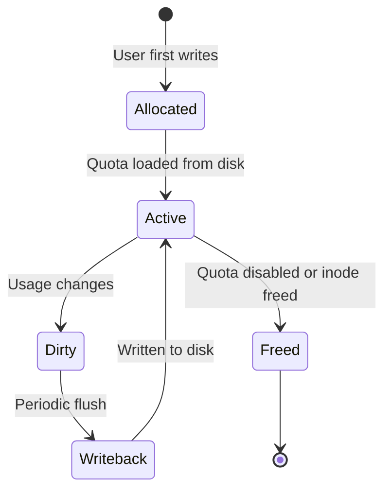

# Quota

## Overview

**Disk quota** is a mechanism for limiting the amount of disk space and number of inodes a user or group can consume on a filesystem. The Linux kernel provides a **VFS quota** subsystem that individual filesystems implement through well-defined operations.

Quotas are essential for multi-user systems, shared hosting environments, and any scenario where fair resource allocation is required.

> **See also:** [ext4 Filesystem](./ext4.md), [XFS Filesystem](./xfs.md), [VFS Layer](./vfs.md)

---

## VFS Quota Architecture

### Core Subsystem

The VFS quota layer lives in `fs/quota/` and provides:

- **Generic quota operations** — `dquot_operations` interface
- **Quota on/off control** — `quotactl()` syscall
- **Quota format plugins** — VFS v0, v1, v2 formats
- **Accounting** — Block and inode usage tracking per ID

```
┌─────────────────────────────────────────┐
│             Userspace                    │
│   quotaon/quotaoff/repquota/quota tools  │
└──────────────────┬──────────────────────┘
                   │ quotactl() syscall
┌──────────────────▼──────────────────────┐
│            VFS Quota Layer               │
│  fs/quota/dquot.c — generic operations  │
│  fs/quota/quota.c — quotactl handler    │
└──────────────────┬──────────────────────┘
                   │ dquot_operations
         ┌─────────┴─────────┐
         │                   │
    ┌────▼────┐         ┌────▼────┐
    │  ext4   │         │  XFS    │
    │ quota   │         │  quota  │
    └─────────┘         └─────────┘
```

### struct dquot

Each quota entry is represented by a `struct dquot`:

```c
struct dquot {
    struct hlist_node dq_hash;     /* Hash table linkage */
    struct list_head dq_inuse;     /* In-use list */
    struct list_head dq_free;      /* Free list */
    struct super_block *dq_sb;     /* Owning superblock */
    struct kqid dq_id;             /* User or group ID */
    qsize_t dq_dqb[MAXQUOTAS];    /* Block and inode usage */
    /* ... */
};
```

### Quota Types

| Type           | Constant      | Tracks                     |
|----------------|---------------|----------------------------|
| User quota     | `USRQUOTA`    | Per-user block/inode usage |
| Group quota    | `GRPQUOTA`    | Per-group block/inode usage|
| Project quota  | `PRJQUOTA`    | Per-project usage (XFS, ext4) |

---

## The quotactl() System Call

All quota management from userspace goes through `quotactl()`:

```c
#include <sys/quota.h>

int quotactl(int cmd, const char *special, int id, caddr_t addr);
```

### Command Codes

| Command         | Description                            |
|-----------------|----------------------------------------|
| `Q_QUOTAON`     | Enable quotas on a filesystem          |
| `Q_QUOTAOFF`    | Disable quotas                         |
| `Q_GETQUOTA`    | Get quota limits for a specific ID     |
| `Q_SETQUOTA`    | Set quota limits for a specific ID     |
| `Q_SETUSE`      | Set current usage (admin only)         |
| `Q_GETFMT`      | Get quota format version               |
| `Q_SYNC`        | Flush quota info to disk               |
| `Q_GETSTATS`    | Get filesystem-wide quota statistics   |
| `Q_GETINFO`     | Get quota info (grace times, etc.)     |
| `Q_SETINFO`     | Set grace times                        |

### Example: Query User Quota

```c
#include <stdio.h>
#include <sys/quota.h>

int main(void)
{
    struct dqblk dq;

    if (quotactl(QCMD(Q_GETQUOTA, USRQUOTA), "/dev/sda1",
                 1000, (caddr_t)&dq) < 0) {
        perror("quotactl");
        return 1;
    }

    printf("Blocks: used=%llu soft=%llu hard=%llu\n",
           (unsigned long long)dq.dqb_curspace,
           (unsigned long long)dq.dqb_bsoftlimit,
           (unsigned long long)dq.dqb_bhardlimit);
    return 0;
}
```

---

## ext4 Quota

### Features

- Supports **user**, **group**, and **project** quotas (since kernel 4.13)
- Quota files stored as hidden files in the filesystem root
- Integrates with journaled quota for consistency

### Enabling Quotas

```bash
# Create quota files (traditional method)
quotacheck -cugm /home

# Enable quotas
quotaon -ug /home

# Or mount with quota options
mount -o usrquota,grpquota /dev/sda1 /home
```

### Persistent Configuration (/etc/fstab)

```
/dev/sda1  /home  ext4  defaults,usrquota,grpquota  0 2
```

### Project Quotas on ext4

Project quotas allow grouping directories/files under a single quota regardless of user/group ownership:

```bash
# Enable project quota support
tune2fs -O project /dev/sda1

# Define a project
echo "100:/data/projects/webapp" >> /etc/projects
echo "webapp:100" >> /etc/projid

# Set limits
edquota -p webapp -f /home
```

### Journaled Quota

ext4 can store quota information in the journal for crash consistency:

```bash
tune2fs -O quota /dev/sda1
# Quota info is automatically journaled
```

---

## XFS Quota

XFS has its own quota implementation, historically more mature than ext4's:

### XFS Quota Types

| Type     | Mount Option  | Description                  |
|----------|--------------|------------------------------|
| User     | `uquota`     | Per-user limits              |
| Group    | `gquota`     | Per-group limits             |
| Project  | `pquota`     | Per-project limits           |
| Account  | `account`    | Accounting only (no limits)  |

### Enabling XFS Quotas

```bash
# Mount with all quota types
mount -o uquota,gquota,pquota /dev/sdb1 /data

# Or remount an existing filesystem
mount -o remount,uquota /data
```

### XFS Quota Commands

```bash
# Set user quota (blocks in 1K units)
xfs_quota -x -c 'limit bsoft=500m bhard=600m user1' /data

# Set inode limits
xfs_quota -x -c 'limit isoft=5000 ihard=6000 user1' /data

# Report usage
xfs_quota -x -c 'report -h' /data

# Project quota setup
xfs_quota -x -c 'project -s webapp' /data
xfs_quota -x -c 'limit bsoft=1g bhard=2g webapp' /data
```

### XFS vs ext4 Quota Differences

| Feature                | XFS                          | ext4                        |
|------------------------|------------------------------|-----------------------------|
| Implementation         | Native XFS quota subsystem   | VFS quota generic layer     |
| Project quota support  | Long-standing (since XFS inception) | Since kernel 4.13      |
| Realtime subvolume     | Separate quota accounting    | N/A                         |
| Grace periods          | Per-ID per-type              | Per-type only               |
| Enforcement            | Real-time, at allocation     | Delayed (allocation-time)   |

---

## Project Quota

### Concept

Project quotas provide a way to enforce disk limits on a **directory tree** independent of who owns the files. This is valuable for:

- Multi-tenant environments (limiting per-customer storage)
- Container rootfs size control
- Application-specific storage limits

### Setup (ext4)

```bash
# 1. Enable project quota feature
tune2fs -O project /dev/sda1

# 2. Assign project IDs via /etc/projid
echo "webapp:100" >> /etc/projid
echo "database:101" >> /etc/projid

# 3. Map directories to projects via /etc/projects
echo "100:/var/www/webapp" >> /etc/projects
echo "101:/var/lib/mysql" >> /etc/projects

# 4. Enable project quota
mount -o prjquota /dev/sda1 /mnt

# 5. Set limits
edquota -p webapp -f /mnt
```

### Setup (XFS)

```bash
# XFS uses xfs_quota directly
xfs_quota -x -c 'project -s webapp /var/www/webapp' /data
xfs_quota -x -c 'limit bhard=10g webapp' /data
```

---

## Quota Files and Metadata

### Traditional Quota Files

| File (ext2/3/4) | Purpose                    |
|------------------|----------------------------|
| `aquota.user`    | User quota database        |
| `aquota.group`   | Group quota database       |

### Modern Quota (Hidden Inodes)

In ext4 with `QUOTA` feature, quota data is stored in hidden inodes:

```bash
# View hidden quota inodes
debugfs -R 'stat <8>' /dev/sda1   # User quota inode
debugfs -R 'stat <9>' /dev/sda1   # Group quota inode
```

### Quota Format Versions

| Format  | Description                                     |
|---------|-------------------------------------------------|
| v0      | Original quota format (legacy)                  |
| v1      | 32-bit UID/GID support                          |
| v2      | 64-bit space accounting, grace time tracking    |

---

## Grace Times

When a user exceeds a **soft limit**, a grace period begins. If usage remains above the soft limit beyond the grace period, the soft limit is enforced as a hard limit.

```bash
# Set grace times
setquota -u user1 --block-grace 86400 --inode-grace 604800 /home

# View current grace times
repquota -s /home

# Or via quotactl()
struct dqinfo info;
quotactl(QCMD(Q_GETINFO, USRQUOTA), "/dev/sda1", 0, (caddr_t)&info);
printf("Block grace: %u seconds\n", info.dqi_bgrace);
```

### Default Grace Periods

- **Blocks:** 7 days (604800 seconds)
- **Inodes:** 7 days

---

## Quota Tools

### Essential Commands

| Command       | Description                                  |
|---------------|----------------------------------------------|
| `quotacheck`  | Scan filesystem and build quota database     |
| `quotaon`     | Enable quota enforcement                     |
| `quotaoff`    | Disable quota enforcement                    |
| `repquota`    | Report quota usage for a filesystem          |
| `edquota`     | Edit quotas for a user/group                 |
| `setquota`    | Set quotas from command line                 |
| `warnquota`   | Send email warnings to users over quota      |
| `quota`       | Display current user's quota                 |

### Common Usage

```bash
# Check and repair quota databases
quotacheck -ugm /home

# View your own quota
quota -v

# Report all quotas on /home
repquota /home

# Edit quota for user 'alice'
edquota alice

# Copy quota from user 'alice' to 'bob'
edquota -p alice bob
```

---

## Monitoring

### Kernel Counters

```bash
# View quota statistics
cat /proc/fs/ext4/sda1/quotas

# XFS-specific
xfs_quota -x -c 'report -h' /mount
```

### Per-Filesystem Quota Status

```bash
# Check if quotas are active
mount | grep quota
# or
findmnt -o TARGET,OPTIONS | grep quota
```

### Programmatic Monitoring

```c
#include <sys/quota.h>
#include <stdio.h>

void check_quota(const char *dev, int uid)
{
    struct dqblk dq;
    if (quotactl(QCMD(Q_GETQUOTA, USRQUOTA), dev, uid,
                 (caddr_t)&dq) == 0) {
        double usage_pct = 100.0 * dq.dqb_curspace /
                           dq.dqb_bhardlimit;
        printf("User %d: %.1f%% of quota used\n", uid, usage_pct);
    }
}
```

---

## Containers and Quotas

### Docker and Quota

Docker uses project quotas (XFS) or overlay2 size limits to enforce container storage limits:

```bash
# Docker daemon must be started with XFS + pquota
mount -o pquota /dev/sdb1 /var/lib/docker

# Set container storage limit
docker run --storage-opt size=10G ubuntu
```

### Kubernetes Ephemeral Storage

Kubernetes can use XFS project quotas to enforce ephemeral storage limits:

```yaml
resources:
  limits:
    ephemeral-storage: "10Gi"
```

---

## Troubleshooting

### Common Issues

| Problem                          | Cause                              | Solution                          |
|----------------------------------|------------------------------------|-----------------------------------|
| Quota not enforcing              | Not mounted with quota option      | Add `usrquota` to mount options   |
| Wrong usage numbers              | Dirty quota database               | Run `quotacheck -ugm`             |
| Project quota not working        | Feature not enabled                | `tune2fs -O project`              |
| Grace time not expiring          | Clock skew or wrong timezone       | Verify system time                |

### Checking Quota Consistency

```bash
# Force quota database rebuild (unmount or read-only first)
quotacheck -ugm /home

# For XFS, quota is always consistent (no separate database)
```

---

## Quota Internals

### dquot Lifecycle



### Quota Accounting

The kernel tracks quota usage at multiple levels:

```c
/* Simplified quota accounting */
struct dquot {
    struct hlist_node dq_hash;     /* Hash table linkage */
    struct list_head dq_inuse;     /* In-use list */
    struct list_head dq_free;      /* Free list */
    struct super_block *dq_sb;     /* Owning superblock */
    struct kqid dq_id;             /* User or group ID */
    qsize_t dq_dqb[MAXQUOTAS];    /* Block and inode usage */
    /* ... */
};

/* Quota data structure */
struct dquot {
    qsize_t dqb_curspace;     /* Current space used */
    qsize_t dqb_curinodes;    /* Current inodes used */
    qsize_t dqb_bsoftlimit;   /* Block soft limit */
    qsize_t dqb_bhardlimit;   /* Block hard limit */
    qsize_t dqb_isoftlimit;   /* Inode soft limit */
    qsize_t dqb_ihardlimit;   /* Inode hard limit */
    time_t dqb_btime;         /* Block grace time */
    time_t dqb_itime;         /* Inode grace time */
};
```

### Quota Hash Table

Dquots are stored in a hash table for fast lookup:

```c
/* Hash function for dquot lookup */
static inline struct hlist_bl_head *
dqhash(struct super_block *sb, struct kqid qid)\{
    unsigned int n = hash_32(qid.val + sb->s_dev,
                             dq_hash_bits);
    return &dq_hashtable[n];
}
```

## Quota Performance Impact

### Overhead Analysis

| Operation | Overhead | Notes |
|-----------|----------|-------|
| File create | ~1-2% | Inode quota check |
| File write | ~1-3% | Block quota check + update |
| File delete | ~1-2% | Quota release |
| mkdir | ~1-2% | Inode quota check |
| Quota report | ~5-10% | Scans quota database |

### Tuning Quota Performance

```bash
# Reduce quota sync frequency (trade consistency for performance)
# /etc/fstab mount options
/dev/sda1  /home  ext4  defaults,usrquota,grpquota,jqfmt=vfsv1  0 2

# For XFS, quota is always on (no performance tuning needed)
# But you can disable enforcement while keeping accounting:
mount -o remount,account /data
```

## Quota in Production

### Multi-User Server Example

```bash
#!/bin/bash
# Setup quotas for a shared hosting server

# Enable quota on /home
mount -o remount,usrquota,grpquota /home

# Create quota files
quotacheck -cugm /home

# Set default quotas for new users
setquota -u default 5G 6G 5000 6000 /home

# Set quotas for specific users
setquota -u alice 10G 12G 10000 12000 /home
setquota -u bob 2G 3G 2000 3000 /home

# Set group quotas
setquota -g developers 50G 60G 50000 60000 /home

# Enable quotas
quotaon -ug /home

# Verify
repquota -s /home
```

### Quota Monitoring Script

```bash
#!/bin/bash
# Monitor quota usage and alert on threshold

THRESHOLD=90

for user in $(awk -F: '$3 >= 1000 {print $1}' /etc/passwd); do
    usage=$(quota -u $user | tail -1 | awk '{print $2}' | sed 's/%//')
    if [ "$usage" -ge "$THRESHOLD" ]; then
        echo "WARNING: User $user is at $usage% quota"
        # Send alert email
        echo "User $user quota usage: $usage%" | mail -s "Quota Alert" admin@example.com
    fi
done
```

## Quota and Containers

### Docker Storage Limits

```bash
# Docker uses project quotas for storage limits
# Requires XFS with pquota mount option

# Mount with project quota support
mount -o pquota /dev/sdb1 /var/lib/docker

# Set container storage limit
docker run --storage-opt size=10G ubuntu

# Verify quota
xfs_quota -x -c 'report -h' /var/lib/docker
```

### Kubernetes Ephemeral Storage

```yaml
# Kubernetes ephemeral storage limits
apiVersion: v1
kind: Pod
metadata:
  name: myapp
spec:
  containers:
  - name: app
    image: myapp:latest
    resources:
      limits:
        ephemeral-storage: "10Gi"
      requests:
        ephemeral-storage: "5Gi"
```

## Quota Troubleshooting

### Common Issues

| Problem | Cause | Solution |
|---------|-------|----------|
| Quota not enforcing | Not mounted with quota option | Add `usrquota` to mount options |
| Wrong usage numbers | Dirty quota database | Run `quotacheck -ugm` |
| Project quota not working | Feature not enabled | `tune2fs -O project` |
| Grace time not expiring | Clock skew or wrong timezone | Verify system time |
| "Quota exceeded" error | Hard limit reached | Increase limit or free space |
| Quota database corruption | Unclean shutdown | Run `quotacheck -ugm` |

### Debugging Quota Issues

```bash
# Check quota status
quota -v

# View quota for specific user
repquota -u alice /home

# Check quota database integrity
quotacheck -ugm /home

# Force quota database rebuild
quotacheck -fugm /home

# View kernel quota messages
dmesg | grep -i quota

# Check quota format
dumpe2fs /dev/sda1 | grep -i quota
```

### Quota Format Versions

| Format | Description | Features |
|--------|-------------|----------|
| v0 | Original quota format | 32-bit UIDs, basic limits |
| v1 | Improved format | 32-bit UIDs, grace times |
| v2 | Modern format | 64-bit space accounting, project quotas |

```bash
# Check current quota format
quotactl -f /home

# Convert quota format
quotacheck -cugm -F vfsv1 /home
```

## References

- [Linux kernel source: `fs/quota/dquot.c`](https://elixir.bootlin.com/linux/latest/source/fs/quota/dquot.c)
- [Linux kernel source: `fs/quota/quota.c`](https://elixir.bootlin.com/linux/latest/source/fs/quota/quota.c)
- [quota(8) man page](https://man7.org/linux/man-pages/man8/quota.8.html)
- [quotactl(2) man page](https://man7.org/linux/man-pages/man2/quotactl.2.html)
- [xfs_quota(8) man page](https://man7.org/linux/man-pages/man8/xfs_quota.8.html)
- [Arch Linux Wiki: Disk Quotas](https://wiki.archlinux.org/title/Disk_quota)
- [Red Hat: Setting up disk quotas](https://docs.redhat.com/en/documentation/red_hat_enterprise_linux/9/html/managing_file_systems/setting-up-disk-quotas_managing-file-systems)

## Further Reading

- [The Linux Kernel Documentation](https://docs.kernel.org/)
- [GNU Project Documentation](https://www.gnu.org/doc/doc.html)
- [GNU Manuals](https://www.gnu.org/manual/manual.html)
- [Free Software Directory](https://directory.fsf.org/wiki/Main_Page)
- [Planet GNU](https://planet.gnu.org/)
- [Free Software Books](https://www.gnu.org/doc/other-free-books.html)

> **Related topics:** [ext4 Filesystem](./ext4.md), [XFS Filesystem](./xfs.md), [VFS Layer](./vfs.md), [Disk Management](../admin/disk-management.md)
