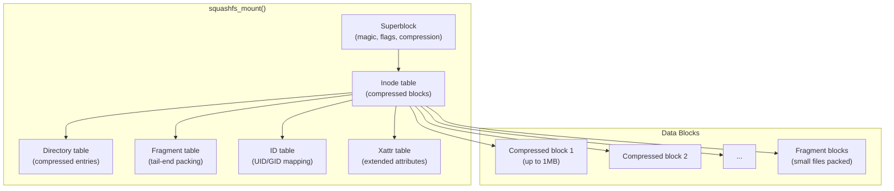
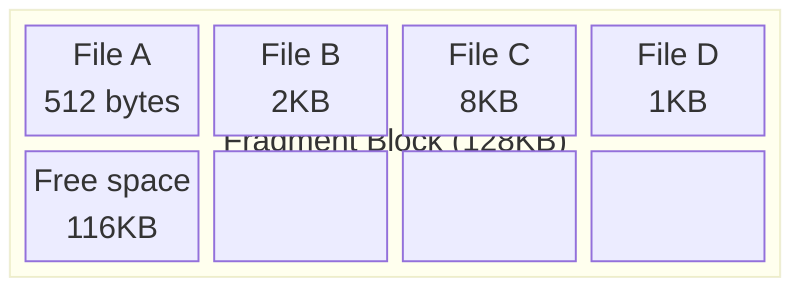

# SquashFS

## Overview

SquashFS is a compressed, read-only filesystem for Linux. It compresses files, inodes, and directories using zlib, lz4, lzo, xz, or zstd compression. SquashFS is widely used for live CDs, embedded systems, container images, and firmware because it achieves very high compression ratios while allowing random access to files.

SquashFS stores everything in a single file (the "squashfs image") that can be loopback-mounted or embedded in a partition. The filesystem is designed for read-only workloads — it cannot be modified after creation (use `mksquashfs` to create new images).

> **Introduced:** Linux 2.6.29 (commit `c9c9c4`)  
> **Source:** `fs/squashfs/`  
> **Maintainer:** Phillip Lougher

---

## Architecture



---

## On-Disk Format

### Superblock

```c
/* fs/squashfs/squashfs_fs.h */
struct squashfs_super_block {
    __le32 s_magic;              /* 0x73717368 ("sqsh") */
    __le32 inodes;               /* Number of inodes */
    __le32 mkfs_time;            /* Creation time */
    __le32 block_size;           /* Data block size (4K-1M) */
    __le32 fragments;            /* Number of fragments */
    __le16 compression;          /* Compression algorithm */
    __le16 block_log;            /* log2(block_size) */
    __le16 flags;                /* Filesystem flags */
    __le16 no_ids;               /* Number of UID/GID entries */
    __le16 s_major;              /* Major version */
    __le16 s_minor;              /* Minor version */
    __le64 root_inode;           /* Root inode block + offset */
    __le64 bytes_used;           /* Bytes used in image */
    __le64 id_table_start;       /* UID/GID table start */
    __le64 xattr_id_table_start; /* Xattr table start */
    __le64 inode_table_start;    /* Inode table start */
    __le64 directory_table_start;/* Directory table start */
    __le64 fragment_table_start; /* Fragment table start */
    __le64 export_table_start;   /* NFS export table start */
};
```

### Inode Types

SquashFS has specialized inodes for different file types:

| Inode Type | Description |
|-----------|-------------|
| Basic File | Regular file (data blocks or fragments) |
| Basic Directory | Directory (directory table entries) |
| Extended File | File with xattrs, sparse blocks |
| Extended Directory | Directory with xattrs, large count |
| Symlink | Symbolic link (inline target) |
| Block Device | Block device (major/minor) |
| Character Device | Character device (major/minor) |
| FIFO | Named pipe |
| Socket | Unix socket |

### File Data Storage

```mermaid
flowchart TD
    A[File data] --> B{Size > fragment threshold?}
    B -->|Yes| C[Store in data blocks<br/>(compressed, up to 1MB each)]
    B -->|No| D[Store in fragment block<br/>(packed with other small files)]
    C --> E[Block index stored in inode]
    D --> F[Fragment block + offset stored in inode]
```

---

## Compression

### Supported Algorithms

| Algorithm | Speed | Ratio | CPU Usage | Default |
|-----------|-------|-------|-----------|---------|
| gzip | Moderate | Good | Moderate | Legacy default |
| lz4 | Fastest | Lower | Low | Speed-optimized |
| lzo | Fast | Lower | Low | Speed-optimized |
| xz | Slow | Best | High | Size-optimized |
| zstd | Fast | Very good | Moderate | Modern default |

### Compression Configuration

```bash
# Create with specific compression
mksquashfs /source /image.squashfs -comp zstd
mksquashfs /source /image.squashfs -comp xz
mksquashfs /source /image.squashfs -comp lz4

# Check compression of existing image
unsquashfs -s /image.squashfs
# Compression: zstd
# Block size: 131072
```

### Block Size

SquashFS compresses data in fixed-size blocks (default 128KB):

```bash
# Create with custom block size
mksquashfs /source /image.squashfs -b 262144  # 256KB blocks
mksquashfs /source /image.squashfs -b 1048576 # 1MB blocks

# Larger blocks = better compression, slower random access
# Smaller blocks = worse compression, faster random access
```

---

## Key Data Structures (In-Kernel)

### struct squashfs_sb_info

```c
/* fs/squashfs/squashfs.h */
struct squashfs_sb_info {
    struct squashfs_super_block *sblk; /* Superblock */
    int block_size;                     /* Block size */
    int block_log;                      /* log2(block_size) */
    int flags;                          /* Filesystem flags */
    struct squashfs_decompressor *decompressor; /* Decompressor */
    void *stream;                       /* Decompression stream */
    __le64 *id_table;                   /* UID/GID lookup table */
    __le64 *fragment_index;             /* Fragment index table */
    unsigned int fragments;             /* Number of fragments */
    int next_fragment;                  /* Next fragment index */
    u64 next_meta_inode;                /* Next metadata inode */
    /* ... */
};
```

### struct squashfs_inode_info

```c
/* fs/squashfs/squashfs.h */
struct squashfs_inode_info {
    struct inode vfs_inode;          /* VFS inode */
    u64 start;                       /* Start of inode on disk */
    int offset;                      /* Offset in metadata block */
    u64 xattr;                       /* Xattr block + offset */
    unsigned int block_start;        /* Start of file data */
    unsigned int fragment_block;     /* Fragment block number */
    unsigned int fragment_offset;    /* Offset in fragment block */
    unsigned int fragment_size;      /* Fragment size */
    unsigned short block_list[];     /* Block size list */
};
```

---

## Operations

### File Operations

```c
/* fs/squashfs/file.c */
const struct file_operations squashfs_file_ops = {
    .read_iter = squashfs_read_iter,   /* Read file data */
    .mmap = squashfs_file_mmap,        /* Memory-mapped I/O */
    .llseek = generic_file_llseek,      /* Seek */
};

const struct address_space_operations squashfs_aops = {
    .readahead = squashfs_readahead,    /* Readahead */
    .read_folio = squashfs_read_folio,  /* Read single page */
};
```

### Directory Operations

```c
/* fs/squashfs/dir.c */
const struct file_operations squashfs_dir_ops = {
    .iterate_shared = squashfs_readdir, /* Read directory */
    .llseek = generic_file_llseek,
};
```

### Symlink Operations

```c
/* fs/squashfs/symlink.c */
const struct inode_operations squashfs_symlink_inode_ops = {
    .get_link = squashfs_get_link,      /* Read symlink target */
    .getattr = squashfs_getattr,        /* Get attributes */
};
```

---

## Fragment Packing

SquashFS packs small files (less than one block) into **fragment blocks**:



This dramatically improves compression ratio because many small files are compressed together.

---

## Usage Examples

### Creating Images

```bash
# Basic image creation
mksquashfs /source /image.squashfs

# With specific compression and block size
mksquashfs /source /image.squashfs -comp zstd -b 256K

# Append to existing image
mksquashfs /newfiles /image.squashfs -noappend

# Exclude patterns
mksquashfs /source /image.squashfs -e "*.tmp" -e ".git"

# With reproducible timestamps
mksquashfs /source /image.squashfs -all-time 0

# Parallel compression (faster)
mksquashfs /source /image.squashfs -processors 8
```

### Mounting

```bash
# Mount squashfs image
mount -t squashfs /image.squashfs /mnt

# Loopback mount
mount -o loop /image.squashfs /mnt

# Mount from compressed offset (e.g., embedded in firmware)
mount -t squashfs -o offset=1024 /firmware.bin /mnt

# Mount with specific decompressor
mount -t squashfs -o compressor=zstd /image.squashfs /mnt
```

### Inspecting Images

```bash
# List contents
unsquashfs -l /image.squashfs

# Extract all files
unsquashfs /image.squashfs

# Extract specific files
unsquashfs -f /image.squashfs /path/to/file

# Show superblock info
unsquashfs -s /image.squashfs
# Found a valid SQUASHFS 4:0 superblock on image.squashfs.
# Compression: zstd
# Block size: 131072
# Filesystem size: 12345678 bytes
# Number of inodes: 1234
```

---

## SquashFS in Practice

### Live CDs and USB

SquashFS is the standard format for Linux live systems:

```bash
# Typical live CD structure
# /casper/filesystem.squashfs — compressed root filesystem
# Boot loader mounts squashfs as root via overlayfs

# Extract live CD root
unsquashfs /casper/filesystem.squashfs
```

### Container Images

Docker and OCI container images use squashfs layers:

```bash
# Docker image layers can be squashfs
# Build squashfs-based container
buildah bud --format squashfs .

# Container runtimes can mount squashfs directly
```

### Embedded Systems

SquashFS is ideal for embedded devices with limited storage:

```bash
# Create minimal firmware image
mksquashfs /rootfs /firmware.squashfs \
    -comp xz -b 256K \
    -noappend -all-time 0 \
    -no-xattrs -no-exports
```

### Snap Packages

Ubuntu Snap packages use squashfs for application packaging:

```bash
# Snap packages are squashfs images
file /var/lib/snapd/snaps/core_12345.snap
# Squashfs filesystem, little endian, version 4.0, zstd compressed

# Mount snap
mount -t squashfs /var/lib/snapd/snaps/core_12345.snap /snap/core/current
```

---

## Performance

### Compression Ratio

Typical compression ratios by algorithm:

| Algorithm | Ratio (mixed data) | Ratio (binaries) | Ratio (text) |
|-----------|-------------------|-------------------|--------------|
| gzip | 2.5:1 | 2.0:1 | 3.5:1 |
| lz4 | 2.0:1 | 1.8:1 | 2.5:1 |
| lzo | 2.1:1 | 1.9:1 | 2.8:1 |
| xz | 3.0:1 | 2.5:1 | 4.5:1 |
| zstd | 2.8:1 | 2.3:1 | 4.0:1 |

### Read Performance

SquashFS read performance depends on:
- **Compression algorithm**: lz4/lzo are faster to decompress
- **Block size**: Larger blocks = slower random access
- **Cache**: Page cache helps with repeated reads
- **Storage**: SSD vs HDD affects I/O latency

### Optimization Tips

```bash
# For speed-critical applications
mksquashfs /source /image.squashfs -comp lz4 -b 64K

# For size-critical applications
mksquashfs /source /image.squashfs -comp xz -b 1M

# Balanced (recommended)
mksquashfs /source /image.squashfs -comp zstd -b 256K

# Parallel creation for large images
mksquashfs /source /image.squashfs -processors $(nproc) -mem 2G
```

---

## Troubleshooting

### Mount Fails

```bash
# Check if squashfs module is loaded
modprobe squashfs

# Check image validity
unsquashfs -s /image.squashfs

# Check dmesg for errors
dmesg | grep squashfs

# Try forcing specific compressor
mount -t squashfs -o compressor=gzip /image.squashfs /mnt
```

### Corrupted Image

```bash
# Check image integrity
unsquashfs -test /image.squashfs

# Force extract (skip errors)
unsquashfs -f /image.squashfs

# Check for truncated image
ls -la /image.squashfs
# Compare with expected size from mksquashfs output
```

### Performance Issues

```bash
# Check compression algorithm
unsquashfs -s /image.squashfs

# Check cache hit rate
cat /proc/fs/squashfs/cache_hits

# Profile read latency
fio --name=test --filename=/mnt/file --rw=randread --bs=4k --runtime=30
```

---

## Source Files

| File | Contents |
|------|----------|
| `fs/squashfs/super.c` | Mount/unmount, superblock |
| `fs/squashfs/inode.c` | Inode operations |
| `fs/squashfs/file.c` | File read operations |
| `fs/squashfs/dir.c` | Directory operations |
| `fs/squashfs/symlink.c` | Symlink operations |
| `fs/squashfs/decompressor.c` | Decompression framework |
| `fs/squashfs/decompressor_zstd.c` | zstd decompressor |
| `fs/squashfs/decompressor_xz.c` | xz decompressor |
| `fs/squashfs/page_actor.c` | Page cache integration |
| `include/uapi/linux/magic.h` | SquashFS magic number |

---

## Further Reading

- **Kernel documentation**: `Documentation/filesystems/squashfs.html`
- **SquashFS project**: [squashfs.sourceforge.net](https://squashfs.sourceforge.net/)
- **LWN**: ["Squashfs: lessons in filesystem upstreaming"](https://lwn.net/Articles/393825/)
- **Chris Down**: [The curious case of stalled squashfs reads](https://chrisdown.name/2018/04/17/kernel-adventures-the-curious-case-of-squashfs-stalls.html)
- **man pages**: `mksquashfs(1)`, `unsquashfs(1)`, `squashfs(5)`

---

## See Also

- [Filesystems Overview](./overview.md) — Linux filesystem landscape
- [OverlayFS](./overlayfs.md) — used with squashfs for live CDs
- [Compression](./zpool.md) — kernel compression algorithms
- [Block I/O](./block-io.md) — block layer interaction
- [initramfs](./initramfs.md) — early boot filesystem
