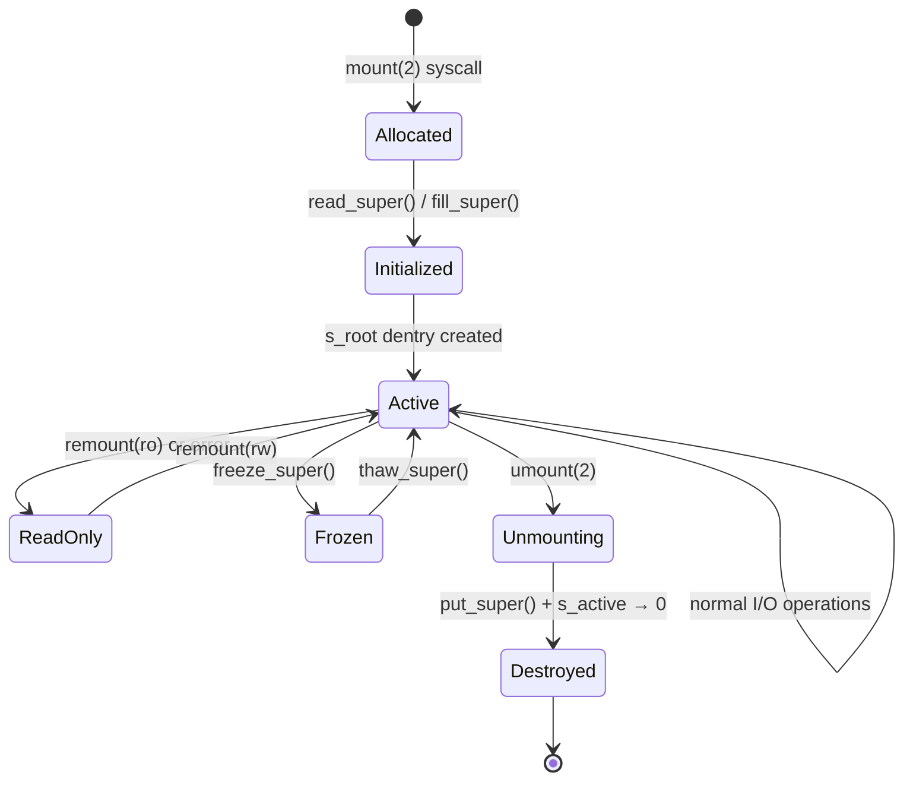
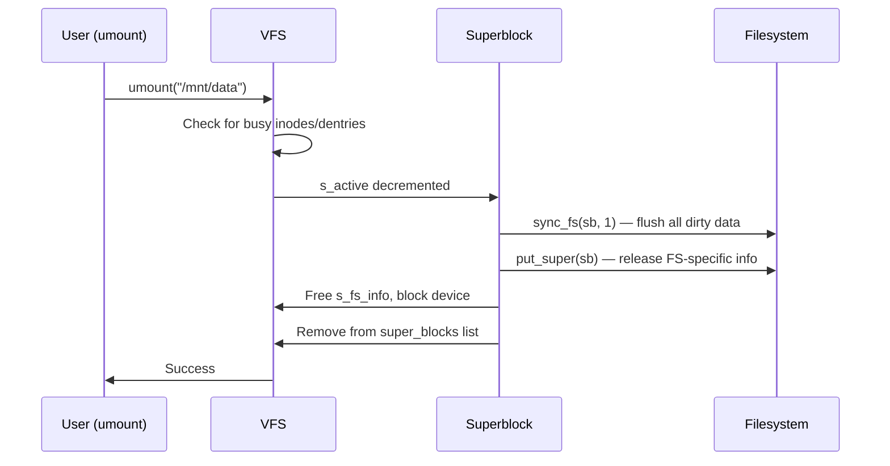
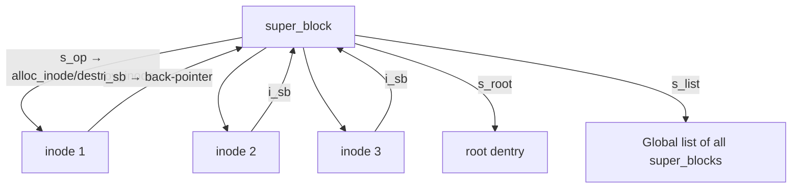

# Superblock

## Introduction

The superblock is one of the most fundamental data structures in the Linux Virtual File System (VFS). It represents a mounted filesystem instance and contains all the metadata needed to manage that instance: filesystem type, block size, state flags, and pointers to operations. Every mounted filesystem — whether ext4, XFS, btrfs, NFS, or tmpfs — has exactly one superblock structure in kernel memory for each mount.

The superblock serves as the anchor point from which the entire filesystem tree is traversed. When you run `mount`, the kernel creates a superblock (or reuses an existing one), reads the on-disk superblock structure into memory, and initializes the VFS `struct super_block` accordingly.

## The `struct super_block`

### Definition

```c
/* Simplified from include/linux/fs.h */
struct super_block {
    struct list_head    s_list;           /* List of all super_blocks */
    dev_t               s_dev;            /* Device identifier */
    unsigned char       s_blocksize_bits; /* Block size in bits */
    unsigned long       s_blocksize;      /* Block size in bytes */
    loff_t              s_maxbytes;       /* Max file size */
    struct file_system_type *s_type;      /* Filesystem type */
    const struct super_operations *s_op;  /* Superblock operations */
    struct dentry       *s_root;          /* Root dentry */
    struct rw_semaphore  s_umount;        /* Unmount semaphore */
    atomic_t             s_active;        /* Active reference count */
    struct block_device *s_bdev;          /* Backing block device */
    void                *s_fs_info;       /* Filesystem-specific info */
    unsigned long        s_flags;         /* Mount flags */
    unsigned long        s_iflags;        /* Internal SB flags */
    struct hlist_bl_head s_roots;         /* Cached root dentries */
    struct list_head     s_inodes;        /* All inodes on this SB */
    spinlock_t           s_inode_list_lock;
    struct list_head     s_mounts;        /* Mount objects */
    /* ... many more fields ... */
};
```

### Key Fields

| Field | Purpose |
|-------|---------|
| `s_type` | Pointer to `file_system_type` (e.g., `ext4_fs_type`) |
| `s_op` | VFS-callable operations (`alloc_inode`, `destroy_inode`, `sync_fs`, etc.) |
| `s_root` | The root dentry — entry point to the filesystem tree |
| `s_bdev` | Block device this filesystem lives on (NULL for virtual FS) |
| `s_fs_info` | Filesystem-private data (e.g., `struct ext4_sb_info`) |
| `s_flags` | Mount flags: `MS_RDONLY`, `MS_NOEXEC`, `MS_NOSUID`, etc. |
| `s_blocksize` | Logical block size (typically 4096 bytes) |
| `s_maxbytes` | Maximum file size supported by this filesystem |
| `s_active` | Reference count; when it hits zero, the superblock is destroyed |

## `super_operations`

Each filesystem implements the `super_operations` interface:

```c
struct super_operations {
    struct inode *(*alloc_inode)(struct super_block *sb);
    void (*destroy_inode)(struct inode *);
    void (*dirty_inode)(struct inode *, int flags);
    int (*write_inode)(struct inode *, struct writeback_control *wbc);
    int (*drop_inode)(struct inode *);
    void (*evict_inode)(struct inode *);
    void (*put_super)(struct super_block *);
    int (*sync_fs)(struct super_block *sb, int wait);
    int (*freeze_super)(struct super_block *);
    int (*freeze_fs)(struct super_block *);
    int (*thaw_super)(struct super_block *);
    int (*unfreeze_fs)(struct super_block *);
    int (*statfs)(struct dentry *, struct kstatfs *);
    int (*remount_fs)(struct super_block *, int *, char *);
    void (*umount_begin)(struct super_block *);
    int (*show_options)(struct seq_file *, struct dentry *);
    /* ... */
};
```

### Operation Descriptions

| Operation | When Called | Typical Behavior |
|-----------|------------|------------------|
| `alloc_inode` | When a new inode is needed | Allocate FS-specific inode struct (includes `struct inode`) |
| `destroy_inode` | When inode refcount reaches zero | Free the FS-specific inode struct |
| `dirty_inode` | When an inode is modified | Mark inode as needing writeback (e.g., set `I_DIRTY`) |
| `write_inode` | During writeback (pdflush/buffer flush) | Write inode metadata to disk |
| `drop_inode` | When `iput()` is called | Return 1 to delete inode, 0 to cache it |
| `evict_inode` | When inode is being evicted from cache | Truncate file, free blocks, remove from inode hash |
| `put_super` | During `umount` | Release FS-specific superblock info, flush data |
| `sync_fs` | During `sync(2)` or `fsync` on a file | Flush all dirty metadata and data to disk |
| `freeze_super` | `fsfreeze` command | Quiesce the filesystem (stop writes) for snapshots |
| `thaw_super` | After freeze | Resume normal operations |
| `statfs` | `statfs(2)` / `df` command | Report filesystem statistics (blocks free, total, etc.) |
| `remount` | `mount -o remount` | Change mount options without unmounting |
| `show_options` | `/proc/mounts` read | Display current mount options |

### Example: ext4 super_operations

```c
static const struct super_operations ext4_sops = {
    .alloc_inode    = ext4_alloc_inode,
    .destroy_inode  = ext4_destroy_inode,
    .dirty_inode    = ext4_dirty_inode,
    .write_inode    = ext4_write_inode,
    .drop_inode     = ext4_drop_inode,
    .evict_inode    = ext4_evict_inode,
    .put_super       = ext4_put_super,
    .sync_fs        = ext4_sync_fs,
    .freeze_super   = ext4_freeze,
    .thaw_super     = ext4_unfreeze,
    .statfs         = ext4_statfs,
    .remount_fs     = ext4_remount,
    .show_options   = ext4_show_options,
};
```

## Superblock Lifecycle



### Mount: Creating a Superblock

When `mount(2)` is called:

1. **Lookup filesystem type** — VFS searches its registered `file_system_type` list
2. **Check existing superblock** — If the same device is already mounted, reuse its superblock (for bind mounts or additional mountpoints)
3. **Allocate superblock** — `sget()` allocates a new `struct super_block`
4. **Call `fill_super`** — The filesystem-specific function reads the on-disk superblock, validates it, initializes `s_fs_info`, sets up `s_op`, and creates the root inode/dentry

```c
/* Simplified mount flow in VFS */
int vfs_get_super(struct fs_context *fc,
                  enum vfs_get_super_keying keying,
                  int (*fill_super)(struct super_block *sb,
                                    struct fs_context *fc)) {
    struct super_block *s;

    /* sget_fc() finds or creates a superblock */
    s = sget_fc(fc, test_key, set_key);
    if (IS_ERR(s))
        return PTR_ERR(s);

    if (!s->s_root) {
        /* New superblock — call filesystem's fill_super */
        int error = fill_super(s, fc);
        if (error) {
            deactivate_super(s);
            return error;
        }
        s->s_flags |= SB_ACTIVE;
    }
    /* ... create mount object and attach ... */
}
```

### Unmount: Destroying a Superblock



If there are still-open files or working directories under the mount, `umount` fails with `EBUSY` (unless lazy unmount with `MNT_DETACH` is used).

## On-Disk Superblock Formats

Different filesystems have different on-disk superblock structures. Here are examples:

### ext4 On-Disk Superblock

```c
/* Simplified from fs/ext4/ext4.h */
struct ext4_super_block {
    __le32 s_inodes_count;      /* Inode count */
    __le32 s_blocks_count_lo;   /* Block count */
    __le32 s_r_blocks_count_lo; /* Reserved block count */
    __le32 s_free_blocks_count_lo; /* Free block count */
    __le32 s_free_inodes_count; /* Free inode count */
    __le32 s_first_data_block;  /* First data block */
    __le32 s_log_block_size;    /* Log2 of block size */
    __le32 s_log_cluster_size;  /* Log2 of cluster size */
    __le32 s_blocks_per_group;  /* Blocks per group */
    __le32 s_clusters_per_group; /* Clusters per group */
    __le32 s_inodes_per_group;  /* Inodes per group */
    __le32 s_mtime;             /* Mount time */
    __le32 s_wtime;             /* Write time */
    __le16 s_mnt_count;         /* Mount count */
    __le16 s_max_mnt_count;     /* Max mount count */
    __le16 s_magic;             /* Magic: 0xEF53 */
    __le16 s_state;             /* Filesystem state */
    __le16 s_errors;            /* Error behavior */
    __le16 s_minor_rev_level;   /* Minor revision */
    __le32 s_lastcheck;         /* Last check time */
    __le32 s_checkinterval;     /* Check interval */
    __le32 s_creator_os;        /* Creator OS */
    __le32 s_rev_level;         /* Revision level */
    __le16 s_def_resuid;        /* Default reserved UID */
    __le16 s_def_resgid;        /* Default reserved GID */
    /* ... many more fields ... */
    __u8   s_uuid[16];          /* UUID */
    __u8   s_volume_name[16];   /* Volume label */
    /* ... */
};
```

### XFS On-Disk Superblock

```c
/* Simplified from fs/xfs/libxfs/xfs_format.h */
struct xfs_dsb {
    __be32 sb_magicnum;         /* XFS_SB_MAGIC: 0x58465342 */
    __be32 sb_blocksize;        /* Block size in bytes */
    __be64 sb_dblocks;          /* Total data blocks */
    __be64 sb_rblocks;          /* Realtime blocks */
    __be64 sb_rextents;         /* Realtime extents */
    __u8   sb_uuid[16];         /* UUID */
    __be64 sb_logstart;         /* Log start block */
    __be64 sb_rootino;          /* Root inode number */
    __be32 sb_rbmino;           /* Realtime bitmap inode */
    __be32 sb_rsumino;          /* Realtime summary inode */
    __be32 sb_rextsize;         /* Realtime extent size */
    /* ... more fields ... */
};
```

## Superblock and Inode Relationship

Every inode belongs to exactly one superblock. The superblock tracks all its inodes:



```bash
# View all superblocks in /proc
$ cat /proc/filesystems
nodev   sysfs
nodev   tmpfs
        ext4
        xfs
        btrfs

# See mounted superblocks
$ cat /proc/mounts
# or
$ mount -t ext4,xfs
```

## Sync and Writeback

### Global Sync

```bash
# Force all filesystems to flush dirty data
$ sync

# This triggers sync_fs() on every active superblock
# Also triggered by: reboot, halt, sysrq
```

### Per-Filesystem Sync

```bash
# syncfs(2) — sync only one filesystem
$ python3 -c "
import os, ctypes
fd = os.open('/mnt/data', os.O_RDONLY)
ctypes.CDLL('libc.so.6').syncfs(fd)
os.close(fd)
"
```

### Kernel Background Writeback

The kernel periodically writes back dirty data:

```bash
# Writeback tunables (in /proc/sys/vm/)
$ sysctl vm.dirty_ratio          # % of RAM allowed dirty before sync
vm.dirty_ratio = 20
$ sysctl vm.dirty_background_ratio  # % of RAM before background writeback
vm.dirty_background_ratio = 10
$ sysctl vm.dirty_expire_centisecs  # Dirty data older than this is written
vm.dirty_expire_centisecs = 3000
$ sysctl vm.dirty_writeback_centisecs  # How often writeback threads wake
vm.dirty_writeback_centisecs = 500
```

### Freeze/Thaw

Filesystem freeze is used for consistent snapshots:

```bash
# Freeze the filesystem (quiesce all writes)
$ fsfreeze --freeze /mnt/data

# Take a snapshot (LVM, device mapper, etc.)
$ lvcreate --snapshot --size=1G --name=snap /dev/vg0/data

# Thaw the filesystem (resume writes)
$ fsfreeze --unfreeze /mnt/data
```

Internally, `fsfreeze` calls `freeze_super()` → `freeze_fs()` on the superblock, which blocks all new write I/O until thaw.

## Superblock Flags

```c
/* Mount flags (s_flags) */
#define SB_RDONLY       1       /* Read-only mount */
#define SB_NOSUID       2       /* Ignore suid/sgid bits */
#define SB_NODEV        4       /* Disallow device access */
#define SB_NOEXEC       8       /* Disallow program execution */
#define SB_SYNCHRONOUS  16      /* Writes are synchronous */
#define SB_MANDLOCK     64      /* Mandatory locking */
#define SB_DIRSYNC      128     /* Directory modifications synchronous */
#define SB_NOATIME      1024    /* Don't update access times */
#define SB_NODIRATIME   2048    /* Don't update directory access times */
#define SB_SILENT       32768   /* Suppress kernel messages */
```

```bash
# View flags for a mounted filesystem
$ cat /proc/mounts | grep " / "
/dev/sda1 / ext4 rw,relatime,errors=remount-ro 0 0

# The flags after the options are the superblock flags
# rw → SB_RDONLY is NOT set
```

## Filesystem Registration

Each filesystem type registers a `file_system_type` structure:

```c
struct file_system_type {
    const char *name;
    int fs_flags;
    int (*init_fs_context)(struct fs_context *);
    const struct fs_parameter_spec *parameters;
    struct dentry *(*mount)(struct file_system_type *, int,
                            const char *, void *);
    void (*kill_sb)(struct super_block *);
    struct module *owner;
    struct file_system_type *next;
    struct hlist_head fs_supers;  /* All superblocks of this type */
};

/* Example: ext4 */
static struct file_system_type ext4_fs_type = {
    .owner      = THIS_MODULE,
    .name       = "ext4",
    .init_fs_context = ext4_init_fs_context,
    .parameters = ext4_param_specs,
    .kill_sb    = kill_block_super,
    .fs_flags   = FS_REQUIRES_DEV,
};
```

## Superblock in Different Filesystem Types

### Virtual Filesystems (tmpfs, procfs, sysfs)

Virtual filesystems don't have a backing block device. Their superblocks are created in memory:

```c
/* tmpfs superblock creation */
static int shmem_fill_super(struct super_block *sb, struct fs_context *fc)
{
    struct inode *inode;
    struct shmem_sb_info *sbinfo;

    /* Allocate in-memory superblock info */
    sbinfo = kzalloc(sizeof(struct shmem_sb_info), GFP_KERNEL);
    sb->s_fs_info = sbinfo;

    /* Set up operations */
    sb->s_op = &shmem_ops;

    /* Create root inode */
    inode = shmem_get_inode(sb, NULL, S_IFDIR | 0777, 0, 0);
    sb->s_root = d_make_root(inode);

    return 0;
}
```

### Network Filesystems (NFS, CIFS)

Network filesystems have superblocks that represent remote servers:

```c
/* NFS superblock */
struct nfs_server {
    struct super_block *super;      /* VFS superblock */
    struct rpc_clnt *client;        /* RPC client */
    struct nfs_client *nfs_client;  /* NFS client state */
    /* ... */
};
```

### Cluster Filesystems (GFS2, OCFS2)

Cluster filesystems have superblocks that coordinate with other nodes:

```c
/* GFS2 superblock */
struct gfs2_sbd {
    struct super_block *sd_vfs;     /* VFS superblock */
    struct gfs2_holder sd_mount_gh; /* Mount glock holder */
    /* ... cluster locks, journals, etc. ... */
};
```

## Performance Characteristics

### Superblock Operations Overhead

| Operation | Frequency | Cost |
|-----------|-----------|------|
| `alloc_inode` | On file create/open | Low (memory allocation) |
| `dirty_inode` | On every metadata change | Very low (set flag) |
| `write_inode` | Periodic writeback | Medium (disk I/O) |
| `sync_fs` | On sync(2) | High (flush all dirty data) |
| `statfs` | On df(1) | Low (read cached values) |

### Caching

The kernel caches superblock information aggressively:
- **s_fs_info** is kept in memory for the entire mount duration
- **Inode cache** reduces `alloc_inode` calls
- **Dentry cache** reduces path lookups
- **Page cache** reduces disk reads

## Troubleshooting

### Viewing Superblock Information

```bash
# ext4 superblock info
$ tune2fs -l /dev/sda1
Filesystem volume name:   root
Filesystem magic number:  0xEF53
Filesystem state:         clean
Block count:              52428800
Block size:               4096
Blocks per group:         32768
Inodes per group:         8192
Inode size:               256

# XFS superblock info
$ xfs_db -r -c "sb 0" -c "p" /dev/sdb1
magicnum = 0x58465342
blocksize = 4096
dblocks = 104857600
rootino = 128

# btrfs superblock info
$ btrfs inspect-internal dump-super /dev/sdc1
superblock: bytenr=65536, fsid=...
magic: _BHRfS_M
nodesize: 16384
leafsize: 16384
```

### Common Superblock Issues

```bash
# ext4: "Superblock has an invalid journal"
$ e2fsck -f /dev/sda1

# ext4: "Bad magic number in super-block"
$ e2fsck -b 32768 /dev/sda1  # Use backup superblock

# XFS: "Superblock has unknown features"
$ xfs_repair /dev/sdb1
```

## References

- [VFS documentation](https://www.kernel.org/doc/html/latest/filesystems/vfs.html)
- [Superblock operations](https://www.kernel.org/doc/html/latest/filesystems/vfs.html#superblock-operations)
- [include/linux/fs.h source](https://github.com/torvalds/linux/blob/master/include/linux/fs.h)
- [mount(2) man page](https://man7.org/linux/man-pages/man2/mount.2.html)
- [sync(2) man page](https://man7.org/linux/man-pages/man2/sync.2.html)

## Further Reading

- [The Linux Kernel Documentation](https://docs.kernel.org/)
- [GNU Project Documentation](https://www.gnu.org/doc/doc.html)
- [GNU Manuals](https://www.gnu.org/manual/manual.html)
- [Free Software Directory](https://directory.fsf.org/wiki/Main_Page)
- [Planet GNU](https://planet.gnu.org/)
- [Free Software Books](https://www.gnu.org/doc/other-free-books.html)

- https://www.kernel.org/doc/html/latest/filesystems/vfs.html
- https://www.kernel.org/doc/html/latest/filesystems/ext4/super.html
- https://lwn.net/Articles/576276/ — "A new kernel mount API"
- https://man7.org/linux/man-pages/man2/mount.2.html
- https://man7.org/linux/man-pages/man2/sync.2.html

## Related Topics

- [inode](./inode.md) — Inodes are children of the superblock
- [file-ops](./file-ops.md) — File operations work with inodes from the superblock
- [mounting](./mounting.md) — How superblocks are created during mount
- [overlayfs](./overlayfs.md) — OverlayFS superblock management
