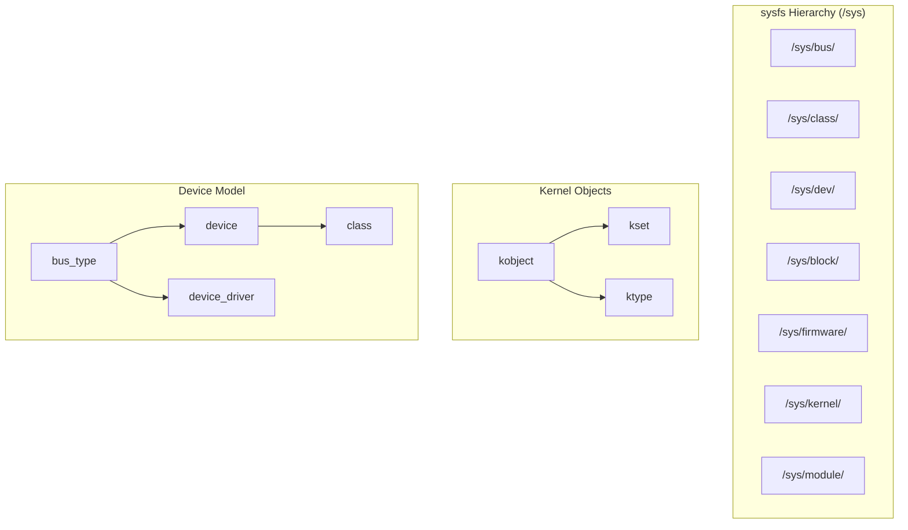
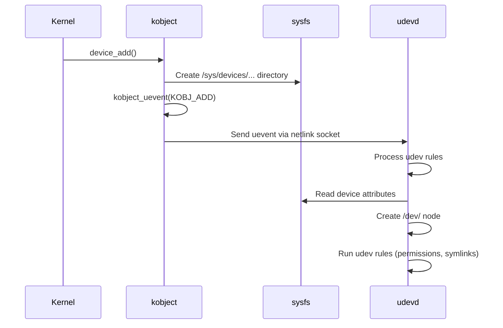

# sysfs

## Introduction

sysfs is a virtual filesystem in Linux, mounted at `/sys`, that exports kernel data structures,
their attributes, and the linkages between them to userspace. It provides a structured view of
the kernel's device model — devices, buses, drivers, classes, and their relationships. sysfs was
designed to replace and extend the functionality of `/proc` for device-related information and
is tightly integrated with the Linux device model (kobjects, ksets, and ktypes).

sysfs was introduced in Linux 2.6 (2003) by Patrick Mochel as part of the driver model rewrite.
It creates one directory per kobject in the kernel, with files representing attributes of those
objects. This provides a clean, hierarchical view of the kernel's device tree that userspace
tools like `udev` use for automatic device management.

## Architecture

### Core Concepts

The sysfs hierarchy mirrors the kernel's object model:



### The kobject

The `kobject` is the fundamental building block of sysfs. Every directory in `/sys` corresponds
to a kobject (or a structure that embeds a kobject):

```c
struct kobject {
    const char      *name;          /* Name shown in sysfs */
    struct list_head entry;         /* Linkage into kset list */
    struct kobject  *parent;        /* Parent kobject (parent dir in sysfs) */
    struct kset     *kset;          /* Kset this kobject belongs to */
    struct kobj_type *ktype;        /* Type of this kobject */
    struct kernfs_node *sd;         /* sysfs directory entry */
    struct kref     kref;           /* Reference count */
#ifdef CONFIG_DEBUG_KOBJECT_RELEASE
    struct delayed_work release;
#endif
    unsigned int state_initialized:1;
    unsigned int state_in_sysfs:1;
    unsigned int state_add_uevent_sent:1;
    unsigned int state_remove_uevent_sent:1;
    unsigned int uevent_suppress:1;
};
```

### The kset

A `kset` is a collection of kobjects that share the same ktype. It serves as the top-level
directory in sysfs and provides default uevent behavior:

```c
struct kset {
    struct list_head list;              /* List of kobjects in this kset */
    spinlock_t list_lock;
    struct kobject kobj;                /* Embedded kobject (the directory) */
    const struct kset_uevent_ops *uevent_ops;  /* Uevent handling */
};
```

### The kobj_type

The `kobj_type` defines how a kobject's attributes are read and written:

```c
struct kobj_type {
    void (*release)(struct kobject *kobj);  /* Cleanup when kobject is freed */
    const struct sysfs_ops *sysfs_ops;      /* Attribute read/write handlers */
    const struct attribute_group **default_groups;  /* Default attributes */
    const struct kobj_ns_type_operations *(*child_ns_type)(struct kobject *);
    const void *(*namespace)(struct kobject *);
};
```

### sysfs_ops

```c
struct sysfs_ops {
    ssize_t (*show)(struct kobject *kobj, struct attribute *attr, char *buf);
    ssize_t (*store)(struct kobject *kobj, struct attribute *attr,
                     const char *buf, size_t count);
};
```

## Attributes

An attribute is a file in sysfs that can be read and/or written:

```c
struct attribute {
    const char      *name;      /* File name in sysfs */
    umode_t         mode;       /* File permissions (e.g., 0644) */
};

/* Example: a simple attribute */
static ssize_t my_attr_show(struct kobject *kobj,
                             struct attribute *attr, char *buf)
{
    struct my_device *dev = kobj_to_my_device(kobj);
    return sprintf(buf, "%d\n", dev->my_value);
}

static ssize_t my_attr_store(struct kobject *kobj, struct attribute *attr,
                              const char *buf, size_t count)
{
    struct my_device *dev = kobj_to_my_device(kobj);
    int val;
    if (kstrtoint(buf, 10, &val))
        return -EINVAL;
    dev->my_value = val;
    return count;
}

static const struct sysfs_ops my_sysfs_ops = {
    .show  = my_attr_show,
    .store = my_attr_store,
};
```

### Attribute Groups

Attributes are organized into groups:

```c
static struct attribute *my_attrs[] = {
    &(struct attribute){ .name = "value", .mode = 0644 },
    &(struct attribute){ .name = "status", .mode = 0444 },
    NULL,  /* Terminator */
};

static const struct attribute_group my_attr_group = {
    .attrs = my_attrs,
    .name = "my_group",  /* Optional: creates a subdirectory */
};

/* Multiple groups */
static const struct attribute_group *my_groups[] = {
    &my_attr_group,
    NULL,  /* Terminator */
};
```

## /sys Hierarchy

### `/sys/block/` — Block Devices

```bash
$ ls /sys/block/
loop0  loop1  loop2  nvme0n1  sda  sdb

$ ls /sys/block/sda/
alignment_offset  discard_alignment  holders  inflight  queue  removable
bdi               dev                hwwang   integrity  range  ro
capability        device             iosched  mq         size   slaves
stat              subsystem          partition            trace

# Device major:minor numbers
$ cat /sys/block/sda/dev
8:0

# Device size (in 512-byte sectors)
$ cat /sys/block/sda/size
209715200

# Queue parameters
$ ls /sys/block/sda/queue/
add_random           max_hw_sectors_kb    nr_requests        scheduler
discard_max_bytes    max_sectors_kb       optimal_io_size    write_same_max_bytes
io_poll              minimum_io_size      physical_block_size
logical_block_size   nomerges             read_ahead_kb
rotational           rq_affinity          nr_zones

# I/O scheduler
$ cat /sys/block/sda/queue/scheduler
[mq-deadline] kyber bfq none

# Change I/O scheduler
$ echo bfq > /sys/block/sda/queue/scheduler
```

### `/sys/class/` — Device Classes

```bash
$ ls /sys/class/
ata_device/   drm/          hwmon/        net/          scsi_host/
ata_link/     drm_dp_aux/   i2c-adapter/  pci_bus/      sound/
ata_port/     extcon/       i2c-dev/      phy/          spi_master/
backlight/    firmware/     input/        power_supply/ thermal/
block/        gpio/         leds/         pps/          tty/
bluetooth/    graphics/     mem/          ptp/          usbmon/
dma/          hidraw/       misc/         rtc/          vc/
dma_heap/     iommu/        mtd/          scsi_device/  vfio/

# Network interfaces
$ ls /sys/class/net/
eth0  lo  wlan0

$ cat /sys/class/net/eth0/address
00:11:22:33:44:55

$ cat /sys/class/net/eth0/speed
1000  # Mbps

$ cat /sys/class/net/eth0/mtu
1500

# Block devices by class
$ ls /sys/class/block/
loop0  loop1  nvme0n1  nvme0n1p1  sda  sda1  sdb  sdb1

# TTY devices
$ ls /sys/class/tty/
console  ptmx  tty  tty0  tty1  ttyS0  ttyS1
```

### `/sys/bus/` — Bus Types

```bash
$ ls /sys/bus/
acpi/        container/   event_source/  i2c/    mmc/        serio/
cec/         cpu/         genpd/         isa/    nd/         spi/
clockevents/ dax/         gpio/          media/  node/       usb/
clocksource/ edac/        hid/           memory/ pci/        virtio/
component/   eisa/        iio/           mipi-dsa/ pci-ep/  workqueue/

# PCI devices
$ ls /sys/bus/pci/devices/
0000:00:00.0  0000:00:1f.2  0000:00:1f.3  0000:02:00.0

# USB devices
$ ls /sys/bus/usb/devices/
1-0:1.0  1-1  1-1:1.0  2-0:1.0  usb1  usb2

# USB device info
$ cat /sys/bus/usb/devices/1-1/manufacturer
Logitech
$ cat /sys/bus/usb/devices/1-1/product
USB Keyboard
$ cat /sys/bus/usb/devices/1-1/idVendor
046d
$ cat /sys/bus/usb/devices/1-1/idProduct
c31c
```

### `/sys/devices/` — Device Tree

```bash
$ ls /sys/devices/
breakpoint/  LNXSYSTM:00/  pci0000:00/  platform/  system/  virtual/

# Full device path
$ ls /sys/devices/pci0000:00/0000:00:1f.2/
class        device       driver       iommu_group  local_cpus  numa_node
config       dma_mask_bits enable      irq          msi_bus     power/
consistent_dma_mask_size  firmware_node  modalias  remove      rescan
d3cold_allowed  subsystem/  uevent  vendor

# Read PCI configuration space
$ sudo cat /sys/devices/pci0000:00/0000:00:1f.2/vendor
0x8086

$ sudo cat /sys/devices/pci0000:00/0000:00:1f.2/device
0x2829
```

### `/sys/firmware/`

```bash
$ ls /sys/firmware/
acpi/       dmi/        efi/        memmap/

# ACPI tables
$ ls /sys/firmware/acpi/tables/
data/   DSDT   dynamic/   FACP   FACS   HPET   SSDT1  SSDT2

# EFI variables
$ ls /sys/firmware/efi/efivars/
Boot0000-*  Boot0001-*  BootOrder-*  PlatformLang-*  Timeout-*

# SMBIOS/DMI information
$ sudo cat /sys/firmware/dmi/tables/smbios_entry_point | xxd | head
```

### `/sys/kernel/`

```bash
$ ls /sys/kernel/
btf/           debug/         irq/          profiling/     slab/
cgroup/        fscaps/        kexec_        rcu/           uevent_seqnum
config/        ftrace/        mm/           security/
cpu_entry_area  io_uring/    notes/        tracing/

# Kernel config (if CONFIG_IKCONFIG_PROC)
$ zcat /proc/config.gz | head -10
# CONFIG_64BIT is not set
# CONFIG_X86_32 is set
# CONFIG_SPARSE_IRQ is set

# Kernel slab allocator info
$ ls /sys/kernel/slab/
dentry/     ext4_inode_cache/  inode_cache/  kmalloc-128/
task_struct/  signal_cache/    vm_area_struct/

# Ftrace configuration
$ ls /sys/kernel/tracing/
available_events      current_tracer  set_ftrace_filter  trace
available_filter_functions  function_profile_enabled  set_graph_function  trace_pipe
```

### `/sys/module/`

```bash
$ ls /sys/module/
ext4/     nfs/     btrfs/   zfs/     kvm/     vfio/
usbcore/  scsi_mod/  e1000e/  i915/   nvidia/

# Module parameters
$ cat /sys/module/ext4/parameters/max_dir_size_kb
0

$ ls /sys/module/ext4/parameters/
max_dir_size_kb  mb_stream_req  mb_order1_req  ...

# Module info
$ cat /sys/module/ext4/srcversion
ABCD1234567890

# Live patching info
$ ls /sys/module/livepatch_*
```

## Uevent System

When a device is added, removed, or changes state, the kernel generates a uevent (userspace event).
This is the mechanism behind `udev` device management:

### Uevent Flow



### Uevent Content

```bash
# Trigger a uevent and view it
$ sudo cat /sys/block/sda/uevent
MAJOR=8
MINOR=0
DEVNAME=sda
DEVTYPE=disk
DISKSEQ=1

# Trigger a uevent manually
$ echo add | sudo tee /sys/block/sda/uevent

# View uevent helper output
$ sudo udevadm monitor --kernel --property
KERNEL[123456.789] add   /devices/pci0000:00/0000:00:1f.2/.../block/sda (block)
ACTION=add
DEVPATH=/devices/pci0000:00/0000:00:1f.2/.../block/sda
SUBSYSTEM=block
MAJOR=8
MINOR=0
DEVNAME=sda
DEVTYPE=disk
```

### Uevent Attributes

Kernel subsystems control uevent generation through `kset_uevent_ops`:

```c
static int my_uevent(const struct kobject *kobj, struct kobj_uevent_env *env)
{
    struct my_device *dev = kobj_to_my_device(kobj);

    /* Add environment variables to the uevent */
    add_uevent_var(env, "MY_VALUE=%d", dev->my_value);
    add_uevent_var(env, "MY_NAME=%s", dev->name);

    return 0;
}

static const struct kset_uevent_ops my_uevent_ops = {
    .uevent = my_uevent,
};
```

### Udevadm Tool

```bash
# Query device info from sysfs
$ udevadm info --query=all --name=/dev/sda
P: /devices/pci0000:00/0000:00:1f.2/ata1/host0/target0:0:0/0:0:0:0/block/sda
N: sda
E: DEVNAME=/dev/sda
E: DEVTYPE=disk
E: ID_ATA=1
E: ID_MODEL=Samsung_SSD_860
E: ID_SERIAL=1234567890ABCDEF

# Monitor udev events
$ udevadm monitor
# Monitor kernel events only
$ udevadm monitor --kernel
# Monitor udev processing
$ udevadm monitor --udev

# Trigger re-processing of existing devices
$ udevadm trigger

# Wait for device to settle
$ udevadm settle --timeout=30

# Test udev rules
$ udevadm test /sys/block/sda 2>&1
```

## Creating sysfs Attributes in a Kernel Module

### Basic Example

```c
#include <linux/module.h>
#include <linux/kobject.h>
#include <linux/sysfs.h>

static struct kobject *my_kobj;
static int my_value = 42;

/* Attribute show function */
static ssize_t value_show(struct kobject *kobj,
                           struct kobj_attribute *attr, char *buf)
{
    return sprintf(buf, "%d\n", my_value);
}

/* Attribute store function */
static ssize_t value_store(struct kobject *kobj,
                            struct kobj_attribute *attr,
                            const char *buf, size_t count)
{
    int ret;
    ret = kstrtoint(buf, 10, &my_value);
    if (ret < 0)
        return ret;
    return count;
}

/* Define the attribute */
static struct kobj_attribute value_attr =
    __ATTR(value, 0644, value_show, value_store);

/* Read-only attribute */
static ssize_t status_show(struct kobject *kobj,
                            struct kobj_attribute *attr, char *buf)
{
    return sprintf(buf, "running\n");
}

static struct kobj_attribute status_attr =
    __ATTR_RO(status, status_show);

/* Attribute group */
static struct attribute *my_attrs[] = {
    &value_attr.attr,
    &status_attr.attr,
    NULL,
};

static struct attribute_group my_attr_group = {
    .attrs = my_attrs,
};

static int __init my_init(void)
{
    int ret;

    /* Create /sys/kernel/my_kobj */
    my_kobj = kobject_create_and_add("my_kobj", kernel_kobj);
    if (!my_kobj)
        return -ENOMEM;

    /* Create attribute files */
    ret = sysfs_create_group(my_kobj, &my_attr_group);
    if (ret) {
        kobject_put(my_kobj);
        return ret;
    }

    return 0;
}

static void __exit my_exit(void)
{
    sysfs_remove_group(my_kobj, &my_attr_group);
    kobject_put(my_kobj);
}

module_init(my_init);
module_exit(my_exit);
MODULE_LICENSE("GPL");
```

After loading this module:

```bash
$ ls /sys/kernel/my_kobj/
status  value

$ cat /sys/kernel/my_kobj/value
42

$ echo 100 > /sys/kernel/my_kobj/value
$ cat /sys/kernel/my_kobj/value
100

$ cat /sys/kernel/my_kobj/status
running
```

### Device-Specific sysfs Attributes

For real device drivers, attributes are typically added to the device's kobject:

```c
static ssize_t temperature_show(struct device *dev,
                                 struct device_attribute *attr, char *buf)
{
    struct my_hwmon *hwmon = dev_get_drvdata(dev);
    int temp = read_temperature(hwmon);
    return sprintf(buf, "%d\n", temp);
}

static DEVICE_ATTR_RO(temperature);

static struct attribute *hwmon_attrs[] = {
    &dev_attr_temperature.attr,
    NULL,
};

static struct attribute_group hwmon_attr_group = {
    .attrs = hwmon_attrs,
};

/* In probe function */
static int my_probe(struct platform_device *pdev)
{
    struct my_hwmon *hwmon;
    int ret;

    hwmon = devm_kzalloc(&pdev->dev, sizeof(*hwmon), GFP_KERNEL);

    ret = sysfs_create_group(&pdev->dev.kobj, &hwmon_attr_group);
    if (ret)
        return ret;

    platform_set_drvdata(pdev, hwmon);
    return 0;
}
```

## Sysfs vs Procfs

| Aspect | sysfs | procfs |
|--------|-------|--------|
| Mount point | `/sys` | `/proc` |
| Purpose | Device model, hardware | Process info, kernel params |
| Structure | Hierarchical (kobjects) | Flat + hierarchical |
| One value per file | Yes (rule) | No (many values per file) |
| Created by | Device model subsystems | Various kernel subsystems |
| Uevents | Yes | No |
| Stable API | Mostly stable | Varies |

### Best Practices

1. **Use sysfs for device/driver attributes**: It's the correct interface for hardware
2. **One value per file**: sysfs convention is one value per attribute file
3. **Use procfs for process info and legacy parameters**: Don't put device info in `/proc`
4. **New kernel parameters should use sysfs**: Modern subsystems use `/sys/module/`
5. **Don't break userspace**: sysfs attributes are considered part of the kernel ABI

## Hardware Monitoring (hwmon)

sysfs is extensively used by the hwmon subsystem for hardware monitoring:

```bash
# List hwmon devices
$ ls /sys/class/hwmon/
hwmon0  hwmon1  hwmon2

# CPU temperature
$ cat /sys/class/hwmon/hwmon1/temp1_input
45000  # 45.0°C (value in millidegrees)

$ cat /sys/class/hwmon/hwmon1/temp1_label
Core 0

# Fan speed
$ cat /sys/class/hwmon/hwmon2/fan1_input
1200  # RPM

# Voltage
$ cat /sys/class/hwmon/hwmon0/in0_input
1200  # 1.200V (in millivolts)
```

## GPIO Interface

```bash
# Export a GPIO pin
$ echo 17 > /sys/class/gpio/export

# Set direction
$ echo out > /sys/class/gpio/gpio17/direction

# Write value
$ echo 1 > /sys/class/gpio/gpio17/value

# Read value
$ cat /sys/class/gpio/gpio17/value
1

# Unexport
$ echo 17 > /sys/class/gpio/unexport
```

## LED Control

```bash
# List LEDs
$ ls /sys/class/leds/
input0::capslock  input0::numlock  input0::scrolllock

# Set brightness
$ echo 1 > /sys/class/leds/input0::capslock/brightness

# View trigger
$ cat /sys/class/leds/input0::capslock/trigger
none rc-feedback kbd-scrolllock kbd-numlock kbd-capslock [kbd-kanalock]

# Change trigger
$ echo heartbeat > /sys/class/leds/input0::capslock/trigger
```

## Power Management

```bash
# View power state of devices
$ cat /sys/bus/pci/devices/0000:00:1f.2/power/runtime_status
active

# Enable runtime PM
$ echo auto > /sys/bus/pci/devices/0000:00:1f.2/power/control

# View wakeup capabilities
$ cat /sys/bus/usb/devices/1-1/power/wakeup
disabled

# Enable wakeup
$ echo enabled > /sys/bus/usb/devices/1-1/power/wakeup

# System-wide power state
$ cat /sys/power/state
freeze mem disk

# Suspend to RAM
$ echo mem | sudo tee /sys/power/state
```

## Further Reading

- [The Linux Kernel Documentation](https://docs.kernel.org/)
- [GNU Project Documentation](https://www.gnu.org/doc/doc.html)
- [GNU Manuals](https://www.gnu.org/manual/manual.html)
- [Free Software Directory](https://directory.fsf.org/wiki/Main_Page)
- [Planet GNU](https://planet.gnu.org/)
- [Free Software Books](https://www.gnu.org/doc/other-free-books.html)

- [sysfs documentation (kernel.org)](https://www.kernel.org/doc/html/latest/filesystems/sysfs.html) — Official docs
- [Linux kernel: fs/sysfs/](https://elixir.bootlin.com/linux/latest/source/fs/sysfs) — sysfs source
- [Linux kernel: Documentation/driver-api/driver-model/](https://www.kernel.org/doc/html/latest/driver-api/driver-model/) — Driver model docs
- [LWN: The sysfs filesystem](https://lwn.net/Articles/234567/) — sysfs design and internals
- [Patrick Mochel: The Linux Device Model](https://www.kernel.org/pub/linux/kernel/people/mochel/doc/papers/ols-2005/mochel.pdf) — Original design paper
- [udev documentation](https://www.freedesktop.org/software/systemd/man/udev.html) — udev rules reference

## Related Topics

- [VFS](./vfs.md) — The virtual filesystem layer that sysfs sits on
- [procfs](./procfs.md) — The /proc filesystem (complementary to sysfs)
- [Inode](./inode.md) — sysfs creates dynamic inodes for each kobject
- [Dentry](./dentry.md) — sysfs dentries mirror the kobject hierarchy
