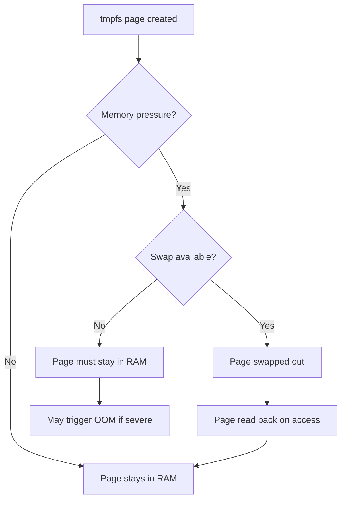

# tmpfs

## Introduction

`tmpfs` is a Linux filesystem that stores all files in virtual memory — specifically, in the kernel's page cache and anonymous memory allocations. Unlike traditional filesystems backed by block devices (disk or SSD), tmpfs has no persistent backing store. Its contents live entirely in RAM (and swap, if available) and are lost on unmount or reboot.

Originally derived from the older `shm` filesystem (POSIX shared memory), tmpfs was generalized in Linux 2.4 to serve multiple purposes: `/tmp`, `/run`, `/dev/shm`, container overlays, and more. It is one of the most frequently mounted filesystems on any modern Linux system.

## How tmpfs Works

### Virtual Memory Backend

tmpfs does not allocate a fixed RAM block. Instead, each page written to tmpfs becomes an anonymous page mapped by the kernel's page management subsystem. This means:

- **Pages can be swapped out** — if swap is configured, tmpfs pages can be evicted to disk under memory pressure, just like any anonymous memory.
- **No block device required** — tmpfs doesn't need a partition, loop device, or disk image.
- **Dynamic sizing** — the filesystem grows and shrinks as files are created and deleted, up to a configurable limit.
- **Shared memory semantics** — tmpfs is the implementation behind POSIX shared memory (`shm_open`), visible at `/dev/shm`.

### Data Structures

Internally, tmpfs uses `shmem_inode_info` structures that extend the standard VFS inode. Key structures include:

```c
/* Simplified from include/linux/shmem_fs.h */
struct shmem_inode_info {
    struct inode        vfs_inode;      /* Standard VFS inode */
    spinlock_t          lock;           /* Protects fields below */
    unsigned long       flags;          /* SHMEM_PAGE_SHIFT, etc */
    struct shared_policy policy;        /* NUMA memory policy */
    struct timespec64   i_crtime;       /* Creation time */
    struct address_space i_mapping;     /* Page cache mapping */
};

struct shmem_sb_info {
    unsigned long max_blocks;           /* Max blocks (from size= option) */
    unsigned long free_inodes;          /* Remaining inode slots */
    spinlock_t    stat_lock;            /* Protects counters */
    kuid_t        uid;                  /* Default owner UID */
    kgid_t        gid;                  /* Default owner GID */
    umode_t       mode;                 /* Default permissions */
    struct list_head swaplist;          /* List of shmem_swaplist_entry */
};
```

Each file's data is tracked through the page cache (`i_mapping`), identical to how regular files cache their data — but with no backing `address_space_operations` that would flush to disk.

## Mount Options

tmpfs supports the following mount options:

| Option | Description | Default |
|--------|-------------|---------|
| `size=<bytes>` | Maximum filesystem size. Accepts K, M, G suffixes. | 50% of RAM |
| `nr_inodes=<count>` | Maximum number of inodes | Half of available RAM in pages |
| `mode=<octal>` | Default permissions for the root directory | `0777` |
| `uid=<id>` | Default owner of the root directory | Mounting user's UID |
| `gid=<id>` | Default group of the root directory | Mounting user's GID |
| `huge=<policy>` | Transparent huge page policy: `never`, `always`, `within_size`, `advise`, `deny` | `never` |
| `mpol=<policy>` | Default NUMA memory policy | Current process policy |
| `inode64` | Use 64-bit inode numbers (avoids stale file handle issues) | Architecture dependent |

### Common Mount Examples

```bash
# Mount a 2GB tmpfs at /tmp with restrictive permissions
mount -t tmpfs -o size=2G,mode=1777 tmpfs /tmp

# Mount for POSIX shared memory (done automatically by systemd)
mount -t tmpfs tmpfs /dev/shm -o size=512M

# Mount with NUMA interleave policy (spread pages across all nodes)
mount -t tmpfs -o size=4G,mpol=interleave tmpfs /mnt/numa_tmpfs

# Mount with transparent huge pages enabled
mount -t tmpfs -o size=10G,huge=always tmpfs /mnt/huge_tmpfs
```

### Examining Current Mounts

```bash
$ mount | grep tmpfs
tmpfs on /dev/shm type tmpfs (rw,nosuid,nodev,size=67108864)
tmpfs on /run type tmpfs (rw,nosuid,nodev,size=819200k,mode=755)
tmpfs on /tmp type tmpfs (rw,nosuid,nodev,size=2097152k)
tmpfs on /sys/fs/cgroup type tmpfs (ro,nosuid,nodev,noexec,mode=755)

$ df -h /tmp /dev/shm
Filesystem      Size  Used Avail Use% Mounted on
tmpfs           2.0G  1.2M  2.0G   1% /tmp
tmpfs            64M  4.0K   64M   1% /dev/shm

$ cat /proc/mounts | grep tmpfs
tmpfs /dev/shm tmpfs rw,nosuid,nodev,size=67108864,inode64 0 0
```

## Use Cases

### 1. /tmp and /run

Most modern distributions mount `/tmp` and `/run` as tmpfs:

- **`/tmp`**: Temporary files benefit from RAM speed. Cleaning on reboot avoids stale temp file accumulation.
- **`/run`**: Runtime data (PID files, sockets, D-Bus) needs fast, volatile storage. Systemd mounts this early in boot.

### 2. POSIX Shared Memory (`/dev/shm`)

The POSIX shared memory API uses tmpfs as its backing store:

```c
#include <fcntl.h>
#include <sys/mman.h>
#include <unistd.h>

int main() {
    /* Create shared memory object */
    int fd = shm_open("/my_shm", O_CREAT | O_RDWR, 0666);
    ftruncate(fd, 4096);

    /* Map it */
    void *ptr = mmap(NULL, 4096, PROT_READ | PROT_WRITE, MAP_SHARED, fd, 0);

    /* Write data — this goes to tmpfs */
    sprintf(ptr, "Hello from shared memory!");

    /* Another process can open and mmap the same name */
    /* Data persists until shm_unlink() and all mappings are closed */

    munmap(ptr, 4096);
    close(fd);
    shm_unlink("/my_shm");
    return 0;
}
```

### 3. Container tmpfs Mounts

Containers often use tmpfs for sensitive or ephemeral data:

```bash
# Docker: mount a tmpfs inside a container
docker run --tmpfs /app/cache:rw,noexec,nosuid,size=100m myimage

# Podman: equivalent
podman run --tmpfs /app/cache:rw,size=100m myimage

# Kubernetes: emptyDir with medium=Memory
# (see YAML in Example section below)
```

### 4. Build Directories and Test Environments

Compiling on tmpfs avoids disk I/O entirely:

```bash
# Use tmpfs for a kernel build
mount -t tmpfs -o size=10G tmpfs /usr/src/linux/build
cd /usr/src/linux
make O=build -j$(nproc)
```

## Size Limits and Memory Management

### Default Size

Without an explicit `size=` option, tmpfs defaults to **50% of total physical RAM**. This is a combined limit across all tmpfs mounts — each mount has its own limit, but they all compete for the same memory pool.

```
# Check RAM and tmpfs usage
$ free -h
              total        used        free      shared  buff/cache   available
Mem:           16Gi       4.2Gi       8.1Gi       128Mi       3.7Gi        11Gi
Swap:         8.0Gi          0B       8.0Gi
```

### What Happens When tmpfs is Full?

When a tmpfs mount reaches its `size=` limit, writes fail with `ENOSPC`:

```bash
$ mount -t tmpfs -o size=100M tmpfs /mnt/test
$ dd if=/dev/zero of=/mnt/test/fill bs=1M count=99
99+0 records in
99+0 records out
103809024 bytes (104 MB, 99 MiB) copied, 0.045 s, 2.3 GB/s
$ dd if=/dev/zero of=/mnt/test/more bs=1M count=2
dd: error writing '/mnt/test/more': No space left on device
```

**Important**: tmpfs does NOT enforce a hard memory reservation. The `size=` limit only caps the filesystem's own usage. If the system runs low on memory overall, the OOM killer may still be invoked for other processes, even if tmpfs holds memory that could theoretically be freed (since tmpfs pages can be swapped).

### Swap Interaction

tmpfs pages participate in normal memory reclaim:



## tmpfs vs Other RAM-backed Filesystems

| Feature | tmpfs | ramfs | devtmpfs |
|---------|-------|-------|----------|
| Swap support | Yes | No | Yes |
| Size limit | Configurable | Unlimited (grows until OOM) | Limited like tmpfs |
| Can be remounted | Yes | No | No |
| Typical use | /tmp, /run, /dev/shm | Early boot | Device nodes |
| Source | `mm/shmem.c` | `fs/ramfs/` | `drivers/base/devtmpfs.c` |

## Kubernetes tmpfs Example

```yaml
apiVersion: v1
kind: Pod
metadata:
  name: tmpfs-demo
spec:
  containers:
    - name: app
      image: nginx:latest
      volumeMounts:
        - mountPath: /cache
          name: cache-volume
  volumes:
    - name: cache-volume
      emptyDir:
        medium: Memory    # This creates a tmpfs mount
        sizeLimit: 256Mi  # Optional: enforce size limit
```

## Implementation Details

### Key Source Files

- **`mm/shmem.c`** — Core tmpfs implementation (~4000 lines)
- **`include/linux/shmem_fs.h`** — Header with data structures
- **`mm/shmem_swap.c`** — Swap support for tmpfs

### Page Allocation Flow

When a file on tmpfs is written:

1. `shmem_write_begin()` is called via VFS
2. `shmem_get_folio_gfp()` allocates a folio (page or compound page)
3. The folio is attached to the file's `address_space` (page cache)
4. No block I/O occurs — the page is immediately "written"
5. On read, `shmem_read_folio()` finds the page in the page cache or swap

### inode Allocation

tmpfs dynamically allocates inodes using `shmem_alloc_inode()`. The `nr_inodes` mount option controls how many can exist simultaneously. When the limit is hit, `ENOSPC` is returned even if `size=` has room.

## References

- [tmpfs kernel documentation](https://www.kernel.org/doc/html/latest/filesystems/tmpfs.html)
- [shmem.c source (torvalds/linux)](https://github.com/torvalds/linux/blob/master/mm/shmem.c)
- [mount(8) man page — tmpfs options](https://man7.org/linux/man-pages/man8/mount.8.html)
- [POSIX Shared Memory Overview](https://man7.org/linux/man-pages/man7/shm_overview.7.html)

## Further Reading

- https://www.kernel.org/doc/html/latest/filesystems/tmpfs.html
- https://man7.org/linux/man-pages/man5/tmpfs.5.html
- https://lwn.net/Articles/145735/ — "tmpfs and friends"
- https://lwn.net/Articles/351124/ — "A new tmpfs feature: huge pages"

## Related Topics

- [devtmpfs](./devtmpfs.md) — A specialized tmpfs variant for device nodes
- [mounting](./mounting.md) — How tmpfs is mounted via `mount(2)` and mount namespaces
- [buffer-cache](../memory/buffer-cache.md) — How tmpfs interacts with the page cache
- [numa](../memory/numa.md) — NUMA policies for tmpfs (`mpol=` option)
