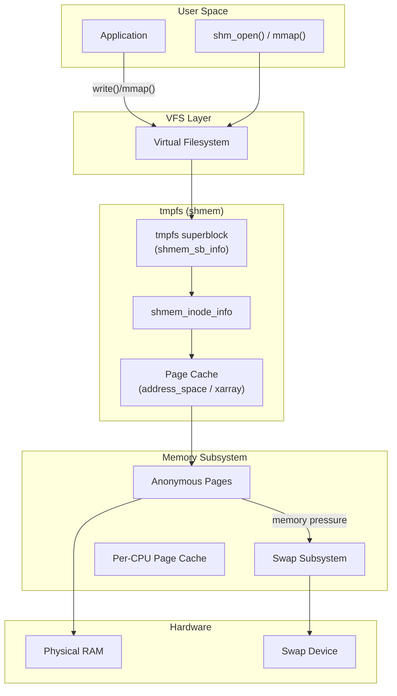
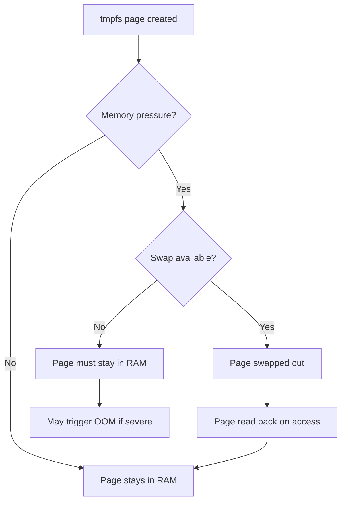
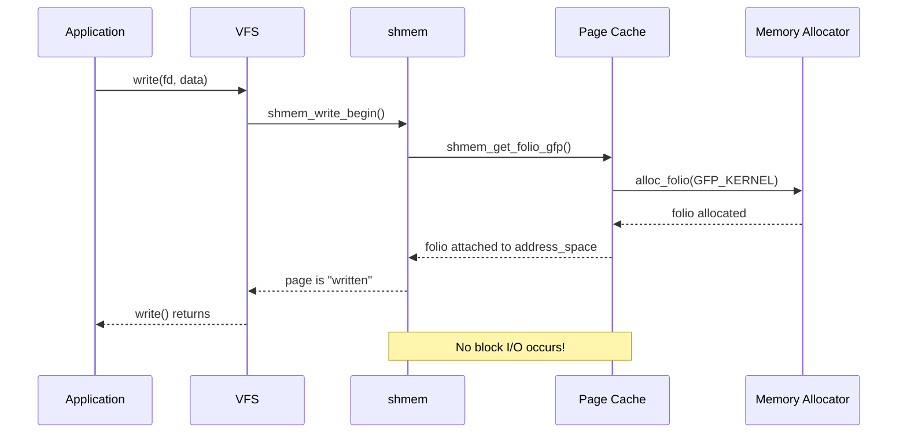

# tmpfs

## Introduction

`tmpfs` is a Linux filesystem that stores all files in virtual memory —
specifically, in the kernel's page cache and anonymous memory allocations.
Unlike traditional filesystems backed by block devices (disk or SSD), tmpfs
has no persistent backing store.  Its contents live entirely in RAM (and
swap, if available) and are lost on unmount or reboot.

Originally derived from the older `shm` filesystem (POSIX shared memory),
tmpfs was generalized in Linux 2.4 to serve multiple purposes: `/tmp`,
`/run`, `/dev/shm`, container overlays, and more.  It is one of the most
frequently mounted filesystems on any modern Linux system.

---

## 1. Architecture Overview



---

## 2. How tmpfs Works

### 2.1 Virtual Memory Backend

tmpfs does not allocate a fixed RAM block.  Instead, each page written to
tmpfs becomes an anonymous page mapped by the kernel's page management
subsystem.  This means:

* **Pages can be swapped out** — if swap is configured, tmpfs pages can be
  evicted to disk under memory pressure, just like any anonymous memory.
* **No block device required** — tmpfs doesn't need a partition, loop
  device, or disk image.
* **Dynamic sizing** — the filesystem grows and shrinks as files are
  created and deleted, up to a configurable limit.
* **Shared memory semantics** — tmpfs is the implementation behind POSIX
  shared memory (`shm_open`), visible at `/dev/shm`.

### 2.2 Data Structures

Internally, tmpfs uses `shmem_inode_info` structures that extend the
standard VFS inode:

```c
/* Simplified from include/linux/shmem_fs.h */
struct shmem_inode_info {
    struct inode        vfs_inode;      /* Standard VFS inode */
    spinlock_t          lock;           /* Protects fields below */
    unsigned long       flags;          /* SHMEM_PAGE_SHIFT, etc */
    struct shared_policy policy;        /* NUMA memory policy */
    struct timespec64   i_crtime;       /* Creation time */
    struct address_space i_mapping;     /* Page cache mapping */
    unsigned int        seals;          /* F_SEAL_* for memfd */
};

struct shmem_sb_info {
    unsigned long max_blocks;           /* Max blocks (from size= option) */
    unsigned long free_inodes;          /* Remaining inode slots */
    spinlock_t    stat_lock;            /* Protects counters */
    kuid_t        uid;                  /* Default owner UID */
    kgid_t        gid;                  /* Default owner GID */
    umode_t       mode;                 /* Default permissions */
    struct list_head swaplist;          /* List of shmem_swaplist_entry */
    /* Huge page tracking */
    unsigned long huge;                 /* Huge page policy */
};
```

### 2.3 VFS Operations

tmpfs implements standard VFS interfaces:

```c
/* mm/shmem.c — key operations */
static const struct super_operations shmem_ops = {
    .alloc_inode   = shmem_alloc_inode,
    .destroy_inode = shmem_destroy_inode,
    .statfs        = shmem_statfs,
    .show_options  = shmem_show_options,
    .free_inode    = shmem_free_in_core_inode,
};

static const struct inode_operations shmem_inode_ops = {
    .create        = shmem_create,
    .lookup        = simple_lookup,
    .link          = shmem_link,
    .unlink        = shmem_unlink,
    .symlink       = shmem_symlink,
    .mkdir         = shmem_mkdir,
    .rmdir         = shmem_rmdir,
    .mknod         = shmem_mknod,
    .rename        = shmem_rename2,
    .setattr       = shmem_setattr,
    .getattr       = shmem_getattr,
    .get_acl       = shmem_get_acl,
};

static const struct address_space_operations shmem_aops = {
    .writepage     = shmem_writepage,
    .dirty_folio   = noop_dirty_folio,
    .write_begin   = shmem_write_begin,
    .write_end     = shmem_write_end,
};
```

---

## 3. Mount Options

tmpfs supports the following mount options:

| Option | Description | Default |
|--------|-------------|---------|
| `size=<bytes>` | Maximum filesystem size. Accepts K, M, G suffixes. | 50% of RAM |
| `nr_inodes=<count>` | Maximum number of inodes | Half of available RAM in pages |
| `mode=<octal>` | Default permissions for the root directory | `0777` |
| `uid=<id>` | Default owner of the root directory | Mounting user's UID |
| `gid=<id>` | Default group of the root directory | Mounting user's GID |
| `huge=<policy>` | Transparent huge page policy | `never` |
| `mpol=<policy>` | Default NUMA memory policy | Current process policy |
| `inode64` | Use 64-bit inode numbers | Architecture dependent |

### 3.1 Huge Page Policies

The `huge=` option controls transparent huge page (THP) behavior on tmpfs:

| Policy | Behavior |
|--------|----------|
| `never` | Never use huge pages (default) |
| `always` | Attempt huge pages for all allocations |
| `within_size` | Only use huge pages within `size=` limit |
| `advise` | Use huge pages only for `MADV_HUGEPAGE` regions |
| `deny` | Explicitly disable huge pages, even if requested |

```bash
# Mount with huge pages for large working sets
mount -t tmpfs -o size=10G,huge=always tmpfs /mnt/huge_tmpfs

# Verify huge page usage
cat /sys/kernel/mm/transparent_hugepage/shmem_enabled
# always inherit within_size advise never deny force
```

### 3.2 NUMA Memory Policies

The `mpol=` option controls how tmpfs pages are distributed across NUMA
nodes:

| Policy | Behavior |
|--------|----------|
| `default` | Allocate on the current CPU's node |
| `bind:<nodes>` | Only allocate on specified nodes |
| `interleave` | Round-robin across all nodes |
| `preferred:<node>` | Prefer specified node, fall back to others |
| `local` | Always allocate on the local node |

```bash
# Interleave across all NUMA nodes (good for shared data)
mount -t tmpfs -o size=4G,mpol=interleave tmpfs /mnt/numa_tmpfs

# Bind to specific nodes (0 and 1)
mount -t tmpfs -o size=4G,mpol=bind:0-1 tmpfs /mnt/bound_tmpfs
```

### 3.3 Common Mount Examples

```bash
# Mount a 2GB tmpfs at /tmp with restrictive permissions
mount -t tmpfs -o size=2G,mode=1777 tmpfs /tmp

# Mount for POSIX shared memory (done automatically by systemd)
mount -t tmpfs tmpfs /dev/shm -o size=512M

# Mount with NUMA interleave policy
mount -t tmpfs -o size=4G,mpol=interleave tmpfs /mnt/numa_tmpfs

# Mount with transparent huge pages enabled
mount -t tmpfs -o size=10G,huge=always tmpfs /mnt/huge_tmpfs
```

---

## 4. Use Cases

### 4.1 /tmp and /run

Most modern distributions mount `/tmp` and `/run` as tmpfs:

* **`/tmp`**: Temporary files benefit from RAM speed.  Cleaning on reboot
  avoids stale temp file accumulation.
* **`/run`**: Runtime data (PID files, sockets, D-Bus) needs fast, volatile
  storage.  Systemd mounts this early in boot.

```bash
# Check tmpfs mounts
$ df -h /tmp /run /dev/shm
Filesystem      Size  Used Avail Use% Mounted on
tmpfs           2.0G  1.2M  2.0G   1% /tmp
tmpfs           800M  1.5M  799M   1% /run
tmpfs            64M  4.0K   64M   1% /dev/shm
```

### 4.2 POSIX Shared Memory (`/dev/shm`)

The POSIX shared memory API uses tmpfs as its backing store:

```c
#include <fcntl.h>
#include <sys/mman.h>
#include <unistd.h>
#include <stdio.h>
#include <string.h>

int main() {
    /* Create shared memory object */
    int fd = shm_open("/my_shm", O_CREAT | O_RDWR, 0666);
    ftruncate(fd, 4096);

    /* Map it */
    void *ptr = mmap(NULL, 4096, PROT_READ | PROT_WRITE, MAP_SHARED, fd, 0);

    /* Write data — this goes to tmpfs */
    sprintf(ptr, "Hello from shared memory!");

    /* Another process can open and mmap the same name */
    /* Data persists until shm_unlink() and all mappings are closed */

    munmap(ptr, 4096);
    close(fd);
    shm_unlink("/my_shm");
    return 0;
}
```

### 4.3 Container tmpfs Mounts

Containers often use tmpfs for sensitive or ephemeral data:

```bash
# Docker: mount a tmpfs inside a container
docker run --tmpfs /app/cache:rw,noexec,nosuid,size=100m myimage

# Podman: equivalent
podman run --tmpfs /app/cache:rw,size=100m myimage

# Kubernetes: emptyDir with medium=Memory (see YAML below)
```

### 4.4 Build Directories and Test Environments

Compiling on tmpfs avoids disk I/O entirely:

```bash
# Use tmpfs for a kernel build
mount -t tmpfs -o size=10G tmpfs /usr/src/linux/build
cd /usr/src/linux
make O=build -j$(nproc)
```

### 4.5 memfd_create — Anonymous tmpfs Files

`memfd_create()` creates anonymous tmpfs files that can be sealed:

```c
#include <sys/mman.h>
#include <stdio.h>

int main() {
    /* Create an anonymous tmpfs file */
    int fd = memfd_create("my_memfd", MFD_CLOEXEC | MFD_ALLOW_SEALING);

    /* Write data */
    write(fd, "secret data", 11);

    /* Seal the file — prevents further modification */
    fcntl(fd, F_ADD_SEALS, F_SEAL_SHRINK | F_SEAL_GROW |
                           F_SEAL_WRITE | F_SEAL_SEAL);

    /* Map it */
    void *ptr = mmap(NULL, 4096, PROT_READ, MAP_SHARED, fd, 0);
    printf("Data: %s\n", (char *)ptr);

    /* File is automatically cleaned up when fd is closed */
    return 0;
}
```

---

## 5. Size Limits and Memory Management

### 5.1 Default Size

Without an explicit `size=` option, tmpfs defaults to **50% of total
physical RAM**.  Each mount has its own limit, but they all compete for the
same memory pool.

```bash
# Check RAM and tmpfs usage
$ free -h
              total        used        free      shared  buff/cache   available
Mem:           16Gi       4.2Gi       8.1Gi       128Mi       3.7Gi        11Gi
Swap:         8.0Gi          0B       8.0Gi
```

### 5.2 What Happens When tmpfs is Full?

When a tmpfs mount reaches its `size=` limit, writes fail with `ENOSPC`:

```bash
$ mount -t tmpfs -o size=100M tmpfs /mnt/test
$ dd if=/dev/zero of=/mnt/test/fill bs=1M count=99
99+0 records in
99+0 records out
$ dd if=/dev/zero of=/mnt/test/more bs=1M count=2
dd: error writing '/mnt/test/more': No space left on device
```

**Important**: tmpfs does NOT enforce a hard memory reservation.  The
`size=` limit only caps the filesystem's own usage.  If the system runs low
on memory overall, the OOM killer may still be invoked for other processes,
even if tmpfs holds memory that could theoretically be freed (since tmpfs
pages can be swapped).

### 5.3 Swap Interaction

tmpfs pages participate in normal memory reclaim:



---

## 6. tmpfs vs Other RAM-backed Filesystems

| Feature | tmpfs | ramfs | devtmpfs |
|---------|-------|-------|----------|
| Swap support | Yes | No | Yes |
| Size limit | Configurable | Unlimited (grows until OOM) | Limited like tmpfs |
| Can be remounted | Yes | No | No |
| Typical use | /tmp, /run, /dev/shm | Early boot | Device nodes |
| Source | `mm/shmem.c` | `fs/ramfs/` | `drivers/base/devtmpfs.c` |
| Huge pages | Yes | No | No |
| NUMA policies | Yes | No | No |

---

## 7. Implementation Details

### 7.1 Key Source Files

* **`mm/shmem.c`** — Core tmpfs implementation (~4000 lines)
* **`include/linux/shmem_fs.h`** — Header with data structures
* **`mm/shmem_swap.c`** — Swap support for tmpfs

### 7.2 Page Allocation Flow

When a file on tmpfs is written:



### 7.3 inode Allocation

tmpfs dynamically allocates inodes using `shmem_alloc_inode()`.  The
`nr_inodes` mount option controls how many can exist simultaneously.  When
the limit is hit, `ENOSPC` is returned even if `size=` has room.

```bash
# Check inode usage
$ df -i /tmp
Filesystem      Inodes   IUsed   IFree IUse% Mounted on
tmpfs          2097152     128 2097024    1% /tmp

# Set custom inode limit
mount -t tmpfs -o nr_inodes=100000,size=1G tmpfs /mnt/test
```

### 7.4 shmem_swaplist

When memory pressure occurs, the kernel needs to know which tmpfs pages
can be swapped out.  The `swaplist` in `shmem_sb_info` tracks tmpfs
inodes that have swap-backed pages:

```c
/* mm/shmem_swap.c — simplified */
static int shmem_swaplist_add(struct shmem_inode_info *info)
{
    /* Add inode to the global shmem swaplist */
    spin_lock(&sbinfo->swaplist_lock);
    if (list_empty(&info->swaplist)) {
        list_add_tail(&info->swaplist, &sbinfo->swaplist);
    }
    spin_unlock(&sbinfo->swaplist_lock);
    return 0;
}
```

---

## 8. Performance Considerations

### 8.1 tmpfs Performance Characteristics

| Operation | Typical Latency | Notes |
|-----------|----------------|-------|
| Sequential read | ~10 GB/s | Memory bandwidth limited |
| Sequential write | ~8 GB/s | Memory bandwidth limited |
| Random 4K read | ~1 µs | No disk seek |
| Random 4K write | ~1 µs | No disk seek |
| File creation | ~5 µs | inode allocation + dentry |
| File deletion | ~3 µs | Cleanup + page release |

### 8.2 When NOT to Use tmpfs

* **Large datasets that exceed RAM** — tmpfs will swap, killing performance
* **Data that must survive reboots** — tmpfs is volatile
* **Workloads with heavy random I/O on large files** — page cache pressure
* **Systems without swap** — tmpfs pages can never be evicted

### 8.3 Monitoring tmpfs Usage

```bash
# Per-mount usage
$ df -h /tmp /dev/shm /run

# Detailed memory accounting
$ cat /proc/meminfo | grep -E "Shmem|Cached"
Shmem:          131072 kB    # Total shared memory (tmpfs + shmem)
Cached:        4194304 kB    # Page cache (includes tmpfs)

# Per-process tmpfs usage
$ cat /proc/<pid>/status | grep -i shmem
ShmemPmdMapped:         0 kB
Shmem:               4096 kB
```

---

## 9. Kubernetes tmpfs Example

```yaml
apiVersion: v1
kind: Pod
metadata:
  name: tmpfs-demo
spec:
  containers:
    - name: app
      image: nginx:latest
      volumeMounts:
        - mountPath: /cache
          name: cache-volume
  volumes:
    - name: cache-volume
      emptyDir:
        medium: Memory    # This creates a tmpfs mount
        sizeLimit: 256Mi  # Optional: enforce size limit
```

---

## 10. systemd tmpfiles.d

systemd uses `tmpfiles.d` configuration to manage tmpfs mounts and
temporary files at boot:

```bash
# /etc/tmpfiles.d/myapp.conf
# Type  Path          Mode  User  Group  Age  Argument
d       /run/myapp    0755  root  root   -    -
f       /run/myapp/pid 0644 root root   -    -
```

```bash
# Apply tmpfiles.d configuration
systemd-tmpfiles --create /etc/tmpfiles.d/myapp.conf

# Clean up old files
systemd-tmpfiles --clean /etc/tmpfiles.d/myapp.conf
```

---

## 11. Troubleshooting

### 11.1 Common Issues

| Symptom | Cause | Solution |
|---------|-------|----------|
| ENOSPC on tmpfs | `size=` limit reached | Increase `size=` or free space |
| OOM killer invoked | tmpfs consuming too much RAM | Reduce tmpfs `size=`, add swap |
| Slow tmpfs performance | Swapping to disk | Increase RAM or reduce tmpfs usage |
| Missing /dev/shm | Not mounted | Add to fstab or systemd unit |
| Permission denied | Wrong uid/gid on mount | Set `uid=`/`gid=` options |

### 11.2 Debugging

```bash
# Check all tmpfs mounts and their options
$ mount | grep tmpfs

# Check memory pressure on tmpfs
$ cat /proc/pressure/memory
some avg10=0.00 avg60=0.00 avg300=0.00 total=0
full avg10=0.00 avg60=0.00 avg300=0.00 total=0

# Monitor swap activity for tmpfs pages
$ vmstat 1
procs -----------memory---------- ---swap--
 r  b   swpd   free   buff  cache   si   so
 0  0      0 8388608 524288 4194304   0    0

# Check if a specific file's pages are in swap
$ cat /proc/<pid>/smaps | grep -A 5 "/dev/shm"
```

---

## 12. References

* [tmpfs kernel documentation](https://www.kernel.org/doc/html/latest/filesystems/tmpfs.html)
* [shmem.c source (torvalds/linux)](https://github.com/torvalds/linux/blob/master/mm/shmem.c)
* [mount(8) man page — tmpfs options](https://man7.org/linux/man-pages/man8/mount.8.html)
* [POSIX Shared Memory Overview](https://man7.org/linux/man-pages/man7/shm_overview.7.html)
* [LWN: tmpfs and friends](https://lwn.net/Articles/145735/)
* [LWN: A new tmpfs feature: huge pages](https://lwn.net/Articles/351124/)
* [Kernel internals: tmpfs](https://kernel-internals.org/filesystems/tmpfs/)
* [Transparent Hugepage Support](https://docs.kernel.org/admin-guide/mm/transhuge.html)

## Related Topics

* [devtmpfs](./devtmpfs.md) — A specialized tmpfs variant for device nodes
* [mounting](./mounting.md) — How tmpfs is mounted via `mount(2)` and mount namespaces
* [buffer-cache](../memory/buffer-cache.md) — How tmpfs interacts with the page cache
* [numa](../memory/numa.md) — NUMA policies for tmpfs (`mpol=` option)
* [Page Cache](../memory/page-cache.md) — Underlying caching mechanism
* [Swap](../memory/swap.md) — Swap subsystem for tmpfs pages
* [Huge Pages](../memory/huge-pages.md) — THP support in tmpfs
