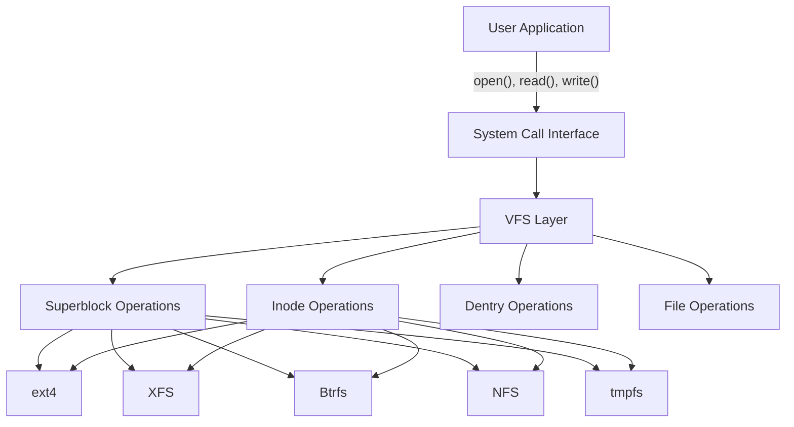
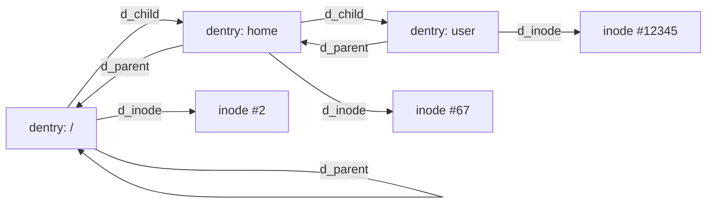
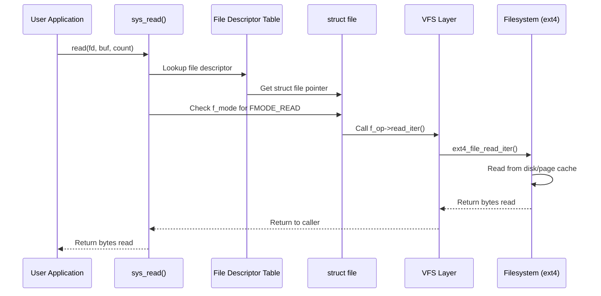

# Virtual File System (VFS)

## Introduction

The Virtual File System (VFS), sometimes called the Virtual Filesystem Switch, is an abstraction layer
within the Linux kernel that provides a uniform interface for userspace applications to interact with
different filesystem implementations. Whether the underlying storage is a local ext4 partition, a
network-mounted NFS share, a pseudo-filesystem like procfs, or an in-memory tmpfs, the VFS presents
them all through the same system call interface: `open()`, `read()`, `write()`, `stat()`, `close()`,
and so on.

The VFS was originally inspired by SunOS's VFS layer and was introduced in SVR4. Linux adopted the
concept early in its development, and it has evolved considerably since. The design enables Linux to
support dozens of filesystem types without requiring application developers to know anything about the
underlying implementation.

## Core Architecture

The VFS defines four primary object types that every filesystem must implement:

| Object | Represents | Key Structure |
|--------|-----------|---------------|
| **Superblock** | A mounted filesystem | `struct super_block` |
| **Inode** | A single file/directory | `struct inode` |
| **Dentry** | A name-to-inode mapping | `struct dentry` |
| **File** | An open file handle | `struct file` |

Each object type has an associated operations table (a structure of function pointers) that the
specific filesystem fills in. This is the mechanism through which VFS dispatches operations to
real filesystems.



## The Superblock Object

The superblock represents a mounted filesystem. It contains metadata about the filesystem itself:
its type, block size, flags, and pointers to filesystem-specific data.

### Structure Overview

```c
struct super_block {
    struct list_head    s_list;         /* list of all superblocks */
    dev_t               s_dev;          /* device identifier */
    unsigned char       s_blocksize_bits;
    unsigned long       s_blocksize;
    loff_t              s_maxbytes;     /* max file size */
    struct file_system_type *s_type;    /* filesystem type */
    const struct super_operations *s_op; /* superblock operations */
    struct dentry       *s_root;        /* root dentry */
    struct mutex        s_lock;
    int                 s_count;        /* reference count */
    atomic_long_t       s_active;
    const struct dentry_operations *s_d_op; /* default dentry ops */
    struct block_device *s_bdev;        /* underlying block device */
    void               *s_fs_info;      /* filesystem-specific info */
    /* ... many more fields ... */
};
```

### Superblock Operations

The `super_operations` structure defines how the VFS interacts with a mounted filesystem:

```c
struct super_operations {
    struct inode *(*alloc_inode)(struct super_block *sb);
    void (*destroy_inode)(struct inode *);
    void (*dirty_inode)(struct inode *, int flags);
    int (*write_inode)(struct inode *, struct writeback_control *wbc);
    void (*evict_inode)(struct inode *);
    void (*put_super)(struct super_block *);
    int (*sync_fs)(struct super_block *sb, int wait);
    int (*freeze_fs)(struct super_block *);
    int (*unfreeze_fs)(struct super_block *);
    int (*statfs)(struct dentry *, struct kstatfs *);
    int (*remount_fs)(struct super_block *, int *, char *);
    void (*umount_begin)(struct super_block *);
    int (*show_options)(struct seq_file *, struct dentry *);
    /* ... */
};
```

**Key operations explained:**

- **`alloc_inode`**: Called when the VFS needs a new inode. Filesystems override this to allocate their own inode structure (e.g., `struct ext4_inode_info` which embeds `struct inode`).
- **`write_inode`**: Called to write an inode's metadata back to disk, typically during writeback.
- **`evict_inode`**: Called when an inode is being destroyed. Filesystems clean up their private data.
- **`put_super`**: Called during `umount` to release the superblock.
- **`sync_fs`**: Forces all pending filesystem metadata to disk.
- **`statfs`**: Returns filesystem statistics (used by `df`).

### Mount Process

When a user runs `mount -t ext4 /dev/sda1 /mnt`, the kernel:

1. Looks up the filesystem type in the registered filesystem list
2. Calls the filesystem's `mount` method (`ext4_mount`)
3. The filesystem reads the on-disk superblock and populates `struct super_block`
4. The root inode is read and a root dentry is created
5. The superblock is linked into the global superblock list

```c
/* Simplified mount flow */
struct dentry *mount_bdev(struct file_system_type *fs_type,
    int flags, const char *dev_name, void *data,
    int (*fill_super)(struct super_block *, void *, int))
{
    struct block_device *bdev;
    struct super_block *s;

    bdev = blkdev_get_by_path(dev_name, mode, fs_type);
    /* Check if this device is already mounted */
    s = sget(fs_type, test, set, flags, bdev);
    if (s->s_root) {
        /* Already mounted - return existing root dentry */
        return dget(s->s_root);
    }
    /* New mount - let filesystem fill in the superblock */
    fill_super(s, data, flags & SB_SILENT ? 1 : 0);
    return dget(s->s_root);
}
```

## The Inode Object

An inode represents a filesystem object (file, directory, symlink, device node, etc.). It contains
all the metadata about the object except its name. See [Inode](./inode.md) for a deep dive.

### Key Fields

```c
struct inode {
    umode_t             i_mode;         /* file type and permissions */
    unsigned short      i_opflags;
    kuid_t              i_uid;          /* owner UID */
    kgid_t              i_gid;          /* owner GID */
    unsigned int        i_flags;
    const struct inode_operations *i_op; /* inode operations */
    struct super_block  *i_sb;          /* owning superblock */
    struct address_space *i_mapping;    /* page cache mapping */
    unsigned long       i_ino;          /* inode number */
    loff_t              i_size;         /* file size in bytes */
    struct timespec64   __i_atime;      /* access time */
    struct timespec64   __i_mtime;      /* modification time */
    struct timespec64   __i_ctime;      /* change time */
    unsigned short      i_bytes;
    blkcnt_t            i_blocks;       /* number of blocks */
    union {
        const struct file_operations *i_fops;  /* for regular files */
        const struct dir_operations  *dir_ops; /* for directories (new) */
    };
    struct address_space i_data;        /* embedded address_space */
    /* ... */
};
```

### Inode Operations

```c
struct inode_operations {
    struct dentry *(*lookup)(struct inode *, struct dentry *, unsigned int);
    int (*create)(struct mnt_idmap *, struct inode *, struct dentry *,
                  umode_t, bool);
    int (*link)(struct dentry *, struct inode *, struct dentry *);
    int (*unlink)(struct inode *, struct dentry *);
    int (*symlink)(struct mnt_idmap *, struct inode *, struct dentry *,
                   const char *);
    int (*mkdir)(struct mnt_idmap *, struct inode *, struct dentry *, umode_t);
    int (*rmdir)(struct inode *, struct dentry *);
    int (*rename)(struct mnt_idmap *, struct inode *, struct dentry *,
                  struct inode *, struct dentry *, unsigned int);
    int (*setattr)(struct mnt_idmap *, struct dentry *, struct iattr *);
    int (*getattr)(struct mnt_idmap *, const struct path *, struct kstat *,
                   u32, unsigned int);
    ssize_t (*listxattr)(struct dentry *, char *, size_t);
    /* ... */
};
```

## The Dentry Object

A dentry (directory entry) represents a link between a name and an inode. A single inode can have
multiple dentries (hard links). Dentries form a tree structure that mirrors the directory hierarchy.
See [Dentry](./dentry.md) for the full treatment.

### Key Relationships



### Dentry States

A dentry can be in one of three states:

1. **Unused** (`d_count == 0`): The dentry is in the cache but not actively referenced. It can be reclaimed under memory pressure.
2. **In-use** (`d_count > 0`): The dentry is actively being used by one or more processes.
3. **Negative**: The dentry has been looked up but no corresponding inode exists. This caches "file not found" results to avoid repeated disk lookups.

## The File Object

A file object represents an open file — a conversation between a process and a file. It is created
by `open()` and destroyed by `close()`. Multiple file objects can point to the same dentry (e.g., if
a file is opened multiple times).

```c
struct file {
    union {
        struct llist_node   fu_llist;
        struct rcu_head     fu_rcuhead;
    } f_u;
    struct path             f_path;         /* contains dentry and vfsmount */
    struct inode            *f_inode;       /* cached inode */
    const struct file_operations *f_op;     /* file operations */
    spinlock_t              f_lock;
    atomic_long_t           f_count;        /* reference count */
    unsigned int            f_flags;        /* O_RDONLY, O_NONBLOCK, etc. */
    fmode_t                 f_mode;         /* FMODE_READ, FMODE_WRITE */
    struct mutex            f_pos_lock;
    loff_t                  f_pos;          /* current file offset */
    struct fown_struct      f_owner;
    void                    *private_data;  /* filesystem-private data */
    struct address_space    *f_mapping;     /* page cache mapping */
    /* ... */
};
```

### File Operations

This is the most commonly used operations table — it defines what happens when userspace calls
`read()`, `write()`, `mmap()`, `ioctl()`, etc.

```c
struct file_operations {
    struct module *owner;
    loff_t (*llseek)(struct file *, loff_t, int);
    ssize_t (*read)(struct file *, char __user *, size_t, loff_t *);
    ssize_t (*write)(struct file *, const char __user *, size_t, loff_t *);
    ssize_t (*read_iter)(struct kiocb *, struct iov_iter *);
    ssize_t (*write_iter)(struct kiocb *, struct iov_iter *);
    int (*iopoll)(struct kiocb *kiocb, struct io_comp_batch *, unsigned int flags);
    int (*iterate_shared)(struct file *, struct dir_context *);
    __poll_t (*poll)(struct file *, struct poll_table_struct *);
    long (*unlocked_ioctl)(struct file *, unsigned int, unsigned long);
    long (*compat_ioctl)(struct file *, unsigned int, unsigned long);
    int (*mmap)(struct file *, struct vm_area_struct *);
    int (*open)(struct inode *, struct file *);
    int (*flush)(struct file *, fl_owner_t id);
    int (*release)(struct inode *, struct file *);
    int (*fsync)(struct file *, loff_t, loff_t, int datasync);
    int (*fasync)(int, struct file *, int);
    int (*lock)(struct file *, int, struct file_lock *);
    /* ... */
};
```

## VFS Dispatch: How an Operation Reaches the Filesystem

Let's trace what happens when a userspace application calls `read(fd, buf, count)`:



### Step-by-Step Breakdown

1. **System call entry**: The `read()` libc function triggers the `sys_read` system call via `syscall` instruction.

2. **File descriptor lookup**: The kernel indexes into the process's file descriptor table (`files_struct`) to find the `struct file` pointer for `fd`.

3. **Permission check**: The kernel verifies that the file was opened with `FMODE_READ`.

4. **Operation dispatch**: The kernel calls `f_op->read_iter()` (or the legacy `f_op->read()`) via the function pointer in the file's operations table.

5. **Filesystem implementation**: For ext4, this calls `ext4_file_read_iter()`, which may read from the page cache or initiate disk I/O via the block layer.

6. **Return path**: The result propagates back through the VFS to userspace.

### The `iterate_shared` / `dir_context` Pattern for Directories

Reading directories uses a different mechanism than reading regular files:

```c
/* How readdir works */
struct dir_context {
    filldir_t actor;    /* callback function */
    loff_t pos;         /* current position */
};

/* ext4's implementation */
static int ext4_readdir(struct file *file, struct dir_context *ctx)
{
    /* Iterate over directory entries, calling ctx->actor for each */
    /* ctx->actor fills the user's dirent buffer */
}
```

## Path Resolution

When the kernel needs to look up a path like `/home/user/file.txt`, it walks the dentry tree:

```c
/* Simplified path resolution */
static int link_path_walk(const char *name, struct nameidata *nd)
{
    while (*name == '/')
        name++;
    if (!*name) {
        nd->flags |= LOOKUP_JUMPED;
        return 0;
    }

    /* Walk each component */
    while (1) {
        struct path link = nd->path;
        struct inode *inode = link.dentry->d_inode;

        /* Look up this component in the parent directory */
        nd->dentry = inode->i_op->lookup(inode, next_dentry, nd->flags);

        /* Handle symlinks, mount points, etc. */
        /* Move to next component */
        name = next_component;
    }
}
```

### Mount Point Crossing

When path resolution encounters a mount point, the VFS transparently follows it. The `struct mount`
structure tracks the mount tree, and `lookup_mnt()` finds the child mount at a given mountpoint dentry.

### Automounts and DCACHE_NEED_AUTOMOUNT

Filesystems like autofs set the `DCACHE_NEED_AUTOMOUNT` flag on dentries. When path resolution
encounters such a dentry, the VFS calls `dentry->d_op->d_manage()` or triggers an automount before
proceeding.

## Filesystem Registration

Each filesystem type registers itself with the VFS at module init time:

```c
static struct file_system_type ext4_fs_type = {
    .name       = "ext4",
    .mount      = ext4_mount,
    .kill_sb    = kill_block_super,
    .fs_flags   = FS_REQUIRES_DEV,
};

static int __init init_ext4_fs(void)
{
    return register_filesystem(&ext4_fs_type);
}

static void __exit exit_ext4_fs(void)
{
    unregister_filesystem(&ext4_fs_type);
}
```

The `file_system_type` structure is minimal — it provides the entry point for mounting. Once mounted,
all interaction goes through the superblock, inode, dentry, and file operations.

## The Page Cache and Address Space

The VFS integrates tightly with the page cache through the `address_space` structure:

```c
struct address_space {
    struct inode        *host;          /* owning inode */
    struct xarray       i_pages;        /* page cache xarray */
    struct rw_semaphore invalidate_lock;
    gfp_t               gfp_mask;       /* allocation flags */
    atomic_t            i_mmap_writable;
    struct rb_root_cached i_mmap;       /* mmap'd regions */
    unsigned long       nrpages;        /* total pages */
    pgoff_t             writeback_index;
    const struct address_space_operations *a_ops;
    unsigned long       flags;
    errseq_t            wb_err;
    spinlock_t          i_private_lock;
    struct list_head    i_private_list;
};
```

The `address_space_operations` define how the page cache interacts with the storage:

```c
struct address_space_operations {
    int (*writepage)(struct page *, struct writeback_control *);
    int (*read_folio)(struct file *, struct folio *);
    int (*writepages)(struct address_space *, struct writeback_control *);
    bool (*dirty_folio)(struct address_space *, struct folio *);
    void (*readahead)(struct readahead_control *);
    int (*write_begin)(struct file *, struct address_space *, loff_t,
                       unsigned, struct page **, void **);
    int (*write_end)(struct file *, struct address_space *, loff_t,
                     unsigned, unsigned, struct page *, void *);
    sector_t (*bmap)(struct address_space *, sector_t);
    int (*swap_activate)(struct swap_info_struct *, struct file *, sector_t *);
    /* ... */
};
```

## Pseudo-Filesystems

Not all VFS filesystems have backing storage. The VFS supports pseudo-filesystems that generate
content dynamically:

- **procfs** (`/proc`): Exposes kernel and process information. See [procfs](./procfs.md).
- **sysfs** (`/sys`): Exports kernel data structures. See [sysfs](./sysfs.md).
- **tmpfs**: In-memory filesystem using the page cache.
- **devpts**: Pseudo-terminal devices.
- **pipefs, sockfs, bpf, tracefs**: Special-purpose virtual filesystems.

These filesystems typically set `FS_NO_DCACHE` or `FS_USERNS_MOUNT` flags and provide custom
`fill_super` and inode operations that generate content on the fly.

## Comparison: VFS vs. Real Filesystem Responsibilities

| Aspect | VFS Provides | Filesystem Implements |
|--------|-------------|----------------------|
| System call dispatch | ✓ | |
| Dentry management | ✓ (mostly) | Custom lookup, rename |
| Page cache | ✓ | read_folio, writepage |
| Inode lifecycle | ✓ (alloc/free) | Custom alloc_inode, dirty_inode |
| File locking | ✓ (posix locks) | |
| Block I/O | | ✓ (via block layer) |
| Disk format | | ✓ |
| Journaling | | ✓ |
| Space allocation | | ✓ |

## Practical Examples

### Listing Registered Filesystems

```bash
$ cat /proc/filesystems
nodev   sysfs
nodev   tmpfs
nodev   bdev
nodev   proc
nodev   cgroup
nodev   devpts
nodev   debugfs
nodev   tracefs
nodev   securityfs
nodev   sockfs
nodev   pipefs
nodev   ramfs
nodev   hugetlbfs
nodev   devtmpfs
nodev   pstore
nodev   mqueue
nodev   autofs
nodev   overlay
        ext3
        ext2
        ext4
        vfat
        xfs
        btrfs
```

Filesystems prefixed with `nodev` do not require a block device (pseudo-filesystems).

### Inspecting VFS Objects with crash/drgn

```bash
# Using drgn to inspect VFS structures
$ sudo drgn
>>> prog['init_task'].files.fdtable.fd[0].f_op
(struct file_operations *)0xffffffff82247800 <ext4_file_operations>
```

### Tracing VFS Calls with ftrace

```bash
# Trace all VFS-level file operations
$ echo 'filemap:*' > /sys/kernel/tracing/set_ftrace_filter
$ echo 1 > /sys/kernel/tracing/tracing_on
$ cat /tmp/test.txt
$ cat /sys/kernel/tracing/trace | head -20
```

## Performance Considerations

The VFS layer introduces overhead through:

1. **Path lookup**: Each `open()` requires walking the dentry tree. The dentry cache ([dentry.md](./dentry.md)) mitigates this.
2. **Lock contention**: The VFS uses various locks (per-inode, per-sb, RCU for dcache). High-concurrency workloads can hit contention.
3. **Indirect function calls**: The operations tables add indirection. Modern CPUs handle this well with branch prediction, but it still matters in hot paths.

Recent kernel optimizations include:

- **RCU path walk**: Path resolution can proceed without taking locks in the common case, using RCU read-side critical sections.
- **Lazy dentry invalidation**: Instead of immediately freeing dentries on `rename()`/`unlink()`, they are moved to a "shrink list" for batch processing.
- **Folio conversion**: The page cache is being converted from `struct page` to `struct folio` for more efficient large-page handling.

## VFS Architecture Details (from docs.kernel.org)

The kernel documentation at `docs.kernel.org/filesystems/vfs.html` provides the authoritative reference for the VFS layer, originally by Richard Gooch.

### Directory Entry Cache (dcache)

The VFS implements path-based system calls by searching the **directory entry cache (dentry cache / dcache)**. This provides very fast look-up to translate a pathname into a specific dentry. Dentries live in RAM and are never saved to disk — they exist only for performance.

The dcache is meant to be a view of the entire filespace. Since all dentries cannot fit in RAM, some bits are missing. The VFS may create dentries along the way and load inodes by calling the parent directory's `lookup()` method.

### The Inode Object

An individual dentry usually has a pointer to an inode. Inodes are filesystem objects (regular files, directories, FIFOs, etc.) that live either on disk (block device filesystems) or in memory (pseudo filesystems). Disk inodes are copied into memory when needed; changes are written back to disk. A single inode can be pointed to by multiple dentries (hard links).

### The File Object

Opening a file allocates a file structure (the kernel-side implementation of file descriptors), initialized with a pointer to the dentry and file operation functions from the inode. The `open()` file method is called so the filesystem can do its work. The file structure is placed into the process's file descriptor table.

### Registering and Mounting

Filesystems register with:
```c
#include <linux/fs.h>
extern int register_filesystem(struct file_system_type *);
extern int unregister_filesystem(struct file_system_type *);
```

The `struct file_system_type` describes the filesystem and provides `init_fs_context` for mounting. All registered filesystems appear in `/proc/filesystems`.

### struct super_operations

Key operations the VFS calls on a mounted filesystem:
- `alloc_inode` / `destroy_inode` / `free_inode`: Inode lifecycle
- `dirty_inode` / `write_inode`: Metadata persistence
- `drop_inode` / `evict_inode`: Inode cache management
- `put_super`: Cleanup on umount
- `sync_fs`: Force all dirty data to disk
- `freeze_fs` / `unfreeze_fs`: LVM snapshots, ioctl(FIFREEZE)
- `statfs`: Return filesystem statistics (used by `df`)
- `show_options`: Mount options for `/proc/<pid>/mounts`

### struct inode_operations

Operations on individual inodes:
- `create`, `lookup`, `link`, `unlink`, `symlink`
- `mkdir`, `rmdir`, `mknod`, `rename`
- `readlink`, `get_link` (for symlinks)
- `permission`: Access permission checks
- `setattr`, `getattr`: Attribute modification/query
- `listxattr`: Extended attribute listing
- `atomic_open`: Combined lookup+open for NFS-like filesystems
- `get_acl`, `set_acl`: POSIX ACL operations

### struct xattr_handler

Filesystems supporting extended attributes provide a NULL-terminated array of xattr handlers via `s_xattr`. Each handler has:
- `name` or `prefix`: Attribute name matching
- `list`: Determine if attributes should be listed
- `get` / `set`: Read/write attribute values

## Further Reading

- [The Linux Kernel Documentation](https://docs.kernel.org/)
- [GNU Project Documentation](https://www.gnu.org/doc/doc.html)
- [GNU Manuals](https://www.gnu.org/manual/manual.html)
- [Free Software Directory](https://directory.fsf.org/wiki/Main_Page)
- [Planet GNU](https://planet.gnu.org/)
- [Free Software Books](https://www.gnu.org/doc/other-free-books.html)

- [Linux VFS documentation](https://www.kernel.org/doc/html/latest/filesystems/vfs.html) — Official kernel documentation
- [Understanding the Linux Kernel, 3rd Edition](https://www.oreilly.com/library/view/understanding-the-linux/0596005652/) — Bovet & Cesati
- [Linux Kernel Source: include/linux/fs.h](https://elixir.bootlin.com/linux/latest/source/include/linux/fs.h) — VFS structure definitions
- [LWN: A survey of VFS-related changes](https://lwn.net/Articles/676385/) — Al Viro's VFS series
- [LWN: RCU-walk for faster pathname lookup](https://lwn.net/Articles/360199/) — Nick Piggin's RCU path walk
- [Overview of the Linux Virtual File System](https://docs.kernel.org/filesystems/vfs.html) — Official kernel VFS documentation

## Related Topics

- [Inode](./inode.md) — Deep dive into inode structure and caching
- [Dentry](./dentry.md) — The dentry cache and name lookup
- [ext4](./ext4.md) — Extent-based filesystem implementation
- [Journaling](./journaling.md) — How journaling filesystems ensure consistency
- [procfs](./procfs.md) — The /proc pseudo-filesystem
- [sysfs](./sysfs.md) — The /sys pseudo-filesystem
