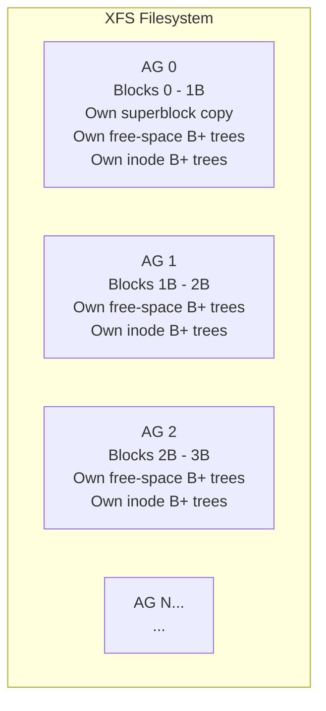
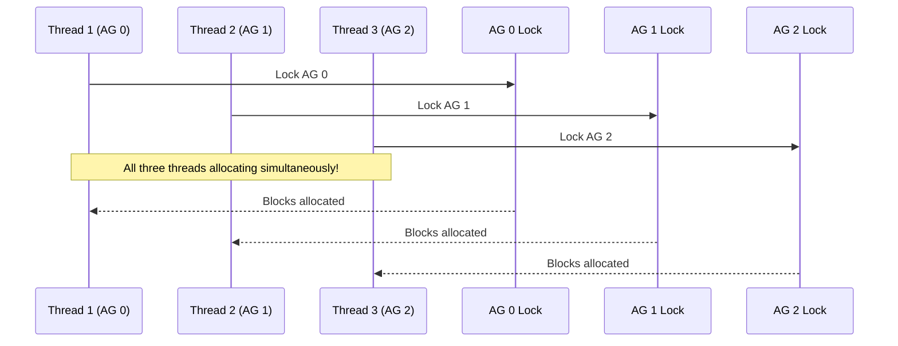
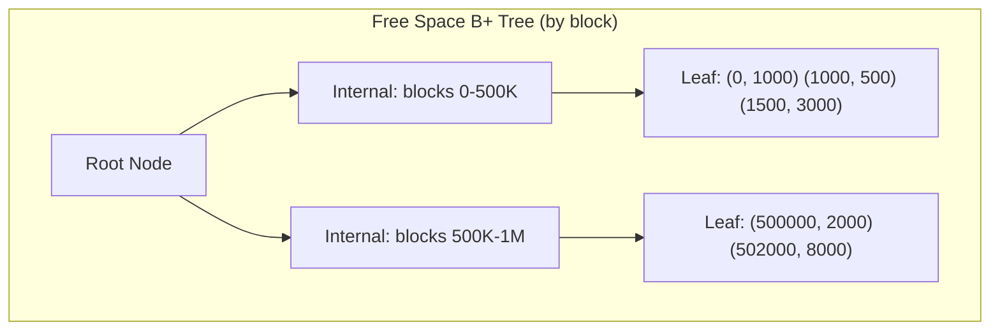
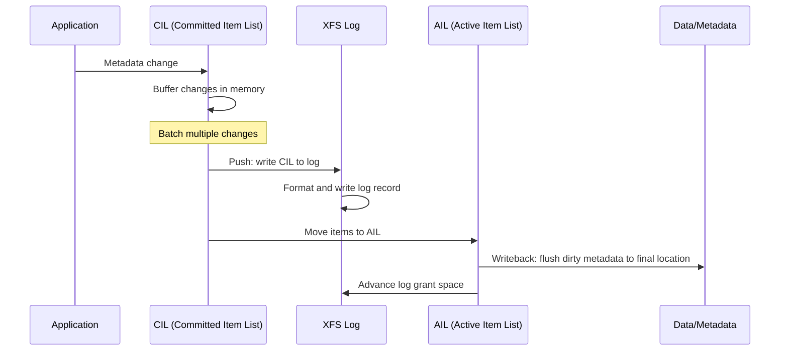
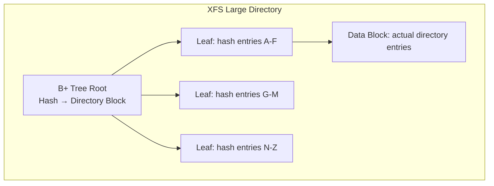

# XFS Filesystem

## Introduction

XFS is a high-performance, 64-bit journaling filesystem originally developed by SGI (Silicon
Graphics) for IRIX in 1993 and ported to Linux in 2001. It is the default filesystem for Red Hat
Enterprise Linux (starting with RHEL 7) and is widely used for large-scale storage, databases,
and media workloads. XFS excels at parallel I/O, large file handling, and filesystem scalability.

XFS was designed from the ground up for parallelism. Its allocation group architecture allows
multiple threads to perform concurrent metadata operations without contention on global structures.
This makes it particularly well-suited for multi-core systems with high-throughput storage.

## Architecture Overview

### Allocation Groups (AGs)

The defining architectural feature of XFS is the allocation group (AG). The filesystem is divided
into AGs, each of which is essentially an independent filesystem with its own:

- Free space management (B+ trees)
- Inode allocation (B+ trees)
- Inode B+ tree
- Internal locks



Each AG has its own locks, meaning multiple threads can allocate blocks and inodes from different
AGs simultaneously without any contention:



### AG Size

Each AG is typically 1 GiB to 16 GiB in size. The number of AGs determines the degree of
parallelism:

```bash
# View AG information
$ sudo xfs_info /dev/sda1
meta-data=/dev/sda1       isize=512    agcount=16, agsize=65536 blks
         =                sectsz=512   attr=2, projid32bit=1
         =                crc=1        finobt=1, sparse=1, rmapbt=0
         =                reflink=1    bigtime=1 inobtcount=1
data     =                bsize=4096   blocks=1048576, imaxpct=25
         =                sunit=0      swidth=0 blks
naming   =version 2       bsize=4096   ascii-ci=0, ftype=1
log      =internal        bsize=4096   blocks=16384, version=2
         =                sectsz=512   sunit=0 blks, lazy-count=1
realtime =none            rtextents=0  rblocks=0
```

In this example: `agcount=16, agsize=65536 blks` = 16 AGs, each 65536 × 4096 = 256 MiB.

## B+ Trees

XFS uses B+ trees extensively for metadata management. There are several key B+ trees:

### 1. Free Space B+ Trees

Each AG maintains two B+ trees for free space:

- **By-block B+ tree**: Maps physical block ranges to free extents (for allocation)
- **By-size B+ tree**: Maps free extent sizes to their locations (for finding best-fit)



### 2. Inode B+ Tree (inobt)

Each AG maintains a B+ tree mapping inode numbers to their on-disk locations:

```c
/* XFS inode B+ tree record */
struct xfs_inobt_rec {
    __be32  ir_startino;     /* Starting inode number */
    __be16  ir_freecount;    /* Number of free inodes in chunk */
    __be16  ir_free;         /* Free inode bitmask (16-bit) */
    __be64  ir_free_hi;      /* Free inode bitmask (upper 48 bits) */
};
```

### 3. Reverse-Mapping B+ Tree (rmapbt)

Added in recent XFS, this maps physical blocks back to their owners (inodes + offsets):

```c
struct xfs_rmap_rec {
    __be32  rm_owner;     /* Inode number (or special owner code) */
    __be64  rm_offset;    /* Logical offset within the owner */
    __be32  rm_blockno;   /* Physical block number */
    __be32  rm_len;       /* Length in blocks */
};
```

This enables:
- Online filesystem repair
- Reflink (shared extents)
- Quota accounting improvements

### 4. Reference Count B+ Tree (reflink)

For reflinked (shared) extents, XFS maintains a reference count B+ tree:

```c
struct xfs_refcount_rec {
    __be32  rc_startblock;  /* Physical start block */
    __be32  rc_blockcount;  /* Number of blocks */
    __be32  rc_refcount;    /* Reference count */
};
```

## Journaling

XFS uses an internal log (journal) for metadata consistency. The log is a circular buffer that
records all metadata changes before they are committed to their final locations.

### Delayed Logging

XFS uses a technique called "delayed logging" (also called "logical logging") to batch metadata
changes:



**Key concepts:**

- **CIL (Committed Item List)**: In-memory buffer that accumulates dirty metadata items
- **AIL (Active Item List)**: Tracks items whose log entries have been flushed but not yet written to their final location
- **Log ticket**: A reservation for log space, ensuring transactions don't overflow the log

### Log Structure

```c
/* XFS log record header */
struct xlog_rec_header {
    __be32  h_magicno;       /* XLOG_HEADER_MAGIC_NUM */
    __be32  h_cycle;         /* Log cycle number */
    __be32  h_version;       /* Log format version */
    __be32  h_len;           /* Length of data in record */
    __be64  h_lsn;           /* Log sequence number */
    __be64  h_tail_lsn;      /* Tail of log (oldest dirty) */
    __be32  h_fmt;           /* Format of data */
    uuid_t  h_fs_uuid;       /* Filesystem UUID */
    __be32  h_size;          /* Total record length including data */
    /* ... checksums, padding ... */
};
```

### Log Placement

The log can be internal (stored within the filesystem) or external (on a separate device):

```bash
# Internal log (default)
$ sudo mkfs.xfs /dev/sda1

# External log on faster device
$ sudo mkfs.xfs -l logdev=/dev/nvme0n1p2,size=2g /dev/sda1

# View log location
$ sudo xfs_info /dev/sda1 | grep log
log      =internal        bsize=4096   blocks=16384, version=2
```

## Inode Structure

XFS inodes are 512 bytes by default (configurable at mkfs time from 256 to 2048 bytes):

```c
/* XFS on-disk inode (512 bytes) */
struct xfs_dinode {
    __be16  di_magic;        /* XFS_DINODE_MAGIC */
    __be16  di_mode;         /* File type and permissions */
    __be8   di_version;      /* Inode version (3 for v3) */
    __be8   di_format;       /* Data format (local/extents/btree) */
    __be16  di_onlink;       /* Old number of links */
    __be32  di_uid;          /* Owner UID */
    __be32  di_gid;          /* Owner GID */
    __be16  di_flushiter;    /* Flush iteration count */
    __be16  di_afi;          /* Attribute fork inline */
    __be32  di_projid_lo;    /* Project ID (lower) */
    __be16  di_projid_hi;    /* Project ID (upper) */
    __be8   di_pad[6];       /* Padding */
    __be16  di_flushiter;    /* Incremented on flush */
    __be64  di_size;         /* File size in bytes */
    __be64  di_nblocks;      /* Number of blocks */
    __be32  di_extsize;      /* Extent size hint */
    __be32  di_nextents;     /* Number of data extents */
    __be16  di_anextents;    /* Number of attribute extents */
    __be8   di_forkoff;      /* Fork offset (attr/data split) */
    __be8   di_aformat;      /* Attribute fork format */
    __be32  di_dmevmask;     /* DMAPI event mask */
    __be16  di_dmstate;      /* DMAPI state */
    __be16  di_flags;        /* Flags */
    __be32  di_gen;          /* Inode generation */
    /* Version 3 additions: */
    __be32  di_crc;          /* CRC of inode */
    __be64  di_changecount;  /* Change count */
    __be64  di_lsn;          /* Last log sequence number */
    __be64  di_flags2;       /* Additional flags */
    __be32  di_cowextsz;     /* CoW extent size */
    __u8    di_pad2[12];     /* Padding */
    xfs_timestamp_t di_crtime; /* Creation time */
    __be64  di_ino;          /* Inode number (64-bit) */
    uuid_t  di_uuid;         /* Filesystem UUID */
    /* Data/attr fork data follows */
};
```

### Data Fork Formats

XFS inodes store data in "forks" — the data fork holds file data, the attribute fork holds
extended attributes:

| Format | When Used | Description |
|--------|-----------|-------------|
| `XFS_DINODE_FMT_LOCAL` | Small files/dirs | Data stored inline in the inode |
| `XFS_DINODE_FMT_EXTENTS` | Medium files | Array of extent descriptors |
| `XFS_DINODE_FMT_BTREE` | Large/fragmented files | B+ tree of extents |
| `XFS_DINODE_FMT_DEV` | Device nodes | Device number stored |
| `XFS_DINODE_FMT_UUID` | (deprecated) | UUID reference |

### Extent Mapping

```c
/* Extent descriptor */
struct xfs_bmbt_rec {
    __be64  l0, l1;  /* Packed extent info */
};

/* Unpacked extent */
struct xfs_bmbt_irec {
    xfs_fileoff_t br_startoff;    /* Logical offset */
    xfs_fsblock_t br_startblock;  /* Physical block */
    xfs_filblks_t br_blockcount;  /* Length in blocks */
    xfs_exntst_t  br_state;       /* Allocated or unwritten */
};
```

XFS supports "unwritten extents" — extents that are allocated but contain no data. When written
to, they are converted to normal extents. This is critical for preallocation
(`fallocate()`) and delayed allocation.

## Directory Structure

XFS uses a hash-based B+ tree for directories:

### Short Form (Inline)

For very small directories, entries are stored inline in the inode's data fork.

### Block Form

For small-medium directories, entries are stored in directory blocks with a linear scan.

### Leaf/Node Form (B+ Tree)

For large directories, XFS uses a B+ tree indexed by a hash of the filename:



## Realtime Subsystem

XFS has an optional "realtime" subsystem for guaranteed-bandwidth I/O. The realtime device is
typically a separate, fast device (SSD, NVMe):

```bash
# Create XFS with realtime device
$ sudo mkfs.xfs -r rtdev=/dev/nvme0n1p2,rtsize=100g /dev/sda1

# Mark a file for realtime storage
$ sudo xfs_io -c "chattr +t" /path/to/realtime/file

# View realtime extent size
$ sudo xfs_info /dev/sda1 | grep realtime
realtime =/dev/nvme0n1p2   rtextents=25600 rblocks=2560000
```

The realtime device is divided into fixed-size "realtime extents" (typically 4 MiB). Files on the
realtime device get contiguous allocations, ensuring consistent I/O performance.

## Online Management

### Online Resize

```bash
# Grow XFS to fill the device
$ sudo xfs_growfs /mount/point

# The filesystem must be mounted; XFS only supports growing, not shrinking
```

### Online Repair (xfs_repair)

```bash
# Unmount and repair
$ sudo umount /dev/sda1
$ sudo xfs_repair /dev/sda1
Phase 1 - find and verify superblock...
Phase 2 - using internal log
        - zero log...
        - scan filesystem freespace and inode maps...
        - found root inode chunk
Phase 3 - for each AG...
        - scan (but don't clear) agi unlinked lists...
        - process known inodes and perform inode discovery...
        - process newly discovered inodes...
Phase 4 - check for duplicate blocks...
        - setting up duplicate extent list...
        - check for inodes claiming duplicate blocks...
        - agno = 0 ...
Phase 5 - rebuild AG headers and trees...
Phase 6 - check inode connectivity...
Phase 7 - verify and correct link counts...
done

# Dry run (no changes)
$ sudo xfs_repair -n /dev/sda1
```

### Online Scrub (xfs_scrub)

Modern XFS supports online filesystem checking:

```bash
# Online scrub (filesystem stays mounted)
$ sudo xfs_scrub /mount/point

# Verbose mode
$ sudo xfs_scrub -v /mount/point

# Repair errors found by scrub
$ sudo xfs_scrub -r /mount/point
```

## Reflink Support

XFS supports reflinks (copy-on-write sharing of data blocks) since kernel 4.9:

```bash
# Enable reflink (default on recent mkfs.xfs)
$ sudo mkfs.xfs -m reflink=1 /dev/sdb1

# Copy a file using reflink (instant, shares blocks)
$ cp --reflink=always /data/large_file /data/clone

# Both files share the same physical blocks until one is modified
$ filefrag /data/large_file /data/clone
/data/large_file: 1 extent found
/data/clone: 1 extent found

# Check extent sharing via xfs_bmap
$ sudo xfs_bmap -v /data/large_file
$ sudo xfs_bmap -v /data/clone
# Same physical blocks!
```

## Quota Management

XFS supports user, group, and project quotas:

```bash
# Enable quotas at mount time
$ sudo mount -o uquota,gquota,pquota /dev/sda1 /data

# Or via /etc/fstab
# /dev/sda1  /data  xfs  defaults,uquota,gquota,pquota  0  0

# Set user quota
$ sudo xfs_quota -x -c "limit bsoft=5g bhard=6g user1" /data

# Set project quota
$ sudo xfs_quota -x -c "project -s myproject" /data
$ sudo xfs_quota -x -c "limit -p bhard=100g myproject" /data

# Report quotas
$ sudo xfs_quota -x -c "report -h" /data
```

## Extended Attributes

XFS stores extended attributes (xattrs) in the attribute fork of the inode:

```bash
# Set xattr
$ setfattr -n user.comment -v "important file" /data/file

# Get xattr
$ getfattr -n user.comment /data/file
# file: data/file
user.comment="important file"

# List all xattrs
$ getfattr -d /data/file
```

For large xattrs, XFS uses a B+ tree in the attribute fork (similar to the data fork for files).

## Performance Tuning

### Mount Options

```bash
# Common performance options
$ sudo mount -o noatime,logbufs=8,logbsize=256k,allocsize=64m /dev/sda1 /data
```

| Option | Effect |
|--------|--------|
| `noatime` | Don't update access timestamps |
| `logbufs=8` | Number of log buffers (default: 8) |
| `logbsize=256k` | Log buffer size |
| `allocsize=64m` | Preallocation size for delayed allocation |
| `nobarrier` | Disable write barriers (dangerous, SSD-only) |
| `inode64` | Allow inodes beyond the first 1 TiB |
| `swalloc` | Align allocations to stripe width |
| `delaylog` | Use delayed logging (default) |

### Benchmarking

```bash
# Sequential write
$ fio --name=xfs-seq-write --filename=/data/fio-test \
    --size=10G --bs=1M --rw=write --direct=1 --ioengine=libaio \
    --iodepth=32 --numjobs=4

# Metadata-heavy workload (many small files)
$ fio --name=xfs-meta --filename=/data/fio-meta \
    --size=1G --bs=4k --rw=randwrite --direct=0 --ioengine=libaio \
    --iodepth=1 --numjobs=1 --create_on_open=1 --nrfiles=100000 \
    --openfiles=10000 --directory=/data/fio-meta-dir
```

## Comparison with ext4

| Feature | XFS | ext4 |
|---------|-----|------|
| Max filesystem size | 8 EiB | 1 EiB |
| Max file size | 8 EiB | 16 TiB |
| Allocation parallelism | Per-AG locking | Per-group |
| Directory structure | B+ tree hash | htree |
| Delayed logging | Yes (CIL) | No |
| Online repair | xfs_scrub | e2fsck (offline) |
| Reflink | Yes (4.9+) | No |
| Shrink filesystem | No | Yes |
| Realtime volume | Yes | No |
| Inline data | Yes | Yes |

## Further Reading

- [The Linux Kernel Documentation](https://docs.kernel.org/)
- [GNU Project Documentation](https://www.gnu.org/doc/doc.html)
- [GNU Manuals](https://www.gnu.org/manual/manual.html)
- [Free Software Directory](https://directory.fsf.org/wiki/Main_Page)
- [Planet GNU](https://planet.gnu.org/)
- [Free Software Books](https://www.gnu.org/doc/other-free-books.html)

- [XFS documentation (kernel.org)](https://www.kernel.org/doc/html/latest/filesystems/xfs.html) — Official docs
- [XFS wiki (xfs.org)](https://xfs.org/) — Community wiki
- [xfs.org: Architecture and Design](https://xfs.org/index.php/Architecture_and_Design) — Design documents
- [Linux kernel: fs/xfs/](https://elixir.bootlin.com/linux/latest/source/fs/xfs) — XFS source code
- [SGI XFS whitepapers](https://oss.sgi.com/projects/xfs/) — Original design papers
- [LWN: XFS: There and back again](https://lwn.net/Articles/848455/) — XFS history and development
- [Dave Chinner's talks](https://www.youtube.com/results?search_query=dave+chinner+xfs) — XFS developer presentations

## Related Topics

- [VFS](./vfs.md) — The virtual filesystem layer
- [Inode](./inode.md) — Inode structure used by XFS
- [Journaling](./journaling.md) — XFS delayed logging and journal concepts
- [ext4](./ext4.md) — Comparison filesystem
- [Btrfs](./btrfs.md) — Another modern Linux filesystem
