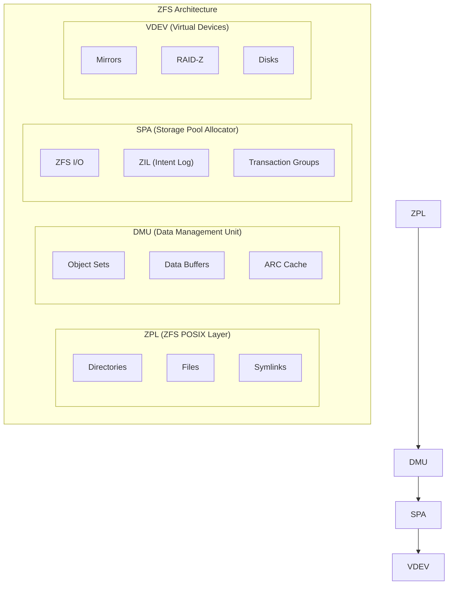
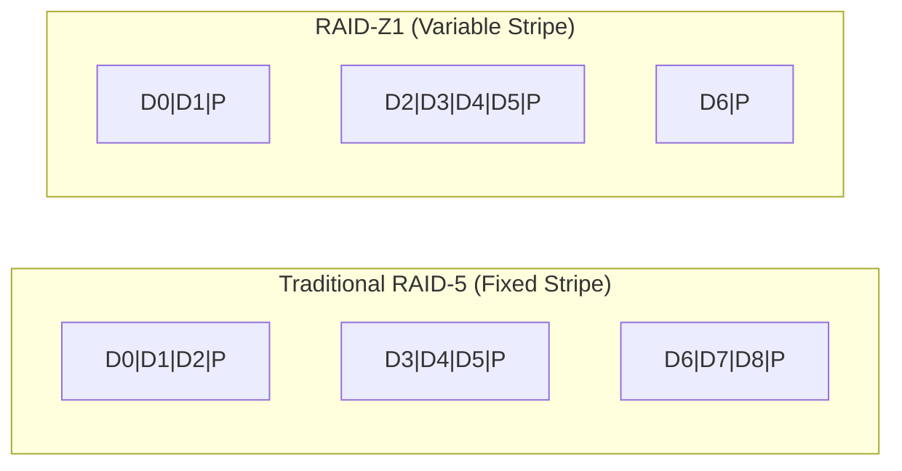
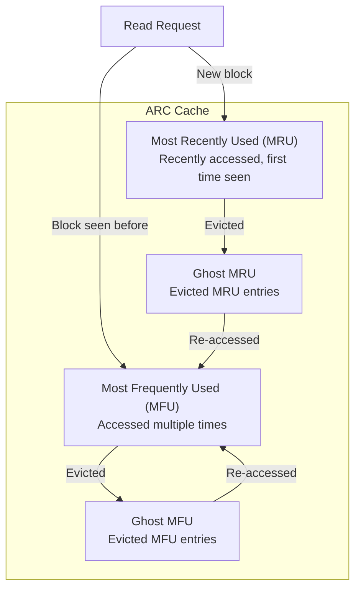
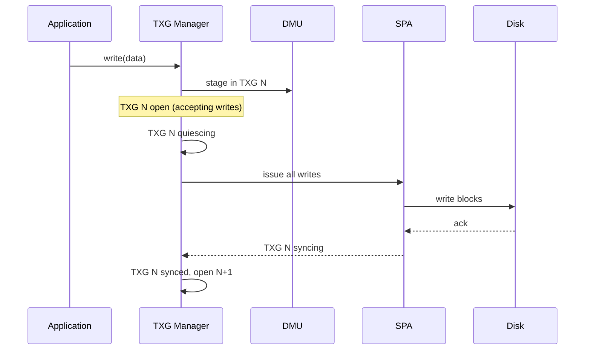

# ZFS on Linux

## Introduction

ZFS (Zettabyte File System) is an advanced combined filesystem and logical volume manager originally
developed by Sun Microsystems for Solaris in 2005. It was ported to Linux as OpenZFS, a community
project that provides a production-ready implementation under the CDDL license. ZFS is renowned
for its data integrity guarantees, massive scalability, and integrated storage management.

ZFS combines the roles of filesystem, volume manager, and RAID controller into a single coherent
layer. This tight integration enables features that are difficult or impossible to achieve with
separate components: end-to-end checksumming, instant snapshots, transparent compression, and
pool-level redundancy.

## Architecture Overview

ZFS has a layered architecture:



## Zpools

A zpool is the top-level storage construct in ZFS. It aggregates one or more virtual devices
(vdevs) into a single storage pool:

```bash
# Create a simple pool (single disk, no redundancy)
$ sudo zpool create mypool /dev/sdb

# Create a mirrored pool
$ sudo zpool create mypool mirror /dev/sdb /dev/sdc

# Create RAID-Z1 (single parity)
$ sudo zpool create mypool raidz1 /dev/sdb /dev/sdc /dev/sdd

# Create RAID-Z2 (double parity)
$ sudo zpool create mypool raidz2 /dev/sdb /dev/sdc /dev/sdd /dev/sde

# Create a pool with a log device (SLOG)
$ sudo zpool create mypool mirror /dev/sdb /dev/sdc log /dev/nvme0n1p1

# Create a pool with a special vdev (metadata on SSD)
$ sudo zpool create mypool raidz1 /dev/sdb /dev/sdc /dev/sdd \
    special mirror /dev/nvme0n1p1 /dev/nvme0n1p2

# View pool status
$ sudo zpool status mypool
  pool: mypool
 state: ONLINE
  scan: none requested
config:
    NAME        STATE     READ WRITE CKSUM
    mypool      ONLINE       0     0     0
      mirror-0  ONLINE       0     0     0
        sdb     ONLINE       0     0     0
        sdc     ONLINE       0     0     0
errors: No known data errors
```

### Vdev Types

| Vdev Type | Description | Fault Tolerance |
|-----------|-------------|-----------------|
| stripe | Single disk | None |
| mirror | N-way mirror | N-1 devices |
| raidz1 | Single parity RAID | 1 device |
| raidz2 | Double parity RAID | 2 devices |
| raidz3 | Triple parity RAID | 3 devices |
| log | ZIL (intent log) device | Mirrored recommended |
| cache | L2ARC read cache | None (performance only) |
| special | Metadata vdev | Mirrored recommended |
| dedup | Deduplication table | Mirrored recommended |

### Pool Management

```bash
# Add a mirror to an existing pool
$ sudo zpool add mypool mirror /dev/sdd /dev/sde

# Remove a vdev (only for mirrors and special vdevs)
$ sudo zpool remove mypool /dev/sde

# Replace a disk
$ sudo zpool replace mypool /dev/sdb /dev/sdf

# Export/import (e.g., move pool to another machine)
$ sudo zpool export mypool
$ sudo zpool import mypool

# Upgrade pool to latest feature flags
$ sudo zpool upgrade mypool

# View pool properties
$ sudo zpool get all mypool
```

## Datasets

A dataset is ZFS's equivalent of a filesystem. Datasets are created within a zpool and share the
pool's storage:

```bash
# Create a dataset
$ sudo zfs create mypool/data

# Create nested datasets
$ sudo zfs create mypool/data/projects
$ sudo zfs create mypool/data/projects/project1

# List datasets
$ sudo zfs list
NAME                     USED  AVAIL  REFER  MOUNTPOINT
mypool                  1.50T  3.50T   128K  /mypool
mypool/data             1.20T  3.50T   800G  /mypool/data
mypool/data/projects    400G   3.50T   200G  /mypool/data/projects

# Destroy a dataset
$ sudo zfs destroy mypool/data/projects/project1
```

### Dataset Properties

Every dataset has configurable properties that control behavior:

```bash
# Set compression
$ sudo zfs set compression=zstd mypool/data

# Set quota
$ sudo zfs set quota=100G mypool/data

# Set reservation
$ sudo zfs set reservation=50G mypool/data

# View properties
$ sudo zfs get compression,quota mypool/data
NAME          PROPERTY     VALUE     SOURCE
mypool/data   compression  zstd      local
mypool/data   quota        100G      local

# Inherit from parent
$ sudo zfs inherit compression mypool/data/projects
```

Key properties:

| Property | Description | Example |
|----------|-------------|---------|
| `compression` | Compression algorithm | `zstd`, `lz4`, `zle`, `off` |
| `atime` | Update access time | `on`, `off` |
| `quota` | Hard limit on dataset space | `100G` |
| `reservation` | Guaranteed space | `50G` |
| `recordsize` | Maximum block size | `128K` (default), `1M` |
| `copies` | Number of data copies | `1`, `2`, `3` |
| `primarycache` | What to cache in ARC | `all`, `metadata`, `none` |
| `secondarycache` | What to cache in L2ARC | `all`, `metadata`, `none` |
| `xattr` | Extended attributes | `on`, `sa` |
| `acltype` | ACL type | `posix`, `off` |
| `sync` | Sync behavior | `standard`, `always`, `disabled` |
| `volblocksize` | Zvol block size | `4K`, `8K`, `16K`, `128K` |

## RAID-Z

RAID-Z is ZFS's software RAID implementation. Unlike traditional RAID, RAID-Z uses variable-width
stripes to avoid the "RAID write hole" (where a power loss during a stripe write can leave parity
inconsistent).

### RAID-Z vs Traditional RAID



RAID-Z writes each block as a self-contained stripe with its own parity. This means:
- Each write is atomic (no partial stripe updates)
- No write hole
- Variable stripe width (small writes use small stripes)

### RAID-Z Capacity

```bash
# Calculate RAID-Z capacity
# RAID-Z1: usable = (N-1) * disk_size
# RAID-Z2: usable = (N-2) * disk_size
# RAID-Z3: usable = (N-3) * disk_size

# Example: 4 × 4TB disks in RAID-Z2
# Usable = (4-2) × 4TB = 8TB

$ sudo zpool create mypool raidz2 /dev/sd{b,c,d,e}
$ sudo zpool list mypool
NAME     SIZE  ALLOC   FREE  CKPOINT  EXPANDSZ   FRAG    CAP  DEDUP  HEALTH  ALTROOT
mypool  14.5T  1.20T  13.3T        -         -     5%     8%  1.00x  ONLINE  -
```

## ARC (Adaptive Replacement Cache)

The ARC is ZFS's primary read cache, implemented in memory. It is based on the ARC algorithm
developed by Megiddo and Modha, which is superior to simple LRU:



### ARC Tuning

```bash
# View ARC statistics
$ cat /proc/spl/kstat/zfs/arcstats
name                            type data
hits                            4    12345678
misses                          4    234567
size                            4    8589934592    # Current ARC size
c_max                           4    17179869184   # Max ARC size
c_min                           4    1073741824    # Min ARC size
p                               4    4294967296    # MRU/MFU target size

# Set ARC max size (module parameter)
$ echo 8589934592 > /sys/module/zfs/parameters/zfs_arc_max

# Or in /etc/modprobe.d/zfs.conf
# options zfs zfs_arc_max=8589934592

# View ARC hit ratio
$ arcstat.py
    time  read  miss  miss%  dmis  dm%  pmis  pm%  mmis  mm%  arcsz     c
10:30:00  1000    50   5.00    30  3.0    15  1.5     5  0.5   8.0G  16.0G
```

### L2ARC (Level 2 ARC)

L2ARC is a read cache on a fast device (SSD/NVMe) that extends the ARC:

```bash
# Add L2ARC device
$ sudo zpool add mypool cache /dev/nvme0n1p1

# View L2ARC stats
$ cat /proc/spl/kstat/zfs/arcstats | grep l2_
l2_hits                         4    50000
l2_misses                       4    100000
l2_size                         4    107374182400  # 100GB L2ARC
l2_asize                        4    53687091200   # 50GB actual data
```

## Deduplication

ZFS supports inline deduplication at the block level. When enabled, identical blocks are stored
only once:

```bash
# Enable deduplication (WARNING: very memory intensive!)
$ sudo zfs set dedup=on mypool/data

# Check dedup statistics
$ sudo zpool get dedupratio mypool
NAME     PROPERTY   VALUE  SOURCE
mypool   dedupratio  1.8x  -

# DDT (Dedup Table) statistics
$ sudo zpool status -D mypool
```

### Dedup Memory Requirements

The dedup table (DDT) must fit in memory for acceptable performance:

| Data Size | Dedup Ratio | DDT Size (estimated) |
|-----------|-------------|---------------------|
| 1 TB | 1.5x | ~3 GB RAM |
| 10 TB | 1.5x | ~30 GB RAM |
| 100 TB | 1.5x | ~300 GB RAM |

**Warning**: Deduplication is extremely memory-intensive. Most workloads are better served by
compression. Use dedup only when you have a clear dedup ratio benefit (e.g., many similar VMs).

## Snapshots

ZFS snapshots are instant, space-efficient, and read-only by default:

```bash
# Create a snapshot
$ sudo zfs snapshot mypool/data@snap1

# Create a recursive snapshot (all child datasets)
$ sudo zfs snapshot -r mypool@snap1

# List snapshots
$ sudo zfs list -t snapshot
NAME                     USED  AVAIL  REFER  MOUNTPOINT
mypool/data@snap1       100G      -   800G  -

# Rollback to a snapshot
$ sudo zfs rollback mypool/data@snap1

# Destroy a snapshot
$ sudo zfs destroy mypool/data@snap1

# Clone a snapshot (writable copy)
$ sudo zfs clone mypool/data@snap1 mypool/data-clone

# Promote a clone (makes it independent)
$ sudo zfs promote mypool/data-clone
```

### Snapshot Space Accounting

```bash
# View space used by snapshots
$ sudo zfs list -o name,used,usedbysnapshots,usedbydataset
NAME                    USED  USEDSNAP  USEDDS
mypool                 1.50T    500G    1.00T
mypool/data            1.20T    300G    900G
mypool/data@snap1         0        -       -
mypool/data@snap2       100G        -       -
```

## ZFS Send/Receive

ZFS send/receive creates efficient stream representations of snapshots for backup and replication:

```bash
# Full send (entire snapshot)
$ sudo zfs send mypool/data@snap1 > /backup/data-snap1.zfs

# Receive on backup system
$ cat /backup/data-snap1.zfs | sudo zfs receive backup/data

# Incremental send (only differences)
$ sudo zfs send -i mypool/data@snap1 mypool/data@snap2 > /backup/incr.zfs

# Receive incremental
$ cat /backup/incr.zfs | sudo zfs receive backup/data

# Send to remote via SSH
$ sudo zfs send mypool/data@snap1 | ssh backup zfs receive backup/data

# Resume interrupted send/receive
$ sudo zfs send --saved mypool/data@snap1 > /backup/resumed.zfs

# Encrypted send
$ sudo zfs send -w mypool/data@snap1 > /backup/encrypted.zfs
```

### Send/Receive with Properties

```bash
# Include dataset properties
$ sudo zfs send -p mypool/data@snap1 > /backup/with-props.zfs

# Replicate entire pool recursively
$ sudo zfs send -R mypool@snap1 | ssh backup zfs receive -d backup
```

## Compression

ZFS supports multiple compression algorithms:

```bash
# Enable LZ4 (fast, good ratio)
$ sudo zfs set compression=lz4 mypool/data

# Enable ZSTD (slower, better ratio)
$ sudo zfs set compression=zstd mypool/data

# ZSTD with specific level
$ sudo zfs set compression=zstd-3 mypool/data

# View compression ratio
$ sudo zfs get compressratio mypool/data
NAME          PROPERTY       VALUE  SOURCE
mypool/data   compressratio  2.35x  -

# View actual compression stats
$ sudo zpool get -p mypool | grep compress
```

| Algorithm | Speed | Ratio | Best For |
|-----------|-------|-------|----------|
| `lz4` | Very fast | Good | General purpose (default) |
| `zstd` | Fast | Better | Mixed workloads |
| `zstd-fast` | Very fast | Good | High-throughput |
| `gzip-N` | Slow | Best | Archival |
| `zle` | Fastest | Minimal | Already-compressed data |

## Encryption

ZFS native encryption (since 0.8.0) provides dataset-level encryption:

```bash
# Create encrypted dataset
$ sudo zfs create -o encryption=aes-256-gcm -o keyformat=passphrase \
    mypool/encrypted

# Load key
$ sudo zfs load-key mypool/encrypted

# Mount
$ sudo zfs mount mypool/encrypted

# Unload key (unmount + lock)
$ sudo zfs unmount mypool/encrypted
$ sudo zfs unload-key mypool/encrypted

# Send encrypted snapshot (raw, server can't read)
$ sudo zfs send -w mypool/encrypted@snap1 | ssh backup zfs receive backup/enc
```

## ZIL (ZFS Intent Log)

The ZIL provides synchronous write semantics. When an application calls `fsync()`, the ZIL
writes the data to a fast log device:

```bash
# Add SLOG (Separate Log) device
$ sudo zpool add mypool log /dev/nvme0n1p1

# View ZIL statistics
$ cat /proc/spl/kstat/zfs/zil
```

### When SLOG Helps

- Databases with `fsync()`-heavy workloads (PostgreSQL, MySQL)
- NFS servers with synchronous exports
- Any application requiring low-latency synchronous writes

### When SLOG Doesn't Help

- Asynchronous write workloads
- Applications that don't call `fsync()`
- Sequential write throughput (SLOG is for latency, not bandwidth)

## Monitoring and Troubleshooting

```bash
# Pool health
$ sudo zpool status mypool
$ sudo zpool list mypool

# Device errors
$ sudo zpool status -e mypool

# I/O statistics
$ sudo zpool iostat mypool 1

# Dataset space usage
$ sudo zfs list -o space

# Check for data integrity (scrub)
$ sudo zpool scrub mypool
$ sudo zpool status mypool
  scan: scrub repaired 0B in 02:15:00 with 0 errors on Mon Jan 15 12:15:00 2025

# View history
$ sudo zpool history mypool

# Clear errors
$ sudo zpool clear mypool

# Export/import (e.g., after moving disks)
$ sudo zpool export mypool
$ sudo zpool import mypool
```

## Best Practices

1. **Always use mirrors or RAID-Z**: Single-disk pools have no redundancy
2. **Schedule regular scrubs**: Weekly scrubs catch bit rot early
3. **Monitor pool health**: Use `zpool status` and set up alerts
4. **Don't enable dedup unless you know what you're doing**: Use compression instead
5. **Use SSDs for SLOG/L2ARC**: They provide the most benefit
6. **Keep pools under 80% full**: Performance degrades above this threshold
7. **Use `sync=standard` (default)**: Don't use `sync=disabled` unless you accept data loss risk
8. **Backup with send/receive**: Incremental sends are efficient and reliable

## Transaction Groups (TXG)

ZFS uses transaction groups to batch and order all writes. A TXG is a set of related changes that are committed atomically:



TXGs cycle through three states:
- **Open**: accepting new writes (up to ~5 seconds)
- **Quiescing**: draining pending writes, no new writes accepted
- **Syncing**: writing all dirty data to disk

```bash
# View TXG statistics
$ cat /proc/spl/kstat/zfs/txgs
# Shows: txg number, birth time, state, number of writes
```

### TXG and fsync()

When an application calls `fsync()`, ZFS doesn't wait for the current TXG to sync. Instead, it writes to the ZIL (intent log) for immediate durability:

```
fsync() → write to ZIL → ack to app → TXG syncs later
```

This decouples application latency from TXG commit intervals.

## ZFS On-Disk Format

ZFS uses a self-describing on-disk format with multiple copies of critical metadata:

### Uberblock

The uberblock is ZFS's equivalent of a superblock. It's stored in the first 256 KiB of each vdev:

```c
/* Simplified uberblock structure */	ypedef struct uberblock {
    uint64_t ub_magic;        /* UBERBLOCK_MAGIC (0x00bab10c) */
    uint64_t ub_version;      /* On-disk version */
    uint64_t ub_txg;          /* Transaction group number */
    uint64_t ub_guid_sum;     /* Sum of all vdev GUIDs */
    uint64_t ub_timestamp;    /* Timestamp */
    struct blkptr ub_rootbp;  /* Root block pointer (MOS) */
} uberblock_t;
```

ZFS stores 128 uberblocks in a circular log on each vdev. On import, ZFS reads all uberblocks and selects the one with the highest TXG number:

```bash
# View uberblock info (requires zdb)
$ sudo zdb -u mypool
Uberblock[0]
    magic = 0000000000bab10c
    version = 5000
    txg = 12345
    timestamp = 1705123456
    rootbp = DVA[0]=<0:400:200> ...
```

### Meta Object Set (MOS)

The MOS is the root of ZFS's object hierarchy. It contains:
- Object set descriptors for all datasets
- Zpool properties
- Device configuration
- Snapshot list

```
Uberblock → MOS → Dataset → Object Set → Data Blocks
```

## ZFS on Linux Specifics

### Module Loading

ZFS on Linux is implemented as out-of-tree kernel modules (due to CDDL/GPL license incompatibility):

```bash
# Load ZFS modules
$ sudo modprobe zfs

# Check module version
$ cat /sys/module/zfs/version
2.3.0

# Module parameters
$ cat /sys/module/zfs/parameters/zfs_arc_max
17179869184

# Common module parameters in /etc/modprobe.d/zfs.conf
# options zfs zfs_arc_max=8589934592
# options zfs zfs_vdev_scheduler=mq-deadline
```

### Kernel Compatibility

OpenZFS tracks kernel versions. Each release supports a range of kernels:

| OpenZFS | Kernel Support | Notable Features |
|---------|---------------|------------------|
| 2.1.x   | 3.10 – 5.19   | Basic Linux support |
| 2.2.x   | 4.18 – 6.7    | Block cloning, Direct IO |
| 2.3.x   | 4.18 – 6.12   | RAIDZ expansion, Fast Dedup |

```bash
# Check supported kernels
$ modinfo zfs | grep -i "supported.*kernel"
# Or check OpenZFS release notes
```

### ZFS and cgroups

ZFS has limited cgroup integration. The ARC cache is system-wide and not easily constrained per-container:

```bash
# ARC size is global — containers share it
# This can be problematic in multi-tenant environments

# Workaround: limit ARC size for the whole system
$ echo 4294967296 > /sys/module/zfs/parameters/zfs_arc_max
```

## Cross-References

- [superblock](./superblock.md) — VFS superblock abstraction; ZFS uses uberblocks instead
- [bcachefs](./bcachefs.md) — Modern CoW filesystem with similar goals, in-tree Linux
- [inode](./inode.md) — ZFS uses ZPL objects, not traditional POSIX inodes
- [file-ops](./file-ops.md) — ZFS file operations via ZPL
- [mounting](./mounting.md) — ZFS mounting via `zfs mount` vs VFS mount API

## Further Reading

- [The Linux Kernel Documentation](https://docs.kernel.org/)
- [GNU Project Documentation](https://www.gnu.org/doc/doc.html)
- [GNU Manuals](https://www.gnu.org/manual/manual.html)
- [Free Software Directory](https://directory.fsf.org/wiki/Main_Page)
- [Planet GNU](https://planet.gnu.org/)
- [Free Software Books](https://www.gnu.org/doc/other-free-books.html)

- [OpenZFS documentation](https://openzfs.github.io/openzfs-docs/) — Official docs
- [ZFS on Linux (GitHub)](https://github.com/openzfs/zfs) — Source code
- [Oracle ZFS documentation](https://docs.oracle.com/cd/E19253-01/819-5461/) — Original design docs
- [FreeBSD ZFS wiki](https://wiki.freebsd.org/ZFS) — Cross-platform ZFS docs
- [LWN: ZFS on Linux](https://lwn.net/Articles/783869/) — ZFS Linux port discussion
- [Jim Salter's ZFS articles](https://arstechnica.com/information-technology/2020/05/zfs-101-understanding-zfs-storage-and-raid/) — Excellent primer
- [Allan Jude's ZFS talks](https://www.youtube.com/results?search_query=allan+jude+zfs) — Conference presentations

## Related Topics

- [VFS](./vfs.md) — The virtual filesystem layer
- [Btrfs](./btrfs.md) — Another CoW filesystem with similar features
- [Journaling](./journaling.md) — ZFS uses CoW + ZIL instead of traditional journaling
- [ext4](./ext4.md) — Traditional Linux filesystem
- [Inode](./inode.md) — ZFS uses a different object model (not traditional inodes)
