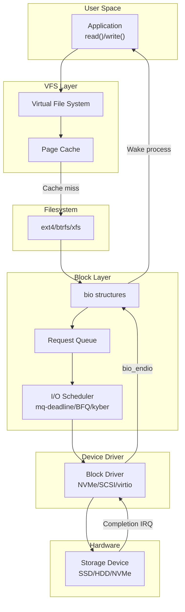
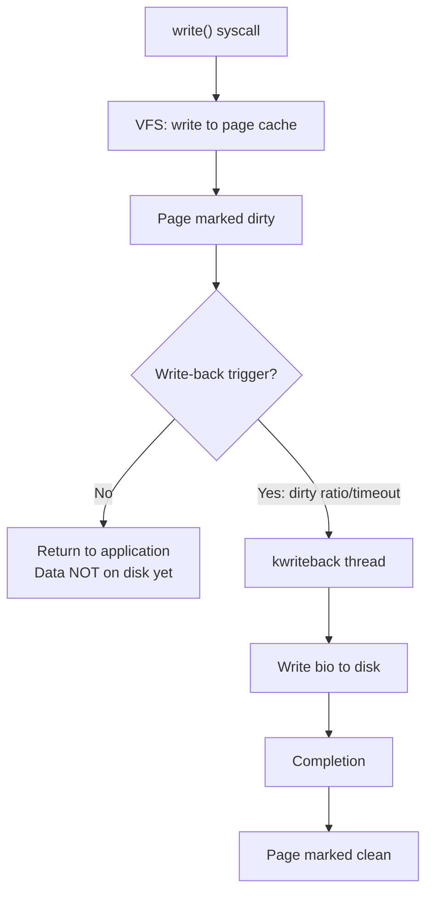

# Disk I/O Path

## Introduction

The disk I/O path is the journey a read or write request takes from a user-space application through the kernel's block layer, I/O scheduler, device driver, and finally to the physical storage device and back. Understanding this path is essential for performance tuning, debugging I/O issues, and developing storage drivers.

Modern Linux storage stacks are complex, involving multiple layers of buffering, scheduling, merging, and caching. A single `write()` call may not touch the disk for seconds (due to write-back caching), while a `read()` may be satisfied entirely from the page cache without any disk access at all.

## I/O Path Overview



## Read Path

### Step 1: User-Space System Call

```c
/* Application calls read() */
ssize_t bytes = read(fd, buffer, count);

/* Or using pread() for specific offset */
ssize_t bytes = pread(fd, buffer, count, offset);
```

### Step 2: VFS Layer

The VFS `vfs_read()` function handles the syscall:

```c
ssize_t vfs_read(struct file *file, char __user *buf,
                  size_t count, loff_t *pos)
{
    ssize_t ret;
    
    /* Security hook */
    ret = rw_verify_area(READ, file, pos, count);
    if (ret)
        return ret;
    
    /* Call filesystem-specific read */
    if (file->f_op->read)
        ret = file->f_op->read(file, buf, count, pos);
    else if (file->f_op->read_iter)
        ret = new_sync_read(file, buf, count, pos);
    
    return ret;
}
```

### Step 3: Filesystem and Page Cache

Most modern filesystems use the page cache for read operations:

```c
/* Generic filesystem read through page cache */
ssize_t generic_file_read_iter(struct kiocb *iocb, struct iov_iter *iter)
{
    /* Check page cache first */
    ssize_t ret = filemap_read(iocb, iter, 0);
    return ret;
}

/* filemap_read: read from page cache */
static ssize_t filemap_read(struct kiocb *iocb, struct iov_iter *iter,
                             loff_t pos)
{
    struct file *filp = iocb->ki_filp;
    struct address_space *mapping = filp->f_mapping;
    struct file_ra_state *ra = &filp->f_ra;
    struct page *pg;
    pgoff_t index;
    pgoff_t last_index;
    pgoff_t end_index;
    loff_t isize;
    size_t written = 0;
    
    isize = i_size_read(mapping->host);
    end_index = (isize - 1) >> PAGE_SHIFT;
    
    /* Start async readahead */
    filemap_readahead(mapping, ra, filp, pos, isize);
    
    for (;;) {
        /* Look up page in cache */
        index = pos >> PAGE_SHIFT;
        pg = find_get_page(mapping, index);
        
        if (!pg) {
            /* Page not in cache — initiate readahead and wait */
            page_cache_sync_readahead(mapping, ra, filp, index);
            pg = find_get_page(mapping, index);
        }
        
        if (PageUptodate(pg)) {
            /* Copy data from page to userspace */
            /* ... */
            put_page(pg);
        } else {
            /* Wait for page to be read from disk */
            wait_on_page_locked(pg);
            /* ... */
        }
    }
    
    return written;
}
```

### Step 4: Submitting I/O (bio)

When a page is not in the cache, the filesystem submits a bio:

```c
/* Filesystem submits bio for reading */
static void mpage_readahead(struct readahead_control *rac)
{
    struct bio *bio;
    sector_t block_in_file;
    sector_t last_block;
    struct block_device *bdev;
    
    bdev = rac->mapping->host->i_sb->s_bdev;
    
    /* Create bio */
    bio = bio_alloc(GFP_KERNEL, nr_pages);
    bio->bi_iter.bi_sector = block_in_file * (BLOCK_SIZE >> 9);
    bio->bi_bdev = bdev;
    bio->bi_end_io = mpage_end_io;
    bio->bi_opf = REQ_OP_READ;
    
    /* Add pages from readahead window */
    while ((page = readahead_page(rac)) != NULL) {
        bio_add_page(bio, page, PAGE_SIZE, 0);
    }
    
    /* Submit bio to block layer */
    submit_bio(bio);
}
```

### Step 5: Block Layer Processing

```c
/* Block layer receives bio */
blk_status_t submit_bio(struct bio *bio)
{
    /* Track stats */
    count_vm_events(PGPGIN, bio_sectors(bio));
    
    /* If no queue (e.g., device mapper), handle recursively */
    if (!bio->bi_bdev->bd_disk->queue) {
        return bio->bi_bdev->bd_disk->fops->submit_bio(bio);
    }
    
    /* Enter the block layer */
    return __submit_bio(bio->bi_bdev->bd_disk->queue, bio);
}

/* Bio merging and request creation */
static void __submit_bio(struct request_queue *q, struct bio *bio)
{
    /* Try to merge with existing request */
    struct request *req = bio_attempt_back_merge(q, bio);
    if (req) {
        /* Merged into existing request */
        return;
    }
    
    /* Create new request from bio */
    req = get_request(q, bio);
    blk_insert_request(req);
}
```

### Step 6: I/O Scheduler

```c
/* I/O scheduler dispatches requests to driver */
/* mq-deadline scheduler example */
static void deadline_dispatch(struct deadline_data *dd,
                               struct request **next)
{
    struct request *rq;
    
    /* Check read FIFO (deadline expired) */
    rq = deadline_fifo_request(dd, READ);
    if (rq)
        goto dispatch;
    
    /* Check write FIFO */
    rq = deadline_fifo_request(dd, WRITE);
    if (rq)
        goto dispatch;
    
    /* Otherwise, service next in sorted order */
    rq = deadline_next_request(dd, READ);
    if (!rq)
        rq = deadline_next_request(dd, WRITE);
    
dispatch:
    *next = rq;
    list_del_init(&rq->queuelist);
}
```

### Step 7: Device Driver

```c
/* NVMe driver receives request */
static blk_status_t nvme_queue_rq(struct blk_mq_hw_ctx *hctx,
                                    const struct blk_mq_queue_data *bd)
{
    struct nvme_dev *dev = hctx->queue->queuedata;
    struct request *req = bd->rq;
    struct nvme_command cmnd;
    
    /* Build NVMe command */
    if (req_op(req) == REQ_OP_READ) {
        cmnd.rw.opcode = nvme_cmd_read;
        cmnd.rw.slba = cpu_to_le64(blk_rq_pos(req));
        cmnd.rw.length = cpu_to_le16(blk_rq_sectors(req) - 1);
        /* ... */
    }
    
    /* Submit to hardware via submission queue */
    nvme_submit_cmd(dev->queues[0], &cmnd);
    
    return BLK_STS_OK;
}
```

### Step 8: Hardware Completion

```c
/* NVMe completion interrupt handler */
static irqreturn_t nvme_irq(int irq, void *data)
{
    struct nvme_queue *nvmeq = data;
    struct nvme_completion cqe;
    
    /* Read completion queue entry */
    nvme_handle_cqe(nvmeq, &cqe);
    
    /* Find corresponding request */
    struct request *req = blk_mq_tag_to_req(nvmeq->tags, cqe.command_id);
    
    /* Complete the request */
    blk_mq_complete_request(req);
    
    return IRQ_HANDLED;
}

/* Request completion callback */
static void nvme_end_request(struct request *req)
{
    struct bio *bio = req->bio;
    
    /* Set bio status */
    bio->bi_status = nvme_to_blk_status(req->status);
    
    /* Complete the bio */
    blk_mq_end_request(req, bio->bi_status);
}
```

## Write Path

### Write-Back Caching



### Write-back Triggers

| Trigger | Threshold | sysctl |
|---------|-----------|--------|
| Dirty ratio | % of total RAM | `vm.dirty_ratio` (default: 20%) |
| Dirty background ratio | % of total RAM | `vm.dirty_background_ratio` (default: 10%) |
| Dirty expire centisecs | Time limit | `vm.dirty_expire_centisecs` (default: 3000 = 30s) |
| Dirty writeback centisecs | Thread wakeup | `vm.dirty_writeback_centisecs` (default: 500 = 5s) |

```bash
# View dirty page settings
sysctl vm.dirty_ratio
# vm.dirty_ratio = 20
sysctl vm.dirty_background_ratio
# vm.dirty_background_ratio = 10
sysctl vm.dirty_expire_centisecs
# vm.dirty_expire_centisecs = 3000
sysctl vm.dirty_writeback_centisecs
# vm.dirty_writeback_centisecs = 500

# View current dirty pages
cat /proc/vmstat | grep dirty
# nr_dirty 1234
# nr_writeback 56
# nr_written 789012

# View dirty pages in meminfo
cat /proc/meminfo | grep -i dirty
# Dirty:             4936 kB
# Writeback:           0 kB
```

### Direct I/O

Direct I/O bypasses the page cache:

```c
/* Open file with O_DIRECT */
int fd = open("/dev/sda", O_RDONLY | O_DIRECT);

/* Buffer must be aligned (typically to 512 or 4096 bytes) */
void *buf;
posix_memalign(&buf, 4096, 4096);

/* Read directly from disk */
ssize_t n = pread(fd, buf, 4096, 0);
/* Data goes directly from disk to user buffer */
```

## I/O Schedulers

### mq-deadline (Default for most)

```bash
# View current scheduler
cat /sys/block/sda/queue/scheduler
# [mq-deadline] kyber bfq none

# Set scheduler
echo bfq > /sys/block/sda/queue/scheduler

# mq-deadline parameters
cat /sys/block/sda/queue/iosched/read_expire
# 500  (ms)
cat /sys/block/sda/queue/iosched/write_expire
# 5000 (ms)
cat /sys/block/sda/queue/iosched/writes_starved
# 2

# Tune read deadline (lower = better read latency)
echo 250 > /sys/block/sda/queue/iosched/read_expire
```

### BFQ (Budget Fair Queueing)

```bash
# Set BFQ scheduler
echo bfq > /sys/block/sda/queue/scheduler

# BFQ parameters
cat /sys/block/sda/queue/iosched/low_latency
# 1
cat /sys/block/sda/queue/iosched/back_seek_max
# 16384
```

### Kyber (Latency-oriented)

```bash
# Set Kyber scheduler
echo kyber > /sys/block/sda/queue/scheduler

# Kyber parameters
cat /sys/block/sda/queue/iosched/read_lat_nsec
# 2000000  (2ms target)
cat /sys/block/sda/queue/iosched/write_lat_nsec
# 10000000 (10ms target)
```

## Block I/O Monitoring

### iostat

```bash
# Device I/O statistics
iostat -xz 1
# Device  r/s     w/s     rkB/s    wkB/s   rrqm/s   wrqm/s  await  svctm  %util
# sda     100.00  50.00   400.00   200.00  10.00    5.00     2.50   1.00   15.00

# Extended stats
iostat -xz -p sda 1
```

### blktrace

```bash
# Trace block I/O
sudo blktrace -d /dev/sda -o - | blkparse -i -

# Output:
# 8,0    1        1     0.000000000  1234  Q   R 0 + 8 [bash]
# 8,0    1        2     0.000001234  1234  G   R 0 + 8 [bash]
# 8,0    1        3     0.000002345  1234  I   R 0 + 8 [bash]  (inserted)
# 8,0    1        4     0.000003456  1234  D   R 0 + 8 [bash]  (dispatched)
# 8,0    1        5     0.001003456     0  C   R 0 + 8 [0]     (completed)

# Legend:
# Q = queued (bio submitted)
# G = get request
# I = inserted into scheduler
# D = dispatched to driver
# C = completed

# Analyze with iowatcher
iowatcher -t sda -o io_graph.png
```

### /proc/diskstats

```bash
cat /proc/diskstats
#  major minor name  reads  reads_merged  read_sectors  read_time
#    8     0    sda  123456  7890         1234567       45678
#                  writes  writes_merged  write_sectors  write_time
#                   12345   6789          234567         89012
#                  io_in_progress  io_time  weighted_io_time
#                      0           56789        134790

# Per-disk I/O latency
cat /sys/block/sda/stat
# 123456 7890 1234567 45678 12345 6789 234567 89012 0 56789 134790
```

## Performance Tuning

```bash
# Increase queue depth for NVMe
echo 1024 > /sys/block/nvme0n1/queue/nr_requests

# Adjust read-ahead
echo 256 > /sys/block/sda/queue/read_ahead_kb

# Set I/O scheduler
echo mq-deadline > /sys/block/sda/queue/scheduler

# Disable merge for SSDs (optional)
echo 2 > /sys/block/sda/queue/nomerges

# Set rotational flag (SSD vs HDD)
echo 0 > /sys/block/sda/queue/rotational  # SSD

# Tune dirty page writeback
sysctl -w vm.dirty_ratio=40
sysctl -w vm.dirty_background_ratio=10
sysctl -w vm.dirty_expire_centisecs=3000
```

## References

- [Kernel Block Layer Documentation](https://www.kernel.org/doc/html/latest/block/)
- [LWN: A block layer introduction](https://lwn.net/Articles/736534/)
- [LWN: The multi-queue block layer](https://lwn.net/Articles/552904/)
- [blktrace documentation](https://git.kernel.org/pub/scm/linux/kernel/git/axboe/blktrace.git)
- [iovisor/bcc: biolatency](https://github.com/iovisor/bcc)
- [Linux Performance Tools](https://www.brendangregg.com/linuxperf.html)

## Related Topics

- [Block Drivers](../drivers/block-drivers.md) — Block device driver implementation
- [File Systems](../filesystems/index.md) — Filesystem layer above block layer
- [Page Cache](./page-cache.md) — Memory caching for disk I/O
- [Scheduler](./scheduler.md) — I/O scheduler details
