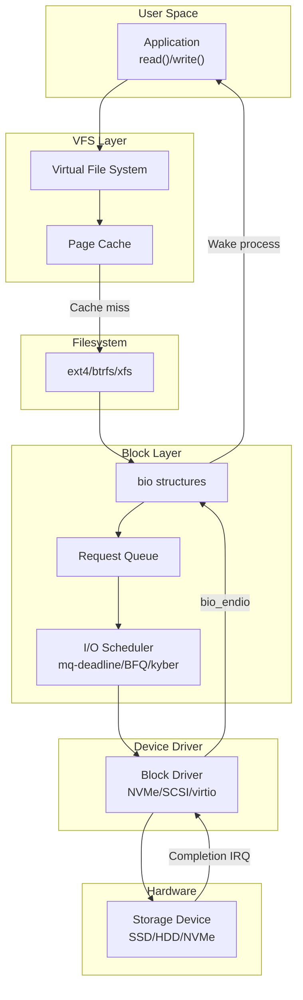
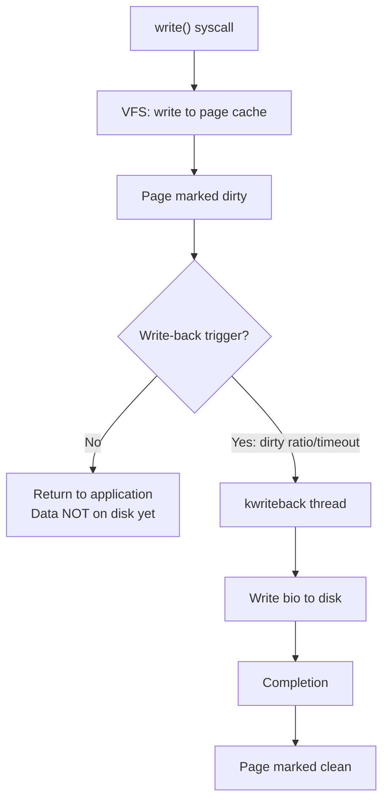
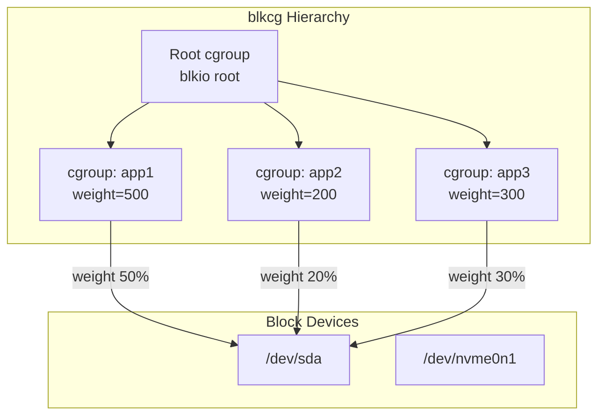
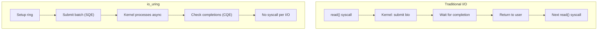
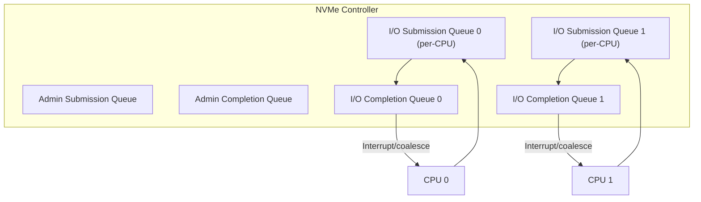

# Disk I/O Path

## Introduction

The disk I/O path is the journey a read or write request takes from a user-space application through the kernel's block layer, I/O scheduler, device driver, and finally to the physical storage device and back. Understanding this path is essential for performance tuning, debugging I/O issues, and developing storage drivers.

Modern Linux storage stacks are complex, involving multiple layers of buffering, scheduling, merging, and caching. A single `write()` call may not touch the disk for seconds (due to write-back caching), while a `read()` may be satisfied entirely from the page cache without any disk access at all.

## I/O Path Overview



## Read Path

### Step 1: User-Space System Call

```c
/* Application calls read() */
ssize_t bytes = read(fd, buffer, count);

/* Or using pread() for specific offset */
ssize_t bytes = pread(fd, buffer, count, offset);
```

### Step 2: VFS Layer

The VFS `vfs_read()` function handles the syscall:

```c
ssize_t vfs_read(struct file *file, char __user *buf,
                  size_t count, loff_t *pos)
{
    ssize_t ret;
    
    /* Security hook */
    ret = rw_verify_area(READ, file, pos, count);
    if (ret)
        return ret;
    
    /* Call filesystem-specific read */
    if (file->f_op->read)
        ret = file->f_op->read(file, buf, count, pos);
    else if (file->f_op->read_iter)
        ret = new_sync_read(file, buf, count, pos);
    
    return ret;
}
```

### Step 3: Filesystem and Page Cache

Most modern filesystems use the page cache for read operations:

```c
/* Generic filesystem read through page cache */
ssize_t generic_file_read_iter(struct kiocb *iocb, struct iov_iter *iter)
{
    /* Check page cache first */
    ssize_t ret = filemap_read(iocb, iter, 0);
    return ret;
}

/* filemap_read: read from page cache */
static ssize_t filemap_read(struct kiocb *iocb, struct iov_iter *iter,
                             loff_t pos)
{
    struct file *filp = iocb->ki_filp;
    struct address_space *mapping = filp->f_mapping;
    struct file_ra_state *ra = &filp->f_ra;
    struct page *pg;
    pgoff_t index;
    pgoff_t last_index;
    pgoff_t end_index;
    loff_t isize;
    size_t written = 0;
    
    isize = i_size_read(mapping->host);
    end_index = (isize - 1) >> PAGE_SHIFT;
    
    /* Start async readahead */
    filemap_readahead(mapping, ra, filp, pos, isize);
    
    for (;;) {
        /* Look up page in cache */
        index = pos >> PAGE_SHIFT;
        pg = find_get_page(mapping, index);
        
        if (!pg) {
            /* Page not in cache — initiate readahead and wait */
            page_cache_sync_readahead(mapping, ra, filp, index);
            pg = find_get_page(mapping, index);
        }
        
        if (PageUptodate(pg)) {
            /* Copy data from page to userspace */
            /* ... */
            put_page(pg);
        } else {
            /* Wait for page to be read from disk */
            wait_on_page_locked(pg);
            /* ... */
        }
    }
    
    return written;
}
```

### Step 4: Submitting I/O (bio)

When a page is not in the cache, the filesystem submits a bio:

```c
/* Filesystem submits bio for reading */
static void mpage_readahead(struct readahead_control *rac)
{
    struct bio *bio;
    sector_t block_in_file;
    sector_t last_block;
    struct block_device *bdev;
    
    bdev = rac->mapping->host->i_sb->s_bdev;
    
    /* Create bio */
    bio = bio_alloc(GFP_KERNEL, nr_pages);
    bio->bi_iter.bi_sector = block_in_file * (BLOCK_SIZE >> 9);
    bio->bi_bdev = bdev;
    bio->bi_end_io = mpage_end_io;
    bio->bi_opf = REQ_OP_READ;
    
    /* Add pages from readahead window */
    while ((page = readahead_page(rac)) != NULL) {
        bio_add_page(bio, page, PAGE_SIZE, 0);
    }
    
    /* Submit bio to block layer */
    submit_bio(bio);
}
```

### Step 5: Block Layer Processing

```c
/* Block layer receives bio */
blk_status_t submit_bio(struct bio *bio)
{
    /* Track stats */
    count_vm_events(PGPGIN, bio_sectors(bio));
    
    /* If no queue (e.g., device mapper), handle recursively */
    if (!bio->bi_bdev->bd_disk->queue) {
        return bio->bi_bdev->bd_disk->fops->submit_bio(bio);
    }
    
    /* Enter the block layer */
    return __submit_bio(bio->bi_bdev->bd_disk->queue, bio);
}

/* Bio merging and request creation */
static void __submit_bio(struct request_queue *q, struct bio *bio)
{
    /* Try to merge with existing request */
    struct request *req = bio_attempt_back_merge(q, bio);
    if (req) {
        /* Merged into existing request */
        return;
    }
    
    /* Create new request from bio */
    req = get_request(q, bio);
    blk_insert_request(req);
}
```

### Step 6: I/O Scheduler

```c
/* I/O scheduler dispatches requests to driver */
/* mq-deadline scheduler example */
static void deadline_dispatch(struct deadline_data *dd,
                               struct request **next)
{
    struct request *rq;
    
    /* Check read FIFO (deadline expired) */
    rq = deadline_fifo_request(dd, READ);
    if (rq)
        goto dispatch;
    
    /* Check write FIFO */
    rq = deadline_fifo_request(dd, WRITE);
    if (rq)
        goto dispatch;
    
    /* Otherwise, service next in sorted order */
    rq = deadline_next_request(dd, READ);
    if (!rq)
        rq = deadline_next_request(dd, WRITE);
    
dispatch:
    *next = rq;
    list_del_init(&rq->queuelist);
}
```

### Step 7: Device Driver

```c
/* NVMe driver receives request */
static blk_status_t nvme_queue_rq(struct blk_mq_hw_ctx *hctx,
                                    const struct blk_mq_queue_data *bd)
{
    struct nvme_dev *dev = hctx->queue->queuedata;
    struct request *req = bd->rq;
    struct nvme_command cmnd;
    
    /* Build NVMe command */
    if (req_op(req) == REQ_OP_READ) {
        cmnd.rw.opcode = nvme_cmd_read;
        cmnd.rw.slba = cpu_to_le64(blk_rq_pos(req));
        cmnd.rw.length = cpu_to_le16(blk_rq_sectors(req) - 1);
        /* ... */
    }
    
    /* Submit to hardware via submission queue */
    nvme_submit_cmd(dev->queues[0], &cmnd);
    
    return BLK_STS_OK;
}
```

### Step 8: Hardware Completion

```c
/* NVMe completion interrupt handler */
static irqreturn_t nvme_irq(int irq, void *data)
{
    struct nvme_queue *nvmeq = data;
    struct nvme_completion cqe;
    
    /* Read completion queue entry */
    nvme_handle_cqe(nvmeq, &cqe);
    
    /* Find corresponding request */
    struct request *req = blk_mq_tag_to_req(nvmeq->tags, cqe.command_id);
    
    /* Complete the request */
    blk_mq_complete_request(req);
    
    return IRQ_HANDLED;
}

/* Request completion callback */
static void nvme_end_request(struct request *req)
{
    struct bio *bio = req->bio;
    
    /* Set bio status */
    bio->bi_status = nvme_to_blk_status(req->status);
    
    /* Complete the bio */
    blk_mq_end_request(req, bio->bi_status);
}
```

## Write Path

### Write-Back Caching



### Write-back Triggers

| Trigger | Threshold | sysctl |
|---------|-----------|--------|
| Dirty ratio | % of total RAM | `vm.dirty_ratio` (default: 20%) |
| Dirty background ratio | % of total RAM | `vm.dirty_background_ratio` (default: 10%) |
| Dirty expire centisecs | Time limit | `vm.dirty_expire_centisecs` (default: 3000 = 30s) |
| Dirty writeback centisecs | Thread wakeup | `vm.dirty_writeback_centisecs` (default: 500 = 5s) |

```bash
# View dirty page settings
sysctl vm.dirty_ratio
# vm.dirty_ratio = 20
sysctl vm.dirty_background_ratio
# vm.dirty_background_ratio = 10
sysctl vm.dirty_expire_centisecs
# vm.dirty_expire_centisecs = 3000
sysctl vm.dirty_writeback_centisecs
# vm.dirty_writeback_centisecs = 500

# View current dirty pages
cat /proc/vmstat | grep dirty
# nr_dirty 1234
# nr_writeback 56
# nr_written 789012

# View dirty pages in meminfo
cat /proc/meminfo | grep -i dirty
# Dirty:             4936 kB
# Writeback:           0 kB
```

### Direct I/O

Direct I/O bypasses the page cache:

```c
/* Open file with O_DIRECT */
int fd = open("/dev/sda", O_RDONLY | O_DIRECT);

/* Buffer must be aligned (typically to 512 or 4096 bytes) */
void *buf;
posix_memalign(&buf, 4096, 4096);

/* Read directly from disk */
ssize_t n = pread(fd, buf, 4096, 0);
/* Data goes directly from disk to user buffer */
```

## I/O Schedulers

### mq-deadline (Default for most)

```bash
# View current scheduler
cat /sys/block/sda/queue/scheduler
# [mq-deadline] kyber bfq none

# Set scheduler
echo bfq > /sys/block/sda/queue/scheduler

# mq-deadline parameters
cat /sys/block/sda/queue/iosched/read_expire
# 500  (ms)
cat /sys/block/sda/queue/iosched/write_expire
# 5000 (ms)
cat /sys/block/sda/queue/iosched/writes_starved
# 2

# Tune read deadline (lower = better read latency)
echo 250 > /sys/block/sda/queue/iosched/read_expire
```

### BFQ (Budget Fair Queueing)

```bash
# Set BFQ scheduler
echo bfq > /sys/block/sda/queue/scheduler

# BFQ parameters
cat /sys/block/sda/queue/iosched/low_latency
# 1
cat /sys/block/sda/queue/iosched/back_seek_max
# 16384
```

### Kyber (Latency-oriented)

```bash
# Set Kyber scheduler
echo kyber > /sys/block/sda/queue/scheduler

# Kyber parameters
cat /sys/block/sda/queue/iosched/read_lat_nsec
# 2000000  (2ms target)
cat /sys/block/sda/queue/iosched/write_lat_nsec
# 10000000 (10ms target)
```

## Block I/O Monitoring

### iostat

```bash
# Device I/O statistics
iostat -xz 1
# Device  r/s     w/s     rkB/s    wkB/s   rrqm/s   wrqm/s  await  svctm  %util
# sda     100.00  50.00   400.00   200.00  10.00    5.00     2.50   1.00   15.00

# Extended stats
iostat -xz -p sda 1
```

### blktrace

```bash
# Trace block I/O
sudo blktrace -d /dev/sda -o - | blkparse -i -

# Output:
# 8,0    1        1     0.000000000  1234  Q   R 0 + 8 [bash]
# 8,0    1        2     0.000001234  1234  G   R 0 + 8 [bash]
# 8,0    1        3     0.000002345  1234  I   R 0 + 8 [bash]  (inserted)
# 8,0    1        4     0.000003456  1234  D   R 0 + 8 [bash]  (dispatched)
# 8,0    1        5     0.001003456     0  C   R 0 + 8 [0]     (completed)

# Legend:
# Q = queued (bio submitted)
# G = get request
# I = inserted into scheduler
# D = dispatched to driver
# C = completed

# Analyze with iowatcher
iowatcher -t sda -o io_graph.png
```

### /proc/diskstats

```bash
cat /proc/diskstats
#  major minor name  reads  reads_merged  read_sectors  read_time
#    8     0    sda  123456  7890         1234567       45678
#                  writes  writes_merged  write_sectors  write_time
#                   12345   6789          234567         89012
#                  io_in_progress  io_time  weighted_io_time
#                      0           56789        134790

# Per-disk I/O latency
cat /sys/block/sda/stat
# 123456 7890 1234567 45678 12345 6789 234567 89012 0 56789 134790
```

## Performance Tuning

```bash
# Increase queue depth for NVMe
echo 1024 > /sys/block/nvme0n1/queue/nr_requests

# Adjust read-ahead
echo 256 > /sys/block/sda/queue/read_ahead_kb

# Set I/O scheduler
echo mq-deadline > /sys/block/sda/queue/scheduler

# Disable merge for SSDs (optional)
echo 2 > /sys/block/sda/queue/nomerges

# Set rotational flag (SSD vs HDD)
echo 0 > /sys/block/sda/queue/rotational  # SSD

# Tune dirty page writeback
sysctl -w vm.dirty_ratio=40
sysctl -w vm.dirty_background_ratio=10
sysctl -w vm.dirty_expire_centisecs=3000
```

## Write Barriers and Cache Flushes

Write barriers ensure data ordering on storage devices with volatile write caches. Without barriers, the disk controller may reorder writes, leading to filesystem corruption after a power failure.

### The Problem

Consider a journaling filesystem writing a transaction:

```
1. Write data blocks
2. Write journal commit record
3. Write metadata to final location
```

If the disk reorders these writes, the commit record might reach disk before the data blocks, leaving the filesystem in an inconsistent state after a crash.

### Barrier Implementation

```c
/* A write barrier is a sequence:
 * 1. Flush the disk's volatile write cache (cache flush)
 * 2. Write the barrier request
 * 3. Flush again (optional, for full barrier semantics)
 */

/* bio with barrier flag */
bio->bi_opf = REQ_OP_WRITE | REQ_PREFLUSH | REQ_FUA;

/* REQ_PREFLUSH — flush disk cache before this write
 * REQ_FUA (Force Unit Access) — bypass disk write cache, write to media
 */
```

### Checking Barrier Support

```bash
# Check if disk supports write cache flush
cat /sys/block/sda/device/scsi_disk/*/cache_type
# write through | write back | none

# Disable disk write cache (for safety, slower)
echo 'wce off' | sudo tee /sys/block/sda/scsi_disk/*/manage_start_stop_page

# Force full flush (barrier)
sync
# or: blockdev --flushbufs /dev/sda

# Filesystem barrier options
mount -o barrier=1 /dev/sda1 /mnt   # ext4: barriers enabled (default)
mount -o nobarrier /dev/sda1 /mnt   # ext4: disable barriers (DANGEROUS)
```

### Barrier Trade-offs

| Setting | Safety | Performance |
|---------|--------|-------------|
| Barriers on (default) | Safe — metadata consistent | 10-30% slower on some workloads |
| Barriers off | Unsafe — corruption risk on crash | Faster journal commits |
| data=ordered (ext4 default) | Data written before commit | Balanced |
| data=journal | All data journaled | Safest, slowest |
| data=writeback | No data ordering | Fastest, least safe |

## Control Groups — blkcg (Block I/O Controller)

The block I/O controller (blkcg) allows per-cgroup I/O bandwidth limiting, prioritization, and accounting. It works with both the legacy blk-throttle and the BFQ scheduler.

### blkcg Architecture



### Using blkcg with cgroup v2

```bash
# cgroup v2 — enable IO controller in hierarchy
echo "+io" > /sys/fs/cgroup/cgroup.subtree_control

# Create a cgroup
mkdir /sys/fs/cgroup/app1

# Set I/O weight (BFQ: 1-1000, default 100)
echo "8:0 500" > /sys/fs/cgroup/app1/io.weight

# Set I/O max (bandwidth limit — bytes per second)
echo "8:0 10485760" > /sys/fs/cgroup/app1/io.max
# Limit sda (major 8, minor 0) to 10 MB/s

# Set I/O max with burst
echo "8:0 rbps=10485760 wbps=5242880 riops=1000 wiops=500" > /sys/fs/cgroup/app1/io.max

# I/O latency target (BFQ)
echo "8:0 target=5000" > /sys/fs/cgroup/app1/io.latency

# Move a process to the cgroup
echo $PID > /sys/fs/cgroup/app1/cgroup.procs

# View I/O statistics for the cgroup
cat /sys/fs/cgroup/app1/io.stat
# 8:0 rbytes=1048576 wbytes=524288 rios=256 wios=128
```

### I/O Cost Model (io.cost)

cgroup v2 also supports a proportional I/O controller based on cost models:

```bash
# Enable io.cost controller
echo "+io" > /sys/fs/cgroup/cgroup.subtree_control

# Set cost model parameters for a device
echo "8:0 ctrl=auto" > /sys/fs/cgroup/io.cost.qos

# Set proportional weights
echo "8:0 enable=1" > /sys/fs/cgroup/io.cost.model

# Per-cgroup weight
echo "100" > /sys/fs/cgroup/app1/io.cost.weight
echo "200" > /sys/fs/cgroup/app2/io.cost.weight
```

## I/O Error Handling

The block layer implements sophisticated error handling with retry logic:

### Error Path

```c
/* bio completion with error */
static void bio_endio(struct bio *bio)
{
    if (bio->bi_status) {
        /* Error occurred — may retry */
        if (bio->bi_opf & REQ_RAHEAD) {
            /* Readahead error — silently drop */
            bio_put(bio);
            return;
        }
        /* Call bio's end_io with error */
    }
    bio->bi_end_io(bio);
}

/* Block layer retry logic */
static void blk_update_request(struct request *req, blk_status_t error)
{
    if (error && blk_retry_request(req)) {
        /* Reset and retry */
        req->bio = req->bio->bi_next;
        blk_requeue_request(req->q, req);
        return;
    }
    /* Complete with error */
}
```

### Common I/O Errors

```bash
# Check for I/O errors in dmesg
dmesg | grep -i 'error\|fail\|reset\|abort' | grep -i '\(sd\|nvme\|ata\)'

# SCSI errors
# sd 0:0:0:0: [sda] tag#0 FAILED Result: hostbyte=DID_OK driverbyte=DRIVER_SENSE
# sd 0:0:0:0: [sda] tag#0 Sense Key : Medium Error [current]
# sd 0:0:0:0: [sda] tag#0 Add. Sense: Unrecovered read error

# NVMe errors
# nvme nvme0: I/O 0 QID 0 timeout, reset controller
# nvme nvme0: I/O 5 QID 1 timeout, aborting

# View I/O error statistics
cat /sys/block/sda/stat
# Field 12: I/O errors (count)
# Field 13: I/O errors (weighted time)

# Check SMART status for predictive failure
smartctl -a /dev/sda
smartctl -H /dev/sda  # Health check
```

### I/O Timeout Configuration

```bash
# SCSI timeout (default 30 seconds)
echo 60 > /sys/block/sda/timeout

# NVMe timeout
echo 30 > /sys/block/nvme0n1/queue/io_timeout

# Device mapper error handling
# dmsetup targets — shows available error handling modes
```

## Data Integrity — T10 Protection Information

Modern enterprise storage supports T10-PI (Protection Information), also called DIF/DIX, which adds end-to-end data integrity checking from application to disk.

### How It Works


Each block gets a Protection Information tuple:
- **Guard** — CRC-16 checksum of the data
- **Application Tag** — application-defined identifier
- **Reference Tag** — typically the lower 32 bits of the LBA

```bash
# Enable DIX (data integrity extensions) for a device
# Kernel config: CONFIG_BLK_DEV_INTEGRITY

# Check if device supports PI
cat /sys/block/sda/integrity/format
# "T10-DIF-TYPE3-CRC" or similar

# Check integrity profile
cat /sys/block/sda/integrity/profile
```

## io_uring Block Integration

`io_uring` provides efficient asynchronous I/O with reduced syscall overhead:

### io_uring vs Traditional I/O



### Basic io_uring Read Example

```c
#include <liburing.h>

struct io_uring ring;

/* Initialize with 256-entry ring */
io_uring_queue_init(256, &ring, IORING_SETUP_SQPOLL);

/* Prepare a read */
struct io_uring_sqe *sqe = io_uring_get_sqe(&ring);
io_uring_prep_read(sqe, fd, buf, 4096, offset);
sqe->flags |= IOSQE_FIXED_FILE;  /* Use pre-registered fd */

/* Submit and wait for one completion */
io_uring_submit(&ring);
struct io_uring_cqe *cqe;
io_uring_wait_cqe(&ring, &cqe);
int bytes_read = cqe->res;
io_uring_cqe_seen(&ring, cqe);
```

### io_uring Features for Block I/O

| Feature | Kernel Version | Description |
|---------|---------------|-------------|
| `IORING_SETUP_SQPOLL` | 5.11+ | Kernel-side submission polling |
| `IORING_OP_READ_FIXED` | 5.1+ | Pre-registered buffers |
| `IORING_OP_READV` | 5.1+ | Vectored read |
| `IORING_REGISTER_BUFFERS` | 5.1+ | Pre-register buffers for DMA |
| `IORING_SETUP_IOPOLL` | 5.1+ | Busy-poll for completions |
| `IORING_OP_URING_CMD` | 5.19+ | NVMe passthrough commands |

## NVMe I/O Path Specifics

NVMe has a fundamentally different I/O path from SCSI/SATA, bypassing much of the legacy block layer overhead.

### NVMe Queue Architecture



Each CPU gets its own submission/completion queue pair, avoiding lock contention:

```bash
# NVMe queue configuration
cat /sys/block/nvme0n1/queue/nr_requests  # Requests per queue
echo 1024 > /sys/block/nvme0n1/queue/nr_requests

# NVMe queue count (one per CPU by default)
cat /sys/block/nvme0n1/device/queue_count

# Adjust interrupt coalescing
cat /sys/block/nvme0n1/device/ioctl
nvme set-feature /dev/nvme0 -f 8 -v 0x080008  # 8 usec, 8 events
```

### NVMe I/O Command Passthrough

```c
/* NVMe passthrough via io_uring (since Linux 5.19) */
struct io_uring_sqe *sqe = io_uring_get_sqe(&ring);
struct nvme_passthru_cmd cmd = {
    .opcode = nvme_cmd_read,
    .nsid = 1,
    .addr = (uint64_t)buf,
    .data_len = 4096,
    .cdw10 = lba & 0xFFFFFFFF,
    .cdw11 = lba >> 32,
    .cdw12 = 0,  /* 1 LBA */
};
io_uring_prep_uring_cmd(sqe, nvme_fd, 0);
sqe->addr3 = (uint64_t)&cmd;
sqe->cmd_op = NVME_URING_CMD_IO;
```

## Advanced Monitoring and Tracing

### BPF/bcc Tools for I/O Analysis

```bash
# biolatency — block I/O latency histogram
sudo biolatency -D 1
# disk = sda
#        usecs          : count    distribution
#        0 -> 1         : 0       |                                        |
#        2 -> 3         : 0       |                                        |
#        4 -> 7         : 3       |**                                      |
#        8 -> 15        : 28      |******************                      |
#       16 -> 31        : 56      |****************************************|
#       32 -> 63        : 45      |******************************          |
#       64 -> 127       : 23      |***************                         |

# biosnoop — trace block I/O with latency
sudo biosnoop
# TIME     COMM         PID   DISK  T  SECTOR     BYTES   LAT(ms)
# 0.001    dd           1234  sda   W  12345678   4096    0.42
# 0.003    jbd2/sda1    567   sda   W  87654321   8192    0.18

# biotop — top for block I/O
sudo biotop
# PID    COMM         D   MAJ MIN  DISK   I/O  Kbytes  AVGms
# 1234   dd           W   8   0    sda    256  1024    0.45
# 5678   dd           R   8   0    sda    128  512     0.32

# ext4slower — trace slow ext4 operations
sudo ext4slower 10  # Trace operations slower than 10ms

# filetop — top for file I/O
sudo filetop
```

### iostat Advanced Usage

```bash
# Extended stats with per-partition and utilization histogram
iostat -xz -p ALL 1

# Fields of interest:
# r_await  — read latency (ms)
# w_await  — write latency (ms)
# aqu-sz   — average queue depth
# %util    — device utilization (>60% may indicate saturation)

# Note: %util is misleading for NVMe and RAID devices
# (can show 100% while still having headroom)

# Per-device request merging stats
iostat -xm 1
# rrqm/s  wrqm/s  — merged requests/sec
# High merge rates = sequential I/O (good)
# Low merge rates = random I/O (expected for databases)
```

### /sys/block Statistics Deep Dive

```bash
# /sys/block/sda/stat fields (11 fields):
#  1: reads completed
#  2: reads merged
#  3: sectors read
#  4: time spent reading (ms)
#  5: writes completed
#  6: writes merged
#  7: sectors written
#  8: time spent writing (ms)
#  9: I/Os currently in progress
# 10: time spent doing I/Os (ms)
# 11: weighted time spent doing I/Os (ms)

# Calculate average I/O latency
# avg_read_ms = field4 / field1
# avg_write_ms = field8 / field5

# Inflight requests
cat /sys/block/sda/inflight
# 2 0  (2 reads, 0 writes in-flight)
```

## I/O Priority

Linux supports per-process I/O priorities that interact with the I/O scheduler:

```bash
# Set I/O priority (ionice)
ionice -c 2 -n 0 -p $PID    # Best-effort, highest priority
ionice -c 2 -n 7 -p $PID    # Best-effort, lowest priority
ionice -c 3 -p $PID          # Idle — only runs when no other I/O
ionice -c 1 -n 4 -p $PID    # Real-time, priority 4

# Classes:
# 0 = none (use scheduling class default)
# 1 = real-time (highest, can starve others)
# 2 = best-effort (default, uses nice value)
# 3 = idle (lowest, only runs when disk is idle)

# Check I/O priority
cat /proc/$PID/io
# ioprio=4  (class 2 = best-effort << 8 | level 4)

# BFQ supports per-cgroup I/O priority
echo "8:0 prio=3" > /sys/fs/cgroup/app1/io.weight
```

## References

- [Kernel Block Layer Documentation](https://www.kernel.org/doc/html/latest/block/)
- [LWN: A block layer introduction](https://lwn.net/Articles/736534/)
- [LWN: The multi-queue block layer](https://lwn.net/Articles/552904/)
- [blktrace documentation](https://git.kernel.org/pub/scm/linux/kernel/git/axboe/blktrace.git)
- [iovisor/bcc: biolatency](https://github.com/iovisor/bcc)
- [Linux Performance Tools](https://www.brendangregg.com/linuxperf.html)
- [io_uring documentation](https://kernel.dk/io_uring.pdf)
- [NVMe specification](https://nvmexpress.org/specifications/)
- [T10 DIF/DIX specification](https://www.t10.org/)
- [blk-cgroup documentation](https://www.kernel.org/doc/html/latest/admin-guide/cgroup-v2.html#io)

## Related Topics

- [Block Drivers](../drivers/block-drivers.md) — Block device driver implementation
- [File Systems](../filesystems/index.md) — Filesystem layer above block layer
- [Page Cache](./page-cache.md) — Memory caching for disk I/O
- [Scheduler](./scheduler.md) — I/O scheduler details
- [NVMe Drivers](./nvme.md) — NVMe subsystem details
- [io_uring](../../sysprog/io-uring.md) — Modern async I/O interface
