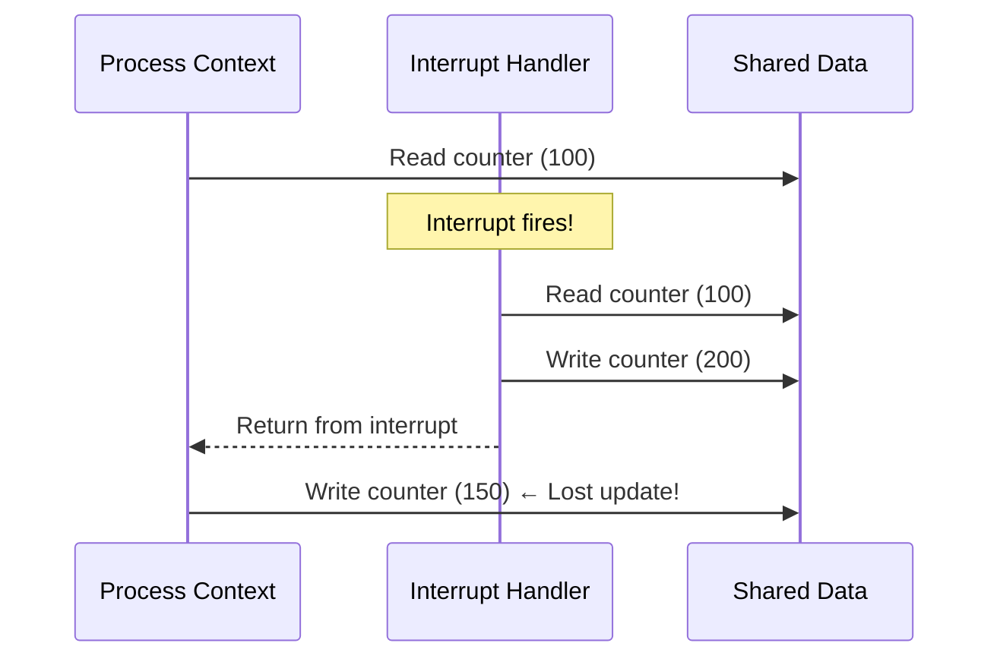
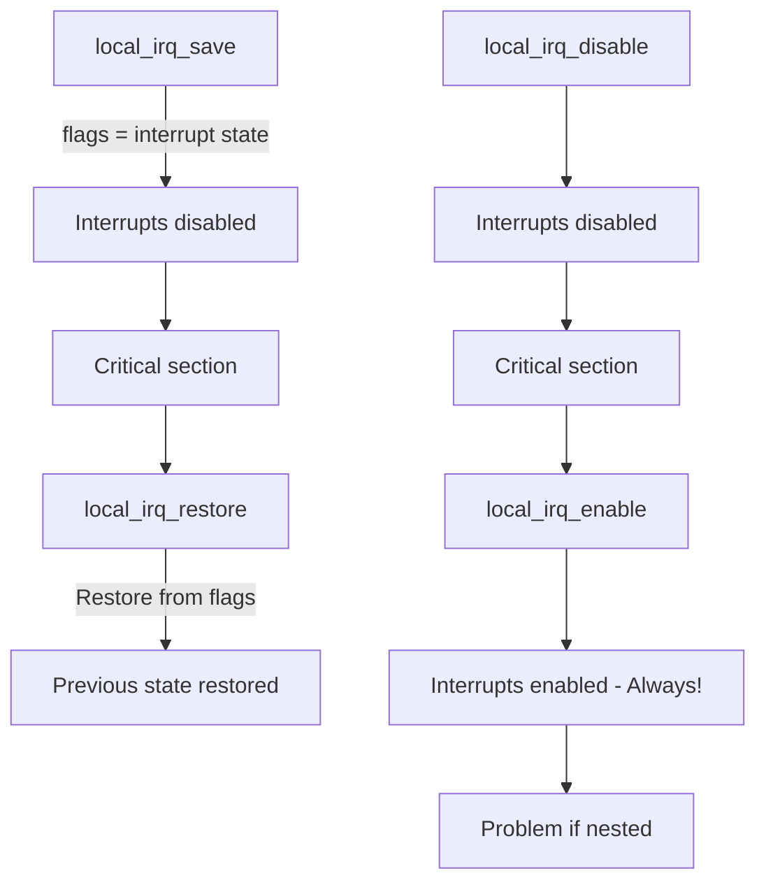
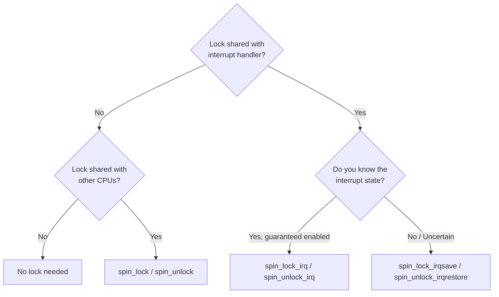
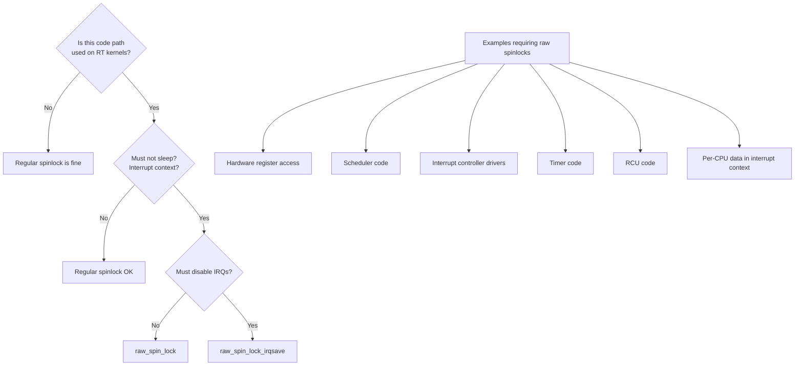
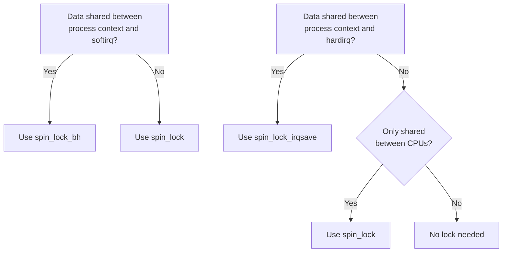
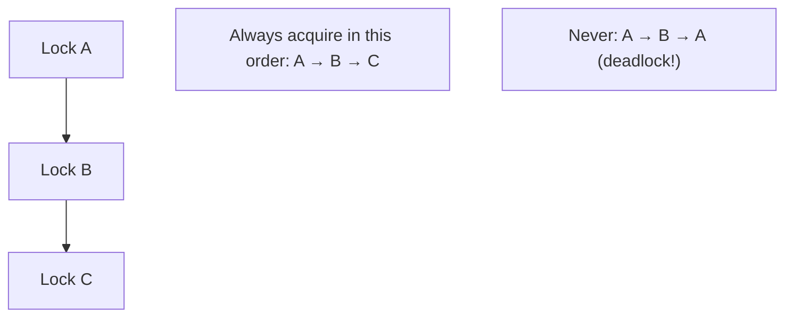

# Interrupt Control in the Linux Kernel

## Introduction

Interrupt control is a fundamental mechanism in the Linux kernel that allows code to temporarily prevent hardware or software interrupts from being delivered to the processor. Proper interrupt control is essential for protecting shared data structures, ensuring atomic operations, and maintaining system stability. However, misuse of interrupt control can cause system hangs, data loss, and latency spikes.

This chapter covers the APIs for disabling and enabling interrupts, the critical distinction between interrupt context and process context, and the design patterns that govern safe interrupt control in the kernel.

## Why Control Interrupts?

When a kernel data structure is shared between an interrupt handler and process-context code, a race condition exists:



Without interrupt control, the interrupt handler's update is lost. The kernel provides several levels of interrupt control to prevent this.

## Disabling and Enabling Interrupts

### `local_irq_disable()` / `local_irq_enable()`

These are the most basic interrupt control functions. They disable/enable interrupts on the **local CPU only**.

```c
#include <linux/interrupt.h>

/* Disable interrupts on the local CPU */
local_irq_disable();

/* Critical section — no interrupts can fire on this CPU */
shared_data++;

/* Re-enable interrupts */
local_irq_enable();
```

**Important characteristics:**
- Affects only the calling CPU.
- Does **not** prevent preemption by other CPUs.
- Must be used in matched pairs.
- Disabling interrupts for too long causes **lost interrupts** and system unresponsiveness.

### `local_irq_save()` / `local_irq_restore()`

The save/restore variants preserve the previous interrupt state, making them **nestable**:

```c
unsigned long flags;

local_irq_save(flags);      /* Disable and save previous state */
/* Critical section */
local_irq_restore(flags);   /* Restore previous state */
```

Why this matters — nesting example:

```c
void function_a(void) {
    unsigned long flags;
    local_irq_save(flags);      /* Interrupts disabled */
    function_b();               /* May also disable/restore */
    local_irq_restore(flags);   /* Correctly restores to enabled */
}

void function_b(void) {
    unsigned long flags;
    local_irq_save(flags);      /* Saves "disabled" state */
    /* ... work ... */
    local_irq_restore(flags);   /* Restores "disabled" state */
}
```

If `function_b()` used `local_irq_enable()` instead, it would incorrectly enable interrupts while `function_a()` expects them to be disabled.



## Architecture Implementation

### x86 Implementation

On x86, interrupt control maps directly to CPU instructions:

```c
/* arch/x86/include/asm/irqflags.h */

static inline void native_irq_disable(void) {
    asm volatile("cli" : : : "memory");  /* Clear Interrupt Flag */
}

static inline void native_irq_enable(void) {
    asm volatile("sti" : : : "memory");  /* Set Interrupt Flag */
}

static inline unsigned long native_save_fl(void) {
    unsigned long flags;
    asm volatile("# __raw_save_flags\n\t"
                 "pushf ; pop %0"
                 : "=rm" (flags) : : "memory");
    return flags;
}

static inline void native_restore_fl(unsigned long flags) {
    asm volatile("push %0 ; popf"
                 : : "g" (flags) : "memory", "cc");
}
```

### ARM64 Implementation

On ARM64, interrupt control manipulates the PSTATE register:

```c
/* arch/arm64/include/asm/irqflags.h */

static inline void arch_local_irq_disable(void) {
    asm volatile(
        "msr daifset, #2"    /* Disable IRQ in DAIF flags */
        ::: "memory");
}

static inline void arch_local_irq_enable(void) {
    asm volatile(
        "msr daifclr, #2"    /* Clear IRQ disable flag */
        ::: "memory");
}

static inline unsigned long arch_local_save_flags(void) {
    unsigned long flags;
    asm volatile(
        "mrs %0, daif"
        : "=r" (flags));
    return flags;
}
```

**DAIF register bits:**
- D (bit 9): Debug exception mask
- A (bit 8): SError mask
- I (bit 7): IRQ mask
- F (bit 6): FIQ mask

### RISC-V Implementation

```c
/* arch/riscv/include/asm/irqflags.h */

static inline void arch_local_irq_disable(void)
{
    asm volatile("csrc sstatus, %0" :: "r"(SR_SIE) : "memory");
}

static inline void arch_local_irq_enable(void)
{
    asm volatile("csrs sstatus, %0" :: "r"(SR_SIE) : "memory");
}
```

## Spinlocks with IRQ Control

When a lock is shared between process context and interrupt context, you must disable interrupts while holding the lock.

### `spin_lock_irqsave()` / `spin_unlock_irqrestore()`

```c
#include <linux/spinlock.h>

DEFINE_SPINLOCK(my_lock);
unsigned long flags;

spin_lock_irqsave(&my_lock, flags);
/* Critical section — safe from interrupts AND other CPUs */
spin_unlock_irqrestore(&my_lock, flags);
```

### `spin_lock_irq()` / `spin_unlock_irq()`

```c
spin_lock_irq(&my_lock);
/* Critical section */
spin_unlock_irq(&my_lock);
```

**Danger**: `spin_lock_irq()` assumes interrupts are enabled when called. If they're already disabled, `spin_unlock_irq()` will incorrectly enable them.

### When to Use Which



| API | Disables IRQs? | Nestable? | When to Use |
|-----|----------------|-----------|-------------|
| `spin_lock()` | No | Yes | Process context only, no IRQ sharing |
| `spin_lock_irq()` | Yes | No | IRQs guaranteed enabled, shared with IRQ |
| `spin_lock_irqsave()` | Yes | Yes | Unknown IRQ state, shared with IRQ |
| `spin_lock_bh()` | BH only | Yes | Shared with softirq/tasklet |

### Lockdep Integration

Lockdep validates interrupt control correctness:

```bash
# Enable lockdep debugging
$ cat /proc/lockdep_stats
 lock-classes:              512 [max: 8192]
 direct dependencies:       1024 [max: 16384]
...
```

**Common lockdep warnings:**

```
===============================================
WARNING: possible irq lock inversion dependency detected
5.15.0 #1 Not tainted
---------------------------------------------
swapper/0/0 just changed the state of lock:
 ffff888103456780 (&my_lock){+.+.}-{2:2}, at: my_func+0x42/0x100
but this lock took another, HARDIRQ-unsafe lock in the past:
 ffff888103456780 (&my_lock){+.+.}-{2:2}

and interrupts could create inverse lock dependency between us.

Chain exists of:
  &my_lock --> &other_lock --> &my_lock

Possible interrupt unsafe locking scenario:

       CPU0                    CPU1
       ----                    ----
  lock(&other_lock);
                               local_irq_disable();
                               lock(&my_lock);
                               lock(&other_lock);
  <Interrupt>
    lock(&my_lock);
```

This tells you that `my_lock` and `other_lock` have inconsistent IRQ disable requirements. The fix: always use `spin_lock_irqsave()` for locks shared with interrupt handlers.

## `raw_spinlock_irqsave()`

The kernel provides `raw_spinlock` variants for code that must never be preempted, even with the PREEMPT_RT patch applied.

### Regular Spinlocks vs Raw Spinlocks

With `PREEMPT_RT`, regular `spinlock_t` becomes a **sleeping lock** (rt_mutex) to reduce latency. This is unacceptable for code that must run in interrupt context or with interrupts disabled.

```c
#include <linux/spinlock.h>

/* Regular spinlock — becomes sleeping lock on RT */
DEFINE_SPINLOCK(regular_lock);

/* Raw spinlock — always a true spinlock, even on RT */
DEFINE_RAW_SPINLOCK(raw_lock);

/* Usage in interrupt-critical code */
raw_spinlock_t hw_lock;

void __init setup(void) {
    raw_spin_lock_init(&hw_lock);
}

irqreturn_t my_irq_handler(int irq, void *dev) {
    unsigned long flags;
    raw_spin_lock_irqsave(&hw_lock, flags);
    /* Hardware register access — must not sleep */
    raw_spin_unlock_irqrestore(&hw_lock, flags);
    return IRQ_HANDLED;
}
```

### When to Use Raw Spinlocks



### PREEMPT_RT Impact on Lock Types

| Lock Type | Non-RT Behavior | PREEMPT_RT Behavior |
|-----------|-----------------|---------------------|
| `spinlock_t` | Spin (busy-wait) | Sleeping lock (rt_mutex) |
| `raw_spinlock_t` | Spin (busy-wait) | Spin (busy-wait) |
| `rwlock_t` | Reader-writer spin | Sleeping reader-writer lock |
| `raw_rwlock_t` | Reader-writer spin | Reader-writer spin |

```c
/* On PREEMPT_RT, this is WRONG for hardware access: */
spinlock_t hw_lock;        /* Becomes sleeping lock! */

/* Correct for PREEMPT_RT: */
raw_spinlock_t hw_lock;    /* Always a true spinlock */
```

## Bottom Half Disabling

### `local_bh_disable()` / `local_bh_enable()`

Disables softirq and tasklet execution on the local CPU:

```c
local_bh_disable();
/* Softirqs/tasklets will not run on this CPU */
shared_data++;
local_bh_enable();  /* May process pending softirqs */
```

**How it works internally:**

```c
/* kernel/softirq.c */
void local_bh_disable(void)
{
    __local_bh_disable_ip(_RET_IP_, SOFTIRQ_DISABLE_OFFSET);
}

void __local_bh_disable_ip(unsigned long ip, unsigned int cnt)
{
    preempt_disable();  /* Also disables preemption */
    __this_cpu_add(softirq_counter, cnt);
    /* softirq_counter > 0 means BH disabled */
    barrier();
}
```

### Combining Bottom-Half and IRQ Control

```c
/* Disable both IRQs and bottom halves */
spin_lock_irqsave(&lock, flags);
/* Safe from: other CPUs, interrupts, softirqs, tasklets */
spin_unlock_irqrestore(&lock, flags);

/* Disable only bottom halves (lighter weight) */
spin_lock_bh(&lock);
/* Safe from: other CPUs, softirqs, tasklets */
/* NOT safe from hardware interrupts */
spin_unlock_bh(&lock);
```

### When BH Disabling Is Needed



## Preemption Control

### `preempt_disable()` / `preempt_enable()`

```c
preempt_disable();
/* Will not be preempted, but IRQs still fire */
/* ... */
preempt_enable();  /* May trigger pending reschedules */
```

**Important:** `preempt_disable()` does **not** disable interrupts. An interrupt can still preempt the code, and the interrupt handler can preempt into another process if it wakes one.

### Combined Control Levels

| API | Disables IRQs | Disables BH | Disables Preempt |
|-----|---------------|-------------|------------------|
| `preempt_disable()` | No | No | Yes |
| `local_bh_disable()` | No | Yes | No |
| `spin_lock_bh()` | No | Yes | Yes |
| `spin_lock()` | No | No | Yes |
| `local_irq_disable()` | Yes | Yes | Yes |
| `spin_lock_irq()` | Yes | Yes | Yes |
| `spin_lock_irqsave()` | Yes | Yes | Yes |

### Context Detection

The kernel provides functions to detect the current execution context:

```c
/* Are we in interrupt context (hardirq or softirq)? */
in_interrupt()     /* Returns true if in hardirq or softirq context */

/* More specific: */
in_irq()           /* Returns true if in hardirq context */
in_softirq()       /* Returns true if in softirq context */
in_nmi()           /* Returns true if in NMI context */

/* Are we in process context? */
in_task()          /* Returns true if in process context (not in any interrupt) */

/* Usage example: */
void my_function(void) {
    if (in_irq()) {
        /* Hardirq context — must not sleep */
        ptr = kmalloc(size, GFP_ATOMIC);
    } else if (in_softirq()) {
        /* Softirq context — must not sleep */
        ptr = kmalloc(size, GFP_ATOMIC);
    } else {
        /* Process context — can sleep */
        ptr = kmalloc(size, GFP_KERNEL);
    }
}
```

### Context Detection Internals

```c
/* arch/x86/include/asm/preempt.h */
DECLARE_PER_CPU(int, __preempt_count);

/* __preempt_count bit layout: */
/* Bits 0-7:   Preemption count */
/* Bits 8-15:  Softirq count */
/* Bits 16-19: Hardirq count (nesting depth) */
/* Bit 20:     NMI flag */

#define PREEMPT_MASK    0x000000FF
#define SOFTIRQ_MASK    0x0000FF00
#define HARDIRQ_MASK    0x000F0000
#define NMI_MASK        0x00100000

#define in_irq()        (hardirq_count())
#define in_softirq()    (softirq_count())
#define in_interrupt()  (irq_count())
#define in_nmi()        (preempt_count() & NMI_MASK)
#define in_task()       (!(preempt_count() & (HARDIRQ_MASK | SOFTIRQ_MASK | NMI_MASK)))
```

## Interrupt Latency

### Measuring Interrupt Disable Time

Keeping interrupts disabled for too long causes **interrupt latency** — delayed handling of time-critical events:

```bash
# Use ftrace to measure IRQ disable duration
$ echo irqsoff > /sys/kernel/debug/tracing/current_tracer
$ echo 1 > /sys/kernel/debug/tracing/tracing_on
$ sleep 10
$ echo 0 > /sys/kernel/debug/tracing/tracing_on
$ cat /sys/kernel/debug/tracing/trace
# tracer: irqsoff
#
#                    TASK-PID    CPU#   TIMESTAMP        FUNCTION
#                       | |       |          |              |
          <idle>-0     [001]  1234.567890: irqsoff_latency: 42us
          <idle>-0     [001]  1234.567932: trace_hardirqs_off <-do_IRQ
          ...
          <idle>-0     [001]  1234.567932: irqsoff_latency: 0us

# Maximum latency is reported at the top
```

### Critical Path Analysis

```bash
# Trace the function graph of the longest IRQ-off section
$ echo 0 > /sys/kernel/debug/tracing/options/funcgraph-proc
$ echo function_graph > /sys/kernel/debug/tracing/current_tracer
$ echo irqsoff > /sys/kernel/debug/tracing/tracing_max_latency
$ cat /sys/kernel/debug/tracing/trace_pipe

# Or use perf for profiling
$ sudo perf record -e irq_vectors:local_timer_entry -a -- sleep 5
```

### Common Causes of Long IRQ-Disable Sections

| Cause | Typical Duration | Fix |
|-------|-----------------|-----|
| Large `memcpy` under spinlock | 10-100 μs | Copy outside lock |
| Memory allocation with IRQs disabled | 1-100 μs | Pre-allocate |
| Large list traversal | 10-500 μs | Use RCU |
| Hardware register polling | 1-1000 μs | Use interrupts |
| Stack unwinding (WARN/BUG) | 100-1000 μs | Fix the bug |

## Best Practices and Anti-Patterns

### Keep Interrupts Disabled for Minimum Time

```c
/* BAD: Long critical section with IRQs disabled */
spin_lock_irqsave(&lock, flags);
/* ... expensive computation ... */
/* ... memory allocation ... */  ← NEVER allocate with IRQs disabled
spin_unlock_irqrestore(&lock, flags);

/* GOOD: Minimize work with IRQs disabled */
spin_lock_irqsave(&lock, flags);
quick_copy = shared_data;  /* Copy what you need */
spin_unlock_irqrestore(&lock, flags);
/* ... expensive computation using quick_copy ... */
```

### Never Sleep with Interrupts Disabled

```c
/* BUG: Sleeping with IRQs disabled causes deadlock */
local_irq_disable();
kmalloc(size, GFP_KERNEL);   /* GFP_KERNEL can sleep! */
local_irq_enable();

/* Use GFP_ATOMIC if you must allocate with IRQs disabled */
local_irq_disable();
ptr = kmalloc(size, GFP_ATOMIC);  /* GFP_ATOMIC never sleeps */
local_irq_enable();
```

### Use the Right Lock for the Job

```c
/* If your lock is only used in process context: */
mutex_lock(&process_lock);  /* Sleeping lock — best performance */
/* ... */
mutex_unlock(&process_lock);

/* If shared with softirq: */
spin_lock_bh(&bh_lock);
/* ... */
spin_unlock_bh(&bh_lock);

/* If shared with hardirq: */
spin_lock_irqsave(&irq_lock, flags);
/* ... */
spin_unlock_irqrestore(&irq_lock, flags);
```

### Avoid Nested IRQ Control

```c
/* BAD: Unnecessary nesting */
spin_lock_irqsave(&lock_a, flags);
spin_lock_irqsave(&lock_b, flags2);  /* Already disabled! */
/* ... */
spin_unlock_irqrestore(&lock_b, flags2);
spin_unlock_irqrestore(&lock_a, flags);

/* BETTER: Use consistent lock ordering */
spin_lock_irqsave(&lock_a, flags);
spin_lock(&lock_b);  /* IRQs already disabled, just take the lock */
/* ... */
spin_unlock(&lock_b);
spin_unlock_irqrestore(&lock_a, flags);
```

## IRQ-Safe Lock Ordering

When multiple locks are used, the kernel requires consistent ordering to prevent deadlocks:



**Lockdep enforces these rules:**

```c
/* If lockdep sees: */
spin_lock_irqsave(&lock_a, flags);
spin_lock(&lock_b);

/* And later: */
spin_lock_irqsave(&lock_b, flags);
spin_lock(&lock_a);

/* It reports: */
/*
 * ============================================
 * WARNING: possible circular locking dependency detected
 * ============================================
 */
```

## Debugging Interrupt Control Issues

The kernel includes several debug options:

```kconfig
# CONFIG_PROVE_LOCKING=y      # Lockdep: lock correctness
# CONFIG_DEBUG_IRQFLAGS=y     # IRQ flag debugging
# CONFIG_LOCKDEP=y            # Lock dependency validator
# CONFIG_PREEMPT_RT=y          # RT kernel (exposes raw_spinlock issues)
# CONFIG_DEBUG_ATOMIC_SLEEP=y # Detect sleeping in atomic context
```

Lockdep detects common mistakes:

```
=============================================
[ BUG: bad unlock balance detected! ]
---------------------------------------------
swapper/0/0 is trying to release lock (my_lock) at:
  [<ffffffff81234567>] my_function+0x42/0x100
but there are no more locks to release!
```

### IRQ Flag Debugging

```bash
# Enable IRQ flag debugging (CONFIG_DEBUG_IRQFLAGS=y)
# This checks for:
# 1. Enabling IRQs when they were already enabled
# 2. Restoring flags to wrong state
# 3. Using spin_lock_irq when IRQs were already disabled

# View debug output
$ dmesg | grep -i "irq.*debug"
[  123.456789] DEBUG_LOCKS_WARN_ON(!flags)
```

### Sleeping in Atomic Context Detection

```bash
# CONFIG_DEBUG_ATOMIC_SLEEP=y detects:
# - Sleeping while holding a spinlock
# - Sleeping with IRQs disabled
# - Sleeping in softirq/tasklet context

$ dmesg | grep -i "sleeping.*atomic"
[  123.456789] BUG: sleeping function called from invalid context
               at mm/slab.c:3521
               in_atomic(): 1, irqs_disabled(): 0, pid: 1234
               Preemption disabled at:
               [<ffffffff81234567>] my_func+0x42/0x100
```

### Using ftrace for IRQ Control Debugging

```bash
# Trace all IRQ disable/enable events
$ echo 1 > /sys/kernel/debug/tracing/events/preemptirq/irq_enable/enable
$ echo 1 > /sys/kernel/debug/tracing/events/preemptirq/irq_disable/enable

# View the trace
$ cat /sys/kernel/debug/tracing/trace_pipe
          <idle>-0     [001]  1234.567: irq_disable: caller=do_IRQ+0x42/0x100
          <idle>-0     [001]  1234.568: irq_enable:  caller=__do_softirq+0x23/0x50

# Measure maximum IRQ-off time
$ echo irqsoff > /sys/kernel/debug/tracing/current_tracer
$ echo 1 > /sys/kernel/debug/tracing/tracing_on
# Run workload...
$ cat /sys/kernel/debug/tracing/tracing_max_latency
# 42 usecs
```

## Practical Examples

### Example 1: Timer Shared with Process Context

```c
/* Timer callback runs in softirq context */
static struct timer_list my_timer;
static spinlock_t timer_lock;
static int timer_value;

static void timer_callback(struct timer_list *t)
{
    /* Runs in softirq context */
    spin_lock(&timer_lock);  /* OK: softirq can't be interrupted by softirq */
    timer_value = jiffies;
    spin_unlock(&timer_lock);
}

void update_timer_value(int new_value)
{
    unsigned long flags;

    /* Process context: need IRQ-safe lock because timer runs in softirq */
    spin_lock_irqsave(&timer_lock, flags);
    timer_value = new_value;
    spin_unlock_irqrestore(&timer_lock, flags);
}
```

### Example 2: Per-CPU Data Access

```c
static DEFINE_PER_CPU(unsigned long, irq_count);

/* In interrupt handler: per-CPU data is safe without locks */
irqreturn_t my_irq(int irq, void *dev)
{
    this_cpu_inc(irq_count);  /* No lock needed — per-CPU */
    return IRQ_HANDLED;
}

/* In process context: need to disable preemption or IRQs */
void read_irq_count(unsigned long *total)
{
    int cpu;
    unsigned long sum = 0;

    /* Disable preemption to prevent migration */
    preempt_disable();
    for_each_online_cpu(cpu)
        sum += per_cpu(irq_count, cpu);
    preempt_enable();

    *total = sum;
}
```

### Example 3: Deferred Work with Proper Ordering

```c
static struct work_struct my_work;
static spinlock_t data_lock;
static int pending_data;

/* IRQ handler: must not sleep, defer to workqueue */
irqreturn_t my_hardirq(int irq, void *dev)
{
    unsigned long flags;

    spin_lock_irqsave(&data_lock, flags);
    pending_data = read_device_data();
    spin_unlock_irqrestore(&data_lock, flags);

    schedule_work(&my_work);  /* Defer processing */
    return IRQ_HANDLED;
}

/* Workqueue handler: can sleep */
static void my_work_fn(struct work_struct *work)
{
    unsigned long flags;
    int data;

    spin_lock_irqsave(&data_lock, flags);
    data = pending_data;
    pending_data = 0;
    spin_unlock_irqrestore(&data_lock, flags);

    /* Process data — can sleep here */
    process_data(data);
}
```

## Further Reading

- [Linux kernel docs: IRQs](https://docs.kernel.org/core-api/irq/index.html) — IRQ management documentation
- [LWN: RT spinlocks](https://lwn.net/Articles/646362/) — PREEMPT_RT spinlock changes
- [man7.org: spinlock](https://man7.org/linux/man-pages/man9/spin_lock_irqsave.9.html) — Kernel spinlock API
- [Linux Device Drivers, Ch. 10](https://lwn.net/Kernel/LDD3/) — Interrupt handling
- [docs.kernel.org: locking](https://docs.kernel.org/locking/index.html) — Locking documentation
- [LWN: raw_spinlock](https://lwn.net/Articles/434794/) — When to use raw spinlocks
- [LWN: Lockdep](https://lwn.net/Articles/185675/) — Lock dependency validator
