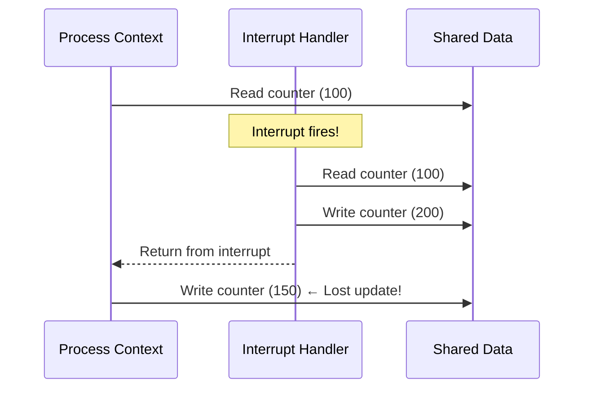
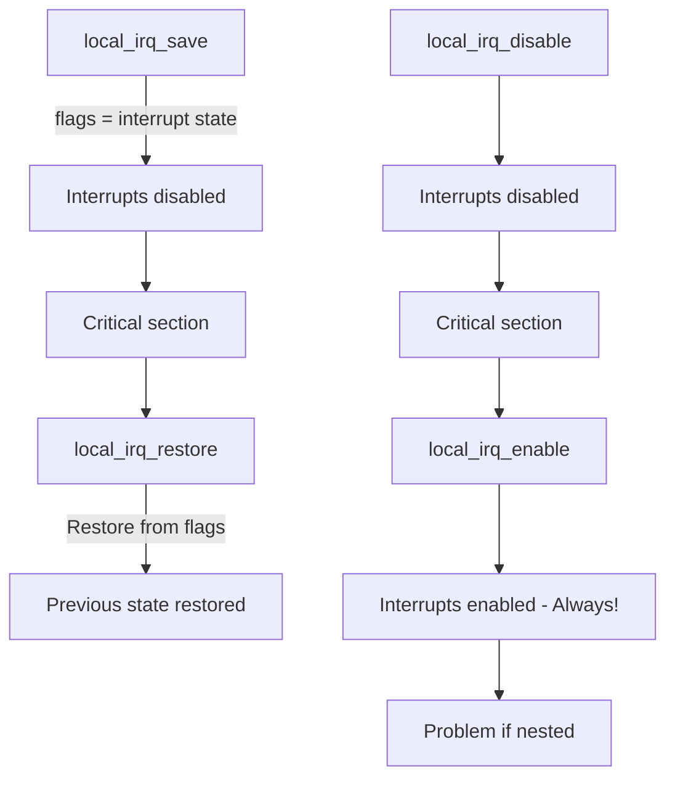
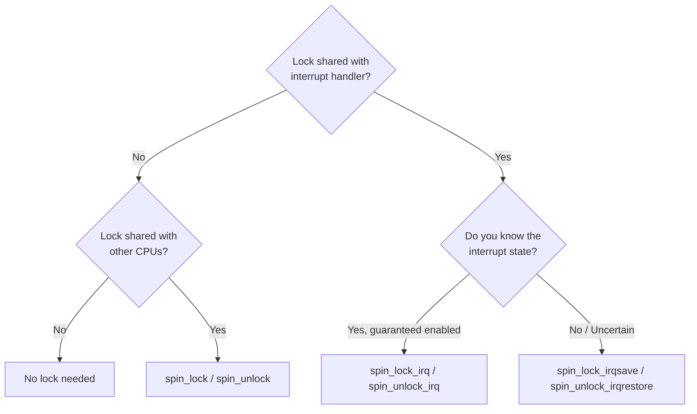
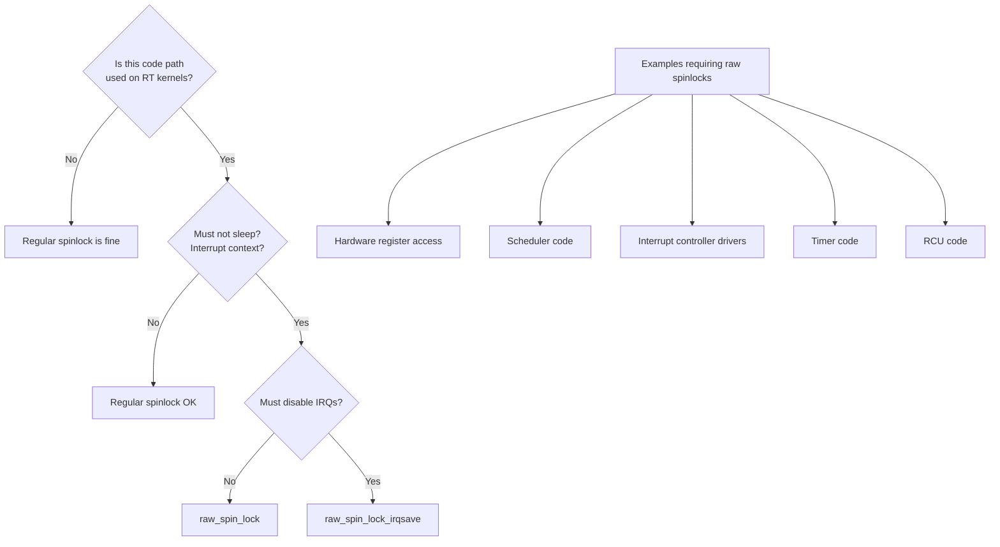

# Interrupt Control in the Linux Kernel

## Introduction

Interrupt control is a fundamental mechanism in the Linux kernel that allows code to temporarily prevent hardware or software interrupts from being delivered to the processor. Proper interrupt control is essential for protecting shared data structures, ensuring atomic operations, and maintaining system stability. However, misuse of interrupt control can cause system hangs, data loss, and latency spikes.

This chapter covers the APIs for disabling and enabling interrupts, the critical distinction between interrupt context and process context, and the design patterns that govern safe interrupt control in the kernel.

## Why Control Interrupts?

When a kernel data structure is shared between an interrupt handler and process-context code, a race condition exists:



Without interrupt control, the interrupt handler's update is lost. The kernel provides several levels of interrupt control to prevent this.

## Disabling and Enabling Interrupts

### `local_irq_disable()` / `local_irq_enable()`

These are the most basic interrupt control functions. They disable/enable interrupts on the **local CPU only**.

```c
#include <linux/interrupt.h>

/* Disable interrupts on the local CPU */
local_irq_disable();

/* Critical section — no interrupts can fire on this CPU */
shared_data++;

/* Re-enable interrupts */
local_irq_enable();
```

**Important characteristics:**
- Affects only the calling CPU.
- Does **not** prevent preemption by other CPUs.
- Must be used in matched pairs.
- Disabling interrupts for too long causes **lost interrupts** and system unresponsiveness.

### `local_irq_save()` / `local_irq_restore()`

The save/restore variants preserve the previous interrupt state, making them **nestable**:

```c
unsigned long flags;

local_irq_save(flags);      /* Disable and save previous state */
/* Critical section */
local_irq_restore(flags);   /* Restore previous state */
```

Why this matters — nesting example:

```c
void function_a(void) {
    unsigned long flags;
    local_irq_save(flags);      /* Interrupts disabled */
    function_b();               /* May also disable/restore */
    local_irq_restore(flags);   /* Correctly restores to enabled */
}

void function_b(void) {
    unsigned long flags;
    local_irq_save(flags);      /* Saves "disabled" state */
    /* ... work ... */
    local_irq_restore(flags);   /* Restores "disabled" state */
}
```

If `function_b()` used `local_irq_enable()` instead, it would incorrectly enable interrupts while `function_a()` expects them to be disabled.



## Architecture Implementation

### x86 Implementation

On x86, interrupt control maps directly to CPU instructions:

```c
/* arch/x86/include/asm/irqflags.h */

static inline void native_irq_disable(void) {
    asm volatile("cli" : : : "memory");  /* Clear Interrupt Flag */
}

static inline void native_irq_enable(void) {
    asm volatile("sti" : : : "memory");  /* Set Interrupt Flag */
}

static inline unsigned long native_save_fl(void) {
    unsigned long flags;
    asm volatile("# __raw_save_flags\n\t"
                 "pushf ; pop %0"
                 : "=rm" (flags) : : "memory");
    return flags;
}

static inline void native_restore_fl(unsigned long flags) {
    asm volatile("push %0 ; popf"
                 : : "g" (flags) : "memory", "cc");
}
```

### ARM64 Implementation

On ARM64, interrupt control manipulates the PSTATE register:

```c
/* arch/arm64/include/asm/irqflags.h */

static inline void arch_local_irq_disable(void) {
    asm volatile(
        "msr daifset, #2"    /* Disable IRQ in DAIF flags */
        ::: "memory");
}

static inline void arch_local_irq_enable(void) {
    asm volatile(
        "msr daifclr, #2"    /* Clear IRQ disable flag */
        ::: "memory");
}
```

## Spinlocks with IRQ Control

When a lock is shared between process context and interrupt context, you must disable interrupts while holding the lock.

### `spin_lock_irqsave()` / `spin_unlock_irqrestore()`

```c
#include <linux/spinlock.h>

DEFINE_SPINLOCK(my_lock);
unsigned long flags;

spin_lock_irqsave(&my_lock, flags);
/* Critical section — safe from interrupts AND other CPUs */
spin_unlock_irqrestore(&my_lock, flags);
```

### `spin_lock_irq()` / `spin_unlock_irq()`

```c
spin_lock_irq(&my_lock);
/* Critical section */
spin_unlock_irq(&my_lock);
```

**Danger**: `spin_lock_irq()` assumes interrupts are enabled when called. If they're already disabled, `spin_unlock_irq()` will incorrectly enable them.

### When to Use Which



| API | Disables IRQs? | Nestable? | When to Use |
|-----|----------------|-----------|-------------|
| `spin_lock()` | No | Yes | Process context only, no IRQ sharing |
| `spin_lock_irq()` | Yes | No | IRQs guaranteed enabled, shared with IRQ |
| `spin_lock_irqsave()` | Yes | Yes | Unknown IRQ state, shared with IRQ |
| `spin_lock_bh()` | BH only | Yes | Shared with softirq/tasklet |

## `raw_spinlock_irqsave()`

The kernel provides `raw_spinlock` variants for code that must never be preempted, even with the PREEMPT_RT patch applied.

### Regular Spinlocks vs Raw Spinlocks

With `PREEMPT_RT`, regular `spinlock_t` becomes a **sleeping lock** (rt_mutex) to reduce latency. This is unacceptable for code that must run in interrupt context or with interrupts disabled.

```c
#include <linux/spinlock.h>

/* Regular spinlock — becomes sleeping lock on RT */
DEFINE_SPINLOCK(regular_lock);

/* Raw spinlock — always a true spinlock, even on RT */
DEFINE_RAW_SPINLOCK(raw_lock);

/* Usage in interrupt-critical code */
raw_spinlock_t hw_lock;

void __init setup(void) {
    raw_spin_lock_init(&hw_lock);
}

irqreturn_t my_irq_handler(int irq, void *dev) {
    unsigned long flags;
    raw_spin_lock_irqsave(&hw_lock, flags);
    /* Hardware register access — must not sleep */
    raw_spin_unlock_irqrestore(&hw_lock, flags);
    return IRQ_HANDLED;
}
```

### When to Use Raw Spinlocks



## Bottom Half Disabling

### `local_bh_disable()` / `local_bh_enable()`

Disables softirq and tasklet execution on the local CPU:

```c
local_bh_disable();
/* Softirqs/tasklets will not run on this CPU */
shared_data++;
local_bh_enable();  /* May process pending softirqs */
```

### Combining Bottom-Half and IRQ Control

```c
/* Disable both IRQs and bottom halves */
spin_lock_irqsave(&lock, flags);
/* Safe from: other CPUs, interrupts, softirqs, tasklets */
spin_unlock_irqrestore(&lock, flags);

/* Disable only bottom halves (lighter weight) */
spin_lock_bh(&lock);
/* Safe from: other CPUs, softirqs, tasklets */
/* NOT safe from hardware interrupts */
spin_unlock_bh(&lock);
```

## Preemption Control

### `preempt_disable()` / `preempt_enable()`

```c
preempt_disable();
/* Will not be preempted, but IRQs still fire */
/* ... */
preempt_enable();  /* May trigger pending reschedules */
```

### Combined Control Levels

| API | Disables IRQs | Disables BH | Disables Preempt |
|-----|---------------|-------------|------------------|
| `preempt_disable()` | No | No | Yes |
| `local_bh_disable()` | No | Yes | No |
| `spin_lock_bh()` | No | Yes | Yes |
| `spin_lock()` | No | No | Yes |
| `local_irq_disable()` | Yes | Yes | Yes |
| `spin_lock_irq()` | Yes | Yes | Yes |
| `spin_lock_irqsave()` | Yes | Yes | Yes |

## Best Practices and Anti-Patterns

### Keep Interrupts Disabled for Minimum Time

```c
/* BAD: Long critical section with IRQs disabled */
spin_lock_irqsave(&lock, flags);
/* ... expensive computation ... */
/* ... memory allocation ... */  ← NEVER allocate with IRQs disabled
spin_unlock_irqrestore(&lock, flags);

/* GOOD: Minimize work with IRQs disabled */
spin_lock_irqsave(&lock, flags);
quick_copy = shared_data;  /* Copy what you need */
spin_unlock_irqrestore(&lock, flags);
/* ... expensive computation using quick_copy ... */
```

### Never Sleep with Interrupts Disabled

```c
/* BUG: Sleeping with IRQs disabled causes deadlock */
local_irq_disable();
kmalloc(size, GFP_KERNEL);   /* GFP_KERNEL can sleep! */
local_irq_enable();

/* Use GFP_ATOMIC if you must allocate with IRQs disabled */
local_irq_disable();
ptr = kmalloc(size, GFP_ATOMIC);  /* GFP_ATOMIC never sleeps */
local_irq_enable();
```

### Use the Right Lock for the Job

```c
/* If your lock is only used in process context: */
mutex_lock(&process_lock);  /* Sleeping lock — best performance */
/* ... */
mutex_unlock(&process_lock);

/* If shared with softirq: */
spin_lock_bh(&bh_lock);
/* ... */
spin_unlock_bh(&bh_lock);

/* If shared with hardirq: */
spin_lock_irqsave(&irq_lock, flags);
/* ... */
spin_unlock_irqrestore(&irq_lock, flags);
```

## Debugging Interrupt Control Issues

The kernel includes several debug options:

```kconfig
# CONFIG_PROVE_LOCKING=y      # Lockdep: lock correctness
# CONFIG_DEBUG_IRQFLAGS=y     # IRQ flag debugging
# CONFIG_LOCKDEP=y            # Lock dependency validator
# CONFIG_PREEMPT_RT=y          # RT kernel (exposes raw_spinlock issues)
```

Lockdep detects common mistakes:

```
=============================================
[ BUG: bad unlock balance detected! ]
---------------------------------------------
swapper/0/0 is trying to release lock (my_lock) at:
  [<ffffffff81234567>] my_function+0x42/0x100
but there are no more locks to release!
```

## Further Reading

- [Linux kernel docs: IRQs](https://docs.kernel.org/core-api/irq/index.html) — IRQ management documentation
- [LWN: RT spinlocks](https://lwn.net/Articles/646362/) — PREEMPT_RT spinlock changes
- [man7.org: spinlock](https://man7.org/linux/man-pages/man9/spin_lock_irqsave.9.html) — Kernel spinlock API
- [Linux Device Drivers, Ch. 10](https://lwn.net/Kernel/LDD3/) — Interrupt handling
- [docs.kernel.org: locking](https://docs.kernel.org/locking/index.html) — Locking documentation
- [LWN: raw_spinlock](https://lwn.net/Articles/434794/) — When to use raw spinlocks
