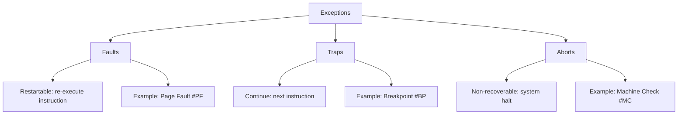
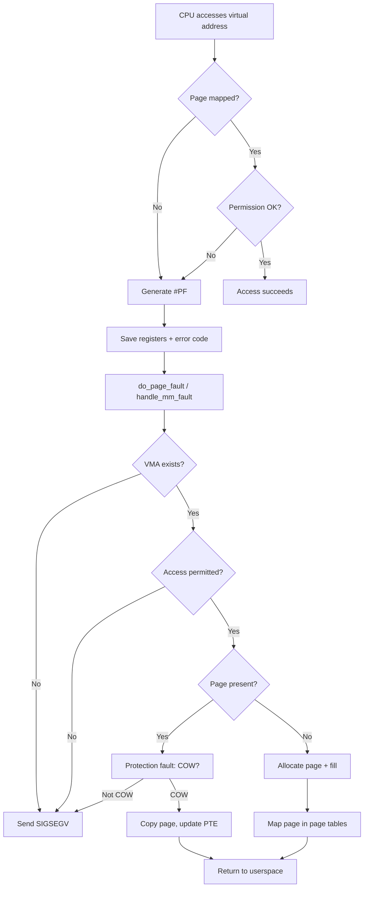
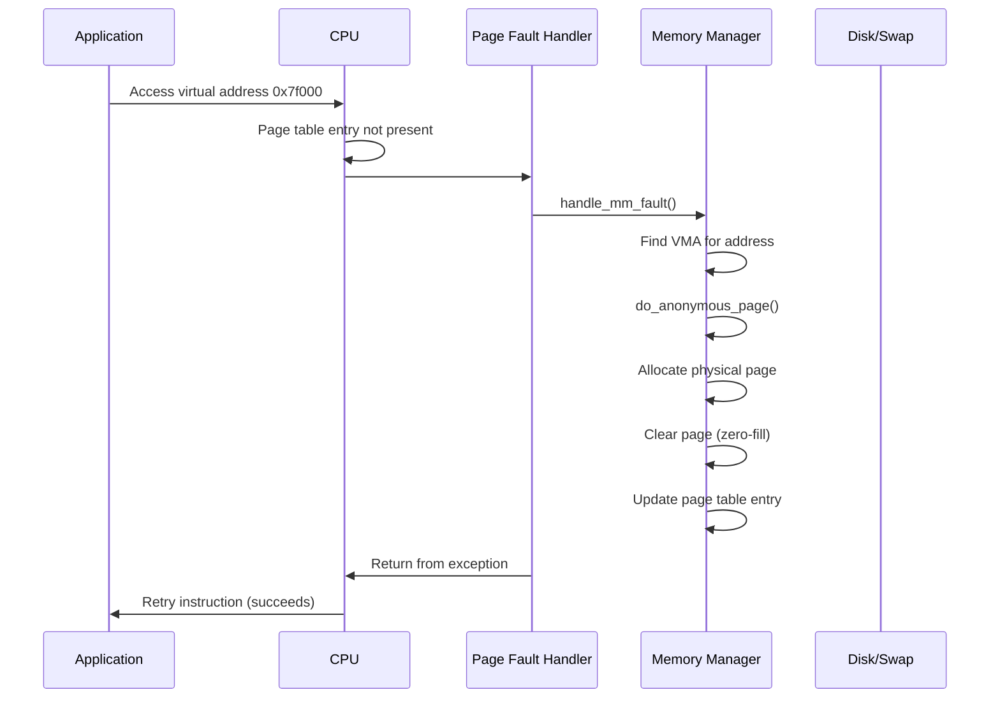
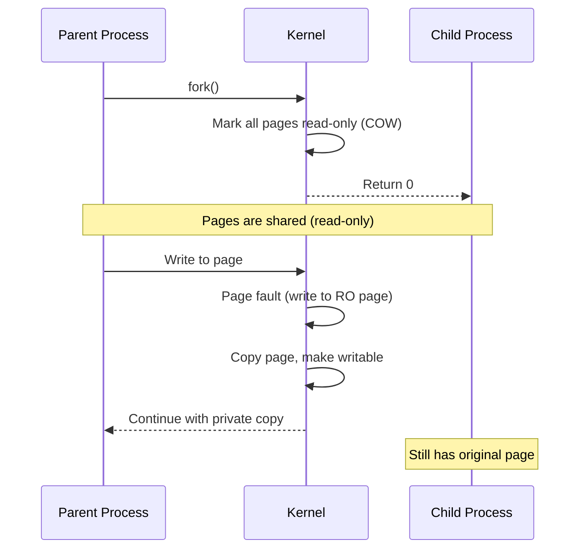
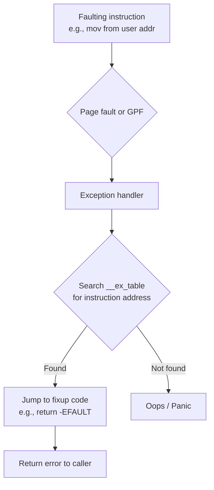
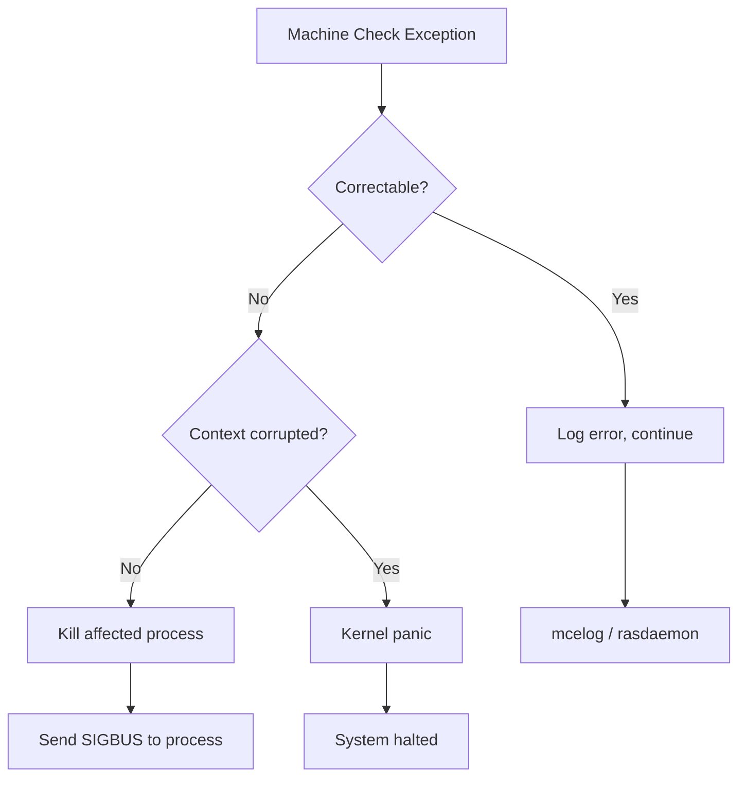

# Exceptions in the Linux Kernel

## Introduction

Exceptions are **synchronous, processor-generated** events that occur in response to specific conditions encountered during instruction execution. Unlike hardware interrupts (which are asynchronous), exceptions are caused directly by the code being executed. They include conditions like division by zero, invalid memory access, breakpoint traps, and system calls.

Understanding exceptions is essential for kernel debugging, driver development, and system reliability. When an exception is not handled gracefully, the kernel produces an **oops** (a non-fatal error report) or a **panic** (a fatal halt).

## Exception Classification

Exceptions are classified by the x86 architecture into several types:



| Type | Behavior | Cause | Example |
|------|----------|-------|---------|
| **Fault** | Re-execute the faulting instruction | Recoverable error | Page fault, segment not present |
| **Trap** | Continue at the next instruction | Intentional trap | Breakpoint, syscall |
| **Abort** | Cannot be restarted, may halt | Severe hardware error | Machine check, double fault |

## x86 Exception Vector Table

The x86 architecture defines 256 interrupt vectors. Vectors 0–31 are reserved for exceptions:

| Vector | Name | Type | Description |
|--------|------|------|-------------|
| 0 | #DE | Fault | Divide Error |
| 1 | #DB | Fault/Trap | Debug Exception |
| 2 | NMI | Interrupt | Non-Maskable Interrupt |
| 3 | #BP | Trap | Breakpoint |
| 4 | #OF | Trap | Overflow |
| 5 | #BR | Fault | Bound Range Exceeded |
| 6 | #UD | Fault | Invalid Opcode |
| 7 | #NM | Fault | Device Not Available |
| 8 | #DF | Abort | Double Fault |
| 9 | #MF | Fault | x87 FPU Segment Overrun (legacy) |
| 10 | #TS | Fault | Invalid TSS |
| 11 | #NP | Fault | Segment Not Present |
| 12 | #SS | Fault | Stack Segment Fault |
| 13 | #GP | Fault | General Protection Fault |
| 14 | #PF | Fault | Page Fault |
| 15 | — | — | Reserved |
| 16 | #MF | Fault | x87 FPU Floating-Point Error |
| 17 | #AC | Fault | Alignment Check |
| 18 | #MC | Abort | Machine Check |
| 19 | #XM | Fault | SIMD Floating-Point Exception |
| 20 | #VE | Fault | Virtualization Exception |
| 21 | #CP | Fault | Control Protection Exception |
| 22-31 | — | — | Reserved |

### IDT Setup for Exceptions

The kernel sets up the IDT during boot:

```c
/* arch/x86/kernel/idt.c */
/* Exception gate descriptors */
static const __initconst struct idt_data def_idts[] = {
    INTG(X86_TRAP_DE,          asm_exc_divide_error),
    DBGG(X86_TRAP_DB,          asm_exc_debug),
    INTG(X86_TRAP_NMI,         asm_exc_nmi),
    INTG(X86_TRAP_BP,          asm_exc_int3),
    INTG(X86_TRAP_OF,          asm_exc_overflow),
    INTG(X86_TRAP_BR,          asm_exc_bounds),
    INTG(X86_TRAP_UD,          asm_exc_invalid_op),
    INTG(X86_TRAP_NM,          asm_exc_device_not_available),
    INTG(X86_TRAP_DF,          asm_exc_double_fault),
    INTG(X86_TRAP_TS,          asm_exc_invalid_tss),
    INTG(X86_TRAP_NP,          asm_exc_segment_not_present),
    INTG(X86_TRAP_SS,          asm_exc_stack_segment),
    INTG(X86_TRAP_GP,          asm_exc_general_protection),
    INTG(X86_TRAP_PF,          asm_exc_page_fault),
    INTG(X86_TRAP_SPURIOUS,    asm_exc_spurious_interrupt_bug),
    INTG(X86_TRAP_MF,          asm_exc_coprocessor_error),
    INTG(X86_TRAP_AC,          asm_exc_alignment_check),
    INTG(X86_TRAP_MC,          asm_exc_machine_check),
    INTG(X86_TRAP_XF,          asm_exc_simd_coprocessor_error),
#ifdef CONFIG_X86_UMIP
    INTG(X86_TRAP_GP,          asm_exc_general_protection),
#endif
};
```

## The Page Fault Handler (#PF, Vector 14)

The page fault handler is the most complex and important exception handler in the Linux kernel. It handles virtual memory management, demand paging, copy-on-write, and memory-mapped I/O.

### Page Fault Flow

When the CPU accesses a virtual address that is not mapped or has protection violations, it generates exception #PF. The CPU provides the faulting address in **CR2** (x86) or **FAR_EL1** (ARM64) and an error code on the stack.



### x86 Page Fault Error Code

```
Bit 0 (P):  0 = Not-present page, 1 = Protection violation
Bit 1 (W):  0 = Read access, 1 = Write access
Bit 2 (U):  0 = Kernel mode, 1 = User mode
Bit 3 (RSVD): 1 = Reserved bit set in page table
Bit 4 (I):  1 = Instruction fetch
Bit 5 (PK): 1 = Protection key violation
Bit 15 (SGX): 1 = SGX-specific violation
```

### Kernel Page Fault Handler

```c
/* arch/x86/mm/fault.c (simplified) */

DEFINE_IDTENTRY_RAW_ERRORCODE(exc_page_fault)
{
    unsigned long address = read_cr2();
    unsigned long error_code = regs->cx;  /* Error code from stack */

    /* Decode the fault */
    bool write = error_code & X86_PF_WRITE;
    bool user = error_code & X86_PF_USER;
    bool fetch = error_code & X86_PF_INSTR;

    /* Kernel-mode fault in vmalloc area? */
    if (!user && address >= VMALLOC_START && address < VMALLOC_END) {
        if (vmalloc_fault(address) >= 0)
            return;
    }

    /* Call the main fault handler */
    __do_page_fault(regs, error_code, address);
}

static void __do_page_fault(struct pt_regs *regs, 
                             unsigned long error_code,
                             unsigned long address)
{
    struct mm_struct *mm;
    struct vm_area_struct *vma;
    vm_fault_t fault;

    mm = current->mm;

    /* Find the VMA for this address */
    vma = find_vma(mm, address);
    if (!vma || address < vma->vm_start) {
        /* Check for stack growth */
        if (expand_stack(vma, address)) {
            bad_area(regs, error_code, address);  /* SIGSEGV */
            return;
        }
    }

    /* Try to handle the fault */
    fault = handle_mm_fault(vma, address, flags, regs);

    if (fault_signal_pending(fault, regs)) {
        /* Signal was sent (e.g., SIGBUS) */
        return;
    }
}
```

### handle_mm_fault Breakdown

```c
/* mm/memory.c (simplified) */
vm_fault_t handle_mm_fault(struct vm_area_struct *vma,
                           unsigned long address,
                           unsigned int flags,
                           struct pt_regs *regs)
{
    vm_fault_t ret;

    /* Check if the VMA allows this access */
    if (unlikely(!(vma->vm_flags & VM_READ) && !(vma->vm_flags & VM_EXEC)))
        return VM_FAULT_SIGSEGV;

    /* Call the VMA-specific fault handler */
    if (vma->vm_ops->fault)
        ret = vma->vm_ops->fault(vmf);  /* File-backed or special mapping */
    else
        ret = do_anonymous_page(vmf);    /* Anonymous memory (heap, stack) */

    return ret;
}
```

### Page Fault Types

| Fault Type | Cause | Handler |
|------------|-------|---------|
| **Not-present, read** | Page not allocated (demand paging) | `do_anonymous_page()` or file read |
| **Not-present, write** | Copy-on-write | `wp_page_copy()` |
| **Protection, write** | COW on shared page | `wp_page_copy()` |
| **Protection, user** | Kernel page accessed from user | SIGSEGV |
| **Not-present, instruction** | Code page not loaded | Demand paging from file |
| **Stack growth** | Access below stack pointer | `expand_stack()` |

### Demand Paging

When a process first accesses a page that has been allocated but not yet backed by physical memory:



### Copy-on-Write (COW)

One of the most important page fault scenarios is **copy-on-write**, used by `fork()`:



**COW implementation details:**

```c
/* mm/memory.c — simplified wp_page_copy() */
static vm_fault_t wp_page_copy(struct vm_fault *vmf)
{
    struct page *old_page, *new_page;
    pte_t entry;

    /* Get the old page */
    old_page = vmf->page;

    /* Allocate a new page */
    new_page = alloc_page_vma(GFP_HIGHUSER_MOVABLE, vma, vmf->address);

    /* Copy data from old page to new page */
    copy_user_highpage(new_page, old_page, vmf->address, vma);

    /* Update page table: point to new page, make writable */
    entry = mk_pte(new_page, vma->vm_page_prot);
    entry = pte_mkwrite(pte_mkdirty(entry));
    set_pte_at_notify(mm, vmf->address, vmf->pte, entry);

    /* Decrement reference count on old page */
    page_remove_rmap(old_page, false);
    put_page(old_page);

    return 0;
}
```

### Huge Page Faults

Transparent Huge Pages (THP) add another dimension to page fault handling:

```c
/* When THP is enabled, the fault handler checks if a huge page
   can be used instead of regular 4KB pages */

vm_fault_t do_huge_pmd_anonymous_page(struct vm_fault *vmf)
{
    struct page *page;
    gfp_t gfp;

    /* Only if the VMA is huge-page eligible */
    if (!thp_vma_allowable_orders(vma, vma_is_anonymous(vma)))
        return VM_FAULT_FALLBACK;  /* Use regular pages */

    /* Allocate a 2MB page */
    gfp = vma_thp_gfp_mask(vma);
    page = alloc_pages(gfp, HPAGE_PMD_ORDER);

    /* Map it as a PMD entry (not PTE) */
    clear_huge_page(page, vmf->address);
    set_huge_pmd_at(vma->vm_mm, vmf->address, vmf->pmd, entry);

    return 0;
}
```

## General Protection Fault (#GP, Vector 13)

A **General Protection Fault** occurs when a memory access violates protection rules but doesn't involve paging. Common causes:

- Accessing a segment beyond its limit.
- Writing to a read-only segment.
- Loading an invalid segment selector.
- Executing a privileged instruction in user mode.
- Writing to a non-canonical address.

```c
/* Simplified GPF handling */

DEFINE_IDTENTRY(exc_general_protection)
{
    unsigned long address;

    /* Check for user-mode GPF */
    if (user_mode(regs)) {
        pr_warn("general protection fault at %lx\n", regs->ip);
        force_sig(SIGSEGV);
        return;
    }

    /* Kernel GPF — might be fixable (e.g., vmalloc fault) */
    /* Try fixup tables for known problematic instruction sites */
    if (fixup_exception(regs, X86_TRAP_GP, error_code))
        return;

    /* Unrecoverable — oops or panic */
    die("general protection fault", regs, error_code);
}
```

### Common GPF Causes in Kernel Code

```c
/* 1. NULL pointer dereference (kernel mode) */
struct my_struct *ptr = NULL;
ptr->field = 42;  /* GPF: writing to address 0x0 */

/* 2. Non-canonical address (bits 48-63 don't match bit 47) */
u64 bad_addr = 0x0000800000000000;  /* Bit 47 set but bits 48-63 clear */
*(u64 *)bad_addr = 42;  /* GPF */

/* 3. Writing to read-only kernel memory */
const int read_only = 42;
*(int *)&read_only = 10;  /* GPF or page fault */

/* 4. Using user-space pointer in kernel without proper access */
__user int *user_ptr = (int __user *)0x7fff0000;
int val = *user_ptr;  /* GPF if SMAP is enabled */
```

### Kernel Fixup Tables

The kernel uses exception fixup tables to handle faults in known-safe code paths:

```c
/* Example: copy_from_user can fault on bad user pointers */
unsigned long copy_from_user(void *to, const void __user *from, unsigned long n)
{
    /* Uses __get_user which may fault */
    /* If fault occurs, the fixup table catches it */
    ...
}

/* The fixup table entry (generated by the linker) */
.section .fixup, "ax"
3:  mov $n, %rax
    jmp 2b
.previous

.section __ex_table, "a"
    .align 8
    .quad 1b, 3b    /* If instruction at 1b faults, jump to 3b */
.previous
```

### How Fixup Tables Work



The fixup mechanism is crucial for safe user-space memory access:

```c
/* arch/x86/lib/usercopy_64.c */
unsigned long copy_from_user(void *to, const void __user *from, unsigned long n)
{
    if (access_ok(from, n))
        n = raw_copy_from_user(to, from, n);
    return n;
}

/* raw_copy_from_user uses __get_user internally */
/* which generates fixup table entries via _ASM_EXTABLE */
```

## Divide Error (#DE, Vector 0)

The divide error exception occurs when:

- `DIV` or `IDIV` instruction has a zero divisor.
- The quotient overflows the destination register.

```c
DEFINE_IDTENTRY(exc_divide_error)
{
    if (user_mode(regs)) {
        force_sig_fpe(FPE_INTDIV, regs);
        return;
    }

    /* Kernel divide by zero — always fatal */
    die("divide error", regs, 0);
}
```

In userspace:

```c
#include <signal.h>
#include <fenv.h>

void fpe_handler(int sig, siginfo_t *info, void *context) {
    printf("FPE: cause=%d, addr=%p\n", 
           info->si_code, info->si_addr);
    _exit(1);
}

int main(void) {
    struct sigaction sa = {
        .sa_sigaction = fpe_handler,
        .sa_flags = SA_SIGINFO
    };
    sigaction(SIGFPE, &sa, NULL);

    volatile int a = 1, b = 0;
    volatile int c = a / b;  /* SIGFPE */
}
```

## Invalid Opcode (#UD, Vector 6)

Generated when the CPU encounters an instruction it cannot decode:

```c
DEFINE_IDTENTRY(exc_invalid_op)
{
    /* User mode: send SIGILL */
    if (user_mode(regs)) {
        force_sig_ill(ILL_ILLOPC, regs);
        return;
    }

    /* Kernel mode: might be BUG() or UDS2 */
    if (report_bug(regs->ip, regs) == BUG_TRAP_TYPE_WARN)
        return;  /* WARN_ON — continue */

    die("invalid opcode", regs, 0);
}
```

**Common causes:**
- `BUG()` / `BUG_ON()` — generates `UD2` (opcode 0x0F 0x0B) intentionally.
- Executing data (corrupted code pointer).
- Using instructions not supported by the CPU (e.g., AVX on old CPU).
- Kernel module compiled for wrong architecture.

## Debug Exception (#DB, Vector 1)

Debug exceptions are used for:

- **Hardware breakpoints** (DR0-DR3 debug registers)
- **Single-step execution** (TF flag in EFLAGS)
- **Hardware watchpoints** (data breakpoints)

```c
/* GDB uses debug exceptions for breakpoints */
/* When you set a breakpoint in GDB: */
/* 1. GDB writes 0xCC (INT3) to the breakpoint address */
/* 2. CPU executes INT3, generates #BP (vector 3) */
/* 3. Kernel sends SIGTRAP to the process */
/* 4. GDB catches SIGTRAP and stops the process */

/* Hardware watchpoints use DR0-DR3 + DR7 */
/* These trigger #DB when a specific memory address is accessed */
```

### Hardware Breakpoint API

```c
/* include/linux/hw_breakpoint.h */

/* Register a hardware breakpoint */
struct perf_event *register_user_hw_breakpoint(
    struct perf_event_attr *attr,
    perf_overflow_handler_t triggered,
    void *context,
    struct task_struct *tsk);

/* Example: watch for writes to a variable */
struct perf_event_attr attr;
hw_breakpoint_init(&attr);
attr.bp_addr = (unsigned long)&my_variable;
attr.bp_len = HW_BREAKPOINT_LEN_4;
attr.bp_type = HW_BREAKPOINT_W;  /* Write only */

bp = register_user_hw_breakpoint(&attr, my_handler, NULL, current);
```

## Machine Check Exception (#MC, Vector 18)

Machine check exceptions are the most severe. They indicate **hardware errors**:

- Uncorrectable memory errors (ECC RAM failure).
- Cache parity errors.
- TLB errors.
- Bus errors.

```c
/* arch/x86/kernel/cpu/mcheck/mce.c (simplified) */

DEFINE_IDTENTRY(exc_machinecheck)
{
    struct mce m;

    /* Read machine check registers */
    m.status = mce_rdmsrl(MSR_IA32_MC0_STATUS);
    m.addr = mce_rdmsrl(MSR_IA32_MC0_ADDR);
    m.misc = mce_rdmsrl(MSR_IA32_MC0_MISC);

    /* Log the error */
    mce_log(&m);

    /* Is it fatal? */
    if (m.status & MCI_STATUS_UC) {
        /* Uncorrectable error */
        if (m.status & MCI_STATUS_PCC) {
            /* Processor context corrupted — must panic */
            mce_panic("Uncorrectable machine check", &m);
        }
        /* Try to kill the affected process */
        mce_kill_process(&m);
    }
}
```



### MCE Monitoring

```bash
# View MCE logs
$ sudo dmesg | grep -i "mce\|machine check"
[  123.456789] mce: [Hardware Error]: Machine check events logged
[  123.456790] mce: [Hardware Error]: CPU 0: Machine Check: 0 Bank 6: ...

# Install rasdaemon for persistent MCE logging
$ sudo apt install rasdaemon
$ sudo systemctl start rasdaemon

# Query MCE history
$ sudo ras-mc-ctl --errors
```

### MCE Severity Levels

| Status Bits | Severity | Action |
|-------------|----------|--------|
| `UC=0` | Correctable | Log and continue |
| `UC=1, PCC=0` | Uncorrectable, non-fatal | Kill process, send SIGBUS |
| `UC=1, PCC=1` | Uncorrectable, fatal | Kernel panic |
| `S=1` | Signaled | Error was signaled to software |
| `AR=1` | Action Required | Software must take action |

## Double Fault (#DF, Vector 8)

A double fault occurs when the CPU encounters an exception while trying to call the handler for a previous exception. This is typically caused by:

- Stack overflow (IDT handler can't push exception frame)
- Corrupted IDT
- Invalid TSS during exception delivery

```c
/* Double fault handler — typically uses IST (Interrupt Stack Table) */
DEFINE_IDTENTRY_DF(exc_double_fault)
{
    /* This is almost always fatal */
    pr_emerg("DOUBLE FAULT\n");
    show_regs(regs);

    /* Check for stack overflow */
    if (is_stack_overflow(regs)) {
        pr_emerg("Stack overflow detected\n");
    }

    panic("Double fault");
}
```

**IST (Interrupt Stack Table)** prevents double faults from stack overflows by switching to a known-good stack for critical exceptions:

```c
/* arch/x86/kernel/idt.c — IST entries */
#define IST_INDEX_DF    1   /* Double fault */
#define IST_INDEX_NMI   2   /* NMI */
#define IST_INDEX_DB    3   /* Debug */
#define IST_INDEX_MCE   4   /* Machine check */
```

## The Oops Mechanism

When the kernel encounters a non-fatal error, it produces an **oops** message—a detailed diagnostic report.

### Anatomy of an Oops

```
BUG: unable to handle page fault for address: ffffc90000000000
#PF: supervisor read access in kernel mode
#PF: error_code(0x0000) - not-present page
PGD 0 P4D 0 
Oops: 0000 [#1] PREEMPT SMP NOPTI
CPU: 3 PID: 1234 Comm: my_driver Tainted: G        W  O      5.15.0
Hardware name: QEMU Standard PC
RIP: 0010:my_faulty_function+0x42/0x100 [my_module]
Code: 48 8b 45 00 48 89 45 f0 e8 00 00 00 00 48 8b 45 f0 48 8b 00 <48> 8b 00 48 ...
RSP: 0018:ffffc900001abcde EFLAGS: 00010246
RAX: ffffc90000000000 RBX: 0000000000000000 RCX: 0000000000000000
RDX: 0000000000000000 RSI: ffff888103456789 RDI: ffff888103456789
RBP: ffffc900001abcf0 R08: 0000000000000000 R09: 0000000000000000
R10: 0000000000000000 R11: 0000000000000000 R12: 0000000000000000
R13: 0000000000000000 R14: 0000000000000000 R15: 0000000000000000
FS:  00007f1234567740(0000) GS:ffff888237d80000(0000) knlGS:0000000000000000
CS:  0010 DS: 0000 ES: 0000 CR0: 0000000080050033
CR2: ffffc90000000000 CR3: 0000000103456000 CR4: 00000000000006e0
Call Trace:
 my_faulty_function+0x42/0x100 [my_module]
 my_driver_read+0x23/0x50 [my_module]
 vfs_read+0x9e/0x1a0
 ksys_read+0x67/0xe0
 do_syscall_64+0x3b/0x90
 entry_SYSCALL_64_after_hwframe+0x44/0xae
```

### Oops Key Fields

| Field | Meaning |
|-------|---------|
| `Oops: 0000 [#1]` | Error code and oops count |
| `PREEMPT SMP` | Kernel configuration flags |
| `Tainted: G W O` | Taint flags (G=GPL, W=warn, O=out-of-tree) |
| `RIP: 0010:addr` | Instruction pointer at fault |
| `Code:` | Hex dump of instruction bytes around RIP |
| `CR2:` | Faulting address (for page faults) |
| `Call Trace:` | Stack backtrace |

### Taint Flags

```bash
$ cat /proc/sys/kernel/tainted
12288

# Decode:
# G (1)    = GPL-only module loaded
# P (2)    = Proprietary module loaded
# F (4)    = Module forcibly loaded
# S (8)    = Machine check (hardware error)
# R (16)   = Module unloaded forcibly
# M (32)   = Machine check exception occurred
# B (64)   = Bad page referenced
# U (128)  = Userspace-defined taint
# D (256)  = Kernel has recently died (oops/panic)
# A (512)  = ACPI table overridden
# W (1024) = Warning issued
# C (2048) = Staging driver loaded
# I (4096) = Workaround for platform firmware bug
# O (8192) = Out-of-tree module loaded
# E (16384) = Unsigned module loaded
# L (32768) = Soft lockup occurred
# K (65536) = Kernel has live-patched
# X (131072) = Auxiliary taint
# T (262144) = Randomized struct layout
```

### Oops vs Panic

- **Oops**: The kernel kills the offending process and continues. The system remains running but may be in an inconsistent state.
- **Panic**: The kernel halts the entire system. Used when continuing would be dangerous.

```c
/* Trigger an oops */
BUG();                          /* Unconditional oops */
BUG_ON(condition);              /* Oops if condition is true */
WARN_ON(condition);             /* Warning (stack trace) but continue */

/* Trigger a panic */
panic("Fatal error: %s", msg);  /* Halt the system */

/* The kernel can be configured to panic on oops */
/* /proc/sys/kernel/panic_on_oops = 1 */
```

### Decoding an Oops

The `decode_stacktrace.sh` tool translates addresses to source locations:

```bash
# Capture the oops from dmesg
dmesg | tail -50 > oops.txt

# Decode with symbol information
scripts/decode_stacktrace.sh vmlinux < oops.txt

# Or use addr2line
addr2line -e vmlinux ffffffff81234567

# Or use gdb
$ gdb vmlinux
(gdb) info line *0xffffffff81234567
Line 42 of "drivers/my_driver.c" starts at address 0xffffffff81234560
```

### Tainted Kernel Analysis

```bash
# Check if kernel is tainted
$ cat /proc/sys/kernel/tainted
12288

# Decode with script
$ python3 -c "
taint = int(open('/proc/sys/kernel/tainted').read())
flags = 'GPFSMRBUWAIDGETLKXT'
for i, c in enumerate(flags):
    if taint & (1 << i):
        print(f'  {c} ({1 << i}): set')
    else:
        print(f'  {c} ({1 << i}): clear')
"
```

## Exception Handling in ARM64

ARM64 uses a different exception model with **Exception Levels** (EL0-EL3):

```
EL0: User applications
EL1: Kernel (OS)
EL2: Hypervisor
EL3: Secure Monitor (firmware)
```

ARM64 exception vectors are at fixed offsets from `VBAR_EL1`:

```
Offset  Exception
0x000   Synchronous (EL1t)
0x080   IRQ (EL1t)
0x100   FIQ (EL1t)
0x180   SError (EL1t)
0x200   Synchronous (EL1h)  ← Kernel mode sync
0x280   IRQ (EL1h)          ← Kernel mode IRQ
0x300   FIQ (EL1h)
0x380   SError (EL1h)
0x400   Synchronous (EL0 64-bit) ← User mode syscall/fault
0x480   IRQ (EL0 64-bit)
0x500   FIQ (EL0 64-bit)
0x580   SError (EL0 64-bit)
```

### ARM64 Exception Entry

```c
/* arch/arm64/kernel/entry.S (simplified) */

    .align 11
SYM_CODE_START(vectors)
    /* EL1t (kernel, SP_EL0) */
    kernel_ventry   1, t, sync      // 0x000
    kernel_ventry   1, t, irq       // 0x080
    kernel_ventry   1, t, fiq       // 0x100
    kernel_ventry   1, t, serror    // 0x180

    /* EL1h (kernel, SP_ELx) */
    kernel_ventry   1, h, sync      // 0x200
    kernel_ventry   1, h, irq       // 0x280
    kernel_ventry   1, h, fiq       // 0x300
    kernel_ventry   1, h, serror    // 0x380

    /* EL0 64-bit (user) */
    kernel_ventry   0, 64, sync     // 0x400
    kernel_ventry   0, 64, irq      // 0x480
    kernel_ventry   0, 64, fiq      // 0x500
    kernel_ventry   0, 64, serror   // 0x580
SYM_CODE_END(vectors)
```

### ARM64 Exception Syndrome Register (ESR_EL1)

ARM64 provides detailed fault information in `ESR_EL1`:

```c
/* ESR_EL1 fields */
#define ESR_ELx_EC_SHIFT    26
#define ESR_ELx_EC_MASK     (0x3F << 26)
#define ESR_ELx_ISS_MASK    0x01FFFFFF

/* Exception class (EC) values */
#define ESR_ELx_EC_UNKNOWN  0x00  /* Unknown reason */
#define ESR_ELx_EC_WFI      0x01  /* WFI/WFE trapped */
#define ESR_ELx_EC_FPAC     0x07  /* FPAC exception */
#define ESR_ELx_EC_CP15_32  0x03  /* MCR/MRC trapped */
#define ESR_ELx_EC_SVC64    0x15  /* SVC from AArch64 */
#define ESR_ELx_EC_IABT_LOW 0x20  /* Instruction abort from lower EL */
#define ESR_ELx_EC_IABT_CUR 0x21  /* Instruction abort from current EL */
#define ESR_ELx_EC_PC_ALIGN 0x22  /* PC alignment fault */
#define ESR_ELx_EC_DABT_LOW 0x24  /* Data abort from lower EL */
#define ESR_ELx_EC_DABT_CUR 0x25  /* Data abort from current EL */
#define ESR_ELx_EC_SP_ALIGN 0x26  /* SP alignment fault */
#define ESR_ELx_EC_FP_EXC64 0x2C  /* FP exception from AArch64 */
#define ESR_ELx_EC_SERROR   0x2F  /* SError */
#define ESR_ELx_EC_BRK64    0x3C  /* BRK from AArch64 */
```

## Exception Interaction with Signals

Exceptions in user mode result in signals being sent to the process:

| Exception | Signal | Default Action |
|-----------|--------|----------------|
| Divide Error (#DE) | SIGFPE | Core dump |
| Debug (#DB) | SIGTRAP | Stop |
| Breakpoint (#BP) | SIGTRAP | Stop |
| Invalid Opcode (#UD) | SIGILL | Core dump |
| General Protection (#GP) | SIGSEGV | Core dump |
| Page Fault (#PF) | SIGSEGV/SIGBUS | Core dump |
| Alignment Check (#AC) | SIGBUS | Core dump |
| Machine Check (#MC) | SIGBUS | Core dump |
| Stack Fault (#SS) | SIGSEGV | Core dump |

```c
/* How the kernel delivers signals for exceptions */
static void force_sig_info_fault(int si_signo, int si_code,
                                  unsigned long address,
                                  struct task_struct *tsk)
{
    kernel_siginfo_t info;
    clear_siginfo(&info);
    info.si_signo = si_signo;
    info.si_errno = 0;
    info.si_code = si_code;
    info.si_addr = (void __user *)address;
    force_sig_info(&info);
}
```

## Further Reading

- [Linux kernel docs: x86 exceptions](https://docs.kernel.org/arch/x86/exception-tables.html) — Exception tables
- [Intel SDM Vol. 3, Ch. 6](https://www.intel.com/content/www/us/en/developer/articles/technical/intel-sdm.html) — Interrupt and exception handling
- [LWN: Understanding page faults](https://lwn.net/Articles/646362/) — Page fault handling
- [man7.org: signal](https://man7.org/linux/man-pages/man7/signal.7.html) — Signal delivery for exceptions
- [Kernel oops decoding](https://docs.kernel.org/dev-tools/gdb-kernel-debugging.html) — Debugging kernel oops
- [ARM64 Exception Model](https://developer.arm.com/documentation/den0024/a/AArch64-Exception-Handling) — ARM64 exception handling
- [MCE handling in Linux](https://docs.kernel.org/x86/x86_64/machinecheck.html) — Machine check exception documentation
