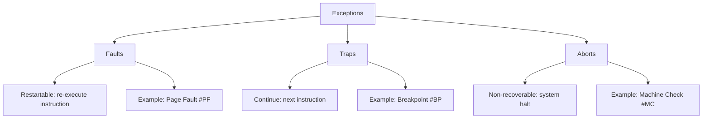
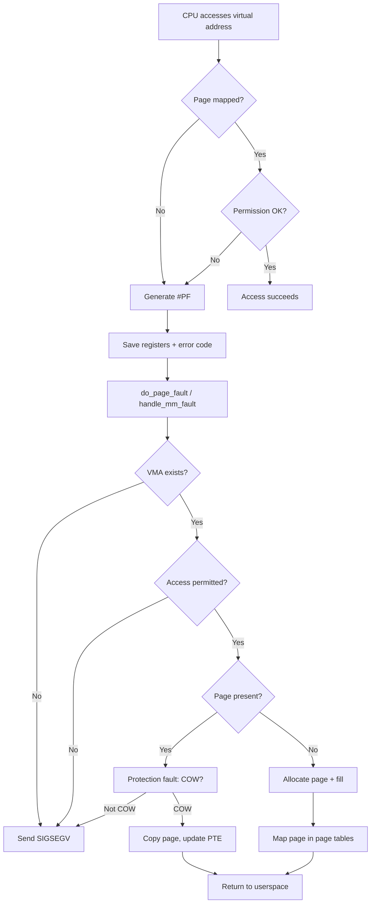
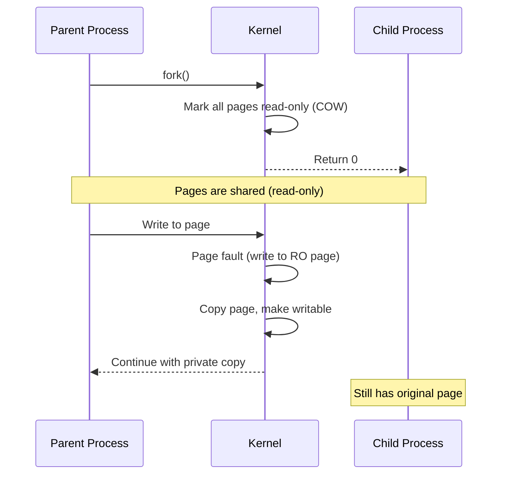
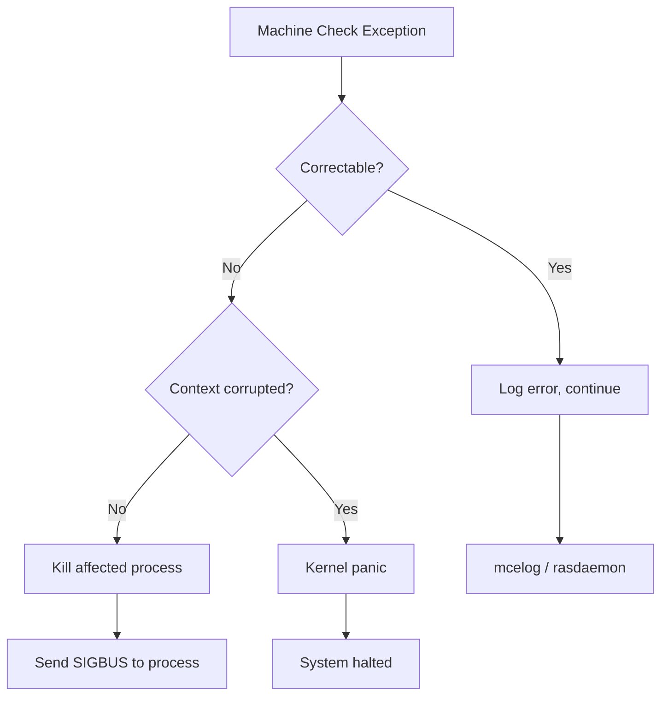

# Exceptions in the Linux Kernel

## Introduction

Exceptions are **synchronous, processor-generated** events that occur in response to specific conditions encountered during instruction execution. Unlike hardware interrupts (which are asynchronous), exceptions are caused directly by the code being executed. They include conditions like division by zero, invalid memory access, breakpoint traps, and system calls.

Understanding exceptions is essential for kernel debugging, driver development, and system reliability. When an exception is not handled gracefully, the kernel produces an **oops** (a non-fatal error report) or a **panic** (a fatal halt).

## Exception Classification

Exceptions are classified by the x86 architecture into several types:



| Type | Behavior | Cause | Example |
|------|----------|-------|---------|
| **Fault** | Re-execute the faulting instruction | Recoverable error | Page fault, segment not present |
| **Trap** | Continue at the next instruction | Intentional trap | Breakpoint, syscall |
| **Abort** | Cannot be restarted, may halt | Severe hardware error | Machine check, double fault |

## x86 Exception Vector Table

The x86 architecture defines 256 interrupt vectors. Vectors 0–31 are reserved for exceptions:

| Vector | Name | Type | Description |
|--------|------|------|-------------|
| 0 | #DE | Fault | Divide Error |
| 1 | #DB | Fault/Trap | Debug Exception |
| 2 | NMI | Interrupt | Non-Maskable Interrupt |
| 3 | #BP | Trap | Breakpoint |
| 4 | #OF | Trap | Overflow |
| 5 | #BR | Fault | Bound Range Exceeded |
| 6 | #UD | Fault | Invalid Opcode |
| 7 | #NM | Fault | Device Not Available |
| 8 | #DF | Abort | Double Fault |
| 10 | #TS | Fault | Invalid TSS |
| 11 | #NP | Fault | Segment Not Present |
| 12 | #SS | Fault | Stack Segment Fault |
| 13 | #GP | Fault | General Protection Fault |
| 14 | #PF | Fault | Page Fault |
| 16 | #MF | Fault | x87 FPU Floating-Point Error |
| 17 | #AC | Fault | Alignment Check |
| 18 | #MC | Abort | Machine Check |
| 19 | #XM | Fault | SIMD Floating-Point Exception |
| 20 | #VE | Fault | Virtualization Exception |
| 21 | #CP | Fault | Control Protection Exception |

## The Page Fault Handler (#PF, Vector 14)

The page fault handler is the most complex and important exception handler in the Linux kernel. It handles virtual memory management, demand paging, copy-on-write, and memory-mapped I/O.

### Page Fault Flow

When the CPU accesses a virtual address that is not mapped or has protection violations, it generates exception #PF. The CPU provides the faulting address in **CR2** (x86) or **FAR_EL1** (ARM64) and an error code on the stack.



### x86 Page Fault Error Code

```
Bit 0 (P):  0 = Not-present page, 1 = Protection violation
Bit 1 (W):  0 = Read access, 1 = Write access
Bit 2 (U):  0 = Kernel mode, 1 = User mode
Bit 3 (RSVD): 1 = Reserved bit set in page table
Bit 4 (I):  1 = Instruction fetch
Bit 5 (PK): 1 = Protection key violation
Bit 15 (SGX): 1 = SGX-specific violation
```

### Kernel Page Fault Handler

```c
/* arch/x86/mm/fault.c (simplified) */

DEFINE_IDTENTRY_RAW_ERRORCODE(exc_page_fault)
{
    unsigned long address = read_cr2();
    unsigned long error_code = regs->cx;  /* Error code from stack */

    /* Decode the fault */
    bool write = error_code & X86_PF_WRITE;
    bool user = error_code & X86_PF_USER;
    bool fetch = error_code & X86_PF_INSTR;

    /* Kernel-mode fault in vmalloc area? */
    if (!user && address >= VMALLOC_START && address < VMALLOC_END) {
        if (vmalloc_fault(address) >= 0)
            return;
    }

    /* Call the main fault handler */
    __do_page_fault(regs, error_code, address);
}

static void __do_page_fault(struct pt_regs *regs, 
                             unsigned long error_code,
                             unsigned long address)
{
    struct mm_struct *mm;
    struct vm_area_struct *vma;
    vm_fault_t fault;

    mm = current->mm;

    /* Find the VMA for this address */
    vma = find_vma(mm, address);
    if (!vma || address < vma->vm_start) {
        /* Check for stack growth */
        if (expand_stack(vma, address)) {
            bad_area(regs, error_code, address);  /* SIGSEGV */
            return;
        }
    }

    /* Try to handle the fault */
    fault = handle_mm_fault(vma, address, flags, regs);

    if (fault_signal_pending(fault, regs)) {
        /* Signal was sent (e.g., SIGBUS) */
        return;
    }
}
```

### Copy-on-Write (COW)

One of the most important page fault scenarios is **copy-on-write**, used by `fork()`:



## General Protection Fault (#GP, Vector 13)

A **General Protection Fault** occurs when a memory access violates protection rules but doesn't involve paging. Common causes:

- Accessing a segment beyond its limit.
- Writing to a read-only segment.
- Loading an invalid segment selector.
- Executing a privileged instruction in user mode.
- Writing to a non-canonical address.

```c
/* Simplified GPF handling */

DEFINE_IDTENTRY(exc_general_protection)
{
    unsigned long address;

    /* Check for user-mode GPF */
    if (user_mode(regs)) {
        pr_warn("general protection fault at %lx\n", regs->ip);
        force_sig(SIGSEGV);
        return;
    }

    /* Kernel GPF — might be fixable (e.g., vmalloc fault) */
    /* Try fixup tables for known problematic instruction sites */
    if (fixup_exception(regs, X86_TRAP_GP, error_code))
        return;

    /* Unrecoverable — oops or panic */
    die("general protection fault", regs, error_code);
}
```

### Kernel Fixup Tables

The kernel uses exception fixup tables to handle faults in known-safe code paths:

```c
/* Example: copy_from_user can fault on bad user pointers */
unsigned long copy_from_user(void *to, const void __user *from, unsigned long n)
{
    /* Uses __get_user which may fault */
    /* If fault occurs, the fixup table catches it */
    ...
}

/* The fixup table entry (generated by the linker) */
.section .fixup, "ax"
3:  mov $n, %rax
    jmp 2b
.previous

.section __ex_table, "a"
    .align 8
    .quad 1b, 3b    /* If instruction at 1b faults, jump to 3b */
.previous
```

## Divide Error (#DE, Vector 0)

The divide error exception occurs when:

- `DIV` or `IDIV` instruction has a zero divisor.
- The quotient overflows the destination register.

```c
DEFINE_IDTENTRY(exc_divide_error)
{
    if (user_mode(regs)) {
        force_sig_fpe(FPE_INTDIV, regs);
        return;
    }

    /* Kernel divide by zero — always fatal */
    die("divide error", regs, 0);
}
```

In userspace:

```c
#include <signal.h>
#include <fenv.h>

void fpe_handler(int sig, siginfo_t *info, void *context) {
    printf("FPE: cause=%d, addr=%p\n", 
           info->si_code, info->si_addr);
    _exit(1);
}

int main(void) {
    struct sigaction sa = {
        .sa_sigaction = fpe_handler,
        .sa_flags = SA_SIGINFO
    };
    sigaction(SIGFPE, &sa, NULL);

    volatile int a = 1, b = 0;
    volatile int c = a / b;  /* SIGFPE */
}
```

## Debug Exception (#DB, Vector 1)

Debug exceptions are used for:

- **Hardware breakpoints** (DR0-DR3 debug registers)
- **Single-step execution** (TF flag in EFLAGS)
- **Hardware watchpoints** (data breakpoints)

```c
/* GDB uses debug exceptions for breakpoints */
/* When you set a breakpoint in GDB: */
/* 1. GDB writes 0xCC (INT3) to the breakpoint address */
/* 2. CPU executes INT3, generates #BP (vector 3) */
/* 3. Kernel sends SIGTRAP to the process */
/* 4. GDB catches SIGTRAP and stops the process */

/* Hardware watchpoints use DR0-DR3 + DR7 */
/* These trigger #DB when a specific memory address is accessed */
```

## Machine Check Exception (#MC, Vector 18)

Machine check exceptions are the most severe. They indicate **hardware errors**:

- Uncorrectable memory errors (ECC RAM failure).
- Cache parity errors.
- TLB errors.
- Bus errors.

```c
/* arch/x86/kernel/cpu/mcheck/mce.c (simplified) */

DEFINE_IDTENTRY(exc_machinecheck)
{
    struct mce m;

    /* Read machine check registers */
    m.status = mce_rdmsrl(MSR_IA32_MC0_STATUS);
    m.addr = mce_rdmsrl(MSR_IA32_MC0_ADDR);
    m.misc = mce_rdmsrl(MSR_IA32_MC0_MISC);

    /* Log the error */
    mce_log(&m);

    /* Is it fatal? */
    if (m.status & MCI_STATUS_UC) {
        /* Uncorrectable error */
        if (m.status & MCI_STATUS_PCC) {
            /* Processor context corrupted — must panic */
            mce_panic("Uncorrectable machine check", &m);
        }
        /* Try to kill the affected process */
        mce_kill_process(&m);
    }
}
```



## The Oops Mechanism

When the kernel encounters a non-fatal error, it produces an **oops** message—a detailed diagnostic report.

### Anatomy of an Oops

```
BUG: unable to handle page fault for address: ffffc90000000000
#PF: supervisor read access in kernel mode
#PF: error_code(0x0000) - not-present page
PGD 0 P4D 0 
Oops: 0000 [#1] PREEMPT SMP NOPTI
CPU: 3 PID: 1234 Comm: my_driver Tainted: G        W  O      5.15.0
Hardware name: QEMU Standard PC
RIP: 0010:my_faulty_function+0x42/0x100 [my_module]
Code: 48 8b 45 00 48 89 45 f0 e8 00 00 00 00 48 8b 45 f0 48 8b 00 <48> 8b 00 48 ...
RSP: 0018:ffffc900001abcde EFLAGS: 00010246
RAX: ffffc90000000000 RBX: 0000000000000000 RCX: 0000000000000000
RDX: 0000000000000000 RSI: ffff888103456789 RDI: ffff888103456789
RBP: ffffc900001abcf0 R08: 0000000000000000 R09: 0000000000000000
R10: 0000000000000000 R11: 0000000000000000 R12: 0000000000000000
R13: 0000000000000000 R14: 0000000000000000 R15: 0000000000000000
FS:  00007f1234567740(0000) GS:ffff888237d80000(0000) knlGS:0000000000000000
CS:  0010 DS: 0000 ES: 0000 CR0: 0000000080050033
CR2: ffffc90000000000 CR3: 0000000103456000 CR4: 00000000000006e0
Call Trace:
 my_faulty_function+0x42/0x100 [my_module]
 my_driver_read+0x23/0x50 [my_module]
 vfs_read+0x9e/0x1a0
 ksys_read+0x67/0xe0
 do_syscall_64+0x3b/0x90
 entry_SYSCALL_64_after_hwframe+0x44/0xae
```

### Oops vs Panic

- **Oops**: The kernel kills the offending process and continues. The system remains running but may be in an inconsistent state.
- **Panic**: The kernel halts the entire system. Used when continuing would be dangerous.

```c
/* Trigger an oops */
BUG();                          /* Unconditional oops */
BUG_ON(condition);              /* Oops if condition is true */
WARN_ON(condition);             /* Warning (stack trace) but continue */

/* Trigger a panic */
panic("Fatal error: %s", msg);  /* Halt the system */

/* The kernel can be configured to panic on oops */
/* /proc/sys/kernel/panic_on_oops = 1 */
```

### Decoding an Oops

The `decode_stacktrace.sh` tool translates addresses to source locations:

```bash
# Capture the oops from dmesg
dmesg | tail -50 > oops.txt

# Decode with symbol information
scripts/decode_stacktrace.sh vmlinux < oops.txt

# Or use addr2line
addr2line -e vmlinux ffffffff81234567
```

## Exception Handling in ARM64

ARM64 uses a different exception model with **Exception Levels** (EL0-EL3):

```
EL0: User applications
EL1: Kernel (OS)
EL2: Hypervisor
EL3: Secure Monitor (firmware)
```

ARM64 exception vectors are at fixed offsets from `VBAR_EL1`:

```
Offset  Exception
0x000   Synchronous (EL1t)
0x080   IRQ (EL1t)
0x100   FIQ (EL1t)
0x180   SError (EL1t)
0x200   Synchronous (EL1h)  ← Kernel mode sync
0x280   IRQ (EL1h)          ← Kernel mode IRQ
0x300   FIQ (EL1h)
0x380   SError (EL1h)
0x400   Synchronous (EL0 64-bit) ← User mode syscall/fault
0x480   IRQ (EL0 64-bit)
0x500   FIQ (EL0 64-bit)
0x580   SError (EL0 64-bit)
```

## Further Reading

- [Linux kernel docs: x86 exceptions](https://docs.kernel.org/arch/x86/exception-tables.html) — Exception tables
- [Intel SDM Vol. 3, Ch. 6](https://www.intel.com/content/www/us/en/developer/articles/technical/intel-sdm.html) — Interrupt and exception handling
- [LWN: Understanding page faults](https://lwn.net/Articles/646362/) — Page fault handling
- [man7.org: signal](https://man7.org/linux/man-pages/man7/signal.7.html) — Signal delivery for exceptions
- [Kernel oops decoding](https://docs.kernel.org/dev-tools/gdb-kernel-debugging.html) — Debugging kernel oops
- [ARM64 Exception Model](https://developer.arm.com/documentation/den0024/a/AArch64-Exception-Handling) — ARM64 exception handling
- [MCE handling in Linux](https://docs.kernel.org/x86/x86_64/machinecheck.html) — Machine check exception documentation
