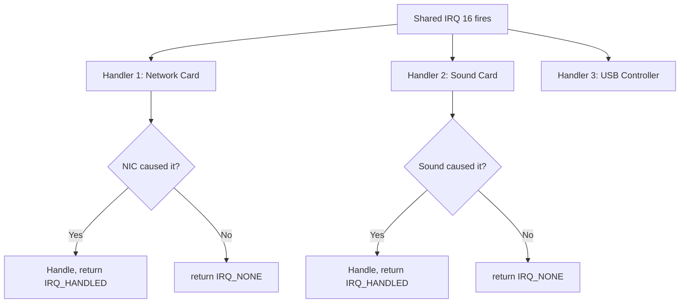
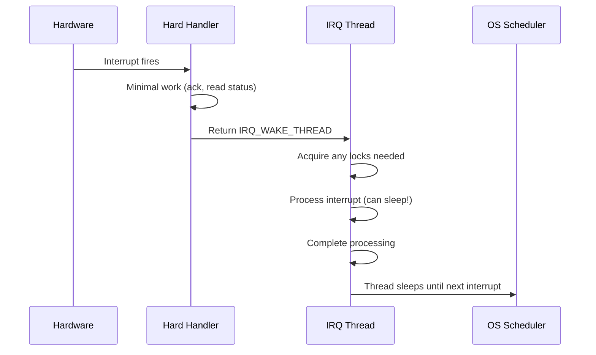
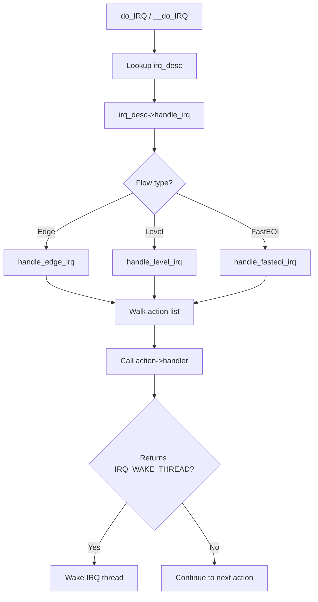

# Interrupt Handlers

## Introduction

An interrupt handler (also called an Interrupt Service Routine, or ISR) is the function that the kernel calls when a specific interrupt fires. Registering, managing, and executing interrupt handlers is one of the most fundamental tasks in device driver development. This chapter covers the APIs for registering handlers, the threaded interrupt model, the constraints of interrupt context, and best practices for writing reliable interrupt handlers.

## The IRQ Descriptor

Every Linux IRQ number has an associated `irq_desc` structure that holds all metadata for that interrupt:

```c
struct irq_desc {
    struct irq_common_data  irq_common_data;
    struct irq_data         irq_data;
    unsigned int __percpu   *kstat_irqs;  /* per-CPU IRQ counters */
    irq_flow_handler_t      handle_irq;   /* flow handler */
    struct irqaction        *action;       /* handler chain */
    unsigned int            status_use_accessors;
    unsigned int            depth;         /* disable depth */
    unsigned int            irq_count;     /* spurious IRQ detection */
    const char              *name;
    raw_spinlock_t          lock;
    /* ... */
};
```

The `action` field is a linked list of `irqaction` structures, each representing one registered handler for that IRQ.

## Registering an Interrupt Handler: request_irq

The primary API for registering an interrupt handler is `request_irq()` (and its variants):

```c
int request_irq(unsigned int irq,
                irq_handler_t handler,
                unsigned long flags,
                const char *name,
                void *dev);
```

**Parameters:**

| Parameter | Description |
|-----------|-------------|
| `irq` | Linux IRQ number (obtained from platform resources, DT, or `pci_alloc_irq_vectors()`) |
| `handler` | Function to call when the interrupt fires |
| `flags` | Modifier flags (see below) |
| `name` | Name shown in `/proc/interrupts` |
| `dev` | Cookie passed to the handler; used for shared interrupts to identify the device |

**Return:** 0 on success, negative errno on failure.

### Handler Prototype

```c
irqreturn_t handler(int irq, void *dev_id);
```

Return values:
- `IRQ_HANDLED`: The interrupt was from this device and was handled
- `IRQ_NONE`: The interrupt was not from this device (shared interrupts only)
- `IRQ_WAKE_THREAD`: Wake the threaded handler (for threaded interrupts)

### Common Flags

```c
#define IRQF_SHARED         0x00000080  /* Shared interrupt line */
#define IRQF_PROBE_SHARED   0x00000100  /* Handler can be shared but may be spurious */
#define IRQF_TIMER          0x00000200  /* Marks as timer interrupt */
#define IRQF_PERCPU         0x00000400  /* Per-CPU interrupt */
#define IRQF_NOBALANCING    0x00000800  /* Excluded from IRQ balancing */
#define IRQF_IRQPOLL        0x00001000  /* Shared for polling */
#define IRQF_ONESHOT        0x00002000  /* Keep IRQ masked until threaded handler completes */
#define IRQF_NO_SUSPEND     0x00004000  /* Don't disable during suspend */
#define IRQF_FORCE_RESUME   0x00008000  /* Force-enable on resume even with IRQF_NO_SUSPEND */
#define IRQF_NO_THREAD      0x00010000  /* Interrupt cannot be threaded */
```

### Example: Registering a Simple Handler

```c
static irqreturn_t my_device_irq(int irq, void *dev_id)
{
    struct my_device *dev = dev_id;
    u32 status;

    /* Read interrupt status register */
    status = ioread32(dev->regs + IRQ_STATUS_REG);
    if (!status)
        return IRQ_NONE;  /* Not our interrupt */

    /* Acknowledge the interrupt */
    iowrite32(status, dev->regs + IRQ_STATUS_REG);

    /* Process the event */
    if (status & IRQ_RX_COMPLETE)
        schedule_work(&dev->rx_work);

    return IRQ_HANDLED;
}

static int my_device_probe(struct platform_device *pdev)
{
    int irq, ret;

    irq = platform_get_irq(pdev, 0);
    if (irq < 0)
        return irq;

    ret = request_irq(irq, my_device_irq, IRQF_SHARED,
                      "my_device", dev);
    if (ret)
        return ret;

    dev->irq = irq;
    return 0;
}

static void my_device_remove(struct platform_device *pdev)
{
    free_irq(dev->irq, dev);
}
```

### devm_request_irq: Managed Variant

The device-managed variant automatically frees the IRQ when the device is unbound:

```c
int devm_request_irq(struct device *dev, unsigned int irq,
                     irq_handler_t handler, unsigned long irqflags,
                     const char *devname, void *dev_id);

/* No need to call free_irq() in remove path */
```

## Shared Interrupts

On legacy PCI systems (non-MSI), multiple devices often share a single IRQ line. The kernel calls **every** handler registered on a shared IRQ, and each handler must determine whether its device actually generated the interrupt:



Registration for shared interrupts requires `IRQF_SHARED` and the `dev_id` must be unique per handler:

```c
/* Both devices share IRQ 16 */
request_irq(16, nic_handler, IRQF_SHARED, "nic", nic_dev);
request_irq(16, sound_handler, IRQF_SHARED, "sound", sound_dev);
```

**Important rules for shared handlers:**

1. Must check hardware status to determine if the interrupt is from this device
2. Must return `IRQ_NONE` if not from this device (allows spurious interrupt detection)
3. Must not touch hardware that doesn't belong to this device
4. The `dev_id` must be non-NULL and unique per handler on the same IRQ

## Freeing an Interrupt Handler

```c
void free_irq(unsigned int irq, void *dev_id);

/* Must be called from process context. */
/* For shared IRQs, dev_id must match the one used in request_irq(). */
/* Blocks until all executing handlers for this IRQ complete. */
```

The `devm_` managed variant is `devm_free_irq()`, though typically you don't need to call it — the device resource management framework handles cleanup.

## Threaded Interrupts

Threaded interrupts (introduced in Linux 2.6.30 by the `threaded_irq` framework) move interrupt processing from hardirq context to a dedicated kernel thread. This provides several benefits:

1. **Can sleep**: The handler runs in process context and can acquire mutexes, allocate memory with `GFP_KERNEL`, etc.
2. **Lower latency**: The hardirq handler runs as briefly as possible, minimizing interrupt-disabled time.
3. **Priority control**: The IRQ thread can have its priority adjusted via `chrt`.

### request_threaded_irq

```c
int request_threaded_irq(unsigned int irq,
                         irq_handler_t handler,
                         irq_handler_t thread_fn,
                         unsigned long irqflags,
                         const char *devname,
                         void *dev_id);
```

**Parameters:**

| Parameter | Description |
|-----------|-------------|
| `handler` | Primary (hardirq) handler — runs in interrupt context. Can be NULL. |
| `thread_fn` | Threaded handler — runs in a kernel thread. Must not be NULL. |
| `irqflags` | Must include `IRQF_ONESHOT` if `handler` is NULL |

### Execution Flow



### Example: Threaded IRQ Handler

```c
static irqreturn_t my_hardirq(int irq, void *dev_id)
{
    struct my_device *dev = dev_id;

    /* Quick check: is this our interrupt? */
    u32 status = ioread32(dev->regs + IRQ_STATUS);
    if (!(status & IRQ_PENDING))
        return IRQ_NONE;

    /* Mask further interrupts from this device */
    iowrite32(0, dev->regs + IRQ_ENABLE);

    return IRQ_WAKE_THREAD;  /* Wake the threaded handler */
}

static irqreturn_t my_threaded_irq(int irq, void *dev_id)
{
    struct my_device *dev = dev_id;

    /* This runs in process context — can sleep! */
    mutex_lock(&dev->dma_lock);
    process_dma_buffers(dev);
    mutex_unlock(&dev->dma_lock);

    /* Re-enable interrupts */
    iowrite32(IRQ_ALL, dev->regs + IRQ_ENABLE);

    return IRQ_HANDLED;
}

/* Registration */
ret = request_threaded_irq(irq, my_hardirq, my_threaded_irq,
                           IRQF_ONESHOT | IRQF_TRIGGER_HIGH,
                           "my_device", dev);
```

The `IRQF_ONESHOT` flag is critical: it keeps the interrupt line masked between the hardirq handler returning `IRQ_WAKE_THREAD` and the threaded handler completing. Without it, the interrupt would fire again immediately, potentially before the thread has a chance to run.

## Interrupt Context Constraints

Code running in hardirq context (the top-half handler) has severe restrictions:

### Cannot Do

- **Sleep** (call `schedule()`, `wait_for_completion()`, etc.)
- **Acquire sleeping locks** (`mutex_lock()`, `down_read()`, `down()`)
- **Allocate memory** with `GFP_KERNEL` (use `GFP_ATOMIC` instead)
- **Access user-space memory** (may fault, and faults cannot be handled)
- **Call `ssleep()`/`msleep()`**

### Can Do

- **Acquire spinlocks** (`spin_lock()`, `spin_lock_irqsave()`)
- **Allocate memory** with `GFP_ATOMIC` (from atomic pools, may fail)
- **Access I/O memory** (`ioread32()`, `iowrite32()`)
- **Signal other CPUs** via IPI
- **Raise softirqs** (`raise_softirq()`)
- **Schedule tasklets** (`tasklet_schedule()`)
- **Queue work** (`queue_work_on()`)
- **Use per-CPU variables** (with `get_cpu()`/`put_cpu()` or `this_cpu_ptr()`)

### Context Detection

```c
/* Check if running in interrupt context */
in_interrupt()     /* Any interrupt context (hardirq, softirq, NMI) */
in_irq()           /* Hardirq context specifically */
in_softirq()       /* Softirq context */
in_nmi()           /* NMI context */
```

## IRQ Flow Handlers

The kernel uses **flow handlers** — generic functions that implement the standard logic for different interrupt types:

| Flow Handler | Use Case |
|--------------|----------|
| `handle_edge_irq` | Edge-triggered interrupts |
| `handle_level_irq` | Level-triggered interrupts |
| `handle_fasteoi_irq` | Modern IOAPIC with EOI |
| `handle_percpu_irq` | Per-CPU interrupts (timer, IPI) |
| `handle_percpu_devid_irq` | Per-CPU with per-device ID |
| `handle_bad_irq` | Unhandled/spurious |

The flow handler calls the registered `irqaction` handlers:



## /proc Interface

### /proc/interrupts

```bash
$ cat /proc/interrupts | head -5
           CPU0       CPU1       CPU2       CPU3
  0:         17          0          0          0   IO-APIC   2-edge      timer
  1:          0          0        258          0   IO-APIC   1-edge      i8042
  8:          0          0          0          1   IO-APIC   8-edge      rtc0
```

### /proc/irq/<N>/

```bash
$ ls /proc/irq/120/
actions          chip_name    effective_affinity_list  node  spurious
affinity_hint    data         hwirq_name              per_cpu_count  smp_affinity
affinity_list    effective_affinity  irq              power          smp_affinity_list

$ cat /proc/irq/120/actions
my_device

$ cat /proc/irq/120/chip_name
pci-msi
```

## IRQ Threads

Each threaded IRQ handler gets its own kernel thread, visible in `ps`:

```bash
$ ps -eo pid,comm | grep irq/
   42 irq/120-my_device
   43 irq/121-nvme0q2
   44 irq/122-nvme0q3
```

The thread name format is `irq/<IRQ>-<device_name>`. You can adjust its scheduling priority:

```bash
# Set IRQ thread to real-time FIFO priority 50
$ sudo chrt -f -p 50 $(pgrep 'irq/120-my_device')
```

## IRQ Descriptor Allocation

For MSI/MSI-X interrupts that can be dynamically allocated, the kernel uses:

```c
/* Allocate MSI-X vectors for a PCI device */
int pci_alloc_irq_vectors(struct pci_dev *dev,
                          unsigned int min_vecs,
                          unsigned int max_vecs,
                          unsigned int flags);

/* Get the Linux IRQ number for a specific vector */
int pci_irq_vector(struct pci_dev *dev, unsigned int nr);

/* Free vectors */
void pci_free_irq_vectors(struct pci_dev *dev);
```

Example for a multi-queue NIC:

```c
#define NUM_QUEUE_PAIRS 4

ret = pci_alloc_irq_vectors(pdev, NUM_QUEUE_PAIRS,
                            NUM_QUEUE_PAIRS, PCI_IRQ_MSIX);
if (ret < 0)
    return ret;

for (i = 0; i < NUM_QUEUE_PAIRS; i++) {
    irq = pci_irq_vector(pdev, i);
    ret = request_irq(irq, nic_queue_irq, 0,
                      "nic-queue", &nic->queues[i]);
}
```

## Interrupt Disabling

### Disabling a Specific IRQ

```c
void disable_irq(unsigned int irq);        /* Waits for running handlers */
void disable_irq_nosync(unsigned int irq); /* Does NOT wait */
void enable_irq(unsigned int irq);

/* Nesting: each disable must be matched by an enable */
```

### Disabling All Interrupts on Current CPU

```c
unsigned long flags;
local_irq_save(flags);      /* Save and disable */
/* ... critical section ... */
local_irq_restore(flags);   /* Restore previous state */

/* Or if you know IRQs are enabled: */
local_irq_disable();
/* ... */
local_irq_enable();
```

**Warning:** Disabling interrupts increases system latency. Use sparingly and hold the disable window as short as possible.

## Spurious Interrupt Detection

The kernel tracks spurious interrupts — interrupts where no handler returned `IRQ_HANDLED`. If 99,000 out of the last 100,000 interrupts on an IRQ were unhandled, the kernel disables the IRQ:

```c
#define IRQF_IRQPOLL_STATS  0x00001000
#define SPURIOUS_DEFERRED   100000

/* In the flow handler, if no handler returns IRQ_HANDLED: */
desc->irqs_unhandled++;
if (desc->irqs_unhandled > 99000 && desc->irq_count > 100000) {
    pr_warn("irq %d: nobody cared (try booting with irqpoll)\n", irq);
    __report_bad_irq(desc);
    desc->istate |= IRQS_SPURIOUS_DISABLED;
    disable_irq_nosync(irq);
}
```

```bash
# Check for spurious interrupts
$ cat /proc/irq/16/spurious
count 0
unhandled 0
last_unhandled 0
```

## Best Practices

1. **Keep the hardirq handler minimal**: Read status, acknowledge, wake thread or schedule work.
2. **Use threaded IRQs** when the handler needs to do anything substantial.
3. **Use `devm_request_irq()`** to avoid resource leaks.
4. **Always check return values** from `request_irq()`.
5. **Avoid shared IRQs** when possible — use MSI/MSI-X.
6. **Don't print in hardirq context** unless debugging (use `printk` with care, prefer `dev_dbg`).
7. **Consider IRQ affinity** for performance-critical paths.
8. **Disable the device IRQ** at the hardware level before freeing the IRQ.

## References

- [Linux Kernel Documentation: Generic IRQ Handling](https://www.kernel.org/doc/html/latest/core-api/genericirq.html)
- [Linux Device Drivers, 3rd Edition — Chapter 10](https://lwn.net/Kernel/LDD3/)
- [IRQ management for Linux — Thomas Gleixner's LPC talk](https://lpc.events/event/7/contributions/729/)
- [Threaded IRQs — Documentation/IRQ-affinity.txt](https://www.kernel.org/doc/html/latest/core-api/irq/irq-affinity.html)

## Related Topics

- [Interrupts Overview](overview.md) — IRQ numbers, routing, interrupt context
- [Hardware Interrupts](hardware.md) — APIC, IOAPIC, MSI/MSI-X
- [Softirqs](softirqs.md) — Deferred processing in softirq context
- [Tasklets](tasklets.md) — Simple deferred work built on softirqs
- [Workqueues](workqueues.md) — Process-context deferred work
- [Spinlocks](../sync/spinlocks.md) — Locking from interrupt handlers
