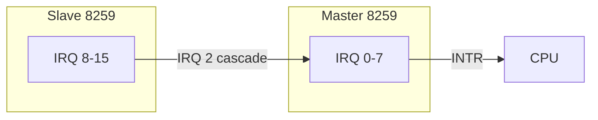
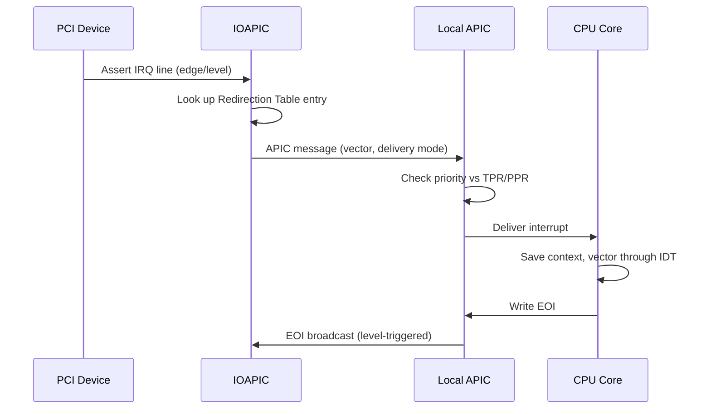
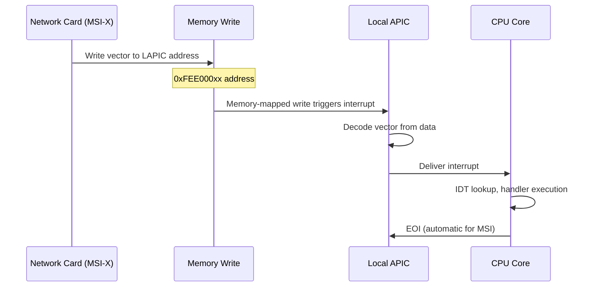
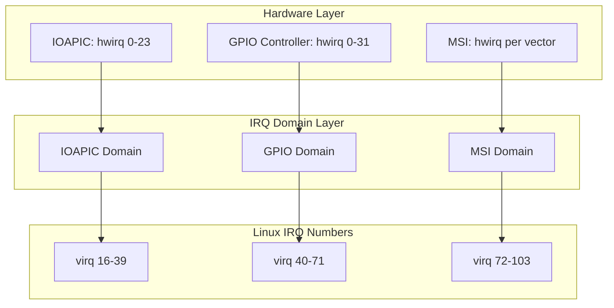
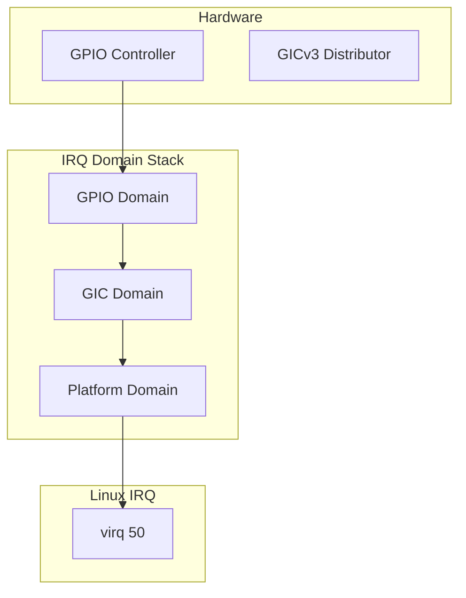
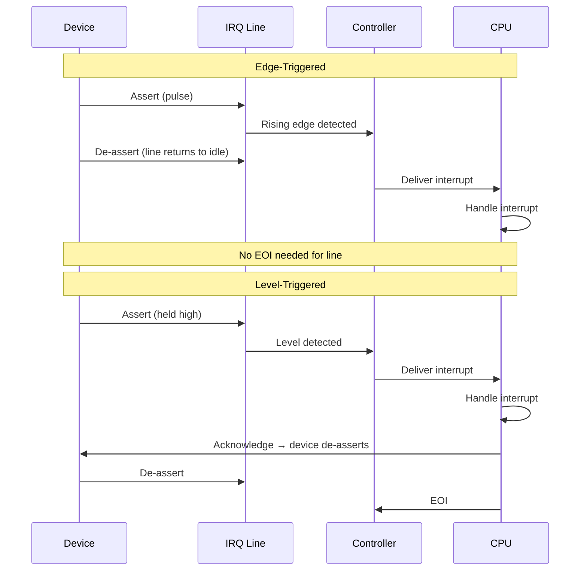
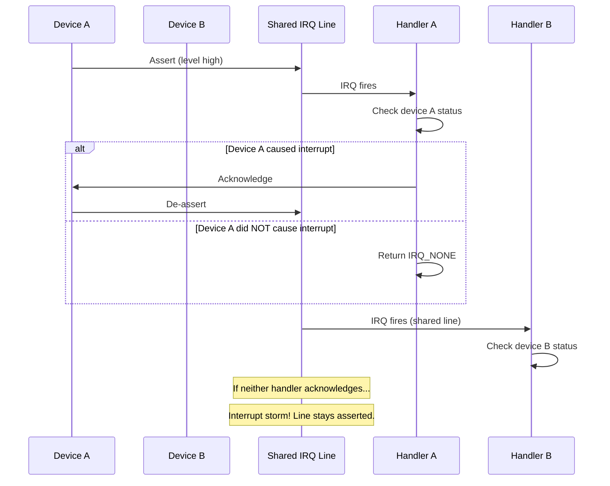
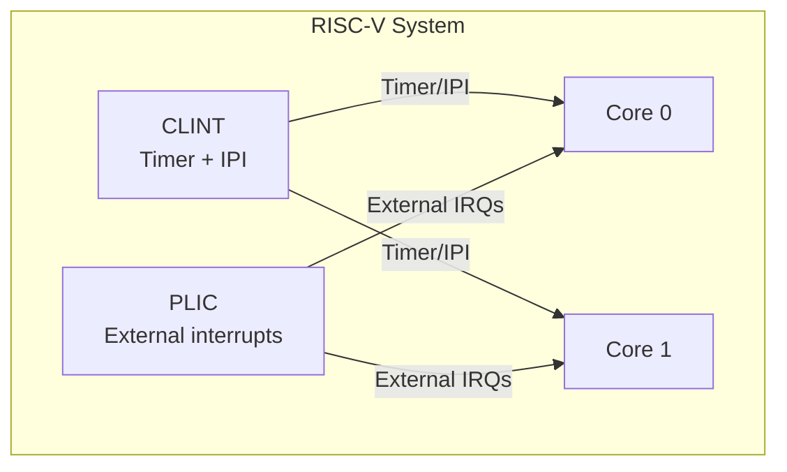

# Hardware Interrupts

## Introduction

Hardware interrupts are electrical signals generated by peripheral devices to request CPU attention. The mechanisms for delivering these signals — from the ancient 8259 PIC to the modern APIC architecture and PCI Message Signaled Interrupts — represent one of the most important evolution paths in PC architecture. This chapter covers the interrupt controller hardware, the Linux kernel's IRQ domain abstraction, and the modern MSI/MSI-X interrupt delivery mechanism.

## The 8259 PIC (Legacy)

The Intel 8259 Programmable Interrupt Controller was the original interrupt controller in the IBM PC. It manages 8 interrupt lines and can be cascaded (two chips) to support 15 usable IRQ lines (IRQ 2 is consumed by the cascade connection).



**How it works:**

1. A device asserts a voltage on one of the IRQ lines.
2. The 8259 sets the corresponding bit in its **Interrupt Request Register (IRR)**.
3. The 8259 checks if the interrupt priority is higher than the current **In-Service Register (ISR)** level.
4. If so, it asserts the INTR line to the CPU.
5. The CPU responds with `INTA` (Interrupt Acknowledge) pulses.
6. The 8259 places the **interrupt vector number** on the data bus.
7. The CPU reads the vector and dispatches through the IDT.

**Limitations:**

- Only 15 usable IRQ lines — far too few for modern systems
- Fixed priority scheme (lower IRQ = higher priority)
- No support for multi-processor interrupt delivery
- Level-triggered and edge-triggered mixing is problematic
- No per-CPU interrupt masking (only global enable/disable via `CLI`)

In modern Linux kernels, the 8259 is typically emulated by the IOAPIC or handled through ACPI firmware for backward compatibility.

### 8259 Programming Interface

The 8259 is programmed through two I/O ports:

```c
/* Master 8259 */
#define PIC1_CMD    0x20    /* Command port */
#define PIC1_DATA   0x21    /* Data port */

/* Slave 8259 */
#define PIC2_CMD    0xA0    /* Command port */
#define PIC2_DATA   0xA1    /* Data port */

/* Initialization Command Words (ICW) sequence: */
/* ICW1: Initialization */
outb(0x11, PIC1_CMD);  /* ICW4 needed, cascade mode, edge triggered */

/* ICW2: Vector offset */
outb(0x20, PIC1_DATA); /* Master vectors start at 0x20 (32) */

/* ICW3: Cascade identity */
outb(0x04, PIC1_DATA); /* Slave on IRQ 2 */

/* ICW4: Mode */
outb(0x01, PIC1_DATA); /* 8086 mode, non-buffered, normal EOI */

/* Masking: disable all except keyboard */
outb(0xFD, PIC1_DATA); /* IRQ 1 enabled */
```

**End of Interrupt (EOI):**

```c
/* Send EOI to master */
outb(0x20, PIC1_CMD);

/* If interrupt came from slave, also send to slave */
outb(0x20, PIC2_CMD);
```

The Linux kernel disables the 8259 early in boot when it switches to APIC mode:

```c
/* arch/x86/kernel/i8259.c */
void __init make_8259A_irq(unsigned int irq)
{
    /* ... setup 8259A for legacy interrupt ... */
}

static void mask_and_ack_8259A(struct irq_data *data)
{
    /* Mask the IRQ and send EOI */
}
```

## The APIC Architecture

The Advanced Programmable Interrupt Controller (APIC) replaced the 8259 and is the standard interrupt delivery mechanism on x86 systems since the mid-1990s. It consists of two components:

### Local APIC (LAPIC)

Each CPU core has a built-in **Local APIC**. It is responsible for:

- Receiving interrupts from the IOAPIC (inter-processor interrupts, timers, error signals)
- Accepting inter-processor interrupts (IPIs) from other CPUs' LAPICs
- Managing the CPU's interrupt priority level
- Sending End-of-Interrupt (EOI) acknowledgments

The LAPIC is memory-mapped to a configurable base address (default `0xFEE00000` on x86). Key registers include:

| Register | Offset | Description |
|----------|--------|-------------|
| ID | 0x020 | LAPIC identifier |
| TPR | 0x080 | Task Priority Register (filters interrupts) |
| APR | 0x090 | Arbitration Priority Register |
| PPR | 0x0A0 | Processor Priority Register |
| EOI | 0x0B0 | End of Interrupt register (write to acknowledge) |
| SVR | 0x0F0 | Spurious Interrupt Vector Register |
| ICR | 0x300 | Interrupt Command Register (for IPIs) |
| LVT Timer | 0x320 | Local Vector Table — Timer |
| LVT LINT0 | 0x350 | Local Vector Table — Local Interrupt 0 |
| LVT LINT1 | 0x360 | Local Vector Table — Local Interrupt 1 |
| LVT Error | 0x370 | Local Vector Table — Error |
| ICR high | 0x310 | Interrupt Command Register — high 32 bits |

```bash
# Read LAPIC base from the MSR
$ sudo rdmsr 0x1B
fee000900
```

### LAPIC Timer

The LAPIC includes a built-in per-CPU timer, which is the source of the kernel's timer tick:

```c
/* LAPIC timer modes */
#define APIC_LVT_TIMER_PERIODIC   0x00020000  /* Periodic mode */
#define APIC_LVT_TIMER_TSCDEADLINE 0x00040000  /* TSC-deadline mode */

/* The kernel calibrates the LAPIC timer against the TSC */
/* View LAPIC timer frequency */
$ dmesg | grep -i "calibrating"
[    0.000000] Calibrating delay loop (skipped), value calculated using timer frequency.. 4800.00 BogoMIPS (lpj=2400000)

# Check which timer mode is in use
$ dmesg | grep -i "tsc-deadline"
[    0.000000] TSC deadline timer enabled
```

### IOAPIC (I/O APIC)

The **IOAPIC** sits on the I/O bus (typically PCI) and routes hardware interrupt signals to the LAPIC of a target CPU. Each IOAPIC typically has **24 input lines** (called "pins"), and systems can have multiple IOAPICs.

The IOAPIC contains a **Redirection Table** (IRT) with one entry per pin. Each entry specifies:

- **Vector**: The interrupt vector number delivered to the CPU
- **Delivery Mode**: Fixed, lowest priority, SMI, NMI, INIT, ExtINT
- **Destination Mode**: Physical (specific APIC ID) or Logical (CPU set)
- **Polarity**: Active high or active low
- **Trigger Mode**: Edge-triggered or level-triggered
- **Destination**: Target CPU(s) by APIC ID or logical cluster

```bash
# View IOAPIC configuration
$ cat /proc/ioapic
# Or via ACPI MADT table
$ sudo acpidump -t | grep -A 5 IOAPIC

# Detailed IOAPIC register dump
$ sudo cat /sys/kernel/debug/irq/irqs/16
handler:  handle_fasteoi_irq
status:  0x00000040 (IRQD_IRQ_STARTED)
depth:   0
irq_count: 892341
chip:    ioapic
domain:  IO-APIC
```

### IOAPIC Redirection Table Entries

Each Redirection Table Entry (RTE) is 64 bits wide:

```c
struct ioapic_rte {
    union {
        struct {
            u32 vector       : 8;   /* Vector 0x10-0xFE */
            u32 delivery     : 3;   /* 0=fixed, 1=lowest, 2=SMI, 4=NMI, 5=INIT */
            u32 dest_mode    : 1;   /* 0=physical, 1=logical */
            u32 delivery_stat: 1;   /* Read-only: delivery status */
            u32 polarity     : 1;   /* 0=high, 1=low */
            u32 irr          : 1;   /* Read-only: remote IRR */
            u32 trigger      : 1;   /* 0=edge, 1=level */
            u32 mask         : 1;   /* 0=enabled, 1=masked */
            u32 reserved     : 15;
        };
        u32 low;
        u32 high;    /* Destination field (APIC ID or logical cluster) */
    };
};
```

### Interrupt Delivery Flow (APIC)



### APIC Priority Mechanism

The LAPIC uses a priority scheme to determine whether an interrupt should be delivered:

```c
/* Priority comparison */
/* Interrupt priority = vector / 16 */
/* Current priority = PPR (Processor Priority Register) */
/* Interrupt is delivered only if its priority > PPR */

/* TPR (Task Priority Register) can be used to block low-priority interrupts */
/* Setting TPR = 0x20 blocks vectors 0x20-0x2F */
```

The Linux kernel uses TPR sparingly — it's primarily relevant for virtualization (where the hypervisor manages guest interrupt priorities).

### Inter-Processor Interrupts (IPIs)

IPIs are interrupts sent from one CPU to another (or to all CPUs) via the LAPIC's Interrupt Command Register (ICR):

```c
/* ICR fields for sending IPIs */
#define APIC_ICR_DM_FIXED    0x00000000  /* Fixed delivery mode */
#define APIC_ICR_DM_LOWEST   0x00000100  /* Lowest priority */
#define APIC_ICR_DM_SMI      0x00000200  /* SMI */
#define APIC_ICR_DM_NMI      0x00000400  /* NMI */
#define APIC_ICR_DM_INIT     0x00000500  /* INIT */
#define APIC_ICR_DM_SIPI     0x00000600  /* Start-up IPI */
#define APIC_ICR_DEST_SELF   0x00040000  /* Send to self */
#define APIC_ICR_DEST_ALL    0x00080000  /* Send to all */
#define APIC_ICR_DEST_NOTSELF 0x000C0000 /* Send to all except self */
```

**Common IPI types in Linux:**

| IPI Vector | Purpose | Triggered By |
|------------|---------|--------------|
| `RESCHEDULE_VECTOR` | Force reschedule | `smp_send_reschedule()` |
| `CALL_FUNCTION_VECTOR` | Execute function on remote CPU | `smp_call_function()` |
| `CALL_FUNCTION_SINGLE_VECTOR` | Execute on specific CPU | `smp_call_function_single()` |
| `REBOOT_VECTOR` | Force reboot | `smp_send_stop()` |
| `IRQ_WORK_VECTOR` | Process irq_work items | `irq_work_queue()` |
| `X86_PLATFORM_IPI_VECTOR` | Platform-specific (e.g., thermal) | Various |
| `UINTR_VECTOR` | User interrupts | `uintr` subsystem |

```bash
# View IPI statistics in /proc/interrupts
$ grep -E 'RES|CAL|TLB|TRM' /proc/interrupts
RES:   1234  2345  3456  4567   Rescheduling interrupts
CAL:   5678  6789  7890  8901   Function call interrupts
TLB:   1234  2345  3456  4567   TLB shootdowns
```

## MSI and MSI-X

**Message Signaled Interrupts (MSI)** were introduced with PCI 2.2 and represent a fundamental departure from the pin-based interrupt model. Instead of asserting a physical IRQ line, the device writes a special message to a memory-mapped address — the LAPIC's interrupt command register.

### MSI

- Supports **1, 2, 4, 8, 16, or 32** interrupt vectors per device
- Each vector is a separate interrupt with its own handler
- The message address encodes the destination CPU APIC ID
- The message data encodes the vector number and delivery mode

**Advantages over pin-based interrupts:**

- No shared IRQ lines — eliminates the "interrupt storm" problem
- No need for IRQ routing through IOAPIC — lower latency
- Each MSI vector can target a specific CPU — enables perfect multi-queue scaling
- No lost interrupts (race-free acknowledgment via the write transaction)

### MSI-X

**MSI-X** (PCI 3.0) extends MSI with:

- Up to **2048 vectors** per device (vs MSI's 32 maximum)
- Each vector can be independently routed to a different CPU
- Table entries can be in either BAR-mapped memory or I/O space
- More flexible — each vector has its own message address and data

A typical high-performance NVMe drive or network card uses MSI-X with one vector per hardware queue, pinned to the CPU that processes that queue:

```bash
$ cat /proc/interrupts | grep nvme
120:  452108  0  0  0  PCI-MSI  524289-edge  nvme0q1
121:  0  387654  0  0  PCI-MSI  524290-edge  nvme0q2
122:  0  0  298123  0  PCI-MSI  524291-edge  nvme0q3
123:  0  0  0  401567  PCI-MSI  524292-edge  nvme0q4
```

Each NVMe queue pair is handled by a dedicated MSI-X vector on the CPU closest to the NUMA node of the queue.

### MSI-X Configuration Space

Each MSI-X table entry consists of 12 bytes:

```
Offset 0x00: Message Address (32 bits)
Offset 0x04: Message Upper Address (32 bits, for 64-bit addressing)
Offset 0x08: Message Data (32 bits)
Offset 0x0A: Vector Control (32 bits, bit 0 = mask bit)
```

```bash
# Inspect MSI-X capability of a device
$ sudo lspci -vvv -s 00:04.0
Capabilities: [b0] MSI-X: Enable+ Count=32 Masked-
        Vector table: BAR=0 offset=00000000
        PBA: BAR=0 offset=00001000
```

### MSI Capability Structure (PCI Config Space)

The MSI capability structure in PCI configuration space:

```c
/* MSI Capability Structure */
struct msi_cap {
    u8  cap_id;         /* 0x05 = MSI */
    u8  next;           /* Next capability pointer */
    u16 msg_control;    /* Message control */
    /* Bits 0-2: Multiple Message Enable (log2 vectors) */
    /* Bit 7: 64-bit address capable */
    u32 msg_addr_lo;    /* Message address low 32 bits */
    u32 msg_addr_hi;    /* Message address high 32 bits (if 64-bit) */
    u16 msg_data;       /* Message data */
    /* ... */
};

/* MSI-X Capability Structure */
struct msix_cap {
    u8  cap_id;         /* 0x11 = MSI-X */
    u8  next;           /* Next capability pointer */
    u16 msg_control;    /* Message control */
    /* Bits 0-10: Table size (N-1, where N = number of vectors) */
    /* Bit 14: Function mask */
    u32 table_offset;   /* BAR and offset for vector table */
    u32 pba_offset;     /* BAR and offset for pending bit array */
};
```

### MSI Interrupt Flow



**Key advantage**: MSI delivery is a simple memory write — no acknowledgment protocol, no shared lines, no race conditions.

### Kernel MSI Allocation

```c
/* Allocate MSI-X vectors */
int pci_alloc_irq_vectors(struct pci_dev *dev,
                          unsigned int min_vectors,
                          unsigned int max_vectors,
                          unsigned int flags);

/* Example: allocate 4 MSI-X vectors for a NIC */
ret = pci_alloc_irq_vectors(pdev, 4, 4, PCI_IRQ_MSIX);
if (ret < 0)
    return ret;

/* Get IRQ number for vector 0 */
irq = pci_irq_vector(pdev, 0);

/* Request IRQ for each vector */
for (i = 0; i < num_queues; i++) {
    irq = pci_irq_vector(pdev, i);
    request_irq(irq, my_handler, 0, "nic", &queues[i]);
}
```

## IRQ Domains

The **IRQ domain** abstraction (introduced in Linux 3.3) provides a clean mapping between hardware interrupt numbers and Linux virtual IRQ numbers (`virq`). This is essential because:

1. Different interrupt controllers (IOAPIC, GIC on ARM, GPIO controllers) use different numbering schemes.
2. A system may have multiple interrupt controllers.
3. Hardware numbers can collide across controllers.

### IRQ Domain Architecture



### Key Data Structures

```c
/* Representation of an IRQ domain */
struct irq_domain {
    struct list_head link;
    const char *name;
    const struct irq_domain_ops *ops;
    void *host_data;
    unsigned int flags;
    unsigned int mapcount;
    struct fwnode_handle *fwnode;
    enum irq_domain_bus_token bus_token;
    struct irq_domain_chip_generic *gc;
    /* Radix tree mapping hwirq -> irq_desc */
    struct radix_tree_root revmap_tree;
    unsigned int revmap_size;
    struct irq_desc **revmap;
};

/* Maps a hardware IRQ to a Linux IRQ */
unsigned int irq_create_mapping(struct irq_domain *domain,
                                irq_hw_number_t hwirq);
```

### IRQ Domain Operations

Each interrupt controller provides an `irq_domain_ops` structure:

```c
struct irq_domain_ops {
    int (*map)(struct irq_domain *d, unsigned int virq,
               irq_hw_number_t hw);       /* Map hwirq to virq */
    void (*unmap)(struct irq_domain *d, unsigned int virq);
    int (*xlate)(struct irq_domain *d, struct device_node *node,
                 const u32 *intspec, unsigned int intsize,
                 unsigned long *out_hwirq,
                 unsigned int *out_type);  /* DT/ACPI translation */
    /* ... */
};
```

### Domain Types

| Type | Description | Used By |
|------|-------------|---------|
| `irq_domain_linear` | Array-based lookup, O(1) | IOAPIC, GIC |
| `irq_domain_tree` | Radix tree, sparse | GPIO controllers |
| `irq_domain_nomap` | No virq mapping, direct hwirq | Some legacy controllers |
| `irq_domain_hierarchy` | Stacked domains (chained controllers) | Modern complex topologies |

### Stacked IRQ Domains

Modern systems often have hierarchical interrupt controllers. The kernel models this with **stacked domains**:



```c
/* Stacked domain allocation */
struct irq_domain *gpio_domain = irq_domain_create_hierarchy(
    parent_domain,      /* GIC domain */
    IRQ_DOMAIN_FLAG_HIERARCHY,
    nr_irqs,
    ops,
    host_data);
```

## Trigger Modes: Edge vs Level

Hardware interrupts use two electrical signaling modes:

### Edge-Triggered

The interrupt is signaled by a **transition** (low-to-high or high-to-low). The controller latches the edge and the line can return to its idle state. The CPU must detect the transition even if it's brief.

- Used by: legacy ISA interrupts, MSI/MSI-X (always edge)
- Advantage: no need for explicit acknowledgment of the line state
- Disadvantage: can miss interrupts if the CPU is not ready

### Level-Triggered

The interrupt is signaled by a **voltage level** (high or low). The line remains asserted until the device is explicitly told to de-assert it.

- Used by: most PCI interrupts (legacy INTx), IOAPIC pins
- Advantage: cannot miss interrupts — the line stays asserted
- Disadvantage: requires explicit EOI and device de-assert; shared lines cause "interrupt storms" if a handler fails to acknowledge

In the IOAPIC redirection table, the trigger mode is encoded per entry:

```c
#define IRQ_TYPE_NONE           0x00000000
#define IRQ_TYPE_EDGE_RISING    0x00000001
#define IRQ_TYPE_EDGE_FALLING   0x00000002
#define IRQ_TYPE_EDGE_BOTH      (IRQ_TYPE_EDGE_FALLING | IRQ_TYPE_EDGE_RISING)
#define IRQ_TYPE_LEVEL_HIGH     0x00000004
#define IRQ_TYPE_LEVEL_LOW      0x00000008
```

### Edge vs Level: Handling Differences



### Level-Triggered Shared IRQ Problem



## Interrupt Controllers Beyond x86

### ARM GIC (Generic Interrupt Controller)

ARM systems use the GIC architecture (GICv2, GICv3, GICv4):

- **Distributor (GICD)**: Routes interrupts to CPU interfaces
- **Redistributor (GICR)**: Per-PE (Processing Element) component in GICv3+
- **CPU Interface (GICC)**: Per-CPU interrupt acknowledgment and priority management
- **ITS (Interrupt Translation Service)**: MSI-like support for GICv3+

GICv3 supports:
- Up to 1020 SPIs (Shared Peripheral Interrupts)
- 32 SGIs (Software Generated Interrupts) for IPI
- 16 PPIs (Private Peripheral Interrupts) per CPU
- Direct injection of virtual interrupts for VMs (GICv4)

```c
/* GIC interrupt types */
#define GIC_SGI    0   /* Software Generated Interrupt (IPI) */
#define GIC_PPI    1   /* Private Peripheral Interrupt (per-CPU timer, etc.) */
#define GIC_SPI    2   /* Shared Peripheral Interrupt (device interrupts) */
#define GIC_ESPI   3   /* Extended SPI (GICv4, up to 960 more) */
```

### GICv3 Architecture

```mermaid
graph TD
    subgraph "CPU 0"
        RD0[Redistributor 0]
        ICC0[CPU Interface 0]
    end
    subgraph "CPU 1"
        RD1[Redistributor 1]
        ICC1[CPU Interface 1]
    end
    subgraph "Distributor"
        GICD[GICD]
    end
    subgraph "ITS"
        ITS[ITS - MSI translation]
    end
    GICD --> RD0
    GICD --> RD1
    RD0 --> ICC0
    RD1 --> ICC1
    ITS --> GICD
```

### GICv3 System Register Interface

GICv3 uses system registers (not memory-mapped) for the CPU interface:

```c
/* Reading ICC (Interrupt Controller CPU interface) registers */
static inline u64 gic_read_iar(void)
{
    u64 irq;
    asm volatile("mrs %0, ICC_IAR1_EL1" : "=r" (irq));
    return irq;
}

static inline void gic_write_eoir(u64 irq)
{
    asm volatile("msr ICC_EOIR1_EL1, %0" :: "r" (irq));
}
```

### RISC-V PLIC/PLIC

RISC-V uses the **Platform-Level Interrupt Controller** (PLIC) for external interrupts and the **Core-Local Interrupt Controller** (CLINT) for timer and IPI interrupts.

```c
/* RISC-V interrupt types */
#define RISCV_SMODE_SOFT_IRQ    1   /* Supervisor software interrupt */
#define RISCV_SMODE_TIMER_IRQ   5   /* Supervisor timer interrupt */
#define RISCV_SMODE_EXT_IRQ     9   /* Supervisor external interrupt */
```



## ACPI and Interrupt Routing

On x86, the ACPI firmware provides interrupt routing information through several tables:

- **MADT (Multiple APIC Description Table)**: Lists all interrupt controllers (LAPIC, IOAPIC, etc.)
- **DSDT/SSDT**: Device-specific interrupt routing via `_CRS` (Current Resource Settings) and `_PRS` (Possible Resource Settings) methods
- **IRQT/PCI Routing Table**: Maps PCI interrupt pins (INTA-INTD) to IOAPIC input pins

```bash
# Dump ACPI MADT table
$ sudo acpidump -b -t MADT | xxd | head -20

# Or use the decoded tables
$ sudo dmidecode | grep -i interrupt

# View ACPI interrupt source overrides
$ dmesg | grep -i "ACPI:.*IRQ"
[    0.000000] ACPI: INT_SRC_OVR (bus 0 bus_irq 9 global_irq 9 high level)
[    0.000000] ACPI: INT_SRC_OVR (bus 0 bus_irq 0 global_irq 2 high edge)
```

### ACPI Interrupt Source Override

The MADT table can contain **Interrupt Source Override** entries that remap ISA IRQs to different IOAPIC pins:

```c
struct acpi_madt_interrupt_override {
    struct acpi_subtable_header header;
    u8 bus;           /* 0 = ISA */
    u8 source_irq;    /* ISA IRQ number */
    u32 global_irq;   /* IOAPIC pin number */
    u16 flags;        /* MPS INTI flags */
};
```

**Common override**: ISA IRQ 0 (timer) is remapped to IOAPIC pin 2 on most systems:

```bash
$ dmesg | grep "ACPI.*timer"
[    0.000000] ACPI: INT_SRC_OVR (bus 0 bus_irq 0 global_irq 2 high edge)
```

## Kernel Internals: irq_chip and irq_domain

The Linux kernel models each interrupt controller as an `irq_chip`:

```c
struct irq_chip {
    struct device   *parent_device;
    const char      *name;
    void            (*irq_enable)(struct irq_data *data);
    void            (*irq_disable)(struct irq_data *data);
    void            (*irq_ack)(struct irq_data *data);
    void            (*irq_mask)(struct irq_data *data);
    void            (*irq_unmask)(struct irq_data *data);
    void            (*irq_eoi)(struct irq_data *data);
    int             (*irq_set_affinity)(struct irq_data *data,
                                        const struct cpumask *dest,
                                        bool force);
    int             (*irq_set_type)(struct irq_data *data,
                                    unsigned int flow_type);
    /* ... */
};
```

The `irq_data` structure ties it all together:

```c
struct irq_data {
    unsigned int        irq;        /* Linux IRQ number */
    unsigned long       hwirq;      /* Hardware IRQ number */
    struct irq_common_data *common;
    struct irq_chip     *chip;      /* Interrupt controller */
    struct irq_domain   *domain;    /* IRQ domain */
    void                *chip_data; /* Controller-private data */
};
```

### irq_chip Examples

```c
/* IOAPIC irq_chip */
static struct irq_chip ioapic_chip = {
    .name           = "IO-APIC",
    .irq_enable     = ioapic_enable,
    .irq_disable    = ioapic_disable,
    .irq_ack        = ioapic_ack_irq,
    .irq_mask       = ioapic_mask_irq,
    .irq_unmask     = ioapic_unmask_irq,
    .irq_eoi        = ioapic_eoi,
    .irq_set_affinity = ioapic_set_affinity,
    .irq_set_type   = ioapic_set_type,
};

/* MSI irq_chip */
static struct irq_chip msi_chip = {
    .name           = "PCI-MSI",
    .irq_enable     = unmask_msi_irq,
    .irq_disable    = mask_msi_irq,
    .irq_ack        = ack_apic_edge,
    .irq_mask       = mask_msi_irq,
    .irq_unmask     = unmask_msi_irq,
    .irq_set_affinity = msi_set_affinity,
};
```

## Practical Example: Tracing IRQ Routing

```bash
# Show all IRQ chip information
$ sudo cat /proc/irq/*/chip_name 2>/dev/null
IO-APIC
IO-APIC
PCI-MSI
PCI-MSI

# Detailed IRQ info via debugfs
$ sudo ls /sys/kernel/debug/irq/irqs/
0  1  8  9  16  23  120  121  122  123 ...

$ sudo cat /sys/kernel/debug/irq/irqs/120
handler:  handle_edge_irq
status:  0x00000040 (IRQD_IRQ_STARTED)
depth:   0
irq_count: 452108
chip:    pci-msi
domain:  PCI-MSI
```

### Viewing IRQ Domain Hierarchy

```bash
# List all IRQ domains
$ sudo cat /sys/kernel/debug/irq_domain/domains
Domain  Name                 Parent
------  ----                 ------
0       IO-APIC              (root)
1       IO-APIC-2            IO-APIC
2       PCI-MSI              (root)
3       GPIO-0               (root)

# View domain mappings
$ sudo cat /sys/kernel/debug/irq_domain/mappings
hwirq    virq   chip          domain
------   ----   ----          ------
0        0      timer         IO-APIC
1        1      i8042         IO-APIC
16       16     ehci_hcd      IO-APIC
524289   120    nvme          PCI-MSI
```

## Interrupt Storm Detection and Handling

An **interrupt storm** occurs when an interrupt fires repeatedly without being properly handled, consuming all CPU time:

```bash
# Symptoms: 100% CPU usage in top, system unresponsive
# /proc/interrupts shows rapidly incrementing counter for one IRQ

# Monitor interrupt rate
$ watch -n1 'cat /proc/interrupts | grep -E "^[0-9]+:" | awk "{print \$1, \$2}"'

# Disable a problematic IRQ
$ echo 1 > /proc/irq/16/spurious_count  # Not real API
# Real approach: unbind the driver
$ echo 0 > /proc/irq/16/smp_affinity

# Kernel spurious interrupt handling
$ dmesg | grep -i spurious
[  123.456789] spurious 8259A interrupt: IRQ7.
```

### Kernel Spurious IRQ Detection

The kernel tracks unhandled interrupts and automatically disables IRQs that appear spurious:

```c
/* kernel/irq/spurious.c */
#define MAX_INTERRUPTS  100000

static void note_interrupt(struct irq_desc *desc, irqreturn_t retval)
{
    if (retval == IRQ_WAKE_THREAD) {
        /* Threaded handler — handled */
        desc->threads_handled++;
        return;
    }

    if (retval == IRQ_NONE) {
        desc->irqs_unhandled++;
        /* If too many unhandled, mark as spurious */
        if (desc->irqs_unhandled > 99900 &&
            time_after(jiffies, desc->last_unhandled + HZ/10)) {
            /* Disable the IRQ */
            desc->irq_count++;
            if (desc->irq_count > 10)
                __report_bad_irq(desc);
        }
    }
}
```

## References

- [The Linux Kernel Documentation](https://docs.kernel.org/)
- [LWN.net - Linux and free software news](https://lwn.net/)
- [GNU Project Documentation](https://www.gnu.org/doc/doc.html)
- [GNU Manuals](https://www.gnu.org/manual/manual.html)
- [Free Software Directory](https://directory.fsf.org/wiki/Main_Page)
- [Planet GNU](https://planet.gnu.org/)
- [Free Software Books](https://www.gnu.org/doc/other-free-books.html)

- [Intel 64 and IA-32 Architectures SDM, Vol 3A, Chapter 10: APIC](https://www.intel.com/content/www/us/en/developer/articles/technical/intel-sdm.html)
- [Linux kernel: IRQ domain documentation](https://www.kernel.org/doc/html/latest/core-api/irq/irq-domain.html)
- [PCI Local Bus Specification, Chapter 6: MSI](https://pcisig.com/specifications)
- [ARM GIC Architecture Specification (GICv3/v4)](https://developer.arm.com/documentation/ihi0069/latest)
- [RISC-V PLIC Specification](https://github.com/riscv/riscv-plic-spec)
- [ACPI Specification, Chapter 5: ACPI Namespace](https://uefi.org/specifications)
- [LWN: IRQ domain explained](https://lwn.net/Articles/493126/)

## Related Topics

- [Interrupts Overview](overview.md) — Hardware vs software interrupts, IRQ numbering
- [Interrupt Handlers](handlers.md) — Registering handlers, request_irq, threaded interrupts
- [Softirqs](softirqs.md) — Bottom-half deferred processing
- [Spinlocks](../sync/spinlocks.md) — Locking in interrupt context
- [Lockdep](../sync/lockdep.md) — Validating interrupt-safety of locks
