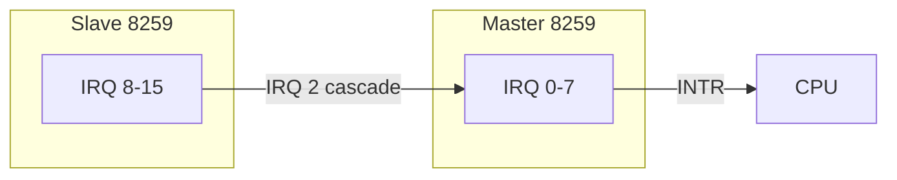
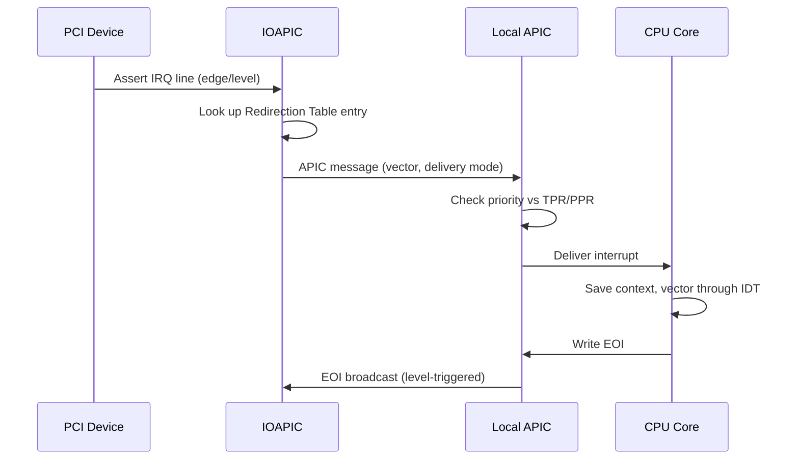
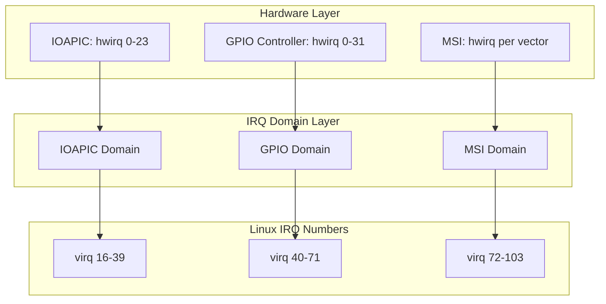

# Hardware Interrupts

## Introduction

Hardware interrupts are electrical signals generated by peripheral devices to request CPU attention. The mechanisms for delivering these signals — from the ancient 8259 PIC to the modern APIC architecture and PCI Message Signaled Interrupts — represent one of the most important evolution paths in PC architecture. This chapter covers the interrupt controller hardware, the Linux kernel's IRQ domain abstraction, and the modern MSI/MSI-X interrupt delivery mechanism.

## The 8259 PIC (Legacy)

The Intel 8259 Programmable Interrupt Controller was the original interrupt controller in the IBM PC. It manages 8 interrupt lines and can be cascaded (two chips) to support 15 usable IRQ lines (IRQ 2 is consumed by the cascade connection).



**How it works:**

1. A device asserts a voltage on one of the IRQ lines.
2. The 8259 sets the corresponding bit in its **Interrupt Request Register (IRR)**.
3. The 8259 checks if the interrupt priority is higher than the current **In-Service Register (ISR)** level.
4. If so, it asserts the INTR line to the CPU.
5. The CPU responds with `INTA` (Interrupt Acknowledge) pulses.
6. The 8259 places the **interrupt vector number** on the data bus.
7. The CPU reads the vector and dispatches through the IDT.

**Limitations:**

- Only 15 usable IRQ lines — far too few for modern systems
- Fixed priority scheme (lower IRQ = higher priority)
- No support for multi-processor interrupt delivery
- Level-triggered and edge-triggered mixing is problematic
- No per-CPU interrupt masking (only global enable/disable via `CLI`)

In modern Linux kernels, the 8259 is typically emulated by the IOAPIC or handled through ACPI firmware for backward compatibility.

## The APIC Architecture

The Advanced Programmable Interrupt Controller (APIC) replaced the 8259 and is the standard interrupt delivery mechanism on x86 systems since the mid-1990s. It consists of two components:

### Local APIC (LAPIC)

Each CPU core has a built-in **Local APIC**. It is responsible for:

- Receiving interrupts from the IOAPIC (inter-processor interrupts, timers, error signals)
- Accepting inter-processor interrupts (IPIs) from other CPUs' LAPICs
- Managing the CPU's interrupt priority level
- Sending End-of-Interrupt (EOI) acknowledgments

The LAPIC is memory-mapped to a configurable base address (default `0xFEE00000` on x86). Key registers include:

| Register | Offset | Description |
|----------|--------|-------------|
| ID | 0x020 | LAPIC identifier |
| TPR | 0x080 | Task Priority Register (filters interrupts) |
| APR | 0x090 | Arbitration Priority Register |
| PPR | 0x0A0 | Processor Priority Register |
| EOI | 0x0B0 | End of Interrupt register (write to acknowledge) |
| SVR | 0x0F0 | Spurious Interrupt Vector Register |
| ICR | 0x300 | Interrupt Command Register (for IPIs) |
| LVT Timer | 0x320 | Local Vector Table — Timer |
| LVT LINT0 | 0x350 | Local Vector Table — Local Interrupt 0 |
| LVT LINT1 | 0x360 | Local Vector Table — Local Interrupt 1 |
| LVT Error | 0x370 | Local Vector Table — Error |

```bash
# Read LAPIC base from the MSR
$ sudo rdmsr 0x1B
fee000900
```

### IOAPIC (I/O APIC)

The **IOAPIC** sits on the I/O bus (typically PCI) and routes hardware interrupt signals to the LAPIC of a target CPU. Each IOAPIC typically has **24 input lines** (called "pins"), and systems can have multiple IOAPICs.

The IOAPIC contains a **Redirection Table** (IRT) with one entry per pin. Each entry specifies:

- **Vector**: The interrupt vector number delivered to the CPU
- **Delivery Mode**: Fixed, lowest priority, SMI, NMI, INIT, ExtINT
- **Destination Mode**: Physical (specific APIC ID) or Logical (CPU set)
- **Polarity**: Active high or active low
- **Trigger Mode**: Edge-triggered or level-triggered
- **Destination**: Target CPU(s) by APIC ID or logical cluster

```bash
# View IOAPIC configuration
$ cat /proc/ioapic
# Or via ACPI MADT table
$ sudo acpidump -t | grep -A 5 IOAPIC
```

### Interrupt Delivery Flow (APIC)



## MSI and MSI-X

**Message Signaled Interrupts (MSI)** were introduced with PCI 2.2 and represent a fundamental departure from the pin-based interrupt model. Instead of asserting a physical IRQ line, the device writes a special message to a memory-mapped address — the LAPIC's interrupt command register.

### MSI

- Supports **1, 2, 4, 8, 16, or 32** interrupt vectors per device
- Each vector is a separate interrupt with its own handler
- The message address encodes the destination CPU APIC ID
- The message data encodes the vector number and delivery mode

**Advantages over pin-based interrupts:**

- No shared IRQ lines — eliminates the "interrupt storm" problem
- No need for IRQ routing through IOAPIC — lower latency
- Each MSI vector can target a specific CPU — enables perfect multi-queue scaling
- No lost interrupts (race-free acknowledgment via the write transaction)

### MSI-X

**MSI-X** (PCI 3.0) extends MSI with:

- Up to **2048 vectors** per device (vs MSI's 32 maximum)
- Each vector can be independently routed to a different CPU
- Table entries can be in either BAR-mapped memory or I/O space
- More flexible — each vector has its own message address and data

A typical high-performance NVMe drive or network card uses MSI-X with one vector per hardware queue, pinned to the CPU that processes that queue:

```bash
$ cat /proc/interrupts | grep nvme
120:  452108  0  0  0  PCI-MSI  524289-edge  nvme0q1
121:  0  387654  0  0  PCI-MSI  524290-edge  nvme0q2
122:  0  0  298123  0  PCI-MSI  524291-edge  nvme0q3
123:  0  0  0  401567  PCI-MSI  524292-edge  nvme0q4
```

Each NVMe queue pair is handled by a dedicated MSI-X vector on the CPU closest to the NUMA node of the queue.

### MSI-X Configuration Space

Each MSI-X table entry consists of 12 bytes:

```
Offset 0x00: Message Address (32 bits)
Offset 0x04: Message Upper Address (32 bits, for 64-bit addressing)
Offset 0x08: Message Data (32 bits)
Offset 0x0A: Vector Control (32 bits, bit 0 = mask bit)
```

```bash
# Inspect MSI-X capability of a device
$ sudo lspci -vvv -s 00:04.0
Capabilities: [b0] MSI-X: Enable+ Count=32 Masked-
        Vector table: BAR=0 offset=00000000
        PBA: BAR=0 offset=00001000
```

## IRQ Domains

The **IRQ domain** abstraction (introduced in Linux 3.3) provides a clean mapping between hardware interrupt numbers and Linux virtual IRQ numbers (`virq`). This is essential because:

1. Different interrupt controllers (IOAPIC, GIC on ARM, GPIO controllers) use different numbering schemes.
2. A system may have multiple interrupt controllers.
3. Hardware numbers can collide across controllers.

### IRQ Domain Architecture



### Key Data Structures

```c
/* Representation of an IRQ domain */
struct irq_domain {
    struct list_head link;
    const char *name;
    const struct irq_domain_ops *ops;
    void *host_data;
    unsigned int flags;
    unsigned int mapcount;
    struct fwnode_handle *fwnode;
    enum irq_domain_bus_token bus_token;
    struct irq_domain_chip_generic *gc;
    /* Radix tree mapping hwirq -> irq_desc */
    struct radix_tree_root revmap_tree;
    unsigned int revmap_size;
    struct irq_desc **revmap;
};

/* Maps a hardware IRQ to a Linux IRQ */
unsigned int irq_create_mapping(struct irq_domain *domain,
                                irq_hw_number_t hwirq);
```

### IRQ Domain Operations

Each interrupt controller provides an `irq_domain_ops` structure:

```c
struct irq_domain_ops {
    int (*map)(struct irq_domain *d, unsigned int virq,
               irq_hw_number_t hw);       /* Map hwirq to virq */
    void (*unmap)(struct irq_domain *d, unsigned int virq);
    int (*xlate)(struct irq_domain *d, struct device_node *node,
                 const u32 *intspec, unsigned int intsize,
                 unsigned long *out_hwirq,
                 unsigned int *out_type);  /* DT/ACPI translation */
    /* ... */
};
```

## Trigger Modes: Edge vs Level

Hardware interrupts use two electrical signaling modes:

### Edge-Triggered

The interrupt is signaled by a **transition** (low-to-high or high-to-low). The controller latches the edge and the line can return to its idle state. The CPU must detect the transition even if it's brief.

- Used by: legacy ISA interrupts, MSI/MSI-X (always edge)
- Advantage: no need for explicit acknowledgment of the line state
- Disadvantage: can miss interrupts if the CPU is not ready

### Level-Triggered

The interrupt is signaled by a **voltage level** (high or low). The line remains asserted until the device is explicitly told to de-assert it.

- Used by: most PCI interrupts (legacy INTx), IOAPIC pins
- Advantage: cannot miss interrupts — the line stays asserted
- Disadvantage: requires explicit EOI and device de-assert; shared lines cause "interrupt storms" if a handler fails to acknowledge

In the IOAPIC redirection table, the trigger mode is encoded per entry:

```c
#define IRQ_TYPE_NONE           0x00000000
#define IRQ_TYPE_EDGE_RISING    0x00000001
#define IRQ_TYPE_EDGE_FALLING   0x00000002
#define IRQ_TYPE_EDGE_BOTH      (IRQ_TYPE_EDGE_FALLING | IRQ_TYPE_EDGE_RISING)
#define IRQ_TYPE_LEVEL_HIGH     0x00000004
#define IRQ_TYPE_LEVEL_LOW      0x00000008
```

## Interrupt Controllers Beyond x86

### ARM GIC (Generic Interrupt Controller)

ARM systems use the GIC architecture (GICv2, GICv3, GICv4):

- **Distributor (GICD)**: Routes interrupts to CPU interfaces
- **Redistributor (GICR)**: Per-PE (Processing Element) component in GICv3+
- **CPU Interface (GICC)**: Per-CPU interrupt acknowledgment and priority management

GICv3 supports:
- Up to 1020 SPIs (Shared Peripheral Interrupts)
- 32 SGIs (Software Generated Interrupts) for IPI
- 16 PPIs (Private Peripheral Interrupts) per CPU
- Direct injection of virtual interrupts for VMs (GICv4)

### RISC-V PLIC/PLIC

RISC-V uses the **Platform-Level Interrupt Controller** (PLIC) for external interrupts and the **Core-Local Interrupt Controller** (CLINT) for timer and IPI interrupts.

## ACPI and Interrupt Routing

On x86, the ACPI firmware provides interrupt routing information through several tables:

- **MADT (Multiple APIC Description Table)**: Lists all interrupt controllers (LAPIC, IOAPIC, etc.)
- **DSDT/SSDT**: Device-specific interrupt routing via `_CRS` (Current Resource Settings) and `_PRS` (Possible Resource Settings) methods
- **IRQT/PCI Routing Table**: Maps PCI interrupt pins (INTA-INTD) to IOAPIC input pins

```bash
# Dump ACPI MADT table
$ sudo acpidump -b -t MADT | xxd | head -20

# Or use the decoded tables
$ sudo dmidecode | grep -i interrupt
```

## Kernel Internals: irq_chip and irq_domain

The Linux kernel models each interrupt controller as an `irq_chip`:

```c
struct irq_chip {
    struct device   *parent_device;
    const char      *name;
    void            (*irq_enable)(struct irq_data *data);
    void            (*irq_disable)(struct irq_data *data);
    void            (*irq_ack)(struct irq_data *data);
    void            (*irq_mask)(struct irq_data *data);
    void            (*irq_unmask)(struct irq_data *data);
    void            (*irq_eoi)(struct irq_data *data);
    int             (*irq_set_affinity)(struct irq_data *data,
                                        const struct cpumask *dest,
                                        bool force);
    int             (*irq_set_type)(struct irq_data *data,
                                    unsigned int flow_type);
    /* ... */
};
```

The `irq_data` structure ties it all together:

```c
struct irq_data {
    unsigned int        irq;        /* Linux IRQ number */
    unsigned long       hwirq;      /* Hardware IRQ number */
    struct irq_common_data *common;
    struct irq_chip     *chip;      /* Interrupt controller */
    struct irq_domain   *domain;    /* IRQ domain */
    void                *chip_data; /* Controller-private data */
};
```

## Practical Example: Tracing IRQ Routing

```bash
# Show all IRQ chip information
$ sudo cat /proc/irq/*/chip_name 2>/dev/null
IO-APIC
IO-APIC
PCI-MSI
PCI-MSI

# Detailed IRQ info via debugfs
$ sudo ls /sys/kernel/debug/irq/irqs/
0  1  8  9  16  23  120  121  122  123 ...

$ sudo cat /sys/kernel/debug/irq/irqs/120
handler:  handle_edge_irq
status:  0x00000040 (IRQD_IRQ_STARTED)
depth:   0
irq_count: 452108
chip:    pci-msi
domain:  PCI-MSI
```

## References

- [The Linux Kernel Documentation](https://docs.kernel.org/)
- [LWN.net - Linux and free software news](https://lwn.net/)
- [GNU Project Documentation](https://www.gnu.org/doc/doc.html)
- [GNU Manuals](https://www.gnu.org/manual/manual.html)
- [Free Software Directory](https://directory.fsf.org/wiki/Main_Page)
- [Planet GNU](https://planet.gnu.org/)
- [Free Software Books](https://www.gnu.org/doc/other-free-books.html)

- [Intel 64 and IA-32 Architectures SDM, Vol 3A, Chapter 10: APIC](https://www.intel.com/content/www/us/en/developer/articles/technical/intel-sdm.html)
- [Linux kernel: IRQ domain documentation](https://www.kernel.org/doc/html/latest/core-api/irq/irq-domain.html)
- [PCI Local Bus Specification, Chapter 6: MSI](https://pcisig.com/specifications)
- [ARM GIC Architecture Specification (GICv3/v4)](https://developer.arm.com/documentation/ihi0069/latest)
- [RISC-V PLIC Specification](https://github.com/riscv/riscv-plic-spec)
- [ACPI Specification, Chapter 5: ACPI Namespace](https://uefi.org/specifications)

## Related Topics

- [Interrupts Overview](overview.md) — Hardware vs software interrupts, IRQ numbering
- [Interrupt Handlers](handlers.md) — Registering handlers, request_irq, threaded interrupts
- [Softirqs](softirqs.md) — Bottom-half deferred processing
- [Spinlocks](../sync/spinlocks.md) — Locking in interrupt context
- [Lockdep](../sync/lockdep.md) — Validating interrupt-safety of locks
