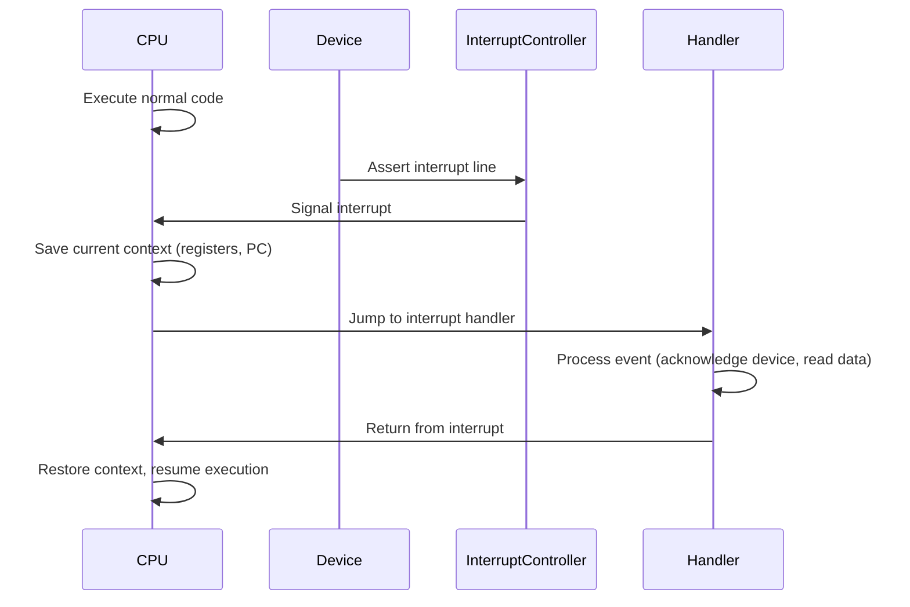
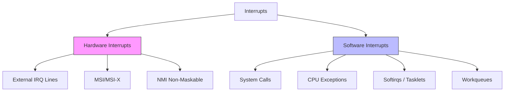
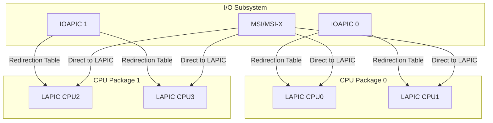
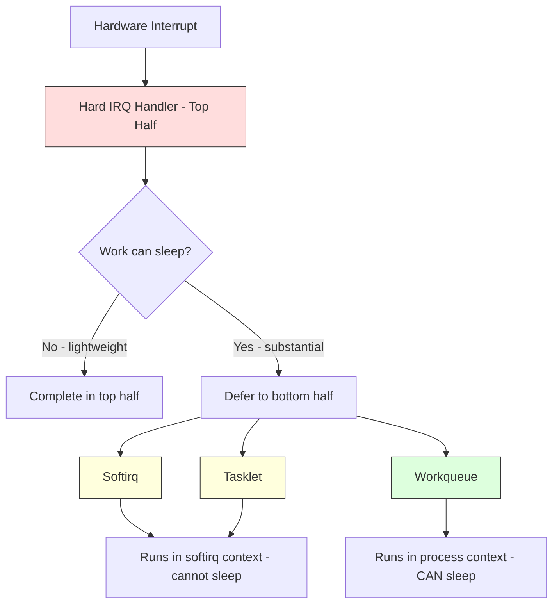
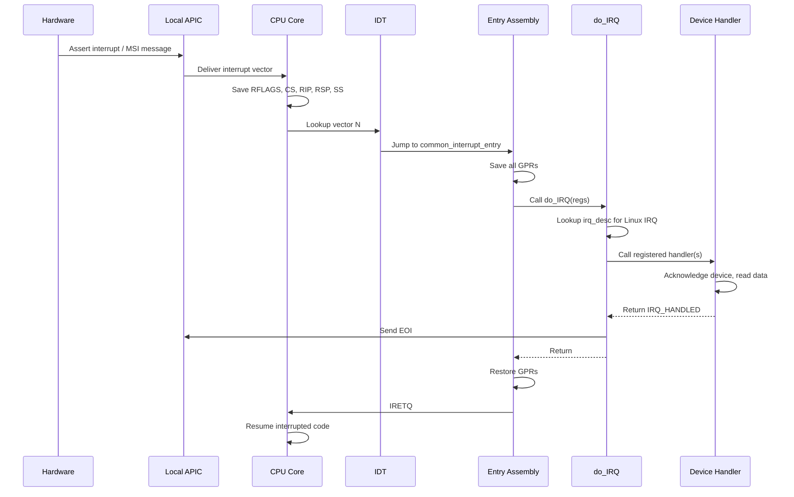

# Interrupts Overview

## Introduction

Interrupts are the fundamental mechanism by which hardware and software signal the processor that attention is required. They are the backbone of modern operating system design, enabling efficient multitasking, responsive I/O, and timely handling of asynchronous events. Without interrupts, the CPU would need to constantly poll devices for status changes — an extraordinarily wasteful approach that dominated early computing.

In Linux, the interrupt subsystem is a deeply layered architecture spanning hardware controllers, architecture-specific assembly glue, generic kernel frameworks, and device-specific handlers. Understanding this subsystem is essential for kernel developers, device driver authors, and anyone seeking to diagnose performance issues or system hangs.

## What Is an Interrupt?

An interrupt is a signal that causes the processor to suspend its current execution context, save its state, and transfer control to a special function called an **interrupt handler** (or **Interrupt Service Routine**, ISR). Once the handler completes, the processor restores its previous state and resumes execution exactly where it left off.



The key property of an interrupt is that it is **asynchronous** with respect to the currently executing code. The CPU does not know in advance when an interrupt will arrive — it can happen between any two instructions.

## Hardware vs Software Interrupts

Linux distinguishes two fundamentally different categories of interrupts, though both use the same underlying CPU mechanisms.

### Hardware Interrupts

Hardware interrupts originate from physical electrical signals. A device — a network card, disk controller, timer chip, or keyboard controller — asserts a voltage on an interrupt request (IRQ) line connected to the processor or an interrupt controller.

**Characteristics:**

- Triggered by external hardware events
- Asynchronous to the currently executing instruction
- Assigned IRQ numbers by the interrupt controller or firmware (ACPI/DT)
- Must be handled quickly (in hardirq context — no sleeping)
- Can be disabled/enabled via CPU flags (`CLI`/`STI` on x86)

Common hardware interrupt sources include:

| Source | Typical IRQ | Description |
|--------|-------------|-------------|
| Timer | 0 (legacy PIT) | System tick / scheduling |
| Keyboard | 1 (legacy) | Keystroke events |
| Disk controllers | varies | I/O completion |
| Network cards | varies | Packet arrival / TX completion |
| PCIe devices | MSI/MSI-X | Modern interrupt mechanism |
| Inter-processor | IPI | Cross-CPU signaling |

### Software Interrupts

Software interrupts are triggered explicitly by program execution rather than by external hardware. On x86, the `INT` instruction generates a software interrupt. In Linux, the term "software interrupt" (or **softirq**) also refers to a kernel deferral mechanism for processing that can be postponed from hard interrupt context.

**Software interrupt mechanisms in Linux:**

1. **System calls** (`INT 0x80` / `SYSCALL`): User-space requests kernel services via a software interrupt that switches to kernel mode.

2. **Exceptions** (division by zero, page fault, debug trap): Generated by the CPU itself when exceptional conditions arise. These are synchronous — they occur at the exact instruction that caused them.

3. **Softirqs and tasklets**: Kernel-level deferred processing mechanisms. When a hardware interrupt handler needs to do substantial work, it "raises" a softirq to defer the work to a safer context. See [Softirqs](softirqs.md) and [Tasklets](tasklets.md).



## IRQ Numbers

Each interrupt source is identified by an **IRQ number** — an integer that the kernel uses to look up the corresponding handler. The meaning of IRQ numbers has evolved significantly over the history of PC architecture.

### Legacy IRQ Numbering (ISA/8259)

The original IBM PC used two Intel 8259 Programmable Interrupt Controllers (PICs), providing 16 IRQ lines (IRQ 0–15). These were fixed by hardware wiring:

```
IRQ  0  — System timer (PIT 8254)
IRQ  1  — Keyboard controller
IRQ  2  — Cascade (connected to second PIC)
IRQ  3  — COM2 / COM4
IRQ  4  — COM1 / COM3
IRQ  5  — LPT2 / Sound card
IRQ  6  — Floppy disk controller
IRQ  7  — LPT1
IRQ  8  — Real-time clock (RTC)
IRQ  9  — Redirected from IRQ 2
IRQ 10  — Available
IRQ 11  — Available
IRQ 12  — PS/2 mouse
IRQ 13  — FPU / coprocessor
IRQ 14  — Primary ATA/IDE
IRQ 15  — Secondary ATA/IDE
```

These legacy IRQ numbers are still visible in `/proc/interrupts` on modern systems, though they are typically remapped through the APIC infrastructure.

### Modern IRQ Numbering (APIC / MSI)

On modern systems with the Advanced Programmable Interrupt Controller (APIC), IRQ numbers are no longer tied to physical pins. Instead, the kernel assigns **Linux IRQ numbers** (also called `virq` — virtual IRQ numbers) that are independent of the hardware routing. A single MSI-X vector, for instance, might be assigned Linux IRQ 47.

The mapping works through **IRQ domains**, which translate between hardware interrupt numbers and Linux IRQ numbers. See [Hardware Interrupts](hardware.md) for details.

### Viewing IRQ Assignments

The `/proc/interrupts` file provides a real-time view of all interrupt activity:

```bash
$ cat /proc/interrupts
           CPU0       CPU1       CPU2       CPU3
  0:         17          0          0          0   IO-APIC   2-edge      timer
  1:          0          0        258          0   IO-APIC   1-edge      i8042
  8:          0          0          0          1   IO-APIC   8-edge      rtc0
  9:          0       1247          0          0   IO-APIC   9-fasteoi   acpi
 16:          0          0          0     892341   IO-APIC  16-fasteoi   ehci_hcd:usb1
 23:          0          0     123045          0   IO-APIC  23-fasteoi   ehci_hcd:usb2
 24:          0          0          0          0   PCI-MSI  524288-edge  PCIe PME
120:     452108          0          0          0   PCI-MSI  524289-edge  nvme0q1
121:          0     387654          0          0   PCI-MSI  524290-edge  nvme0q2
122:          0          0     298123          0   PCI-MSI  524291-edge  nvme0q3
123:          0          0          0     401567   PCI-MSI  524292-edge  nvme0q4
NMI:       1023       1023       1023       1023   Non-maskable interrupts
LOC:    8934521    8923410    8912300    8901190   Local timer interrupts
```

Each row shows: Linux IRQ number, per-CPU counts, interrupt controller type, hardware number, trigger type, and device name.

## Interrupt Routing

On a modern multiprocessor system, interrupt routing determines **which CPU** handles a given interrupt. This is critical for performance — interrupts should be directed to the CPU that is best positioned to process them, often the CPU running the process that initiated the I/O.

### IRQ Affinity

The kernel allows explicit control over interrupt routing through **IRQ affinity**, configured via:

```bash
# View current affinity for IRQ 120
$ cat /proc/irq/120/smp_affinity
00000001

# Bind IRQ 120 to CPU 2
$ echo 00000004 > /proc/irq/120/smp_affinity

# View detailed affinity hints
$ cat /proc/irq/120/affinity_hint
00000004
```

### IRQ Balancing

The `irqbalance` daemon dynamically redistributes interrupts across CPUs to balance load:

```bash
$ systemctl status irqbalance
● irqbalance.service - irqbalance daemon
     Active: active (running) since Mon 2025-01-06 10:00:00 UTC
       Docs: man:irqbalance(1)
   Main PID: 1234 (irqbalance)
```

For latency-sensitive workloads (databases, trading systems), manual affinity is often preferred over automatic balancing.

### Interrupt Routing Topology



## Interrupt Context vs Process Context

One of the most critical concepts in Linux interrupt handling is the distinction between **interrupt context** and **process context**:

- **Process context**: Code executing on behalf of a user-space process (system calls, kernel threads). Can sleep, access user memory, and is preemptible.

- **Interrupt context**: Code executing in response to a hardware interrupt. **Cannot sleep**, cannot access user memory, cannot acquire sleeping locks (mutexes, semaphores). Runs with interrupts potentially disabled on the local CPU.

This distinction has profound implications for what code can do inside an interrupt handler. If you need to perform operations that might sleep (allocating memory with `GFP_KERNEL`, performing disk I/O, etc.), you must defer the work to a bottom half mechanism:



## Interrupt Flow on x86-64

When a hardware interrupt arrives on a modern x86-64 system, the following sequence occurs:

1. **Hardware signal**: The device asserts an interrupt (via IRQ line or MSI message).
2. **Interrupt controller**: The IOAPIC or local APIC receives the signal and determines the target CPU.
3. **CPU acknowledgment**: The CPU acknowledges the interrupt via the APIC protocol.
4. **Context save**: The CPU automatically saves `RIP`, `CS`, `RFLAGS`, `RSP`, `SS` onto the kernel stack (if not already in kernel mode).
5. **Vector lookup**: The CPU indexes into the **Interrupt Descriptor Table (IDT)** using the interrupt vector number.
6. **Common entry**: The IDT entry points to architecture-specific assembly code (`arch/x86/entry/entry_64.S`) that saves all general-purpose registers.
7. **do_IRQ**: The generic IRQ handler is called, which looks up the Linux IRQ descriptor and invokes registered handlers.
8. **Handler execution**: The device-specific handler runs.
9. **EOI (End of Interrupt)**: The kernel sends an EOI to the APIC to acknowledge the interrupt has been serviced.
10. **Context restore**: The assembly code restores saved registers and executes `IRETQ` to return to the interrupted code.



## Interrupt Statistics and Debugging

### /proc/interrupts

Already shown above — the primary interface for monitoring interrupt activity.

### /proc/softirqs

Shows per-CPU softirq counts:

```bash
$ cat /proc/softirqs
                    CPU0       CPU1       CPU2       CPU3
          HI:          3          0          1          0
       TIMER:    8945230    8934120    8923010    8911900
      NET_TX:       1234       2345       3456       4567
      NET_RX:     123456     234567     345678     456789
       BLOCK:      45678      56789      67890      78901
    IRQ_POLL:          0          0          0          0
     TASKLET:       5678       6789       7890       8901
       SCHED:    9876543    9865432    9854321    9843210
     HRTIMER:          0          0          0          0
         RCU:    9876543    9865432    9854321    9843210
```

### /proc/irq/

Per-IRQ information directories:

```bash
$ ls /proc/irq/120/
affinity_hint  effective_affinity  node  smp_affinity  smp_affinity_list  spurious
$ cat /proc/irq/120/spurious
count 0
unhandled 0
last_unhandled 0
```

### irq_stat and /proc/stat

The `/proc/stat` file includes aggregate interrupt and softirq counts:

```bash
$ grep -E '^(intr|softirq)' /proc/stat
intr 89234567 17 0 258 ...  (total + per-vector counts)
softirq 12345678 3 8945230 1234 123456 45678 0 5678 9876543 0 9876543
```

## NMI — Non-Maskable Interrupts

Not all interrupts can be disabled. **Non-Maskable Interrupts (NMI)** are high-priority interrupts that the CPU cannot ignore. In Linux, NMIs are used for:

- **Hardware watchdog timers**: Detecting system hangs
- **Performance monitoring**: Profiling with `perf`
- **Kernel panic notifications**: Hardware error reporting
- **Backtrace dumps**: Triggering stack traces on all CPUs

```bash
# Trigger NMI backtrace dump (useful for debugging hangs)
$ echo 1 > /proc/sys/kernel/nmi_watchdog
```

## References

- [The Linux Kernel Documentation](https://docs.kernel.org/)
- [GNU Project Documentation](https://www.gnu.org/doc/doc.html)
- [GNU Manuals](https://www.gnu.org/manual/manual.html)
- [Free Software Directory](https://directory.fsf.org/wiki/Main_Page)
- [Planet GNU](https://planet.gnu.org/)
- [Free Software Books](https://www.gnu.org/doc/other-free-books.html)

- [Linux Kernel Documentation: IRQs](https://www.kernel.org/doc/html/latest/core-api/irq/index.html)
- [Understanding the Linux Kernel, 3rd Edition — Chapter 4: Interrupts and Exceptions](https://www.oreilly.com/library/view/understanding-the-linux/0596005652/)
- [Linux Device Drivers, 3rd Edition — Chapter 10: Interrupt Handling](https://lwn.net/Kernel/LDD3/)
- [Intel 64 and IA-32 Architectures Software Developer's Manual, Volume 3A — Chapter 6: Interrupt and Exception Handling](https://www.intel.com/content/www/us/en/developer/articles/technical/intel-sdm.html)
- [APIC Specification](https://www.intel.com/content/dam/www/public/us/en/documents/manuals/64-ia-32-architectures-software-developer-vol-3a-part-1-manual.pdf)

## Related Topics

- [Hardware Interrupts](hardware.md) — APIC, IOAPIC, MSI/MSI-X deep dive
- [Interrupt Handlers](handlers.md) — `request_irq`, threaded interrupts, handler registration
- [Softirqs](softirqs.md) — Deferred interrupt processing
- [Tasklets](tasklets.md) — Built on softirqs, simpler API
- [Workqueues](workqueues.md) — Process-context deferred work
- [Synchronization Overview](../sync/overview.md) — Why locks matter in interrupt handlers
