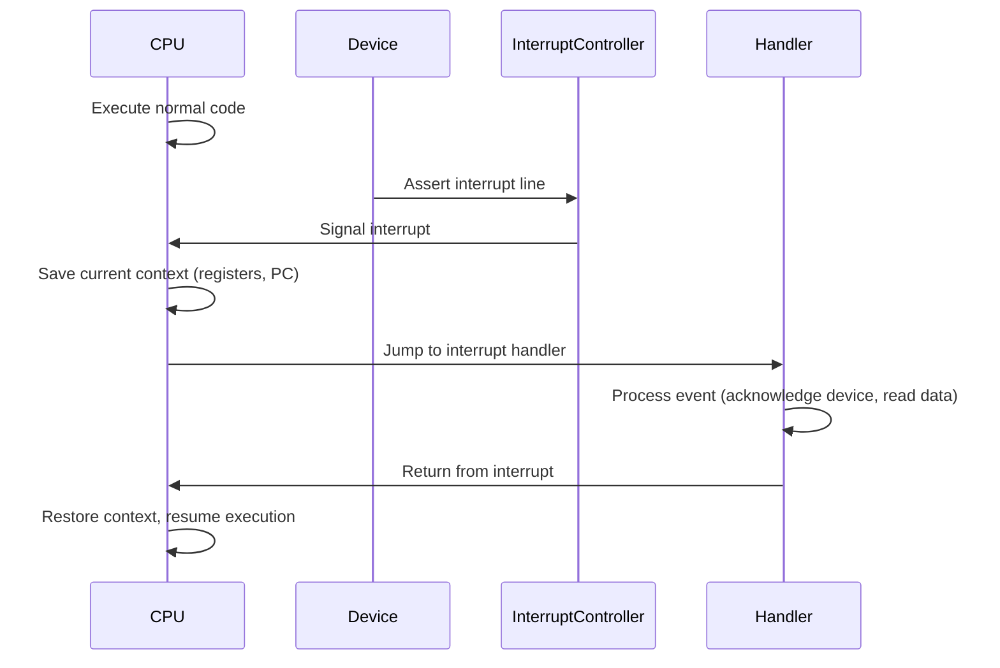
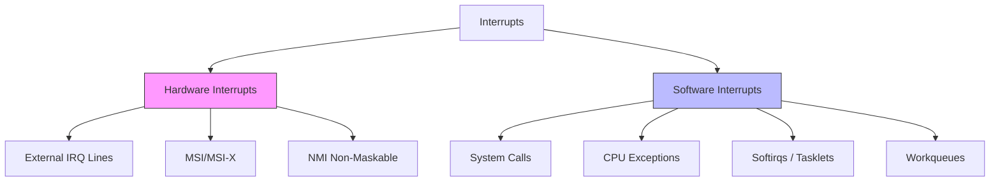
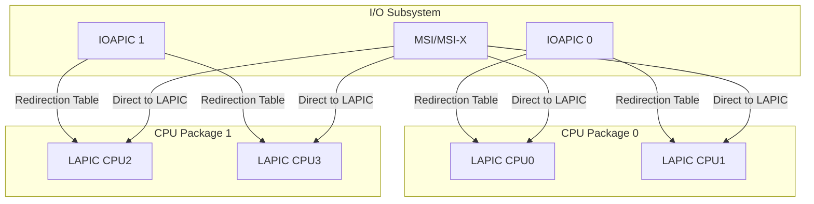
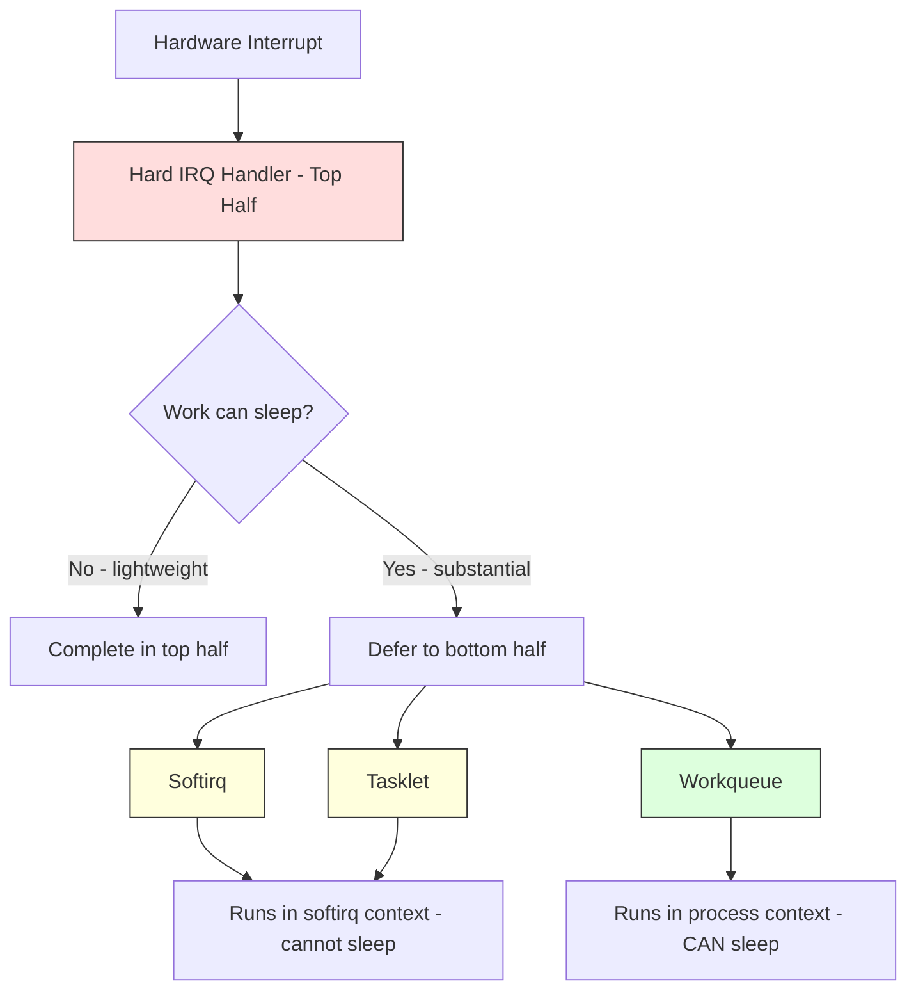
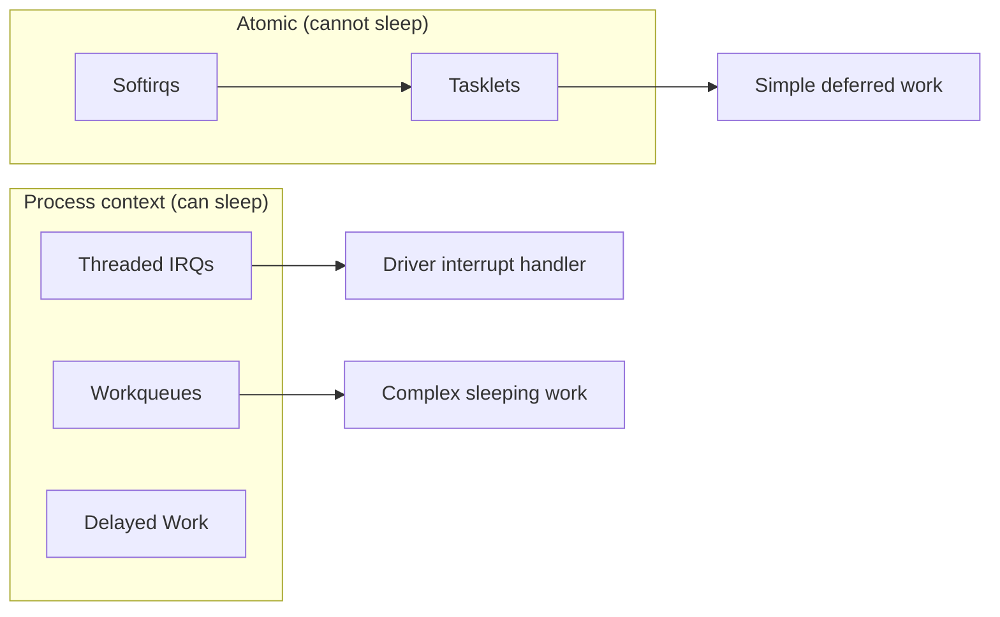
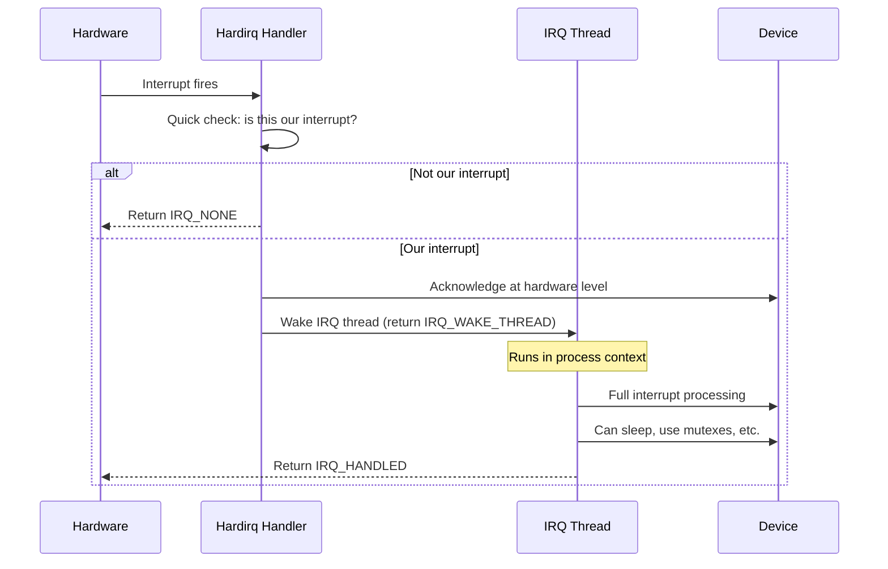
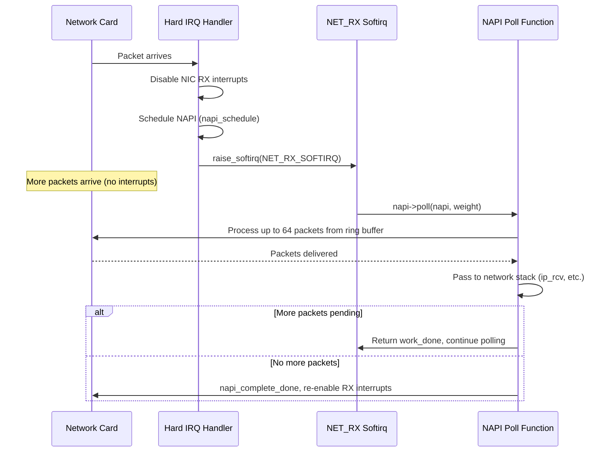
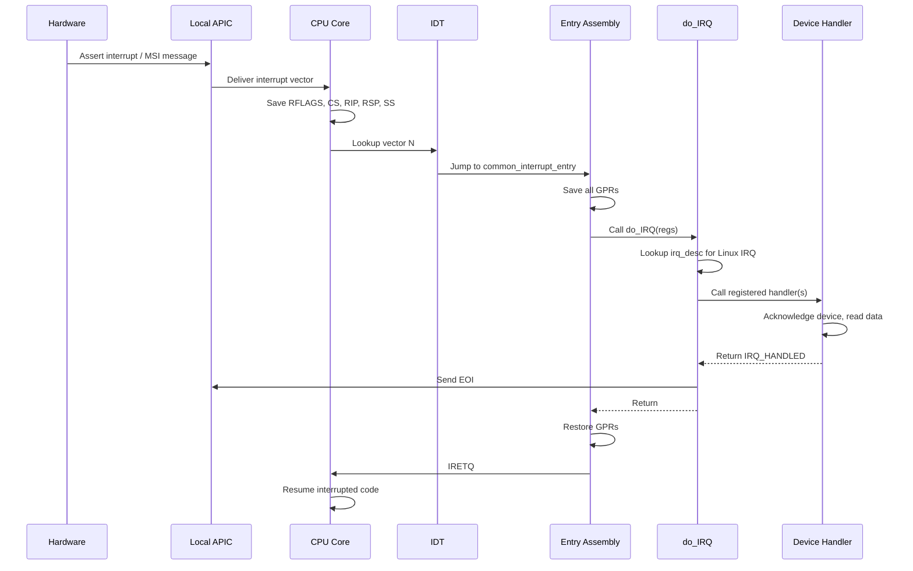
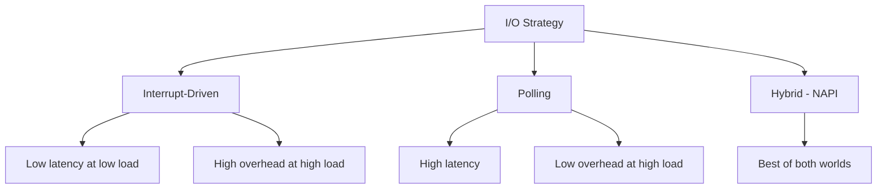

# Interrupts Overview

## Introduction

Interrupts are the fundamental mechanism by which hardware and software signal the processor that attention is required. They are the backbone of modern operating system design, enabling efficient multitasking, responsive I/O, and timely handling of asynchronous events. Without interrupts, the CPU would need to constantly poll devices for status changes — an extraordinarily wasteful approach that dominated early computing.

In Linux, the interrupt subsystem is a deeply layered architecture spanning hardware controllers, architecture-specific assembly glue, generic kernel frameworks, and device-specific handlers. Understanding this subsystem is essential for kernel developers, device driver authors, and anyone seeking to diagnose performance issues or system hangs.

## What Is an Interrupt?

An interrupt is a signal that causes the processor to suspend its current execution context, save its state, and transfer control to a special function called an **interrupt handler** (or **Interrupt Service Routine**, ISR). Once the handler completes, the processor restores its previous state and resumes execution exactly where it left off.



The key property of an interrupt is that it is **asynchronous** with respect to the currently executing code. The CPU does not know in advance when an interrupt will arrive — it can happen between any two instructions.

## Hardware vs Software Interrupts

Linux distinguishes two fundamentally different categories of interrupts, though both use the same underlying CPU mechanisms.

### Hardware Interrupts

Hardware interrupts originate from physical electrical signals. A device — a network card, disk controller, timer chip, or keyboard controller — asserts a voltage on an interrupt request (IRQ) line connected to the processor or an interrupt controller.

**Characteristics:**

- Triggered by external hardware events
- Asynchronous to the currently executing instruction
- Assigned IRQ numbers by the interrupt controller or firmware (ACPI/DT)
- Must be handled quickly (in hardirq context — no sleeping)
- Can be disabled/enabled via CPU flags (`CLI`/`STI` on x86)

Common hardware interrupt sources include:

| Source | Typical IRQ | Description |
|--------|-------------|-------------|
| Timer | 0 (legacy PIT) | System tick / scheduling |
| Keyboard | 1 (legacy) | Keystroke events |
| Disk controllers | varies | I/O completion |
| Network cards | varies | Packet arrival / TX completion |
| PCIe devices | MSI/MSI-X | Modern interrupt mechanism |
| Inter-processor | IPI | Cross-CPU signaling |

### Software Interrupts

Software interrupts are triggered explicitly by program execution rather than by external hardware. On x86, the `INT` instruction generates a software interrupt. In Linux, the term "software interrupt" (or **softirq**) also refers to a kernel deferral mechanism for processing that can be postponed from hard interrupt context.

**Software interrupt mechanisms in Linux:**

1. **System calls** (`INT 0x80` / `SYSCALL`): User-space requests kernel services via a software interrupt that switches to kernel mode.

2. **Exceptions** (division by zero, page fault, debug trap): Generated by the CPU itself when exceptional conditions arise. These are synchronous — they occur at the exact instruction that caused them.

3. **Softirqs and tasklets**: Kernel-level deferred processing mechanisms. When a hardware interrupt handler needs to do substantial work, it "raises" a softirq to defer the work to a safer context. See [Softirqs](softirqs.md) and [Tasklets](tasklets.md).



## IRQ Numbers

Each interrupt source is identified by an **IRQ number** — an integer that the kernel uses to look up the corresponding handler. The meaning of IRQ numbers has evolved significantly over the history of PC architecture.

### Legacy IRQ Numbering (ISA/8259)

The original IBM PC used two Intel 8259 Programmable Interrupt Controllers (PICs), providing 16 IRQ lines (IRQ 0–15). These were fixed by hardware wiring:

```
IRQ  0  — System timer (PIT 8254)
IRQ  1  — Keyboard controller
IRQ  2  — Cascade (connected to second PIC)
IRQ  3  — COM2 / COM4
IRQ  4  — COM1 / COM3
IRQ  5  — LPT2 / Sound card
IRQ  6  — Floppy disk controller
IRQ  7  — LPT1
IRQ  8  — Real-time clock (RTC)
IRQ  9  — Redirected from IRQ 2
IRQ 10  — Available
IRQ 11  — Available
IRQ 12  — PS/2 mouse
IRQ 13  — FPU / coprocessor
IRQ 14  — Primary ATA/IDE
IRQ 15  — Secondary ATA/IDE
```

These legacy IRQ numbers are still visible in `/proc/interrupts` on modern systems, though they are typically remapped through the APIC infrastructure.

### Modern IRQ Numbering (APIC / MSI)

On modern systems with the Advanced Programmable Interrupt Controller (APIC), IRQ numbers are no longer tied to physical pins. Instead, the kernel assigns **Linux IRQ numbers** (also called `virq` — virtual IRQ numbers) that are independent of the hardware routing. A single MSI-X vector, for instance, might be assigned Linux IRQ 47.

The mapping works through **IRQ domains**, which translate between hardware interrupt numbers and Linux IRQ numbers. See [Hardware Interrupts](hardware.md) for details.

### Viewing IRQ Assignments

The `/proc/interrupts` file provides a real-time view of all interrupt activity:

```bash
$ cat /proc/interrupts
           CPU0       CPU1       CPU2       CPU3
  0:         17          0          0          0   IO-APIC   2-edge      timer
  1:          0          0        258          0   IO-APIC   1-edge      i8042
  8:          0          0          0          1   IO-APIC   8-edge      rtc0
  9:          0       1247          0          0   IO-APIC   9-fasteoi   acpi
 16:          0          0          0     892341   IO-APIC  16-fasteoi   ehci_hcd:usb1
 23:          0          0     123045          0   IO-APIC  23-fasteoi   ehci_hcd:usb2
 24:          0          0          0          0   PCI-MSI  524288-edge  PCIe PME
120:     452108          0          0          0   PCI-MSI  524289-edge  nvme0q1
121:          0     387654          0          0   PCI-MSI  524290-edge  nvme0q2
122:          0          0     298123          0   PCI-MSI  524291-edge  nvme0q3
123:          0          0          0     401567   PCI-MSI  524292-edge  nvme0q4
NMI:       1023       1023       1023       1023   Non-maskable interrupts
LOC:    8934521    8923410    8912300    8901190   Local timer interrupts
```

Each row shows: Linux IRQ number, per-CPU counts, interrupt controller type, hardware number, trigger type, and device name.

### Deep Dive: /proc/interrupts Columns

The `/proc/interrupts` output is more nuanced than it first appears:

| Column | Meaning |
|--------|---------|
| IRQ number | Linux virtual IRQ number (virq) |
| Per-CPU counts | Number of interrupts handled by each CPU since boot |
| Controller type | `IO-APIC`, `PCI-MSI`, `PCI-MSI-X`, `xt-pic`, etc. |
| Hardware number | Hardware IRQ pin or MSI vector number |
| Trigger type | `edge` (edge-triggered) or `level` (level-triggered); `fasteoi` = fast EOI mode |
| Device name | Name of the device or handler registered via `request_irq()` |

Special entries at the bottom are architecture-specific:

```bash
# Architecture-specific entries (x86)
NMI:       1023       1023       1023       1023   Non-maskable interrupts
LOC:    8934521    8923410    8912300    8901190   Local timer interrupts
SPU:          0          0          0          0   Spurious interrupts
PMI:       1023       1023       1023       1023   Performance monitoring interrupts
IWI:       1023       1023       1023       1023   IRQ work interrupts
RTR:          4          0          0          0   APIC ICR read retries
RES:       1234       2345       3456       4567   Rescheduling interrupts
CAL:       5678       6789       7890       8901   Function call interrupts
TLB:       1234       2345       3456       4567   TLB shootdowns
TRM:          0          0          0          0   Thermal event interrupts
THR:          0          0          0          0   Threshold APIC interrupts
DFR:          0          0          0          0   Deferred Error interrupts
MCE:          0          0          0          0   Machine check exceptions
MCP:         10         10         10         10   Machine check polls
ERR:          0
MIS:          0
PIN:          0          0          0          0   Posted-interrupt notification
NPI:          0          0          0          0   Nested posted-interrupt event
PIW:          0          0          0          0   Posted-interrupt wakeup
```

**Interpreting the special entries:**

- **NMI**: Non-maskable interrupts — hardware watchdog, perf profiling, kernel panic notifications. High counts are normal.
- **LOC**: Local APIC timer interrupts — the per-CPU timer tick. Should be roughly equal across CPUs.
- **SPU**: Spurious interrupts — interrupt controller delivered an interrupt with no handler. Non-zero counts may indicate hardware issues.
- **PMI**: Performance monitoring interrupts — used by `perf` for sampling.
- **RES**: Rescheduling interrupts (IPI) — sent when a CPU needs to reschedule. High counts indicate heavy scheduling activity.
- **CAL**: Function call interrupts — used by `smp_call_function()` for cross-CPU function invocation.
- **TLB**: TLB shootdown interrupts — sent when one CPU invalidates page table entries that other CPUs may have cached. High counts indicate heavy memory mapping changes (e.g., `mmap`/`munmap` activity).
- **MCE**: Machine check exceptions — hardware error reports. Any occurrence warrants investigation.

### Analyzing /proc/interrupts for Performance

```bash
# Identify CPUs with high interrupt load
$ awk '/^[0-9]+:/ { sum=0; for(i=1;i<=NF;i++) if(i ~ /^[0-9]+$/) sum+=$i; print $1, sum }' /proc/interrupts | sort -k2 -rn | head -10
120: 452108
121: 387654
123: 401567
122: 298123
 16: 892341

# Check if interrupts are unevenly distributed (single-CPU bottleneck)
$ awk '/^120:/ { for(i=2;i<=5;i++) printf "CPU%d: %s\n", i-2, $i }' /proc/interrupts
CPU0: 452108
CPU1: 0
CPU2: 0
CPU3: 0
# All interrupts on CPU0 — potential bottleneck, consider IRQ affinity rebalancing

# Monitor interrupt rate over time (1-second sample)
$ paste <(cat /proc/interrupts) <(sleep 1 && cat /proc/interrupts) | \
  awk '/^[0-9]+:/ { irq=$1; old=$2; new=NF; print irq, $new-old "/sec" }'
```

### Using perf to Analyze Interrupt Latency

```bash
# Record interrupt events with perf
$ sudo perf record -e irq:irq_handler_entry -e irq:irq_handler_exit -a -- sleep 5

# View interrupt latency histogram
$ sudo perf script | awk '/irq_handler_exit/ { print $NF }' | sort -n | \
  awk '{ sum+=$1; n++; if($1>max) max=$1 } END { print "avg:", sum/n, "us, max:", max, "us" }'

# Trace specific IRQ handler duration
$ sudo perf trace -e irq:irq_handler_entry,irq:irq_handler_exit -p 1 -- sleep 1

# Using ftrace for detailed IRQ timing
$ echo 1 > /sys/kernel/debug/tracing/events/irq/irq_handler_entry/enable
$ echo 1 > /sys/kernel/debug/tracing/events/irq/irq_handler_exit/enable
$ cat /sys/kernel/debug/tracing/trace_pipe
# <idle>-0     [003] d.h1  1234.567890: irq_handler_entry: irq=120 name=nvme0q1
# <idle>-0     [003] d.h1  1234.567912: irq_handler_exit: irq=120 ret=handled
# 22 microseconds — very fast
```

## Interrupt Routing

On a modern multiprocessor system, interrupt routing determines **which CPU** handles a given interrupt. This is critical for performance — interrupts should be directed to the CPU that is best positioned to process them, often the CPU running the process that initiated the I/O.

### IRQ Affinity

The kernel allows explicit control over interrupt routing through **IRQ affinity**, configured via:

```bash
# View current affinity for IRQ 120
$ cat /proc/irq/120/smp_affinity
00000001

# Bind IRQ 120 to CPU 2
$ echo 00000004 > /proc/irq/120/smp_affinity

# View detailed affinity hints
$ cat /proc/irq/120/affinity_hint
00000004
```

### IRQ Affinity Deep Dive

The `smp_affinity` value is a **hexadecimal bitmask** where each bit represents a CPU:

```bash
# Bitmask to CPU mapping:
# 0x01 = CPU 0
# 0x02 = CPU 1
# 0x04 = CPU 2
# 0x08 = CPU 3
# 0x0f = CPU 0,1,2,3 (all)
# 0x05 = CPU 0,2

# For systems with >32 CPUs, the mask uses multiple hex groups:
# 00000000,00000000,00000000,0000000f = CPUs 0-3

# Use smp_affinity_list for human-readable format
$ cat /proc/irq/120/smp_affinity_list
0
$ echo 2-3 > /proc/irq/120/smp_affinity_list
$ cat /proc/irq/120/smp_affinity_list
2-3
```

**Effective affinity** shows which CPU actually handles the interrupt (may differ from requested):

```bash
$ cat /proc/irq/120/effective_affinity
00000004
$ cat /proc/irq/120/effective_affinity_list
2
```

### NUMA-Aware IRQ Affinity

On NUMA systems, placing interrupts on the CPU closest to the device's NUMA node reduces memory access latency:

```bash
# Find device NUMA node
$ cat /sys/bus/pci/devices/0000:03:00.0/numa_node
0

# Find CPUs on that NUMA node
$ ls /sys/devices/system/node/node0/cpulist
0-7,16-23

# Set IRQ affinity to CPUs on the same NUMA node
$ echo 0-7 > /proc/irq/120/smp_affinity_list
```

### IRQ Balancing

The `irqbalance` daemon dynamically redistributes interrupts across CPUs to balance load:

```bash
$ systemctl status irqbalance
● irqbalance.service - irqbalance daemon
     Active: active (running) since Mon 2025-01-06 10:00:00 UTC
       Docs: man:irqbalance(1)
   Main PID: 1234 (irqbalance)
```

**irqbalance operation:**

1. Periodically reads `/proc/interrupts` to gather per-CPU interrupt counts.
2. Calculates CPU load including interrupt overhead.
3. Identifies imbalanced IRQs and migrates them to less-loaded CPUs.
4. Considers NUMA topology for placement decisions.

**irqbalance tuning:**

```bash
# View irqbalance configuration
$ irqbalance --debug 2>&1 | head -20

# Exclude specific IRQs from balancing
$ echo 120 > /proc/irq/120/ban  # Not a real API — use irqbalance UI or config

# irqbalance configuration file
$ cat /etc/irqbalance.conf
#IRQBALANCE_ARGS="--debug"
#IRQBALANCE_BANNED_INTERRUPTS=""
```

For latency-sensitive workloads (databases, trading systems), manual affinity is often preferred over automatic balancing because irqbalance's decisions can cause cache thrashing.

### Interrupt Routing Topology



## Interrupt Context vs Process Context

One of the most critical concepts in Linux interrupt handling is the distinction between **interrupt context** and **process context**:

- **Process context**: Code executing on behalf of a user-space process (system calls, kernel threads). Can sleep, access user memory, and is preemptible.

- **Interrupt context**: Code executing in response to a hardware interrupt. **Cannot sleep**, cannot access user memory, cannot acquire sleeping locks (mutexes, semaphores). Runs with interrupts potentially disabled on the local CPU.

This distinction has profound implications for what code can do inside an interrupt handler. If you need to perform operations that might sleep (allocating memory with `GFP_KERNEL`, performing disk I/O, etc.), you must defer the work to a bottom half mechanism:



## The Top-Half / Bottom-Half Split

The division of interrupt handling into top-half (hardirq) and bottom-half (deferred) is one of the most important design patterns in the Linux kernel.

### Top Half (Hardirq Handler)

The top half runs in **hardirq context** with interrupts disabled on the local CPU. Its responsibilities are minimal:

1. **Acknowledge the interrupt** at the hardware level (read status register, write acknowledgment).
2. **Copy data** from hardware buffers to kernel memory if needed.
3. **Schedule bottom-half processing** if more work is needed.
4. **Return quickly** — typically under 10 microseconds.

**Constraints of top-half context:**

| Operation | Allowed? | Notes |
|-----------|----------|-------|
| Read/write I/O registers | ✅ | Primary purpose |
| Wake a tasklet/softirq | ✅ | For deferred processing |
| `spin_lock_irqsave()` | ✅ | Must not sleep |
| `GFP_ATOMIC` allocation | ✅ | May fail, never sleeps |
| `GFP_KERNEL` allocation | ❌ | Can sleep! |
| `mutex_lock()` | ❌ | Can sleep! |
| `msleep()` / `ssleep()` | ❌ | Sleeps! |
| `copy_to_user()` | ❌ | May fault and sleep |
| `schedule()` | ❌ | Context switch! |

### Bottom Half Mechanisms

Linux provides several bottom-half mechanisms, each with different tradeoffs:



| Mechanism | Context | Concurrency | Dynamically Created | Use Case |
|-----------|---------|-------------|---------------------|----------|
| **Softirq** | Softirq (atomic) | Multiple CPUs | No (static) | Highest-frequency paths (NET_RX, timers) |
| **Tasklet** | Softirq (atomic) | Serialized per instance | Yes | Simple deferred work from hardirq |
| **Threaded IRQ** | Process (can sleep) | Serialized per IRQ | Yes (implicit) | Most driver interrupt handling |
| **Workqueue** | Process (can sleep) | Managed concurrency | Yes | Complex work needing sleep |

## Threaded Interrupt Handlers

Threaded IRQs (introduced in kernel 2.6.30) move interrupt handling to a kernel thread, allowing the handler to sleep:

```c
/* Request a threaded IRQ handler */
int request_threaded_irq(unsigned int irq,
                         irq_handler_t handler,       /* Hardirq (top half) */
                         irq_handler_t thread_fn,     /* Thread (bottom half) */
                         unsigned long irqflags,
                         const char *devname,
                         void *dev_id);
```

### How Threaded IRQs Work



**Key properties of threaded IRQ handlers:**

1. The hardirq handler (`handler`) runs first in hardirq context. It should be minimal — just check if the interrupt belongs to this device and acknowledge it.
2. If the hardirq handler returns `IRQ_WAKE_THREAD`, the kernel wakes the IRQ thread.
3. The thread function (`thread_fn`) runs in process context with `SCHED_FIFO` priority 50 by default.
4. The IRQ thread is named `irq/<irq_number>-<device_name>`.
5. The thread can sleep, allocate memory with `GFP_KERNEL`, acquire mutexes, etc.

### IRQ Thread Internals

```bash
# View IRQ threads
$ ps -eo pid,cls,ni,comm | grep irq/
    123  TS   -  irq/120-nvme0q1
    124  TS   -  irq/121-nvme0q2
    125  TS   -  irq/122-nvme0q3
    126  TS   -  irq/123-nvme0q4

# 'TS' = SCHED_OTHER, but IRQ threads use SCHED_FIFO by default
# The priority (ni column shows '-' for RT tasks)

# View IRQ thread priority
$ chrt -p $(pgrep irq/120)
pid 123's current scheduling policy: SCHED_FIFO
pid 123's current scheduling priority: 50
```

### Forced Threading

The kernel can force all interrupt handlers to be threaded via the `threadirqs` boot parameter:

```bash
# In kernel command line
threadirqs

# Or check if enabled
$ cat /proc/cmdline | grep threadirqs
```

When forced threading is enabled, all IRQ handlers run in thread context. This is useful for:
- **Debugging**: Easier to trace and profile interrupt handlers.
- **PREEMPT_RT**: The real-time patchset requires all handlers to be threaded.
- **Latency**: Reduces time spent with interrupts disabled.

### Requesting IRQs

```c
/* Simple (non-threaded) IRQ */
int request_irq(unsigned int irq,
                irq_handler_t handler,
                unsigned long flags,
                const char *name,
                void *dev);

/* Threaded IRQ */
int request_threaded_irq(unsigned int irq,
                         irq_handler_t handler,
                         irq_handler_t thread_fn,
                         unsigned long flags,
                         const char *name,
                         void *dev);
```

**IRQ flags:**

| Flag | Meaning |
|------|---------|
| `IRQF_SHARED` | Multiple devices share this IRQ line |
| `IRQF_TIMER` | Timer interrupt (special handling) |
| `IRQF_NOBALANCING` | Exclude from IRQ balancing |
| `IRQF_IRQPOLL` | Used for polling when interrupt is not reliable |
| `IRQF_ONESHOT` | Keep IRQ disabled until thread handler completes |
| `IRQF_NO_SUSPEND` | Don't disable this IRQ during system suspend |
| `IRQF_FORCE_RESUME` | Force enable this IRQ on resume |

### Shared IRQ Handlers

When `IRQF_SHARED` is set, multiple devices can share the same IRQ line. Each handler must check if its device generated the interrupt:

```c
static irqreturn_t my_handler(int irq, void *dev_id)
{
    struct my_device *dev = dev_id;
    u32 status;

    /* Read device status register */
    status = ioread32(dev->regs + IRQ_STATUS);

    /* Check if this device caused the interrupt */
    if (!(status & IRQ_PENDING))
        return IRQ_NONE;  /* Not our interrupt */

    /* Acknowledge */
    iowrite32(IRQ_PENDING, dev->regs + IRQ_STATUS);

    /* Process... */
    return IRQ_HANDLED;
}

/* Registration with IRQF_SHARED */
ret = request_irq(dev->irq, my_handler, IRQF_SHARED, "my_dev", dev);
```

When a shared IRQ fires, the kernel calls **all** handlers registered on that line. Each returns `IRQ_HANDLED` if it processed the interrupt, or `IRQ_NONE` if it didn't. The kernel considers the interrupt handled if at least one handler returns `IRQ_HANDLED`.

## NAPI — New API for Network Interrupt Handling

NAPI (New API) is the Linux kernel's interrupt mitigation framework for network devices. It combines interrupt-driven and polling-based approaches to handle high packet rates efficiently.

### The Problem NAPI Solves

Under high network traffic, every packet generates an interrupt. This leads to:
1. **Interrupt storms**: The CPU spends most of its time in interrupt handlers.
2. **Context switch overhead**: Each interrupt has entry/exit overhead.
3. **Lock contention**: Interrupt handlers compete with packet processing code.

### NAPI Operation



**NAPI key parameters:**

| Parameter | Default | Description |
|-----------|---------|-------------|
| `weight` | 64 | Maximum packets per poll cycle |
| `budget` | 64 | Passed to poll function; limits work per cycle |
| `dev_weight` | 64 | System-wide default weight (tunable via `/proc/sys/net/core/dev_weight`) |

**When NAPI activates** (dynamic interrupt throttling):

1. **Low traffic**: Interrupts enabled. Each packet causes an interrupt → handler processes it immediately.
2. **High traffic**: Interrupts disabled. NAPI polls the NIC ring buffer, processing batches of packets.
3. **Traffic subsides**: NAPI re-enables interrupts and returns to interrupt-driven mode.

### NAPI in /proc/interrupts

```bash
# Multi-queue NIC with NAPI
$ cat /proc/interrupts | grep eth0
 80:  123456  0  0  0  PCI-MSI  1048576-edge  eth0-TxRx-0
 81:  0  234567  0  0  PCI-MSI  1048577-edge  eth0-TxRx-1
 82:  0  0  345678  0  PCI-MSI  1048578-edge  eth0-TxRx-2
 83:  0  0  0  456789  PCI-MSI  1048579-edge  eth0-TxRx-3

# Each queue pair has its own MSI-X vector and NAPI instance
# Affinity should match: queue N → CPU N
```

### RPS and RFS (Software-Level Interrupt Distribution)

When hardware doesn't support enough queues, the kernel provides software-level distribution:

```bash
# RPS (Receive Packet Steering): distribute RX processing across CPUs
$ echo 0f > /sys/class/net/eth0/queues/rx-0/rps_cpus  # Use CPUs 0-3

# RFS (Receive Flow Steering): direct packets to the CPU running the application
$ echo 32768 > /sys/class/net/eth0/queues/rx-0/rps_flow_cnt
$ echo 32768 > /proc/sys/net/core/rps_sock_flow_entries
```

## Interrupt Flow on x86-64

When a hardware interrupt arrives on a modern x86-64 system, the following sequence occurs:

1. **Hardware signal**: The device asserts an interrupt (via IRQ line or MSI message).
2. **Interrupt controller**: The IOAPIC or local APIC receives the signal and determines the target CPU.
3. **CPU acknowledgment**: The CPU acknowledges the interrupt via the APIC protocol.
4. **Context save**: The CPU automatically saves `RIP`, `CS`, `RFLAGS`, `RSP`, `SS` onto the kernel stack (if not already in kernel mode).
5. **Vector lookup**: The CPU indexes into the **Interrupt Descriptor Table (IDT)** using the interrupt vector number.
6. **Common entry**: The IDT entry points to architecture-specific assembly code (`arch/x86/entry/entry_64.S`) that saves all general-purpose registers.
7. **do_IRQ**: The generic IRQ handler is called, which looks up the Linux IRQ descriptor and invokes registered handlers.
8. **Handler execution**: The device-specific handler runs.
9. **EOI (End of Interrupt)**: The kernel sends an EOI to the APIC to acknowledge the interrupt has been serviced.
10. **Context restore**: The assembly code restores saved registers and executes `IRETQ` to return to the interrupted code.



### IDT Structure

The IDT is an array of 256 gate descriptors, each 16 bytes on x86-64:

```c
/* Simplified IDT gate descriptor */
struct idt_bits {
    u16 ist    : 3,    /* IST (Interrupt Stack Table) index */
         zero   : 5,
         type   : 5,    /* Gate type: interrupt(14), trap(15) */
         dpl    : 2,    /* Descriptor privilege level */
         p      : 1;    /* Present bit */
};

struct gate_desc {
    u16        offset_low;    /* Offset bits 0-15 */
    u16        segment;       /* Code segment selector */
    struct idt_bits bits;
    u16        offset_middle; /* Offset bits 16-31 */
    u32        offset_high;   /* Offset bits 32-63 */
    u32        reserved;
};
```

### Interrupt Stack Table (IST)

x86-64 supports **Interrupt Stack Table (IST)** entries that automatically switch to a known-good stack on certain exceptions:

```c
#define IST_INDEX_DF    1   /* Double fault */
#define IST_INDEX_NMI   2   /* NMI */
#define IST_INDEX_DB    3   /* Debug */
#define IST_INDEX_MCE   4   /* Machine check */
```

This prevents stack corruption from causing cascading faults (e.g., a stack overflow during a page fault handler).

## Interrupt Statistics and Debugging

### /proc/interrupts

Already shown above — the primary interface for monitoring interrupt activity.

### /proc/softirqs

Shows per-CPU softirq counts:

```bash
$ cat /proc/softirqs
                    CPU0       CPU1       CPU2       CPU3
          HI:          3          0          1          0
       TIMER:    8945230    8934120    8923010    8911900
      NET_TX:       1234       2345       3456       4567
      NET_RX:     123456     234567     345678     456789
       BLOCK:      45678      56789      67890      78901
    IRQ_POLL:          0          0          0          0
     TASKLET:       5678       6789       7890       8901
       SCHED:    9876543    9865432    9854321    9843210
     HRTIMER:          0          0          0          0
         RCU:    9876543    9865432    9854321    9843210
```

### /proc/irq/

Per-IRQ information directories:

```bash
$ ls /proc/irq/120/
affinity_hint  effective_affinity  node  smp_affinity  smp_affinity_list  spurious
$ cat /proc/irq/120/spurious
count 0
unhandled 0
last_unhandled 0
```

**Spurious interrupt detection**: The kernel tracks interrupts that no handler claims. If the count exceeds a threshold, the kernel disables the IRQ:

```c
/* kernel/irq/spurious.c */
#define MAX_INTERRUPT_RATE   10000  /* per second */
#define SPURIOUS_DEFERRED_SUSPEND  8  /* jiffies */

static void note_interrupt(struct irq_desc *desc, irqreturn_t retval)
{
    if (retval == IRQ_NONE) {
        desc->irqs_unhandled++;
        if (unlikely(desc->irqs_unhandled > 99900)) {
            /* Too many unhandled — disable IRQ */
            desc->irq_count++;
            if (desc->irq_count > MAX_INTERRUPT_RATE)
                __report_bad_irq(desc);
        }
    }
}
```

### irq_stat and /proc/stat

The `/proc/stat` file includes aggregate interrupt and softirq counts:

```bash
$ grep -E '^(intr|softirq)' /proc/stat
intr 89234567 17 0 258 ...  (total + per-vector counts)
softirq 12345678 3 8945230 1234 123456 45678 0 5678 9876543 0 9876543
```

### Using trace-cmd for IRQ Analysis

```bash
# Install trace-cmd if needed
$ sudo apt install trace-cmd

# Record all IRQ events for 5 seconds
$ sudo trace-cmd record -e irq -e softirq -e sched_switch sleep 5

# View the trace
$ trace-cmd report | head -30
# <idle>-0     [003]  1234.567: irq_handler_entry: irq=120 name=nvme0q1
# <idle>-0     [003]  1234.567: irq_handler_exit: irq=120 ret=handled
# <idle>-0     [003]  1234.567: softirq_entry: vec=3 [action=NET_RX]
# ksoftirqd/3-14   [003]  1234.570: softirq_exit: vec=3 [action=NET_RX]

# Measure IRQ handler duration
$ trace-cmd report | grep irq_handler | awk '{
    if (/entry/) { irq=$NF; split($2,t,":"); entry=t[2] }
    if (/exit/) { split($2,t,":"); print irq, t[2]-entry, "sec" }
}'
```

## NMI — Non-Maskable Interrupts

Not all interrupts can be disabled. **Non-Maskable Interrupts (NMI)** are high-priority interrupts that the CPU cannot ignore. In Linux, NMIs are used for:

- **Hardware watchdog timers**: Detecting system hangs
- **Performance monitoring**: Profiling with `perf`
- **Kernel panic notifications**: Hardware error reporting
- **Backtrace dumps**: Triggering stack traces on all CPUs

```bash
# Trigger NMI backtrace dump (useful for debugging hangs)
$ echo 1 > /proc/sys/kernel/nmi_watchdog
```

### NMI Watchdog

The NMI watchdog uses performance counters to detect CPU lockups:

```bash
# Enable NMI watchdog
$ echo 1 > /proc/sys/kernel/nmi_watchdog

# Check watchdog status
$ dmesg | grep -i nmi
[    0.000000] NMI watchdog: Enabled. Permanently consumes one hw-PMU counter.

# Soft lockup detection (uses NMI watchdog)
$ dmesg | grep -i lockup
[  123.456789] BUG: soft lockup - CPU#3 stuck for 22s! [my_process:1234]
```

## Interrupt Coalescing

Modern NICs and NVMe controllers support **interrupt coalescing** — batching multiple events into a single interrupt to reduce overhead:

```bash
# NIC interrupt coalescing
$ ethtool -c eth0
Coalesce parameters for eth0:
Adaptive RX: on  TX: on
stats-block-usecs: 0
sample-interval: 0
...
rx-usecs: 3
rx-frames: 0
tx-usecs: 3
tx-frames: 0

# Tune coalescing (reduce latency at cost of throughput)
$ sudo ethtool -C eth0 rx-usecs 0 rx-frames 1

# NVMe interrupt coalescing
$ sudo nvme get-feature /dev/nvme0 -f 8  # Interrupt coalescing feature
# Threshold (time) | Aggregation count
```

**Tradeoff**: More coalescing = fewer interrupts = higher throughput, but also higher latency. For latency-sensitive workloads, minimize coalescing.

## Interrupt-Driven vs Polling

The Linux kernel supports both interrupt-driven and polling modes for I/O:



### io_poll and io_uring

The `io_uring` subsystem supports polled I/O for ultra-low latency:

```bash
# Enable IO polling for NVMe
$ echo 1 > /sys/block/nvme0n1/io_poll

# io_uring with IOPOLL
# Applications can use IORING_SETUP_IOPOLL for polled completions
# This eliminates interrupt overhead entirely for latency-critical paths
```

## References

- [The Linux Kernel Documentation](https://docs.kernel.org/)
- [GNU Project Documentation](https://www.gnu.org/doc/doc.html)
- [GNU Manuals](https://www.gnu.org/manual/manual.html)
- [Free Software Directory](https://directory.fsf.org/wiki/Main_Page)
- [Planet GNU](https://planet.gnu.org/)
- [Free Software Books](https://www.gnu.org/doc/other-free-books.html)

- [Linux Kernel Documentation: IRQs](https://www.kernel.org/doc/html/latest/core-api/irq/index.html)
- [Understanding the Linux Kernel, 3rd Edition — Chapter 4: Interrupts and Exceptions](https://www.oreilly.com/library/view/understanding-the-linux/0596005652/)
- [Linux Device Drivers, 3rd Edition — Chapter 10: Interrupt Handling](https://lwn.net/Kernel/LDD3/)
- [Intel 64 and IA-32 Architectures Software Developer's Manual, Volume 3A — Chapter 6: Interrupt and Exception Handling](https://www.intel.com/content/www/us/en/developer/articles/technical/intel-sdm.html)
- [APIC Specification](https://www.intel.com/content/dam/www/public/us/en/documents/manuals/64-ia-32-architectures-software-developer-vol-3a-part-1-manual.pdf)
- [NAPI Documentation](https://www.kernel.org/doc/html/latest/networking/napi.html)
- [LWN: Threaded interrupt handlers](https://lwn.net/Articles/302043/)
- [LWN: The IRQ subsystem](https://lwn.net/Articles/646362/)

## Related Topics

- [Hardware Interrupts](hardware.md) — APIC, IOAPIC, MSI/MSI-X deep dive
- [Interrupt Handlers](handlers.md) — `request_irq`, threaded interrupts, handler registration
- [Softirqs](softirqs.md) — Deferred interrupt processing
- [Tasklets](tasklets.md) — Built on softirqs, simpler API
- [Workqueues](workqueues.md) — Process-context deferred work
- [Synchronization Overview](../sync/overview.md) — Why locks matter in interrupt handlers
