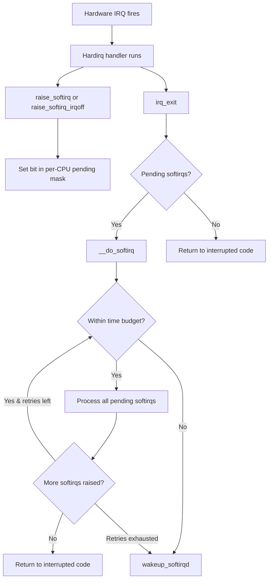
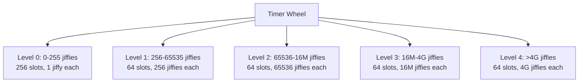
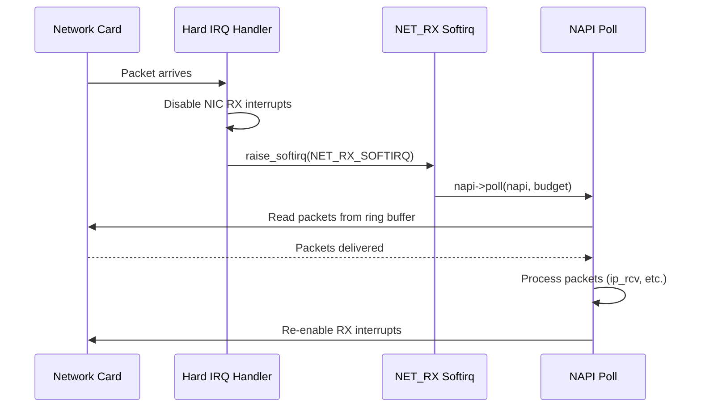
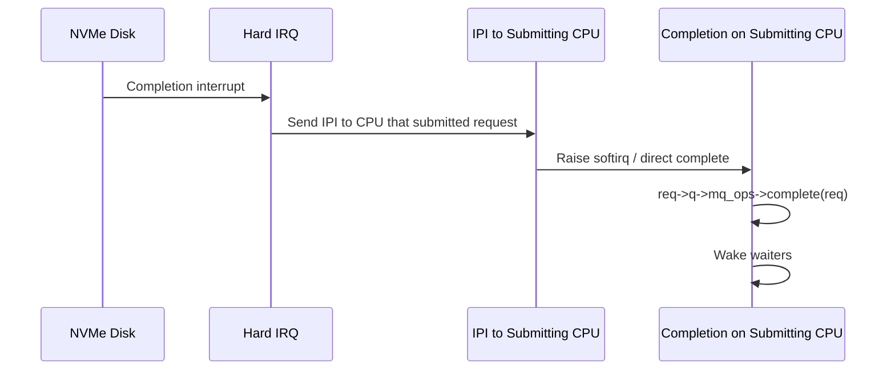
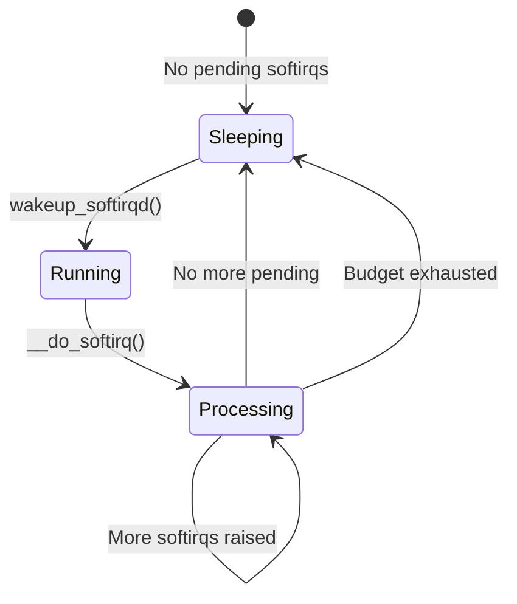
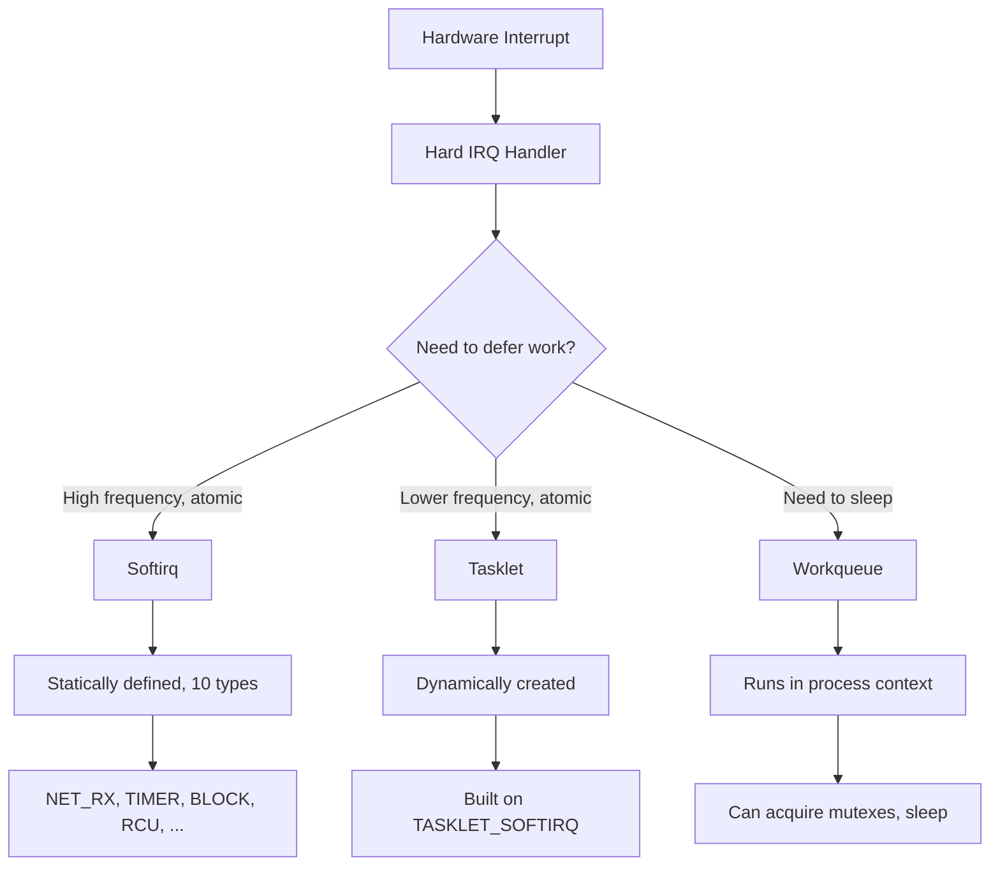

# Softirqs

## Introduction

Softirqs (software interrupts) are the kernel's primary mechanism for **deferred interrupt processing** — work that was initiated by a hardware interrupt handler but is too substantial to complete in hardirq context. They represent the "bottom half" of interrupt handling, executing with interrupts enabled but still in atomic (non-sleeping) context.

Softirqs are a static, compile-time defined set of high-performance deferred handlers. Unlike tasklets and workqueues, softirqs cannot be dynamically created — they are fixed at kernel build time. This static nature gives them extremely low overhead and makes them suitable for the highest-frequency paths in the kernel: networking, block I/O, timers, and scheduling.

## The Softirq Architecture

### Static Definition

Softirqs are defined as an enumeration at compile time:

```c
enum {
    HI_SOFTIRQ = 0,      /* Highest priority — used by tasklets */
    TIMER_SOFTIRQ,        /* Timer expiration processing */
    NET_TX_SOFTIRQ,       /* Network packet transmission */
    NET_RX_SOFTIRQ,       /* Network packet reception */
    BLOCK_SOFTIRQ,        /* Block device I/O completion */
    IRQ_POLL_SOFTIRQ,     /* IRQ polling */
    TASKLET_SOFTIRQ,      /* Tasklet processing */
    SCHED_SOFTIRQ,        /* Scheduler load balancing */
    HRTIMER_SOFTIRQ,      /* High-resolution timer (unused since 3.14) */
    RCU_SOFTIRQ,          /* RCU callback processing */
    NR_SOFTIRQS           /* Count: 10 */
};
```

Each softirq has:
- A **handler function** registered at boot via `open_softirq()`
- A **per-CPU pending bitmask** tracking which softirqs need processing
- A **priority order** (lower enum value = higher priority)

### Key Data Structures

```c
/* Per-CPU softirq state */
struct softirq_action {
    void (*action)(struct softirq_action *);
};

/* Global array of 10 softirq handlers */
static struct softirq_action softirq_vec[NR_SOFTIRQS] __cacheline_aligned_in_smp;

/* Per-CPU data (in kernel/softirq.c) */
DEFINE_PER_CPU(struct task_struct *, ksoftirqd);    /* ksoftirqd thread */
DEFINE_PER_CPU(__u32, __softirq_pending);           /* Pending bitmask */
```

### Per-CPU Pending Bitmask

The pending bitmask is the core scheduling mechanism:

```c
/* Setting a bit (raising a softirq) */
static inline void __raise_softirq_irqoff(unsigned int nr)
{
    trace_softirq_raise(nr);
    or_softirq_pending(1UL << nr);
}

/* Reading pending bits */
#define local_softirq_pending() \
    __this_cpu_read(__softirq_pending)

/* Clearing all pending bits */
#define set_softirq_pending(x) \
    __this_cpu_write(__softirq_pending, (x))
```

The bitmask is **per-CPU** — there's no global pending state. A softirq raised on CPU 0 runs on CPU 0.

## Softirq Processing

### When Softirqs Are Checked

Softirqs are processed at the following points in the kernel:

1. **After returning from a hardware interrupt** — `irq_exit()` checks for pending softirqs
2. **After waking `ksoftirqd`** — the per-CPU kernel thread
3. **In `local_bh_enable()`** — when bottom-half processing is re-enabled
4. **In the idle loop** — `do_idle()` processes pending softirqs before sleeping
5. **After waking from `schedule()`** — if there are pending softirqs

### irq_exit() — The Primary Entry Point

```c
/* kernel/softirq.c */
void irq_exit(void)
{
    /* ... architecture-specific stuff ... */

    if (!in_interrupt() && local_softirq_pending())
        invoke_softirq();  /* Process pending softirqs */
}

static inline void invoke_softirq(void)
{
    if (ksoftirqd_running(local_softirq_pending()))
        return;  /* ksoftirqd will handle it */

    if (on_thread_stack()) {
        /* Called from interrupt handler on kernel stack */
        __do_softirq();
    } else {
        /* Called from ksoftirqd or other context */
        do_softirq();
    }
}
```

### The __do_softirq Function

The core softirq processing loop is `__do_softirq()` in `kernel/softirq.c`:

```c
asmlinkage __visible void __softirq_entry __do_softirq(void)
{
    unsigned long end = jiffies + MAX_SOFTIRQ_TIME;  /* 2ms budget */
    unsigned long old_flags = current->flags;
    int max_restart = MAX_SOFTIRQ_RESTART;           /* 10 iterations */
    struct softirq_action *h;
    __u32 pending;
    int softirq_bit;

    /* Read and clear pending softirqs */
    pending = local_softirq_pending();
    __local_bh_disable_ip(_RET_IP_, SOFTIRQ_OFFSET);

restart:
    /* Reset pending bitmask */
    set_softirq_pending(0);

    local_irq_enable();

    h = softirq_vec;

    /* Process each pending softirq in priority order */
    while ((softirq_bit = ffs(pending))) {
        h += softirq_bit - 1;
        h->action(h);    /* Call the handler */
        h++;
        pending >>= softirq_bit;
    }

    local_irq_disable();

    /* Check for new softirqs raised during processing */
    pending = local_softirq_pending();
    if (pending) {
        if (--max_restart && !need_resched())
            goto restart;    /* Process again (up to 10 times) */

        /* Too much work or need to reschedule — wake ksoftirqd */
        wakeup_softirqd();
    }

    __local_bh_enable(SOFTIRQ_OFFSET);
    tsk_restore_flags(current, old_flags, PF_MEMALLOC);
}
```

### Processing Flow



### Time and Iteration Limits

To prevent softirq processing from starving the system, `__do_softirq()` enforces limits:

- **Time budget**: 2 milliseconds (`MAX_SOFTIRQ_TIME = 2 * HZ / 1000`)
- **Iteration limit**: 10 restarts (`MAX_SOFTIRQ_RESTART = 10`)
- If either limit is exceeded, remaining work is deferred to `ksoftirqd`

**Why these limits matter:**

```bash
# If softirqs run too long, user-space processes starve
# ksoftirqd (nice 19) takes over but at low priority

# View softirq processing time
$ sudo perf record -e softirq:softirq_entry -e softirq:softirq_exit -a -- sleep 1
$ sudo perf script | head -20
# <idle>-0  [000]  1234.567890: softirq_entry: vec=3 [action=NET_RX]
# <idle>-0  [000]  1234.567912: softirq_exit:  vec=3 [action=NET_RX]
# 22 microseconds — well within budget
```

## The Built-in Softirqs

### HI_SOFTIRQ (Priority: Highest)

Used by the tasklet subsystem for high-priority tasklets (`tasklet_hi_schedule()`). See [Tasklets](tasklets.md).

### TIMER_SOFTIRQ

Processes expired timers managed by the kernel's timer wheel and hrtimer subsystem:

```c
static void run_timer_softirq(struct softirq_action *h)
{
    /* Process timer wheel expirations */
    if (time_after_eq(jiffies, base->clk))
        expire_timers(base, heads, levels);
}
```

**Timer wheel structure:**



### NET_TX_SOFTIRQ

Deferred network packet transmission. When a network driver's hardirq handler detects that a TX queue has space, it raises `NET_TX_SOFTIRQ` to complete pending transmissions:

```c
/* Raised from hardirq context */
raise_softirq(NET_TX_SOFTIRQ);

/* Handler */
static __latent_entropy void net_tx_action(struct softirq_action *h)
{
    /* Complete TX completions, free sk_buffs */
    /* Process completion queues */
    
    struct softnet_data *sd = this_cpu_ptr(&softnet_data);
    
    /* Process completion queue */
    if (sd->completion_queue) {
        struct sk_buff *skb;
        while ((skb = __skb_dequeue(&sd->completion_queue))) {
            dev_consume_skb_any(skb);
        }
    }
}
```

### NET_RX_SOFTIRQ

The most performance-critical softirq. Handles incoming network packet processing — the entire NAPI (New API) polling mechanism runs here:

```c
static __latent_entropy void net_rx_action(struct softirq_action *h)
{
    struct softnet_data *sd = this_cpu_ptr(&softnet_data);
    unsigned long time_limit = jiffies + 2;  /* 2 jiffies budget */
    int budget = netdev_budget;              /* Default: 300 */
    struct napi_struct *n, *tmp;

    list_for_each_entry_safe(n, tmp, &sd->poll_list, poll_list) {
        int work, weight;

        weight = n->weight;
        work = 0;

        if (test_bit(NAPI_STATE_SCHED, &n->state)) {
            work = n->poll(n, weight);
            trace_napi_poll(n, work, budget);
        }

        budget -= work;

        if (work >= weight) {
            /* Budget exhausted for this NAPI, but more work remains */
            if (napi_disable_pending(n))
                napi_complete(n);
            else
                list_move_tail(&n->poll_list, &sd->poll_list);
        }

        if (budget <= 0 || time_after_eq(jiffies, time_limit)) {
            sd->time_squeeze++;
            raise_softirq(NET_RX_SOFTIRQ);  /* More work later */
            break;
        }
    }
}
```

The NAPI model: instead of processing every packet in the hardirq handler (which would take too long and disable interrupts for too long), the NIC driver:

1. Disables further RX interrupts at the hardware level
2. Raises `NET_RX_SOFTIRQ`
3. The softirq handler **polls** the NIC for packets
4. When no more packets are available, re-enables RX interrupts



### NAPI in Detail

```c
/* NAPI structure */
struct napi_struct {
    struct list_head poll_list;  /* List of NAPI instances with work */
    unsigned long state;         /* NAPI_STATE_SCHED, etc. */
    int weight;                  /* Budget per poll cycle (default 64) */
    int poll_count;              /* Number of polls this cycle */
    struct net_device *dev;      /* Network device */
    int (*poll)(struct napi_struct *, int);  /* Poll callback */
    /* ... */
};

/* Driver's NAPI poll function */
static int my_napi_poll(struct napi_struct *napi, int budget)
{
    struct my_device *dev = napi_to_mydev(napi);
    int work_done = 0;

    while (work_done < budget) {
        struct sk_buff *skb = my_rx_dequeue(dev);
        if (!skb)
            break;
        napi_gro_receive(napi, skb);  /* GRO: aggregate packets */
        work_done++;
    }

    if (work_done < budget) {
        napi_complete(napi);  /* Done, re-enable interrupts */
        my_enable_rx_irq(dev);
    }

    return work_done;
}
```

**NAPI budget system:**

| Parameter | Default | Tunable | Description |
|-----------|---------|---------|-------------|
| `weight` | 64 | Per-NAPI | Max packets per poll call |
| `netdev_budget` | 300 | `/proc/sys/net/core/netdev_budget` | Max total packets per NET_RX cycle |
| `netdev_budget_usecs` | 2000 | `/proc/sys/net/core/netdev_budget_usecs` | Max time per NET_RX cycle (μs) |
| `dev_weight` | 64 | `/proc/sys/net/core/dev_weight` | Default weight for new NAPI instances |

### NAPI Busy Polling

For ultra-low latency, NAPI supports **busy polling** — the application polls for packets without waiting for interrupts:

```bash
# Enable busy polling globally
$ echo 50 > /proc/sys/net/core/busy_read  # Poll for 50μs before sleeping

# Per-socket via setsockopt()
# setsockopt(fd, SOL_SOCKET, SO_BUSY_POLL, &timeout, sizeof(timeout));
```

### BLOCK_SOFTIRQ

Handles block device I/O completion. When a disk I/O request completes (interrupt from the disk controller), the hardirq handler raises `BLOCK_SOFTIRQ` to process the completion:

```c
static void blk_done_softirq(struct softirq_action *h)
{
    /* Process completed block requests */
    list_for_each_entry_safe(req, next, &cpu_dongle_list, ipi_list) {
        req->q->mq_ops->complete(req);
    }
}
```

On modern kernels with blk-mq, I/O completions are often processed via IPIs to the CPU that submitted the request, rather than via softirqs.

### blk-mq Completion Flow



### TASKLET_SOFTIRQ

Normal-priority tasklet processing. See [Tasklets](tasklets.md).

### SCHED_SOFTIRQ

The scheduler's load-balancing softirq, raised periodically by the timer tick to rebalance tasks across CPUs:

```c
static void run_rebalance_domains(struct softirq_action *h)
{
    /* Trigger scheduler domain load balancing */
    rebalance_domains(cpu, idle);
}
```

**Scheduler domains** define the hierarchy of CPU groupings for load balancing:

```bash
# View scheduler domains
$ ls /sys/kernel/debug/sched/domains/
cpu0/  cpu1/  cpu2/  cpu3/  cpu4/  cpu5/  cpu6/  cpu7/

$ cat /sys/kernel/debug/sched/domains/cpu0/domain0/name
MC    # Multi-Core (same physical package)

$ cat /sys/kernel/debug/sched/domains/cpu0/domain1/name
NUMA  # NUMA node
```

### RCU_SOFTIRQ

Processes RCU (Read-Copy-Update) callbacks. When a grace period expires, all deferred RCU callbacks are invoked in this softirq:

```c
static void rcu_core_si(struct softirq_action *h)
{
    rcu_core();
}
```

RCU uses softirqs for callback processing because:
- Callbacks must run in atomic context
- Callbacks can be numerous (thousands of grace period completions)
- Processing must not starve user-space

See [RCU](../sync/rcu.md) for details.

## ksoftirqd

When softirq processing exceeds the time/iteration budget, the per-CPU kernel thread `ksoftirqd` takes over:

```bash
$ ps -eo pid,ni,comm | grep ksoftirqd
   12  19 ksoftirqd/0
   13  19 ksoftirqd/1
   14  19 ksoftirqd/2
   15  19 ksoftirqd/3
```

The `ksoftirqd` thread runs at nice level 19 (low priority) — it yields to all other work. This prevents softirq storms from starving user-space processes:

```c
static int ksoftirqd(void *data)
{
    while (!kthread_should_stop()) {
        preempt_disable();

        if (!local_softirq_pending()) {
            preempt_enable();
            schedule();
            continue;
        }

        __do_softirq();
        preempt_enable();
        cond_resched();
    }
    return 0;
}
```

### ksoftirqd Behavior



**Problem: Softirq starvation**

If `NET_RX_SOFTIRQ` keeps firing (high packet rate), `ksoftirqd` may not get a chance to run, starving other softirqs and user-space. The kernel addresses this with the time budget and by ensuring softirqs are processed in priority order.

### Detecting Softirq Overload

```bash
# Check ksoftirqd CPU usage
$ top -bn1 | grep ksoftirqd
   12 root      20   0       0      0   0 S  0.0  0.0   0:00.00 ksoftirqd/0

# High CPU usage indicates softirq overload
# Use perf to identify which softirq is consuming time
$ sudo perf record -e softirq:softirq_entry -a -- sleep 5
$ sudo perf report --sort=comm,event

# Use bpftrace for real-time analysis
$ sudo bpftrace -e '
tracepoint:softirq:softirq_entry {
    @start[args->vec] = nsecs;
}
tracepoint:softirq:softirq_exit /@start[args->vec]/ {
    @usecs[args->vec] = hist((nsecs - @start[args->vec]) / 1000);
    delete(@start[args->vec]);
}'
```

## Raising Softirqs

### From Any Context

```c
void raise_softirq(unsigned int nr);
```

Sets the bit for softirq `nr` in the current CPU's pending mask. If called from hardirq context, it also calls `irq_exit()` to ensure the softirq is processed on return. If called from process context, it wakes `ksoftirqd`.

### From Hardirq Context (Optimized)

```c
void raise_softirq_irqoff(unsigned int nr);
```

Slightly faster variant when you know interrupts are already disabled. Sets the pending bit without the interrupt enable/disable dance.

### Per-CPU Specific

```c
/* Raise softirq on a specific CPU */
void __raise_softirq_irqoff(unsigned int nr);
```

The pending bitmask is per-CPU, so there's no locking needed for the set operation:

```c
static inline void __raise_softirq_irqoff(unsigned int nr)
{
    trace_softirq_raise(nr);
    or_softirq_pending(1UL << nr);
}
```

### Raising Softirqs from Different Contexts

| Context | Function | Behavior |
|---------|----------|----------|
| Hardirq | `raise_softirq_irqoff()` | Sets pending bit, softirq runs on return from hardirq |
| Softirq | `raise_softirq_irqoff()` | Sets pending bit, processed in current `__do_softirq` iteration |
| Process | `raise_softirq()` | Sets pending bit, wakes `ksoftirqd` |
| NMI | `raise_softirq_irqoff()` | Sets pending bit, processed when NMI returns to normal flow |

## Registering Softirq Handlers

Softirq handlers are registered at boot time (or module init) using `open_softirq()`:

```c
void open_softirq(int nr, void (*action)(struct softirq_action *));

/* Example: register NET_RX softirq (done in net/core/dev.c) */
open_softirq(NET_RX_SOFTIRQ, net_rx_action);
```

**Constraints:**
- Can only be called once per softirq number (no re-registration)
- The handler runs in softirq context (cannot sleep)
- The handler is called with a pointer to its own `softirq_action` entry

### Registration Order

```c
/* kernel/softirq.c — called from start_kernel() */
void __init softirq_init(void)
{
    int cpu;

    for_each_possible_cpu(cpu) {
        per_cpu(tasklet_vec, cpu).tail =
            &per_cpu(tasklet_vec, cpu).head;
        per_cpu(hi_tasklet_vec, cpu).tail =
            &per_cpu(hi_tasklet_vec, cpu).head;
    }

    open_softirq(HI_SOFTIRQ, tasklet_hi_action);
    open_softirq(TASKLET_SOFTIRQ, tasklet_action);
}

/* net/core/dev.c — called from net_dev_init() */
static int __init net_dev_init(void)
{
    /* ... */
    open_softirq(NET_TX_SOFTIRQ, net_tx_action);
    open_softirq(NET_RX_SOFTIRQ, net_rx_action);
    /* ... */
}

/* kernel/time/timer.c */
void __init init_timers(void)
{
    open_softirq(TIMER_SOFTIRQ, run_timer_softirq);
}

/* kernel/rcu/tree.c */
static int __init rcu_spawn_gp_kthread(void)
{
    open_softirq(RCU_SOFTIRQ, rcu_core_si);
    /* ... */
}
```

## Softirq Context Properties

Softirq context is **not** the same as process context:

| Property | Softirq Context | Process Context |
|----------|----------------|-----------------|
| Can sleep? | ❌ No | ✅ Yes |
| Can acquire mutexes? | ❌ No | ✅ Yes |
| Can acquire spinlocks? | ✅ Yes | ✅ Yes |
| Can call `GFP_KERNEL` alloc? | ❌ No | ✅ Yes |
| Can call `GFP_ATOMIC` alloc? | ✅ Yes | ✅ Yes |
| Preemptible? | ❌ No (BH disabled) | ✅ Yes |
| `in_softirq()` returns | true | false |
| Can call `schedule()`? | ❌ No | ✅ Yes |
| Can access user memory? | ❌ No (generally) | ✅ Yes |

## Monitoring Softirqs

### /proc/softirqs

```bash
$ cat /proc/softirqs
                    CPU0       CPU1       CPU2       CPU3
          HI:          3          0          1          0
       TIMER:    8945230    8934120    8923010    8911900
      NET_TX:       1234       2345       3456       4567
      NET_RX:     123456     234567     345678     456789
       BLOCK:      45678      56789      67890      78901
    IRQ_POLL:          0          0          0          0
     TASKLET:       5678       6789       7890       8901
       SCHED:    9876543    9865432    9854321    9843210
     HRTIMER:          0          0          0          0
         RCU:    9876543    9865432    9854321    9843210
```

High `NET_RX` counts on a single CPU indicate a potential bottleneck. Consider using multi-queue NICs with RSS and RPS to distribute load.

### Analyzing /proc/softirqs

```bash
# Calculate softirq rate per second (1-second sample)
$ cat /proc/softirqs > /tmp/s1; sleep 1; cat /proc/softirqs > /tmp/s2
$ paste /tmp/s1 /tmp/s2 | awk '
/^[A-Z]/ {
    name = $1
    for (i = 2; i <= NF; i++) {
        cpu[i-2] += ($i - $(i+NF))
    }
}
END {
    for (i in cpu) printf "CPU%d: %d/sec\n", i, cpu[i]
}'

# Identify which softirq is consuming the most time
$ sudo perf stat -e 'softirq:*' -a sleep 5
# Performance counter stats for 'system wide':
#     softirq:softirq_entry    1234567
#     softirq:softirq_exit     1234567
```

### /proc/stat

```bash
$ grep softirq /proc/stat
softirq 12345678 3 8945230 1234 123456 45678 0 5678 9876543 0 9876543
```

The first number is the total count, followed by per-type counts.

### ftrace

```bash
# Trace softirq entry/exit
$ echo 1 > /sys/kernel/debug/tracing/events/softirq/enable
$ cat /sys/kernel/debug/tracing/trace
          <idle>-0     [000] d.h1  1234.567890: softirq_entry: vec=3 [action=NET_RX]
          <idle>-0     [000] d.h1  1234.568012: softirq_exit:  vec=3 [action=NET_RX]
```

### Using trace-cmd for Softirq Analysis

```bash
# Record softirq events
$ sudo trace-cmd record -e softirq -e irq/softirq_raise sleep 5

# Analyze latency (time between raise and entry)
$ trace-cmd report | grep -E "softirq_(raise|entry)" | head -20
# <idle>-0  [000]  1234.567: softirq_raise: vec=3 [action=NET_RX]
# <idle>-0  [000]  1234.568: softirq_entry: vec=3 [action=NET_RX]
# 1 microsecond latency — excellent

# Measure time spent in each softirq
$ sudo bpftrace -e '
tracepoint:softirq:softirq_entry { @start[args->vec] = nsecs; }
tracepoint:softirq:softirq_exit /@start[args->vec]/ {
    $dur = nsecs - @start[args->vec];
    @time[args->vec] = sum($dur);
    @count[args->vec] = count();
    @avg_us[args->vec] = avg($dur / 1000);
    delete(@start[args->vec]);
}'
```

## Softirq vs Other Bottom Halves



| Feature | Softirq | Tasklet | Workqueue |
|---------|---------|---------|-----------|
| Context | Softirq (atomic) | Softirq (atomic) | Process (can sleep) |
| Registration | Static, boot-time | Dynamic, runtime | Dynamic, runtime |
| Concurrency | Multiple CPUs simultaneously | Serialized per tasklet | Concurrency-managed |
| Use case | High-frequency I/O | Simple deferred work | Complex, sleeping work |
| Latency | Very low | Low | Higher (scheduling) |
| Preemption | No | No | Yes |

## Softirq Performance Tuning

### Tuning NET_RX Processing

```bash
# Increase NAPI budget for high-throughput networks
$ echo 600 > /proc/sys/net/core/netdev_budget
$ echo 4000 > /proc/sys/net/core/netdev_budget_usecs

# Increase per-device weight
$ echo 128 > /proc/sys/net/core/dev_weight

# Enable busy polling for low latency
$ echo 50 > /proc/sys/net/core/busy_read
$ echo 50 > /proc/sys/net/core/busy_poll
```

### Softirq CPU Pinning

```bash
# Pin ksoftirqd to specific CPUs for isolation
$ sudo taskset -p 0f $(pgrep ksoftirqd/0)  # Allow on CPUs 0-3

# For real-time workloads, isolate CPUs from softirq processing
# In kernel command line:
# isolcpus=4-7 nohz_full=4-7

# Then pin IRQs and softirqs to non-isolated CPUs
```

### Softirq Latency Profiling

```bash
# Measure the time between softirq raise and entry
$ sudo bpftrace -e '
tracepoint:irq:softirq_raise {
    @raise_time[args->vec] = nsecs;
}
tracepoint:softirq:softirq_entry /@raise_time[args->vec]/ {
    $latency = nsecs - @raise_time[args->vec];
    @latency_us[args->vec] = hist($latency / 1000);
    delete(@raise_time[args->vec]);
}'
# Output shows histogram of latency in microseconds per softirq type
```

## Writing a New Softirq (Kernel Module)

While softirqs are typically static, kernel modules can register handlers for existing softirq numbers:

```c
#include <linux/module.h>
#include <linux/interrupt.h>

static void my_softirq_handler(struct softirq_action *h)
{
    /* Process deferred work */
    pr_info("my_softirq executed on CPU %d\n", smp_processor_id());
}

static int __init my_softirq_init(void)
{
    open_softirq(MY_SOFTIRQ_NUM, my_softirq_handler);
    raise_softirq(MY_SOFTIRQ_NUM);
    return 0;
}

static void __exit my_softirq_exit(void)
{
    /* Note: there is no close_softirq() API */
    /* Softirq handlers cannot be unregistered */
}

module_init(my_softirq_init);
module_exit(my_softirq_exit);
MODULE_LICENSE("GPL");
```

**Warning**: You cannot create new softirq numbers. You can only register handlers for existing unused numbers. In practice, modules should use tasklets or workqueues instead.

## References

- [The Linux Kernel Documentation](https://docs.kernel.org/)
- [GNU Project Documentation](https://www.gnu.org/doc/doc.html)
- [GNU Manuals](https://www.gnu.org/manual/manual.html)
- [Free Software Directory](https://directory.fsf.org/wiki/Main_Page)
- [Planet GNU](https://planet.gnu.org/)
- [Free Software Books](https://www.gnu.org/doc/other-free-books.html)

- [Linux Kernel Source: kernel/softirq.c](https://git.kernel.org/pub/scm/linux/kernel/git/torvalds/linux.git/tree/kernel/softirq.c)
- [Linux Device Drivers, 3rd Edition — Chapter 10: Softirqs and Tasklets](https://lwn.net/Kernel/LDD3/)
- [Understanding the Linux Kernel — Chapter 4: Deferring Work](https://www.oreilly.com/library/view/understanding-the-linux/0596005652/)
- [NAPI Documentation](https://www.kernel.org/doc/html/latest/networking/napi.html)
- [Thomas Gleixner — "A big ball of mud" — IRQ subsystem history](https://lpc.events/event/4/contributions/343/)

## Related Topics

- [Interrupts Overview](overview.md) — IRQ numbers, routing, top-half/bottom-half
- [Hardware Interrupts](hardware.md) — APIC, IOAPIC, MSI/MSI-X
- [Interrupt Handlers](handlers.md) — request_irq, threaded interrupts
- [Tasklets](tasklets.md) — Built on top of softirqs
- [Workqueues](workqueues.md) — Process-context deferred work
- [RCU](../sync/rcu.md) — Uses RCU_SOFTIRQ for callback processing
