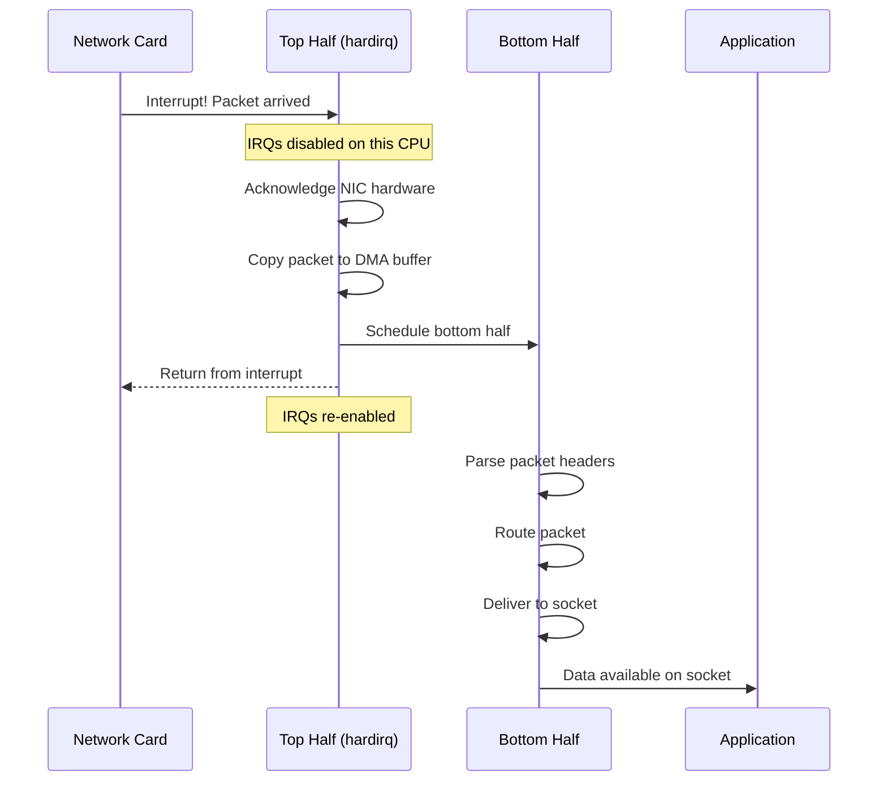
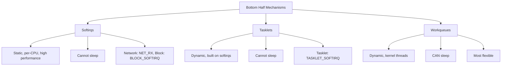
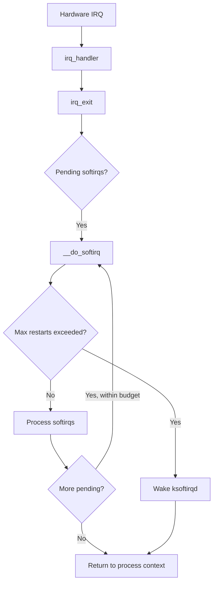
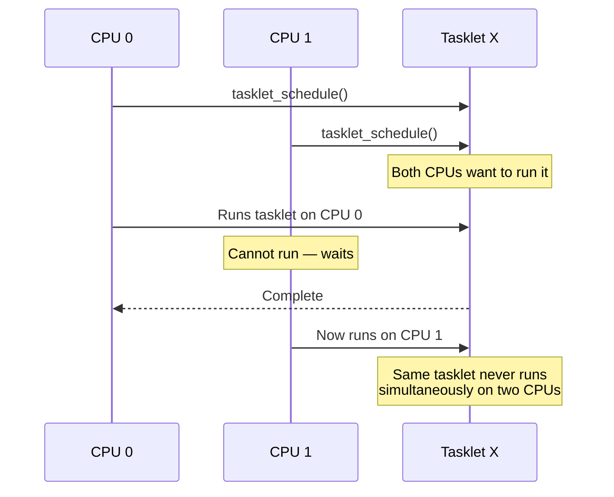
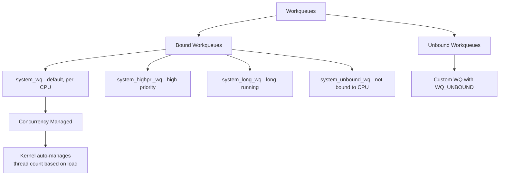
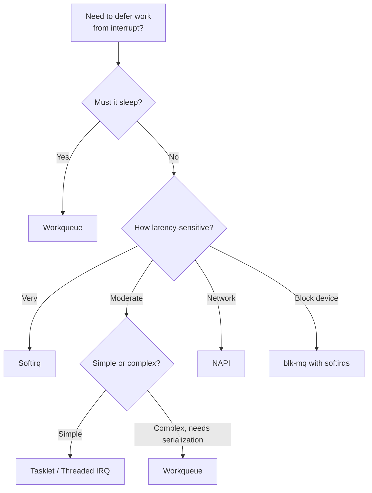

# Top and Bottom Halves: Interrupt Processing Design

## Introduction

When a hardware device raises an interrupt, the kernel must respond quickly to acknowledge the hardware and prevent further interrupts, but the actual processing of the data may be time-consuming. The **top half / bottom half** pattern splits interrupt handling into two phases:

1. **Top half** (hardirq): Runs immediately with interrupts disabled. Does the minimum work—acknowledge the hardware, copy data to a buffer, schedule the bottom half.
2. **Bottom half**: Runs later, with interrupts enabled. Performs the bulk of the processing.

This design minimizes the time that interrupts are disabled, improving system responsiveness and reducing latency.

## Why Split Interrupt Handling?

Consider a network card receiving a packet:



If all processing happened in the top half:
- Other interrupts would be delayed.
- Timer interrupts could be missed, causing clock drift.
- Network latency would spike under load.
- The system would feel unresponsive.

### The Split

```c
/* TOP HALF: runs in hardirq context, interrupts disabled */
irqreturn_t network_irq_handler(int irq, void *dev_id) {
    struct net_device *dev = dev_id;
    
    /* 1. Acknowledge the interrupt to the hardware */
    iowrite32(IRQ_ACK, dev->regs + IRQ_STATUS);
    
    /* 2. Schedule NAPI (bottom half) */
    napi_schedule(&dev->napi);
    
    return IRQ_HANDLED;
}

/* BOTTOM HALF: runs in softirq context, interrupts enabled */
int network_poll(struct napi_struct *napi, int budget) {
    struct net_device *dev = napi->dev;
    int work_done = 0;
    
    while (work_done < budget) {
        struct sk_buff *skb = read_packet_from_dma(dev);
        if (!skb)
            break;
        
        /* Process packet (expensive work) */
        netif_receive_skb(skb);
        work_done++;
    }
    
    if (work_done < budget)
        napi_complete(napi);
    
    return work_done;
}
```

## Bottom Half Mechanisms

The Linux kernel provides three main bottom-half mechanisms, each with different characteristics.



### Comparison Table

| Feature | Softirqs | Tasklets | Workqueues |
|---------|----------|----------|------------|
| Context | Softirq (BH) | Softirq (BH) | Process (kthread) |
| Can sleep | No | No | Yes |
| Concurrent on multiple CPUs | Yes | No (serialized) | Yes |
| Static/Dynamic | Static (compile-time) | Dynamic | Dynamic |
| Latency | Lowest | Low | Higher |
| Typical use | Network, block, timers | Driver-specific BH | Deferred work, I/O |
| Priority | Higher than process | Higher than process | Normal process |

## Softirqs

Softirqs are the lowest-level bottom-half mechanism. They are statically defined at compile time and can run concurrently on multiple CPUs.

### Built-in Softirqs

```c
/* include/linux/interrupt.h */
enum {
    HI_SOFTIRQ = 0,       /* Highest priority */
    TIMER_SOFTIRQ,         /* Timer subsystem */
    NET_TX_SOFTIRQ,        /* Network transmit */
    NET_RX_SOFTIRQ,        /* Network receive */
    BLOCK_SOFTIRQ,         /* Block device */
    IRQ_POLL_SOFTIRQ,      /* IRQ polling */
    TASKLET_SOFTIRQ,       /* Tasklets */
    SCHED_SOFTIRQ,         /* Scheduler */
    HRTIMER_SOFTIRQ,       /* High-resolution timers */
    RCU_SOFTIRQ,           /* RCU callbacks */
    NR_SOFTIRQS            /* 10 total */
};
```

### Softirq Execution

Softirqs are processed in `__do_softirq()`, which runs:

1. At the end of every hardware interrupt return (`irq_exit()`).
2. When `local_bh_enable()` is called and pending softirqs exist.
3. On the `ksoftirqd/N` per-CPU kernel thread (when overloaded).

```c
/* kernel/softirq.c (simplified) */
asmlinkage __visible void __softirq_entry __do_softirq(void)
{
    unsigned long pending = local_softirq_pending();
    int max_restart = MAX_SOFTIRQ_RESTART;
    struct softirq_action *h;

    /* Disable bottom halves (not hardirqs) */
    local_bh_disable();

    /* Process pending softirqs in priority order */
    h = softirq_vec;
    while (pending) {
        if (pending & 1) {
            h->action(h);  /* Call the handler */
        }
        h++;
        pending >>= 1;
    }

    /* If we've processed too many, defer to ksoftirqd */
    if (max_restart) {
        if (local_softirq_pending())
            wakeup_softirqd();  /* Wake ksoftirqd */
    }

    local_bh_enable();
}
```



### Registering a Softirq

```c
#include <linux/interrupt.h>

/* Define the softirq handler */
static void my_softirq_handler(struct softirq_action *h)
{
    /* Process work — cannot sleep! */
    struct my_data *data = get_pending_data();
    while (data) {
        process_item(data);
        data = data->next;
    }
}

/* Register at initialization */
static int __init my_init(void)
{
    open_softirq(MY_SOFTIRQ, my_softirq_handler);
    return 0;
}

/* Raise the softirq from interrupt context */
irqreturn_t my_irq_handler(int irq, void *dev_id)
{
    /* Do minimal top-half work */
    ack_interrupt();
    
    /* Schedule bottom half */
    raise_softirq(MY_SOFTIRQ);
    
    return IRQ_HANDLED;
}
```

### Per-CPU Softirqs

Since softirqs can run concurrently on all CPUs, they use per-CPU data structures:

```c
DEFINE_PER_CPU(struct my_data, softirq_data);

static void my_softirq_handler(struct softirq_action *h)
{
    struct my_data *data = this_cpu_ptr(&softirq_data);
    /* Process per-CPU data — no locking needed */
    process_data(data);
}
```

## Tasklets

Tasklets are built on top of softirqs (`TASKLET_SOFTIRQ` and `HI_SOFTIRQ`). They provide a simpler API with automatic serialization: the same tasklet cannot run on two CPUs simultaneously.

### Tasklet API

```c
#include <linux/interrupt.h>

/* Method 1: Static declaration */
DECLARE_TASKLET(my_tasklet, my_tasklet_func);

/* Method 2: Dynamic allocation */
struct tasklet_struct my_tasklet;

void my_tasklet_func(struct tasklet_struct *t)
{
    /* This runs in softirq context — cannot sleep */
    /* Guaranteed: same tasklet won't run on another CPU */
    struct my_data *data = from_tasklet(data, t, tasklet);
    process_data(data);
}

/* Initialize */
tasklet_init(&my_tasklet, my_tasklet_func, data);

/* Schedule (from interrupt context) */
tasklet_schedule(&my_tasklet);

/* Disable/enable */
tasklet_disable(&my_tasklet);   /* Wait if running, then disable */
tasklet_enable(&my_tasklet);    /* Re-enable */

/* Kill (remove permanently) */
tasklet_kill(&my_tasklet);      /* Wait if scheduled/running */
```

### Tasklet Serialization



### When to Use Tasklets

Tasklets are being deprecated in favor of threaded IRQs and workqueues. They remain in use for:

- Simple, short-lived deferred work.
- Code that needs the softirq context (no sleeping).
- Legacy drivers that haven't been updated.

```c
/* Modern alternative: threaded IRQ */
request_threaded_irq(irq, 
    hardirq_handler,     /* Top half (optional) */
    thread_fn,           /* Bottom half — CAN sleep! */
    IRQF_ONESHOT,        /* Keep IRQ disabled until thread runs */
    "my_device", dev);
```

## Workqueues

Workqueues are the most flexible bottom-half mechanism. They defer work to **kernel threads**, which means the deferred code **can sleep**, allocate memory with `GFP_KERNEL`, take mutexes, and perform blocking I/O.

### Workqueue API

```c
#include <linux/workqueue.h>

/* Static declaration */
DECLARE_WORK(my_work, my_work_func);

/* Dynamic declaration */
struct work_struct my_work;

void my_work_func(struct work_struct *work)
{
    /* Runs in process context — CAN sleep! */
    struct my_data *data = from_work(data, work, work);
    
    mutex_lock(&data->mutex);
    process_data(data);
    mutex_unlock(&data->mutex);
}

/* Initialize */
INIT_WORK(&my_work, my_work_func);

/* Schedule */
queue_work(system_wq, &my_work);        /* System workqueue */
queue_work_on(cpu, system_wq, &my_work); /* Specific CPU */

/* Wait for completion */
flush_work(&my_work);     /* Wait for specific work */
flush_scheduled_work();   /* Wait for all work on system_wq */

/* Cancel */
cancel_work_sync(&my_work); /* Cancel and wait if running */
```

### Workqueue Types



| Workqueue | Description | Use Case |
|-----------|-------------|----------|
| `system_wq` | Default, per-CPU, concurrency managed | Most work items |
| `system_highpri_wq` | High priority, per-CPU | Latency-sensitive work |
| `system_long_wq` | For long-running work | Avoids starving other work |
| `system_unbound_wq` | Not CPU-bound | Flexible placement |
| Custom `alloc_workqueue()` | User-defined | Special requirements |

### Creating Custom Workqueues

```c
/* Create a dedicated workqueue */
struct workqueue_struct *my_wq;

/* Ordered: serializes all work items */
my_wq = alloc_workqueue("my_wq", WQ_UNBOUND, 0);

/* High-priority, bound to CPU */
my_wq = alloc_ordered_workqueue("my_wq", WQ_HIGHPRI);

/* Bound, max 4 concurrent */
my_wq = alloc_workqueue("my_wq", 0, 4);

/* Use it */
queue_work(my_wq, &my_work);

/* Destroy */
destroy_workqueue(my_wq);
```

### Delayed Work

```c
DECLARE_DELAYED_WORK(my_delayed_work, my_work_func);

/* Schedule to run after 100ms */
queue_delayed_work(system_wq, &my_delayed_work, 
                   msecs_to_jiffies(100));

/* Cancel */
cancel_delayed_work_sync(&my_delayed_work);
```

## Design Patterns

### Pattern 1: IRQ + Tasklet

```c
/* Classic pattern for simple device drivers */
static irqreturn_t my_hardirq(int irq, void *dev_id)
{
    struct my_device *dev = dev_id;
    
    /* Read status, acknowledge hardware */
    u32 status = readl(dev->regs + IRQ_STATUS);
    writel(status, dev->regs + IRQ_STATUS);
    
    /* Store status for bottom half */
    dev->irq_status = status;
    
    /* Schedule tasklet */
    tasklet_schedule(&dev->tasklet);
    
    return IRQ_HANDLED;
}

static void my_tasklet(struct tasklet_struct *t)
{
    struct my_device *dev = from_tasklet(dev, t, tasklet);
    u32 status = dev->irq_status;
    
    if (status & RX_READY)
        process_rx(dev);
    if (status & TX_DONE)
        complete_tx(dev);
}
```

### Pattern 2: Threaded IRQ (Modern)

```c
/* Preferred modern pattern */
static irqreturn_t my_hardirq(int irq, void *dev_id)
{
    struct my_device *dev = dev_id;
    
    /* Minimal work: just check if it's our interrupt */
    u32 status = readl(dev->regs + IRQ_STATUS);
    if (!(status & IRQ_PENDING))
        return IRQ_NONE;
    
    /* Disable device interrupt (will be re-enabled in thread) */
    writel(0, dev->regs + IRQ_ENABLE);
    
    dev->irq_status = status;
    return IRQ_WAKE_THREAD;  /* Schedule threaded handler */
}

static irqreturn_t my_thread_fn(int irq, void *dev_id)
{
    struct my_device *dev = dev_id;
    
    /* Runs in a kernel thread — can sleep! */
    mutex_lock(&dev->lock);
    process_interrupt(dev);
    mutex_unlock(&dev->lock);
    
    /* Re-enable device interrupts */
    writel(IRQ_ENABLE_ALL, dev->regs + IRQ_ENABLE);
    
    return IRQ_HANDLED;
}

/* Registration */
request_threaded_irq(dev->irq, my_hardirq, my_thread_fn,
                     IRQF_ONESHOT | IRQF_TRIGGER_LOW,
                     "my_device", dev);
```

### Pattern 3: NAPI (Network Drivers)

```c
/* NAPI: interrupt mitigation for network drivers */
static irqreturn_t my_net_irq(int irq, void *dev_id)
{
    struct net_device *dev = dev_id;
    
    /* Disable RX interrupts */
    iowrite32(0, dev->regs + RX_IRQ_ENABLE);
    
    /* Schedule NAPI poll */
    napi_schedule(&dev->napi);
    
    return IRQ_HANDLED;
}

static int my_net_poll(struct napi_struct *napi, int budget)
{
    struct net_device *dev = napi->dev;
    int work_done = 0;
    
    while (work_done < budget) {
        struct sk_buff *skb = rx_ring_get(dev);
        if (!skb)
            break;
        napi_gro_receive(napi, skb);
        work_done++;
    }
    
    if (work_done < budget) {
        napi_complete(napi);
        /* Re-enable RX interrupts */
        iowrite32(RX_IRQ_ALL, dev->regs + RX_IRQ_ENABLE);
    }
    
    return work_done;
}
```

## Choosing the Right Mechanism



## Further Reading

- [Linux kernel docs: Bottom halves](https://docs.kernel.org/core-api/local_ops.html) — Bottom half documentation
- [LWN: The future of tasklets](https://lwn.net/Articles/830929/) — Tasklet deprecation discussion
- [Linux Device Drivers, Ch. 10](https://lwn.net/Kernel/LDD3/) — Interrupt handling
- [man7.org: workqueue](https://man7.org/linux/man-pages/man9/workqueue.9.html) — Workqueue API
- [docs.kernel.org: workqueue](https://docs.kernel.org/core-api/workqueue.html) — Workqueue documentation
- [LWN: NAPI](https://lwn.net/Articles/301926/) — NAPI poll internals
- [Kernel docs: Threaded IRQs](https://docs.kernel.org/core-api/genericirq.html) — Generic IRQ handling
