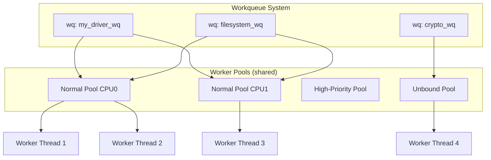
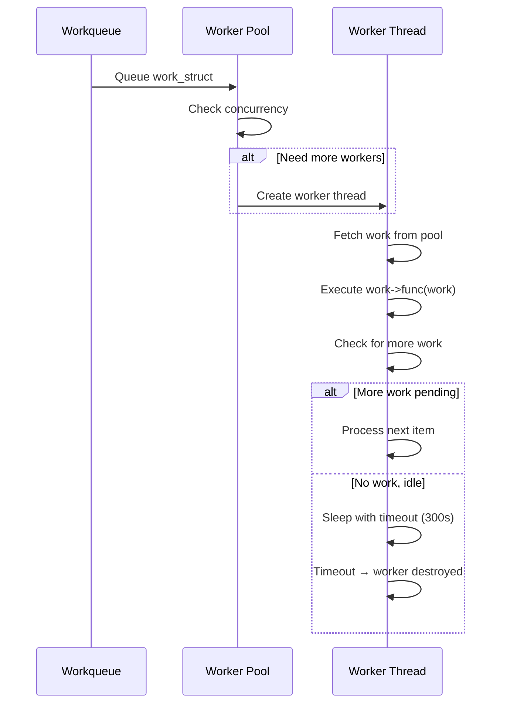
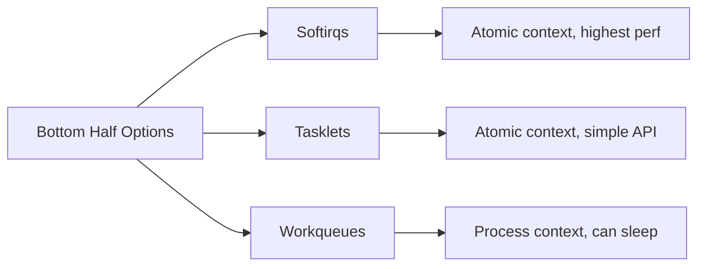

# Workqueues

## Introduction

Workqueues are the kernel's primary mechanism for deferring work to **process context**. Unlike softirqs and tasklets, which run in atomic (non-sleeping) context, workqueue functions execute in kernel threads where they can sleep, acquire mutexes, allocate memory with `GFP_KERNEL`, and perform any operation that process context allows.

Workqueues have been through two major API generations. The original `create_workqueue()` API (Linux 2.5) created a separate worker thread per CPU for each workqueue — leading to thousands of threads on large systems. The `alloc_workqueue()` API (Linux 2.6.36, concurrency-managed workqueues or CMWQ) replaced this with a shared worker pool that dynamically manages concurrency.

## Core Concepts

### work_struct

A `work_struct` represents a unit of deferred work:

```c
struct work_struct {
    atomic_long_t data;
    struct list_head entry;
    work_func_t func;
#ifdef CONFIG_LOCKDEP
    struct lockdep_map lockdep_map;
#endif
};
```

The `func` callback has the prototype:

```c
void work_func_t(struct work_struct *work);
```

### workqueue_struct

A workqueue is a queue of `work_struct` items that are processed by worker threads. Workqueues can be:
- **Bound**: Work items run on specific CPUs
- **Unbound**: Work items can run on any CPU (for CPU-agnostic work)
- **Ordered**: Work items execute strictly in order, one at a time

### Worker Pools

Under CMWQ, worker pools are shared across workqueues:

- **Normal pool**: For regular work items (can sleep, but managed by the scheduler)
- **High-priority pool**: For high-priority work items
- **Unbound pool**: For unbound work items



## API Reference

### Declaring and Initializing Work Items

**Static initialization:**

```c
DECLARE_WORK(name, func);
DECLARE_DELAYED_WORK(name, func);
DECLARE_DEFERRABLE_WORK(name, func);  /* Deferrable timer */
```

**Dynamic initialization:**

```c
struct work_struct my_work;
struct delayed_work my_dwork;

INIT_WORK(&my_work, my_work_func);
INIT_DELAYED_WORK(&my_dwork, my_delayed_work_func);
```

### Creating Workqueues

**Modern API (recommended):**

```c
struct workqueue_struct *alloc_workqueue(const char *fmt,
                                         unsigned int flags,
                                         int max_active, ...);
```

**Flags:**

| Flag | Description |
|------|-------------|
| `WQ_UNBOUND` | Work items not bound to any CPU |
| `WQ_FREEZABLE` | Freezable during system suspend |
| `WQ_MEM_RECLAIM` | Can be used in memory reclaim paths |
| `WQ_HIGHPRI` | High-priority worker pool |
| `WQ_CPU_INTENSIVE` | CPU-intensive work (throttles concurrency) |
| `WQ_SYSFS` | Visible in sysfs |
| `__WQ_ORDERED` | Execute work items strictly in order |
| `__WQ_LEGACY` | Legacy create_workqueue behavior |

**`max_active`:**

Controls the maximum number of work items that can execute simultaneously on a given CPU. Default is typically 256. Use 1 for ordered workqueues.

**Legacy API (deprecated):**

```c
/* DO NOT USE in new code */
create_workqueue("name");        /* Was: alloc_workqueue(name, 0, 1) */
create_singlethread_workqueue("name");  /* Was: alloc_workqueue(name, __WQ_ORDERED, 1) */
```

### Examples of Workqueue Creation

```c
/* Standard workqueue — concurrency-managed */
struct workqueue_struct *wq = alloc_workqueue("my_driver_wq", 0, 0);

/* Ordered workqueue — one item at a time */
struct workqueue_struct *owq = alloc_workqueue("my_ordered_wq",
                                                __WQ_ORDERED | WQ_MEM_RECLAIM, 1);

/* Unbound workqueue — not tied to any CPU */
struct workqueue_struct *uwq = alloc_workqueue("my_crypto_wq",
                                                WQ_UNBOUND, 0);

/* High-priority, memory-reclaim safe */
struct workqueue_struct *hqwq = alloc_workqueue("my_reclaim_wq",
                                                 WQ_HIGHPRI | WQ_MEM_RECLAIM, 0);
```

### Destroying Workqueues

```c
void destroy_workqueue(struct workqueue_struct *wq);
```

This flushes all pending work items and destroys the workqueue. Always call this in your module's exit path:

```c
static void __exit my_module_exit(void)
{
    flush_workqueue(my_wq);         /* Wait for pending work */
    destroy_workqueue(my_wq);       /* Destroy the queue */
}
```

### Queueing Work

```c
/* Queue work on the default workqueue */
bool queue_work(struct workqueue_struct *wq, struct work_struct *work);

/* Queue work on a specific CPU */
bool queue_work_on(int cpu, struct workqueue_struct *wq,
                   struct work_struct *work);

/* Queue delayed work (with a timeout) */
bool queue_delayed_work(struct workqueue_struct *wq,
                        struct delayed_work *dwork,
                        unsigned long delay);

/* Queue delayed work on a specific CPU */
bool queue_delayed_work_on(int cpu, struct workqueue_struct *wq,
                           struct delayed_work *dwork,
                           unsigned long delay);
```

All `queue_work*` functions return `true` if the work was newly queued, `false` if it was already queued. The work item can only be on one queue at a time.

### The system_wq

For simple cases, the kernel provides a default workqueue:

```c
/* Queue on the system-wide default workqueue */
bool schedule_work(struct work_struct *work);
bool schedule_work_on(int cpu, struct work_struct *work);
bool schedule_delayed_work(struct delayed_work *dwork, unsigned long delay);
bool schedule_delayed_work_on(int cpu, struct delayed_work *dwork,
                               unsigned long delay);
```

`schedule_work()` is equivalent to `queue_work(system_wq, work)`. It's convenient but provides no isolation — work items from different subsystems share the same queue.

### Flushing and Cancelling

```c
/* Wait for all pending work items to complete */
void flush_workqueue(struct workqueue_struct *wq);

/* Wait for a specific work item to complete */
bool flush_work(struct work_struct *work);

/* Wait for a specific delayed work item */
bool flush_delayed_work(struct delayed_work *dwork);

/* Try to cancel a pending work item (doesn't wait for running) */
bool cancel_work_sync(struct work_struct *work);

/* Cancel delayed work */
bool cancel_delayed_work(struct delayed_work *dwork);
bool cancel_delayed_work_sync(struct delayed_work *dwork);
```

**`cancel_work_sync()`** is the most commonly used cleanup function:
- Removes the work item from the queue if it's pending
- If the work item is currently executing, waits for it to finish
- Returns `true` if the work was pending and cancelled

## Concurrency-Managed Workqueues (CMWQ)

The CMWQ framework (since Linux 2.6.36) dynamically manages the number of worker threads. Key design principles:

1. **Shared pools**: Worker threads are shared across workqueues, reducing total thread count.
2. **Dynamic creation**: Workers are created when there's work to do and destroyed when idle.
3. **Concurrency management**: For bound work items, the system ensures at most `max_active` items run per CPU.
4. **CPU-intensive throttling**: Work items flagged with `WQ_CPU_INTENSIVE` don't count toward the concurrency limit.

### Worker Thread Lifecycle



### Worker Thread Appearance

```bash
$ ps -eo pid,comm | grep kworker
   50 kworker/0:0
   51 kworker/0:1
   52 kworker/0:0H    (High-priority worker)
   53 kworker/u8:0    (Unbound worker)
   54 kworker/u8:1    (Unbound worker)
```

Naming convention: `kworker/<pool_id>:<id>` or `kworker/u<unbound_pool>:<id>`.

## Complete Example: Device Driver Using Workqueues

```c
#include <linux/module.h>
#include <linux/workqueue.h>
#include <linux/slab.h>

struct my_device {
    struct workqueue_struct *wq;
    struct work_struct rx_work;
    struct delayed_work poll_work;
    struct mutex data_lock;
    void *rx_data;
    int irq;
};

/* Process RX data — runs in process context, can sleep */
static void my_rx_work_func(struct work_struct *work)
{
    struct my_device *dev = container_of(work, struct my_device, rx_work);

    mutex_lock(&dev->data_lock);
    /* Process received data — can call blocking functions */
    process_data(dev->rx_data);
    mutex_unlock(&dev->data_lock);
}

/* Periodic polling — runs in process context */
static void my_poll_work_func(struct work_struct *work)
{
    struct my_device *dev = container_of(work, struct my_device,
                                         poll_work.work);

    /* Do polling work */
    check_device_status(dev);

    /* Re-schedule for 1 second later */
    queue_delayed_work(dev->wq, &dev->poll_work, HZ);
}

static irqreturn_t my_irq_handler(int irq, void *dev_id)
{
    struct my_device *dev = dev_id;

    /* Top half: minimal work */
    disable_device_interrupts(dev);

    /* Schedule bottom half in process context */
    queue_work(dev->wq, &dev->rx_work);

    return IRQ_HANDLED;
}

static int __init my_device_init(void)
{
    struct my_device *dev = kzalloc(sizeof(*dev), GFP_KERNEL);
    if (!dev)
        return -ENOMEM;

    /* Create a dedicated workqueue */
    dev->wq = alloc_workqueue("my_device_wq", WQ_MEM_RECLAIM, 0);
    if (!dev->wq) {
        kfree(dev);
        return -ENOMEM;
    }

    mutex_init(&dev->data_lock);
    INIT_WORK(&dev->rx_work, my_rx_work_func);
    INIT_DELAYED_WORK(&dev->poll_work, my_poll_work_func);

    /* Request IRQ */
    ret = request_irq(dev->irq, my_irq_handler, 0, "my_device", dev);
    if (ret) {
        destroy_workqueue(dev->wq);
        kfree(dev);
        return ret;
    }

    /* Start periodic polling */
    queue_delayed_work(dev->wq, &dev->poll_work, HZ);

    return 0;
}

static void __exit my_device_exit(void)
{
    /* Cancel delayed work first */
    cancel_delayed_work_sync(&dev->poll_work);

    /* Free IRQ */
    free_irq(dev->irq, dev);

    /* Flush and destroy workqueue */
    flush_workqueue(dev->wq);
    destroy_workqueue(dev->wq);

    kfree(dev);
}
```

## Ordered Workqueues

When you need strict ordering — work items must execute one at a time, in queue order — use ordered workqueues:

```c
/* Create an ordered workqueue (max_active = 1) */
struct workqueue_struct *owq = alloc_workqueue("my_ordered",
    WQ_UNBOUND | __WQ_ORDERED | WQ_MEM_RECLAIM, 1);

/* All items queued here execute sequentially */
queue_work(owq, &work1);
queue_work(owq, &work2);  /* Executes only after work1 completes */
queue_work(owq, &work3);  /* Executes only after work2 completes */
```

Use cases for ordered workqueues:
- Filesystem operations that must be serialized (e.g., btrfs transaction commits)
- Device initialization sequences
- Operations where concurrent execution would cause data corruption

## Unbound Workqueues

For work that doesn't benefit from CPU locality, use `WQ_UNBOUND`:

```c
/* Unbound: work items may execute on any CPU */
struct workqueue_struct *wq = alloc_workqueue("my_crypto",
    WQ_UNBOUND, WQ_CPU_INTENSIVE);
```

The `WQ_CPU_INTENSIVE` flag tells the CMWQ framework that this work is CPU-intensive, so it shouldn't count toward the concurrency limit for other work items on the same CPU.

## Managed Workqueues (devm_alloc_workqueue)

```c
struct workqueue_struct *devm_alloc_workqueue(struct device *dev,
                                               const char *fmt,
                                               unsigned int flags,
                                               int max_active, ...);
```

Automatically destroyed when the device is unbound. Use in device drivers for automatic cleanup.

## Workqueue CPU Mask

```c
/* Set CPU affinity for a workqueue */
int workqueue_set_unbound_cpumask(cpumask_var_t cpumask);

/* Restrict to specific CPUs */
cpumask_var_t mask;
cpumask_set_cpu(0, mask);
cpumask_set_cpu(1, mask);
workqueue_set_unbound_cpumask(mask);
```

## Debugging Workqueues

### /sys/kernel/debug/workqueue

```bash
$ sudo cat /sys/kernel/debug/workqueue
NAME                ID   CPU  POOL  THREADS  ACTIVE
events              0    0    0     2        0
events_highpri      1    0    0     2        0
events_freezable    2    0    0     2        0
events_power_efficient 3  0    0     2        0
my_device_wq        4    0    0     1        0
system_wq           5    0    0     2        0
```

### Workqueue Statistics (CONFIG_WQ_WATCHDOG)

```bash
$ sudo cat /sys/kernel/debug/workqueue
# Shows long-running work items with timestamps
```

### Tracing

```bash
# Trace workqueue events
$ echo 1 > /sys/kernel/debug/tracing/events/workqueue/enable
$ cat /sys/kernel/debug/tracing/trace_pipe
  kworker/0:1-50  [000] d..1  1234.567890: workqueue_queue_work: work struct=ffff888012345678 function=my_rx_work_func
  kworker/0:1-50  [000] d..1  1234.567901: workqueue_execute_start: work struct=ffff888012345678 function=my_rx_work_func
  kworker/0:1-50  [000] d..1  1234.568123: workqueue_execute_end: work struct=ffff888012345678
```

## The system_wq and Built-in Workqueues

The kernel maintains several built-in workqueues:

| Workqueue | Purpose |
|-----------|---------|
| `system_wq` | General-purpose default (used by `schedule_work()`) |
| `system_highpri_wq` | High-priority default |
| `system_long_wq` | For long-running work items |
| `system_unbound_wq` | Unbound work |
| `system_freezable_wq` | Freezable during suspend |
| `system_power_efficient_wq` | Power-efficient scheduling |
| `system_freezable_power_efficient_wq` | Freezable + power-efficient |

```c
/* Use built-in workqueues */
schedule_work(&my_work);                    /* system_wq */
queue_work(system_highpri_wq, &my_work);   /* High priority */
```

## Workqueue vs Other Bottom Halves



| Feature | Softirq | Tasklet | Workqueue |
|---------|---------|---------|-----------|
| Context | Atomic (softirq) | Atomic (softirq) | Process (kernel thread) |
| Can sleep? | No | No | Yes |
| Can acquire mutexes? | No | No | Yes |
| Can do GFP_KERNEL alloc? | No | No | Yes |
| Concurrency | Parallel on all CPUs | Serialized per tasklet | Managed by CMWQ |
| Latency | Lowest | Low | Higher (scheduling) |
| Use case | Highest-frequency I/O | Simple atomic defer | Complex sleeping work |

## Best Practices

1. **Use `alloc_workqueue()`, not `create_workqueue()`** — the old API is deprecated.
2. **Use `WQ_MEM_RECLAIM`** if work items may be queued from memory reclaim paths.
3. **Use ordered workqueues** when serial execution is required.
4. **Always flush before freeing**: `cancel_work_sync()` or `flush_workqueue()`.
5. **Use `devm_alloc_workqueue()`** in device drivers.
6. **Prefer system_wq** for simple, one-off deferred work.
7. **Avoid long-running work items** — they can starve other work on the same pool.
8. **Use `queue_work_on()`** for CPU-local work to minimize cache misses.

## References

- [Linux Kernel Documentation: Workqueues](https://www.kernel.org/doc/html/latest/core-api/workqueue.html)
- [LWN: "A new workqueue implementation"](https://lwn.net/Articles/403883/)
- [LWN: "Concurrency-managed workqueues"](https://lwn.net/Articles/385586/)
- [Tejun Heo: Workqueue design overview](https://git.kernel.org/pub/scm/linux/kernel/git/torvalds/linux.git/tree/kernel/workqueue.c)
- [Kernel Workqueue API reference](https://www.kernel.org/doc/html/latest/driver-api/basics.html#workqueues)

## Related Topics

- [Interrupts Overview](overview.md) — IRQ numbers, routing, interrupt context
- [Interrupt Handlers](handlers.md) — request_irq, threaded interrupts
- [Softirqs](softirqs.md) — Atomic deferred processing
- [Tasklets](tasklets.md) — Simple atomic deferred work
- [Synchronization Overview](../sync/overview.md) — Locking in workqueue functions
