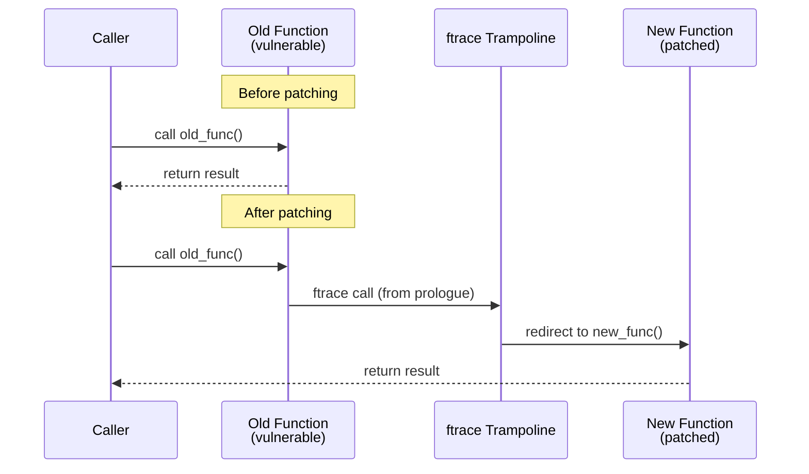
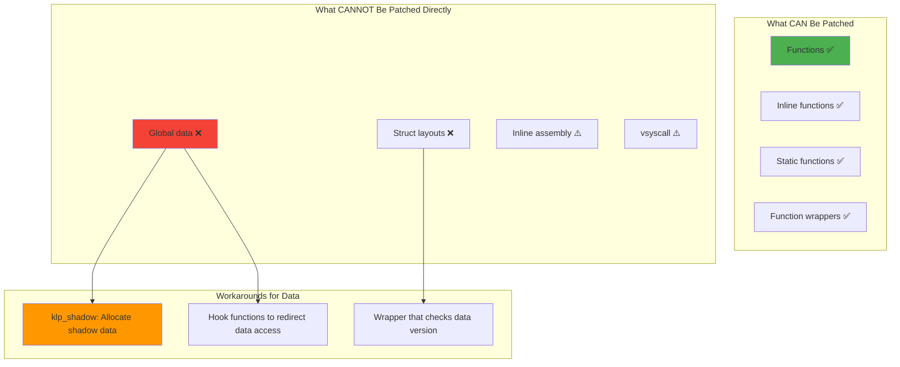
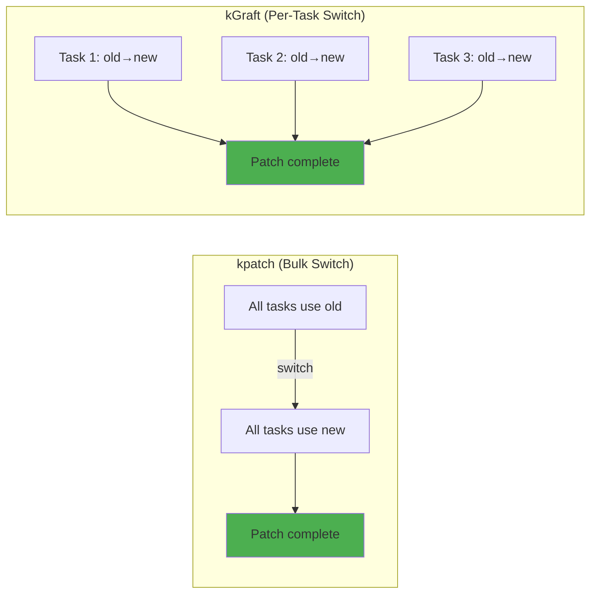
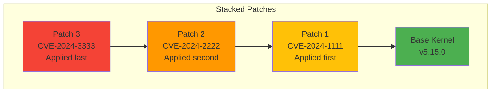

# Kernel Live Patching

## Introduction

Kernel live patching is a mechanism to apply security patches and bug fixes to a running Linux kernel **without rebooting**. This is critical for production systems with high availability requirements — servers, telecom infrastructure, cloud platforms, and embedded devices where even a brief downtime window is unacceptable.

The Linux kernel supports multiple live patching frameworks, all built on a common foundation: **function-level patching using ftrace**. The current upstream solution is the **kernel livepatch subsystem** (`CONFIG_LIVEPATCH`), while **kpatch** (Red Hat) and **kGraft** (SUSE) are userspace toolchains that generate patches compatible with it.

## Live Patching Architecture

### High-Level Overview

```mermaid
graph TB
    subgraph "Live Patch Workflow"
        CVE[Security Advisory / Bug Fix] --> DIFF[Kernel Source Diff]
        DIFF --> KPATCH[kpatch-build tool]
        KPATCH --> KO[Live Patch Module<br>(.ko)]
        KO --> LOAD[insmod / modprobe]
        LOAD --> FTRACE[Ftrace Hook<br>Redirect function]
        FTRACE --> NEW[New Function Code]
        NEW --> DONE[Patch Applied<br>No Reboot]
    end

    subgraph "Running Kernel"
        OLD_OLD["Old function<br>(vulnerable)"]
        FTRACE_HOOK["ftrace entry hook"]
        NEW_NEW["New function<br>(patched)"]
        OLD_OLD -->|redirected| FTRACE_HOOK
        FTRACE_HOOK --> NEW_NEW
    end

    style CVE fill:#F44336
    style KO fill:#4CAF50
    style FTRACE fill:#FF9800
```

### The ftrace-Based Patching Mechanism

All Linux live patching solutions use the same kernel mechanism: **ftrace function tracing**. When a function is patched:

1. The kernel's ftrace infrastructure modifies the **prologue** of the old function
2. A `nop` instruction at the function entry is replaced with a `call` to the ftrace trampoline
3. The trampoline redirects execution to the new (patched) function
4. The old function is never called again



### x86_64 Function Prologue Patching

```asm
; Original function (before live patch):
old_function:
    push   rbp
    mov    rbp, rsp
    ; ... original code ...

; After live patch (ftrace entry):
old_function:
    call   ftrace_caller      ; ← Replaces first instruction
    nop                       ; ← Alignment
    ; ... original code (dead code, never reached) ...

; ftrace_caller trampoline:
ftrace_caller:
    ; Save registers
    push   rbp
    mov    rbp, rsp
    ; Load address of new function
    mov    rdi, [rip + new_func_ptr]
    ; Jump to new function
    jmp    [rdi]
```

The kernel's `ftrace.c` handles the instruction patching atomically:

```c
// Simplified from arch/x86/kernel/ftrace.c
// The actual patching uses text_poke_bp() for atomic instruction replacement

static int ftrace_make_call(struct dyn_ftrace *rec, unsigned long addr)
{
    unsigned char *new;
    unsigned long ip = rec->ip;

    // Build the call instruction: E8 <offset>
    // call = 0xE8, followed by 4-byte relative offset
    new = ftrace_call_replace(ip, addr);

    // Atomically replace the NOP with a CALL
    // This uses text_poke_bp() which handles:
    // - Int3 breakpoint for cross-CPU safety
    // - Serializing instructions for consistency
    text_poke_bp((void *)ip, new, MCOUNT_INSN_SIZE);

    return 0;
}
```

## The kernel livepatch Subsystem

The upstream `CONFIG_LIVEPATCH` subsystem (since Linux 4.0) provides a standardized API for live patching.

### livepatch API

```c
// Include the livepatch header
#include <linux/livepatch.h>

// Define the new (patched) function
static int new_vulnerable_function(int arg)
{
    // Fixed implementation
    pr_info("livepatch: patched function called\n");
    return 0;  // Safe return value
}

// Define the livepatch function entry
static struct klp_func funcs[] = {
    {
        .old_name = "vulnerable_function",  // Symbol to patch
        .new_func = new_vulnerable_function, // Replacement function
    },
    { }  // Terminator
};

// Define the object (usually vmlinux or a module)
static struct klp_object objs[] = {
    {
        .name = NULL,  /* NULL = vmlinux (the kernel itself) */
        .funcs = funcs,
    },
    { }
};

// Define the patch itself
static struct klp_patch patch = {
    .mod = THIS_MODULE,
    .objs = objs,
};

// Module init: apply the patch
static int __init livepatch_init(void)
{
    return klp_enable_patch(&patch);
}

static void __exit livepatch_exit(void)
{
    // Patch is automatically reverted on module unload
}

module_init(livepatch_init);
module_exit(livepatch_exit);
MODULE_LICENSE("GPL");
MODULE_INFO(livepatch, "Y");
```

### klp_func Structure

```c
struct klp_func {
    /* The name of the original function */
    const char *old_name;

    /* Pointer to the replacement function */
    void *new_func;

    /*
     * The old function's address is resolved at patch enable time.
     * For static functions, the symbol table must include them
     * (CONFIG_KALLSYMS_ALL).
     */
    unsigned long old_addr;

    /*
     * Function-level consistency:
     * - When enabled, no task is executing the old function
     * - Tasks are checked at safe points (return to user space,
     *   idle loop, or sleeping)
     */
};
```

### klp_object Structure

```c
struct klp_object {
    /* Module name (NULL for vmlinux) */
    const char *name;

    /* Functions to patch in this object */
    struct klp_func *funcs;

    /* Per-object state */
    struct klp_state *states;

    /* RCU linkage */
    struct list_head node;

    /* Object-level callbacks */
    int (*pre_patch)(struct klp_object *);
    void (*post_patch)(struct klp_object *);
    void (*pre_unpatch)(struct klp_object *);
    void (*post_unpatch)(struct klp_object *);
};
```

### Consistency Model

The livepatch subsystem uses a **per-task consistency model** to ensure safe transitions:

```mermaid
stateDiagram-v2
    [*] => UNPATCHED: Module loaded

    state UNPATCHED {
        [*] => PATCHED_UNSAFE: klp_enable_patch()
        PATCHED_UNSAFE => PATCHED_SAFE: All tasks checked
    }

    state PATCHED_SAFE {
        [*] => PATCHED: Patch active
    }

    PATCHED => UNPATCHED: Module unloaded
    PATCHED_SAFE => [*]

    note right of PATCHED_UNSAFE
        Tasks are individually transitioned
        when they reach a safe point
    end note

    note right of PATCHED_SAFE
        All tasks have been verified to not
        be executing the old function
    end note
```

**Safe points** where tasks can transition:

1. **Return to userspace** — Task is about to return from a syscall
2. **Idle task** — CPU is in the idle loop
3. **Sleeping task** — Task is blocked in a non-running state

```c
// From kernel/livepatch/transition.c (simplified)
// Called for each task to check if it's safe to transition

static bool klp_try_switch_task(struct task_struct *task)
{
    /* Check if task is in a safe state */
    if (task->state == TASK_DEAD ||
        task->state == TASK_WAKING)
        return false;  /* Not safe yet */

    /* For running tasks, check if they're at a safe point */
    if (task_curr(task)) {
        /* Task is running on a CPU */
        /* It will transition when it returns to userspace */
        return false;
    }

    /* Task is sleeping or preempted — safe to switch */
    task->patch_state = KLP_UNDEFINED;
    return true;
}
```

## kpatch (Red Hat)

**kpatch** is Red Hat's live patching toolchain. It builds kernel modules from source diffs that work with the upstream `CONFIG_LIVEPATCH` subsystem.

### kpatch Architecture

```mermaid
graph TB
    subgraph "kpatch-build Tool"
        SRC_OLD[Old kernel source]
        SRC_NEW[New kernel source]
        DIFF[diff -u old new]
        ANALYSIS[ELF analysis<br>(kpatch-elf.c)]
        CREATE_KO[Generate .ko module]
    end

    subgraph "Generated Module"
        PATCH_DATA[Patch metadata<br>(klp_patch struct)]
        NEW_FUNCS[New function code<br>(compiled)]
        RELA[Relocations<br>(fix up references)]
        SYMTAB[Symbol table<br>(old & new symbols)]
    end

    SRC_OLD --> DIFF
    SRC_NEW --> DIFF
    DIFF --> ANALYSIS
    ANALYSIS --> CREATE_KO
    CREATE_KO --> PATCH_DATA
    CREATE_KO --> NEW_FUNCS
    CREATE_KO --> RELA
    CREATE_KO --> SYMTAB

    style CREATE_KO fill:#4CAF50
    style PATCH_DATA fill:#2196F3
```

### kpatch-build Workflow

```bash
# 1. Prepare kernel source (old version)
cd /usr/src/linux-5.15.0
cp -a . ../linux-5.15.0-patched

# 2. Apply your fix to the patched source
cd ../linux-5.15.0-patched
# Edit the file, e.g., fix a vulnerability in net/ipv4/tcp_input.c
vim net/ipv4/tcp_input.c

# 3. Build the live patch module
kpatch-build \
    --sourcedir /usr/src/linux-5.15.0-patched \
    /path/to/fix.patch \
    -t vmlinux \
    -v /usr/src/linux-5.15.0/vmlinux

# This produces: tcp-fix.ko

# 4. Apply the patch
sudo kpatch load tcp-fix.ko

# 5. Verify
sudo kpatch list
# tcp-fix.ko (loaded)

# 6. Check kernel log
dmesg | tail
# livepatch: enabling patch 'tcp-fix'
# livepatch: 'tcp-fix': patching function 'tcp_validate_incoming'
```

### kpatch Module Structure

```c
// What kpatch-build generates (simplified)
// This is the actual C code that gets compiled into the .ko

#include <linux/livepatch.h>

/*
 * The new function is compiled directly into this module.
 * kpatch-build extracts just the changed functions and
 * their dependencies, compiling them into the patch module.
 */

// New version of the vulnerable function
static int tcp_validate_incoming(struct sock *sk, struct sk_buff *skb,
                                  const struct tcphdr *th, int syn_inerr)
{
    // ... patched code (from the fixed kernel source) ...
    // kpatch-build copies the entire new function body
}

static struct klp_func funcs[] = {
    {
        .old_name = "tcp_validate_incoming",
        .new_func = tcp_validate_incoming,
    },
    { }
};

static struct klp_object objs[] = {
    {
        .name = NULL,
        .funcs = funcs,
    },
    { }
};

static struct klp_patch patch = {
    .mod = THIS_MODULE,
    .objs = objs,
};

module_klp_patch(patch);
```

### kpatch-build Internals

The `kpatch-build` tool performs sophisticated ELF analysis:

```bash
# kpatch-build analysis steps (conceptual):
# 1. Compile old and new kernels
# 2. Compare vmlinux ELF files using diff
# 3. For each changed function:
#    a. Find the function in old and new ELF
#    b. Extract new function code from new vmlinux
#    c. Find all called functions (dependencies)
#    d. Check for unsupported changes (data, inline asm)
#    e. Generate klp_func entries
# 4. For changed data:
#    a. Cannot live-patch data directly
#    b. Create hook functions that read/write new data
#    c. Use klp_shadow for shadow variables
# 5. Link everything into a .ko module
```

### kpatch Data Patching Limitations



### klp_shadow for Data Changes

```c
// When data structures change, use klp_shadow to store new state
#include <linux/livepatch.h>

struct new_struct {
    int field1;
    int field2;
    int new_field;  // ← This was added in the patch
};

static int patched_function(struct some_object *obj)
{
    struct new_struct *shadow;

    /* Look up or allocate shadow data */
    shadow = klp_shadow_get(obj, 0);
    if (!shadow) {
        shadow = klp_shadow_alloc(obj, 0, sizeof(*new_struct),
                                  GFP_KERNEL, NULL, NULL);
        shadow->field1 = obj->old_field1;
        shadow->field2 = obj->old_field2;
        shadow->new_field = DEFAULT_VALUE;
    }

    /* Use shadow data instead of original */
    return shadow->new_field + shadow->field1;
}
```

## kGraft (SUSE)

kGraft (SUSE's live patching solution) uses a different consistency model from kpatch, though both now use the upstream `CONFIG_LIVEPATCH` API.

### kGraft vs kpatch Consistency



The upstream `CONFIG_LIVEPATCH` uses a **hybrid approach**: per-task switching with a global state that tracks whether all tasks have transitioned.

## Patch Development Best Practices

### What to Patch

```bash
# Good candidates for live patching:
# 1. Security fixes (CVEs)
# 2. Critical bug fixes (data corruption, crashes)
# 3. Small, isolated function changes

# Bad candidates:
# 1. Large architectural changes
# 2. Data structure layout changes (breaks ABI)
# 3. Changes requiring init/cleanup logic
# 4. Inline assembly changes
```

### Creating a Patch Step by Step

```bash
# Step 1: Identify the vulnerable function
# From CVE advisory, find the exact fix commit
git log --oneline v5.15..v5.15.1 -- net/ipv4/tcp_input.c

# Step 2: Extract the fix
git diff v5.15 v5.15.1 -- net/ipv4/tcp_input.c > fix.patch

# Step 3: Review for live-patch compatibility
# Check: Is it only function changes? No data layout changes?
# Check: No new static variables? No init code changes?
vim fix.patch

# Step 4: Build the live patch
kpatch-build fix.patch \
    --sourcedir /usr/src/linux-5.15 \
    -n cve-2024-1234 \
    -t vmlinux

# Step 5: Test in non-production
sudo kpatch load cve-2024-1234.ko
# Run test suite
# Check for regressions

# Step 6: Deploy to production
sudo kpatch load cve-2024-1234.ko

# Step 7: Make persistent across reboots
sudo cp cve-2024-1234.ko /var/lib/kpatch/
sudo systemctl enable kpatch
```

### Patch Naming Convention

```bash
# Convention: CVE-YYYY-NNNNN or descriptive name
cve-2024-1234.ko           # CVE fix
fix-tcp-race-condition.ko  # Bug fix
hotfix-memory-leak.ko      # Critical fix
```

## Live Patch Stacking

Multiple live patches can be stacked — each patch applies on top of previous ones:



```bash
# List all loaded patches (in order)
sudo kpatch list
# Loaded patches:
#   cve-2024-1111.ko
#   cve-2024-2222.ko
#   cve-2024-3333.ko

# Unload patches in reverse order
sudo kpatch unload cve-2024-3333.ko

# Check which function each patch modifies
cat /sys/kernel/livepatch/*/funcs
```

### Conflict Detection

```c
// If two patches modify the same function, the second patch
// must target the first patch's version of the function.

// Patch 1 modifies vulnerable_function → patched_v1
// Patch 2 must modify patched_v1 → patched_v2

// The kernel handles this via the klp_func stack:
struct klp_func {
    /* Each function can have multiple patches stacked */
    struct list_head node;      /* Link in the stack */
    struct klp_func *prev;      /* Previous patch's version */
    /* ... */
};
```

## Livepatch Kernel Internals

### Core Kernel Code

```
kernel/livepatch/
├── core.c           # Main API: klp_enable_patch(), klp_disable_patch()
├── core.c           # klp_module_coming(), klp_module_going()
├── transition.c     # Per-task consistency model
├── patch.c          # Patch application
├── state.c          # klp_state management
├── shadow.c         # klp_shadow for data changes
└── Kconfig          # CONFIG_LIVEPATCH
```

### Key Functions

```c
// kernel/livepatch/core.c (simplified)

/* Enable a live patch */
int klp_enable_patch(struct klp_patch *patch)
{
    /* 1. Validate the patch */
    ret = klp_init_patch(patch);
    if (ret)
        return ret;

    /* 2. Initialize the transition */
    klp_init_transition(patch, KLP_PATCHED);

    /* 3. Mark all tasks for transition */
    klp_start_transition();

    /* 4. Try to transition each task */
    klp_try_complete_transition();

    /* 5. If all tasks transitioned, mark patch as enabled */
    if (patch->enabled) {
        pr_info("livepatch: enabling patch '%s'\n", patch->mod->name);
    }

    return 0;
}

/* Disable a live patch (module unload) */
int klp_disable_patch(struct klp_patch *patch)
{
    /* Reverse the transition: patched → unpatched */
    klp_init_transition(patch, KLP_UNPATCHED);
    klp_start_transition();
    klp_try_complete_transition();

    return 0;
}
```

### Ftrace Integration

```c
// kernel/livepatch/core.c — Registering ftrace ops

static int klp_patch_func(struct klp_func *func)
{
    struct ftrace_ops *ops;

    /* Allocate ftrace ops for this function */
    ops = kzalloc(sizeof(*ops), GFP_KERNEL);

    /* Set up the ftrace hook */
    ops->func = klp_ftrace_handler;
    ops->flags = FTRACE_OPS_FL_DYNAMIC;

    /* Register with ftrace */
    ret = ftrace_set_filter_ip(ops, func->old_addr, 0, 0);
    ret = register_ftrace_function(ops);

    return ret;
}

/* The ftrace handler that redirects to the new function */
static void klp_ftrace_handler(unsigned long ip, unsigned long parent_ip,
                                struct ftrace_ops *ops,
                                struct pt_regs *regs)
{
    struct klp_func *func = ops->private;

    /* Redirect: set instruction pointer to new function */
    regs->ip = (unsigned long)func->new_func;
}
```

## Commercial Live Patching Services

### Comparison

| Service | Vendor | Runtime | Coverage |
|---------|--------|---------|----------|
| **kpatch** | Red Hat | RHEL, CentOS | Kernel + some modules |
| **SUSE Live Patching** | SUSE | SLES | Kernel |
| **Canonical Livepatch** | Canonical | Ubuntu | Kernel |
| **KernelCare** | TuxCare | RHEL, Ubuntu, CentOS, Debian | Kernel |
| **AWS Kernel Live Patching** | Amazon | Amazon Linux | Kernel |

```bash
# Ubuntu Canonical Livepatch
sudo snap install canonical-livepatch
sudo canonical-livepatch enable <token>
canonical-livepatch status

# TuxCare KernelCare
curl -s https://repo.cloudlinux.com/kernelcare/kernelcare.install | bash
kcarectl --info
```

## Testing Live Patches

### Pre-deployment Testing

```bash
# 1. Load patch in test environment
sudo kpatch load test-patch.ko

# 2. Verify the function is patched
cat /sys/kernel/livepatch/test-patch/funcs
# vulnerable_function

# 3. Run workload to exercise patched code path
stress-ng --cpu 4 --io 4 --vm 2 --timeout 60s

# 4. Check for kernel warnings
dmesg | grep -E "WARN|BUG|OOPS"

# 5. Verify function behavior
# (Call the patched function through normal interfaces)
curl http://localhost/test-endpoint

# 6. Check patch state
sudo kpatch list
# test-patch.ko (loaded)

# 7. Unload and verify clean removal
sudo kpatch unload test-patch.ko
dmesg | tail
# livepatch: disabling patch 'test-patch'
```

### Automated Patch Testing

```bash
#!/bin/bash
# test-livepatch.sh — Automated live patch testing

PATCH=$1
TEST_DIR="/tmp/livepatch-test"

# Load patch
sudo kpatch load "$PATCH" || exit 1
echo "✓ Patch loaded"

# Verify patch state
STATE=$(cat /sys/kernel/livepatch/*/enabled 2>/dev/null)
[[ "$STATE" == "1" ]] && echo "✓ Patch enabled" || echo "✗ Patch not enabled"

# Run stress test
timeout 30 stress-ng --cpu 4 --io 4 --timeout 30s > /dev/null 2>&1
echo "✓ Stress test passed"

# Check for kernel issues
if dmesg | grep -qE "BUG|OOPS|livepatch.*error"; then
    echo "✗ Kernel issues detected"
    dmesg | grep -E "BUG|OOPS|livepatch"
    sudo kpatch unload "$PATCH"
    exit 1
fi
echo "✓ No kernel issues"

# Unload patch
sudo kpatch unload "$PATCH" || exit 1
echo "✓ Patch unloaded cleanly"

echo "All tests passed!"
```

## Kernel Source References

| File | Description |
|------|-------------|
| `kernel/livepatch/core.c` | Main livepatch API |
| `kernel/livepatch/transition.c` | Per-task consistency model |
| `kernel/livepatch/shadow.c` | Shadow variable management |
| `kernel/livepatch/patch.c` | Function patching logic |
| `arch/x86/kernel/ftrace.c` | x86 ftrace implementation |
| `kernel/trace/ftrace.c` | Core ftrace infrastructure |
| `include/linux/livepatch.h` | Public livepatch API header |

## Further Reading

- [Kernel Live Patching Documentation](https://docs.kernel.org/livepatch/)
- [kpatch GitHub](https://github.com/dynup/kpatch)
- [kpatch-build Internals](https://github.com/dynup/kpatch/blob/master/kpatch-build)
- [SUSE kGraft](https://www.suse.com/support/kb/article/?id=7016650)
- [Canonical Livepatch](https://ubuntu.com/security/livepatch)
- [KernelCare](https://www.kernelcare.com/)
- Kernel source: `kernel/livepatch/`
