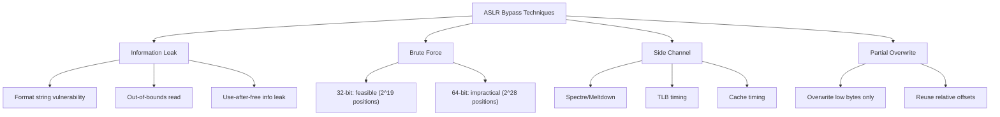
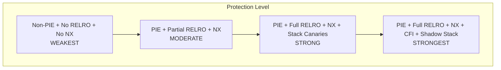

# ASLR — Address Space Layout Randomization

## Introduction

Address Space Layout Randomization (ASLR) is a security technique that randomizes the memory addresses of key process segments — stack, heap, shared libraries, and the executable itself — each time a program runs. By making the memory layout unpredictable, ASLR defeats or significantly complicates exploitation techniques that rely on knowing fixed addresses (e.g., return-to-libc, ROP chains, heap spraying).

ASLR was first implemented in Linux in 2005 (kernel 2.6.12) and is now enabled by default on virtually all Linux distributions. It is one of the foundational exploit mitigation techniques alongside NX (no-execute), stack canaries, and RELRO.

## How ASLR Works

### Process Memory Layout

```mermaid
graph TB
    subgraph "Without ASLR (Fixed Layout)"
        direction TB
        F_HIGH["0x7fff_ffff_f000 — Stack top"]
        F_STACK["Stack (fixed base)"]
        F_MMAP["Shared libraries (fixed at 0x7f...)"]
        F_HEAP["Heap (fixed after .bss)"]
        F_TEXT[".text (fixed at 0x400000)"]
        F_LOW["0x0040_0000 — Text base"]
    end

    subgraph "With ASLR (Randomized)"
        direction TB
        R_HIGH["0x7fff_????_???? — Stack top (random)"]
        R_STACK["Stack (random offset)"]
        R_MMAP["Shared libraries (random base)"]
        R_HEAP["Heap (random offset)"]
        R_TEXT[".text (random if PIE)"]
        R_LOW["0x????_???? — Text base (if PIE)"]
    end
```



### Randomized Segments

| Segment | Non-PIE Binary | PIE Binary |
|---------|---------------|------------|
| **Stack** | Random offset (28 bits of entropy on x86-64) | Same |
| **Heap** | Random offset (brk randomization) | Same |
| **mmap base** | Random base for mmap/malloc/libraries | Same |
| **Text (.text)** | Fixed at 0x400000 | Random base |
| **Shared libraries** | Random base | Same |
| **VDSO** | Random address | Same |
| **vsyscall** | Fixed (legacy, 1 page) | Same |

### Entropy Bits

The amount of randomization depends on architecture and pointer size:

```bash
# x86-64 (64-bit)
# Stack: 28 bits of entropy (256 TiB range)
# mmap:  28 bits of entropy
# brk:   32 bits of entropy (with large address space)
# PIE text: 28 bits

# x86 (32-bit)
# Stack: 19 bits (8 MiB alignment → ~512 positions)
# mmap:  8 bits (8 MiB alignment → 256 positions)
# brk:   13 bits (8 MiB alignment → 8192 positions)

# ARM64
# Stack: 28 bits
# mmap:  28 bits
# PIE text: 28 bits

# ARM32
# Stack: 8 bits
# mmap:  8 bits
```

### Entropy Calculation Details

The entropy is determined by the number of random bits and the alignment:

```c
/* Stack randomization */
/* x86-64: STACK_RND_BITS = 28 */
/* Alignment: 16 bytes (STACK_ALIGN) */
/* Positions: 2^28 = 268,435,456 */
/* Range: 2^28 * 16 = 4 GiB */

/* mmap randomization */
/* x86-64: MMAP_RND_BITS = 28 */
/* Alignment: PAGE_SIZE (4096) */
/* Positions: 2^28 = 268,435,456 */
/* Range: 2^28 * 4096 = 1 TiB */

/* brk randomization */
/* x86-64: 32 bits, PAGE_SIZE aligned */
/* Range: 2^32 * 4096 = 16 TiB */
```

**Effective entropy for brute-force attacks:**

| Architecture | Segment | Bits | Positions | Brute Force Time (1M/sec) |
|-------------|---------|------|-----------|--------------------------|
| x86-64 | Stack | 28 | 268M | ~4.5 minutes |
| x86-64 | mmap | 28 | 268M | ~4.5 minutes |
| x86-64 | PIE text | 28 | 268M | ~4.5 minutes |
| x86 | Stack | 19 | 524K | ~0.5 seconds |
| x86 | mmap | 8 | 256 | instant |
| ARM64 | Stack | 28 | 268M | ~4.5 minutes |
| ARM32 | Stack | 8 | 256 | instant |

**Combined entropy** (stack + mmap + text) makes full exploitation much harder than individual segment entropy suggests.

## ASLR Configuration

### /proc/sys/kernel/randomize_va_space

```bash
# View current ASLR setting
$ cat /proc/sys/kernel/randomize_va_space
2

# Values:
# 0 — ASLR disabled (no randomization)
# 1 — Conservative: stack, mmap, VDSO randomized; heap base fixed
# 2 — Full: all segments randomized (default on most distributions)

# Disable ASLR (requires root)
$ echo 0 | sudo tee /proc/sys/kernel/randomize_va_space

# Enable full ASLR
$ echo 2 | sudo tee /proc/sys/kernel/randomize_va_space
```

### Per-Process ASLR Control

```bash
# Disable ASLR for a specific program
$ setarch $(uname -m) -R ./myprogram
# or
$ setarch x86_64 -R ./myprogram

# The ADDR_NO_RANDOMIZE personality flag
# Equivalent to: personality(current | ADDR_NO_RANDOMIZE)

# Disable ASLR for a 32-bit program on 64-bit system
$ setarch i386 -R ./myprogram_32bit
```

### Kernel Boot Parameter

```bash
# Disable ASLR at boot
# Add "norandmaps" to kernel command line

# Check current boot parameters
$ cat /proc/cmdline
BOOT_IMAGE=/vmlinuz-5.15.0 root=/dev/sda1 ro quiet norandmaps
```

## Observing ASLR

### /proc/pid/maps

The `/proc/[pid]/maps` file shows the current memory layout of a process:

```bash
# Run a program and check its maps
$ cat /proc/self/maps
5571f8e2c000-5571f8e4e000 r-xp 00000000 08:01 131074  /usr/bin/cat
5571f904d000-5571f904f000 r--p 00021000 08:01 131074  /usr/bin/cat
5571f904f000-5571f9050000 rw-p 00023000 08:01 131074  /usr/bin/cat
7f8a1b200000-7f8a1b3c2000 r-xp 00000000 08:01 262147  /usr/lib/libc.so.6
7f8a1b3c2000-7f8a1b5c1000 ---p 001c2000 08:01 262147  /usr/lib/libc.so.6
7f8a1b5c1000-7f8a1b5c5000 r--p 001c1000 08:01 262147  /usr/lib/libc.so.6
7f8a1b5c5000-7f8a1b5c7000 rw-p 001c5000 08:01 262147  /usr/lib/libc.so.6
7f8a1b5c7000-7f8a1b5d3000 rw-p 00000000 00:00 0
7ffd4a5e3000-7ffd4a604000 rw-p 00000000 00:00 0      [stack]
7ffd4a7f8000-7ffd4a7fc000 r--p 00000000 00:00 0      [vvar]
7ffd4a7fc000-7ffd4a7fa000 r-xp 00000000 00:00 0      [vdso]
ffffffffff600000-ffffffffff601000 --xp 00000000 00:00 0 [vsyscall]
```

### Verifying Randomization

```bash
# Run the same program multiple times and compare addresses
$ for i in 1 2 3 4 5; do
    cat /proc/self/maps | head -1
done
5571f8e2c000-5571f8e4e000 r-xp ... /usr/bin/cat
55f3a7b12000-55f3a7b34000 r-xp ... /usr/bin/cat
5623c4d8a000-5623c4dac000 r-xp ... /usr/bin/cat
55b8c1e34000-55b8c1e56000 r-xp ... /usr/bin/cat
56412dc5f000-56412dc81000 r-xp ... /usr/bin/cat

# Notice: the text base address changes each run (PIE binary)

# With ASLR disabled:
$ setarch x86_64 -R cat /proc/self/maps | head -1
555555554000-555555556000 r-xp ... /usr/bin/cat
# Same address every time
```

### Stack and Library Randomization

```bash
# Stack addresses change between runs
$ for i in 1 2 3; do
    setarch x86_64 -R sh -c 'cat /proc/self/maps | grep stack'
done
7fff12345000-7fff12366000 rw-p ... [stack]
7fff56789000-7fff567aa000 rw-p ... [stack]
7fff9abcdef00-7fff9abe0000 rw-p ... [stack]

# Library base addresses change
$ for i in 1 2 3; do
    cat /proc/self/maps | grep libc
done
7f8a1b200000-... /usr/lib/libc.so.6
7f2c3d400000-... /usr/lib/libc.so.6
7f5e6f800000-... /usr/lib/libc.so.6
```

### Measuring ASLR Entropy Empirically

```bash
#!/bin/bash
# Measure ASLR entropy by sampling addresses
SAMPLES=10000
echo "Sampling $SAMPLES runs..."

for i in $(seq 1 $SAMPLES); do
    cat /proc/self/maps | grep -E "^\S+.*\[stack\]" | awk '{print $1}' | cut -d- -f1
done | sort | uniq -c | sort -rn | head -10

# For PIE binary:
for i in $(seq 1 $SAMPLES); do
    cat /proc/self/maps | grep -E "^\S+.*cat$" | head -1 | awk '{print $1}' | cut -d- -f1
done | sort | uniq -c | sort -rn | head -10

# Calculate entropy:
# entropy = -sum(p_i * log2(p_i))
# where p_i = count_i / total_samples
```

## Implementation Details

### Kernel Implementation

ASLR is implemented in the ELF loader (`fs/binfmt_elf.c`) and the memory management subsystem:

```c
/* From arch/x86/mm/mmap.c */
unsigned long arch_mmap_rnd(void) {
    unsigned long rnd;

    if (mmap_is_ia32())
        rnd = get_random_long() & ((1UL << mmap_rnd_bits) - 1);
    else
        rnd = get_random_long() & ((1UL << mmap_rnd_bits) - 1);

    return rnd << PAGE_SHIFT;
}

/* Stack randomization */
unsigned long randomize_stack_top(unsigned long stack_top) {
    unsigned long random_variable = 0;

    if (current->flags & PF_RANDOMIZE) {
        random_variable = get_random_long();
        random_variable &= STACK_RND_MASK;
        random_variable <<= PAGE_SHIFT;
    }
    return stack_top + random_variable;
}
```

### Mmap Base Calculation

```c
/* Simplified mmap base calculation */
static unsigned long mmap_base(unsigned long rnd) {
    unsigned long gap = rlimit(RLIMIT_STACK);
    if (gap < MIN_GAP)
        gap = MIN_GAP;
    if (gap > MAX_GAP)
        gap = MAX_GAP;

    return PAGE_ALIGN(DEFAULT_MAP_WINDOW - gap - rnd);
}
```

### Entropy Configuration

```bash
# Bits of entropy for mmap randomization
$ cat /proc/sys/vm/mmap_rnd_bits
28

$ cat /proc/sys/vm/mmap_rnd_compat_bits
8

# These can be tuned (usually not recommended)
$ echo 24 | sudo tee /proc/sys/vm/mmap_rnd_bits
```

### Random Number Source

ASLR uses the kernel's CSPRNG (Cryptographically Secure Pseudo-Random Number Generator):

```c
/* kernel/random.c */
unsigned long get_random_long(void)
{
    unsigned long v;
    get_random_bytes(&v, sizeof(v));
    return v;
}

/* The entropy pool is seeded from: */
/* 1. Hardware RNG (RDRAND/RDSEED on x86) */
/* 2. Interrupt timing jitter */
/* 3. Disk I/O timing */
/* 4. Keyboard/mouse input timing */
/* 5. Network packet timing */
```

## ASLR Vulnerabilities and Bypasses

### Known Weaknesses



### 32-bit vs 64-bit Effectiveness

| Architecture | Entropy | Brute Force Feasible? |
|-------------|---------|----------------------|
| x86 (32-bit) Stack | ~19 bits (8 MiB) | Yes (~500K attempts) |
| x86 (32-bit) mmap | ~8 bits (8 MiB) | Yes (256 attempts) |
| x86-64 Stack | ~28 bits (256 TiB) | No |
| x86-64 mmap | ~28 bits (256 TiB) | No |
| ARM32 | ~8 bits | Yes |
| ARM64 | ~28 bits | No |

### Notable ASLR Bypass CVEs

| CVE | Year | Technique | Impact |
|-----|------|-----------|--------|
| CVE-2015-1593 | 2015 | Stack entropy leak via `/proc/self/maps` | 32-bit Linux |
| CVE-2016-3672 | 2016 | Unlimiting stack randomization | 32-bit Linux |
| CVE-2017-1000366 | 2017 | Stack clash — jumping over guard page | All Linux |
| CVE-2018-14634 | 2018 | Integer overflow in `create_elf_tables()` | 32-bit Linux |
| CVE-2019-11477 | 2019 | SACK panic — kernel ASLR bypass | Linux kernel |
| CVE-2020-0041 | 2020 | Binder use-after-free — ASLR bypass | Android/Linux |
| CVE-2021-26708 | 2021 | vsock heap overflow — ASLR bypass | Linux kernel |
| CVE-2022-0847 | 2022 | Dirty Pipe — page cache manipulation | Linux kernel |
| CVE-2023-0386 | 2023 | OverlayFS — kernel ASLR bypass | Linux kernel |

### Information Leak Techniques

```c
/* 1. Format string vulnerability */
printf(user_input);  /* %p, %x leak stack/heap addresses */

/* 2. Out-of-bounds read */
char buf[64];
read(fd, buf, 4096);  /* Reads beyond buffer, leaks addresses */

/* 3. Use-after-free */
free(ptr);
// ... reallocate with controlled data ...
// ... ptr still points to new data, can leak addresses ...

/* 4. Uninitialized memory */
char buf[64];
write(fd, buf, 64);  /* May leak heap metadata or addresses */

/* 5. Side channels */
// Cache timing: determine which cache lines are accessed
// TLB timing: determine which pages are mapped
// Speculative execution: Spectre/Meltdown variants
```

### Brute Force on 32-bit

```bash
# 32-bit brute force is feasible for stack ASLR
# With 19 bits of entropy: 524,288 possible positions
# At 1000 attempts/second: ~8.7 minutes

# For local exploits (forking server):
#!/bin/bash
# Server restarts on each connection → new ASLR layout
for i in $(seq 1 1000000); do
    ./exploit 2>/dev/null && break
done

# For mmap (8 bits = 256 positions):
# Instant brute force
```

### Spectre/Meltdown Impact

```bash
# Spectre/Meltdown can leak kernel ASLR addresses
# Mitigations:
# 1. KPTI (Kernel Page Table Isolation)
# 2. Retpoline
# 3. IBRS/IBPB microcode patches

# Check current mitigations
$ cat /sys/devices/system/cpu/vulnerabilities/spectre_v1
Mitigation: usercopy/swapgs barriers and __user pointer sanitization

$ cat /sys/devices/system/cpu/vulnerabilities/spectre_v2
Mitigation: Retpolines, IBPB: conditional, IBRS_FW, STIBP: conditional, RSB filling, PBRSB-eIBRS: Not affected

$ cat /sys/devices/system/cpu/vulnerabilities/meltdown
Mitigation: PTI

$ cat /sys/devices/system/cpu/vulnerabilities/mds
Mitigation: Clear CPU buffers; SMT vulnerable

$ cat /sys/devices/system/cpu/vulnerabilities/tsx_async_abort
Mitigation: TSX disabled
```

## Kernel ASLR (KASLR)

The kernel itself also uses ASLR:

```bash
# Check if KASLR is enabled
$ cat /proc/cmdline | grep nokaslr
# If nothing: KASLR is enabled

# Disable KASLR (in bootloader)
# Add "nokaslr" to kernel command line

# View kernel base address (requires root)
$ sudo cat /proc/kallsyms | head -1
ffffffff81000000 T _text
# With KASLR, this changes each boot

# With KASLR disabled:
# ffffffff81000000 T _text  (always the same)
```

### KASLR Entropy

```c
/* arch/x86/kernel/kaslr.c */
/* KASLR randomizes: */
/* 1. Kernel text base (physical and virtual) */
/* 2. Kernel module loading area */
/* 3. vmalloc area */
/* 4. vmemmap area */

/* Entropy: */
/* x86-64: ~30 bits for kernel text (1 GiB alignment) */
/* x86: ~8 bits (kernel must fit in available space) */
/* ARM64: ~28 bits */
```

### KASLR Bypass Techniques

```bash
# KASLR can be bypassed via:
# 1. /proc/kallsyms (if not restricted)
$ cat /proc/sys/kernel/kptr_restrict
1  # 0 = show addresses, 1 = hide for non-root, 2 = hide for all

# 2. Timing side channels
# Measure time to access different kernel addresses
# Mapped addresses are faster (TLB hit) than unmapped

# 3. Hardware vulnerabilities
# Spectre/Meltdown can leak kernel addresses

# 4. Boot-time leaks
# dmesg may contain kernel addresses
$ dmesg | grep -i "kernel code" | head -1
[    0.000000] Kernel code: 0xffffffff81000000 - 0xffffffff81ffffff
```

## PIE (Position-Independent Executables)

For ASLR to fully protect the executable itself, it must be compiled as PIE:

```bash
# Compile with PIE (default on most modern distributions)
$ gcc -o myprogram myprogram.c -pie -fPIE

# Check if a binary is PIE
$ file /usr/bin/cat
/usr/bin/cat: ELF 64-bit LSB pie executable, x86-64, ...

$ file /usr/bin/old_binary
/usr/bin/old_binary: ELF 64-bit LSB executable, x86-64, ...
# Non-PIE: text base is fixed at 0x400000

# Check PIE status with readelf
$ readelf -h /usr/bin/cat | grep Type:
  Type:  DYN (Shared object file)   ← PIE

$ readelf -h /usr/bin/old_binary | grep Type:
  Type:  EXEC (Executable file)     ← Non-PIE
```

### RELRO (Relocation Read-Only)

```bash
# Full RELRO + PIE provides strong protection
$ gcc -o secure program.c -pie -fPIE -Wl,-z,relro,-z,now

# Check RELRO status
$ checksec --file=/usr/bin/cat
RELRO           STACK CANARY      NX            PIE
Full RELRO      Canary found      NX enabled    PIE enabled

# Partial RELRO (default on many distributions):
# - GOT is read-only after relocation
# - PLT is still writable

# Full RELRO:
# - All relocations resolved at startup
# - GOT is read-only
# - Slightly slower startup
```

### Security Properties Comparison



| Mitigation | Protects Against | PIE Required? |
|------------|-----------------|---------------|
| **NX** | Code execution on stack/heap | No |
| **Stack Canary** | Stack buffer overflow | No |
| **ASLR** | Return-to-libc, ROP | Yes (for text) |
| **Full RELRO** | GOT overwrite | No |
| **CFI** | Indirect call hijacking | No |
| **Shadow Stack** | ROP, JOP | No |

## Linux Kernel Hardening

### KASLR + KPTI

```bash
# KPTI (Kernel Page Table Isolation) separates kernel/user page tables
# This prevents Meltdown attacks that leak kernel memory via side channels

# Check KPTI status
$ dmesg | grep -i kpti
[    0.000000] Kernel/User page tables isolation: enabled

# Or check vulnerability status
$ cat /sys/devices/system/cpu/vulnerabilities/meltdown
Mitigation: PTI
```

### Stack Protector

```bash
# Stack canaries detect stack buffer overflows
# GCC adds canary checks when -fstack-protector is used

# Check if stack protection is enabled in kernel
$ cat /proc/config.gz | gunzip | grep STACK_PROTECTOR
CONFIG_STACKPROTECTOR=y
CONFIG_STACKPROTECTOR_STRONG=y

# In userspace:
$ gcc -fstack-protector-strong -o program program.c
```

### Address Sanitizer (ASAN)

```bash
# ASAN detects memory corruption at runtime
# Compile with:
$ gcc -fsanitize=address -o program program.c

# ASAN uses shadow memory to track validity of each memory access
# Can detect:
# - Heap buffer overflow
# - Stack buffer overflow
# - Use-after-free
# - Use-after-return
# - Memory leaks
```

### Kernel Address Sanitizer (KASAN)

```bash
# KASAN for kernel memory corruption detection
# Enable in kernel config:
# CONFIG_KASAN=y
# CONFIG_KASAN_GENERIC=y  (or CONFIG_KASAN_SW_TAGS=y for ARM64)

# View KASAN reports
$ dmesg | grep -A 20 "BUG: KASAN"
```

### SafeStack

```bash
# SafeStack separates safe and unsafe stack variables
# Safe stack: return addresses, local variables that are never address-taken
# Unsafe stack: address-taken variables, variable-length arrays

$ gcc -fsanitize=safe-stack -o program program.c
```

### Control Flow Integrity (CFI)

```bash
# CFI validates indirect call/jump targets
# Prevents ROP/JOP attacks

# Clang CFI:
$ clang -fsanitize=cfi -flto -fvisibility=hidden -o program program.c

# Kernel CFI (CONFIG_CFI_CLANG):
# Validates indirect calls against valid type signatures
```

## ASLR in Containers

### Container ASLR Behavior

```bash
# Containers inherit host ASLR settings
# /proc/sys/kernel/randomize_va_space applies to all namespaces

# Some container runtimes disable ASLR for debugging:
$ docker run --cap-add=SYS_PTRACE myimage  # May affect ASLR

# Check ASLR inside a container
$ docker run ubuntu cat /proc/sys/kernel/randomize_va_space
2

# Container escape via ASLR bypass is a real threat
# Always ensure ASLR is enabled in production containers
```

### seccomp and ASLR

```bash
# seccomp can restrict personality() syscall
# This prevents processes from disabling ASLR

# Docker default seccomp profile blocks:
# personality() with ADDR_NO_RANDOMIZE flag
$ docker run --security-opt seccomp=unconfined myimage  # DANGEROUS
```

## ASLR Debugging

### Debugging ASLR Issues

```bash
# Problem: Core dumps are harder to analyze with ASLR
# Solution: Disable ASLR for debugging, re-enable for production

# Disable ASLR for a debugging session
$ echo 0 | sudo tee /proc/sys/kernel/randomize_va_space
$ gdb ./myprogram
(gdb) run
# ... crash ...
(gdb) info proc mappings
# Addresses are now stable across runs
$ echo 2 | sudo tee /proc/sys/kernel/randomize_va_space  # Re-enable

# Or use setarch for single-process debugging
$ setarch x86_64 -R gdb ./myprogram
```

### Core Dump Analysis with ASLR

```bash
# When analyzing a core dump, you need to know the ASLR offset
# The core dump file contains the memory layout at crash time

# GDB automatically applies ASLR offsets when loading a core
$ gdb ./myprogram core.1234
(gdb) info proc mappings
# Shows actual addresses at crash time

# To calculate ASLR offset:
# offset = actual_base - expected_base
# For PIE: expected_base is usually 0x555555554000
```

### Verifying ASLR is Working

```bash
# Quick verification script
#!/bin/bash
echo "Testing ASLR..."
ADDR1=$(cat /proc/self/maps | grep "\[stack\]" | awk '{print $1}' | cut -d- -f1)
ADDR2=$(cat /proc/self/maps | grep "\[stack\]" | awk '{print $1}' | cut -d- -f1)
ADDR3=$(cat /proc/self/maps | grep "\[stack\]" | awk '{print $1}' | cut -d- -f1)

if [ "$ADDR1" != "$ADDR2" ] || [ "$ADDR2" != "$ADDR3" ]; then
    echo "ASLR is working: stack addresses differ"
    echo "  $ADDR1"
    echo "  $ADDR2"
    echo "  $ADDR3"
else
    echo "WARNING: ASLR may not be working (same address 3 times)"
    echo "  $ADDR1"
fi
```

## References

- [PaX ASLR documentation](https://pax.grsecurity.net/docs/aslr.txt)
- [Linux kernel ASLR implementation](https://github.com/torvalds/linux/blob/master/arch/x86/mm/mmap.c)
- [CVE-2015-1593 — ASLR bypass via stack entropy leak](https://nvd.nist.gov/vuln/detail/CVE-2015-1593)
- [Google Project Zero — ASLR bypass techniques](https://googleprojectzero.blogspot.com/)

## Further Reading

- [The Linux Kernel Documentation](https://docs.kernel.org/)
- [GNU Project Documentation](https://www.gnu.org/doc/doc.html)
- [GNU Manuals](https://www.gnu.org/manual/manual.html)
- [Free Software Directory](https://directory.fsf.org/wiki/Main_Page)
- [Planet GNU](https://planet.gnu.org/)
- [Free Software Books](https://www.gnu.org/doc/other-free-books.html)

- https://man7.org/linux/man-pages/man5/core.5.html — core dump format and ASLR
- https://man7.org/linux/man-pages/man8/sysctl.8.html — sysctl randomize_va_space
- https://lwn.net/Articles/667236/ — "Revisiting kernel ASLR"
- https://grsecurity.net/ — Advanced ASLR and hardening
- https://pax.grsecurity.net/docs/aslr.txt — Original ASLR design document
- https://www.kernel.org/doc/html/latest/admin-guide/sysctl/kernel.html — Kernel sysctl documentation

## Related Topics

- [compaction](./compaction.md) — Memory layout affects compaction behavior
- [zones](./zones.md) — Memory zones used for kernel ASLR
- [barriers](./barriers.md) — Memory ordering in ASLR-sensitive code
- [numa](./numa.md) — NUMA affects memory layout and ASLR
