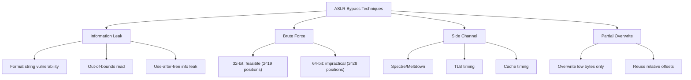

# ASLR — Address Space Layout Randomization

## Introduction

Address Space Layout Randomization (ASLR) is a security technique that randomizes the memory addresses of key process segments — stack, heap, shared libraries, and the executable itself — each time a program runs. By making the memory layout unpredictable, ASLR defeats or significantly complicates exploitation techniques that rely on knowing fixed addresses (e.g., return-to-libc, ROP chains, heap spraying).

ASLR was first implemented in Linux in 2005 (kernel 2.6.12) and is now enabled by default on virtually all Linux distributions. It is one of the foundational exploit mitigation techniques alongside NX (no-execute), stack canaries, and RELRO.

## How ASLR Works

### Process Memory Layout

```mermaid
graph TB
    subgraph "Without ASLR (Fixed Layout)"
        direction TB
        F_HIGH["0x7fff_ffff_f000 — Stack top"]
        F_STACK["Stack (fixed base)"]
        F_MMAP["Shared libraries (fixed at 0x7f...)"]
        F_HEAP["Heap (fixed after .bss)"]
        F_TEXT[".text (fixed at 0x400000)"]
        F_LOW["0x0040_0000 — Text base"]
    end

    subgraph "With ASLR (Randomized)"
        direction TB
        R_HIGH["0x7fff_????_???? — Stack top (random)"]
        R_STACK["Stack (random offset)"]
        R_MMAP["Shared libraries (random base)"]
        R_HEAP["Heap (random offset)"]
        R_TEXT[".text (random if PIE)"]
        R_LOW["0x????_???? — Text base (if PIE)"]
    end
```



### Randomized Segments

| Segment | Non-PIE Binary | PIE Binary |
|---------|---------------|------------|
| **Stack** | Random offset (28 bits of entropy on x86-64) | Same |
| **Heap** | Random offset (brk randomization) | Same |
| **mmap base** | Random base for mmap/malloc/libraries | Same |
| **Text (.text)** | Fixed at 0x400000 | Random base |
| **Shared libraries** | Random base | Same |
| **VDSO** | Random address | Same |

### Entropy Bits

The amount of randomization depends on architecture and pointer size:

```bash
# x86-64 (64-bit)
# Stack: 28 bits of entropy (256 TiB range)
# mmap:  28 bits of entropy
# brk:   32 bits of entropy (with large address space)
# PIE text: 28 bits

# x86 (32-bit)
# Stack: 19 bits (8 MiB alignment → ~512 positions)
# mmap:  8 bits (8 MiB alignment → 256 positions)
# brk:  13 bits (8 MiB alignment → 8192 positions)
```

## ASLR Configuration

### /proc/sys/kernel/randomize_va_space

```bash
# View current ASLR setting
$ cat /proc/sys/kernel/randomize_va_space
2

# Values:
# 0 — ASLR disabled (no randomization)
# 1 — Conservative: stack, mmap, VDSO randomized; heap base fixed
# 2 — Full: all segments randomized (default on most distributions)

# Disable ASLR (requires root)
$ echo 0 | sudo tee /proc/sys/kernel/randomize_va_space

# Enable full ASLR
$ echo 2 | sudo tee /proc/sys/kernel/randomize_va_space
```

### Per-Process ASLR Control

```bash
# Disable ASLR for a specific program
$ setarch $(uname -m) -R ./myprogram
# or
$ setarch x86_64 -R ./myprogram

# The ADDR_NO_RANDOMIZE personality flag
# Equivalent to: personality(current | ADDR_NO_RANDOMIZE)
```

## Observing ASLR

### /proc/pid/maps

The `/proc/[pid]/maps` file shows the current memory layout of a process:

```bash
# Run a program and check its maps
$ cat /proc/self/maps
5571f8e2c000-5571f8e4e000 r-xp 00000000 08:01 131074  /usr/bin/cat
5571f904d000-5571f904f000 r--p 00021000 08:01 131074  /usr/bin/cat
5571f904f000-5571f9050000 rw-p 00023000 08:01 131074  /usr/bin/cat
7f8a1b200000-7f8a1b3c2000 r-xp 00000000 08:01 262147  /usr/lib/libc.so.6
7f8a1b3c2000-7f8a1b5c1000 ---p 001c2000 08:01 262147  /usr/lib/libc.so.6
7f8a1b5c1000-7f8a1b5c5000 r--p 001c1000 08:01 262147  /usr/lib/libc.so.6
7f8a1b5c5000-7f8a1b5c7000 rw-p 001c5000 08:01 262147  /usr/lib/libc.so.6
7f8a1b5c7000-7f8a1b5d3000 rw-p 00000000 00:00 0
7ffd4a5e3000-7ffd4a604000 rw-p 00000000 00:00 0      [stack]
7ffd4a7f8000-7ffd4a7fc000 r--p 00000000 00:00 0      [vvar]
7ffd4a7fc000-7ffd4a7fa000 r-xp 00000000 00:00 0      [vdso]
ffffffffff600000-ffffffffff601000 --xp 00000000 00:00 0 [vsyscall]
```

### Verifying Randomization

```bash
# Run the same program multiple times and compare addresses
$ for i in 1 2 3 4 5; do
    cat /proc/self/maps | head -1
done
5571f8e2c000-5571f8e4e000 r-xp ... /usr/bin/cat
55f3a7b12000-55f3a7b34000 r-xp ... /usr/bin/cat
5623c4d8a000-5623c4dac000 r-xp ... /usr/bin/cat
55b8c1e34000-55b8c1e56000 r-xp ... /usr/bin/cat
56412dc5f000-56412dc81000 r-xp ... /usr/bin/cat

# Notice: the text base address changes each run (PIE binary)

# With ASLR disabled:
$ setarch x86_64 -R cat /proc/self/maps | head -1
555555554000-555555556000 r-xp ... /usr/bin/cat
# Same address every time
```

### Stack and Library Randomization

```bash
# Stack addresses change between runs
$ for i in 1 2 3; do
    setarch x86_64 -R sh -c 'cat /proc/self/maps | grep stack'
done
7fff12345000-7fff12366000 rw-p ... [stack]
7fff56789000-7fff567aa000 rw-p ... [stack]
7fff9abcdef00-7fff9abe0000 rw-p ... [stack]

# Library base addresses change
$ for i in 1 2 3; do
    cat /proc/self/maps | grep libc
done
7f8a1b200000-... /usr/lib/libc.so.6
7f2c3d400000-... /usr/lib/libc.so.6
7f5e6f800000-... /usr/lib/libc.so.6
```

## Implementation Details

### Kernel Implementation

ASLR is implemented in the ELF loader (`fs/binfmt_elf.c`) and the memory management subsystem:

```c
/* From arch/x86/mm/mmap.c */
unsigned long arch_mmap_rnd(void) {
    unsigned long rnd;

    if (mmap_is_ia32())
        rnd = get_random_long() & ((1UL << mmap_rnd_bits) - 1);
    else
        rnd = get_random_long() & ((1UL << mmap_rnd_bits) - 1);

    return rnd << PAGE_SHIFT;
}

/* Stack randomization */
unsigned long randomize_stack_top(unsigned long stack_top) {
    unsigned long random_variable = 0;

    if (current->flags & PF_RANDOMIZE) {
        random_variable = get_random_long();
        random_variable &= STACK_RND_MASK;
        random_variable <<= PAGE_SHIFT;
    }
    return stack_top + random_variable;
}
```

### Mmap Base Calculation

```c
/* Simplified mmap base calculation */
static unsigned long mmap_base(unsigned long rnd) {
    unsigned long gap = rlimit(RLIMIT_STACK);
    if (gap < MIN_GAP)
        gap = MIN_GAP;
    if (gap > MAX_GAP)
        gap = MAX_GAP;

    return PAGE_ALIGN(DEFAULT_MAP_WINDOW - gap - rnd);
}
```

### Entropy Configuration

```bash
# Bits of entropy for mmap randomization
$ cat /proc/sys/vm/mmap_rnd_bits
28

$ cat /proc/sys/vm/mmap_rnd_compat_bits
8

# These can be tuned (usually not recommended)
$ echo 24 | sudo tee /proc/sys/vm/mmap_rnd_bits
```

## ASLR Vulnerabilities and Bypasses

### Known Weaknesses



### 32-bit vs 64-bit Effectiveness

| Architecture | Entropy | Brute Force Feasible? |
|-------------|---------|----------------------|
| x86 (32-bit) Stack | ~19 bits (8 MiB) | Yes (~500K attempts) |
| x86 (32-bit) mmap | ~8 bits (8 MiB) | Yes (256 attempts) |
| x86-64 Stack | ~28 bits (256 TiB) | No |
| x86-64 mmap | ~28 bits (256 TiB) | No |
| ARM32 | ~8 bits | Yes |
| ARM64 | ~28 bits | No |

### Spectre/Meltdown Impact

```bash
# Spectre/Meltdown can leak kernel ASLR addresses
# Mitigations:
# 1. KPTI (Kernel Page Table Isolation)
# 2. Retpoline
# 3. IBRS/IBPB microcode patches

# Check current mitigations
$ cat /sys/devices/system/cpu/vulnerabilities/spectre_v1
Mitigation: usercopy/swapgs barriers and __user pointer sanitization

$ cat /sys/devices/system/cpu/vulnerabilities/spectre_v2
Mitigation: Retpolines, IBPB: conditional, IBRS_FW, STIBP: conditional, RSB filling, PBRSB-eIBRS: Not affected

$ cat /sys/devices/system/cpu/vulnerabilities/meltdown
Mitigation: PTI
```

## PIE (Position-Independent Executables)

For ASLR to fully protect the executable itself, it must be compiled as PIE:

```bash
# Compile with PIE (default on most modern distributions)
$ gcc -o myprogram myprogram.c -pie -fPIE

# Check if a binary is PIE
$ file /usr/bin/cat
/usr/bin/cat: ELF 64-bit LSB pie executable, x86-64, ...

$ file /usr/bin/old_binary
/usr/bin/old_binary: ELF 64-bit LSB executable, x86-64, ...
# Non-PIE: text base is fixed at 0x400000

# Check PIE status with readelf
$ readelf -h /usr/bin/cat | grep Type:
  Type:  DYN (Shared object file)   ← PIE

$ readelf -h /usr/bin/old_binary | grep Type:
  Type:  EXEC (Executable file)     ← Non-PIE
```

### RELRO (Relocation Read-Only)

```bash
# Full RELRO + PIE provides strong protection
$ gcc -o secure program.c -pie -fPIE -Wl,-z,relro,-z,now

# Check RELRO status
$ checksec --file=/usr/bin/cat
RELRO           STACK CANARY      NX            PIE
Full RELRO      Canary found      NX enabled    PIE enabled
```

## Kernel ASLR (KASLR)

The kernel itself also uses ASLR:

```bash
# Check if KASLR is enabled
$ cat /proc/cmdline | grep nokaslr
# If nothing: KASLR is enabled

# Disable KASLR (in bootloader)
# Add "nokaslr" to kernel command line

# View kernel base address (requires root)
$ sudo cat /proc/kallsyms | head -1
ffffffff81000000 T _text
# With KASLR, this changes each boot

# With KASLR disabled:
# ffffffff81000000 T _text  (always the same)
```

## References

- [PaX ASLR documentation](https://pax.grsecurity.net/docs/aslr.txt)
- [Linux kernel ASLR implementation](https://github.com/torvalds/linux/blob/master/arch/x86/mm/mmap.c)
- [CVE-2015-1593 — ASLR bypass via stack entropy leak](https://nvd.nist.gov/vuln/detail/CVE-2015-1593)

## Further Reading

- [The Linux Kernel Documentation](https://docs.kernel.org/)
- [GNU Project Documentation](https://www.gnu.org/doc/doc.html)
- [GNU Manuals](https://www.gnu.org/manual/manual.html)
- [Free Software Directory](https://directory.fsf.org/wiki/Main_Page)
- [Planet GNU](https://planet.gnu.org/)
- [Free Software Books](https://www.gnu.org/doc/other-free-books.html)

- https://man7.org/linux/man-pages/man5/core.5.html — core dump format and ASLR
- https://man7.org/linux/man-pages/man8/sysctl.8.html — sysctl randomize_va_space
- https://lwn.net/Articles/667236/ — "Revisiting kernel ASLR"
- https://grsecurity.net/ — Advanced ASLR and hardening
- https://pax.grsecurity.net/docs/aslr.txt — Original ASLR design document

## Related Topics

- [compaction](./compaction.md) — Memory layout affects compaction behavior
- [zones](./zones.md) — Memory zones used for kernel ASLR
- [barriers](./barriers.md) — Memory ordering in ASLR-sensitive code
- [numa](./numa.md) — NUMA affects memory layout and ASLR
