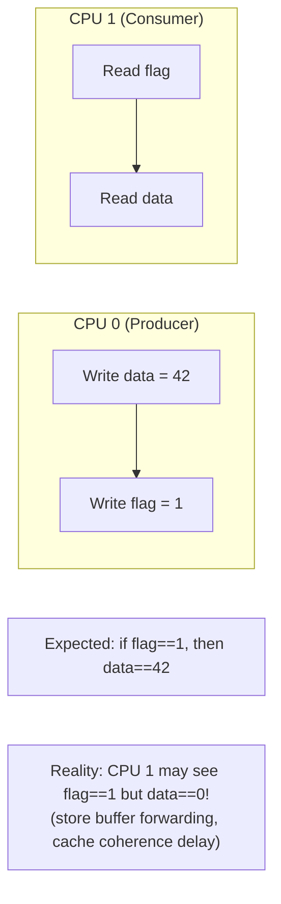
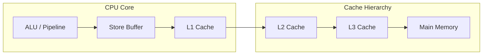
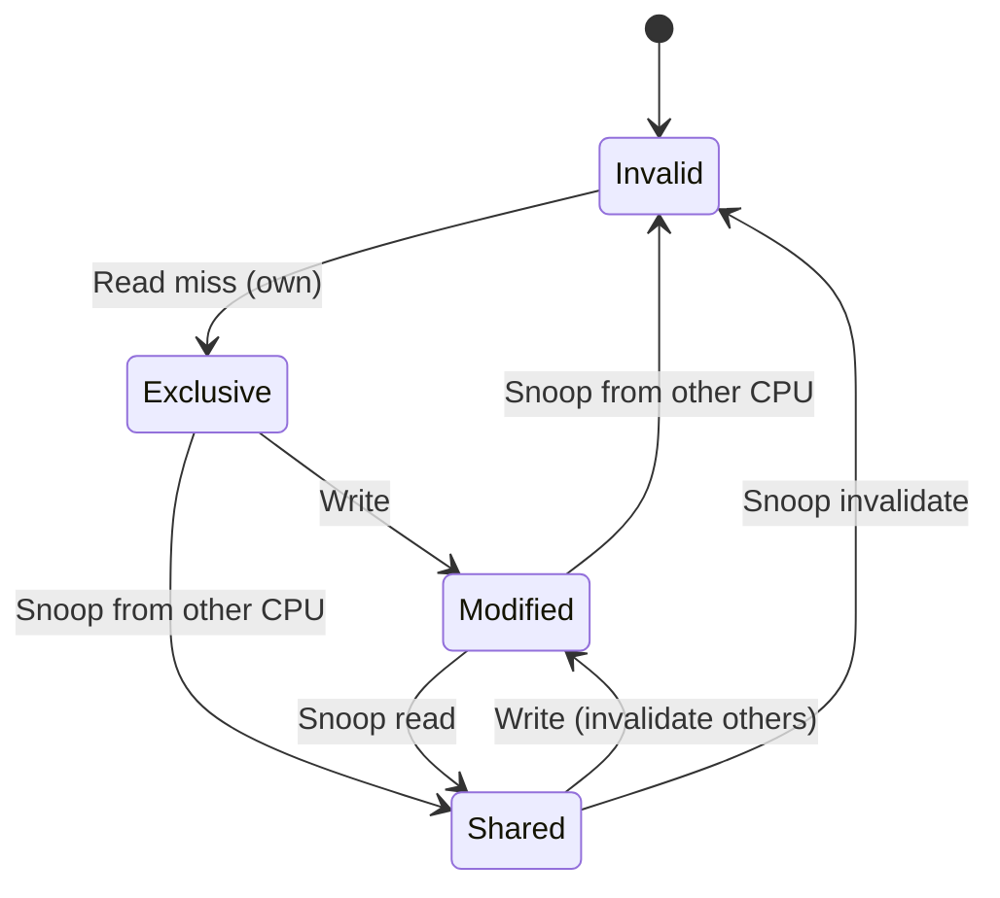
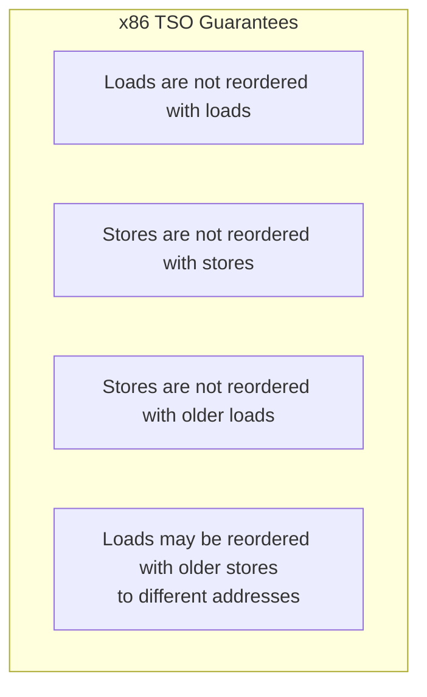
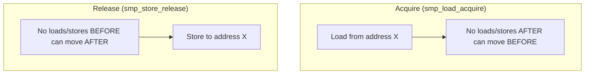

# Memory Barriers

## Introduction

Memory barriers (also called memory fences) are CPU instructions or compiler directives that enforce ordering constraints on memory operations. In modern CPUs with out-of-order execution, store buffers, and multiple cores, the order in which memory reads and writes appear to execute may differ from the program order. Memory barriers ensure that operations before the barrier complete before operations after the barrier become visible.

Without memory barriers, concurrent code that shares data between CPUs can see stale, partial, or reordered values — leading to data corruption, race conditions, and subtle bugs that are nearly impossible to reproduce.

## Why Memory Ordering Matters

### The Problem



### CPU Reordering

Modern CPUs reorder memory operations for performance:

```c
/* CPU 0 */                 /* CPU 1 */
x = 1;                      while (flag == 0) {}
flag = 1;                   print(x);  // May print 0!
```

The CPU may reorder the stores to `x` and `flag` (store-store reordering), or CPU 1 may reorder the loads (load-load reordering). The result: CPU 1 sees `flag == 1` but reads the old value of `x`.

### Compiler Reordering

The compiler also reorders operations for optimization:

```c
/* Original code */
a = 1;
b = 2;

/* Compiler may reorder (if no dependency) */
b = 2;
a = 1;
```

The compiler is free to reorder independent stores because it doesn't know about concurrent access from other CPUs.

## Store Buffers and Cache Coherence

### Store Buffer Architecture

Modern CPUs use **store buffers** between the CPU pipeline and the cache hierarchy:



**Store buffer behavior:**

1. When a CPU executes a store, the data is written to the store buffer first.
2. The store is committed to L1 cache when the buffer drains.
3. Other CPUs cannot see stores until they reach L1 (or are snooped).
4. The store buffer can forward data to subsequent loads on the same CPU (store-to-load forwarding).

**This causes store-store reordering:**

```
CPU 0 executes:         CPU 0 store buffer:
  x = 42                  [x=42]
  flag = 1                [x=42, flag=1]
  CPU 1 reads flag=1      [x=42] (flag drained first!)
  CPU 1 reads x=0         [x=42] (not yet drained!)
```

### Cache Coherence Protocol (MESI)

The MESI protocol ensures cache coherence:



| State | Description |
|-------|-------------|
| **Modified** | Only this CPU has the line, it's dirty |
| **Exclusive** | Only this CPU has the line, it's clean |
| **Shared** | Multiple CPUs may have the line |
| **Invalid** | Line is not valid |

Even with MESI, the store buffer causes ordering issues because stores are not immediately visible to other CPUs.

## Types of Barriers

### Hardware Memory Barriers

| Barrier | x86 Instruction | ARM64 Instruction | Description |
|---------|-----------------|-------------------|-------------|
| **Full barrier** | `mfence` | `dmb ish` | All loads/stores before are visible before any after |
| **Store barrier** | `sfence` | `dmb ishst` | All stores before are visible before any stores after |
| **Load barrier** | `lfence` | `dmb ishld` | All loads before are visible before any loads after |
| **Acquire** | (none, x86 is TSO) | `ldar` | Load-acquire: no loads/stores after can move before |
| **Release** | (none, x86 is TSO) | `stlr` | Store-release: no loads/stores before can move after |

### x86 Total Store Order (TSO)

x86 CPUs have a relatively strong memory model:



This means x86 rarely needs explicit barriers for simple producer-consumer patterns. ARM64 has a weaker model and requires explicit barriers more often.

### x86 Memory Model Details

```c
/* x86 TSO rules: */
/* 1. Load-load ordering: guaranteed (no fence needed) */
/* 2. Store-store ordering: guaranteed (no fence needed) */
/* 3. Load-store ordering: guaranteed (no fence needed) */
/* 4. Store-load ordering: NOT guaranteed! (needs mfence) */

/* The only reordering x86 allows: */
/* - Store followed by load to DIFFERENT address */
/* - The store sits in the store buffer while the load executes */

/* This is why smp_mb() on x86 uses mfence: */
/* It's the only case where a barrier is needed */
```

### ARM64 Memory Model

ARM64 has a weaker memory model (weakly ordered):

```c
/* ARM64 allows all reordering unless explicitly constrained: */
/* - Load-load can be reordered */
/* - Store-store can be reordered */
/* - Load-store can be reordered */
/* - Store-load can be reordered */

/* ARM64 needs barriers for ALL ordering requirements: */
#define smp_rmb()   dmb(ishld)   /* Load-load barrier */
#define smp_wmb()   dmb(ishst)   /* Store-store barrier */
#define smp_mb()    dmb(ish)     /* Full barrier */
```

## Linux Kernel Memory Barriers

### `smp_rmb()` — Read Memory Barrier

Ensures all loads before the barrier complete before any loads after:

```c
/* CPU 0 (Producer) */
data = 42;
smp_wmb();  /* Store barrier */
flag = 1;

/* CPU 1 (Consumer) */
if (flag) {
    smp_rmb();  /* Load barrier */
    assert(data == 42);  /* Guaranteed */
}
```

### `smp_wmb()` — Write Memory Barrier

Ensures all stores before the barrier complete before any stores after:

```c
/* Producer: ensure data is visible before flag */
data = 42;
smp_wmb();
flag = 1;
```

### `smp_mb()` — Full Memory Barrier

Ensures all loads and stores before the barrier complete before any loads and stores after:

```c
/* Lock-like semantics */
smp_mb();
/* All prior operations are visible to all CPUs */
```

### `smp_store_release()` / `smp_load_acquire()`

Modern, preferred barrier pairs:

```c
struct data *shared_ptr = NULL;

/* CPU 0: Producer */
struct data *d = kmalloc(sizeof(*d), GFP_KERNEL);
d->value = 42;
d->status = READY;
smp_store_release(&shared_ptr, d);  /* Release: all prior stores visible */

/* CPU 1: Consumer */
struct data *d = smp_load_acquire(&shared_ptr);  /* Acquire: all subsequent loads see d's data */
if (d) {
    assert(d->value == 42);      /* Guaranteed */
    assert(d->status == READY);  /* Guaranteed */
}
```

### Acquire/Release Semantics in Detail



**Acquire semantics** (on a load):
- The load itself completes before any subsequent loads or stores.
- Acts as a one-way barrier: things can't move down past it.

**Release semantics** (on a store):
- All prior loads and stores complete before the store.
- Acts as a one-way barrier: things can't move up past it.

**Why acquire/release is preferred over full barriers:**

```c
/* Full barrier (expensive on weak architectures): */
data = 42;
smp_mb();          /* Full barrier: flush store buffer */
flag = 1;

/* Release (cheaper on ARM64, same effect): */
data = 42;
smp_store_release(&flag, 1);  /* Single instruction: stlr */
```

### `smp_mb__before_atomic()` / `smp_mb__after_atomic()`

Barriers paired with atomic operations:

```c
/* Ensure ordering around atomic operations */
data = 42;
smp_mb__before_atomic();
atomic_inc(&counter);
/* data=42 is visible before counter increment */

/* Or use atomic operations with built-in ordering */
atomic_inc_return_release(&counter);  /* Release semantics */
atomic_read_acquire(&counter);        /* Acquire semantics */
```

### `smp_mb__after_spinlock()`

Barrier after acquiring a spinlock (when the spinlock itself doesn't provide sufficient ordering):

```c
spin_lock(&lock);
smp_mb__after_spinlock();  /* Full barrier after lock acquisition */
/* All prior stores from other CPUs are now visible */
```

**When is this needed?** On x86, spin_lock already implies a full barrier (via the `LOCK` prefix on the xchg instruction). On weakly-ordered architectures, the spinlock may not provide sufficient ordering for all cases.

## Compiler Barriers

### `barrier()`

Prevents the compiler from reordering operations across the barrier:

```c
/* Compiler barrier — no CPU barrier emitted */
int ready = 0;
int data;

/* Producer */
data = 42;
barrier();  /* Compiler won't move data=42 past this point */
ready = 1;

/* Consumer */
while (!ready) {
    barrier();  /* Compiler won't hoist load of ready out of loop */
}
printf("%d\n", data);  /* Compiler ensures data is re-read */
```

### `READ_ONCE()` / `WRITE_ONCE()`

Prevent compiler from optimizing away or tearing memory accesses:

```c
/* Without READ_ONCE: compiler may read flag multiple times or cache in register */
while (flag) { }  /* Compiler may optimize to: if (flag) while(1) {} */

/* With READ_ONCE: single, atomic read each time */
while (READ_ONCE(flag)) { }  /* Compiler must re-read from memory */

/* WRITE_ONCE: single, atomic write */
WRITE_ONCE(flag, 1);  /* Compiler cannot split or optimize this */
```

**Why READ_ONCE/WRITE_ONCE matter:**

```c
/* Problem 1: Compiler caching */
int flag = 0;
while (flag == 0) { }  /* Compiler sees flag never changes, optimizes to infinite loop */

/* Problem 2: Tearing (non-atomic access to word-sized values) */
/* On 32-bit system, 64-bit write may be split into two 32-bit writes */
long long value = 0x0000000100000002LL;
/* Compiler may emit: */
/*   movl $2, value      (low 32 bits) */
/*   movl $1, value+4    (high 32 bits) */
/* Reader between these two writes sees 0x0000000000000002 */

WRITE_ONCE(value, 0x0000000100000002LL);  /* Atomic write */
```

### `OPTIMIZER_HIDE_VAR()`

Prevents the compiler from making assumptions about a variable's value:

```c
int x = 0;
/* Compiler may reason that x is always 0 and optimize away code */
OPTIMIZER_HIDE_VAR(x);
/* Now the compiler must treat x as potentially non-zero */
```

## Complete Example: Producer-Consumer

```c
#include <linux/kthread.h>
#include <linux/completion.h>
#include <linux/delay.h>

static int shared_data;
static int shared_flag;
static struct completion done;

/* Producer thread */
static int producer_fn(void *arg) {
    /* Write data first */
    shared_data = 42;

    /* Store barrier: data=42 is visible before flag=1 */
    smp_wmb();

    /* Set flag */
    WRITE_ONCE(shared_flag, 1);

    /* Wake up consumer */
    complete(&done);
    return 0;
}

/* Consumer thread */
static int consumer_fn(void *arg) {
    /* Wait for producer */
    wait_for_completion(&done);

    /* Load barrier: ensure we see data=42 if we see flag=1 */
    smp_rmb();

    if (READ_ONCE(shared_flag)) {
        pr_info("Data: %d\n", shared_data);  /* Guaranteed 42 */
    }
    return 0;
}
```

## Barrier Usage Patterns

### Spinlock-Based Pattern

```c
/* spin_lock provides implicit barriers */
spin_lock(&lock);
/* All operations inside are protected */
data->field = value;
list_add(&data->list, &head);
spin_unlock(&lock);
/* spin_unlock provides release semantics */
```

### RCU (Read-Copy-Update) Pattern

```c
/* Writer: update with release */
rcu_read_lock();
old = rcu_dereference(ptr);
new = kmalloc(sizeof(*new), GFP_KERNEL);
*new = *old;
new->field = new_value;
rcu_assign_pointer(ptr, new);  /* Store-release */
rcu_read_unlock();

/* Reader: access with acquire */
rcu_read_lock();
p = rcu_dereference(ptr);  /* Load-acquire */
do_something(p->field);
rcu_read_unlock();
```

### Double-Checked Locking

```c
static struct resource *cached_resource;
static DEFINE_MUTEX(resource_lock);

struct resource *get_resource(void) {
    struct resource *r;

    /* Fast path: check without lock */
    r = smp_load_acquire(&cached_resource);
    if (r)
        return r;

    /* Slow path: lock and re-check */
    mutex_lock(&resource_lock);
    r = cached_resource;
    if (!r) {
        r = allocate_resource();
        smp_store_release(&cached_resource, r);
    }
    mutex_unlock(&resource_lock);
    return r;
}
```

### Lock-Free Stack (Treiber Stack)

```c
struct node {
    int data;
    struct node *next;
};

static struct node *head = NULL;

void push(int value)
{
    struct node *new_node = kmalloc(sizeof(*new_node), GFP_ATOMIC);
    new_node->data = value;

    do {
        new_node->next = smp_load_acquire(&head);
    } while (cmpxchg_release(&head, new_node->next, new_node) != new_node->next);
}

struct node *pop(void)
{
    struct node *old_head;

    do {
        old_head = smp_load_acquire(&head);
        if (!old_head)
            return NULL;
    } while (cmpxchg_release(&head, old_head, old_head->next) != old_head);

    return old_head;
}
```

### Per-CPU Data Access

```c
/* Per-CPU data doesn't need barriers for local access */
/* But does need barriers when sharing between CPUs */

DEFINE_PER_CPU(int, counter);

void increment_counter(void)
{
    /* No barrier needed — per-CPU, no sharing */
    this_cpu_inc(counter);
}

int read_all_counters(void)
{
    int cpu, total = 0;

    /* Need barrier to ensure we see consistent values */
    smp_rmb();

    for_each_online_cpu(cpu)
        total += per_cpu(counter, cpu);

    return total;
}
```

## Barrier Comparison Table

| Barrier | Compiler | CPU | Use Case |
|---------|----------|-----|----------|
| `barrier()` | ✅ | ❌ | Prevent compiler reordering only |
| `READ_ONCE()` / `WRITE_ONCE()` | ✅ | ❌ | Prevent compiler tearing/optimization |
| `smp_rmb()` | ✅ | ✅ (SMP) | Load-load ordering |
| `smp_wmb()` | ✅ | ✅ (SMP) | Store-store ordering |
| `smp_mb()` | ✅ | ✅ (SMP) | Full ordering |
| `smp_store_release()` | ✅ | ✅ (SMP) | Release semantics |
| `smp_load_acquire()` | ✅ | ✅ (SMP) | Acquire semantics |
| `smp_mb__before_atomic()` | ✅ | ✅ (SMP) | Barrier before atomic op |
| `smp_mb__after_atomic()` | ✅ | ✅ (SMP) | Barrier after atomic op |
| `smp_mb__after_spinlock()` | ✅ | ✅ (SMP) | Barrier after spinlock |
| `mb()` | ✅ | ✅ (UP+SMP) | Unconditional full barrier |
| `rmb()` | ✅ | ✅ (UP+SMP) | Unconditional load barrier |
| `wmb()` | ✅ | ✅ (UP+SMP) | Unconditional store barrier |

Note: `smp_*` variants are no-ops on uniprocessor (UP) kernels. The non-`smp_` variants always emit barriers regardless of SMP configuration.

## Implementation Details

### x86 Implementation

```c
/* arch/x86/include/asm/barrier.h */

/* Full barrier */
#define mb()    asm volatile("mfence" ::: "memory")

/* Load barrier */
#define rmb()   asm volatile("lfence" ::: "memory")

/* Store barrier */
#define wmb()   asm volatile("sfence" ::: "memory")

/* Compiler barrier */
#define barrier() asm volatile("" ::: "memory")

/* SMP barriers (no-op on UP) */
#ifdef CONFIG_SMP
#define smp_mb()    asm volatile("lock; addl $0, -4(%%rsp)" ::: "memory")
#define smp_rmb()   barrier()
#define smp_wmb()   barrier()
#else
#define smp_mb()    barrier()
#define smp_rmb()   barrier()
#define smp_wmb()   barrier()
#endif
```

Note: On x86, `smp_rmb()` and `smp_wmb()` are just compiler barriers because TSO already guarantees load-load and store-store ordering. Only a full `smp_mb()` needs a hardware fence.

### ARM64 Implementation

```c
/* arch/arm64/include/asm/barrier.h */

#define dmb(opt)    asm volatile("dmb " #opt ::: "memory")

#define mb()        dmb(sy)
#define rmb()       dmb(ld)
#define wmb()       dmb(st)

#define smp_mb()    dmb(ish)
#define smp_rmb()   dmb(ishld)
#define smp_wmb()   dmb(ishst)

#define __smp_store_release(p, v)                   \
    do {                                            \
        typeof(p) __p = (p);                        \
        union { typeof(*__p) __val; u64 __u; } __u = \
            { .__val = (__force typeof(*__p)) (v) };\
        compiletime_assert_atomic_type(*__p);       \
        switch (sizeof(*__p)) {                     \
        case 1:                                     \
            asm volatile("stlrb %w1, %0"            \
                : "=Q" (*__p)                       \
                : "r" (__u.__val)                   \
                : "memory");                        \
            break;                                  \
        case 4:                                     \
            asm volatile("stlr %w1, %0"             \
                : "=Q" (*__p)                       \
                : "r" (__u.__val)                   \
                : "memory");                        \
            break;                                  \
        /* ... */                                   \
        }                                           \
    } while (0)
```

### RISC-V Implementation

```c
/* arch/riscv/include/asm/barrier.h */

#define RISCV_FENCE(p, s) \
    asm volatile ("fence " #p "," #s ::: "memory")

#define mb()        RISCV_FENCE(iorw, iorw)
#define rmb()       RISCV_FENCE(ir, ir)
#define wmb()       RISCV_FENCE(ow, ow)

#define smp_mb()    RISCV_FENCE(rw, rw)
#define smp_rmb()   RISCV_FENCE(r, r)
#define smp_wmb()   RISCV_FENCE(w, w)

/* RISC-V Ztso extension provides TSO-like ordering */
/* When Ztso is present, most barriers become NOPs */
```

## When Barriers Are NOT Needed

Understanding when barriers are unnecessary is as important as knowing when to use them:

### Implicit Barriers

```c
/* 1. Spinlock acquire/release */
spin_lock(&lock);   /* Implies acquire barrier */
/* ... */
spin_unlock(&lock); /* Implies release barrier */

/* 2. Atomic operations with return value */
atomic_inc(&counter);        /* No implicit barrier (on most architectures) */
atomic_inc_return(&counter); /* Implies full barrier */

/* 3. Memory allocation */
ptr = kmalloc(size, GFP_KERNEL);
/* kmalloc implies a barrier — the returned memory is zeroed and visible */

/* 4. System calls */
/* Entering/exiting kernel mode implies full barriers */

/* 5. Interrupt handling */
/* Entering/exiting interrupt context implies full barriers */
```

### Dependencies That Imply Ordering

```c
/* Address dependency: load-load ordering is guaranteed */
p = READ_ONCE(ptr);
x = p->field;  /* Guaranteed to see ptr->field after ptr itself */

/* Control dependency: if-then ordering */
if (READ_ONCE(flag)) {
    /* Compiler and CPU won't move this before the if */
    x = data;
}

/* Data dependency: write-write ordering */
new->field = 42;
rcu_assign_pointer(ptr, new);  /* field=42 is visible before ptr update */
```

## Linux Kernel Memory Model (LKMM)

The Linux Kernel Memory Model formalizes the ordering guarantees:

```c
/* LKMM documentation: tools/memory-model/ */
/* Key concepts: */
/* - Happens-before (hb) */
/* - Propagation */
/* - Coherence */
/* - Atomicity */

/* LKMM defines which barriers provide which ordering */
/* It's been formalized and can be verified with tools */

/* Check a litmus test: */
/* C C-W+W-W+R-rfi+mb-smp_mb */
/* */
/* { */
/* } */
/* */
/* P0(int *x, int *y) */
/* { */
/*     WRITE_ONCE(*x, 1); */
/*     smp_mb(); */
/*     WRITE_ONCE(*y, 1); */
/* } */
/* */
/* P1(int *x, int *y) */
/* { */
/*     int r0 = READ_ONCE(*y); */
/*     smp_mb(); */
/*     int r1 = READ_ONCE(*x); */
/* } */
/* */
/* exists (1:r0=1 /\ 1:r1=0) */
/* This should be forbidden — smp_mb() prevents it */
```

## References

- [Linux kernel memory-barriers.txt](https://www.kernel.org/doc/html/latest/process/volatile-considered-harmful.html)
- [Kernel documentation: memory barriers](https://www.kernel.org/doc/html/latest/core-api/wrappers/memory-barriers.html)
- [LKMM (Linux Kernel Memory Model)](https://www.kernel.org/doc/html/latest/RCU/whatisRCU.html)

## Further Reading

- [The Linux Kernel Documentation](https://docs.kernel.org/)
- [GNU Project Documentation](https://www.gnu.org/doc/doc.html)
- [GNU Manuals](https://www.gnu.org/manual/manual.html)
- [Free Software Directory](https://directory.fsf.org/wiki/Main_Page)
- [Planet GNU](https://planet.gnu.org/)
- [Free Software Books](https://www.gnu.org/doc/other-free-books.html)

- https://www.kernel.org/doc/html/latest/core-api/wrappers/memory-barriers.html
- https://www.kernel.org/doc/html/latest/process/volatile-considered-harmful.html
- https://lwn.net/Articles/847481/ — "An introduction to lockless algorithms"
- https://www.open-std.org/jtc1/sc22/wg21/docs/papers/2018/p0124r7.html — C++ memory model (reference)
- https://www.cl.cam.ac.uk/~pes20/ppc-supplemental/test64.pdf — "Memory Barriers: a Hardware View"

## Related Topics

- [buffer-cache](./buffer-cache.md) — Buffer cache uses barriers for consistency
- [numa](./numa.md) — NUMA systems need stronger barriers
- [aslr](./aslr.md) — ASLR implementation uses barriers
- [compaction](./compaction.md) — Memory compaction uses barriers for page migration
