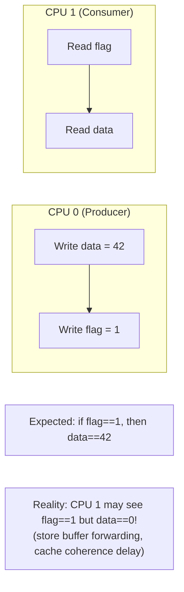
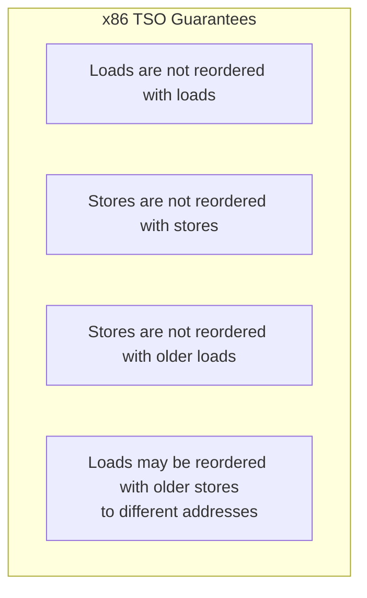

# Memory Barriers

## Introduction

Memory barriers (also called memory fences) are CPU instructions or compiler directives that enforce ordering constraints on memory operations. In modern CPUs with out-of-order execution, store buffers, and multiple cores, the order in which memory reads and writes appear to execute may differ from the program order. Memory barriers ensure that operations before the barrier complete before operations after the barrier become visible.

Without memory barriers, concurrent code that shares data between CPUs can see stale, partial, or reordered values — leading to data corruption, race conditions, and subtle bugs that are nearly impossible to reproduce.

## Why Memory Ordering Matters

### The Problem



### CPU Reordering

Modern CPUs reorder memory operations for performance:

```c
/* CPU 0 */                 /* CPU 1 */
x = 1;                      while (flag == 0) {}
flag = 1;                   print(x);  // May print 0!
```

The CPU may reorder the stores to `x` and `flag` (store-store reordering), or CPU 1 may reorder the loads (load-load reordering). The result: CPU 1 sees `flag == 1` but reads the old value of `x`.

### Compiler Reordering

The compiler also reorders operations for optimization:

```c
/* Original code */
a = 1;
b = 2;

/* Compiler may reorder (if no dependency) */
b = 2;
a = 1;
```

## Types of Barriers

### Hardware Memory Barriers

| Barrier | x86 Instruction | ARM64 Instruction | Description |
|---------|-----------------|-------------------|-------------|
| **Full barrier** | `mfence` | `dmb ish` | All loads/stores before are visible before any after |
| **Store barrier** | `sfence` | `dmb ishst` | All stores before are visible before any stores after |
| **Load barrier** | `lfence` | `dmb ishld` | All loads before are visible before any loads after |
| **Acquire** | (none, x86 is TSO) | `ldar` | Load-acquire: no loads/stores after can move before |
| **Release** | (none, x86 is TSO) | `stlr` | Store-release: no loads/stores before can move after |

### x86 Total Store Order (TSO)

x86 CPUs have a relatively strong memory model:



This means x86 rarely needs explicit barriers for simple producer-consumer patterns. ARM64 has a weaker model and requires explicit barriers more often.

## Linux Kernel Memory Barriers

### `smp_rmb()` — Read Memory Barrier

Ensures all loads before the barrier complete before any loads after:

```c
/* CPU 0 (Producer) */
data = 42;
smp_wmb();  /* Store barrier */
flag = 1;

/* CPU 1 (Consumer) */
if (flag) {
    smp_rmb();  /* Load barrier */
    assert(data == 42);  /* Guaranteed */
}
```

### `smp_wmb()` — Write Memory Barrier

Ensures all stores before the barrier complete before any stores after:

```c
/* Producer: ensure data is visible before flag */
data = 42;
smp_wmb();
flag = 1;
```

### `smp_mb()` — Full Memory Barrier

Ensures all loads and stores before the barrier complete before any loads and stores after:

```c
/* Lock-like semantics */
smp_mb();
/* All prior operations are visible to all CPUs */
```

### `smp_store_release()` / `smp_load_acquire()`

Modern, preferred barrier pairs:

```c
struct data *shared_ptr = NULL;

/* CPU 0: Producer */
struct data *d = kmalloc(sizeof(*d), GFP_KERNEL);
d->value = 42;
d->status = READY;
smp_store_release(&shared_ptr, d);  /* Release: all prior stores visible */

/* CPU 1: Consumer */
struct data *d = smp_load_acquire(&shared_ptr);  /* Acquire: all subsequent loads see d's data */
if (d) {
    assert(d->value == 42);      /* Guaranteed */
    assert(d->status == READY);  /* Guaranteed */
}
```

### `smp_mb__before_atomic()` / `smp_mb__after_atomic()`

Barriers paired with atomic operations:

```c
/* Ensure ordering around atomic operations */
data = 42;
smp_mb__before_atomic();
atomic_inc(&counter);
/* data=42 is visible before counter increment */

/* Or use atomic operations with built-in ordering */
atomic_inc_return_release(&counter);  /* Release semantics */
atomic_read_acquire(&counter);        /* Acquire semantics */
```

### `smp_mb__after_spinlock()`

Barrier after acquiring a spinlock (when the spinlock itself doesn't provide sufficient ordering):

```c
spin_lock(&lock);
smp_mb__after_spinlock();  /* Full barrier after lock acquisition */
/* All prior stores from other CPUs are now visible */
```

## Compiler Barriers

### `barrier()`

Prevents the compiler from reordering operations across the barrier:

```c
/* Compiler barrier — no CPU barrier emitted */
int ready = 0;
int data;

/* Producer */
data = 42;
barrier();  /* Compiler won't move data=42 past this point */
ready = 1;

/* Consumer */
while (!ready) {
    barrier();  /* Compiler won't hoist load of ready out of loop */
}
printf("%d\n", data);  /* Compiler ensures data is re-read */
```

### `READ_ONCE()` / `WRITE_ONCE()`

Prevent compiler from optimizing away or tearing memory accesses:

```c
/* Without READ_ONCE: compiler may read flag multiple times or cache in register */
while (flag) { }  /* Compiler may optimize to: if (flag) while(1) {} */

/* With READ_ONCE: single, atomic read each time */
while (READ_ONCE(flag)) { }  /* Compiler must re-read from memory */

/* WRITE_ONCE: single, atomic write */
WRITE_ONCE(flag, 1);  /* Compiler cannot split or optimize this */
```

### `OPTIMIZER_HIDE_VAR()`

Prevents the compiler from making assumptions about a variable's value:

```c
int x = 0;
/* Compiler may reason that x is always 0 and optimize away code */
OPTIMIZER_HIDE_VAR(x);
/* Now the compiler must treat x as potentially non-zero */
```

## Complete Example: Producer-Consumer

```c
#include <linux/kthread.h>
#include <linux/completion.h>
#include <linux/delay.h>

static int shared_data;
static int shared_flag;
static struct completion done;

/* Producer thread */
static int producer_fn(void *arg) {
    /* Write data first */
    shared_data = 42;

    /* Store barrier: data=42 is visible before flag=1 */
    smp_wmb();

    /* Set flag */
    WRITE_ONCE(shared_flag, 1);

    /* Wake up consumer */
    complete(&done);
    return 0;
}

/* Consumer thread */
static int consumer_fn(void *arg) {
    /* Wait for producer */
    wait_for_completion(&done);

    /* Load barrier: ensure we see data=42 if we see flag=1 */
    smp_rmb();

    if (READ_ONCE(shared_flag)) {
        pr_info("Data: %d\n", shared_data);  /* Guaranteed 42 */
    }
    return 0;
}
```

## Barrier Usage Patterns

### Spinlock-Based Pattern

```c
/* spin_lock provides implicit barriers */
spin_lock(&lock);
/* All operations inside are protected */
data->field = value;
list_add(&data->list, &head);
spin_unlock(&lock);
/* spin_unlock provides release semantics */
```

### RCU (Read-Copy-Update) Pattern

```c
/* Writer: update with release */
rcu_read_lock();
old = rcu_dereference(ptr);
new = kmalloc(sizeof(*new), GFP_KERNEL);
*new = *old;
new->field = new_value;
rcu_assign_pointer(ptr, new);  /* Store-release */
rcu_read_unlock();

/* Reader: access with acquire */
rcu_read_lock();
p = rcu_dereference(ptr);  /* Load-acquire */
do_something(p->field);
rcu_read_unlock();
```

### Double-Checked Locking

```c
static struct resource *cached_resource;
static DEFINE_MUTEX(resource_lock);

struct resource *get_resource(void) {
    struct resource *r;

    /* Fast path: check without lock */
    r = smp_load_acquire(&cached_resource);
    if (r)
        return r;

    /* Slow path: lock and re-check */
    mutex_lock(&resource_lock);
    r = cached_resource;
    if (!r) {
        r = allocate_resource();
        smp_store_release(&cached_resource, r);
    }
    mutex_unlock(&resource_lock);
    return r;
}
```

## Barrier Comparison Table

| Barrier | Compiler | CPU | Use Case |
|---------|----------|-----|----------|
| `barrier()` | ✅ | ❌ | Prevent compiler reordering only |
| `READ_ONCE()` / `WRITE_ONCE()` | ✅ | ❌ | Prevent compiler tearing/optimization |
| `smp_rmb()` | ✅ | ✅ (SMP) | Load-load ordering |
| `smp_wmb()` | ✅ | ✅ (SMP) | Store-store ordering |
| `smp_mb()` | ✅ | ✅ (SMP) | Full ordering |
| `smp_store_release()` | ✅ | ✅ (SMP) | Release semantics |
| `smp_load_acquire()` | ✅ | ✅ (SMP) | Acquire semantics |
| `mb()` | ✅ | ✅ (UP+SMP) | Unconditional full barrier |
| `rmb()` | ✅ | ✅ (UP+SMP) | Unconditional load barrier |
| `wmb()` | ✅ | ✅ (UP+SMP) | Unconditional store barrier |

Note: `smp_*` variants are no-ops on uniprocessor (UP) kernels. The non-`smp_` variants always emit barriers regardless of SMP configuration.

## Implementation Details

### x86 Implementation

```c
/* arch/x86/include/asm/barrier.h */

/* Full barrier */
#define mb()    asm volatile("mfence" ::: "memory")

/* Load barrier */
#define rmb()   asm volatile("lfence" ::: "memory")

/* Store barrier */
#define wmb()   asm volatile("sfence" ::: "memory")

/* Compiler barrier */
#define barrier() asm volatile("" ::: "memory")

/* SMP barriers (no-op on UP) */
#ifdef CONFIG_SMP
#define smp_mb()    asm volatile("lock; addl $0, -4(%%rsp)" ::: "memory")
#define smp_rmb()   barrier()
#define smp_wmb()   barrier()
#else
#define smp_mb()    barrier()
#define smp_rmb()   barrier()
#define smp_wmb()   barrier()
#endif
```

Note: On x86, `smp_rmb()` and `smp_wmb()` are just compiler barriers because TSO already guarantees load-load and store-store ordering. Only a full `smp_mb()` needs a hardware fence.

### ARM64 Implementation

```c
/* arch/arm64/include/asm/barrier.h */

#define dmb(opt)    asm volatile("dmb " #opt ::: "memory")

#define mb()        dmb(sy)
#define rmb()       dmb(ld)
#define wmb()       dmb(st)

#define smp_mb()    dmb(ish)
#define smp_rmb()   dmb(ishld)
#define smp_wmb()   dmb(ishst)

#define __smp_store_release(p, v)                   \
    do {                                            \
        typeof(p) __p = (p);                        \
        union { typeof(*__p) __val; u64 __u; } __u = \
            { .__val = (__force typeof(*__p)) (v) };\
        compiletime_assert_atomic_type(*__p);       \
        switch (sizeof(*__p)) {                     \
        case 1:                                     \
            asm volatile("stlrb %w1, %0"            \
                : "=Q" (*__p)                       \
                : "r" (__u.__val)                   \
                : "memory");                        \
            break;                                  \
        case 4:                                     \
            asm volatile("stlr %w1, %0"             \
                : "=Q" (*__p)                       \
                : "r" (__u.__val)                   \
                : "memory");                        \
            break;                                  \
        /* ... */                                   \
        }                                           \
    } while (0)
```

## References

- [Linux kernel memory-barriers.txt](https://www.kernel.org/doc/html/latest/process/volatile-considered-harmful.html)
- [Kernel documentation: memory barriers](https://www.kernel.org/doc/html/latest/core-api/wrappers/memory-barriers.html)
- [LKMM (Linux Kernel Memory Model)](https://www.kernel.org/doc/html/latest/RCU/whatisRCU.html)

## Further Reading

- https://www.kernel.org/doc/html/latest/core-api/wrappers/memory-barriers.html
- https://www.kernel.org/doc/html/latest/process/volatile-considered-harmful.html
- https://lwn.net/Articles/847481/ — "An introduction to lockless algorithms"
- https://www.open-std.org/jtc1/sc22/wg21/docs/papers/2018/p0124r7.html — C++ memory model (reference)
- https://www.cl.cam.ac.uk/~pes20/ppc-supplemental/test64.pdf — "Memory Barriers: a Hardware View"

## Related Topics

- [buffer-cache](./buffer-cache.md) — Buffer cache uses barriers for consistency
- [numa](./numa.md) — NUMA systems need stronger barriers
- [aslr](./aslr.md) — ASLR implementation uses barriers
- [compaction](./compaction.md) — Memory compaction uses barriers for page migration
