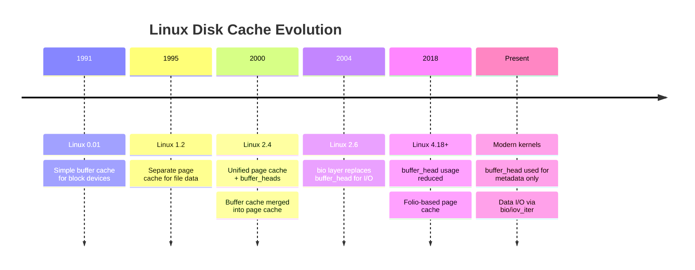
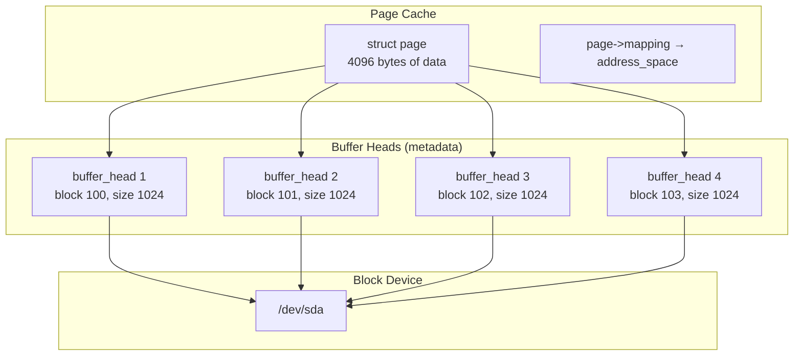
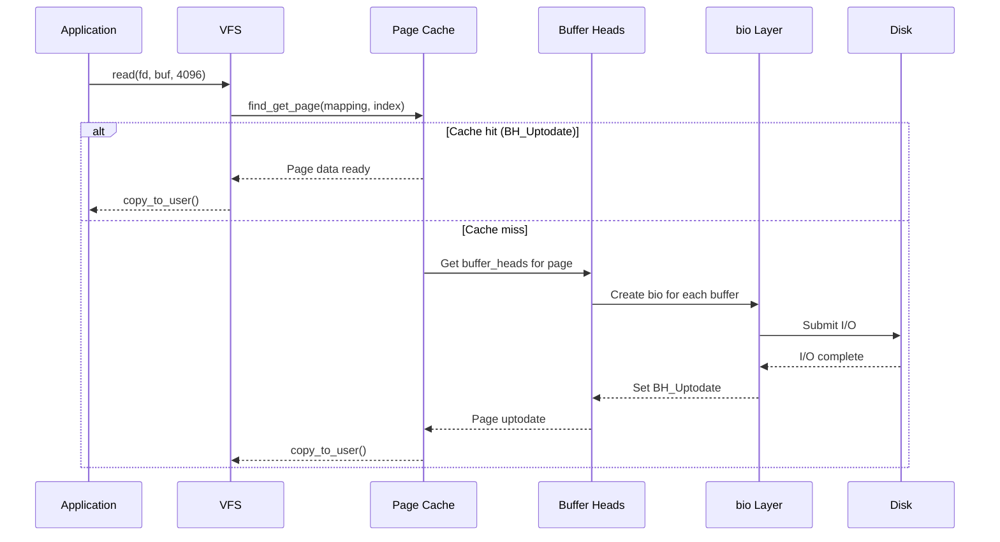
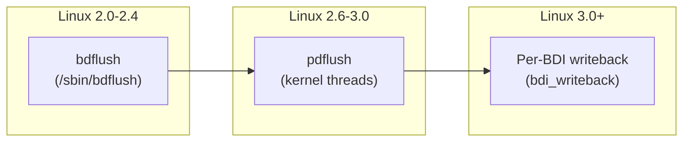

# Buffer Cache

## Introduction

The buffer cache is a kernel subsystem that caches disk block contents in memory. Historically, it was the primary caching mechanism in Linux (and traditional Unix) for filesystem I/O. In modern Linux kernels (2.4+), the buffer cache has been largely merged with the page cache — disk blocks are cached as pages, and `buffer_head` structures provide metadata about those pages.

Understanding the buffer cache requires understanding its relationship to the page cache: in modern Linux, they are not separate caches but rather two views of the same data. The page cache stores data pages; `buffer_head` structures describe the block-to-page mapping for filesystems that need block-level metadata.

## Historical Context

### Evolution of Disk Caching in Linux



### The Three Eras

1. **Pre-2.4**: Separate buffer cache (block-sized) and page cache (page-sized). Data could be duplicated in both.
2. **2.4-2.6**: Unified architecture. Buffer heads describe block-to-page mapping, but actual data lives in the page cache.
3. **Modern (4.x+)**: Further reduction of buffer_head usage. Data I/O uses `bio` structures directly. Buffer heads primarily for metadata (superblocks, inode tables, directory blocks).

## `buffer_head` Structure

### Definition

```c
/* Simplified from include/linux/buffer_head.h */
struct buffer_head {
    unsigned long b_state;          /* Buffer state flags */
    struct buffer_head *b_this_page; /* Circular list of buffers in page */
    struct page *b_page;            /* The page this buffer belongs to */
    sector_t b_blocknr;             /* Block number on disk */
    size_t b_size;                  /* Block size */
    char *b_data;                   /* Pointer to data within page */
    struct block_device *b_bdev;    /* Block device */
    bh_end_io_t *b_end_io;         /* I/O completion callback */
    void *b_private;                /* Private data for b_end_io */
    struct list_head b_assoc_buffers; /* Associated buffers (journal) */
    struct address_space *b_assoc_map; /* Mapping for association */
    atomic_t b_count;               /* Reference count */
};
```

### Key Fields

| Field | Purpose |
|-------|---------|
| `b_state` | Bit flags: `BH_Uptodate`, `BH_Dirty`, `BH_Lock`, `BH_Mapped`, etc. |
| `b_page` | The page containing this block's data |
| `b_blocknr` | Logical block number on the block device |
| `b_size` | Block size (typically 4096, but can be smaller for some filesystems) |
| `b_data` | Pointer into the page's data area where this block's data resides |
| `b_bdev` | Block device this buffer is associated with |
| `b_end_io` | Callback function called when I/O completes |

### Buffer State Flags

```c
enum bh_state_bits {
    BH_Uptodate,    /* Buffer contains valid data */
    BH_Dirty,       /* Buffer is dirty (needs writeback) */
    BH_Lock,        /* Buffer is locked for I/O */
    BH_Mapped,      /* Buffer has a disk mapping (b_blocknr valid) */
    BH_New,         /* Buffer is newly allocated */
    BH_Async_Read,  /* Async read in progress */
    BH_Async_Write, /* Async write in progress */
    BH_Delay,       /* Buffer not yet allocated on disk */
    BH_Boundary,    /* Block at boundary of contiguous extent */
    BH_Write_EIO,   /* I/O error on write */
    BH_Unwritten,   /* Allocated but not written (ext4) */
    BH_Quiet,       /* Suppress error messages */
};
```

## Buffer Cache and Page Cache Relationship

### How They Connect



A single 4096-byte page can hold multiple buffer heads. For a filesystem with 1024-byte blocks, one page holds 4 buffer heads, each pointing to a different disk block:

```c
/* Creating buffer heads for a page */
struct page *page = find_or_create_page(mapping, index, GFP_KERNEL);
struct buffer_head *head = page_buffers(page);  /* First buffer head */

/* Iterate through buffer heads */
struct buffer_head *bh = head;
do {
    /* bh->b_data points into the page's data area */
    /* bh->b_blocknr is the disk block number */
    /* bh->b_size is the block size (e.g., 1024) */
    bh = bh->b_this_page;  /* Next buffer in circular list */
} while (bh != head);
```

### Data Flow



## Buffer Head Operations

### Creating Buffer Heads

```c
/* Allocate buffer heads for a page */
int create_page_buffers(struct page *page, struct inode *inode,
                        unsigned long blocksize) {
    struct buffer_head *head, *bh;
    int nr;

    /* Already has buffers? */
    if (page_has_buffers(page))
        return 0;

    /* Number of blocks per page */
    nr = PAGE_SIZE / blocksize;

    /* Create circular list of buffer heads */
    head = alloc_buffer_head(GFP_NOFS);
    head->b_page = page;
    head->b_blocknr = 0;
    head->b_size = blocksize;
    head->b_data = page_address(page);

    bh = head;
    for (int i = 1; i < nr; i++) {
        bh->b_this_page = alloc_buffer_head(GFP_NOFS);
        bh = bh->b_this_page;
        bh->b_page = page;
        bh->b_size = blocksize;
        bh->b_data = head->b_data + (i * blocksize);
    }
    bh->b_this_page = head;  /* Circular */

    attach_page_buffers(page, head);
    return 0;
}
```

### Reading Blocks

```c
/* Read a block into the buffer cache */
struct buffer_head *sb_bread(struct super_block *sb, sector_t block) {
    struct buffer_head *bh;

    /* Look up in cache */
    bh = __getblk(sb->s_bdev, block, sb->s_blocksize);

    /* Already uptodate? */
    if (buffer_uptodate(bh))
        return bh;

    /* Read from disk */
    ll_rw_block(REQ_OP_READ, 1, &bh);
    wait_on_buffer(bh);

    if (buffer_uptodate(bh))
        return bh;

    brelse(bh);
    return NULL;
}
```

### Writing Dirty Buffers

```c
/* Mark a buffer as dirty */
mark_buffer_dirty(struct buffer_head *bh);

/* Write back a specific buffer */
int sync_dirty_buffer(struct buffer_head *bh) {
    int ret = 0;

    if (!buffer_dirty(bh))
        return 0;

    lock_buffer(bh);
    if (buffer_dirty(bh)) {
        bh->b_end_io = end_buffer_write_sync;
        submit_bh(REQ_OP_WRITE, bh);
        wait_on_buffer(bh);
    } else {
        unlock_buffer(bh);
    }
    return ret;
}
```

## bdflush / pdflush / writeback

### Historical Writeback Daemons



### Modern Writeback (per-BDI)

```bash
# View writeback threads
$ ps aux | grep kworker | grep flush
root   123  0.0  0.0  0  0 ?  I<  Jul21  0:00 [kworker/u8:1-flush-8:0]

# Each backing device info (BDI) has its own writeback thread
# This avoids the bottleneck of a single flusher thread

# Writeback tunables
$ sysctl vm.dirty_ratio
vm.dirty_ratio = 20

$ sysctl vm.dirty_background_ratio
vm.dirty_background_ratio = 10

$ sysctl vm.dirty_expire_centisecs
vm.dirty_expire_centisecs = 3000

$ sysctl vm.dirty_writeback_centisecs
vm.dirty_writeback_centisecs = 500
```

### Per-BDI Writeback Structure

```c
struct bdi_writeback {
    struct backing_dev_info *bdi;   /* Backing device */
    unsigned long last_old_flush;   /* Last old data flush */
    struct delayed_work dwork;      /* Delayed work for periodic flush */
    struct list_head b_dirty;       /* Dirty inodes */
    struct list_head b_io;          /* Inodes under writeback */
    struct list_head b_more_io;     /* More I/O pending */
    struct list_head b_dirty_time;  /* Dirty-time inodes */
    spinlock_t list_lock;           /* Protects the above lists */
};
```

## Buffer Cache Statistics

```bash
# View memory usage
$ free -h
              total        used        free      shared  buff/cache   available
Mem:           16Gi       4.2Gi       2.1Gi       128Mi       9.7Gi        11Gi

# 'buff/cache' includes both buffer cache and page cache

# Detailed breakdown via /proc/meminfo
$ grep -E "Buffers|Cached|SwapCached" /proc/meminfo
Buffers:          234568 kB
Cached:          9567890 kB
SwapCached:            0 kB

# 'Buffers' = buffer heads (metadata blocks)
# 'Cached'  = page cache (file data)

# Drop caches
$ echo 1 > /proc/sys/vm/drop_caches  # Free page cache only
$ echo 2 > /proc/sys/vm/drop_caches  # Free buffer cache + dentries/inodes
$ echo 3 > /proc/sys/vm/drop_caches  # Free both
```

## Buffer Cache vs Page Cache

| Aspect | Buffer Cache (buffer_head) | Page Cache |
|--------|---------------------------|------------|
| **Unit** | Block (512B-4KB) | Page (4KB) |
| **Caches** | Block device metadata, superblocks, journal | File data |
| **Data structure** | `buffer_head` | `page` / `folio` |
| **Modern use** | Metadata only | All file data |
| **I/O submission** | Via `bio` (or legacy `ll_rw_block`) | Via `bio` |
| **Lookup** | `(bdev, blocknr)` | `(address_space, index)` |

### The Convergence

```c
/* Modern: file data goes through page cache */
/* Buffer heads are used for: */
/* 1. Filesystem metadata (superblock, inode table, etc.) */
/* 2. Filesystems that need block-level mapping (ext4 indirect blocks) */
/* 3. Journal blocks */

/* File data: always page cache */
struct address_space *mapping = inode->i_mapping;
struct page *page = find_get_page(mapping, index);

/* Metadata: buffer cache via page cache */
struct buffer_head *bh = sb_bread(sb, block_number);
/* This finds/creates a page in the page cache for the block device,
   then returns the appropriate buffer_head within that page */
```

## Implementation Details

### Key Source Files

- **`fs/buffer.c`** — Buffer cache implementation (~3000 lines)
- **`include/linux/buffer_head.h`** — `buffer_head` structure and API
- **`mm/page-writeback.c`** — Writeback mechanisms
- **`mm/backing-dev.c`** — Backing device info and writeback threads
- **`block/bio.c`** — bio layer (replaces direct buffer_head I/O)

### Block-to-Page Mapping

```c
/* How sb_bread() works internally */
struct buffer_head *sb_bread(struct super_block *sb, sector_t block) {
    struct buffer_head *bh;

    /* __find_get_block: look up in page cache by (bdev, block) */
    bh = __find_get_block(sb->s_bdev, block, sb->s_blocksize);
    if (bh) {
        if (buffer_uptodate(bh))
            return bh;  /* Cache hit */
    } else {
        /* Create new buffer_head (may allocate page) */
        bh = __getblk(sb->s_bdev, block, sb->s_blocksize);
    }

    /* Read from disk */
    bh->b_end_io = end_buffer_read_sync;
    submit_bh(REQ_OP_READ, bh);
    wait_on_buffer(bh);
    return buffer_uptodate(bh) ? bh : NULL;
}
```

## References

- [buffer.c source](https://github.com/torvalds/linux/blob/master/fs/buffer.c)
- [buffer_head.h header](https://github.com/torvalds/linux/blob/master/include/linux/buffer_head.h)
- [Linux kernel writeback documentation](https://www.kernel.org/doc/html/latest/admin-guide/sysctl/vm.html)

## Further Reading

- https://www.kernel.org/doc/html/latest/admin-guide/sysctl/vm.html
- https://lwn.net/Articles/712460/ — "Folios and the page cache"
- https://lwn.net/Articles/264459/ — "A new approach to kernel writeback"
- https://man7.org/linux/man-pages/man5/proc.5.html — /proc/meminfo
- https://www.thomas-krenn.com/en/wiki/Linux_Page_Cache_Basics

## Related Topics

- [file-ops](../filesystems/file-ops.md) — File operations use buffer cache and page cache
- [inode](../filesystems/inode.md) — Inodes use address_space for caching
- [superblock](../filesystems/superblock.md) — Superblock metadata cached via buffer heads
- [compaction](./compaction.md) — Memory compaction affects cached pages
