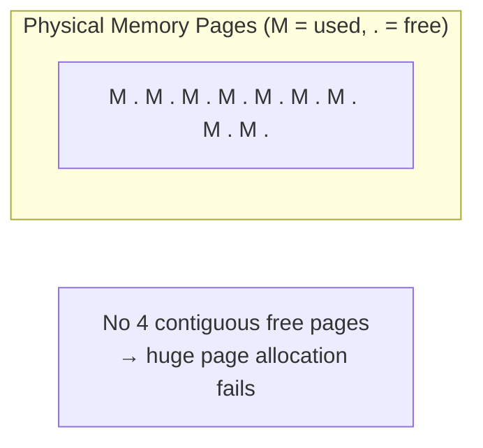
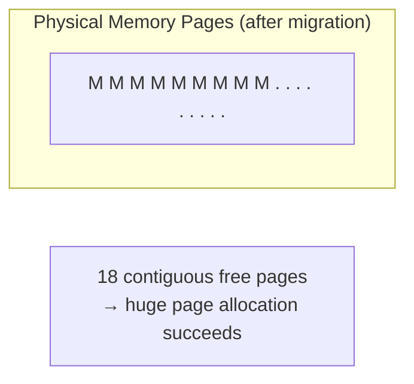
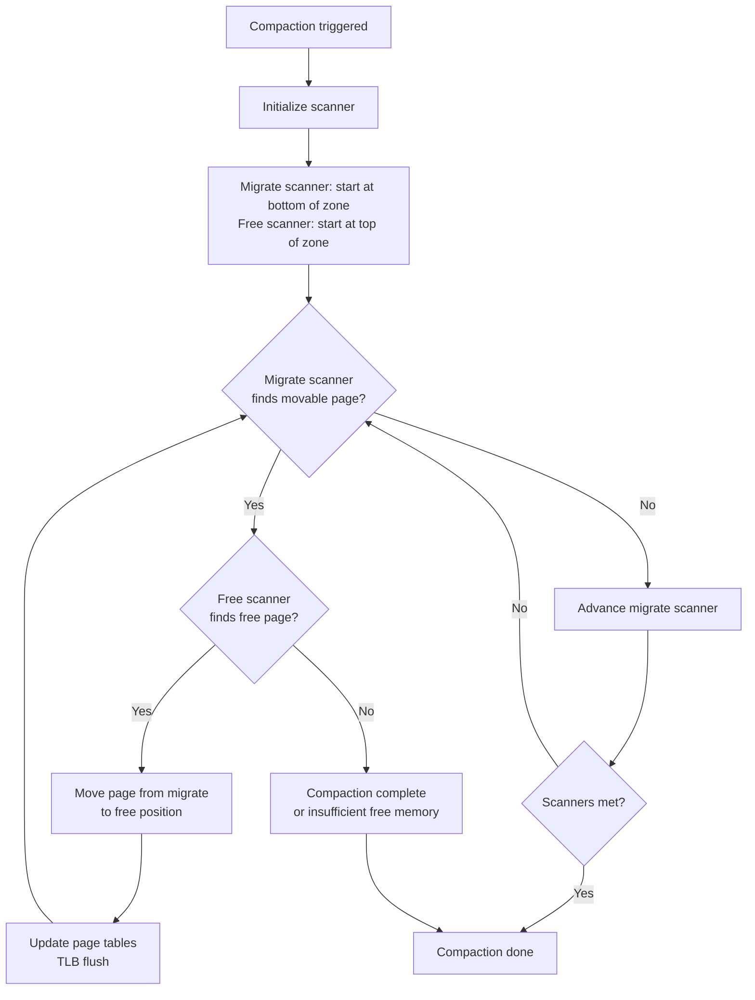
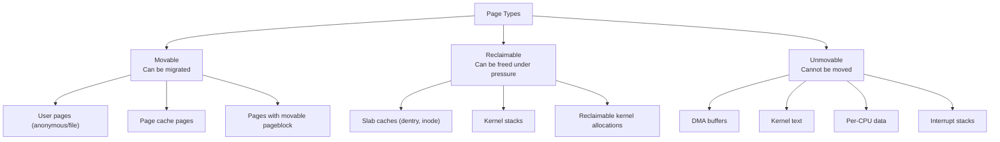
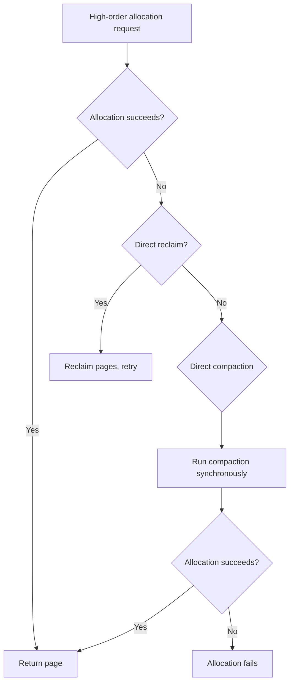
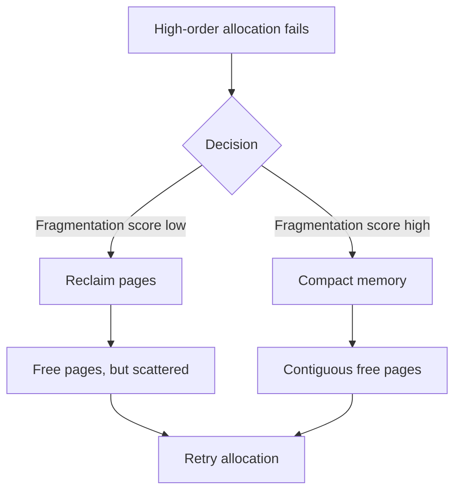

# Memory Compaction

## Introduction

Memory compaction is a kernel mechanism that rearranges physical pages to create larger contiguous blocks of free memory. It addresses the problem of physical memory fragmentation: over time, as processes allocate and free pages, memory becomes scattered with a mix of used and free pages, making it impossible to satisfy high-order allocations (e.g., for huge pages, DMA buffers, or kernel stacks).

Compaction works by migrating movable pages from one end of a memory zone toward the other, consolidating free pages into contiguous blocks. It was introduced in Linux 2.6.35 (2010) and significantly improved huge page allocation success rates without requiring an aggressive reclaim of pages.

## The Fragmentation Problem

### Before Compaction



### After Compaction



### Impact on Huge Pages

```bash
# Check huge page allocation before compaction
$ cat /proc/sys/vm/nr_hugepages
0

# Try to allocate huge pages
$ echo 64 | sudo tee /proc/sys/vm/nr_hugepages
# May fail if memory is fragmented

# Trigger compaction first
$ echo 1 | sudo tee /proc/sys/vm/compact_memory

# Now try again
$ echo 64 | sudo tee /proc/sys/vm/nr_hugepages
# More likely to succeed

# Check compaction statistics
$ grep -E "compact|compact_stall|compact_success" /proc/vmstat
compact_stall 1234
compact_success 1200
compact_fail 34
compact_migrate_scanned 567890
compact_free_scanned 123456
```

## How Compaction Works

### Compaction Algorithm



### Two Scanners

Compaction uses two scanners that move toward each other:

1. **Migrate scanner** (bottom → top): Scans for movable pages that are blocking contiguity
2. **Free scanner** (top → bottom): Scans for free pages that can receive migrated data

When the scanners meet, compaction is complete. The result is that movable pages are pushed toward one end, leaving a contiguous free region at the other.

### Page Migration

The core of compaction is page migration — moving a page from one physical location to another:

```c
/* Simplified migration flow */
int migrate_page(struct page *newpage, struct page *page,
                 enum migrate_mode mode) {
    /* 1. Allocate new page */
    /* 2. Copy data from old page to new page */
    /* 3. Update all page table entries pointing to old page */
    /* 4. Update mapping structures (address_space, rmap) */
    /* 5. Flush TLB on all CPUs that mapped the old page */
    /* 6. Free old page (or mark as movable) */

    int rc;
    struct page *old_page = page;

    /* Copy contents */
    copy_page(page_address(newpage), page_address(old_page));

    /* Remap: update all PTEs pointing to old page */
    try_to_unmap(old_page, TTU_MIGRATION);
    /* This walks the reverse mapping (rmap) and replaces
       PTE entries with migration entries */

    /* Move mapping */
    newpage->mapping = old_page->mapping;
    newpage->index = old_page->index;

    /* Remove migration entries and point to new page */
    remove_migration_ptes(new_page, old_page);

    return 0;
}
```

### Movable Page Types

Not all pages can be migrated:



## Compaction Triggers

### Automatic Compaction

The kernel triggers compaction automatically when:

1. **Direct compaction**: During a failed high-order allocation (synchronous, in the allocation path)
2. **kcompactd**: Background daemon that compacts memory during idle periods
3. **THP fault**: When a transparent huge page allocation fails



### kcompactd

```bash
# kcompactd runs per-NUMA node
$ ps aux | grep kcompactd
root        28  0.0  0.0      0     0 ?    SN   Jul21   0:00 [kcompactd0]
root        29  0.0  0.0      0     0 ?    SN   Jul21   0:00 [kcompactd1]

# kcompactd wakes up when:
# 1. Watermark for high-order allocation is reached
# 2. Background compaction is requested
```

### Manual Compaction

```bash
# Trigger compaction on all zones
$ echo 1 | sudo tee /proc/sys/vm/compact_memory

# Check compaction activity
$ grep compact /proc/vmstat
compact_stall 156          # Direct compaction attempts
compact_success 142        # Successful direct compactions
compact_fail 14            # Failed direct compactions
compact_migrate_scanned 891234  # Pages scanned for migration
compact_free_scanned 567890     # Pages scanned for free
compact_isolated 23456     # Pages isolated for migration

# Check per-zone compaction status
$ cat /proc/sys/vm/compaction_proactiveness
20
# 0 = disabled, 100 = very aggressive, 20 = default
```

## Anti-Fragmentation Strategies

### Pageblock Types

The kernel groups pages into pageblocks (typically 2MB = 512 pages) and assigns types:

```c
enum migratetype {
    MIGRATE_UNMOVABLE,   /* Cannot be moved */
    MIGRATE_MOVABLE,     /* Can be migrated */
    MIGRATE_RECLAIMABLE, /* Can be reclaimed */
    MIGRATE_PCPTYPES,    /* Number of per-cpu lists */
    MIGRATE_HIGHATOMIC,  /* High-order atomic reserves */
    MIGRATE_CMA,         /* Contiguous Memory Allocator */
    MIGRATE_ISOLATE,     /* Isolated (offline) */
    MIGRATE_TYPES        /* Sentinel */
};
```

### Buddy Allocator Integration

```bash
# The buddy allocator tries to keep pages of the same type together
# This makes compaction more effective

# View per-type free page counts
$ cat /proc/buddyinfo
Node 0, zone      DMA      1      0      0      1      1      1      0      0      1      1      3
Node 0, zone    DMA32    892    456    234    112     56     28     14      7      3      1      0
Node 0, zone   Normal  34567  17234   8612   4306   2153   1076    538    269    134     67     12

# Each column represents an order (0=4KB, 1=8KB, 2=16KB, ..., 10=4MB)
```

### CMA (Contiguous Memory Allocator)

CMA reserves a region for guaranteed contiguous allocations (e.g., for DMA):

```bash
# CMA regions
$ dmesg | grep cma
[    0.000000] cma: Reserved 256 MiB at 0x0000000100000000

# CMA allocation statistics
$ cat /proc/meminfo | grep Cma
CmaTotal:         262144 kB
CmaFree:          196608 kB
```

## /proc/sys/vm Compaction Tunables

```bash
# Proactiveness level (0-100)
# How aggressively kcompactd compacts proactively
$ sysctl vm.compaction_proactiveness
vm.compaction_proactiveness = 20

# Extfrag threshold
# Below this: direct reclaim preferred
# Above this: direct compaction preferred
$ sysctl vm.extfrag_threshold
vm.extfrag_threshold = 500

# Watermark boost factor
# Boosts watermarks to encourage more proactive compaction
$ sysctl vm.watermark_boost_factor
vm.watermark_boost_factor = 15000

# Watermark scale factor
$ sysctl vm.watermark_scale_factor
vm.watermark_scale_factor = 10
```

## Compaction vs Reclaim



| Aspect | Reclaim | Compaction |
|--------|---------|------------|
| **Goal** | Free pages | Create contiguous free pages |
| **Mechanism** | Drop page cache, swap out | Migrate pages |
| **Latency** | I/O (if swapping) | CPU (page migration) |
| **When preferred** | Low fragmentation | High fragmentation |
| **Side effects** | Data loss (swap), cache miss | TLB shootdowns, CPU cost |

## Implementation Details

### Key Source Files

- **`mm/compaction.c`** — Compaction implementation (~3000 lines)
- **`mm/migrate.c`** — Page migration
- **`mm/page_alloc.c`** — Buddy allocator and direct compaction
- **`include/linux/compaction.h`** — Compaction interfaces

### Compaction Control Structure

```c
struct compact_control {
    struct list_head freepages;     /* List of free pages found */
    struct list_head migratepages;  /* Pages to migrate */
    unsigned int nr_freepages;      /* Number of free pages */
    unsigned int nr_migratepages;   /* Number of pages to migrate */

    /* Scanners */
    unsigned long migrate_pfn;      /* Migrate scanner position */
    unsigned long free_pfn;         /* Free scanner position */
    unsigned long fast_start_pfn;   /* Fast search start */

    /* Zone being compacted */
    struct zone *zone;
    int order;                      /* Target allocation order */
    int migratetype;                /* Migrate type for free pages */

    /* Mode */
    enum compact_mode mode;         /* SYNC, ASYNC, or PARTIAL */
    bool contended;                 /* Lock contention detected */
    bool rescan;                    /* Need to rescan */
};
```

## References

- [Compaction kernel documentation](https://www.kernel.org/doc/html/latest/mm/compaction.html)
- [mm/compaction.c source](https://github.com/torvalds/linux/blob/master/mm/compaction.c)
- [Mel Gorman's compaction design notes](https://lwn.net/Articles/368869/)

## Further Reading

- https://www.kernel.org/doc/html/latest/mm/compaction.html
- https://www.kernel.org/doc/html/latest/admin-guide/sysctl/vm.html
- https://lwn.net/Articles/368869/ — "Memory compaction"
- https://lwn.net/Articles/486858/ — "Making compaction more aggressive"
- https://lwn.net/Articles/712460/ — "Folios and compaction"

## Related Topics

- [zones](./zones.md) — Compaction operates within memory zones
- [numa](./numa.md) — Per-NUMA node compaction
- [ksm](./ksm.md) — KSM pages are movable during compaction
- [buffer-cache](./buffer-cache.md) — Page cache pages are movable
