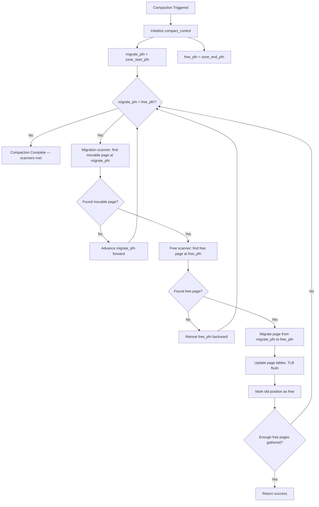
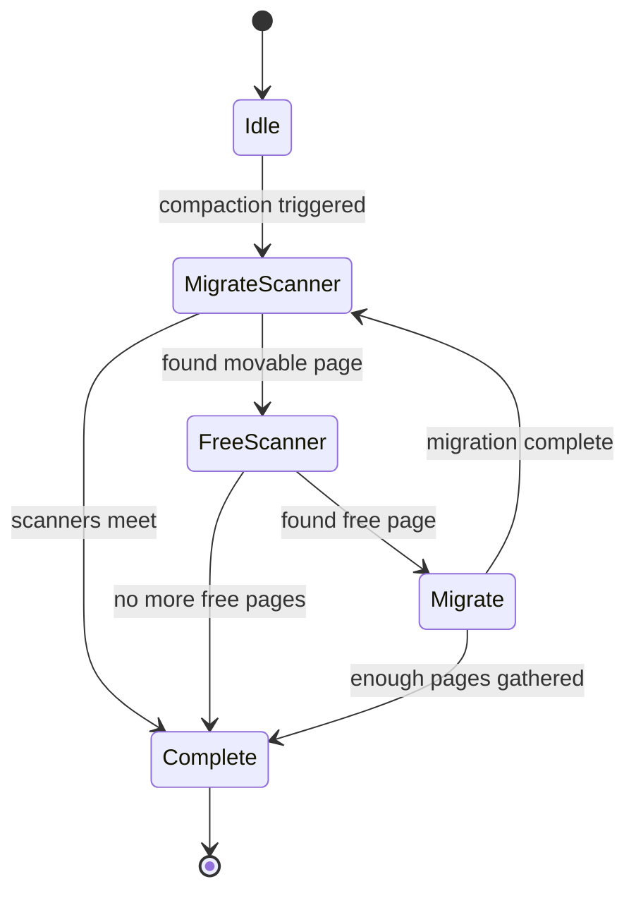
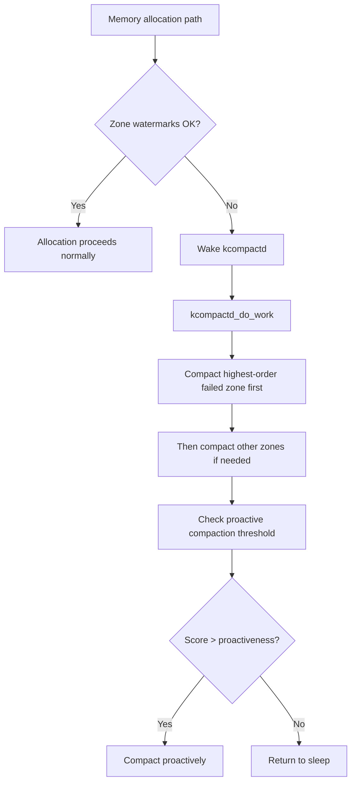
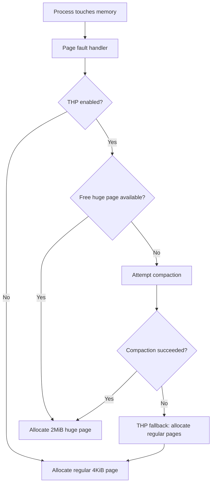
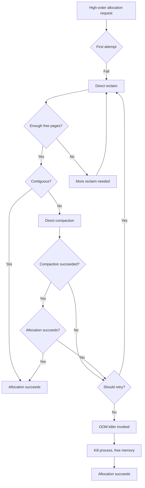

# Memory Compaction

## Overview

Memory compaction is a kernel mechanism that reclaims physically contiguous blocks of memory by relocating movable pages within a zone, creating larger free regions without requiring expensive reclaim operations. Introduced in Linux 2.6.35 by Mel Gorman, compaction is a critical component of the kernel's anti-fragmentation strategy and is the primary path through which high-order allocations (those larger than a single page) succeed under memory pressure.

Unlike memory defragmentation approaches that work at the filesystem level, memory compaction operates on physical page frames themselves, shuffling live pages to consolidate free space.

> **Introduced:** Linux 2.6.35 (commit `56de726`)  
> **Author:** Mel Gorman  
> **Source:** `mm/compaction.c`, `mm/page_alloc.c`

---

## The Fragmentation Problem

Physical memory fragmentation occurs when free pages exist in sufficient quantity but are scattered across many non-contiguous locations. A system might have hundreds of megabytes of free memory yet fail a 2MB (order-9) allocation because no contiguous 512 free pages exist.

### Types of Fragmentation

- **External fragmentation**: Free pages are interspersed with allocated pages, preventing large contiguous allocations
- **Internal fragmentation**: Allocated blocks are larger than needed, wasting space within the allocation

### Why Compaction Over Reclaim

Traditional reclaim (page eviction to swap or filesystem writeback) frees individual pages but does not consolidate them. Reclaim may free scattered pages throughout a zone, leaving fragmented free space. Compaction physically moves pages to create contiguous free regions, which is fundamentally different from simply increasing the free page count.

### Fragmentation Example


---

## Anti-Fragmentation Framework

The kernel classifies pages into migratetype categories to reduce fragmentation proactively:

### Migratetypes

| Migratetype | Description | Examples |
|---|---|---|
| `MIGRATE_UNMOVABLE` | Cannot be relocated | Kernel allocations, slab objects |
| `MIGRATE_MOVABLE` | Can be relocated freely | Userspace pages, page cache |
| `MIGRATE_RECLAIMABLE` | Can be freed under pressure | Dentries, inodes, some kernel caches |
| `MIGRATE_HIGHMOVABLE` | Movable pages with special treatment | (rare, experimental) |
| `MIGRATE_CMA` | CMA region pages (movable but reserved) | Contiguous Memory Allocator |
| `MIGRATE_ISOLATE` | Isolated for migration/hotplug | Offline memory regions |

### Pageblock Granularity

The kernel groups pages into **pageblocks** (typically 2^MAX_ORDER pages, often 512 pages or 2MB on x86). Each pageblock has an associated migratetype. When a page is first allocated, it is placed in a pageblock matching its migratetype. This heuristic keeps movable and unmovable pages in separate regions, making compaction more effective.

The migratetype of a pageblock is determined by the first allocation to it and can be changed (fallback) when an emergency allocation of a different type is needed.

### Free Page Lists

Each zone maintains per-migratetype free lists:

```
zone->free_area[order].free_list[migratetype]
```

This design ensures that when the kernel needs a movable page, it draws from movable pageblocks, preserving unmovable regions intact.

### Migratetype Fallback

When a page of the desired migratetype is unavailable, the kernel falls back to other types in a defined order:

```c
/* mm/page_alloc.c */
static int fallbacks[MIGRATE_TYPES][MIGRATE_TYPES] = {
    [MIGRATE_UNMOVABLE]   = { MIGRATE_RECLAIMABLE, MIGRATE_MOVABLE,   -1 },
    [MIGRATE_RECLAIMABLE] = { MIGRATE_UNMOVABLE,   MIGRATE_MOVABLE,   -1 },
    [MIGRATE_MOVABLE]     = { MIGRATE_RECLAIMABLE, MIGRATE_UNMOVABLE, -1 },
    [MIGRATE_CMA]         = { -1 },  /* CMA never falls back */
    [MIGRATE_ISOLATE]     = { -1 },  /* Isolate never falls back */
};
```

---

## Compaction Algorithm

Compaction uses a two-pass scanner approach operating within a single memory zone:

### 1. Migration Scanner (Bottom-Up)

Starting from the lowest PFN in the zone, the migration scanner searches for **movable** pages that can be relocated. It identifies pages that:
- Have a valid mapping (or no mapping but are swap-backed)
- Are not pinned (no elevated reference count, not under DMA)
- Are not locked by another subsystem
- Belong to the movable migratetype pageblock

### 2. Free Scanner (Top-Down)

Starting from the highest PFN in the zone, the free scanner searches for **free** pages. It identifies contiguous free blocks that can serve as migration destinations.

### 3. Migration

When both scanners find suitable candidates, pages are migrated from the migration scanner's position to the free scanner's position. This creates a gap that grows as migration proceeds, effectively compacting all movable pages toward one end of the zone.

### 4. Convergence

The two scanners move toward each other. Compaction terminates when:
- The scanners meet (no more movable pages before free pages)
- A sufficient number of free pages have been gathered
- The process is making insufficient progress

### Compaction Algorithm Flow



### Scanner State Machine



---

## Compaction Entry Points

### Synchronous Compaction

Triggered during allocation when direct reclaim fails to produce enough contiguous pages:

```c
/* mm/page_alloc.c */
static struct page *
__alloc_pages_direct_compact(gfp_t gfp_mask, unsigned int order,
                             unsigned int alloc_flags,
                             const struct alloc_context *ac,
                             enum compact_priority prio,
                             enum compact_result *compact_result)
{
    struct page *page = NULL;
    struct compact_control cc = {
        .order = order,
        .gfp_mask = gfp_mask,
        .alloc_flags = alloc_flags,
        .ac = ac,
        .mode = COMPACT_SYNC,
    };

    /* Try compaction */
    compact_zone(&cc, &ac);

    /* Try allocation again after compaction */
    page = __alloc_pages_slow(gfp_mask, order, alloc_flags, ac);
    return page;
}
```

The caller blocks until compaction completes. This is the most expensive path but provides the highest chance of success.

### Asynchronous Compaction

Triggered proactively or in background:

```c
/* mm/compaction.c */
static enum compact_result compact_zone_order(struct zone *zone,
                                              int order, gfp_t gfp_mask,
                                              enum compact_priority prio,
                                              unsigned int alloc_flags,
                                              struct page **page)
```

Asynchronous compaction does not migrate pages that are currently locked or have elevated reference counts, trading effectiveness for lower latency.

### Compaction Modes

```c
enum compact_mode {
    COMPACT_SYNC,      /* Full synchronous compaction — migrate all movable pages */
    COMPACT_ASYNC,     /* Asynchronous — skip locked/pinned pages */
    COMPACT_CLUSTERED, /* Cluster pages of the same order together */
};
```

### Proactive Compaction

Introduced in Linux 5.9, proactive compaction triggers compaction periodically based on a sysctl threshold rather than waiting for allocation failures:

```bash
# Set proactive compaction to compact when fragmentation score exceeds 50%
echo 50 > /proc/sys/vm/compaction_proactiveness
```

Range: 0 (disabled) to 100 (aggressive). Default: 20.

Proactive compaction uses `kcompactd` to periodically check each zone's fragmentation score and compact when the score exceeds the threshold.

```c
/* mm/compaction.c — proactive compaction check */
static void proactive_compact_node(struct pglist_data *pgdat)
{
    int zoneid;

    for (zoneid = 0; zoneid < MAX_NR_ZONES; zoneid++) {
        struct zone *zone = pgdat->node_zones + zoneid;
        unsigned long score;

        score = fragmentation_score(zone);
        if (score > sysctl_compaction_proactiveness) {
            compact_zone_proactive(zone);
        }
    }
}
```

---

## Tuning and Interfaces

### Sysctl Parameters

```bash
# /proc/sys/vm/compaction_proactiveness
# Controls background proactive compaction aggressiveness (0-100)
echo 20 > /proc/sys/vm/compaction_proactiveness

# /proc/sys/vm/compact_unevictable_allowed
# Allow compaction to examine unevictable (mlocked) pages
# 0 = never, 1 = only in direct compaction, 2 = always
echo 1 > /proc/sys/vm/compact_unevictable_allowed

# /proc/sys/vm/extfrag_threshold
# Fragmentation threshold for fallback allocation (0-1000)
# Lower = more willing to fallback, higher = more compaction
echo 500 > /proc/sys/vm/extfrag_threshold

# /proc/sys/vm/min_extfrag_threshold
# Minimum fragmentation score before compaction is attempted
echo 0 > /proc/sys/vm/min_extfrag_threshold
```

### Manual Trigger via compact_memory

Writing to `/proc/sys/vm/compact_memory` triggers synchronous compaction across all zones:

```bash
echo 1 > /proc/sys/vm/compact_memory
```

This is useful for:
- Testing whether compaction can recover contiguous memory
- Pre-compacting before a known large allocation
- Debugging fragmentation issues

### Per-Node Compaction

On NUMA systems, compaction can be triggered per-node:

```bash
# Per-node compaction
echo 1 > /proc/sys/vm/compact_memory_node

# Or for specific node via sysfs
echo 1 > /sys/devices/system/node/node0/compact
```

### Compaction Statistics

```bash
# Per-zone compaction statistics
cat /proc/vmstat | grep compact
# compact_daemon_wake    - Number of times kcompactd woke
# compact_daemon_migrate - Pages migrated by kcompactd
# compact_daemon_free    - Free pages found by kcompactd
# compact_stall          - Direct compaction stalls
# compact_fail           - Failed compaction attempts
# compact_success        - Successful compaction attempts

# Zone fragmentation info
cat /proc/zoneinfo | grep -A20 "Node"
```

### Detailed Compaction Statistics

```bash
# Fragmentation index per zone (0 = no fragmentation, 1000 = severe)
cat /sys/kernel/debug/extfrag/extfrag_index

# Unusable index per order (which orders are likely to fail)
cat /sys/kernel/debug/extfrag/unusable_index

# Compaction migration stats
cat /proc/vmstat | grep -E "compact|migrate"
```

---

## kcompactd: The Compaction Daemon

Each NUMA node runs a `kcompactd` kernel thread that performs background compaction. It wakes when:
- A zone's fragmentation score exceeds a threshold
- Proactive compaction is enabled and the score exceeds `compaction_proactiveness`
- A direct compaction request is made

### kcompactd Behavior

```c
/* mm/compaction.c */
static int kcompactd(void *p)
{
    pg_data_t *pgdat = (pg_data_t *)p;
    struct compact_control cc = {
        .order = pageblock_order,
        .gfp_mask = GFP_KERNEL,
        .mode = COMPACT_ASYNC,
    };

    while (!kthread_should_stop()) {
        /* Sleep until woken by zone watermark or proactive trigger */
        wait_event_freezable(pgdat->kcompactd_wait,
                             kcompactd_work_requested(pgdat));

        /* Perform asynchronous compaction on the node's zones */
        kcompactd_do_work(pgdat);

        /* Reset wakeup flags */
        pgdat->kcompactd_max_order = 0;
    }
    return 0;
}
```

### kcompactd Wake Conditions



kcompactd works asynchronously and does not block allocation paths. It aims to pre-create contiguous regions so that future allocations succeed without triggering direct compaction.

### kcompactd Work Function

```c
/* mm/compaction.c */
static void kcompactd_do_work(pg_data_t *pgdat)
{
    int zoneid;

    /* Prioritize zones with highest failed allocation order */
    for (zoneid = MAX_NR_ZONES - 1; zoneid >= 0; zoneid--) {
        struct zone *zone = pgdat->node_zones + zoneid;
        struct compact_control cc = {
            .zone = zone,
            .order = pgdat->kcompactd_max_order,
            .mode = COMPACT_ASYNC,
            .gfp_mask = GFP_KERNEL,
        };

        if (!populated_zone(zone))
            continue;

        /* Skip if zone is already well-compacted */
        if (fragmentation_score(zone) < sysctl_compaction_proactiveness)
            continue;

        compact_zone(&cc, NULL);
    }
}
```

---

## Compaction and THP (Transparent Huge Pages)

Compaction is particularly important for THP allocations. When a process touches memory and the kernel attempts to back it with a huge page:

1. The kernel checks for a free huge page
2. If none exists, it attempts compaction
3. If compaction succeeds, the huge page is allocated
4. If compaction fails, the kernel falls back to regular pages

### THP Compaction Flow



### THP Compaction Statistics

THP allocation failures often indicate fragmentation that compaction could not resolve. Monitoring:

```bash
# THP compaction events
cat /proc/vmstat | grep thp_compact
# thp_compact_alloc    - Huge pages allocated after compaction
# thp_compact_failed   - Compaction failed for huge pages
# thp_compact_scanned  - Pages scanned during compaction
# thp_compact_retry    - Compaction retried for huge pages

# THP allocation outcomes
cat /proc/vmstat | grep thp_fault
# thp_fault_alloc      - THP allocated on fault
# thp_fault_fallback   - THP fault fell back to regular pages
```

### THP Compaction Tuning

```bash
# THP defrag mode controls when compaction is attempted
cat /sys/kernel/mm/transparent_hugepage/defrag
# [always] defer defer+madvise madvise never

# always: always attempt compaction for THP (can cause latency)
# defer: defer compaction to kcompactd (lower latency, less reliable)
# madvise: only compact for madvise(MADV_HUGEPAGE) regions
# never: never attempt compaction for THP

echo defer+madvise > /sys/kernel/mm/transparent_hugepage/defrag
```

---

## Compaction vs. Reclaim vs. OOM

When an allocation fails, the kernel follows a hierarchy:

1. **Direct reclaim**: Evict pages to free memory (no spatial consolidation)
2. **Direct compaction**: Relocate movable pages to consolidate free space
3. **OOM killer**: Kill a process to reclaim large amounts of memory

The order depends on the allocation context and `gfp` flags. For order-0 allocations, reclaim is usually sufficient. For high-order allocations, compaction is the critical step between reclaim and OOM.

### Allocation Failure Recovery Flow



---

## Compaction Result Codes

```c
enum compact_result {
    COMPACT_NOT_SUITABLE_ZONE,  /* Zone not suitable for compaction */
    COMPACT_SKIPPED,            /* Compaction skipped (e.g., no movable pages) */
    COMPACT_DEFERRED,           /* Deferred to kcompactd */
    COMPACT_CONTINUE,           /* Continue compacting */
    COMPACT_PARTIAL,            /* Partial success — some pages migrated */
    COMPACT_COMPLETE,           /* Full compaction cycle completed */
    COMPACT_NO_SUITABLE_PAGE,   /* No suitable page found */
    COMPACT_CANCELLED,          /* Compaction cancelled (lock contention) */
    COMPACT_SUCCESS,            /* Enough pages gathered */
};
```

### Result Interpretation

| Result | Meaning | Action |
|--------|---------|--------|
| `COMPACT_SUCCESS` | Enough contiguous pages gathered | Allocation should succeed |
| `COMPACT_PARTIAL` | Some pages migrated but not enough | May retry or try lower order |
| `COMPACT_DEFERRED` | Too much contention, try later | Wait for kcompactd |
| `COMPACT_COMPLETE` | Full scan done, no success | Try reclaim or OOM |
| `COMPACT_SKIPPED` | Zone not suitable (e.g., DMA zone) | Try another zone |

---

## Debugging Compaction Issues

### Monitoring Fragmentation

```bash
# Show fragmentation score per zone (0 = no fragmentation, 1000 = severe)
cat /sys/kernel/debug/extfrag/extfrag_index

# Show which allocation orders are likely to fail
cat /sys/kernel/debug/extfrag/unusable_index

# Detailed zone information
cat /proc/zoneinfo
```

### Tracepoints

```bash
# Enable compaction tracepoints
echo 1 > /sys/kernel/debug/tracing/events/compaction/mm_compaction_begin/enable
echo 1 > /sys/kernel/debug/tracing/events/compaction/mm_compaction_end/enable
echo 1 > /sys/kernel/debug/tracing/events/compaction/mm_compaction_migratepages/enable
echo 1 > /sys/kernel/debug/tracing/events/compaction/mm_compaction_isolate_freepages/enable
echo 1 > /sys/kernel/debug/tracing/events/compaction/mm_compaction_isolate_migratepages/enable

# View traces
cat /sys/kernel/debug/tracing/trace_pipe

# Example output:
# kcompactd0-56 [000]  1234.567890: mm_compaction_begin: zone_start_pfn=0x100000
#     end_pfn=0x200000 sync=false
# kcompactd0-56 [000]  1234.567891: mm_compaction_migratepages: nr_migrated=128
#     nr_failed=0
```

### Common Issues

- **Persistent fragmentation**: Often caused by long-lived unmovable allocations pinning pages in movable zones. Check slab usage and kernel allocations.

- **Compaction storms**: Excessive compaction can cause latency spikes. Monitor `compact_stall` in `/proc/vmstat`. If high, consider:
  - Increasing `compaction_proactiveness` to compact proactively
  - Using `defer` THP defrag mode
  - Reducing unmovable allocations

- **THP allocation failures**: Check if compaction is being attempted but failing, indicating severe fragmentation.

- **CMA region exhaustion**: Long-term GUP pins (RDMA) in CMA regions prevent compaction. Check `nr_foll_pin_acquired`.

### Diagnostic Commands

```bash
# Overall compaction health
echo "=== Compaction Stats ==="
grep compact /proc/vmstat

echo "=== THP Stats ==="
grep thp /proc/vmstat

echo "=== Fragmentation ==="
cat /sys/kernel/debug/extfrag/extfrag_index

echo "=== Zone Info ==="
cat /proc/zoneinfo | grep -E "Node|nr_free_pages|min|low|high"

echo "=== kcompactd Status ==="
ps aux | grep kcompactd
```

---

## Performance Considerations

- Compaction involves page migration, which requires copying page contents and updating page tables
- Synchronous compaction can cause significant latency (milliseconds to tens of milliseconds)
- Asynchronous compaction has lower impact but may not produce enough free regions
- On large-memory systems, compaction scanning can be expensive due to the search space
- Proactive compaction trades background CPU for reduced allocation latency

### Compaction Overhead

| Type | Latency | CPU Usage | Effectiveness |
|------|---------|-----------|---------------|
| Synchronous | High (ms) | High | Best — migrates all movable pages |
| Asynchronous | Low (µs) | Moderate | Good — skips locked pages |
| Proactive | Background | Low-Moderate | Good — prevents fragmentation |
| Manual (`compact_memory`) | High (ms) | High | Best — full zone scan |

### Tuning for Low Latency

For latency-sensitive workloads:

```bash
# Use async compaction for THP (lower latency)
echo defer > /sys/kernel/mm/transparent_hugepage/defrag

# Enable proactive compaction to reduce direct compaction stalls
echo 30 > /proc/sys/vm/compaction_proactiveness

# Allow compaction of unevictable pages (more effective, slight risk)
echo 1 > /proc/sys/vm/compact_unevictable_allowed
```

### Tuning for Throughput

For throughput-oriented workloads:

```bash
# Use always mode for THP (maximum huge page availability)
echo always > /sys/kernel/mm/transparent_hugepage/defrag

# Higher proactiveness for more background compaction
echo 50 > /proc/sys/vm/compaction_proactiveness
```

---

## Implementation Details

### Key Data Structures

```c
/* mm/compaction.c */
struct compact_control {
    struct list_head freepages;     /* List of free pages to migrate to */
    struct list_head migratepages;  /* Pages to migrate */
    unsigned long nr_freepages;     /* Number of free pages found */
    unsigned long nr_migratepages;  /* Number of pages to migrate */
    unsigned long free_pfn;         /* Free scanner position */
    unsigned long migrate_pfn;      /* Migration scanner position */
    unsigned long fast_start_pfn;   /* Fast search start */
    struct zone *zone;              /* Zone being compacted */
    int order;                      /* Allocation order being targeted */
    int migratetype;                /* Migratetype of target pages */
    enum compact_mode mode;         /* Sync or async */
    bool contended;                 /* Lock contention detected */
    bool whole_zone;                /* Scan entire zone */
    bool no_set_skip_hint;          /* Don't set skip hints */
    bool ignore_block_suitable;     /* Ignore block suitability check */
    struct page *migrate_page;      /* Page being migrated */
};
```

### Zone Watermarks and Compaction

Zone watermarks interact with compaction. When free memory falls below the low watermark, `kcompactd` is woken. If it falls below the minimum watermark, direct compaction and reclaim are forced.

```c
/* mm/page_alloc.c */
static inline bool
zone_watermark_fast(struct zone *z, unsigned int order,
                    unsigned long mark, int alloc_flags)
{
    long free_pages = zone_page_state(z, NR_FREE_PAGES);
    long usable_free = free_pages - z->lowmem_reserve[alloc_flags];

    return usable_free >= mark;
}
```

### Migration Path

Page migration is the core of compaction. When a page is migrated:

1. A new page is allocated from the free scanner's position
2. The page's contents are copied (`copy_page()`)
3. Page table entries are updated to point to the new page
4. The old page is freed and added to the free list
5. TLB flushes are performed on all CPUs that mapped the page

```c
/* mm/migrate.c */
int migrate_folio(struct list_head *from, new_folio_t get_new_folio,
                  free_folio_t put_new_folio, unsigned long private,
                  enum migrate_mode mode, int reason,
                  struct list_head *ret_folios)
{
    /* ... migration logic ... */
    /* Copy page contents */
    folio_copy(newfolio, folio);

    /* Remap page tables */
    try_to_migrate(folio, TTU_IGNORE_ACCESS);

    /* Remove from LRU, free old page */
    folio_remove_rmap_pte(folio, page, vma);
    folio_put(folio);
}
```

---

## Further Reading

- **Kernel documentation**: `Documentation/admin-guide/sysctl/vm.rst` — compaction-related sysctls
- **Mel Gorman's talk**: "Memory Compaction" at LinuxCon Europe 2012
- **LWN article**: ["Memory compaction"](https://lwn.net/Articles/368869/) — original design overview
- **LWN article**: ["Proactive compaction"](https://lwn.net/Articles/816890/) — Linux 5.9 feature
- **Source**: `mm/compaction.c` — core compaction implementation
- **Source**: `mm/page_alloc.c` — allocation paths invoking compaction
- **Source**: `mm/migrate.c` — page migration implementation
- **commit 56de726** — compaction introduction (Linux 2.6.35)
- **commit a5b5e3b** — proactive compaction (Linux 5.9)

---

## See Also

- [Transparent Huge Pages](./thp.md) — THP and compaction interaction
- [Memory Zones](./zones.md) — zone-based memory management
- [OOM Killer](./oom-killer.md) — last-resort memory recovery
- [Memory Reclaim](./reclaim.md) — page reclaim mechanism
- [GUP](./gup.md) — long-term pins affect compaction
- [Page Types](./page-types.md) — migratetype classification
- [Idle Page Tracking](./idle-page-tracking.md) — identifying compactible pages
- [zpool](./zpool.md) — compressed memory pool
