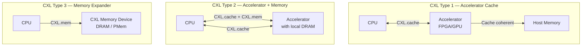
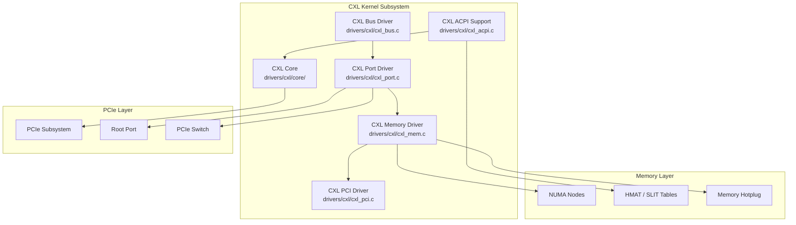
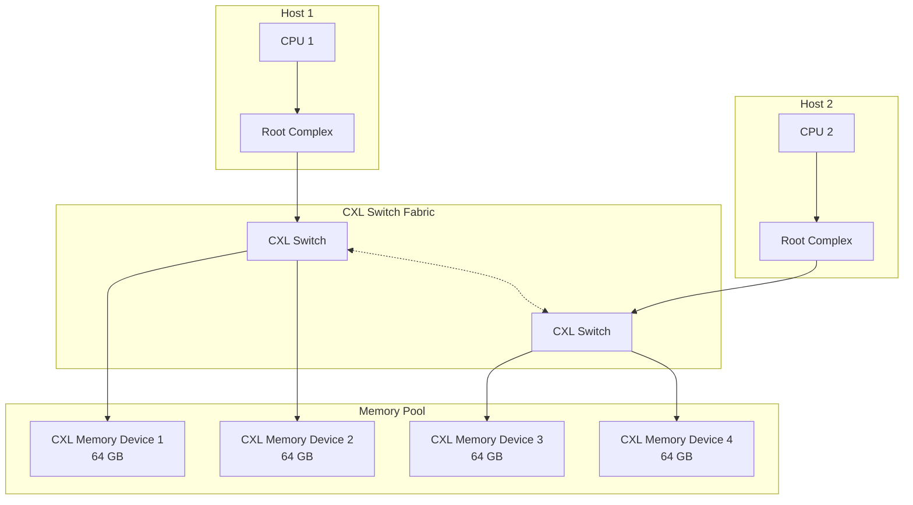
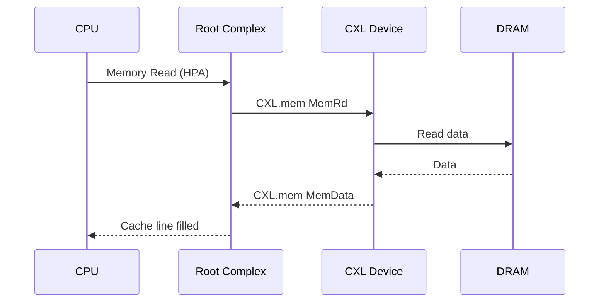
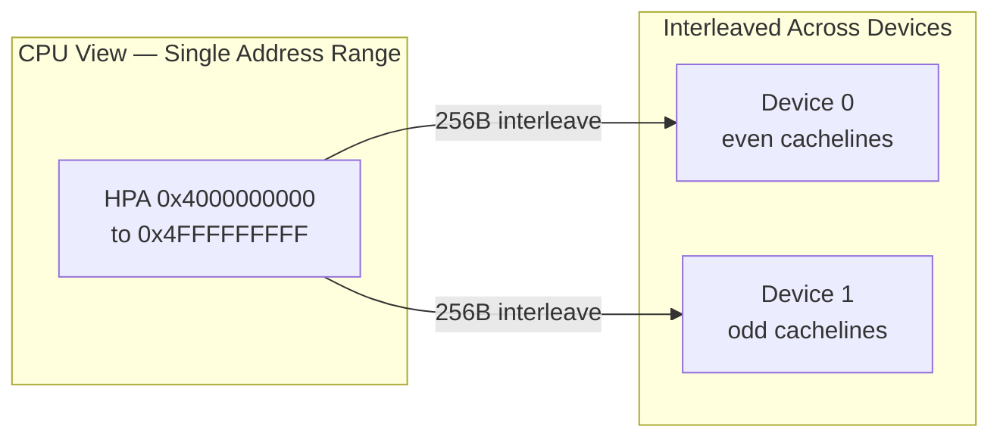
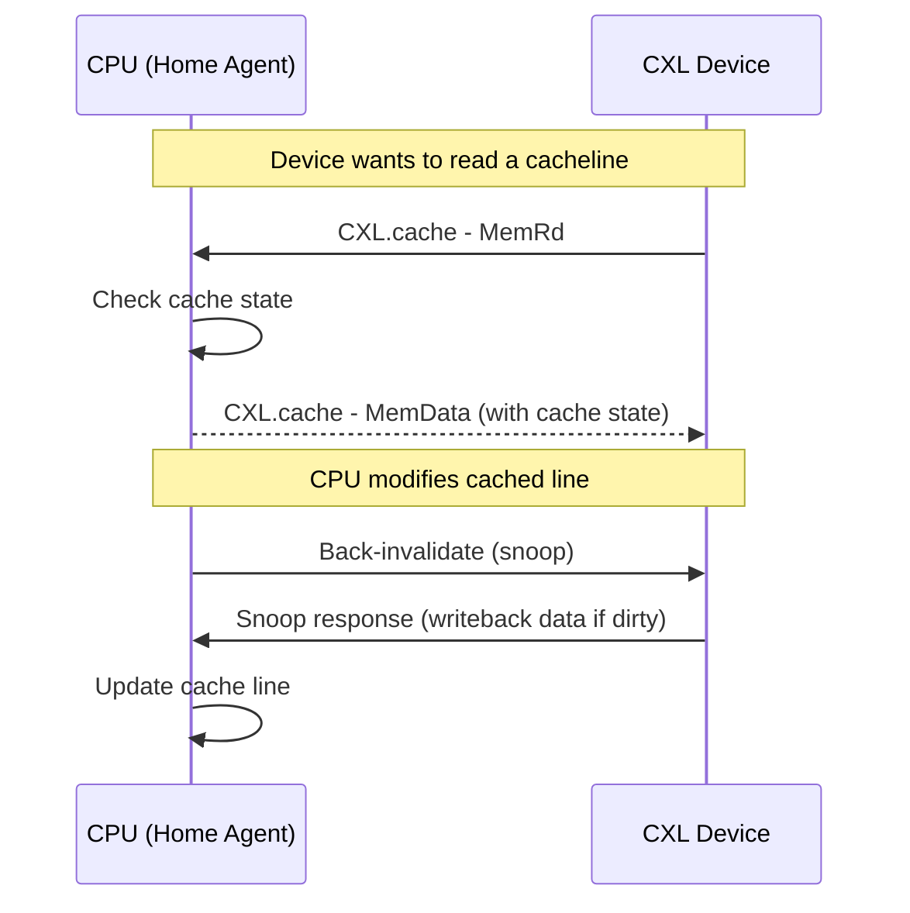
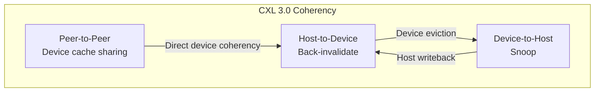
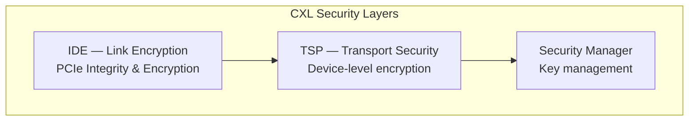
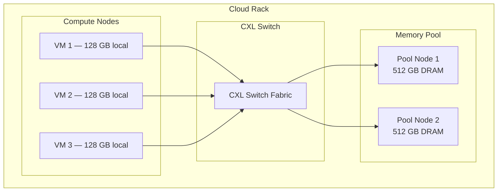

# CXL: Compute Express Link Memory

## Introduction

Compute Express Link (CXL) is an open standard interconnect built on PCIe physical infrastructure that enables cache-coherent memory pooling, sharing, and expansion between CPUs, accelerators, and memory devices. CXL represents a fundamental shift in how systems architect memory: instead of attaching DRAM directly to a CPU's memory bus, CXL allows memory to be disaggregated into shared pools that multiple hosts can access with hardware-enforced cache coherency.

CXL is governed by the CXL Consortium (founded 2019 by Intel, Google, Microsoft, and others) and has rapidly evolved through three major revisions. The Linux kernel gained initial CXL support in Linux 5.14 (2021) and has been expanding subsystem support with each release.

> **Specification:** CXL 3.1 (November 2023)  
> **Kernel support:** `drivers/cxl/` (since Linux 5.14)  
> **Kconfig:** `CONFIG_CXL_BUS`, `CONFIG_CXL_MEM`, `CONFIG_CXL_PORT`

---

## CXL Protocol Versions

| Version | Year | Key Features |
|---------|------|--------------|
| **CXL 1.0/1.1** | 2019 | Basic device types, PCIe 5.0, CXL.cache, CXL.mem |
| **CXL 2.0** | 2022 | Type 3 devices, memory pooling, hotplug, security |
| **CXL 3.0** | 2022 | Multi-level switching, fabric-attached memory, back-invalidate |
| **CXL 3.1** | 2023 | Enhanced coherency, TSP security, improved fabric management |

---

## CXL Device Types



| Type | CXL Protocols | Use Case | Example Devices |
|------|---------------|----------|-----------------|
| **Type 1** | CXL.cache | Accelerators that cache host memory | Smart NICs, FPGAs |
| **Type 2** | CXL.cache + CXL.mem | Accelerators with local memory | GPUs with HBM |
| **Type 3** | CXL.mem | Memory expanders and poolers | DRAM modules, CXL-attached PMem |

---

## CXL Architecture in the Kernel

### Subsystem Overview



### Key Source Files

| File | Purpose |
|------|---------|
| `drivers/cxl/core/bus.c` | CXL bus type registration, device/driver matching |
| `drivers/cxl/core/port.c` | Port enumeration, topology discovery |
| `drivers/cxl/core/memdev.c` | Memory device management |
| `drivers/cxl/core/region.c` | CXL region (address range) management |
| `drivers/cxl/core/pmu.c` | Performance monitoring unit support |
| `drivers/cxl/cxl_mem.c` | Type 3 memory device driver |
| `drivers/cxl/cxl_pci.c` | PCI enumeration for CXL devices |
| `drivers/cxl/cxl_acpi.c` | ACPI CEDT and CFMWS parsing |
| `include/cxl/` | CXL subsystem headers |

---

## CXL Memory Pooling

Memory pooling is CXL's flagship feature: multiple hosts share a common pool of memory devices through CXL switches, with each host dynamically allocated capacity from the pool.

### Pooling Architecture



### CXL Region Management

CXL regions represent contiguous address ranges mapped to one or more CXL memory devices. The kernel manages regions through the `cxl_region` abstraction:

```c
/* Simplified CXL region structure (from drivers/cxl/core/region.c) */
struct cxl_region {
    struct device dev;
    struct cxl_dpa_range *params;   /* DPA (Device Physical Address) range */
    int id;
    enum cxl_region_type type;
    struct cxl_decoder *decoder;
    struct list_head cxl_memdevs;   /* Memory devices in region */
    struct mutex range_lock;
    struct range hpa_range;         /* Host Physical Address range */
};
```

### Creating a CXL Region

```bash
# List CXL memory devices
$ cxl list -m
{
  "memdev":"mem0",
  "pmem_size":68719476736,
  "ram_size":0,
  "serial":"0x1234",
  "host":"0000:00:08.0"
}
{
  "memdev":"mem1",
  "pmem_size":68719476736,
  "ram_size":0,
  "serial":"0x5678",
  "host":"0000:00:09.0"
}

# Create a decoder (maps HPA to DPA)
$ cxl create-region -d decoder0.0 -m mem0 -s 0x4000000000 -w 1

# List regions
$ cxl list -R
{
  "region":"region0",
  "resource":274877906944,
  "size":68719476736,
  "type":"pmem",
  "interleave_ways":1
}

# Enable the region (creates a /dev/pmemX device)
$ cxl enable-region region0
```

### libvirt/QEMU CXL Pooling Example

```bash
# QEMU with CXL memory device
qemu-system-x86_64 \
  -machine q35,cxl=on \
  -object memory-backend-ram,size=4G,id=cxl-mem \
  -device pxb-cxl,bus=pcie.0,id=cxl.1 \
  -device cxl-rp,port=0,bus=cxl.1,id=root_port0 \
  -device cxl-type3,memdev=cxl-mem,bus=root_port0,id=cxl-pmem0 \
  -M cxl-fmw.0.targets.0=cxl.1,cxl-fmw.0.size=4G
```

---

## CXL.mem Protocol

The CXL.mem protocol enables a host to issue memory read/write requests to CXL devices. The device acts as a memory endpoint, presenting its DRAM (or other storage) as part of the host's physical address space.

### Memory Request Flow



### Device Physical Address (DPA) Mapping

```c
/* DPA to host memory mapping */
struct cxl_dpa_range {
    u64 start;      /* Device Physical Address start */
    u64 size;       /* Size in bytes */
    u64 offset;     /* Offset into host physical address space */
};

/* A CXL decoder maps HPA ranges to DPA on specific devices */
struct cxl_decoder {
    struct device dev;
    struct range range;         /* HPA range */
    int interleave_ways;        /* Number of devices interleaved */
    int interleave_granularity; /* Interleave granularity (256B, 4KB, etc.) */
    enum cxl_decoder_type type;
};
```

### Interleaving

CXL supports memory interleaving across multiple devices for increased bandwidth:



| Interleave Ways | Granularity | Effective Bandwidth |
|-----------------|-------------|---------------------|
| 1 (no interleave) | N/A | 1× device BW |
| 2 | 256 B | ~2× device BW |
| 4 | 256 B | ~4× device BW |
| 8 | 4 KB | ~8× device BW |

---

## CXL Cache Coherency

CXL maintains hardware cache coherency between host CPUs and CXL-attached devices using a back-invalidate mechanism. This is critical for Type 1 and Type 2 devices that cache host memory.

### Coherency Model (CXL 1.x/2.0)



### CXL 3.0 Back-Invalidate

CXL 3.0 introduces a new coherency model where devices can also serve as "home agents" for memory they own:



---

## CXL Security

### TSP (Transport Security Protocol)

CXL 2.0+ defines a security model using IDE (Interoperable Data Encryption) for link-level encryption and TSP for device-level security:



```bash
# Check CXL device security state
$ cxl list -m mem0 -i
{
  "memdev":"mem0",
  "security_state":"idle"
}

# Sanitize (secure erase) a CXL device
$ cxl sanitize mem0 --overwrite

# Security state machine:
# idle → locked → unlocked (via passphrase)
```

### RAS (Reliability, Availability, Serviceability)

CXL devices report errors through standard PCIe AER (Advanced Error Reporting) plus CXL-specific error logs:

```bash
# Read CXL device error logs
$ cxl memdev get-log mem0 --log-type=cel
$ cxl memdev get-log mem0 --log-type=firmware

# CXL event monitoring
$ cat /sys/bus/cxl/devices/mem0/event_logs/
```

---

## NUMA Integration

CXL memory appears as a separate NUMA node in Linux. The kernel's NUMA policy determines when and how CXL-attached memory is used relative to local DRAM.

### HMAT and SLIT

The ACPI HMAT (Heterogeneous Memory Attribute Table) and SLIT (System Locality Information Table) describe the latency and bandwidth characteristics of CXL memory relative to each CPU:

```bash
# Check NUMA topology including CXL nodes
$ numactl --hardware
node distances:
node   0   1   2
  0:  10  20  30    # node 0 = CPU 0, node 1 = CPU 1, node 2 = CXL
  1:  20  10  30
  2:  30  30  10    # CXL memory node (higher latency)

# HMAT attributes (via sysfs)
$ cat /sys/bus/event_source/devices/numa/hmat/cache/level1_size
$ cat /sys/bus/event_source/devices/numa/hmat/initiators/read_bandwidth
```

### Memory Tiering

With CXL memory having higher latency than local DRAM, Linux supports memory tiering to keep hot pages in fast local memory:

```bash
# Enable automatic NUMA balancing (moves hot pages to fast node)
$ echo 1 > /proc/sys/kernel/numa_balancing

# Set CXL node as lower tier
$ echo 2 > /sys/devices/system/node/node2/hotplug_target_node

# NUMA policy: prefer local DRAM, fallback to CXL
$ numactl --preferred=0 --membind=0,2 ./my_app

# Configure demotion (move cold pages to CXL)
$ echo 2 > /sys/kernel/mm/numa/demotion_target_node
```

### Kernel Tiering Configuration

```c
/* Kernel memory tiering with CXL (mm/migrate.c) */
/*
 * The kernel maintains a "demotion" path: when local DRAM is under
 * pressure, cold pages are migrated (demoted) to the next tier
 * (CXL memory). Hot pages in CXL can be promoted back.
 *
 * Controlled via:
 *   /sys/devices/system/node/nodeN/hotplug_target_node
 *   /sys/devices/system/node/nodeN/demotion_target_node
 */
```

---

## CXL Performance Monitoring

### CXL PMU (Performance Monitoring Unit)

CXL devices expose performance counters through the kernel's `perf` subsystem:

```bash
# List CXL PMU events
$ perf list | grep cxl
cxl/clock_ticks/
cxl/write_bw/
cxl/read_bw/
cxl/write_latency/
cxl/read_latency/
cxl/cache_hit/
cxl/cache_miss/

# Monitor CXL memory bandwidth
$ perf stat -e cxl/read_bw/,cxl/write_bw/ -a sleep 10

# Monitor CXL cache hit rate (Type 3 with volatile cache)
$ perf stat -e cxl/cache_hit/,cxl/cache_miss/ -a -- sleep 10
```

### sysfs CXL Device Attributes

```bash
# Device information
$ cat /sys/bus/cxl/devices/mem0/serial
$ cat /sys/bus/cxl/devices/mem0/pmem/size
$ cat /sys/bus/cxl/devices/mem0/ram/size

# Health status
$ cat /sys/bus/cxl/devices/mem0/health
{
  "media_status":"normal",
  "additional_media_status":"normal",
  "life_used":"5%",
  "temperature":42,
  "dirty_shutdown_count":0,
  "cor_vol_error_count":0,
  "cor_per_error_count":0
}
```

---

## CXL with Persistent Memory

CXL can serve as a replacement for Intel Optane PMem, providing byte-addressable persistent memory attached over CXL:

```bash
# Create a CXL persistent memory namespace
$ cxl create-region -d decoder0.0 -m mem0 --type=pmem
$ cxl enable-region region0

# The kernel creates /dev/pmemX
$ ls /dev/pmem*
/dev/pmem0

# Create a filesystem on CXL persistent memory
$ mkfs.ext4 /dev/pmem0
$ mount -o dax /dev/pmem0 /mnt/cxl-pmem

# DAX (Direct Access) mode — bypass page cache
$ mount -t ext4 -o dax=always /dev/pmem0 /mnt/cxl-pmem
```

---

## CXL Development and Testing

### Kernel Configuration

```
CONFIG_CXL_BUS=y              # CXL bus driver
CONFIG_CXL_MEM=y              # CXL memory device driver
CONFIG_CXL_PCI=y              # CXL PCI driver
CONFIG_CXL_ACPI=y             # CXL ACPI support
CONFIG_CXL_PMEM=y             # CXL persistent memory region driver
CONFIG_CXL_PORT=y             # CXL port driver
CONFIG_CXL_REGION=y           # CXL region driver
CONFIG_CXL_PMU=y              # CXL performance monitoring
CONFIG_DEV_DAX_CXL=y          # DAX support for CXL devices
CONFIG_CXL_MCE=y              # Machine check exception handling
```

### cxl-cli Tool

```bash
# Install cxl-cli
$ git clone https://github.com/pmem/ndctl.git
$ cd ndctl && ./autogen.sh && ./configure && make && sudo make install
# (cxl-cli is bundled with ndctl)

# List all CXL devices
$ cxl list

# List CXL ports
$ cxl list -P

# List CXL buses
$ cxl list -B

# List CXL decoders
$ cxl list -D

# Create a memory region
$ cxl create-region -d decoder0.0 -m mem0

# Enable region (creates pmem/ram device)
$ cxl enable-region region0

# Disable and destroy
$ cxl disable-region region0
$ cxl destroy-region region0
```

### QEMU CXL Emulation

```bash
# Full CXL system emulation (QEMU 8.0+)
qemu-system-x86_64 \
  -machine q35,cxl=on \
  -cpu host \
  -m 4G,slots=4,maxmem=16G \
  -object memory-backend-ram,size=2G,id=cxl-mem1 \
  -object memory-backend-ram,size=2G,id=cxl-mem2 \
  -device pxb-cxl,bus=pcie.0,id=cxl.1 \
  -device pxb-cxl,bus=pcie.0,id=cxl.2 \
  -device cxl-rp,port=0,bus=cxl.1,id=rp0 \
  -device cxl-rp,port=0,bus=cxl.2,id=rp1 \
  -device cxl-type3,memdev=cxl-mem1,bus=rp0,id=cxl-dev1 \
  -device cxl-type3,memdev=cxl-mem2,bus=rp1,id=cxl-dev2 \
  -M cxl-fmw.0.targets.0=cxl.1,cxl-fmw.0.targets.1=cxl.2,cxl-fmw.0.size=4G
```

---

## Real-World CXL Deployments

### Cloud Provider Memory Pooling



Benefits for cloud providers:
- **Right-sizing**: Allocate memory to VMs without over-provisioning DRAM slots
- **Elastic scaling**: Dynamically grow/shrink VM memory from the pool
- **Cost efficiency**: Higher memory utilization across the fleet
- **Disaggregation**: Scale compute and memory independently

### Database Acceleration

```bash
# Using CXL memory for a large in-memory database
# Local DRAM for hot data, CXL for warm/cold data
$ numactl --preferred=0 --membind=0,2 pg_ctl start
# PostgreSQL uses NUMA-local memory for buffer pool
# CXL memory for large working sets that exceed local DRAM
```

---

## Future Directions

### CXL 3.1 and Beyond

- **Fabric-attached memory**: Memory devices that can be shared across a fabric without being tied to a specific host
- **Multi-headed devices**: Single CXL device serving multiple hosts simultaneously
- **CXL over PCIe 6.0**: 64 GT/s per lane, doubling bandwidth
- **Persistent memory acceleration**: CXL-attached persistent memory with hardware encryption

### Kernel Development Roadmap

- Enhanced memory tiering with proactive page migration
- CXL device-level QoS (bandwidth/latency guarantees)
- Improved hotplug and error recovery
- CXL fabric management daemon integration
- Better support for heterogeneous memory (CXL + HBM + DRAM tiers)

---

## References

- **CXL Specification** — [computeexpresslink.org](https://computeexpresslink.org/cxl-specification/)
- **Kernel CXL subsystem** — `drivers/cxl/`, `include/cxl/`
- **LWN: CXL memory hotplug** — [lwn.net/Articles/888301/](https://lwn.net/Articles/888301/)
- **LWN: CXL memory tiering** — [lwn.net/Articles/894576/](https://lwn.net/Articles/894576/)
- **LWN: CXL 3.0** — [lwn.net/Articles/910430/](https://lwn.net/Articles/910430/)
- **cxl-cli** — [github.com/pmem/ndctl](https://github.com/pmem/ndctl)
- **QEMU CXL** — [qemu-project.gitlab.io/qemu/system/devices/cxl.html](https://qemu-project.gitlab.io/qemu/system/devices/cxl.html)
- **Kernel docs** — `Documentation/driver-api/cxl/`

## Related Topics

- [NUMA](./numa.md) — NUMA architecture and policies
- [Virtual Memory](./virtual-memory.md) — Virtual memory management
- [Huge Pages](./huge-pages.md) — Large page support
- [Page Allocator](./page-allocator.md) — Physical page allocation
- [Swap](./swap.md) — Swap and memory tiering
