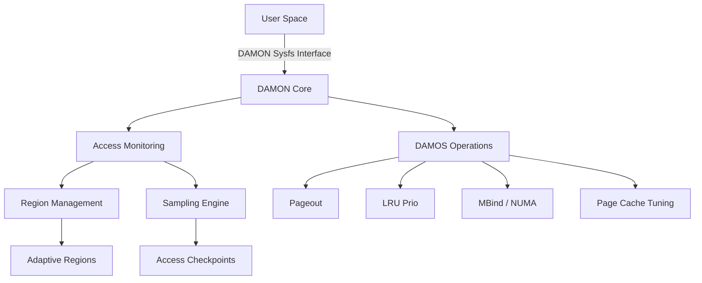
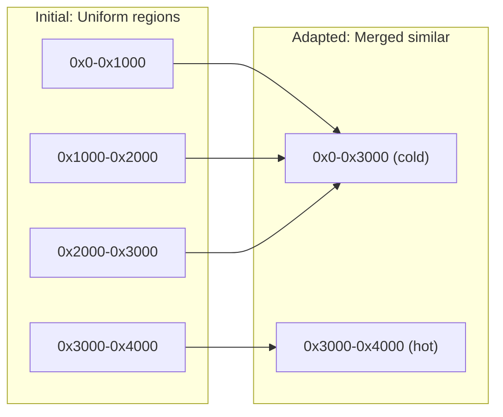
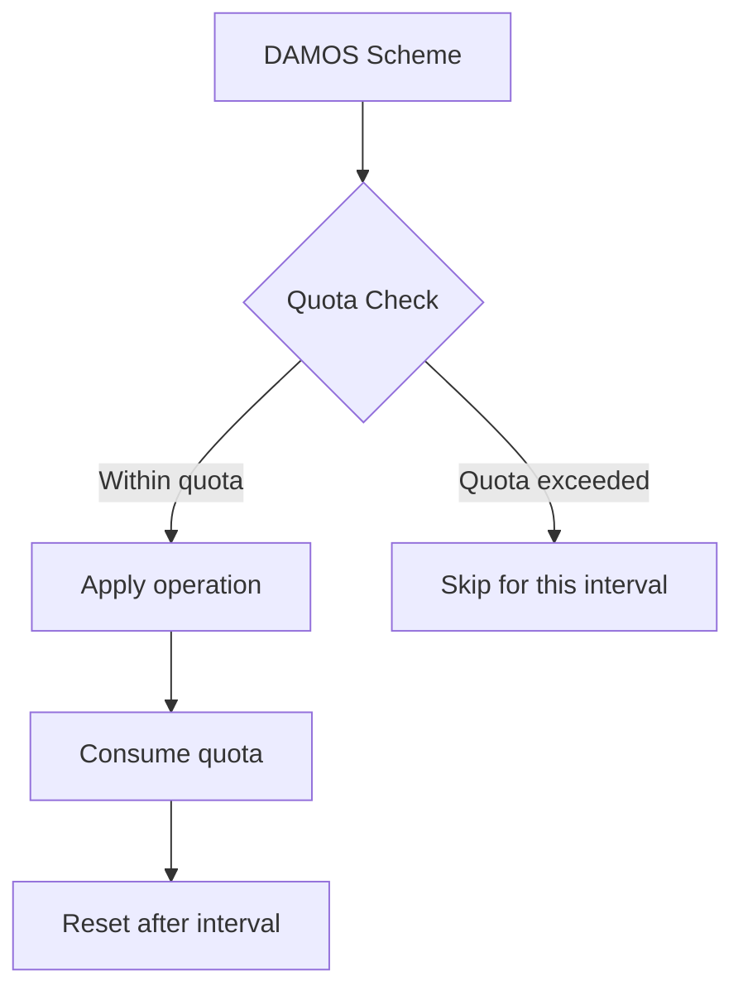
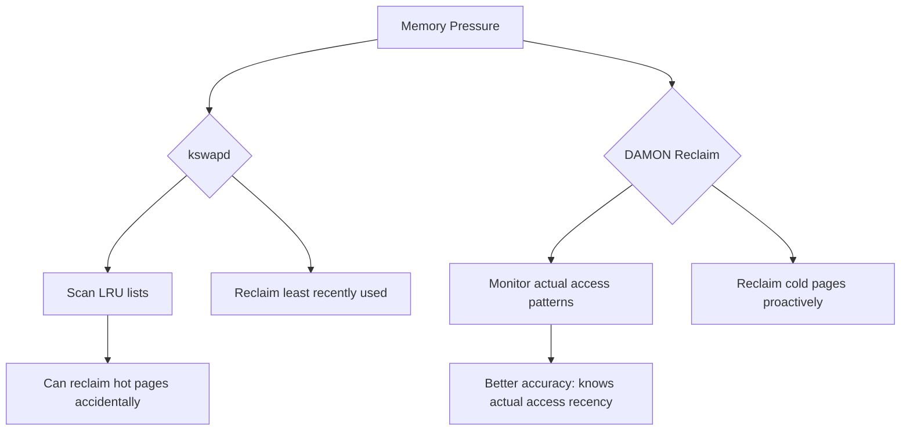

# DAMON: Data Access MONitoring

## Introduction

DAMON (Data Access MONitoring) is a Linux kernel subsystem that provides efficient
data access monitoring and management capabilities. Introduced in Linux 5.15 and
refined through subsequent releases, DAMON enables the kernel to track how memory
regions are accessed at runtime with minimal overhead. This information powers
intelligent memory management decisions through DAMOS (DAMON-based Operation Schemes),
which can automatically optimize memory placement, reclaim unused pages, and
proactively migrate data between NUMA nodes.

## Architecture Overview



## Core Concepts

### Monitoring Target

A DAMON monitoring target consists of an address space (typically a process's virtual
address space or physical address space) and the regions within it to be monitored:

```c
struct damon_target {
    struct list_head list;          /* Linked list of targets */
    unsigned long pid;              /* Target process PID (0 for physical) */
    struct damon_addr_range region; /* Address range to monitor */
    /* ... */
};
```

### Regions

DAMON divides the monitoring target's address space into **regions**. Each region
is a contiguous range of addresses that DAMON tracks independently:

```c
struct damon_region {
    struct list_head list;          /* Linked list within target */
    struct damon_addr_range ar;     /* [start, end) address range */
    unsigned long sampling_addr;    /* Address for current sampling */
    unsigned int nr_accesses;       /* Access count in current window */
    unsigned int age;               /* Number of monitoring intervals */
    /* DAMOS-related fields */
    unsigned int last_nr_accesses;  /* Previous window access count */
    struct damos_access_pattern pattern; /* Classified access pattern */
};
```

### Adaptive Regions

The key innovation of DAMON is its **adaptive regions** approach. Rather than monitoring
every page (which would be prohibitively expensive), DAMON dynamically adjusts region
boundaries based on access patterns:



Regions with similar access patterns are merged, while regions with divergent
patterns are split. This focuses monitoring resources where they matter most.

## Sampling Mechanism

DAMON uses a time-based sampling approach to estimate access frequency:

### Monitoring Intervals

```
┌─────────────────────── One Aggregation Interval ───────────────────────┐
│                                                                        │
│  ┌──┐  ┌──┐  ┌──┐  ┌──┐  ┌──┐  ┌──┐  ┌──┐  ┌──┐  ┌──┐  ┌──┐       │
│  │S1│  │S2│  │S3│  │S4│  │S5│  │S6│  │S7│  │S8│  │S9│  │S10│       │
│  └──┘  └──┘  └──┘  └──┘  └──┘  └──┘  └──┘  └──┘  └──┘  └──┘       │
│  ^                      ^                      ^                      │
│  Sample                 Sample                 Sample                  │
│  (random addr in region)                                                │
└────────────────────────────────────────────────────────────────────────┘
```

- **Sampling interval**: How often DAMON takes a sample (e.g., 5 ms)
- **Aggregation interval**: How many samples before resetting the count (e.g., 100 ms)
- **Regions update interval**: How often region boundaries are adapted (e.g., 1 s)

### Access Checking via PTE A-bits

DAMON leverages the hardware **Access bit** in page table entries (PTEs):

1. At each sample point, DAMON reads and clears the Access bit for the sampled address
2. If the bit was set, the region's `nr_accesses` counter is incremented
3. At aggregation boundaries, the count is recorded and reset

```c
/* Simplified sampling logic */
static void damon_do_apply_schemes_check_accesses(struct damon_ctx *c,
                                                   struct damon_target *t,
                                                   struct damon_region *r)
{
    bool accessed;

    /* Read and clear the access bit */
    accessed = damon_young(t, r, r->sampling_addr, NULL);
    if (accessed)
        r->nr_accesses++;
}
```

The `damon_young()` function uses architecture-specific mechanisms:

```c
/* For x86: walks page tables and checks the Accessed bit */
static bool damon_young(struct damon_target *t, struct damon_region *r,
                        unsigned long addr, struct damon_access_pattern *pattern)
{
    /* Walk the page table to find the PTE */
    /* Read the _PAGE_ACCESSED bit */
    /* Clear the bit (test and clear) */
    /* Return whether it was set */
}
```

## DAMOS: DAMON-based Operation Schemes

DAMOS translates monitoring data into memory management actions. A scheme defines
an access pattern to match and an operation to apply:

### Scheme Structure

```c
struct damos {
    struct list_head list;           /* Linked list of schemes */
    struct damos_access_pattern pattern; /* Pattern to match */
    struct damos_action action;      /* Operation to apply */
    unsigned long apply_interval_us; /* How often to apply */
    unsigned long quota_ms;          /* Time quota per interval */
    unsigned long quota_reset_interval_ms;
    /* ... */
};

struct damos_access_pattern {
    unsigned long min_nr_accesses;
    unsigned long max_nr_accesses;
    unsigned long min_age;
    unsigned long max_age;
};
```

### Available Operations

| Operation | Description | Use Case |
|-----------|-------------|----------|
| `DAMOS_WILLNEED` | Advise kernel to keep pages | Hot data promotion |
| `DAMOS_COLD` | Mark pages as cold | Prepare for reclaim |
| `DAMOS_PAGEOUT` | Reclaim pages to swap/disk | Memory pressure relief |
| `DAMOS_HUGEPAGE` | Promote to huge pages | Hot large regions |
| `DAMOS_NOHUGEPAGE` | Prevent huge page promotion | Cold mixed regions |
| `DAMOS_LRU_PRIO` | Prioritize in LRU lists | Better reclaim targeting |
| `DAMOS_LRU_DEPRIO` | Deprioritize in LRU | Cold page reclaim |
| `DAMOS_MIGRATE` | Migrate pages to specific NUMA node | NUMA optimization |
| `DAMOS_DAMAP` | Demote from huge pages | Huge page splitting |

### Quota Management

DAMOS includes quota management to limit the impact of operations:



```c
/* Quota control example */
struct damos_quota quota = {
    /* Use at most 1ms of CPU time per 100ms interval */
    .ms = 1,
    .reset_interval_ms = 100,
    /* Weight by size and access frequency */
    .sz = 0,   /* No size-based quota */
    .weight_sz = 0,
    .weight_nr_accesses = 500,
};
```

## Sysfs Interface

DAMON exposes its controls through `/sys/kernel/mm/damon/`:

```
/sys/kernel/mm/damon/
├── admin/
│   ├── kdamonds/
│   │   ├── 0/
│   │   │   ├── state          (on/off/commit/update_schemes_stats)
│   │   │   ├── pid            (target PID for virtual address monitoring)
│   │   │   ├── intervals/
│   │   │   │   ├── sample_us  (sampling interval in microseconds)
│   │   │   │   ├── aggr_us    (aggregation interval)
│   │   │   │   └── update_us  (regions update interval)
│   │   │   └── schemes/
│   │   │       ├── 0/
│   │   │       │   ├── action          (pageout/hugepage/lru_prio/...)
│   │   │       │   ├── access/
│   │   │       │   │   ├── min_nr_accesses
│   │   │       │   │   ├── max_nr_accesses
│   │   │       │   │   ├── min_age
│   │   │       │   │   └── max_age
│   │   │       │   └── quotas/
│   │   │       │       ├── ms
│   │   │       │       ├── reset_interval_ms
│   │   │       │       └── bytes
│   │   │       └── 1/
│   │   │           └── ...
│   │   └── 1/
│   │       └── ...
│   └── nr_kdamonds
└── ...
```

### Configuration Example

```bash
#!/bin/bash
# Configure DAMON to monitor and reclaim cold pages

KDAMOND=/sys/kernel/mm/damon/admin/kdamonds/0

# Stop for reconfiguration
echo off > $KDAMOND/state

# Set intervals: sample every 5ms, aggregate every 100ms, update regions every 1s
echo 5000 > $KDAMOND/intervals/sample_us
echo 100000 > $KDAMOND/intervals/aggr_us
echo 1000000 > $KDAMOND/intervals/update_us

# Monitor current process
echo $$ > $KDAMOND/pid

# Scheme 0: Reclaim pages not accessed for > 10 aggregation intervals
echo pageout > $KDAMOND/schemes/0/action
echo 0 > $KDAMOND/schemes/0/access/min_nr_accesses
echo 0 > $KDAMOND/schemes/0/access/max_nr_accesses
echo 10 > $KDAMOND/schemes/0/access/min_age
echo max > $KDAMOND/schemes/0/access/max_age

# Limit reclaim to 10MB per second
echo 10485760 > $KDAMOND/schemes/0/quotas/bytes
echo 1000 > $KDAMOND/schemes/0/quotas/reset_interval_ms

# Start monitoring
echo on > $KDAMOND/state

echo "DAMON monitoring active"
cat $KDAMOND/state
```

## Reclaim (DAMON-based Proactive Reclaim)

Linux 6.12+ includes `damon_reclaim`, a built-in module that uses DAMON for
proactive memory reclaim under pressure:

```bash
# Enable DAMON reclaim via boot parameter
# damon_reclaim.enabled=1

# Or via module parameters
echo 1 > /sys/module/damon_reclaim/parameters/enabled
echo 10000000 > /sys/module/damon_reclaim/parameters/min_age  # 10s
echo 10485760 > /sys/module/damon_reclaim/parameters/limit    # 10MB/s
```

### How DAMON Reclaim Differs from kswapd



## NUMA Optimization with DAMON

DAMON can automatically promote hot pages to faster NUMA nodes:

```bash
# Promote hot pages to node 0
echo migrate > $KDAMOND/schemes/0/action
echo 0 > $KDAMOND/schemes/0/dest_nid
echo 5 > $KDAMOND/schemes/0/access/min_nr_accesses
echo max > $KDAMOND/schemes/0/access/max_nr_accesses
echo 0 > $KDAMOND/schemes/0/access/min_age
echo 5 > $KDAMOND/schemes/0/access/max_age

# Demote cold pages to node 1
echo migrate > $KDAMOND/schemes/1/action
echo 1 > $KDAMOND/schemes/1/dest_nid
echo 0 > $KDAMOND/schemes/1/access/min_nr_accesses
echo 0 > $KDAMOND/schemes/1/access/max_nr_accesses
echo 10 > $KDAMOND/schemes/1/access/min_age
echo max > $KDAMOND/schemes/1/access/max_age
```

## Programmatic Interface (libdamon)

The DAMON user-space library `damo` provides a Python interface:

```python
import damon

# Monitor a process
ctx = damon.DamonCtx(
    target_pid=1234,
    intervals=damon.Intervals(sample=5000, aggr=100000, update=1000000),
    ops='vaddr',
)

# Add a scheme: reclaim pages idle for > 5 seconds
ctx.add_scheme(
    action='pageout',
    access_pattern=damon.AccessPattern(
        min_nr_accesses=0, max_nr_accesses=0,
        min_age=50, max_age='max',
    ),
    quota=damon.Quota(bytes=10*1024*1024, reset_interval_ms=1000),
)

# Start monitoring
ctx.start()
```

## Performance Overhead

DAMON's sampling approach keeps overhead very low:

| Workload | Monitoring Overhead | Notes |
|----------|-------------------|-------|
| Idle system | < 0.1% | Negligible |
| Memory-intensive | < 1% | Sampling amortizes cost |
| Large address space | < 2% | Adaptive regions help |

The overhead scales with the number of regions and sampling frequency, not with
the total address space size.

## Kernel Configuration

```
CONFIG_DAMON=y
CONFIG_DAMON_VADDR=y          # Virtual address space monitoring
CONFIG_DAMON_PADDR=y          # Physical address space monitoring
CONFIG_DAMON_SYSFS=y          # Sysfs interface
CONFIG_DAMON_RECLAIM=y        # Proactive reclaim module
CONFIG_DAMON_LRU_SORT=y       # LRU sorting module
```

## Cross-References

- [Memory Overview](overview.md) - Linux memory management subsystem
- [NUMA](numa.md) - Non-Uniform Memory Access architecture
- [Page Allocator](page-allocator.md) - Physical page allocation
- [Swap](swap.md) - Swap space and page reclaim
- [OOM Killer](oom-killer.md) - Out-of-memory handling
- [KSM (Kernel Same-page Merging)](ksm.md) - Memory deduplication
- [Huge Pages](huge-pages.md) - Transparent huge pages

## Further Reading

- [DAMON official documentation](https://www.kernel.org/doc/html/latest/mm/damon/index.html)
- [DAMON: Data Access MONitoring (LWN.net)](https://lwn.net/Articles/812707/)
- [DAMON Patches (lore.kernel.org)](https://lore.kernel.org/linux-mm/?q=damon)
- [DAMON user-space tool (damo)](https://github.com/damonitor/damo)
- [Proactive Reclaim with DAMON (LPC 2021)](https://lpc.events/event/11/contributions/967/)
- [SeongJae Park's DAMON talk (Linux Plumbers)](https://www.youtube.com/watch?v=Pe5epYHGoW8)
