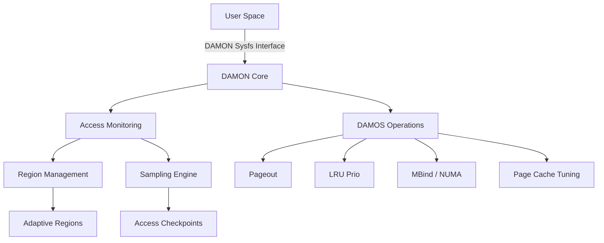
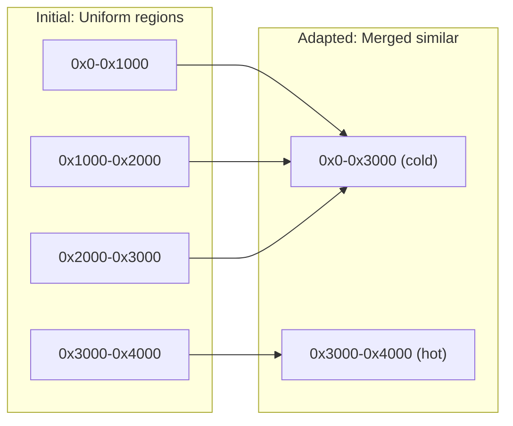
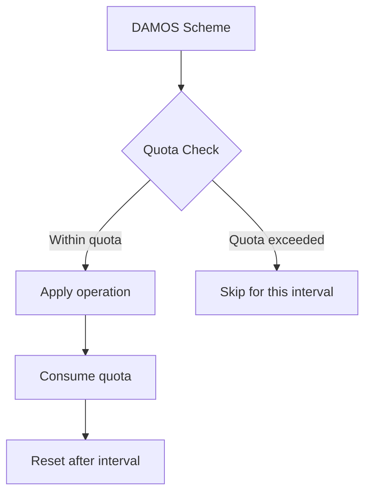
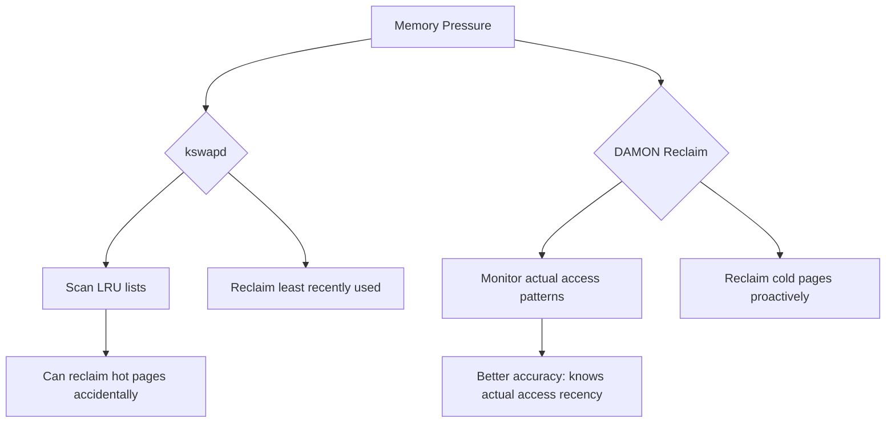
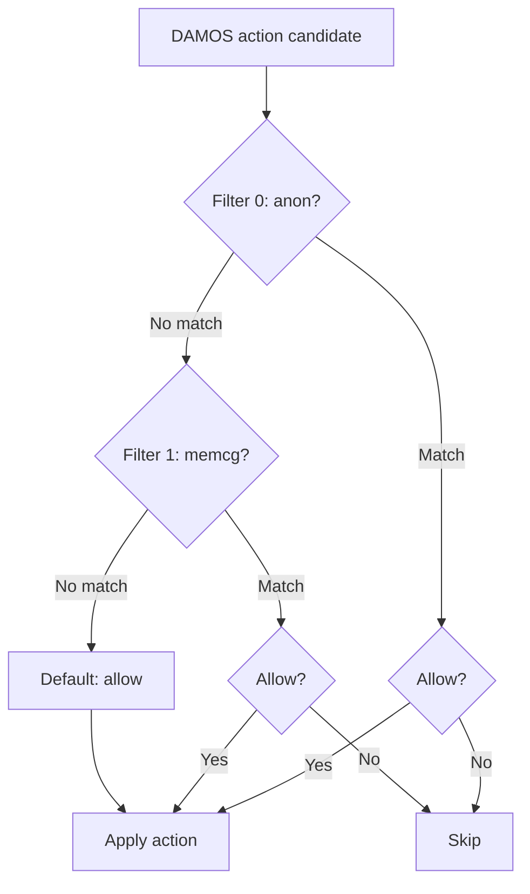
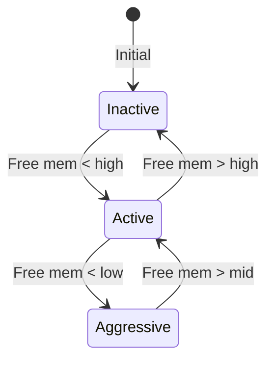
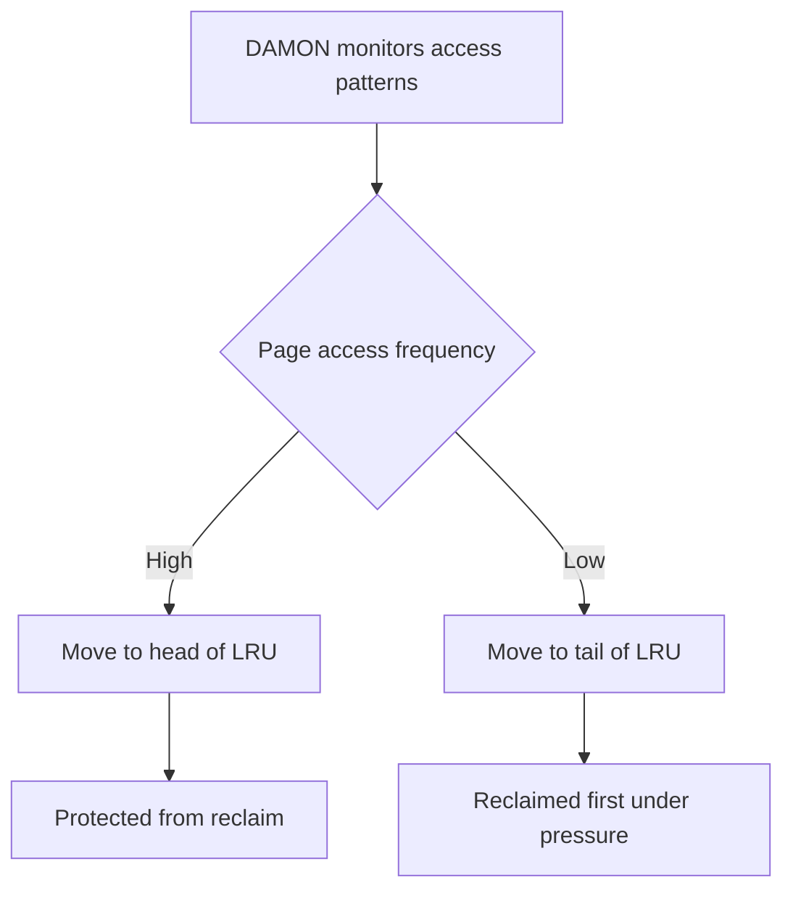
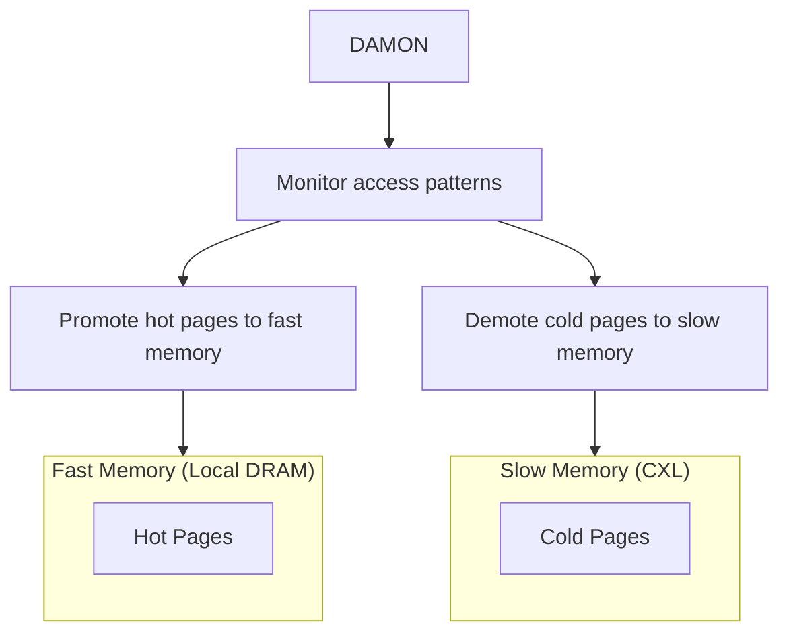

# DAMON: Data Access MONitoring

## Introduction

DAMON (Data Access MONitoring) is a Linux kernel subsystem that provides efficient
data access monitoring and management capabilities. Introduced in Linux 5.15 and
refined through subsequent releases, DAMON enables the kernel to track how memory
regions are accessed at runtime with minimal overhead. This information powers
intelligent memory management decisions through DAMOS (DAMON-based Operation Schemes),
which can automatically optimize memory placement, reclaim unused pages, and
proactively migrate data between NUMA nodes.

## Architecture Overview



## Core Concepts

### Monitoring Target

A DAMON monitoring target consists of an address space (typically a process's virtual
address space or physical address space) and the regions within it to be monitored:

```c
struct damon_target {
    struct list_head list;          /* Linked list of targets */
    unsigned long pid;              /* Target process PID (0 for physical) */
    struct damon_addr_range region; /* Address range to monitor */
    /* ... */
};
```

### Regions

DAMON divides the monitoring target's address space into **regions**. Each region
is a contiguous range of addresses that DAMON tracks independently:

```c
struct damon_region {
    struct list_head list;          /* Linked list within target */
    struct damon_addr_range ar;     /* [start, end) address range */
    unsigned long sampling_addr;    /* Address for current sampling */
    unsigned int nr_accesses;       /* Access count in current window */
    unsigned int age;               /* Number of monitoring intervals */
    /* DAMOS-related fields */
    unsigned int last_nr_accesses;  /* Previous window access count */
    struct damos_access_pattern pattern; /* Classified access pattern */
};
```

### Adaptive Regions

The key innovation of DAMON is its **adaptive regions** approach. Rather than monitoring
every page (which would be prohibitively expensive), DAMON dynamically adjusts region
boundaries based on access patterns:



Regions with similar access patterns are merged, while regions with divergent
patterns are split. This focuses monitoring resources where they matter most.

## Sampling Mechanism

DAMON uses a time-based sampling approach to estimate access frequency:

### Monitoring Intervals

```
┌─────────────────────── One Aggregation Interval ───────────────────────┐
│                                                                        │
│  ┌──┐  ┌──┐  ┌──┐  ┌──┐  ┌──┐  ┌──┐  ┌──┐  ┌──┐  ┌──┐  ┌──┐       │
│  │S1│  │S2│  │S3│  │S4│  │S5│  │S6│  │S7│  │S8│  │S9│  │S10│       │
│  └──┘  └──┘  └──┘  └──┘  └──┘  └──┘  └──┘  └──┘  └──┘  └──┘       │
│  ^                      ^                      ^                      │
│  Sample                 Sample                 Sample                  │
│  (random addr in region)                                                │
└────────────────────────────────────────────────────────────────────────┘
```

- **Sampling interval**: How often DAMON takes a sample (e.g., 5 ms)
- **Aggregation interval**: How many samples before resetting the count (e.g., 100 ms)
- **Regions update interval**: How often region boundaries are adapted (e.g., 1 s)

### Access Checking via PTE A-bits

DAMON leverages the hardware **Access bit** in page table entries (PTEs):

1. At each sample point, DAMON reads and clears the Access bit for the sampled address
2. If the bit was set, the region's `nr_accesses` counter is incremented
3. At aggregation boundaries, the count is recorded and reset

```c
/* Simplified sampling logic */
static void damon_do_apply_schemes_check_accesses(struct damon_ctx *c,
                                                   struct damon_target *t,
                                                   struct damon_region *r)
{
    bool accessed;

    /* Read and clear the access bit */
    accessed = damon_young(t, r, r->sampling_addr, NULL);
    if (accessed)
        r->nr_accesses++;
}
```

The `damon_young()` function uses architecture-specific mechanisms:

```c
/* For x86: walks page tables and checks the Accessed bit */
static bool damon_young(struct damon_target *t, struct damon_region *r,
                        unsigned long addr, struct damon_access_pattern *pattern)
{
    /* Walk the page table to find the PTE */
    /* Read the _PAGE_ACCESSED bit */
    /* Clear the bit (test and clear) */
    /* Return whether it was set */
}
```

## DAMOS: DAMON-based Operation Schemes

DAMOS translates monitoring data into memory management actions. A scheme defines
an access pattern to match and an operation to apply:

### Scheme Structure

```c
struct damos {
    struct list_head list;           /* Linked list of schemes */
    struct damos_access_pattern pattern; /* Pattern to match */
    struct damos_action action;      /* Operation to apply */
    unsigned long apply_interval_us; /* How often to apply */
    unsigned long quota_ms;          /* Time quota per interval */
    unsigned long quota_reset_interval_ms;
    /* ... */
};

struct damos_access_pattern {
    unsigned long min_nr_accesses;
    unsigned long max_nr_accesses;
    unsigned long min_age;
    unsigned long max_age;
};
```

### Available Operations

| Operation | Description | Use Case |
|-----------|-------------|----------|
| `DAMOS_WILLNEED` | Advise kernel to keep pages | Hot data promotion |
| `DAMOS_COLD` | Mark pages as cold | Prepare for reclaim |
| `DAMOS_PAGEOUT` | Reclaim pages to swap/disk | Memory pressure relief |
| `DAMOS_HUGEPAGE` | Promote to huge pages | Hot large regions |
| `DAMOS_NOHUGEPAGE` | Prevent huge page promotion | Cold mixed regions |
| `DAMOS_LRU_PRIO` | Prioritize in LRU lists | Better reclaim targeting |
| `DAMOS_LRU_DEPRIO` | Deprioritize in LRU | Cold page reclaim |
| `DAMOS_MIGRATE` | Migrate pages to specific NUMA node | NUMA optimization |
| `DAMOS_DAMAP` | Demote from huge pages | Huge page splitting |

### Quota Management

DAMOS includes quota management to limit the impact of operations:



```c
/* Quota control example */
struct damos_quota quota = {
    /* Use at most 1ms of CPU time per 100ms interval */
    .ms = 1,
    .reset_interval_ms = 100,
    /* Weight by size and access frequency */
    .sz = 0,   /* No size-based quota */
    .weight_sz = 0,
    .weight_nr_accesses = 500,
};
```

## Sysfs Interface

DAMON exposes its controls through `/sys/kernel/mm/damon/`:

```
/sys/kernel/mm/damon/
├── admin/
│   ├── kdamonds/
│   │   ├── 0/
│   │   │   ├── state          (on/off/commit/update_schemes_stats)
│   │   │   ├── pid            (target PID for virtual address monitoring)
│   │   │   ├── intervals/
│   │   │   │   ├── sample_us  (sampling interval in microseconds)
│   │   │   │   ├── aggr_us    (aggregation interval)
│   │   │   │   └── update_us  (regions update interval)
│   │   │   └── schemes/
│   │   │       ├── 0/
│   │   │       │   ├── action          (pageout/hugepage/lru_prio/...)
│   │   │       │   ├── access/
│   │   │       │   │   ├── min_nr_accesses
│   │   │       │   │   ├── max_nr_accesses
│   │   │       │   │   ├── min_age
│   │   │       │   │   └── max_age
│   │   │       │   └── quotas/
│   │   │       │       ├── ms
│   │   │       │       ├── reset_interval_ms
│   │   │       │       └── bytes
│   │   │       └── 1/
│   │   │           └── ...
│   │   └── 1/
│   │       └── ...
│   └── nr_kdamonds
└── ...
```

### Configuration Example

```bash
#!/bin/bash
# Configure DAMON to monitor and reclaim cold pages

KDAMOND=/sys/kernel/mm/damon/admin/kdamonds/0

# Stop for reconfiguration
echo off > $KDAMOND/state

# Set intervals: sample every 5ms, aggregate every 100ms, update regions every 1s
echo 5000 > $KDAMOND/intervals/sample_us
echo 100000 > $KDAMOND/intervals/aggr_us
echo 1000000 > $KDAMOND/intervals/update_us

# Monitor current process
echo $$ > $KDAMOND/pid

# Scheme 0: Reclaim pages not accessed for > 10 aggregation intervals
echo pageout > $KDAMOND/schemes/0/action
echo 0 > $KDAMOND/schemes/0/access/min_nr_accesses
echo 0 > $KDAMOND/schemes/0/access/max_nr_accesses
echo 10 > $KDAMOND/schemes/0/access/min_age
echo max > $KDAMOND/schemes/0/access/max_age

# Limit reclaim to 10MB per second
echo 10485760 > $KDAMOND/schemes/0/quotas/bytes
echo 1000 > $KDAMOND/schemes/0/quotas/reset_interval_ms

# Start monitoring
echo on > $KDAMOND/state

echo "DAMON monitoring active"
cat $KDAMOND/state
```

## Reclaim (DAMON-based Proactive Reclaim)

Linux 6.12+ includes `damon_reclaim`, a built-in module that uses DAMON for
proactive memory reclaim under pressure:

```bash
# Enable DAMON reclaim via boot parameter
# damon_reclaim.enabled=1

# Or via module parameters
echo 1 > /sys/module/damon_reclaim/parameters/enabled
echo 10000000 > /sys/module/damon_reclaim/parameters/min_age  # 10s
echo 10485760 > /sys/module/damon_reclaim/parameters/limit    # 10MB/s
```

### How DAMON Reclaim Differs from kswapd



## NUMA Optimization with DAMON

DAMON can automatically promote hot pages to faster NUMA nodes:

```bash
# Promote hot pages to node 0
echo migrate > $KDAMOND/schemes/0/action
echo 0 > $KDAMOND/schemes/0/dest_nid
echo 5 > $KDAMOND/schemes/0/access/min_nr_accesses
echo max > $KDAMOND/schemes/0/access/max_nr_accesses
echo 0 > $KDAMOND/schemes/0/access/min_age
echo 5 > $KDAMOND/schemes/0/access/max_age

# Demote cold pages to node 1
echo migrate > $KDAMOND/schemes/1/action
echo 1 > $KDAMOND/schemes/1/dest_nid
echo 0 > $KDAMOND/schemes/1/access/min_nr_accesses
echo 0 > $KDAMOND/schemes/1/access/max_nr_accesses
echo 10 > $KDAMOND/schemes/1/access/min_age
echo max > $KDAMOND/schemes/1/access/max_age
```

## Sysfs Interface (Detailed)

From the [kernel documentation](https://docs.kernel.org/admin-guide/mm/damon/usage.html), DAMON exposes a
comprehensive sysfs interface under `/sys/kernel/mm/damon/admin/` for privileged userspace
programs. The `damo` tool is built on top of this interface.

### Files Hierarchy

The complete sysfs hierarchy is:

```
/sys/kernel/mm/damon/admin/
├── kdamonds/
│   ├── nr_kdamonds           # Number of kdamond instances
│   └── 0/
│       ├── state             # on/off/commit/update_schemes_stats/...
│       ├── pid               # PID of kdamond thread (read-only when on)
│       ├── refresh_ms        # Auto-refresh interval for stats/tuned intervals
│       └── contexts/
│           ├── nr_contexts
│           └── 0/
│               ├── avail_operations  # Available operations (vaddr/paddr/...)
│               ├── operations       # Set operations type
│               ├── addr_unit        # Address unit (bytes)
│               ├── monitoring_attrs/
│               │   ├── intervals/
│               │   │   ├── sample_us    # Sampling interval (µs)
│               │   │   ├── aggr_us      # Aggregation interval (µs)
│               │   │   └── update_us    # Regions update interval (µs)
│               │   └── nr_regions/
│               │       ├── min          # Min number of monitoring regions
│               │       └── max          # Max number of monitoring regions
│               ├── targets/
│               │   ├── nr_targets
│               │   └── 0/
│               │       ├── pid_target   # Target process PID
│               │       └── regions/
│               │           ├── nr_regions
│               │           └── 0/
│               │               ├── start  # Region start address
│               │               └── end    # Region end address
│               └── schemes/
│                   ├── nr_schemes
│                   └── 0/
│                       ├── action          # pageout/hugepage/lru_prio/migrate/...
│                       ├── target_nid      # Target NUMA node (for migrate)
│                       ├── apply_interval_us
│                       ├── access_pattern/
│                       │   ├── sz/min,max
│                       │   ├── nr_accesses/min,max
│                       │   └── age/min,max
│                       ├── quotas/
│                       │   ├── ms, bytes, reset_interval_ms
│                       │   └── weights/sz_permil,nr_accesses_permil,age_permil
│                       ├── watermarks/
│                       │   ├── metric, interval_us
│                       │   ├── high, mid, low
│                       ├── filters/
│                       │   └── 0/type,matching,allow,memcg_path,...
│                       ├── stats/
│                       │   ├── nr_tried, sz_tried
│                       │   ├── nr_applied, sz_applied
│                       │   └── qt_exceeds
│                       └── tried_regions/
│                           └── 0/start,end,nr_accesses,age
```

### State Commands

The `state` file accepts these commands:

| Command | Description |
|---------|-------------|
| `on` | Start the kdamond |
| `off` | Stop the kdamond |
| `commit` | Re-read sysfs configuration (apply changes) |
| `update_tuned_intervals` | Update sample_us/aggr_us with auto-tuned values |
| `update_schemes_stats` | Refresh the stats files for each DAMOS scheme |
| `update_schemes_tried_regions` | Refresh tried_regions data |
| `update_schemes_effective_quotas` | Refresh effective_bytes for quotas |
| `commit_schemes_quota_goals` | Re-read quota goal configurations |
| `clear_schemes_tried_regions` | Clear tried_regions data |

### Quick Configuration Example

```bash
cd /sys/kernel/mm/damon/admin/
# Create one kdamond with one context
echo 1 > kdamonds/nr_kdamonds
echo 1 > kdamonds/0/contexts/nr_contexts
# Use virtual address monitoring
echo vaddr > kdamonds/0/contexts/0/operations
# Set target PID
echo 1 > kdamonds/0/contexts/0/targets/nr_targets
echo $(pidof myworkload) > kdamonds/0/contexts/0/targets/0/pid_target
# Set intervals: 5ms sample, 100ms aggr, 1s update
echo 5000 > kdamonds/0/contexts/0/monitoring_attrs/intervals/sample_us
echo 100000 > kdamonds/0/contexts/0/monitoring_attrs/intervals/aggr_us
echo 1000000 > kdamonds/0/contexts/0/monitoring_attrs/intervals/update_us
# Add a reclaim scheme
echo 1 > kdamonds/0/contexts/0/schemes/nr_schemes
echo pageout > kdamonds/0/contexts/0/schemes/0/action
echo 0 > kdamonds/0/contexts/0/schemes/0/access_pattern/nr_accesses/min
echo 0 > kdamonds/0/contexts/0/schemes/0/access_pattern/nr_accesses/max
echo 10 > kdamonds/0/contexts/0/schemes/0/access_pattern/age/min
# Start
echo on > kdamonds/0/state
```

## Programmatic Interface (libdamon)

The DAMON user-space library `damo` provides a Python interface:

```python
import damon

# Monitor a process
ctx = damon.DamonCtx(
    target_pid=1234,
    intervals=damon.Intervals(sample=5000, aggr=100000, update=1000000),
    ops='vaddr',
)

# Add a scheme: reclaim pages idle for > 5 seconds
ctx.add_scheme(
    action='pageout',
    access_pattern=damon.AccessPattern(
        min_nr_accesses=0, max_nr_accesses=0,
        min_age=50, max_age='max',
    ),
    quota=damon.Quota(bytes=10*1024*1024, reset_interval_ms=1000),
)

# Start monitoring
ctx.start()
```

## Performance Overhead

DAMON's sampling approach keeps overhead very low:

| Workload | Monitoring Overhead | Notes |
|----------|-------------------|-------|
| Idle system | < 0.1% | Negligible |
| Memory-intensive | < 1% | Sampling amortizes cost |
| Large address space | < 2% | Adaptive regions help |

The overhead scales with the number of regions and sampling frequency, not with
the total address space size.

## Kernel Configuration

```
CONFIG_DAMON=y
CONFIG_DAMON_VADDR=y          # Virtual address space monitoring
CONFIG_DAMON_PADDR=y          # Physical address space monitoring
CONFIG_DAMON_SYSFS=y          # Sysfs interface
CONFIG_DAMON_RECLAIM=y        # Proactive reclaim module
CONFIG_DAMON_LRU_SORT=y       # LRU sorting module
```

## DAMOS Filters

DAMOS filters allow fine-grained control over which pages an operation applies to:

### Filter Types

| Filter Type | Description | Since |
|-------------|-------------|-------|
| `anon` | Match anonymous (anon) or file-backed pages | 5.18 |
| `memcg` | Match pages belonging to a specific cgroup | 5.18 |
| `addr` | Match pages in a specific address range | 6.0 |
| `target` | Match pages based on NUMA node or tier | 6.3 |

### Filter Configuration

```bash
# Filter: only apply to anonymous pages
KDAMOND=/sys/kernel/mm/damon/admin/kdamonds/0

echo anon > $KDAMOND/contexts/0/schemes/0/filters/0/type
echo 1 > $KDAMOND/contexts/0/schemes/0/filters/0/matching  # 1 = match anon
echo 1 > $KDAMOND/contexts/0/schemes/0/filters/0/allow     # 1 = allow

# Filter: exclude a specific cgroup
echo memcg > $KDAMOND/contexts/0/schemes/0/filters/1/type
echo /sys/fs/cgroup/important > $KDAMOND/contexts/0/schemes/0/filters/1/memcg_path
echo 0 > $KDAMOND/contexts/0/schemes/0/filters/1/allow     # 0 = deny

# Filter: only apply to a specific address range
echo addr > $KDAMOND/contexts/0/schemes/0/filters/2/type
echo 0x7f0000000000 > $KDAMOND/contexts/0/schemes/0/filters/2/addr_start
echo 0x7f0010000000 > $KDAMOND/contexts/0/schemes/0/filters/2/addr_end
echo 1 > $KDAMOND/contexts/0/schemes/0/filters/2/allow
```

### Filter Evaluation Order

Filters are evaluated in order (0, 1, 2, ...). The first matching filter determines whether the page is allowed. If no filter matches, the default is to allow.



---

## Quota Auto-tuning with Goals

DAMON supports **automatic quota tuning** based on user-defined goals. This is useful when you want to limit the impact of DAMOS operations on system performance:

### Goal Structure

```c
struct damos_quota_goal {
    enum damos_quota_goal_metric metric;
    /* Metric to monitor (e.g., PSI, latency) */
    unsigned long target;   /* Target value */
    unsigned long current;  /* Current value */
    /* ... */
};
```

### Goal Metrics

| Metric | Description | Unit |
|--------|-------------|------|
| `DAMOS_QUOTA_SOME_MEM_PSI` | PSI some memory pressure | microseconds |
| `DAMOS_QUOTA_FULL_MEM_PSI` | PSI full memory pressure | microseconds |
| `DAMOS_QUOTA_ANON_LATENCY` | Anonymous page fault latency | nanoseconds |

### Configuring Goals

```bash
# Goal: keep PSI some memory pressure below 100ms per second
echo some_mem_psi > $KDAMOND/contexts/0/schemes/0/quotas/goals/0/metric
echo 100000 > $KDAMOND/contexts/0/schemes/0/quotas/goals/0/target  # 100ms

# Goal: keep anonymous page fault latency below 10us
echo anon_latency > $KDAMOND/contexts/0/schemes/0/quotas/goals/1/metric
echo 10000 > $KDAMOND/contexts/0/schemes/0/quotas/goals/1/target   # 10us
```

When the current value exceeds the target, DAMOS reduces its quota to ease the load. When it's below the target, DAMOS increases its quota to be more aggressive.

---

## DAMOS Watermarks

Watermarks control when DAMOS schemes activate based on system memory pressure:

```bash
# Configure watermarks
echo free_mem_rate > $KDAMOND/contexts/0/schemes/0/watermarks/metric
echo 5000000 > $KDAMOND/contexts/0/schemes/0/watermarks/interval_us  # 5s check interval
echo 500 > $KDAMOND/contexts/0/schemes/0/watermarks/high    # 50% free memory
echo 300 > $KDAMOND/contexts/0/schemes/0/watermarks/mid     # 30% free memory
echo 100 > $KDAMOND/contexts/0/schemes/0/watermarks/low     # 10% free memory
```

### Watermark Behavior

| Condition | State | Action |
|-----------|-------|--------|
| Free memory > high | Inactive | Scheme paused |
| Free memory between mid and high | Active | Scheme runs |
| Free memory < low | Aggressive | Scheme runs with higher priority |



---

## DAMON LRU Sort

Linux 6.0 introduced `CONFIG_DAMON_LRU_SORT`, a module that uses DAMON to sort pages in the LRU lists based on their access patterns. This improves reclaim efficiency by ensuring hot pages are at the head of the LRU list and cold pages are at the tail.

### How LRU Sort Works



### Enabling LRU Sort

```bash
# Enable via boot parameter
# damon_lru_sort.enabled=1

# Or via module parameters
echo 1 > /sys/module/damon_lru_sort/parameters/enabled

# Configure intervals
echo 5000 > /sys/module/damon_lru_sort/parameters/sample_interval
# 5ms sampling

echo 100000 > /sys/module/damon_lru_sort/parameters/aggr_interval
# 100ms aggregation

echo 1000000 > /sys/module/damon_lru_sort/parameters/update_interval
# 1s region update
```

### LRU Sort vs MGLRU

| Feature | LRU Sort | MGLRU |
|---------|----------|-------|
| **Approach** | Sort existing LRU lists | Multi-generation LRU |
| **Overhead** | Low (DAMON sampling) | Medium (page table scanning) |
| **Granularity** | Region-based | Per-page |
| **Complementary** | Yes — can work with MGLRU | Built-in LRU redesign |

---

## DAMON and MGLRU Interaction

DAMON and MGLRU (Multi-Gen LRU) are complementary systems:

- **MGLRU** provides better page aging by tracking multiple generations of pages
- **DAMON** provides access pattern data that can inform reclaim decisions

```bash
# DAMON can supplement MGLRU by providing access frequency data
# DAMOS pageout actions work with MGLRU's generation-based reclaim

# Check if MGLRU is enabled
cat /sys/kernel/mm/lru_gen/enabled
# 0x0007 (all tiers enabled)
```

When both are active, DAMON's region-level access data can help MGLRU make better decisions about which pages to promote or demote between generations.

---

## DAMON stat Module

Linux 6.3+ includes `CONFIG_DAMON_STAT`, which provides basic DAMON statistics without requiring sysfs configuration:

```bash
# Enable DAMON stat
echo 1 > /sys/module/damon_stat/parameters/enabled

# Check working set size
cat /sys/kernel/mm/damon_stat/working_set_size
# 1234567 (bytes)
```

---

## Debugging DAMON

### Check DAMON Status

```bash
# Check if DAMON is compiled in
ls /sys/kernel/mm/damon/
# admin

# Check kdamond status
KDAMOND=/sys/kernel/mm/damon/admin/kdamonds/0
cat $KDAMOND/state
# off / on / commit / ...

# Check kdamond PID (when running)
cat $KDAMOND/pid
# 1234

# Monitor kdamond CPU usage
top -p $(cat $KDAMOND/pid)
```

### Trace DAMON Events

```bash
# Enable DAMON tracepoints
ls /sys/kernel/debug/tracing/events/damon/
# damon_aggregated  damon_marked  damon_reclaim_start

echo 1 > /sys/kernel/debug/tracing/events/damon/damon_aggregated/enable
cat /sys/kernel/debug/tracing/trace_pipe
# kdamond-1234  [001] .... 12345.678: damon_aggregated: target_id=0 nr_regions=100
```

### Check DAMOS Statistics

```bash
# Update scheme statistics
echo update_schemes_stats > $KDAMOND/state

# Read statistics
cat $KDAMOND/contexts/0/schemes/0/stats/nr_tried
cat $KDAMOND/contexts/0/schemes/0/stats/sz_tried
cat $KDAMOND/contexts/0/schemes/0/stats/nr_applied
cat $KDAMOND/contexts/0/schemes/0/stats/sz_applied
cat $KDAMOND/contexts/0/schemes/0/stats/qt_exceeds

# Effective quota
echo update_schemes_effective_quotas > $KDAMOND/state
cat $KDAMOND/contexts/0/schemes/0/quotas/effective_bytes
```

### Common Issues

**DAMON not starting:**
```bash
# Check if sysfs is enabled
ls /sys/kernel/mm/damon/admin/
# If missing: CONFIG_DAMON_SYSFS is not enabled

# Check kernel config
grep DAMON /boot/config-$(uname -r)
# CONFIG_DAMON=y
# CONFIG_DAMON_VADDR=y
# CONFIG_DAMON_SYSFS=y
```

**High overhead:**
```bash
# Increase sampling interval
echo 10000 > $KDAMOND/intervals/sample_us  # 10ms (was 5ms)

# Increase aggregation interval
echo 200000 > $KDAMOND/intervals/aggr_us   # 200ms (was 100ms)

# Reduce max regions
echo 500 > $KDAMOND/contexts/0/monitoring_attrs/nr_regions/max
```

---

## CXL Memory Tiering with DAMON

DAMON is particularly useful for CXL (Compute Express Link) memory tiering, where fast local memory and slow CXL memory need intelligent page placement:



```bash
# DAMOS scheme: promote hot pages to node 0 (fast)
echo migrate > $KDAMOND/contexts/0/schemes/0/action
echo 0 > $KDAMOND/contexts/0/schemes/0/target_nid
echo 5 > $KDAMOND/contexts/0/schemes/0/access_pattern/nr_accesses/min
echo max > $KDAMOND/contexts/0/schemes/0/access_pattern/nr_accesses/max

# DAMOS scheme: demote cold pages to node 1 (CXL)
echo migrate > $KDAMOND/contexts/0/schemes/1/action
echo 1 > $KDAMOND/contexts/0/schemes/1/target_nid
echo 0 > $KDAMOND/contexts/0/schemes/1/access_pattern/nr_accesses/min
echo 0 > $KDAMOND/contexts/0/schemes/1/access_pattern/nr_accesses/max
echo 20 > $KDAMOND/contexts/0/schemes/1/access_pattern/age/min
```

---

## Cross-References

- [Memory Overview](overview.md) - Linux memory management subsystem
- [NUMA](numa.md) - Non-Uniform Memory Access architecture
- [Page Allocator](page-allocator.md) - Physical page allocation
- [Swap](swap.md) - Swap space and page reclaim
- [OOM Killer](oom-killer.md) - Out-of-memory handling
- [KSM (Kernel Same-page Merging)](ksm.md) - Memory deduplication
- [Huge Pages](huge-pages.md) - Transparent huge pages

## Further Reading

- [DAMON official documentation](https://www.kernel.org/doc/html/latest/mm/damon/index.html)
- [DAMON sysfs usage — docs.kernel.org](https://docs.kernel.org/admin-guide/mm/damon/usage.html) — Detailed sysfs interface reference
- [DAMON design — docs.kernel.org](https://docs.kernel.org/mm/damon/design.html) — Internal design document
- [DAMON API — docs.kernel.org](https://docs.kernel.org/mm/damon/api.html) — Kernel programming interface
- [DAMON: Data Access MONitoring (LWN.net)](https://lwn.net/Articles/812707/)
- [DAMON Patches (lore.kernel.org)](https://lore.kernel.org/linux-mm/?q=damon)
- [DAMON user-space tool (damo)](https://github.com/damonitor/damo)
- [Proactive Reclaim with DAMON (LPC 2021)](https://lpc.events/event/11/contributions/967/)
- [SeongJae Park's DAMON talk (Linux Plumbers)](https://www.youtube.com/watch?v=Pe5epYHGoW8)
