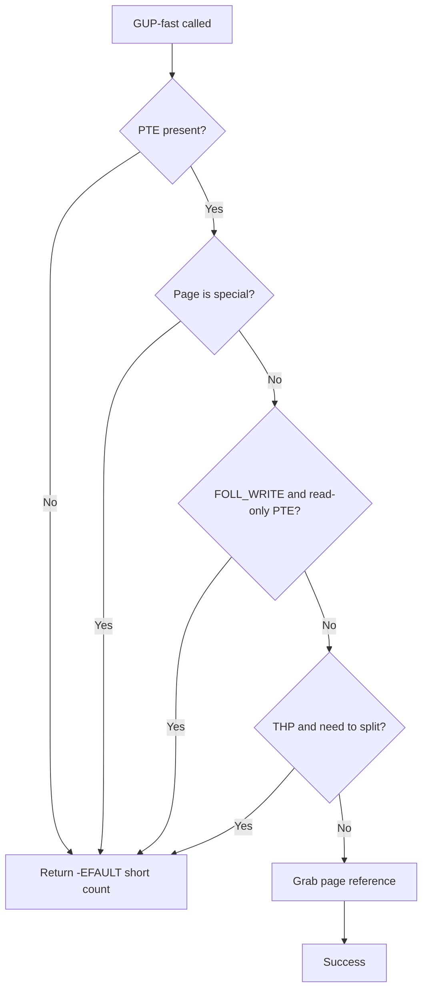
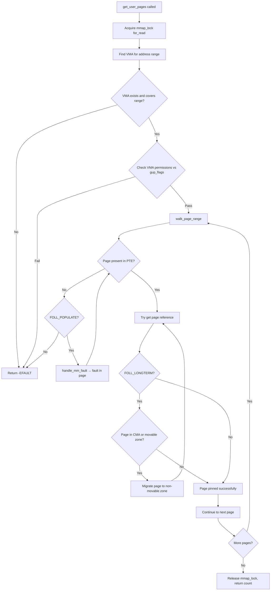
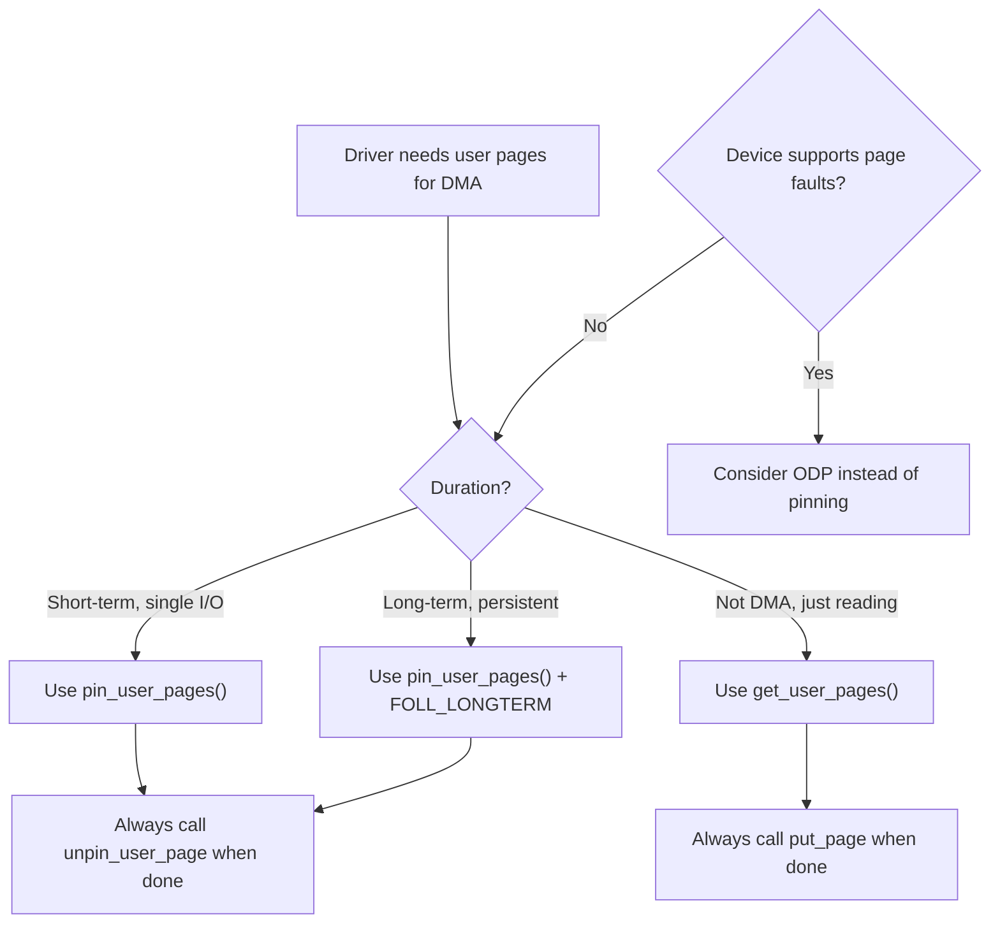
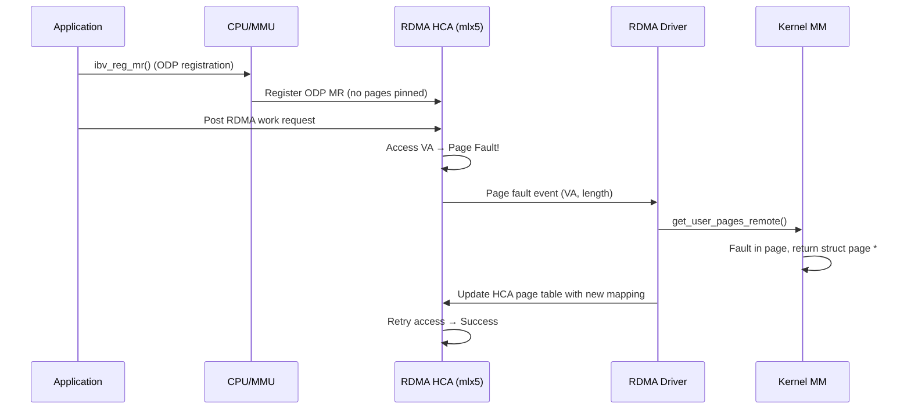

# GUP — get_user_pages

`get_user_pages()` (GUP) is the kernel interface that pins user-space memory
into kernel address space so that devices, RDMA, or other subsystems can
perform DMA directly on those pages.  It is one of the most performance- and
security-sensitive paths in the Linux memory subsystem.

---

## 1. Why Pinning Is Needed

Certain hardware — NICs, GPUs, NVMe controllers, RDMA HCAs — performs DMA
from/to physical addresses.  If the kernel allowed those addresses to be
swapped or migrated while DMA is in flight, data corruption or IOMMU faults
would follow.  GUP solves this by elevating page reference counts so the
page reclaim and compaction paths leave the pages alone.

### 1.1 The Pinning Problem Space

When a device performs DMA, it operates on **physical addresses** (or IOVA
addresses via the IOMMU).  The CPU's page tables can be updated at any time
by the kernel — a page can be swapped out, migrated to another NUMA node,
or reclaimed entirely.  If the physical page backing a DMA buffer changes
while a DMA transfer is in progress, the device writes to the wrong page,
corrupting unrelated memory or triggering IOMMU faults.

GUP prevents this by taking a **reference** on the page (incrementing
`page->_refcount`), which tells the kernel's page reclaim, migration, and
compaction subsystems: "this page is in use — do not move or free it."

### 1.2 Consumers of GUP

| Subsystem | Use Case | Duration |
|-----------|----------|----------|
| **RDMA** (mlx5, efa, bnxt_re) | Memory registration for remote DMA | Long-term (seconds to hours) |
| **VFIO** | Device passthrough to virtual machines | Long-term |
| **Direct I/O** | `O_DIRECT` read/write buffers | Short-term (single I/O) |
| **GPU drivers** (NVIDIA, AMDGPU) | GPU command buffer and texture memory | Medium-term |
| **NVMe** | Controller memory buffer (CMB) mappings | Medium-term |
| **BPF** | BPF maps accessed from network drivers | Long-term |
| **vhost** | Virtio guest memory for host-side processing | Long-term |

---

## 2. Core API Variants

| Function | Direction | Returns | Lock Requirement |
|---|---|---|---|
| `get_user_pages()` | Read/write | Array of `struct page *` | Takes `mmap_lock` (read or write) |
| `get_user_pages_remote()` | Remote process | Same, with `mm_struct` arg | Takes `mmap_lock` on target mm |
| `get_user_pages_fast()` (GUP-fast) | Lockless fast-path | Uses RCU, no `mmap_lock` | RCU read lock only |
| `pin_user_pages()` | DMA pinning | Elevated refcount, special accounting | Takes `mmap_lock` |
| `pin_user_pages_fast()` | DMA pinning, fast path | Same as above, lockless | RCU read lock only |
| `pin_user_pages_remote()` | DMA pinning, remote process | Same as `pin_user_pages` | Takes `mmap_lock` on target mm |

### 2.1 `get_user_pages()` vs `pin_user_pages()`

`pin_user_pages()` was introduced in 5.6 to distinguish DMA pinning from
ordinary "I want to read this page" usage.  It uses `FOLL_PIN` and applies
extra checks so that compound pages and huge pages are handled correctly.

The fundamental distinction:

- **`get_user_pages()`**: "I need to read/write this page's contents briefly."
  Takes a normal reference (`page_ref_inc`). Used for direct I/O, process
  introspection (`process_vm_readv`), etc.

- **`pin_user_pages()`**: "I need this page to stay pinned for DMA hardware."
  Takes a **DMA pin** reference using `GUP_PIN_COUNTING_BIAS`. Used for RDMA,
  VFIO, GPU drivers, etc.

Mixing these up causes real bugs: if a driver uses `get_user_pages()` for DMA
buffers, the kernel's migration code may move the page while DMA is in flight,
because a normal reference doesn't prevent migration.

### 2.2 Function Signatures

```c
/* Classic GUP — returns pages for the calling process */
long get_user_pages(unsigned long start, unsigned long nr_pages,
                    unsigned int gup_flags, struct page **pages,
                    struct vm_area_struct **vmas);

/* GUP for a remote process (e.g., ptrace, process_vm_readv) */
long get_user_pages_remote(struct mm_struct *mm,
                           unsigned long start, unsigned long nr_pages,
                           unsigned int gup_flags, struct page **pages,
                           struct vm_area_struct **vmas,
                           int *locked);

/* DMA pinning (preferred for device drivers) */
long pin_user_pages(unsigned long start, unsigned long nr_pages,
                    unsigned int gup_flags, struct page **pages,
                    struct vm_area_struct **vmas);

/* Fast (lockless) variants */
long get_user_pages_fast(unsigned long start, unsigned long nr_pages,
                         unsigned int gup_flags, struct page **pages);
long pin_user_pages_fast(unsigned long start, unsigned long nr_pages,
                         unsigned int gup_flags, struct page **pages);
```

---

## 3. Flags

### 3.1 `FOLL_LONGTERM`

Pins that may last for seconds or longer (RDMA registrations, persistent
mappings) **must** set `FOLL_LONGTERM`.  This flag tells GUP to:

* Avoid pinning pages that are on the CMA (Contiguous Memory Allocator)
  region — CMA needs movable pages for huge allocations.
* Trigger migration of movable pages to non-movable zones before pinning.
* Fail rather than silently corrupting memory compaction.

Introduced in commit `64e3ab2` (5.2) and later backported.

### 3.2 Other Common Flags

| Flag | Meaning |
|---|---|
| `FOLL_WRITE` | Require write access (COW if needed) |
| `FOLL_FORCE` | Force access even to PROT_NONE (debuggers) |
| `FOLL_NOWAIT` | Don't block on IO |
| `FOLL_FAST_ONLY` | Only try GUP-fast, fall back to error |
| `FOLL_PCI_P2PDMA` | Allow peer-to-peer PCI BAR pages |
| `FOLL_POPULATE` | Populate (fault in) the pages |
| `FOLL_NOFAULT` | Don't trigger page faults; return error if not present |
| `FOLL_ANON` | Only follow anonymous mappings |
| `FOLL_NUMA` | Follow NUMA hinting faults |
| `FOLL_DUMP` | For core dumps — access pages even if not readable |

### 3.3 Flag Interaction Matrix

| Flag Combination | Behavior |
|-----------------|----------|
| `FOLL_PIN` alone | Short-term DMA pin (Direct I/O) |
| `FOLL_PIN \| FOLL_LONGTERM` | Long-term DMA pin (RDMA) |
| `FOLL_GET` alone | Normal reference for kernel use |
| `FOLL_GET \| FOLL_LONGTERM` | Long-term kernel reference (deprecated — use `FOLL_PIN`) |
| `FOLL_WRITE \| FOLL_FORCE` | Write to PROT_NONE pages (dangerous) |

---

## 4. GUP-Fast Path

`get_user_pages_fast()` avoids taking `mmap_lock` entirely.  It walks the
page table under RCU:

```
rcu_read_lock()
  walk page table
  if PTE is present and not special → grab ref
rcu_read_unlock()
```

If the fast path fails (page not present, THP split needed, etc.) it returns
a short count and the caller decides whether to fall back to the slow path
with `mmap_lock`.

### 4.1 Performance Characteristics

GUP-fast is **much** faster — often 5-10× — because `mmap_lock` is a global
bottleneck on machines with hundreds of threads.  However, it cannot handle:

* Pages that require fault-in (`FOLL_POPULATE`)
* Pages that need COW (`FOLL_WRITE` on read-only mapping)
* Pages that need migration (`FOLL_LONGTERM` on movable pages)

### 4.2 GUP-Fast Internal Walk

The fast-path walk uses `internal_get_user_pages_fast()`:

```c
static int internal_get_user_pages_fast(unsigned long start,
                                         unsigned long nr_pages,
                                         unsigned int gup_flags,
                                         struct page **pages)
{
    int ret = -EFAULT;
    unsigned long addr = start;

    rcu_read_lock();
    /*
     * The fast path walks the page tables without mmap_lock.
     * It uses pXd_offset_lockless() variants that read page
     * table entries with READ_ONCE() to avoid torn reads.
     */
    for (addr = start; addr < start + nr_pages * PAGE_SIZE; ) {
        pgd_t *pgd = pgd_offset(current->mm, addr);
        /* Walk pgd → p4d → pud → pmd → pte */
        /* ... */
        /* If any level is not present or requires splitting, fail fast */
    }
    rcu_read_unlock();
    return ret;
}
```

### 4.3 GUP-Fast Limitations



---

## 5. GUP Slow Path

When GUP-fast fails or is not applicable, the slow path is used.  The slow
path takes `mmap_lock` and can handle fault-in, COW, page migration, and
other complex cases.

### 5.1 Slow Path Flow



### 5.2 Key Internal Functions

| Function | Role |
|----------|------|
| `__get_user_pages()` | Main slow-path loop over VMA ranges |
| `check_vma_flags()` | Validate VMA permissions against `gup_flags` |
| `follow_page_mask()` | Walk page table and try to get a reference |
| `faultin_page()` | Trigger a page fault to bring the page in |
| `follow_trans_huge_pmd()` | Handle transparent huge pages at PMD level |
| `try_grab_folio()` | Take a reference on a folio (modern page representation) |
| `check_and_migrate_movable_pages()` | Migrate movable pages for `FOLL_LONGTERM` |

---

## 6. DMA Pinning and `FOLL_PIN`

When hardware performs DMA, ordinary page references are not enough.  The
`pin_user_pages()` family sets `FOLL_PIN`, which:

1. Uses `folio_maybe_dma_pinned()` to track that this page is pinned for DMA.
2. Prevents `page_migrate_one()` from migrating the page while pinned.
3. Triggers special accounting in the page-type system so that CMA and
   memory-failure paths know the page cannot be moved.

### 6.1 GUP_PIN_COUNTING_BIAS

The `FOLL_PIN` mechanism uses `GUP_PIN_COUNTING_BIAS` (1024) to distinguish
DMA pin references from normal references.  Instead of a separate counter,
the kernel adds 1024 to `page->_refcount` for each DMA pin.  This provides
"fuzzy" tracking: the upper bits of `_refcount` approximate the pin count.

```c
#define GUP_PIN_COUNTING_BIAS  1024

/* In try_grab_folio() when FOLL_PIN is set: */
folio_ref_add(folio, GUP_PIN_COUNTING_BIAS);
```

For large folios (huge pages), a separate `pincount` field in `struct folio`
is used instead, avoiding the counting bias limitations:

```c
/* For large folios, use the dedicated pincount */
atomic_add(1, &folio->_pincount);
```

### 6.2 `folio_maybe_dma_pinned()`

This function checks whether a folio is likely DMA-pinned:

```c
bool folio_maybe_dma_pinned(struct folio *folio)
{
    long count = folio_ref_count(folio);
    long pages = folio_nr_pages(folio);

    /*
     * If refcount is at least GUP_PIN_COUNTING_BIAS above the
     * expected "in-use" count, the page is likely DMA-pinned.
     */
    return count >= pages + GUP_PIN_COUNTING_BIAS;
}
```

This is a **conservative** estimate — false positives are acceptable (the
kernel may think a page is pinned when it's not), but false negatives are
not (migration of a DMA-pinned page would corrupt data).

### 6.3 Unpinning

Every `pin_user_pages()` call **must** be balanced with
`unpin_user_page()` or `unpin_user_pages()`.  Failing to unpin leaks the
page permanently — it can never be reclaimed or migrated.

```c
unpin_user_page(page);               /* single */
unpin_user_pages(pages, npages);     /* batch */
```

The unpin functions subtract `GUP_PIN_COUNTING_BIAS` (or decrement
`_pincount` for large folios).

### 6.4 Pinning Decision Flowchart



---

## 7. ODP — On-Demand Paging

Traditional GUP pins pages before DMA starts.  **ODP** (used by mlx5 RDMA
drivers) reverses this: pages are *not* pinned up front.  Instead, when the
HCA accesses an unmapped address, a page-fault is delivered to the driver,
which then calls `get_user_pages()` just-in-time.

### 7.1 How ODP Works



### 7.2 Advantages

* No long-term pins → no memory fragmentation.
* Works with `madvise(MADV_DONTNEED)` and `mmap` remapping.
* Lower memory overhead for large registrations.
* Pages can be reclaimed normally by the kernel.

### 7.3 Disadvantages

* Page faults add latency (typically 1-10 µs each).
* Requires HCA hardware support (mlx5, efa).
* More complex driver code.
* Throughput penalty under heavy random access patterns.

### 7.4 Implicit ODP

In mlx5, **implicit ODP** covers the entire process address space with a
single registration.  No explicit `ibv_reg_mr()` call is needed; the HCA
faults on any address.  This is useful for applications that use many
scattered buffers.

```c
/* Implicit ODP registration (userspace) */
struct ibv_mr *mr = ibv_reg_mr(pd, NULL, SIZE_MAX,
                                IBV_ACCESS_LOCAL_WRITE |
                                IBV_ACCESS_REMOTE_READ |
                                IBV_ACCESS_ON_DEMAND);
```

### 7.5 ODP and MMU Notifiers

ODP relies on **MMU notifiers** to stay synchronized with CPU page table
changes.  When the kernel unmaps or migrates a page (e.g., due to reclaim),
it calls the RDMA driver's `invalidate_range()` callback, which removes the
mapping from the HCA's page table.  This prevents the HCA from accessing a
page that has been freed or moved.

```c
/* MMU notifier callback in mlx5 */
static const struct mmu_notifier_ops mlx5_mn_ops = {
    .invalidate_range = mlx5_mn_invalidate_range,
};
```

---

## 8. Complications and Pitfalls

### 8.1 Long-Term Pins Break Compaction

A page pinned with `FOLL_LONGTERM` cannot be migrated.  If enough CMA or
movable-zone pages are pinned, compaction fails, and huge page allocations
start failing — even though free memory exists.  This was a major problem
before `FOLL_LONGTERM` enforcement (pre-5.2 kernels).

**Workaround in modern kernels**: GUP with `FOLL_LONGTERM` explicitly
migrates pages out of CMA regions before pinning them, ensuring CMA remains
usable for other allocations.

### 8.2 DMA to File-Backed Pages

Pinning file-backed (page-cache) pages for DMA is dangerous:

* The filesystem may truncate the file, freeing the page.
* Writeback may write stale data if the DMA writes after writeback starts.
* Some filesystems (tmpfs) don't support `FOLL_LONGTERM` at all.
* The page can be removed from the page cache (e.g., by `fadvise(DONTNEED)`).

Best practice: only pin anonymous pages or explicitly hugetlbfs pages.

### 8.3 Security: `FOLL_FORCE` and `ptrace`

`FOLL_FORCE` lets a process access memory even if the VMA is PROT_NONE.
This is used by debuggers and `process_vm_readv()`.  If an attacker can
trigger a GUP with `FOLL_FORCE` on another process, they can read secret
memory.  Mitigations include SELinux checks and `ptrace_may_access()`.

### 8.4 GUP and THP Split

When GUP needs to pin a single 4 KiB page within a 2 MiB transparent huge
page (THP), it must **split** the THP first.  This is expensive and can
cause latency spikes:

```c
/* In follow_trans_huge_pmd() */
if (flags & FOLL_SPLIT) {
    split_huge_pmd(vma, pmd, addr);
    /* Now retry with regular PTE */
}
```

### 8.5 GUP and DAX

DAX (Direct Access) pages are physically persistent memory mapped directly
into userspace.  GUP on DAX pages works differently:

* DAX pages are not in the page cache — they have no `address_space`.
* `FOLL_LONGTERM` on DAX pages was historically problematic but is now
  supported with special handling.
* DAX pages use `pgmap` (struct dev_pagemap) for lifetime management.

---

## 9. GUP and folios

Starting in Linux 5.16+, the kernel is transitioning from `struct page` to
`struct folio` as the primary unit of memory management.  GUP APIs are
evolving accordingly:

| Old API | New API (preferred) |
|---------|-------------------|
| `get_user_pages()` | Still used; returns `struct page *` |
| `try_grab_page()` | `try_grab_folio()` |
| `put_page()` | `folio_put()` |
| `page_maybe_dma_pinned()` | `folio_maybe_dma_pinned()` |

The folio transition affects GUP because folios can represent compound pages
(huge pages) as a single unit, simplifying reference counting.

---

## 10. Recent Developments (6.x Kernels)

| Version | Change |
|---|---|
| 5.6 | `pin_user_pages()` / `FOLL_PIN` introduced (John Hubbard) |
| 5.13 | GUP-fast supports more PTE configurations |
| 5.16 | folio transition begins affecting GUP paths |
| 6.1 | Batched GUP (`pin_user_pages_fast` with large batches) |
| 6.3 | `folio_maybe_dma_pinned()` accuracy improvements |
| 6.5 | GUP-fast supports PUD-level mappings (1 GiB pages) |
| 6.8 | Unification of `FOLL_PIN` and `FOLL_GET` accounting |
| 6.10 | GUP-fast uses RCU-based page table walk improvements |
| 6.12 | Large folio pinning optimizations for RDMA workloads |

---

## 11. Debugging GUP Issues

### 11.1 vmstat Counters

* **`/proc/vmstat`** — `nr_foll_pin_acquired` / `nr_foll_pin_released` track
  pin/unpin balance.  If these diverge, there is a leak.

```bash
# Check pin/unpin balance
grep nr_foll_pin /proc/vmstat
# nr_foll_pin_acquired 12345
# nr_foll_pin_released 12345   ← should match!
```

### 11.2 Kernel Debugging Options

* **`page_ext` debug** — `CONFIG_DEBUG_PAGE_REF` adds refcount tracking.
* **lockdep** — `mmap_lock` ordering violations show up here.
* **KASAN** — use-after-free of page structs.
* **`CONFIG_DEBUG_VM`** — enables additional VM sanity checks in GUP paths.

### 11.3 Tracing GUP

```bash
# Enable GUP tracepoints (if available)
echo 1 > /sys/kernel/debug/tracing/events/mm/mm_page_alloc/enable

# Or use ftrace function tracing
echo get_user_pages > /sys/kernel/debug/tracing/set_ftrace_filter
echo function > /sys/kernel/debug/tracing/current_tracer
echo 1 > /sys/kernel/debug/tracing/tracing_on
```

### 11.4 Common Bug Patterns

| Symptom | Likely Cause | Debug Approach |
|---------|-------------|----------------|
| Memory leak (OOM over time) | Missing `unpin_user_page()` | Check `nr_foll_pin` counters |
| THP allocation failures | Too many `FOLL_LONGTERM` pins | Check CMA zone usage |
| DMA data corruption | Used `get_user_pages()` instead of `pin_user_pages()` | Audit driver GUP calls |
| Latency spikes in RDMA | THP splits during GUP | Pre-split huge pages |
| IOMMU faults | Page reclaimed despite pin | Check `folio_maybe_dma_pinned()` |

---

## 12. GUP Integration with Other Subsystems

### 12.1 CMA (Contiguous Memory Allocator)

GUP with `FOLL_LONGTERM` avoids pinning CMA pages.  The logic in
`check_and_migrate_movable_pages()` scans the page list, identifies pages
in CMA regions, and migrates them to non-CMA memory before completing the
pin.

### 12.2 NUMA Balancing

GUP interacts with NUMA balancing: when a process accesses memory on a
remote NUMA node, the NUMA balancer may migrate the page.  GUP pins prevent
this migration.  For RDMA workloads, pinning pages on the correct NUMA node
upfront is important for performance.

### 12.3 Memory Cgroups

GUP-pinned pages are charged to the memory cgroup of the process that
requested the pin.  This means long-term RDMA pins can push a cgroup over
its memory limit, causing unrelated allocations to fail or trigger OOM.

---

## 13. Source Files

| File | Contents |
|------|----------|
| `mm/gup.c` | Main GUP implementation (slow path, fast path, pin logic) |
| `mm/gup_internal.h` | Internal GUP declarations |
| `include/linux/mm_types.h` | `struct folio`, `struct page` definitions |
| `include/linux/mm.h` | GUP API declarations |
| `include/linux/page_ref.h` | Page reference counting helpers |
| `Documentation/core-api/pin_user_pages.rst` | Official GUP/pin documentation |
| `Documentation/mm/gup.rst` | GUP internals documentation |

---

## 14. Further Reading

* **LWN: [The long-term GUP saga](https://lwn.net/Articles/807808/)** —
  History of FOLL_LONGTERM enforcement
* **LWN: [Pin user pages for DMA](https://lwn.net/Articles/812329/)** —
  pin_user_pages() introduction
* **Documentation: `Documentation/core-api/pin_user_pages.rst`** —
  Official kernel documentation for pin_user_pages
* **Documentation: `Documentation/mm/gup.rst`** —
  GUP internals and design
* **Jason Gunthorpe's ODP talk, LPC 2019** — ODP design and mlx5
  implementation
* **John Hubbard's GUP cleanup series (2019-2020)** — The cleanup that led
  to pin_user_pages()
* **Oracle Blogs: [Pinning User-space Pages in the Linux Kernel](https://blogs.oracle.com/linux/pinning-userspace-pages-in-the-linux-kernel)** —
  Practical GUP overview (2024)
* **Lorenzo Stoakes: [The Linux Memory Manager](https://www.scribd.com/document/967620894/The-Linux-Memory-Manager-Lorenzo-Stoakes)** —
  Comprehensive MM overview including GUP (2025)

---

## 15. Cross-References

* [Memory Management Overview](./index.md) — page allocator, zones, CMA
* [Huge Pages](./hugepages.md) — THP and hugetlb interactions with GUP
* [IOMMU](../drivers/iommu.md) — DMA address translation
* [RDMA](../networking/rdma.md) — primary consumer of GUP
* [Page Reclaim](./reclaim.md) — how pinned pages affect reclaim
* [Memory Compaction](./compaction.md) — compaction and FOLL_LONGTERM
* [Page Types](./page-types.md) — page classification and GUP
* [Idle Page Tracking](./idle-page-tracking.md) — idle tracking and pinned pages
* [zpool](./zpool.md) — compressed memory and DMA interactions
