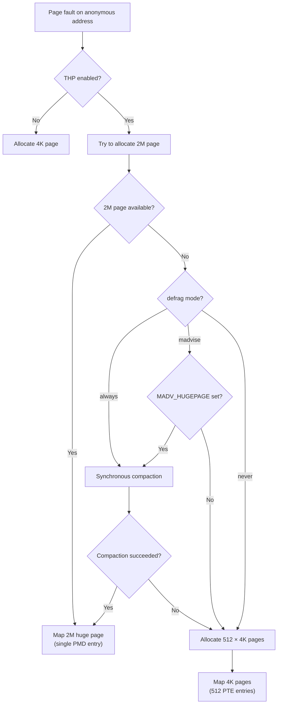

# Huge Pages

## Introduction

Standard pages on x86_64 are 4 KiB, which means a process using 1 GiB of memory requires 262,144 page table entries and an equal number of TLB entries to cover it. Since the TLB is a very small cache (typically hundreds of entries), large-memory workloads suffer frequent TLB misses, each costing ~100 cycles for a page table walk.

**Huge pages** solve this by using larger page sizes — 2 MiB (PMD-level) or 1 GiB (PUD-level) — reducing TLB pressure, page table overhead, and page fault frequency. Linux provides two mechanisms:

1. **HugeTLB**: Static huge pages allocated at boot or runtime, managed via `hugetlbfs`.
2. **Transparent Huge Pages (THP)**: Automatic huge page promotion/demotion managed by the kernel.

## HugeTLB (Static Huge Pages)

### Page Sizes

| Size | Level | Page Table Savings | TLB Coverage (vs 4K) |
|------|-------|-------------------|---------------------|
| 2 MiB | PMD | 512× fewer PTEs | 512× more memory per TLB entry |
| 1 GiB | PUD | 262,144× fewer PTEs/PMDs | 262,144× more memory per TLB entry |

### Boot-Time Allocation

Huge pages can be allocated at boot time via kernel command line:

```bash
# Reserve 1024 × 2MiB huge pages (2 GiB total) at boot
hugepages=1024

# Reserve 4 × 1GiB huge pages
hugepagesz=1G hugepages=4

# Multiple sizes
hugepagesz=2M hugepages=512 hugepagesz=1G hugepages=2
```

### Runtime Allocation

```bash
# Allocate 2 MiB huge pages at runtime
$ echo 1024 > /proc/sys/vm/nr_hugepages

# Allocate 1 GiB huge pages
$ echo 4 > /sys/kernel/mm/hugepages/hugepages-1048576kB/nr_hugepages

# View huge page status
$ cat /proc/meminfo | grep -i huge
HugePages_Total:    1024
HugePages_Free:      512
HugePages_Rsvd:      256
HugePages_Surp:        0
Hugepagesize:       2048 kB

# Per-node huge page allocation
$ echo 512 > /sys/devices/system/node/node0/hugepages/hugepages-2048kB/nr_hugepages
$ echo 512 > /sys/devices/system/node/node1/hugepages/hugepages-2048kB/nr_hugepages
```

### hugetlbfs

HugeTLB pages are accessed through the `hugetlbfs` virtual filesystem:

```bash
# Mount hugetlbfs
$ sudo mount -t hugetlbfs none /mnt/huge

# Or with specific options
$ sudo mount -t hugetlbfs \
    -o pagesize=2M,size=1G,min_size=512M,mode=1770 \
    none /mnt/huge

# Verify mount
$ mount | grep huge
none /mnt/huge hugetlbfs rw,relatime,pagesize=2M,size=1G 0 0
```

### Using HugeTLB from User Space

#### mmap with MAP_HUGETLB

```c
#include <sys/mman.h>
#include <stdio.h>
#include <string.h>

int main(void)
{
    size_t size = 2 * 1024 * 1024;  /* 2 MiB */

    /* Map with 2 MiB huge pages */
    void *addr = mmap(NULL, size,
                      PROT_READ | PROT_WRITE,
                      MAP_PRIVATE | MAP_ANONYMOUS | MAP_HUGETLB,
                      -1, 0);
    if (addr == MAP_FAILED) {
        perror("mmap");
        return 1;
    }

    /* Use the memory — only 1 page fault for 2 MiB */
    memset(addr, 0, size);

    printf("Mapped at %p, size %zu\n", addr, size);

    /* Check with /proc/self/smaps */
    /* Shows "AnonHugePages: 2048 kB" */

    munmap(addr, size);
    return 0;
}
```

#### 1 GiB Huge Pages via mmap

```c
/* Request 1 GiB huge pages */
void *addr = mmap(NULL, 1UL << 30,  /* 1 GiB */
                  PROT_READ | PROT_WRITE,
                  MAP_PRIVATE | MAP_ANONYMOUS | MAP_HUGETLB |
                  (30 << MAP_HUGE_SHIFT),  /* log2(1GiB) = 30 */
                  -1, 0);
```

#### Using hugetlbfs Files

```c
#include <fcntl.h>
#include <sys/mman.h>
#include <unistd.h>

int main(void)
{
    /* Create a file on hugetlbfs */
    int fd = open("/mnt/huge/myfile", O_CREAT | O_RDWR, 0755);
    if (fd < 0) {
        perror("open");
        return 1;
    }

    /* Set file size */
    ftruncate(fd, 2 * 1024 * 1024);

    /* Map the file */
    void *addr = mmap(NULL, 2 * 1024 * 1024,
                      PROT_READ | PROT_WRITE,
                      MAP_SHARED, fd, 0);

    /* Use the huge-page-backed memory */
    memset(addr, 0xAA, 2 * 1024 * 1024);

    munmap(addr, 2 * 1024 * 1024);
    close(fd);
    unlink("/mnt/huge/myfile");
    return 0;
}
```

### HugeTLB Sysfs Interface

```bash
# Available huge page sizes
$ ls /sys/kernel/mm/hugepages/
hugepages-1048576kB  hugepages-2048kB

# 2 MiB huge pages
$ cat /sys/kernel/mm/hugepages/hugepages-2048kB/nr_hugepages
1024
$ cat /sys/kernel/mm/hugepages/hugepages-2048kB/free_hugepages
512
$ cat /sys/kernel/mm/hugepages/hugepages-2048kB/resv_hugepages
256
$ cat /sys/kernel/mm/hugepages/hugepages-2048kB/surplus_hugepages
0

# 1 GiB huge pages
$ cat /sys/kernel/mm/hugepages/hugepages-1048576kB/nr_hugepages
4
```

### HugeTLB Statistics

```bash
$ cat /proc/vmstat | grep thp
nr_anon_transparent_hugepages 1234
thp_fault_alloc 5678
thp_fault_fallback 123
thp_collapse_alloc 456
thp_collapse_alloc_failed 78
thp_split_page 901
thp_split_page_failed 23
thp_zero_page_alloc 45
thp_zero_page_alloc_failed 0

# Per-NUMA-node stats
$ numastat -m | grep Huge
HugePages_Total        1024
HugePages_Free          512
```

## Transparent Huge Pages (THP)

### What THP Does

THP automatically uses 2 MiB huge pages for anonymous memory without requiring application changes. The kernel:

1. **Allocates** 2 MiB pages when possible during page faults.
2. **Promotes** groups of 512 × 4K pages into a single 2 MiB huge page.
3. **Splits** huge pages back into 4K pages when needed (e.g., memory reclaim, COW).

### THP Modes

```bash
$ cat /sys/kernel/mm/transparent_hugepage/enabled
always [madvise] never

# Set THP mode
$ echo always > /sys/kernel/mm/transparent_hugepage/enabled
$ echo madvise > /sys/kernel/mm/transparent_hugepage/enabled
$ echo never > /sys/kernel/mm/transparent_hugepage/enabled
```

| Mode | Behavior |
|------|----------|
| **always** | THP enabled for all anonymous mappings (default on most distros) |
| **madvise** | THP only for mappings marked with `madvise(MADV_HUGEPAGE)` |
| **never** | THP completely disabled |

### THP Defer Mode

```bash
$ cat /sys/kernel/mm/transparent_hugepage/defer
[always] madvise never

# "always" mode: defer THP allocation to kswapd (reduce latency)
# "madvise" mode: only defer for MADV_HUGEPAGE regions
# "never" mode: allocate THP immediately on page fault
```

### THP Defrag Mode

Controls what happens when a huge page can't be immediately allocated:

```bash
$ cat /sys/kernel/mm/transparent_hugepage/defrag
always defer defer+madvise [madvise] never
```

| Mode | Behavior |
|------|----------|
| **always** | Synchronous compaction and reclaim (highest latency, best allocation) |
| **defer** | Background compaction (lower latency) |
| **defer+madvise** | Background for most, synchronous only for `MADV_HUGEPAGE` |
| **madvise** | Synchronous only for `MADV_HUGEPAGE` regions |
| **never** | Don't compact or reclaim for THP |

### Using THP with madvise

```c
#include <sys/mman.h>

void *addr = mmap(NULL, size, PROT_READ | PROT_WRITE,
                  MAP_PRIVATE | MAP_ANONYMOUS, -1, 0);

/* Tell kernel to use huge pages for this region */
madvise(addr, size, MADV_HUGEPAGE);

/* Use the memory */
memset(addr, 0, size);

/* Or: use regular pages for this region */
madvise(addr, size, MADV_NOHUGEPAGE);
```

### THP Shmem (tmpfs)

THP can also be used for shared memory (tmpfs/shmem):

```bash
$ cat /sys/kernel/mm/transparent_hugepage/shmem_enabled
always within_size advise [never] deny force
```

| Mode | Behavior |
|------|----------|
| **always** | Use huge pages for all shmem/tmpfs |
| **within_size** | Only if the region is naturally huge-page-aligned |
| **advise** | Only when `MADV_HUGEPAGE` is set |
| **never** | Disable THP for shmem |
| **force** | Force huge pages even when not appropriate (testing) |

## THP Internals

### How THP Allocation Works



### THP Split

A huge page may be split into 512 regular pages when:

- Only part of the huge page is actively used.
- Memory compaction needs to move individual pages.
- The process calls `madvise(MADV_NOHUGEPAGE)`.
- NUMA balancing needs to migrate individual pages.
- Memory pressure requires reclaiming part of the huge page.

```c
/* mm/huge_memory.c (simplified) */
int split_huge_page_to_list(struct page *page, struct list_head *list)
{
    struct folio *folio = page_folio(page);
    struct anon_vma *anon_vma;
    int ret;

    /* Only split compound pages */
    if (!PageCompound(page))
        return 0;

    anon_vma = folio->mapping;
    spin_lock(&anon_vma->root->rwsem);

    /* Split the compound page into 512 base pages */
    /* Update all page tables that map this huge page */
    /* ... */

    ret = __split_huge_page(folio, list);

    spin_unlock(&anon_vma->root->rwsem);
    return ret;
}
```

### THP Collapse (khugepaged)

The `khugepaged` kernel thread periodically scans for regions that could benefit from huge pages and collapses them:

```bash
# khugepaged settings
$ cat /sys/kernel/mm/transparent_hugepage/khugepaged/scan_sleep_millisecs
10000    # Sleep between scans (ms)

$ cat /sys/kernel/mm/transparent_hugepage/khugepaged/pages_to_scan
4096     # Pages to scan per cycle

$ cat /sys/kernel/mm/transparent_hugepage/khugepaged/max_ptes_none
511      # Max PTEs that can be none (empty) and still collapse

$ cat /sys/kernel/mm/transparent_hugepage/khugepaged/max_ptes_swap
64       # Max PTEs that can be swapped and still collapse

# Disable khugepaged
$ echo 0 > /sys/kernel/mm/transparent_hugepage/khugepaged/scan_sleep_millisecs
```

### How Collapse Works

```c
/* mm/khugepaged.c (simplified) */
static int khugepaged_scan_pmd(struct mm_struct *mm,
                                struct vm_area_struct *vma,
                                unsigned long address)
{
    pmd_t *pmd;
    pte_t *pte, *_pte;
    struct page *page;
    int none_pte = 0, swap_pte = 0;

    pmd = pmd_offset(pud_offset(p4d_offset(pgd_offset(mm, address),
                                            address),
                                 address),
                     address);

    /* Check if already a huge page */
    if (pmd_trans_huge(*pmd))
        return SCAN_PMD_MAPPED;

    /* Scan all 512 PTEs */
    pte = pte_offset_map(pmd, address);
    for (_pte = pte; _pte < pte + PTRS_PER_PTE; _pte++) {
        pte_t pteval = *_pte;
        if (pte_none(pteval)) {
            none_pte++;
            continue;
        }
        page = vm_normal_page(vma, address, pteval);
        if (!page)
            return SCAN_PAGE_NULL;
    }

    /* If too many empty PTEs, skip */
    if (none_pte > khugepaged_max_ptes_none)
        return SCAN_EXCEED_NONE_PTE;

    /* Collapse: allocate huge page, copy, replace PTEs with PMD */
    return collapse_huge_page(mm, address, pmd);
}
```

## NUMA Balancing and Huge Pages

### Automatic NUMA Balancing

The kernel's NUMA balancing system can migrate huge pages between NUMA nodes:

```bash
$ cat /proc/sys/kernel/numa_balancing
1    # Enable automatic NUMA balancing

$ cat /proc/sys/kernel/numa_balancing_scan_delay_ms
1000

$ cat /proc/sys/kernel/numa_balancing_scan_period_min_ms
1000

$ cat /proc/sys/kernel/numa_balancing_scan_period_max_ms
60000

$ cat /proc/sys/kernel/numa_balancing_scan_size_mb
256
```

When NUMA balancing detects that a huge page is being accessed from a remote node, it may:
1. Migrate the huge page to the local node.
2. Split the huge page and migrate individual pages.

## Monitoring Huge Pages

### /proc/meminfo

```bash
$ cat /proc/meminfo | grep -i huge
AnonHugePages:    2097152 kB    # THP in use (anonymous)
ShmemHugePages:        0 kB    # THP in shmem
ShmemPmdMapped:        0 kB    # Shmem mapped as huge pages
FileHugePages:         0 kB    # THP in page cache (newer kernels)
FilePmdMapped:         0 kB    # Page cache mapped as huge
HugePages_Total:    1024       # HugeTLB total
HugePages_Free:      512       # HugeTLB free
HugePages_Rsvd:      256       # HugeTLB reserved
HugePages_Surp:        0       # HugeTLB surplus
Hugepagesize:       2048 kB    # Default huge page size
```

### /proc/vmstat

```bash
$ cat /proc/vmstat | grep -E "thp|huge"
thp_fault_alloc       5678     # THP allocated on fault
thp_fault_fallback    123      # THP fault fell back to 4K
thp_collapse_alloc    456      # THP collapsed by khugepaged
thp_collapse_alloc_failed 78   # Collapsed failed
thp_split_page        901      # THP split into 4K pages
thp_split_page_failed 23       # Split failed
thp_zero_page_alloc   45       # THP zero page allocated
nr_anon_transparent_hugepages 1234  # Current THP count
```

### Per-Process THP Usage

```bash
# Check if a process uses THP
$ cat /proc/<pid>/smaps | grep AnonHugePages | head -5
AnonHugePages:   204800 kB
AnonHugePages:    20480 kB
AnonHugePages:     2048 kB

# Total THP for a process
$ cat /proc/<pid>/smaps_rollup | grep AnonHugePages
AnonHugePages:   227328 kB
```

## Huge Pages and Performance

### TLB Coverage Comparison

| Page Size | TLB Entries (typical) | Memory Covered |
|-----------|----------------------|----------------|
| 4 KiB | 64 (L1 dTLB) | 256 KiB |
| 2 MiB (huge) | 32 (L1 dTLB) | 64 MiB |
| 1 GiB (huge) | 4 (L1 dTLB) | 4 GiB |

A database using 64 GiB of memory:
- With 4K pages: 16M pages → TLB covers only 0.0004% at a time
- With 2M huge pages: 32K pages → TLB covers 0.01% at a time (25× better)
- With 1G huge pages: 64 pages → TLB covers all of it

### Benchmarking THP

```c
/* Benchmark: THP on vs off */
#include <stdio.h>
#include <stdlib.h>
#include <string.h>
#include <sys/mman.h>
#include <time.h>

#define SIZE (512UL * 1024 * 1024)  /* 512 MiB */
#define ITERATIONS 1000000

int main(int argc, char *argv[])
{
    int use_thp = (argc > 1 && strcmp(argv[1], "--thp") == 0);
    struct timespec start, end;

    void *buf = mmap(NULL, SIZE, PROT_READ | PROT_WRITE,
                     MAP_PRIVATE | MAP_ANONYMOUS, -1, 0);

    if (use_thp)
        madvise(buf, SIZE, MADV_HUGEPAGE);
    else
        madvise(buf, SIZE, MADV_NOHUGEPAGE);

    /* Fault in all pages */
    memset(buf, 0, SIZE);

    /* Random access pattern */
    srand(42);
    clock_gettime(CLOCK_MONOTONIC, &start);
    volatile long sum = 0;
    for (long i = 0; i < ITERATIONS; i++) {
        size_t offset = (rand() % (SIZE / sizeof(long))) * sizeof(long);
        sum += *(volatile long *)(buf + offset);
    }
    clock_gettime(CLOCK_MONOTONIC, &end);

    double elapsed = (end.tv_sec - start.tv_sec) +
                     (end.tv_nsec - start.tv_nsec) / 1e9;
    printf("%s: %.3f seconds (%ld iterations)\n",
           use_thp ? "THP" : "4K", elapsed, ITERATIONS);

    munmap(buf, SIZE);
    return 0;
}
```

Typical results (random access to 512 MiB):
```
4K:  2.345 seconds  (many TLB misses)
THP: 1.023 seconds  (56% faster, fewer TLB misses)
```

## When to Use Huge Pages

### Good Candidates

| Workload | Why Huge Pages Help |
|----------|-------------------|
| **Databases** (PostgreSQL, MySQL) | Large buffer pools, random access patterns |
| **JVM/Java** | Large heap, frequent object access |
| **In-memory caches** (Redis, Memcached) | Large working set |
| **HPC/Scientific computing** | Large arrays, matrix operations |
| **Virtual machines** (KVM, QEMU) | Guest memory backing |

### When Huge Pages Hurt

| Workload | Why Huge Pages May Hurt |
|----------|----------------------|
| **Sparse memory access** | Wasted memory (internal fragmentation) |
| **Memory-mapped I/O** | Can't DMA from huge pages efficiently |
| **Small allocations** | Overhead of splitting |
| **Memory-constrained systems** | Less flexible memory management |

## Configuring Huge Pages for Applications

### PostgreSQL

```bash
# postgresql.conf
huge_pages = try    # "on" requires pre-allocated pages, "try" is safer

# System setup
$ echo 2048 > /proc/sys/vm/nr_hugepages  # For shared_buffers = 4GB
```

### Java (JVM)

```bash
# Use 2 MiB huge pages
java -XX:+UseLargePages -XX:LargePageSizeInBytes=2m -jar app.jar

# Use 1 GiB huge pages (requires hugetlbfs)
java -XX:+UseTransparentHugePages -jar app.jar
```

### Redis

```bash
# redis.conf
# Redis doesn't directly support huge pages, but THP helps:
$ echo always > /sys/kernel/mm/transparent_hugepage/enabled

# Warning: Redis documentation recommends disabling THP due to latency spikes
$ echo never > /sys/kernel/mm/transparent_hugepage/enabled
```

## Troubleshooting

### THP Not Working

```bash
# Check if THP is enabled
$ cat /sys/kernel/mm/transparent_hugepage/enabled
always [madvise] never

# Check if khugepaged is running
$ ps aux | grep khugepaged
root    37  0.0  0.0  0  0 ?  SN   Jun01  0:00 [khugepaged]

# Check if memory is too fragmented for huge pages
$ cat /proc/buddyinfo
# If order 9 (2M) has 0 free blocks, huge pages can't be allocated

# Trigger compaction
$ echo 1 > /proc/sys/vm/compact_memory
```

### THP Latency Issues

```bash
# THP can cause latency spikes due to:
# 1. Synchronous compaction (defrag=always)
# 2. Huge page splits
# 3. khugepaged collapse operations

# Mitigations:
$ echo defer+madvise > /sys/kernel/mm/transparent_hugepage/defrag
$ echo madvise > /sys/kernel/mm/transparent_hugepage/enabled

# Or disable THP entirely for latency-sensitive workloads
$ echo never > /sys/kernel/mm/transparent_hugepage/enabled
```

## THP Design Principles

The kernel documentation describes these core design principles for THP:

1. **Graceful fallback**: MM components that don't understand transparent hugepages fall back to breaking huge PMD mappings into PTE tables, and if necessary, split a transparent hugepage. Components can continue working on regular pages without modification.

2. **No failure on fragmentation**: If a hugepage allocation fails due to memory fragmentation, regular pages are allocated instead and mixed in the same VMA without any failure, significant delay, or userspace visibility.

3. **Automatic promotion**: When tasks quit and hugepages become available (either in the buddy allocator or through the VM), guest physical memory backed by regular pages is relocated to hugepages automatically via `khugepaged`.

4. **No memory reservation**: THP uses hugepages whenever possible without requiring reservation. The only reservation is `kernelcore=` to prevent unmovable pages from fragmenting all memory.

### Refcounting on THP

Refcounting on THP follows compound page conventions:

- `get_page()`/`put_page()` and GUP operate on `folio->_refcount`
- `->_refcount` in tail pages is always zero: `get_page_unless_zero()` never succeeds on tail pages
- PMD mapping/unmapping increments/decrements `folio->_entire_mapcount` and `folio->_large_mapcount`
- PTE mapping of individual pages increments/decrements `folio->_large_mapcount`

`split_huge_page()` distributes refcounts from head to tail pages before clearing PG_head/tail bits. It can distribute refcounts from page table entries but cannot distribute additional pins from `get_user_pages()`. Therefore, `split_huge_page()` **fails on pinned huge pages** — it expects page count to equal the sum of mapcount of all sub-pages plus one.

### Partial Unmap and Deferred Split

Unmapping part of a THP (via `munmap()` or similar) does not immediately free memory. Instead, the kernel detects that a subpage is no longer in use in `folio_remove_rmap_*()` and queues the THP for splitting via `deferred_split_folio()`. The actual splitting happens under memory pressure through the shrinker interface.

Splitting immediately is not possible due to locking constraints and is often counterproductive — partial unmapping commonly occurs during `exit(2)` when a THP crosses a VMA boundary.

With `CONFIG_PAGE_MAPCOUNT`, partial mappings are reliably detected via `folio->_nr_pages_mapped`. Without it, detection uses average per-page mapcount heuristics.

## THP Shmem (tmpfs)

THP can also be used for shared memory (tmpfs/shmem):

```bash
$ cat /sys/kernel/mm/transparent_hugepage/shmem_enabled
always within_size advise [never] deny force
```

| Mode | Behavior |
|------|----------|
| **always** | Use huge pages for all shmem/tmpfs |
| **within_size** | Only if the region is naturally huge-page-aligned |
| **advise** | Only when `MADV_HUGEPAGE` is set |
| **never** | Disable THP for shmem |
| **force** | Force huge pages even when not appropriate (testing) |

## References

- [The Linux Kernel Documentation](https://docs.kernel.org/)
- [GNU Project Documentation](https://www.gnu.org/doc/doc.html)
- [GNU Manuals](https://www.gnu.org/manual/manual.html)
- [Free Software Directory](https://directory.fsf.org/wiki/Main_Page)
- [Planet GNU](https://planet.gnu.org/)
- [Free Software Books](https://www.gnu.org/doc/other-free-books.html)

- **Linux Kernel Development, 3rd Edition** — Chapter 12: Memory Management
- [Kernel source: mm/huge_memory.c](https://elixir.bootlin.com/linux/latest/source/mm/huge_memory.c)
- [Kernel source: mm/khugepaged.c](https://elixir.bootlin.com/linux/latest/source/mm/khugepaged.c)
- [Kernel documentation: Huge Pages](https://www.kernel.org/doc/html/latest/admin-guide/mm/hugetlbpage.html)
- [Kernel documentation: THP](https://docs.kernel.org/mm/transhuge.html)
- [LWN: Transparent huge pages in 2.6.38](https://lwn.net/Articles/423584/)
- [LWN: Two new madvise flags](https://lwn.net/Articles/717293/)
- [Andrea Arcangeli: Transparent Hugepage Support](https://www.kernel.org/doc/html/latest/mm/transhuge.html)

## Related Topics

- [Paging](paging.md) — PMD-level huge page entries
- [Page Allocator](page-allocator.md) — Buddy system allocation for huge pages
- [mmap](mmap.md) — MAP_HUGETLB and MADV_HUGEPAGE
- [Virtual Memory](virtual-memory.md) — Page table walk
- [Swap](swap.md) — THP swap support
- [Memory Management Overview](overview.md) — High-level overview
