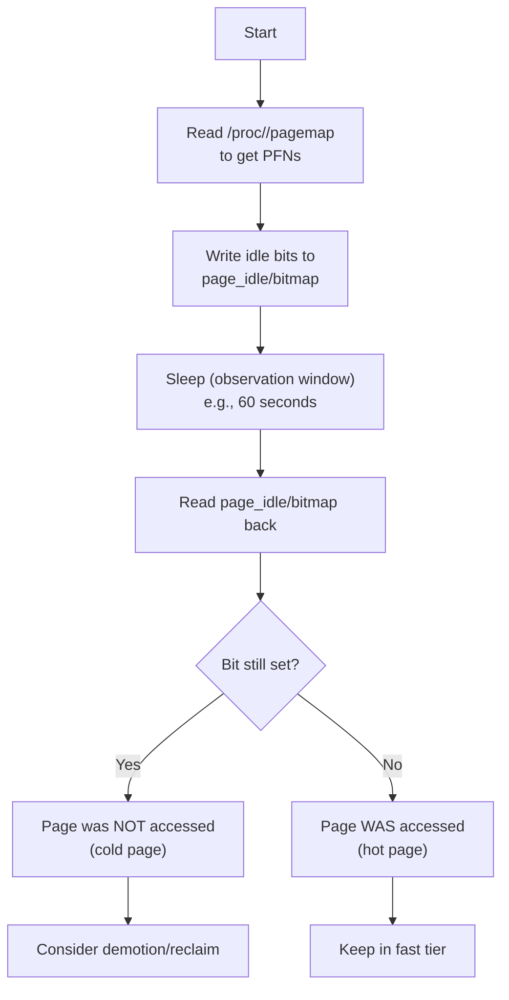
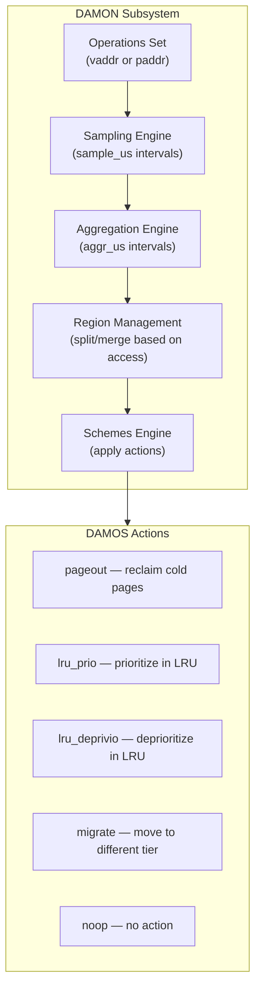
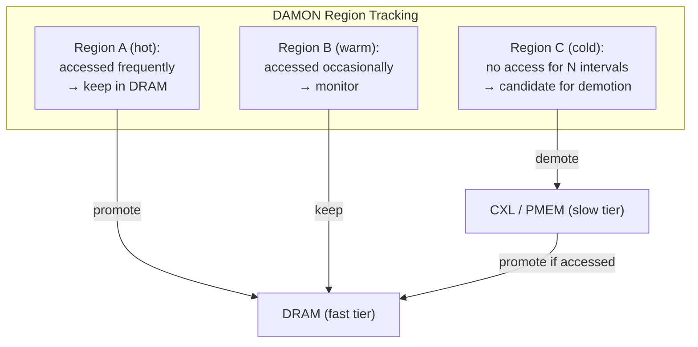
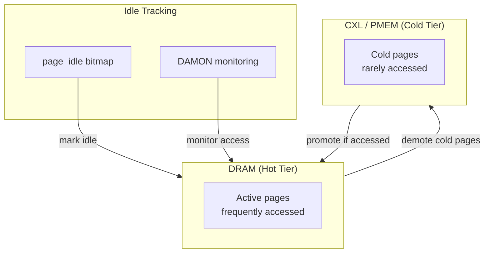

# Idle Page Tracking

Idle page tracking is a kernel mechanism that identifies memory pages which have
not been accessed over a configurable observation period. It is the foundation
for memory-tiering, proactive reclaim, and cold-page demotion on systems with
heterogeneous memory (e.g., DRAM + CXL / PMEM).

> **Introduced:** Linux 4.3 (per-page idle bits via `/sys/kernel/mm/page_idle`)  
> **Enhanced:** Linux 5.15+ (DAMON-based idle tracking with lower overhead)  
> **Source:** `mm/page_idle.c`, `mm/damon/`

---

## How It Works

The kernel maintains a per-page **idle bit** in a bitmap exposed through sysfs.
User space (or kernel subsystems) can:

1. **Set** idle bits on a set of pages (mark them "potentially idle").
2. **Wait** for a period.
3. **Read** back the bits — cleared bits indicate the page was accessed.

This two-phase approach avoids continuous access-flag scanning and keeps
overhead proportional to the number of pages monitored.

### Key Characteristics

- Works on **page-frame granularity** (typically 4 KiB).
- Requires no special hardware; uses the CPU's page-table Accessed bit.
- Overhead scales with the number of pages marked, not total RAM.
- Suitable for background daemons (e.g., `memory-tierd`, custom scripts).
- Only works with pages on LRU lists (not isolated or reserved pages).

### Implementation Details

The idle memory tracking feature adds a new page flag, the **Idle flag**. This
flag is set manually by writing to `/sys/kernel/mm/page_idle/bitmap`, and
cleared automatically whenever a page is referenced.

When a page is marked idle, the Accessed bit must be cleared in all PTEs it is
mapped to. To avoid interference with the reclaimer (which uses the Accessed
bit to promote actively referenced pages), the **Young flag** is introduced.
When the PTE Accessed bit is cleared as a result of setting the page's Idle
flag, the Young flag is set on the page. The reclaimer treats the Young flag as
an extra PTE Accessed bit.

```c
/* mm/page_idle.c */
static void page_idle_clear_pte_refs(struct page *page)
{
    /* Clear PTE Accessed bits, set Young flag */
    rmap_walk(page, page_idle_clear_pte_refs_one, NULL);
}
```

---

## `/sys/kernel/mm/page_idle`

The primary interface is a sysfs bitmap file:

```
/sys/kernel/mm/page_idle/bitmap
```

Each bit corresponds to one page frame (PFN). Bit *N* → PFN *N*.

### Bitmap Format

- Each element is an 8-byte (64-bit) integer.
- Bit `i%64` of element `i/64` corresponds to PFN `i`.
- Byte order is **native** (little-endian on x86).
- Reads/writes **must** be 8-byte aligned and multiples of 8 bytes.
- Writing beyond max PFN returns `-ENXIO`.

### Operations

| Operation | Mechanism | Effect |
|-----------|-----------|--------|
| **Mark idle** | Write `1` to bits for target PFNs | Sets the idle bit; next access clears it |
| **Clear idle** | Write `0` to bits | Removes idle tracking for those pages |
| **Read status** | Read the bitmap | Bit=1 → not accessed since last mark; Bit=0 → accessed |

### Important: Write Semantics

Writing to the bitmap performs an **OR** operation — bits are only set, never
cleared by writing. To clear bits, you must write a value that has 0s in the
positions you want to clear (which effectively does nothing, since OR with 0
is a no-op). To clear all idle bits, you must re-read the bitmap, clear the
desired bits, and write it back.

Actually, the kernel uses a different approach: writing sets bits via OR, and
there is no direct "clear" operation via the bitmap file. The kernel clears
the idle bit automatically when the page is accessed.

### Reading Idle Pages

```bash
# Determine page size
PAGE_SIZE=$(getconf PAGE_SIZE)   # usually 4096

# Read the bitmap (binary; 8 bytes = 64 pages)
# Read 8 bytes at PFN offset 1000
dd if=/sys/kernel/mm/page_idle/bitmap bs=8 count=1 skip=$((1000 / 64)) 2>/dev/null \
  | xxd -p

# Read a range of PFNs (e.g., PFNs 0-1023)
dd if=/sys/kernel/mm/page_idle/bitmap bs=8 count=$((1024 / 64)) 2>/dev/null \
  | xxd | head -20
```

### Marking Pages Idle

```bash
# Mark a specific page frame as idle
# For PFN 1000: byte offset = (1000/64)*8 = 125, bit = 1000%64 = 40
python3 -c "
import struct
pfn = 1000
byte_off = (pfn // 64) * 8
bit = 1 << (pfn % 64)
with open('/sys/kernel/mm/page_idle/bitmap', 'r+b') as f:
    f.seek(byte_off)
    val = struct.unpack('Q', f.read(8))[0]
    f.seek(byte_off)
    f.write(struct.pack('Q', val | bit))
"
```

### User-Space Workflow



### Example: Finding Cold Pages of a Process

```python
import struct, os, time

PAGE_SIZE = os.sysconf("SC_PAGE_SIZE")
IDLE_PATH = "/sys/kernel/mm/page_idle/bitmap"

def get_pfn(pid, vaddr):
    """Resolve virtual address to page frame number."""
    index = (vaddr // PAGE_SIZE) * 8
    with open(f"/proc/{pid}/pagemap", "rb") as f:
        f.seek(index)
        entry = struct.unpack("Q", f.read(8))[0]
    # Bit 63: present; bits 0-54: PFN
    if not (entry & (1 << 63)):
        return None  # Page not present
    return entry & 0x7FFFFFFFFFFFFF

def mark_idle(pfn):
    """Set idle bit for a PFN."""
    byte_off = (pfn // 64) * 8
    bit = 1 << (pfn % 64)
    with open(IDLE_PATH, "r+b") as f:
        f.seek(byte_off)
        val = struct.unpack("Q", f.read(8))[0]
        f.seek(byte_off)
        f.write(struct.pack("Q", val | bit))

def is_idle(pfn):
    """Check if a PFN is still idle."""
    byte_off = (pfn // 64) * 8
    bit = 1 << (pfn % 64)
    with open(IDLE_PATH, "rb") as f:
        f.seek(byte_off)
        val = struct.unpack("Q", f.read(8))[0]
    return bool(val & bit)

def get_process_pages(pid):
    """Get all present PFNs for a process."""
    pfns = []
    with open(f"/proc/{pid}/maps", "r") as maps:
        for line in maps:
            parts = line.split()
            addr_range = parts[0].split("-")
            start = int(addr_range[0], 16)
            end = int(addr_range[1], 16)
            for vaddr in range(start, end, PAGE_SIZE):
                pfn = get_pfn(pid, vaddr)
                if pfn:
                    pfns.append((vaddr, pfn))
    return pfns

# --- Main ---
pid = 1234
print(f"Scanning pages for PID {pid}...")
pages = get_process_pages(pid)
print(f"Found {len(pages)} present pages")

# Mark all pages as idle
pfns = [pfn for _, pfn in pages]
for pfn in pfns:
    mark_idle(pfn)
print(f"Marked {len(pfns)} pages as idle")

# Observe for 60 seconds
print("Waiting 60 seconds...")
time.sleep(60)

# Check which pages are still idle (cold)
cold_pfns = [p for p in pfns if is_idle(p)]
hot_pfns = [p for p in pfns if not is_idle(p)]
print(f"Results: {len(hot_pfns)} hot pages, {len(cold_pfns)} cold pages")
print(f"Working set size: ~{len(hot_pfns) * PAGE_SIZE / 1024 / 1024:.1f} MiB")
print(f"Cold memory: ~{len(cold_pfns) * PAGE_SIZE / 1024 / 1024:.1f} MiB")
```

### More Efficient: Using pread/pwrite

For large-scale idle tracking, use `pread`/`pwrite` with offsets to batch
operations:

```python
import os, struct

IDLE_PATH = "/sys/kernel/mm/page_idle/bitmap"

def mark_pfns_idle(pfns):
    """Mark a set of PFNs as idle efficiently."""
    # Group PFNs by 64-page blocks
    blocks = {}
    for pfn in pfns:
        block_idx = pfn // 64
        bit = pfn % 64
        blocks.setdefault(block_idx, 0)
        blocks[block_idx] |= (1 << bit)

    with open(IDLE_PATH, "r+b") as f:
        for block_idx, bits in blocks.items():
            offset = block_idx * 8
            f.seek(offset)
            current = struct.unpack("Q", f.read(8))[0]
            f.seek(offset)
            f.write(struct.pack("Q", current | bits))

def read_idle_pfns(pfns):
    """Check which PFNs are still idle."""
    blocks = {}
    for pfn in pfns:
        block_idx = pfn // 64
        blocks.setdefault(block_idx, set()).add(pfn % 64)

    idle_pfns = []
    with open(IDLE_PATH, "rb") as f:
        for block_idx, bits in blocks.items():
            offset = block_idx * 8
            f.seek(offset)
            val = struct.unpack("Q", f.read(8))[0]
            for bit in bits:
                if val & (1 << bit):
                    idle_pfns.append(block_idx * 64 + bit)
    return idle_pfns
```

---

## Integration with DAMON

**DAMON** (Data Access MONitor) provides a more sophisticated, lower-overhead
approach to tracking memory access patterns. Starting with Linux 5.15, DAMON
can feed idle-page information into the kernel's memory management subsystem
directly.

### DAMON Architecture



### DAMON vs. Raw page_idle

| Aspect | `page_idle` bitmap | DAMON |
|--------|--------------------|-------|
| **Overhead** | Proportional to pages marked | Adaptive sampling; low & bounded |
| **Granularity** | Per-page (4 KiB) | Region-based (configurable) |
| **Kernel integration** | User-space driven | In-kernel schemes (reclaim, tiering) |
| **Scalability** | Limited at scale (TB RAM) | Designed for large memories |
| **Interface** | Sysfs bitmap | Sysfs + debugfs + DAMON API |
| **Automation** | Manual mark/wait/read cycle | Automatic scheme-based actions |
| **Accuracy** | Exact per-page | Approximate (sampling-based) |

### DAMON-Based Idle Tracking

DAMON monitors access patterns by sampling page-table Accessed bits at the
**region** level. Regions are dynamically split/merged based on access hotness:



### DAMON Sysfs Interface

```bash
# Enable DAMON (create a kdamond)
echo 1 > /sys/kernel/mm/damon/admin/kdamonds/nr

# Configure monitoring target (physical memory)
echo 0 > /sys/kernel/mm/damon/admin/kdamonds/0/state
echo paddr > /sys/kernel/mm/damon/admin/kdamonds/0/contexts/0/operations

# Set monitoring parameters
echo 1000 > /sys/kernel/mm/damon/admin/kdamonds/0/contexts/0/monitoring_attrs/intervals/sample_us
echo 100000 > /sys/kernel/mm/damon/admin/kdamonds/0/contexts/0/monitoring_attrs/intervals/aggr_us
echo 10000000 > /sys/kernel/mm/damon/admin/kdamonds/0/contexts/0/monitoring_attrs/intervals/update_us

# Set region limits
echo 10 > /sys/kernel/mm/damon/admin/kdamonds/0/contexts/0/monitoring_attrs/nr_regions/min
echo 1000 > /sys/kernel/mm/damon/admin/kdamonds/0/contexts/0/monitoring_attrs/nr_regions/max

# Configure a scheme: reclaim pages with 0 accesses for 2+ aggregation intervals
echo 2 > /sys/kernel/mm/damon/admin/kdamonds/0/contexts/0/schemes/0/access_pattern/sz/min
echo max > /sys/kernel/mm/damon/admin/kdamonds/0/contexts/0/schemes/0/access_pattern/sz/max
echo 0 > /sys/kernel/mm/damon/admin/kdamonds/0/contexts/0/schemes/0/access_pattern/nr_accesses/min
echo 0 > /sys/kernel/mm/damon/admin/kdamonds/0/contexts/0/schemes/0/access_pattern/nr_accesses/max
echo 2 > /sys/kernel/mm/damon/admin/kdamonds/0/contexts/0/schemes/0/access_pattern/age/min
echo max > /sys/kernel/mm/damon/admin/kdamonds/0/contexts/0/schemes/0/access_pattern/age/max
echo pageout > /sys/kernel/mm/damon/admin/kdamonds/0/contexts/0/schemes/0/action

# Start monitoring
echo on > /sys/kernel/mm/damon/admin/kdamonds/0/state
```

### DAMON Sysfs Tree Layout

```
/sys/kernel/mm/damon/admin/
└── kdamonds/
    └── 0/
        ├── state              # on|off|commit|update_schemes_stats|...
        ├── pid                # target PID (for virtual address spaces)
        └── contexts/
            └── 0/
                ├── operations # vaddr|physical
                ├── monitoring_attrs/
                │   ├── intervals/
                │   │   ├── sample_us
                │   │   ├── aggr_us
                │   │   └── update_us
                │   └── nr_regions/
                │       ├── min
                │       └── max
                └── schemes/
                    └── 0/
                        ├── action       # noop|pageout|lru_prio|lru_deprivio|migrate|...
                        └── access_pattern/
                            ├── sz/
                            │   ├── min
                            │   └── max
                            ├── nr_accesses/
                            │   ├── min
                            │   └── max
                            └── age/
                                ├── min
                                └── max
```

### DAMON Monitoring for Virtual Address Spaces

```bash
# Monitor a specific process
echo 1234 > /sys/kernel/mm/damon/admin/kdamonds/0/pid
echo vaddr > /sys/kernel/mm/damon/admin/kdamonds/0/contexts/0/operations

# Start monitoring
echo on > /sys/kernel/mm/damon/admin/kdamonds/0/state

# Check monitoring stats
cat /sys/kernel/mm/damon/admin/kdamonds/0/contexts/0/schemes/0/stats/nr_tried
cat /sys/kernel/mm/damon/admin/kdamonds/0/contexts/0/schemes/0/stats/sz_tried
cat /sys/kernel/mm/damon/admin/kdamonds/0/contexts/0/schemes/0/stats/nr_applied
cat /sys/kernel/mm/damon/admin/kdamonds/0/contexts/0/schemes/0/stats/sz_applied
```

---

## Memory Tiering with Idle Tracking

On systems with multiple memory tiers (DRAM, CXL, PMEM), idle page tracking
enables **demotion** of cold pages to slower, cheaper tiers:



### Kernel Config for Tiering

```
CONFIG_DAMON=y
CONFIG_DAMON_VADDR=y          # virtual address space monitoring
CONFIG_DAMON_PADDR=y          # physical address space monitoring
CONFIG_DAMON_SYSFS=y          # sysfs interface
CONFIG_DAMON_RECLAIM=y        # proactive reclaim scheme
CONFIG_DAMON_LRU_PRIO=y       # LRU prioritization
CONFIG_NUMA=y                  # NUMA support (required for tiering)
CONFIG_MIGRATION=y             # Page migration (required for demotion)
```

### Proactive Reclaim (DAMON_RECLAIM)

When `CONFIG_DAMON_RECLAIM=y`, the kernel can proactively reclaim cold pages
before memory pressure hits:

```bash
# Enable DAMON reclaim
echo Y > /sys/kernel/mm/damon/admin/kdamonds/0/contexts/0/schemes/0/action

# Check DAMON reclaim stats
cat /sys/kernel/mm/damon/admin/kdamonds/0/contexts/0/schemes/0/stats/nr_reclaimed

# DAMON reclaim sysfs parameters
cat /sys/module/damon_reclaim/parameters/enabled
cat /sys/module/damon_reclaim/parameters/min_age
cat /sys/module/damon_reclaim/parameters/max_age
cat /sys/module/damon_reclaim/parameters/min_nr_regions
cat /sys/module/damon_reclaim/parameters/max_nr_regions
```

### DAMON LRU Prioritization

When `CONFIG_DAMON_LRU_PRIO=y`, DAMON can mark cold pages for deprioritization
in the LRU lists, making them more likely to be reclaimed first:

```bash
# LRU prioritization scheme
echo lru_prio > /sys/kernel/mm/damon/admin/kdamonds/0/contexts/0/schemes/0/action
# or for deprioritization:
echo lru_deprivio > /sys/kernel/mm/damon/admin/kdamonds/0/contexts/0/schemes/0/action
```

---

## The `/proc/<pid>/smaps` Interface

Idle page information is also partially reflected in `/proc/<pid>/smaps`:

```bash
# View memory region details including Referenced/Idle hints
cat /proc/<pid>/smaps | grep -E "^(Size|Rss|Referenced|LazyFree)"
# Size:               2048 kB
# Rss:                 512 kB
# Referenced:          256 kB
# LazyFree:              0 kB
```

The `Referenced` field reflects pages accessed since last clearing, which
overlaps conceptually with idle tracking.

### `/proc/<pid>/clear_refs`

To clear the Referenced bits for a process (similar to marking pages idle):

```bash
# Clear Referenced bits for all pages
echo 1 > /proc/<pid>/clear_refs

# Wait
sleep 60

# Check Referenced again
grep Referenced /proc/<pid>/smaps
```

### `/proc/<pid>/pagemap`

The pagemap file provides per-page information:

```bash
# Each 8-byte entry contains:
# Bit 63: Page present (1 = in RAM)
# Bit 62: Page swapped
# Bit 61: Page is file-page or shared-anon
# Bit 55: PTE soft-dirty
# Bits 0-54: PFN (if present) or swap offset
```

---

## The `page-types` Tool

The kernel includes a tool in `tools/mm/page-types` that can assist with idle
page tracking:

```bash
# Build the tool
cd tools/mm && make page-types

# Mark all pages of a process as idle
sudo ./page-types -p 1234 --idle

# Wait for the process to do work
sleep 60

# Show which pages are still idle
sudo ./page-types -p 1234 --idle
# Output shows which pages are cold (idle bit still set)
```

### page-types Options

```bash
# Show page flags for a process
sudo ./page-types -p <pid>

# Filter by specific flags
sudo ./page-types -p <pid> -N    # Only anonymous pages
sudo ./page-types -p <pid> -f    # Only file-backed pages
sudo ./page-types -p <pid> -l    # Only LRU pages

# Mark pages as idle and report
sudo ./page-types -p <pid> --idle
```

---

## Performance Considerations

| Concern | Mitigation |
|---------|------------|
| Bitmap I/O overhead for large PFN ranges | Use `pread`/`pwrite` with offsets; batch PFNs into 64-page blocks |
| Race between marking and reading | Acceptable for statistical sampling; not for exact accounting |
| Huge pages | Idle bits track base pages; huge page faults clear the bit for all constituent pages |
| NUMA awareness | Bitmap is global; correlate with NUMA node via `/sys/devices/system/node/` |
| File-backed pages | Idle tracking works on page cache pages; but reclaim may evict them before observation completes |
| Slab pages | Cannot be marked idle; attempt is silently ignored |

### Reducing Overhead

- Use **DAMON** for systems with >64 GiB RAM.
- For `page_idle`, only mark pages belonging to target processes.
- Batch operations: set/read 64 PFNs per 8-byte read/write.
- Use longer observation windows (reduce frequency of mark/read cycles).
- Focus on specific memory regions (e.g., heap only) rather than all pages.

### Overhead Comparison

| Method | CPU Overhead | Memory Overhead | Scalability |
|--------|-------------|-----------------|-------------|
| page_idle bitmap | High (per-page I/O) | Low (bitmap in kernel) | Poor at scale |
| DAMON sampling | Low (bounded) | Low (region metadata) | Excellent |
| /proc/pagemap scan | Medium | None | Moderate |
| /proc/smaps Referenced | Low | None | Good |

---

## Relation to Other Memory Features

- **Idle page tracking** identifies *which* pages are cold.
- **[LRU lists](/kernel/memory)** use age-based heuristics for reclaim order.
- **[DAMON](/kernel/memory/damon)** automates the mark-wait-act cycle.
- **[hugetlb](/kernel/memory/hugetlb)** pages have separate idle semantics.
- **[Memory compaction](./compaction.md)** operates on reclaimable pages, including idle pages.
- **[Page reclaim](./reclaim.md)** uses access patterns similar to idle tracking.
- **[GUP](./gup.md)** — pinned pages cannot be tracked for idle (they're always "active").
- **[Page types](./page-types.md)** — only LRU pages are tracked.

### Idle Tracking and Reclaim Interaction

```mermaid
flowchart TD
    A[Page accessed] --> B[Set PTE Accessed bit]
    B --> C[Page is "hot"]
    C --> D[LRU active list]
    D --> E[Protected from reclaim]

    F[Idle tracking marks page] --> G[Clear PTE Accessed bit]
    G --> H[Set Young flag]
    H --> I[Reclaimer sees Young flag]
    I --> J[Treat as referenced]
    J --> D

    K[Page not accessed] --> L[PTE Accessed bit stays clear]
    L --> M[Page is "cold"]
    M --> N[LRU inactive list]
    N --> O[Candidate for reclaim]
```

---

## Troubleshooting

### `page_idle/bitmap` returns all zeros

- Ensure you are **setting** idle bits before waiting.
- Check that the PFN range is valid (`/proc/iomem`).
- Verify kernel config: `CONFIG_IDLE_PAGE_TRACKING=y`.
- Check that reads/writes are 8-byte aligned.

### DAMON shows no regions

- Confirm `state` is `on`.
- Check `nr_regions/min` is not set too high.
- Review `dmesg | grep damon` for errors.
- Ensure the target PID is valid (for vaddr monitoring).

### High CPU usage from idle tracking loop

- Increase the observation window (sleep longer between mark and read).
- Reduce the set of monitored pages.
- Switch to DAMON for adaptive sampling.
- Use `pread`/`pwrite` instead of seeking.

### Idle bits not clearing when expected

- Verify the page is actually being accessed (check with `/proc/<pid>/smaps` Referenced).
- Ensure the page is on an LRU list (not isolated or reserved).
- Check for huge pages — idle bit is on the head page only.
- Check for DMA access — DMA doesn't set PTE Accessed bits (only CPU access does).

### DAMON scheme not reclaiming pages

- Verify the scheme's action is set correctly (`pageout`).
- Check that access pattern thresholds are reasonable.
- Review scheme stats (`nr_tried`, `nr_applied`).
- Check if pages are pinned (GUP) or mlocked.

---

## Source Files

| File | Contents |
|------|----------|
| `mm/page_idle.c` | page_idle bitmap implementation |
| `mm/damon/core.c` | DAMON core logic |
| `mm/damon/vaddr.c` | DAMON virtual address operations |
| `mm/damon/paddr.c` | DAMON physical address operations |
| `mm/damon/sysfs.c` | DAMON sysfs interface |
| `mm/damon/reclaim.c` | DAMON proactive reclaim |
| `mm/damon/lru.c` | DAMON LRU prioritization |
| `tools/mm/page-types.c` | page-types user-space tool |
| `Documentation/admin-guide/mm/idle_page_tracking.rst` | page_idle documentation |
| `Documentation/admin-guide/mm/damon/index.rst` | DAMON administration guide |

---

## Further Reading

- [Kernel docs: Idle Page Tracking](https://www.kernel.org/doc/html/latest/admin-guide/mm/idle_page_tracking.html)
- [Kernel docs: DAMON](https://www.kernel.org/doc/html/latest/mm/damon/index.html)
- [DAMON design document](https://damonitor.github.io/doc/html/latest/)
- [LWN: Idle page tracking (2015)](https://lwn.net/Articles/643739/)
- [LWN: DAMON for memory management](https://lwn.net/Articles/858728/)
- [LWN: Memory tiering in Linux — CXL and beyond](https://lwn.net/Articles/894846/)
- [HPDC'22 paper: DAMON](https://dl.acm.org/doi/abs/10.1145/3502181.3531466)
- [Middleware'19 paper: DAMON](https://dl.acm.org/doi/abs/10.1145/3366626.3368125)
- **commit b009014** — page_idle introduction (Linux 4.3)
- **commit 4bc1f3e** — DAMON introduction (Linux 5.15)

---

## See Also

- [LRU Page Management](./lru.md) — LRU list management and reclaim
- [Page Reclaim](./reclaim.md) — page reclaim mechanism
- [Page Types](./page-types.md) — page classification
- [GUP](./gup.md) — pinned pages and idle tracking
- [Memory Compaction](./compaction.md) — compaction and page movement
- [Memory Cgroups](./cgroups.md) — per-cgroup memory management
- [zpool](./zpool.md) — compressed memory pool
- [vmpressure](./vmpressure.md) — memory pressure notifications
