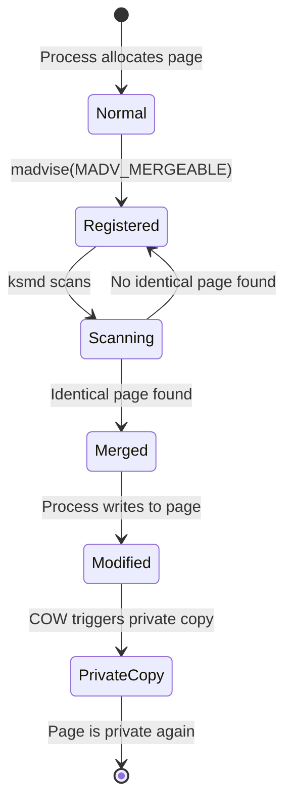
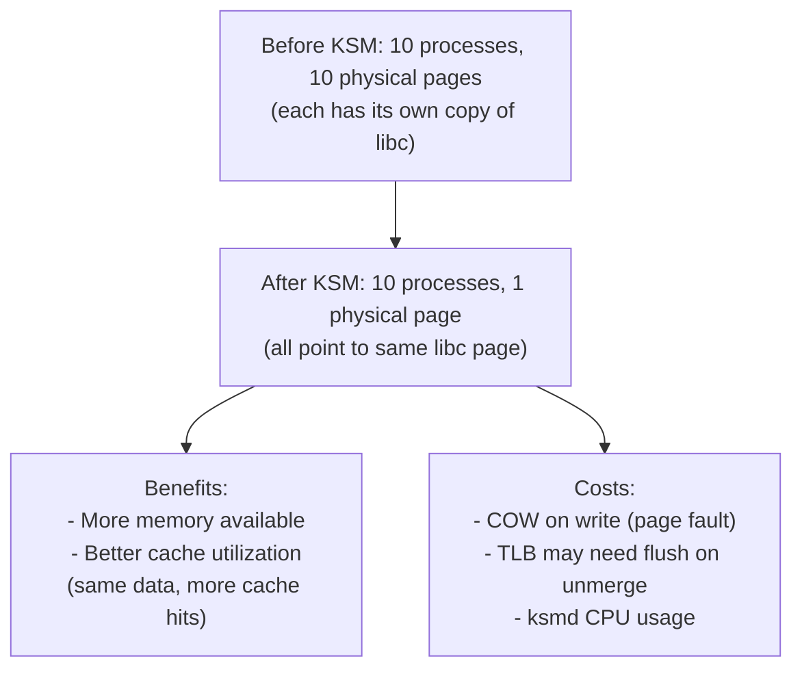
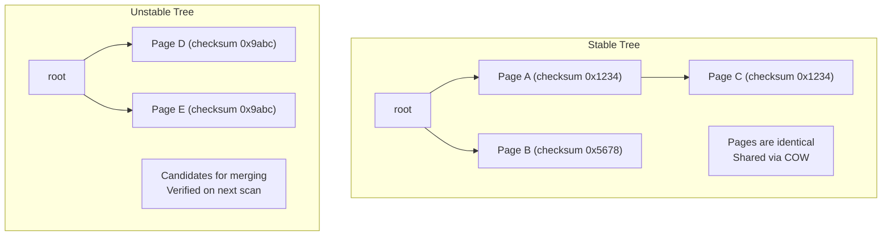

# KSM — Kernel Same-Page Merging

## Introduction

Kernel Same-Page Merging (KSM) is a memory optimization feature that scans physical memory for pages with identical content and merges them into a single copy, saving memory. The merged page is marked copy-on-write (COW), so if any process modifies it, a private copy is made for that process.

KSM was introduced in Linux 2.6.32 (2009) primarily for virtualization: multiple virtual machines running the same operating system have many identical pages (shared libraries, kernel text, zero-filled pages). By deduplicating these pages, a hypervisor can overcommit memory more aggressively, running more VMs with less physical RAM.

## How KSM Works

### Scanning and Merging

```mermaid
flowchart TD
    A[KSM daemon (ksmd) wakes up] --> B[Scan registered pages]
    B --> C[Calculate content hash]
    C --> D{Pages with same hash?}
    D -->|Yes| E[Compare byte-by-byte]
    E --> F{Identical content?}
    F -->|Yes| G[Mark both pages as COW]
    G --> H[Point both PTEs to same physical page]
    H --> I[Free one physical page]
    I --> J[Update KSM statistics]
    F -->|No| D
    D -->|No| K[Move to next page]
    K --> B
    J --> B
```

### Page Lifecycle with KSM



### Two-Phase Scanning

KSM uses two red-black trees for efficient scanning:

1. **Stable tree**: Pages already merged (content is stable, expected not to change)
2. **Unstable tree**: Pages being scanned (content may change between scans)

```c
/* KSM per-process tracking */
struct ksm_rmap_item {
    struct ksm_rmap_item *rmap_list;  /* List of rmap items for a page */
    struct ksm_stable_node *node;     /* Stable node if merged */
    unsigned long oldchecksum;         /* Checksum for change detection */
    union {
        struct rb_node rb_node;       /* In unstable tree */
        struct {
            /* In stable tree */
            unsigned long kpfn;       /* Physical frame number */
        };
    };
};
```

## Enabling KSM

### System-Wide Setup

```bash
# Check if KSM is available
$ ls /sys/kernel/mm/ksm/
full_scans  max_page_sharing  merge_across_nodes  pages_sharing
pages_shared  pages_to_scan  pages_unshared  run  sleep_millisecs
stable_node_chains  stable_node_dups  use_zero_pages

# Enable KSM
$ echo 1 | sudo tee /sys/kernel/mm/ksm/run
# 0 = stopped, 1 = run, 2 = unmerge

# Configure scanning
$ echo 100 | sudo tee /sys/kernel/mm/ksm/sleep_millisecs  # Sleep between scans
$ echo 1000 | sudo tee /sys/kernel/mm/ksm/pages_to_scan   # Pages per scan
```

### Per-Process: MADV_MERGEABLE

```c
#include <sys/mman.h>

/* Mark a memory region as mergeable */
char *region = mmap(NULL, size, PROT_READ | PROT_WRITE,
                    MAP_PRIVATE | MAP_ANONYMOUS, -1, 0);

/* Tell KSM to scan and merge this region */
madvise(region, size, MADV_MERGEABLE);

/* Later, if no longer needed */
madvise(region, size, MADV_UNMERGEABLE);
```

### QEMU/KVM Integration

```bash
# QEMU enables KSM for VM memory
qemu-system-x86_64 -m 4G \
    -object memory-backend-ram,id=mem0,size=4G,merge=on \
    -machine memory-backend=mem0 \
    ...

# Or via libvirt XML:
# <memoryBacking>
#   <nosharepages/>
# </memoryBacking>

# Check KSM stats for VMs
$ virsh dommemstat <vm-name>
```

## KSM Statistics

```bash
# View KSM statistics
$ cat /sys/kernel/mm/ksm/pages_shared
12345
$ cat /sys/kernel/mm/ksm/pages_sharing
56789
$ cat /sys/kernel/mm/ksm/pages_unshared
234567
$ cat /sys/kernel/mm/ksm/full_scans
42

# Interpretation:
# pages_shared: unique physical pages that are shared
# pages_sharing: references to shared pages (how many PTEs point to shared pages)
# pages_unshared: pages scanned but no duplicate found
# full_scans: number of complete scans

# Memory saved:
# saved = (pages_sharing - pages_shared) * PAGE_SIZE
$ echo "Saved: $(( ($(cat /sys/kernel/mm/ksm/pages_sharing) - \
    $(cat /sys/kernel/mm/ksm/pages_shared)) * 4096 / 1024 / 1024 )) MB"
Saved: 172 MB

# Efficiency ratio
# sharing/shared = average number of sharers per page
$ echo "Ratio: $(echo "scale=2; $(cat /sys/kernel/mm/ksm/pages_sharing) / \
    $(cat /sys/kernel/mm/ksm/pages_shared)" | bc)"
Ratio: 4.60
```

### Per-Process KSM Usage

```bash
# View KSM status for a process
$ grep -E "VmFlags|ksm" /proc/<pid>/smaps | head
# VmFlags may include "mg" (mergeable) or "mt" (merged)

# Detailed per-VMA info
$ cat /proc/<pid>/smaps | grep -A 5 "MADV_MERGEABLE"

# Count merged pages for a process
$ grep "^Shared_" /proc/<pid>/smaps
Shared_Clean:      12340 kB
Shared_Dirty:          0 kB
# Shared_Clean with KSM shows shared pages
```

## KSM Tuning Parameters

| Parameter | File | Default | Description |
|-----------|------|---------|-------------|
| `run` | `/sys/kernel/mm/ksm/run` | 0 | 0=stop, 1=run, 2=unmerge |
| `sleep_millisecs` | `/sys/kernel/mm/ksm/sleep_millisecs` | 20 | Sleep time between scans (ms) |
| `pages_to_scan` | `/sys/kernel/mm/ksm/pages_to_scan` | 100 | Pages to scan per sleep |
| `merge_across_nodes` | `/sys/kernel/mm/ksm/merge_across_nodes` | 1 | Merge pages across NUMA nodes |
| `max_page_sharing` | `/sys/kernel/mm/ksm/max_page_sharing` | 256 | Max pages sharing a single KSM page |
| `use_zero_pages` | `/sys/kernel/mm/ksm/use_zero_pages` | 0 | Special handling for zero-filled pages |

### Tuning for Different Workloads

```bash
# Aggressive scanning for VM consolidation
echo 1 > /sys/kernel/mm/ksm/run
echo 10 > /sys/kernel/mm/ksm/sleep_millisecs   # Scan more often
echo 5000 > /sys/kernel/mm/ksm/pages_to_scan   # Scan more pages

# Conservative for desktop
echo 1 > /sys/kernel/mm/ksm/run
echo 200 > /sys/kernel/mm/ksm/sleep_millisecs   # Scan less often
echo 100 > /sys/kernel/mm/ksm/pages_to_scan    # Fewer pages

# Disable cross-NUMA merging (performance on NUMA)
echo 0 > /sys/kernel/mm/ksm/merge_across_nodes
```

## Performance Impact

### CPU Overhead

KSM scanning consumes CPU:

```bash
# Monitor ksmd CPU usage
$ top -p $(pgrep ksmd)

# ksmd runs at SCHED_IDLE priority (lowest)
# It yields to all other tasks

# Check ksmd scheduling
$ ps -eo pid,ni,comm | grep ksmd
  123  19 ksmd
# nice 19 = very low priority
```

### Memory Overhead

KSM maintains data structures for tracking pages:

```bash
# KSM overhead: ~8 bytes per scanned page + red-black tree nodes
# For 10GB of scanned memory:
# ~10GB / 4KB * 8 bytes = ~20MB overhead for tracking

# Stable node chains (when max_page_sharing is reached)
$ cat /sys/kernel/mm/ksm/stable_node_chains
0
$ cat /sys/kernel/mm/ksm/stable_node_dups
0
```

### TLB and Cache Effects



## Security Considerations

### KSM Side-Channel Attacks

KSM can be exploited as a side channel:

```mermaid
graph TD
    A[Attacker process] --> B[Allocates page with known content]
    B --> C[Calls madvise(MADV_MERGEABLE)]
    C --> D[Times write to page]
    D --> E{Fast write?}
    E -->|"Yes (no COW fault)"| F[Page was merged<br/>→ victim has identical content]
    E -->|"No (COW fault)"| G[Page was not merged<br/>→ victim has different content]
```

This can be used to:
- Detect memory content of co-located VMs
- Bypass ASLR by detecting shared library pages
- Leak information across security boundaries

### Mitigations

```bash
# Disable KSM for security-sensitive workloads
echo 0 > /sys/kernel/mm/ksm/run

# Use KSM only within trust boundaries
# (e.g., all VMs belong to same owner)

# Some hypervisors disable KSM by default for security
```

## KSM vs THP (Transparent Huge Pages)

| Feature | KSM | THP |
|---------|-----|-----|
| **Goal** | Deduplicate identical pages | Use larger pages (2MB) |
| **Saves** | Memory (fewer physical pages) | TLB entries (fewer TLB misses) |
| **Mechanism** | Content comparison + merging | Automatic huge page allocation |
| **Overhead** | CPU (scanning) | Memory (internal fragmentation) |
| **Can combine?** | Yes — KSM can merge THP pages | Yes — THP pages can be KSM-merged |

## Implementation Details

### Key Source Files

- **`mm/ksm.c`** — KSM implementation (~3000 lines)
- **`include/linux/ksm.h`** — KSM interfaces
- **`mm/madvise.c`** — `MADV_MERGEABLE` handling

### Stable vs Unstable Trees



1. New pages enter the **unstable tree** (content may change)
2. On the next scan, if checksums still match, pages move to the **stable tree**
3. In the stable tree, pages are actually merged (COW shared)

## References

- [KSM kernel documentation](https://www.kernel.org/doc/html/latest/admin-guide/mm/ksm.html)
- [mm/ksm.c source](https://github.com/torvalds/linux/blob/master/mm/ksm.c)
- [Original KSM RFC](https://lwn.net/Articles/306704/)

## Further Reading

- [The Linux Kernel Documentation](https://docs.kernel.org/)
- [GNU Project Documentation](https://www.gnu.org/doc/doc.html)
- [GNU Manuals](https://www.gnu.org/manual/manual.html)
- [Free Software Directory](https://directory.fsf.org/wiki/Main_Page)
- [Planet GNU](https://planet.gnu.org/)
- [Free Software Books](https://www.gnu.org/doc/other-free-books.html)

- https://www.kernel.org/doc/html/latest/admin-guide/mm/ksm.html
- https://man7.org/linux/man-pages/man2/madvise.2.html — MADV_MERGEABLE
- https://lwn.net/Articles/306704/ — "KSM: sharing memory between virtual machines"
- https://lwn.net/Articles/576826/ — "KSM and security"
- https://www.kernel.org/doc/html/latest/mm/ksm.html

## Related Topics

- [compaction](./compaction.md) — KSM pages participate in compaction
- [numa](./numa.md) — `merge_across_nodes` controls NUMA merging
- [aslr](./aslr.md) — KSM can be used to bypass ASLR
- [zones](./zones.md) — KSM operates on pages within memory zones
