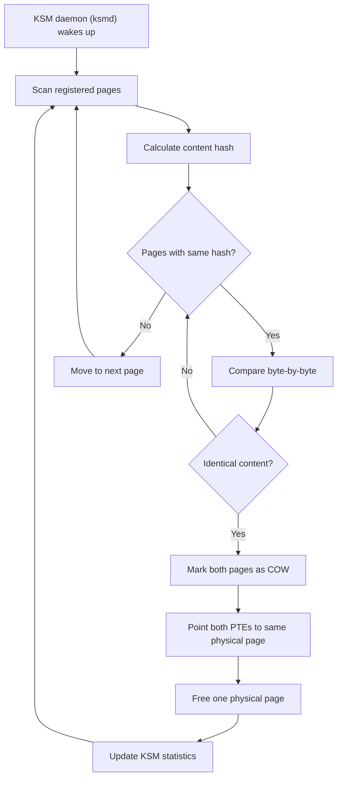
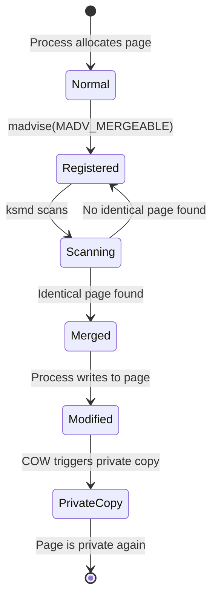
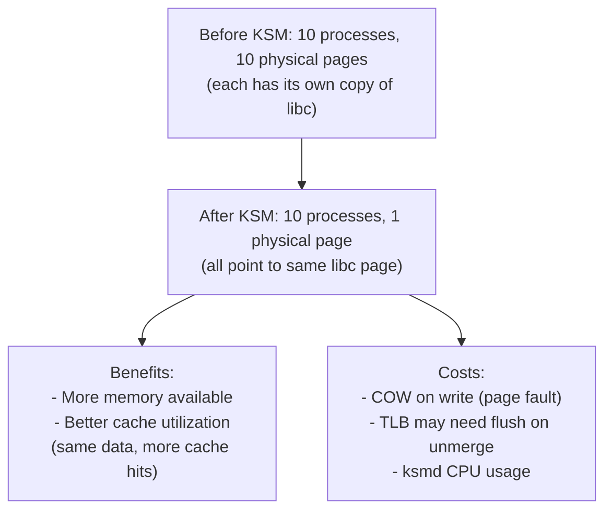
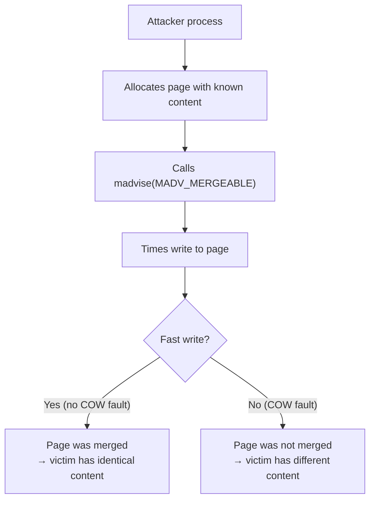
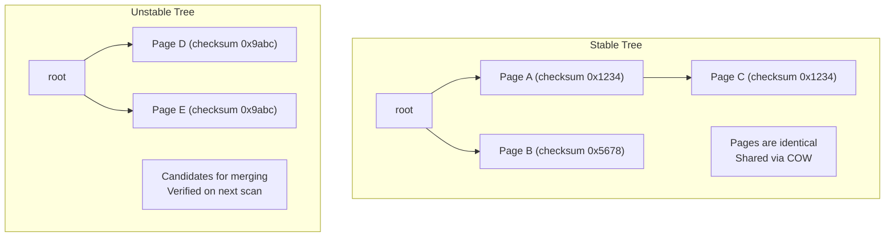
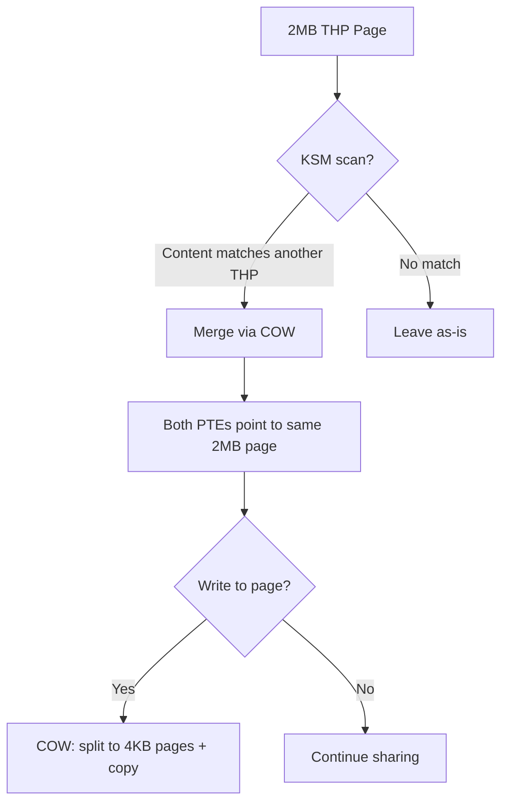

# KSM — Kernel Same-Page Merging

## Introduction

Kernel Same-Page Merging (KSM) is a memory optimization feature that scans physical memory for pages with identical content and merges them into a single copy, saving memory. The merged page is marked copy-on-write (COW), so if any process modifies it, a private copy is made for that process.

KSM was introduced in Linux 2.6.32 (2009) primarily for virtualization: multiple virtual machines running the same operating system have many identical pages (shared libraries, kernel text, zero-filled pages). By deduplicating these pages, a hypervisor can overcommit memory more aggressively, running more VMs with less physical RAM.

## How KSM Works

### Scanning and Merging



### Page Lifecycle with KSM



### Two-Phase Scanning

KSM uses two red-black trees for efficient scanning:

1. **Stable tree**: Pages already merged (content is stable, expected not to change)
2. **Unstable tree**: Pages being scanned (content may change between scans)

```c
/* KSM per-process tracking */
struct ksm_rmap_item {
    struct ksm_rmap_item *rmap_list;  /* List of rmap items for a page */
    struct ksm_stable_node *node;     /* Stable node if merged */
    unsigned long oldchecksum;         /* Checksum for change detection */
    union {
        struct rb_node rb_node;       /* In unstable tree */
        struct {
            /* In stable tree */
            unsigned long kpfn;       /* Physical frame number */
        };
    };
};
```

## Enabling KSM

### System-Wide Setup

```bash
# Check if KSM is available
$ ls /sys/kernel/mm/ksm/
full_scans  max_page_sharing  merge_across_nodes  pages_sharing
pages_shared  pages_to_scan  pages_unshared  run  sleep_millisecs
stable_node_chains  stable_node_dups  use_zero_pages

# Enable KSM
$ echo 1 | sudo tee /sys/kernel/mm/ksm/run
# 0 = stopped, 1 = run, 2 = unmerge

# Configure scanning
$ echo 100 | sudo tee /sys/kernel/mm/ksm/sleep_millisecs  # Sleep between scans
$ echo 1000 | sudo tee /sys/kernel/mm/ksm/pages_to_scan   # Pages per scan
```

### Per-Process: MADV_MERGEABLE

```c
#include <sys/mman.h>

/* Mark a memory region as mergeable */
char *region = mmap(NULL, size, PROT_READ | PROT_WRITE,
                    MAP_PRIVATE | MAP_ANONYMOUS, -1, 0);

/* Tell KSM to scan and merge this region */
madvise(region, size, MADV_MERGEABLE);

/* Later, if no longer needed */
madvise(region, size, MADV_UNMERGEABLE);
```

### QEMU/KVM Integration

```bash
# QEMU enables KSM for VM memory
qemu-system-x86_64 -m 4G \
    -object memory-backend-ram,id=mem0,size=4G,merge=on \
    -machine memory-backend=mem0 \
    ...

# Or via libvirt XML:
# <memoryBacking>
#   <nosharepages/>
# </memoryBacking>

# Check KSM stats for VMs
$ virsh dommemstat <vm-name>
```

## KSM Statistics

```bash
# View KSM statistics
$ cat /sys/kernel/mm/ksm/pages_shared
12345
$ cat /sys/kernel/mm/ksm/pages_sharing
56789
$ cat /sys/kernel/mm/ksm/pages_unshared
234567
$ cat /sys/kernel/mm/ksm/full_scans
42

# Interpretation:
# pages_shared: unique physical pages that are shared
# pages_sharing: references to shared pages (how many PTEs point to shared pages)
# pages_unshared: pages scanned but no duplicate found
# full_scans: number of complete scans

# Memory saved:
# saved = (pages_sharing - pages_shared) * PAGE_SIZE
$ echo "Saved: $(( ($(cat /sys/kernel/mm/ksm/pages_sharing) - \
    $(cat /sys/kernel/mm/ksm/pages_shared)) * 4096 / 1024 / 1024 )) MB"
Saved: 172 MB

# Efficiency ratio
# sharing/shared = average number of sharers per page
$ echo "Ratio: $(echo "scale=2; $(cat /sys/kernel/mm/ksm/pages_sharing) / \
    $(cat /sys/kernel/mm/ksm/pages_shared)" | bc)"
Ratio: 4.60
```

### Per-Process KSM Usage

```bash
# View KSM status for a process
$ grep -E "VmFlags|ksm" /proc/<pid>/smaps | head
# VmFlags may include "mg" (mergeable) or "mt" (merged)

# Detailed per-VMA info
$ cat /proc/<pid>/smaps | grep -A 5 "MADV_MERGEABLE"

# Count merged pages for a process
$ grep "^Shared_" /proc/<pid>/smaps
Shared_Clean:      12340 kB
Shared_Dirty:          0 kB
# Shared_Clean with KSM shows shared pages
```

## KSM Tuning Parameters

| Parameter | File | Default | Description |
|-----------|------|---------|-------------|
| `run` | `/sys/kernel/mm/ksm/run` | 0 | 0=stop, 1=run, 2=unmerge |
| `sleep_millisecs` | `/sys/kernel/mm/ksm/sleep_millisecs` | 20 | Sleep time between scans (ms) |
| `pages_to_scan` | `/sys/kernel/mm/ksm/pages_to_scan` | 100 | Pages to scan per sleep |
| `merge_across_nodes` | `/sys/kernel/mm/ksm/merge_across_nodes` | 1 | Merge pages across NUMA nodes |
| `max_page_sharing` | `/sys/kernel/mm/ksm/max_page_sharing` | 256 | Max pages sharing a single KSM page |
| `use_zero_pages` | `/sys/kernel/mm/ksm/use_zero_pages` | 0 | Special handling for zero-filled pages |

### merge_across_nodes

By default (`merge_across_nodes=1`), KSM merges pages across all NUMA nodes, treating physical memory as a single pool. This maximizes deduplication but can increase remote NUMA access latency when a process on node 0 accesses a KSM-merged page physically located on node 1.

Setting `merge_across_nodes=0` causes KSM to maintain **separate stable and unstable trees per NUMA node**. Pages are only merged with other pages on the same NUMA node. This sacrifices some deduplication ratio for better NUMA locality:

```bash
# Disable cross-NUMA merging for NUMA-sensitive workloads
$ echo 0 > /sys/kernel/mm/ksm/merge_across_nodes

# Verify per-node trees are active
$ cat /sys/kernel/mm/ksm/merge_across_nodes
0
```

When `merge_across_nodes=0`, each NUMA node gets its own pair of stable/unstable red-black trees. The KSM daemon scans each node's trees independently, and pages are only merged within the same node. This is important for:
- **Latency-sensitive workloads** where remote NUMA access adds measurable overhead
- **Large NUMA systems** (4+ nodes) where cross-node memory traffic saturates interconnects
- **VM hosts** where guest vCPU pinning to NUMA nodes is important

### KSM Advisor

The KSM advisor is an automated tuning mechanism (available since Linux 5.12) that dynamically adjusts KSM scanning parameters based on the current state of memory deduplication. It monitors the ratio of shared vs. unshared pages and tunes `sleep_millisecs` and `pages_to_scan` automatically.

The advisor mode is controlled via `/sys/kernel/mm/ksm/advisor`:

```bash
# Enable the KSM advisor (auto-tune scanning parameters)
$ echo scan-time > /sys/kernel/mm/ksm/advisor

# Disable the advisor (manual tuning)
$ echo off > /sys/kernel/mm/ksm/advisor
```

The advisor has two modes:
- **`scan-time`**: Optimizes to achieve a target scan time (full scan within a reasonable period). It increases `pages_to_scan` when scanning is too slow and decreases it when the system is under memory pressure.
- **`off`**: Manual tuning — parameters are controlled by the administrator.

When the advisor is active, it overrides manual settings for `sleep_millisecs` and `pages_to_scan`. The advisor considers:
- Current `pages_sharing` / `pages_shared` ratio (deduplication effectiveness)
- CPU usage of ksmd
- Memory pressure signals

```bash
# Check advisor status
$ cat /sys/kernel/mm/ksm/advisor
scan-time

# View current auto-tuned values
$ cat /sys/kernel/mm/ksm/sleep_millisecs
$ cat /sys/kernel/mm/ksm/pages_to_scan
```

### Tuning for Different Workloads

```bash
# Aggressive scanning for VM consolidation
echo 1 > /sys/kernel/mm/ksm/run
echo 10 > /sys/kernel/mm/ksm/sleep_millisecs   # Scan more often
echo 5000 > /sys/kernel/mm/ksm/pages_to_scan   # Scan more pages

# Conservative for desktop
echo 1 > /sys/kernel/mm/ksm/run
echo 200 > /sys/kernel/mm/ksm/sleep_millisecs   # Scan less often
echo 100 > /sys/kernel/mm/ksm/pages_to_scan    # Fewer pages

# Disable cross-NUMA merging (performance on NUMA)
echo 0 > /sys/kernel/mm/ksm/merge_across_nodes
```

## Performance Impact

### CPU Overhead

KSM scanning consumes CPU:

```bash
# Monitor ksmd CPU usage
$ top -p $(pgrep ksmd)

# ksmd runs at SCHED_IDLE priority (lowest)
# It yields to all other tasks

# Check ksmd scheduling
$ ps -eo pid,ni,comm | grep ksmd
  123  19 ksmd
# nice 19 = very low priority
```

### Memory Overhead

KSM maintains data structures for tracking pages:

```bash
# KSM overhead: ~8 bytes per scanned page + red-black tree nodes
# For 10GB of scanned memory:
# ~10GB / 4KB * 8 bytes = ~20MB overhead for tracking

# Stable node chains (when max_page_sharing is reached)
$ cat /sys/kernel/mm/ksm/stable_node_chains
0
$ cat /sys/kernel/mm/ksm/stable_node_dups
0
```

### TLB and Cache Effects



## Security Considerations

### KSM Side-Channel Attacks

KSM can be exploited as a side channel:



This can be used to:
- Detect memory content of co-located VMs
- Bypass ASLR by detecting shared library pages
- Leak information across security boundaries

### Mitigations

```bash
# Disable KSM for security-sensitive workloads
echo 0 > /sys/kernel/mm/ksm/run

# Use KSM only within trust boundaries
# (e.g., all VMs belong to same owner)

# Some hypervisors disable KSM by default for security
```

## KSM vs THP (Transparent Huge Pages)

| Feature | KSM | THP |
|---------|-----|-----|
| **Goal** | Deduplicate identical pages | Use larger pages (2MB) |
| **Saves** | Memory (fewer physical pages) | TLB entries (fewer TLB misses) |
| **Mechanism** | Content comparison + merging | Automatic huge page allocation |
| **Overhead** | CPU (scanning) | Memory (internal fragmentation) |
| **Can combine?** | Yes — KSM can merge THP pages | Yes — THP pages can be KSM-merged |

## Implementation Details

### Key Source Files

- **`mm/ksm.c`** — KSM implementation (~3000 lines)
- **`include/linux/ksm.h`** — KSM interfaces
- **`mm/madvise.c`** — `MADV_MERGEABLE` handling

### Stable vs Unstable Trees



1. New pages enter the **unstable tree** (content may change)
2. On the next scan, if checksums still match, pages move to the **stable tree**
3. In the stable tree, pages are actually merged (COW shared)

### KSM Scanning Algorithm

The KSM scanning process uses a single cursor (`struct ksm_scan`) that iterates through all registered memory areas:

```c
struct ksm_scan {
    struct ksm_mm_slot *mm_slot;  /* Current mm_slot being scanned */
    unsigned long address;         /* Next address to scan */
    struct ksm_rmap_item **rmap_list; /* Next rmap to scan */
    unsigned long seqnr;           /* Completed full scan count */
};
```

The scanning works as follows:

1. **Reduce excessive scanning**: KSM sorts pages by content into data structures holding pointers to page locations.
2. **Stable tree** holds merged (write-protected) pages sorted by content — searching is fully reliable.
3. **Unstable tree** holds pages found "unchanged for a period of time" — but since they're not write-protected, the tree may be corrupted by concurrent modifications.
4. KSM handles unstable tree corruption by:
   - **Flushing** the unstable tree after each complete scan of all memory areas
   - Only inserting pages whose **hash hasn't changed** since the previous scan
   - Using a **Red-Black tree** — balancing is based on node colors, not content, so corruption doesn't cause unbalanced trees
5. KSM **never flushes the stable tree** — once a merge is found, it's permanent (until unmerge).
6. When scanning a new page, KSM first compares against the stable tree, then the unstable tree.

If `merge_across_nodes` is unset, KSM maintains separate stable and unstable trees per NUMA node.

### Scanning Tunables

| Tunable | Description |
|---------|-------------|
| `sleep_millisecs` | Sleep between scan batches (default: 20ms) |
| `pages_to_scan` | Pages to scan per sleep cycle (default: 100) |
| `stable_node_chains_prune_millisecs` | How often to prune stale nodes from chains |

## Reverse Mapping and max_page_sharing

KSM maintains reverse mapping information for KSM pages in the stable tree. When a KSM page is shared between fewer than `max_page_sharing` VMAs, the stable tree node points to a linked list of `struct ksm_rmap_item` and the `page->mapping` of the KSM page points to the stable tree node.

When sharing exceeds this threshold, KSM adds a second dimension to the stable tree. The tree node becomes a "chain" that links one or more "dups". Each "dup" keeps reverse mapping information for a KSM page copy of that content. This design ensures that:

- Stable tree lookup complexity remains O(log N) regardless of sharing count
- The rmap walk complexity is O(N) but N is capped by `max_page_sharing`
- There cannot be KSM page content duplicates in the stable tree

The `stable_node_dups`/`stable_node_chains` ratio is affected by `max_page_sharing`. High ratios may indicate fragmentation that could be addressed by reorganizing rmap_items between dups.

The chain list is periodically scanned to prune stale stable_nodes, controlled by the `stable_node_chains_prune_millisecs` sysfs tunable.

### Stable Tree Data Structures

```c
struct ksm_stable_node {
    struct hlist_node hlist;          /* Hash list node */
    struct list_head list;            /* Chain or dup list */
    struct rb_node rb_node;           /* RB tree node */
    unsigned long kpfn;               /* Physical frame number */
    unsigned long chain_prune_time;   /* Next prune time */
    struct list_head rmap_hlist;      /* Reverse mapping list */
    int rmap_hlist_len;               /* Number of rmap entries */
};
```

## References

- [KSM kernel documentation](https://www.kernel.org/doc/html/latest/admin-guide/mm/ksm.html)
- [mm/ksm.c source](https://github.com/torvalds/linux/blob/master/mm/ksm.c)
- [Original KSM RFC](https://lwn.net/Articles/306704/)
- [Kernel documentation: Kernel Samepage Merging](https://docs.kernel.org/mm/ksm.html)
- [LWN: KSM: sharing memory between virtual machines](https://lwn.net/Articles/306704/)
- [LWN: KSM part 2](https://lwn.net/Articles/330589/)

## Further Reading

- [Kernel Samepage Merging — docs.kernel.org](https://docs.kernel.org/mm/ksm.html)
- [KSM admin-guide — docs.kernel.org](https://docs.kernel.org/admin-guide/mm/ksm.html)
- [LWN: KSM: sharing memory between virtual machines](https://lwn.net/Articles/306704/)
- [LWN: KSM part 2](https://lwn.net/Articles/330589/)

## KSM in Virtualization Platforms

### Proxmox VE

Proxmox VE exposes KSM through its web interface and configuration files:

```bash
# Enable KSM in Proxmox
# /etc/default/pve-ha-manager or via web UI: Datacenter → Options → KSM

# Proxmox uses ksmtuned (from qemu-kvm) to dynamically adjust KSM
# based on memory pressure:
systemctl status ksmtuned

# Check KSM savings
pvesh get /nodes/<node>/status
# Look for "ksm_saving" field

# Proxmox KSM configuration
# /etc/ksmtuned.conf
KSM_MONITOR_INTERVAL=60
KSM_SLEEP_MSEC=10
KSM_NPAGES_BOOST=300
KSM_NPAGES_DECAY=-50
KSM_NPAGES_MIN=128
KSM_NPAGES_MAX=1250
KSM_THRES_COEF=20
KSM_THRES_CONST=2048
```

### RHEL / libvirt

```bash
# Enable KSM for libvirt-managed VMs
systemctl enable ksmtuned
systemctl start ksmtuned

# In libvirt domain XML, enable KSM per-VM:
# <memoryBacking>
#   <nosharepages/>
# </memoryBacking>
# Note: <nosharepages/> DISABLES KSM for this VM
# Omit the tag to allow KSM

# Check KSM stats for a specific VM
virsh dommemstat <vm-name>
# actual 1048576
# swap_in 0
# swap_out 0
# major_fault 0
# minor_fault 12345
# unused 524288
# available 2097152
# rss 1048576
# usable 2097152
```

### QEMU/KVM KSM Options

```bash
# QEMU command-line KSM options
qemu-system-x86_64 \
    -m 4G \
    -object memory-backend-ram,id=mem0,size=4G,merge=on \
    -machine memory-backend=mem0 \
    ...

# merge=on: allow KSM to merge this VM's pages
# merge=off: prevent KSM from merging this VM's pages

# Monitor KSM for QEMU via QMP
{"execute": "qmp_capabilities"}
{"execute": "query-memory-size-summary"}
```

## KSM Monitoring and Alerting

### Monitoring Script

```bash
#!/bin/bash
# ksm-monitor.sh — Monitor KSM effectiveness and alert on issues

SYSFS="/sys/kernel/mm/ksm"
LOG_FILE="/var/log/ksm-stats.log"

shared=$(cat $SYSFS/pages_shared)
sharing=$(cat $SYSFS/pages_sharing)
unshared=$(cat $SYSFS/pages_unshared)
scans=$(cat $SYSFS/full_scans)
run=$(cat $SYSFS/run)

if [ "$run" != "1" ]; then
    echo "WARNING: KSM is not running (run=$run)" | logger -p kern.warning
    exit 1
fi

# Calculate savings
if [ "$shared" -gt 0 ]; then
    ratio=$(echo "scale=2; $sharing / $shared" | bc)
    saved_mb=$(( (sharing - shared) * 4096 / 1024 / 1024 ))
else
    ratio=0
    saved_mb=0
fi

# Log stats
echo "$(date -Iseconds) shared=$shared sharing=$sharing " \
     "unshared=$unshared ratio=$ratio saved=${saved_mb}MB " \
     "scans=$scans" >> "$LOG_FILE"

# Alert if savings are unexpectedly low
if [ "$saved_mb" -lt 100 ] && [ "$unshared" -gt 100000 ]; then
    echo "WARNING: KSM savings low ($saved_mb MB) with $unshared unshared pages" | \
        logger -p kern.warning
fi
```

### Prometheus Metrics

```bash
#!/bin/bash
# Export KSM metrics for Prometheus node_exporter
OUTPUT_DIR="/var/lib/node_exporter"
SYSFS="/sys/kernel/mm/ksm"

cat > "$OUTPUT_DIR/ksm.prom" <<EOF
# HELP ksm_pages_shared Number of shared pages in KSM
# TYPE ksm_pages_shared gauge
ksm_pages_shared $(cat $SYSFS/pages_shared)
# HELP ksm_pages_sharing Number of pages sharing KSM pages
# TYPE ksm_pages_sharing gauge
ksm_pages_sharing $(cat $SYSFS/pages_sharing)
# HELP ksm_pages_unshared Pages scanned but not shared
# TYPE ksm_pages_unshared gauge
ksm_pages_unshared $(cat $SYSFS/pages_unshared)
# HELP ksm_full_scans_total Total KSM full scans completed
# TYPE ksm_full_scans_total counter
ksm_full_scans_total $(cat $SYSFS/full_scans)
# HELP ksm_run KSM running state (0=stopped, 1=running, 2=unmerging)
# TYPE ksm_run gauge
ksm_run $(cat $SYSFS/run)
EOF
```

## KSM with Huge Pages (THP)

KSM can work with Transparent Huge Pages (THP), but there are trade-offs:



```bash
# KSM and THP interaction
# By default, KSM scans both 4KB and 2MB pages

# Check THP settings
cat /sys/kernel/mm/transparent_hugepage/enabled
# [always] madvise never

# For KSM-heavy workloads, consider:
# 1. THP=madvise (not 'always') — only use THP where requested
# 2. Let KSM handle deduplication at 4KB granularity
# 3. Monitor THP splitting overhead

# Check THP splitting events
grep thp_split /proc/vmstat
```

## KSM Troubleshooting

### High CPU Usage from ksmd

```bash
# Symptom: ksmd consuming too much CPU
# Check ksmd CPU usage
top -p $(pgrep ksmd)

# Solutions:
# 1. Reduce scanning aggressiveness
echo 200 > /sys/kernel/mm/ksm/sleep_millisecs  # Increase sleep time
echo 50 > /sys/kernel/mm/ksm/pages_to_scan    # Reduce pages per cycle

# 2. Use the advisor (auto-tune)
echo scan-time > /sys/kernel/mm/ksm/advisor

# 3. Limit ksmd CPU with cgroups (extreme case)
systemctl set-property ksmd.service CPUQuota=50%
```

### Poor Deduplication Ratio

```bash
# Symptom: pages_sharing / pages_shared ratio is low (< 2.0)

# Check what's being shared
cat /sys/kernel/mm/ksm/pages_shared    # 10000
cat /sys/kernel/mm/ksm/pages_sharing   # 12000
# Ratio = 1.2 — poor

# Possible causes:
# 1. VMs have different OS versions → fewer identical pages
# 2. Memory is being written too fast → pages change before merge
# 3. KSM is scanning too slowly

# Solutions:
# - Ensure VMs run similar OS/library versions
# - Increase pages_to_scan for faster scanning
# - Use the advisor for automatic tuning
```

### KSM Not Running

```bash
# Check if KSM is enabled
cat /sys/kernel/mm/ksm/run
# 0 = not running

# Enable it
echo 1 > /sys/kernel/mm/ksm/run

# Check if ksmd daemon is running
pgrep ksmd

# On systemd systems, ksmd is managed by:
systemctl status ksmtuned  # RHEL/Fedora
systemctl status ksm       # Some distros

# Verify MADV_MERGEABLE is being called
# (check /proc/<pid>/smaps for 'mg' VmFlag)
grep -l "mg" /proc/*/smaps 2>/dev/null | head -5
```

## Related Topics

- [compaction](./compaction.md) — KSM pages participate in compaction
- [numa](./numa.md) — `merge_across_nodes` controls NUMA merging
- [aslr](./aslr.md) — KSM can be used to bypass ASLR
- [zones](./zones.md) — KSM operates on pages within memory zones
- [Transparent Huge Pages](./thp.md) — THP interaction with KSM
- [Slab Allocator](./slab-allocator.md) — How kernel objects are allocated
- [DAMON](./damon.md) — Access monitoring can inform KSM targeting
- [Page Reclaim](./reclaim.md) — KSM pages participate in reclaim
