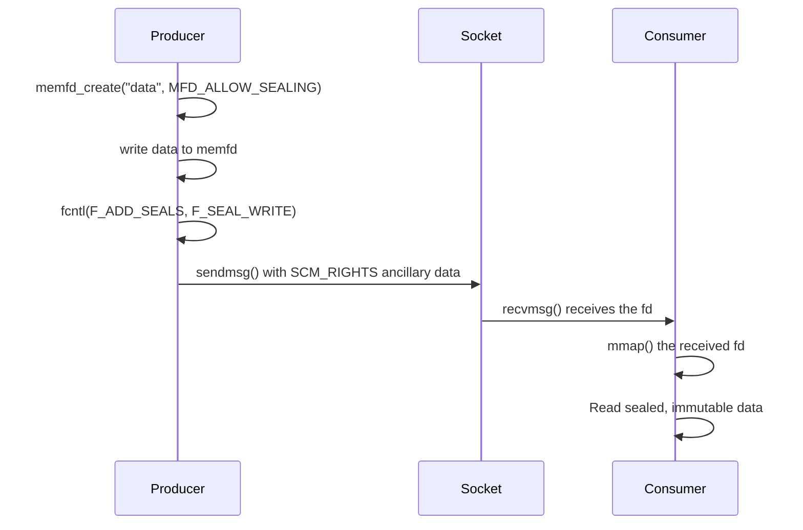
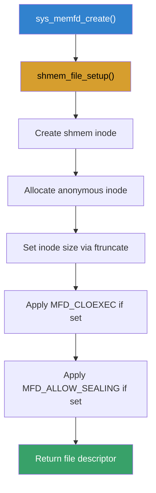
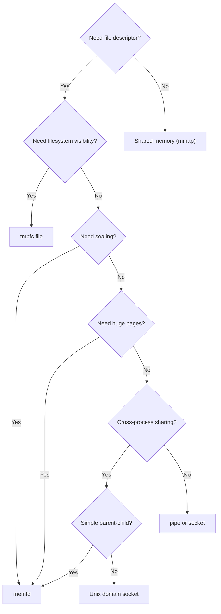

# memfd: Anonymous In-Memory File Descriptors

## Introduction

`memfd` is a Linux kernel feature that creates anonymous, in-memory file descriptors backed by RAM rather than a physical filesystem. Introduced in Linux 3.17 (2014) via the `memfd_create()` system call, memfd provides a powerful mechanism for creating file-like objects that exist only in memory. This is particularly valuable for inter-process communication (IPC), shared memory scenarios, and scenarios requiring file descriptor passing without touching disk.

Key properties of memfd:
- **Anonymous** — no visible path in any filesystem (though `/proc/PID/fd/N` shows it)
- **In-memory** — backed by RAM, never written to disk
- **Sealable** — supports file sealing to prevent modification after creation
- **Sharable** — can be passed between processes via Unix domain sockets

## Why memfd Matters

Before memfd, creating anonymous shared memory required either:
- **POSIX shared memory** (`shm_open()`) — creates files in `/dev/shm`, visible on the filesystem
- **System V shared memory** (`shmget()`) — older API, limited semantics
- **`tmpfs` files** — requires filesystem mounting and cleanup

`memfd` simplifies all of this by providing a clean, file-descriptor-based interface with no filesystem namespace pollution.

## The `memfd_create()` System Call

### Function Signature

```c
#include <sys/mman.h>

int memfd_create(const char *name, unsigned int flags);
```

**Parameters:**
- `name` — an optional name for the memfd (visible in `/proc/PID/fd/`); does not need to be unique
- `flags` — bitfield controlling behavior (see below)

**Return:** a file descriptor on success, or `-1` on error.

### Flags

| Flag | Value | Description |
|------|-------|-------------|
| `MFD_CLOEXEC` | 0x0001 | Set close-on-exec on the new fd |
| `MFD_ALLOW_SEALING` | 0x0002 | Allow file sealing operations on this fd |
| `MFD_HUGETLB` | 0x0004 | Back with huge pages (since Linux 4.14) |
| `MFD_HUGE_2MB` | 0x150 | Use 2 MB huge pages (since Linux 4.14) |
| `MFD_HUGE_1GB` | 0x1E0 | Use 1 GB huge pages (since Linux 4.14) |

### Basic Usage

```c
#include <sys/mman.h>
#include <unistd.h>
#include <stdio.h>
#include <string.h>

int main(void)
{
    /* Create a 4KB anonymous memory-backed fd */
    int fd = memfd_create("my_shared_region", MFD_CLOEXEC);
    if (fd < 0) {
        perror("memfd_create");
        return 1;
    }

    /* Set the size via ftruncate */
    size_t len = 4096;
    if (ftruncate(fd, len) < 0) {
        perror("ftruncate");
        close(fd);
        return 1;
    }

    /* Map it into the address space */
    void *addr = mmap(NULL, len, PROT_READ | PROT_WRITE,
                      MAP_SHARED, fd, 0);
    if (addr == MAP_FAILED) {
        perror("mmap");
        close(fd);
        return 1;
    }

    /* Write data */
    const char *msg = "Hello from memfd!";
    memcpy(addr, msg, strlen(msg) + 1);

    printf("Written: %s\n", (char *)addr);

    /* Cleanup */
    munmap(addr, len);
    close(fd);
    return 0;
}
```

## File Sealing

File sealing is one of the most powerful features of memfd. Once a file is sealed, certain operations are permanently prevented, guaranteeing immutability to all holders of the file descriptor.

### Seal Types

| Seal | Flag Value | Description |
|------|-----------|-------------|
| `F_SEAL_SEAL` | 0x0002 | Prevent further sealing operations |
| `F_SEAL_SHRINK` | 0x0001 | Prevent file from shrinking |
| `F_SEAL_GROW` | 0x0004 | Prevent file from growing |
| `F_SEAL_WRITE` | 0x0008 | Prevent writing to the file |
| `F_SEAL_FUTURE_WRITE` | 0x0010 | Prevent future writes (since Linux 5.1) |

### Sealing Example

```c
#include <sys/mman.h>
#include <sys/fcntl.h>
#include <linux/fcntl.h>
#include <unistd.h>
#include <string.h>
#include <stdio.h>

int main(void)
{
    int fd = memfd_create("sealed_data", MFD_CLOEXEC | MFD_ALLOW_SEALING);
    if (fd < 0) {
        perror("memfd_create");
        return 1;
    }

    /* Write data */
    const char *payload = "Important immutable data";
    write(fd, payload, strlen(payload));

    /* Apply seals: prevent shrinking, growing, and writing */
    unsigned int seals = F_SEAL_SHRINK | F_SEAL_GROW | F_SEAL_WRITE;
    if (fcntl(fd, F_ADD_SEALS, seals) < 0) {
        perror("fcntl F_ADD_SEALS");
        return 1;
    }

    /* Now attempt to write — this will fail with ETXTBSY */
    if (write(fd, "modified", 8) < 0) {
        perror("write after sealing (expected failure)");
    }

    /* Check current seals */
    int current = fcntl(fd, F_GET_SEALS);
    printf("Current seals: 0x%x\n", current);

    close(fd);
    return 0;
}
```

### Why Sealing Matters for IPC

When passing an fd between processes (e.g., parent to child), sealing guarantees:
1. The producer finishes writing before passing the fd
2. The consumer can trust the data won't change
3. No process can grow or shrink the backing object

This is a **trust boundary** mechanism — critical for security-sensitive IPC.

## memfd in Inter-Process Communication

### Passing memfd via Unix Domain Sockets

The standard way to share a memfd between unrelated processes is through `SCM_RIGHTS` ancillary data over a Unix domain socket.



### Producer (server) Example

```c
#include <sys/socket.h>
#include <sys/un.h>
#include <sys/mman.h>
#include <linux/fcntl.h>
#include <unistd.h>
#include <string.h>
#include <stdio.h>

/* Send a file descriptor over a Unix domain socket */
int send_fd(int socket, int fd)
{
    struct msghdr msg = {0};
    struct cmsghdr *cmsg;
    char buf[CMSG_SPACE(sizeof(int))];
    struct iovec io = { .iov_base = "x", .iov_len = 1 };

    msg.msg_iov = &io;
    msg.msg_iovlen = 1;
    msg.msg_control = buf;
    msg.msg_controllen = sizeof(buf);

    cmsg = CMSG_FIRSTHDR(&msg);
    cmsg->cmsg_level = SOL_SOCKET;
    cmsg->cmsg_type = SCM_RIGHTS;
    cmsg->cmsg_len = CMSG_LEN(sizeof(int));
    memcpy(CMSG_DATA(cmsg), &fd, sizeof(fd));

    return sendmsg(socket, &msg, 0);
}

int main(void)
{
    /* Create the memfd */
    int mfd = memfd_create("shared_payload", MFD_CLOEXEC | MFD_ALLOW_SEALING);
    const char *data = "Hello from producer process!";
    write(mfd, data, strlen(data) + 1);

    /* Seal it */
    fcntl(mfd, F_ADD_SEALS, F_SEAL_SHRINK | F_SEAL_GROW | F_SEAL_WRITE);

    /* Set up Unix domain socket */
    int sv[2];
    socketpair(AF_UNIX, SOCK_STREAM, 0, sv);

    /* Send the memfd to the other side */
    send_fd(sv[0], mfd);
    close(mfd);
    close(sv[0]);

    printf("Sent sealed memfd over socketpair\n");
    close(sv[1]);
    return 0;
}
```

### Consumer (client) Example

```c
#include <sys/socket.h>
#include <sys/mman.h>
#include <unistd.h>
#include <string.h>
#include <stdio.h>

/* Receive a file descriptor from a Unix domain socket */
int recv_fd(int socket)
{
    struct msghdr msg = {0};
    struct cmsghdr *cmsg;
    char buf[CMSG_SPACE(sizeof(int))];
    char dummy[1];
    struct iovec io = { .iov_base = dummy, .iov_len = 1 };

    msg.msg_iov = &io;
    msg.msg_iovlen = 1;
    msg.msg_control = buf;
    msg.msg_controllen = sizeof(buf);

    recvmsg(socket, &msg, 0);

    cmsg = CMSG_FIRSTHDR(&msg);
    int fd;
    memcpy(&fd, CMSG_DATA(cmsg), sizeof(fd));
    return fd;
}

int main(void)
{
    /* ... set up socketpair and receive fd ... */
    int mfd = recv_fd(socket_fd);

    /* Map the received memfd */
    off_t size = lseek(mfd, 0, SEEK_END);
    lseek(mfd, 0, SEEK_SET);

    void *addr = mmap(NULL, size, PROT_READ, MAP_SHARED, mfd, 0);
    printf("Received data: %s\n", (char *)addr);

    /* Verify seals are intact */
    int seals = fcntl(mfd, F_GET_SEALS);
    printf("Seals on received fd: 0x%x\n", seals);

    munmap(addr, size);
    close(mfd);
    return 0;
}
```

## memfd and D-Bus

D-Bus, the IPC mechanism used extensively on Linux desktops (GNOME, KDE, systemd), leverages memfd for large data transfers. When a D-Bus message payload exceeds the normal socket buffer, the sender creates a memfd, writes the payload, seals it, and passes the fd via `SCM_RIGHTS`. This avoids repeated serialization overhead.

## memfd and KVM/QEMU

QEMU uses memfd to back guest memory regions, particularly for:
- **Shared memory with guest** — virtio-fs, virtio-gpu
- **Live migration** — transferring VM state between hosts
- **File sealing** — ensuring guest memory integrity

```bash
# Check memfd usage for a QEMU process
ls -la /proc/$(pidof qemu-system-x86_64)/fd/ | grep memfd
```

## memfd in Systemd

`systemd` uses memfd extensively:
- `sd-bus` passes large payloads via sealed memfds
- `systemd-journald` uses memfd for log entry buffers
- `sd_notify()` can pass file descriptors via memfd

```bash
# See memfd usage for a systemd service
cat /proc/$(pidof systemd-journal)/maps | grep memfd
```

## Internal Kernel Implementation

### How memfd_create Works



Internally, `memfd_create()` is implemented using the **shmem** (tmpfs) subsystem:

1. `shmem_file_setup()` creates a temporary shmem-backed inode
2. The inode is anonymous — not linked into any directory
3. Sealing capabilities are set based on the `MFD_ALLOW_SEALING` flag
4. The file descriptor is returned to userspace

The key kernel function chain:
```
sys_memfd_create()
  → do_memfd_create()
    → shmem_file_setup()       # create shmem backing
    → file->f_mode |= seals   # configure sealing
    → fd_install()             # install fd in fdtable
```

### Memory Accounting

memfd memory is accounted to:
- The **creating process's** memory cgroup
- **tmpfs** allocation (uses the same shmem infrastructure)
- Subject to the same limits as `/dev/shm` (unless `MFD_HUGETLB` is used)

```bash
# Check shmem usage (includes memfd)
cat /proc/meminfo | grep Shmem

# Per-process memfd size
grep memfd /proc/<PID>/maps
```

## Practical Examples

### Example 1: Temporary Large Data Buffer

```c
#include <sys/mman.h>
#include <unistd.h>
#include <string.h>
#include <stdio.h>

int main(void)
{
    size_t size = 1ULL << 30; /* 1 GB */

    int fd = memfd_create("large_buffer", MFD_CLOEXEC);
    ftruncate(fd, size);

    void *buf = mmap(NULL, size, PROT_READ | PROT_WRITE,
                     MAP_SHARED, fd, 0);

    /* Use as a large anonymous buffer */
    memset(buf, 0x42, size);
    printf("Allocated %zu bytes in memfd\n", size);

    munmap(buf, size);
    close(fd); /* memory is freed when fd closes */
    return 0;
}
```

### Example 2: Self-Contained Executable

memfd can be used to create an executable entirely in memory:

```c
#include <sys/mman.h>
#include <unistd.h>
#include <stdio.h>

int exec_from_memfd(const char *elf_data, size_t len)
{
    int fd = memfd_create("elf_exec", MFD_CLOEXEC);
    write(fd, elf_data, len);

    /* fexecve() executes from fd */
    char *args[] = {"program", NULL};
    char *envp[] = {NULL};
    fexecve(fd, args, envp);

    /* Only reached on error */
    perror("fexecve");
    return -1;
}
```

This technique is used by:
- **Flatpak** — to execute bundled binaries without extracting to disk
- **AppImage** — to mount and execute from memory
- **Malware** (defensively relevant) — legitimate use in containerized deployments

### Example 3: Zero-Copy Data Pipeline


## Comparison with Other Shared Memory Mechanisms

| Feature | memfd | POSIX shm | SysV shm | tmpfs file |
|---------|-------|-----------|----------|------------|
| Filesystem visible | No (anonymous) | Yes (`/dev/shm/`) | No | Yes |
| Sealable | Yes | No | No | No |
| Passable via SCM_RIGHTS | Yes | Via fd | No | Yes |
| Huge page support | Yes (MFD_HUGETLB) | Yes | Yes | Yes |
| Naming | Optional | Required | Key-based | Required |
| Cleanup | Auto (fd close) | Manual unlink | Manual shmctl | Manual unlink |

## Troubleshooting

### Common Errors

| Error | Cause | Solution |
|-------|-------|----------|
| `EINVAL` | Invalid flags | Check flag values for your kernel version |
| `EMFILE` | Too many open files | Increase `RLIMIT_NOFILE` |
| `ENFILE` | System-wide fd limit | Check `/proc/sys/fs/file-max` |
| `ENOMEM` | Insufficient memory | Check cgroup memory limits |
| `ETXTBSY` | Write on sealed fd | Expected if `F_SEAL_WRITE` is applied |

### Inspecting memfd Usage

```bash
# List all memfds for a process
ls -la /proc/<PID>/fd/ | grep memfd

# Get memfd size
stat /proc/<PID>/fd/<FD>

# View memfd in process memory maps
grep memfd /proc/<PID>/maps

# System-wide shmem usage (includes memfd)
cat /proc/meminfo | grep -i shmem

# Check kernel version supports memfd
uname -r  # >= 3.17
```

### Kernel Configuration

memfd is enabled by `CONFIG_TMPFS` (same as tmpfs/shmem):

```bash
# Check if enabled
zgrep CONFIG_TMPFS /proc/config.gz 2>/dev/null || \
  grep CONFIG_TMPFS /boot/config-$(uname -r)
```

## Security Considerations

### memfd Security Properties

```bash
# memfd provides several security properties:

# 1. No filesystem namespace pollution
#    - Other processes can't open by path
#    - Only accessible via /proc/PID/fd/N or fd passing

# 2. Sealing prevents modification after creation
#    - Trust boundary: producer seals, consumer trusts
#    - Used by Flatpak, D-Bus for safe data transfer

# 3. MFD_CLOEXEC prevents fd leakage to children
#    - Critical for setuid programs

# 4. Memory accounting to creating process's cgroup
#    - Subject to cgroup memory limits
#    - OOM-killer can reclaim memfd memory
```

### memfd for Secure IPC

```c
/* Pattern: untrusted producer, trusted consumer */
int producer(int sock) {
    int fd = memfd_create("payload", MFD_CLOEXEC | MFD_ALLOW_SEALING);
    write(fd, untrusted_data, data_len);

    /* Seal to prevent modification before passing */
    fcntl(fd, F_ADD_SEALS, F_SEAL_SHRINK | F_SEAL_GROW | F_SEAL_WRITE);
    send_fd(sock, fd);
    close(fd);
}

int consumer(int sock) {
    int fd = recv_fd(sock);

    /* Verify seals before trusting data */
    int seals = fcntl(fd, F_GET_SEALS);
    if (!(seals & F_SEAL_WRITE)) {
        /* Reject — not sealed */
        close(fd);
        return -1;
    }

    /* Now safe to read — data is immutable */
    void *addr = mmap(NULL, lseek(fd, 0, SEEK_END),
                      PROT_READ, MAP_SHARED, fd, 0);
    process_data(addr);
}
```

## memfd and Huge Pages

```c
/* Create memfd backed by 2MB huge pages */
int fd = memfd_create("huge", MFD_CLOEXEC | MFD_HUGETLB | MFD_HUGE_2MB);

/* Or 1GB huge pages */
int fd = memfd_create("gigantic", MFD_CLOEXEC | MFD_HUGETLB | MFD_HUGE_1GB);

/* Huge page memfd use cases:
 * - Large shared memory regions (reduced TLB pressure)
 * - VM memory backing (KVM/QEMU)
 * - In-memory databases
 */

/* Check huge page availability */
cat /proc/meminfo | grep -i huge
# HugePages_Total:    1024
# HugePages_Free:      512
# HugePages_Rsvd:      256
# Hugepagesize:       2048 kB
```

## Debugging memfd Issues

### Finding memfd Leaks

```bash
# List all memfds for a process
ls -la /proc/$(pidof myapp)/fd/ | grep memfd
# lrwx------ 1 user user 64 Jul 22 10:00 3 -> /memfd:shared_payload (deleted)

# Count memfds per process
for pid in /proc/[0-9]*/fd; do
    count=$(ls -la $pid 2>/dev/null | grep -c memfd)
    if [ $count -gt 0 ]; then
        echo "$(echo $pid | cut -d/ -f3): $count memfds"
    fi
done | sort -t: -k2 -rn | head

# Get memfd size
stat /proc/$PID/fd/$FD
```

### memfd Memory Accounting

```bash
# memfd memory shows as shmem in /proc/meminfo
cat /proc/meminfo | grep -i shmem
# Shmem:              123456 kB

# Per-process shmem (includes memfd)
grep shmem /proc/$PID/statm

# In cgroup v2
cat /sys/fs/cgroup/app/memory.stat | grep shmem
# shmem 1048576
```

### Troubleshooting Common Issues

```bash
# EMFILE: too many open files
# Fix: increase RLIMIT_NOFILE
ulimit -n 65536

# ENOMEM: cannot allocate memfd
# Cause: cgroup memory limit exceeded
echo 4G > /sys/fs/cgroup/app/memory.max

# ETXTBSY: write on sealed fd
# Cause: F_SEAL_WRITE applied
# Expected — remove seal or create new fd

# EINVAL: invalid flags
# Cause: kernel too old for requested flags
uname -r  # Need >= 3.17, >= 4.14 for HUGETLB, >= 5.1 for F_SEAL_FUTURE_WRITE
```

## memfd vs Alternatives Decision Tree



### Detailed Comparison

| Feature | memfd | POSIX shm | SysV shm | tmpfs file | mmap(MAP_ANONYMOUS) |
|---------|-------|-----------|----------|------------|--------------------|
| Filesystem visible | No (`/proc/PID/fd/` only) | Yes (`/dev/shm/`) | No | Yes | No |
| Sealable | Yes | No | No | No | No |
| Passable via SCM_RIGHTS | Yes | Via fd | No | Yes | No (no fd) |
| Huge page support | Yes (MFD_HUGETLB) | Yes | Yes | Yes | Yes |
| Naming | Optional (for debugging) | Required (path) | Key-based | Required (path) | N/A |
| Cleanup | Auto (fd close) | Manual `shm_unlink` | Manual `shmctl` | Manual `unlink` | Auto (munmap) |
| Cgroup accounting | Yes (shmem) | Yes (shmem) | Yes | Yes (shmem) | Yes (anon) |
| Kernel version | >= 3.17 | All | All | All | All |

### Performance Characteristics

```bash
# memfd vs POSIX shm latency (similar — both use shmem backend)
# Both are backed by the same tmpfs/shmem subsystem
# Performance difference is negligible

# memfd with huge pages vs regular pages:
# 4KB pages: TLB miss ~100ns per miss, 256 entries covers 1MB
# 2MB pages: TLB miss ~100ns per miss, 256 entries covers 512MB
# 1GB pages: TLB miss ~100ns per miss, 256 entries covers 256GB
# For large shared regions, huge pages significantly reduce TLB pressure
```

## Further Reading

- [`memfd_create(2)` man page](https://man7.org/linux/man-pages/man2/memfd_create.2.html)
- [`fcntl(2)` — File Sealing](https://man7.org/linux/man-pages/man2/fcntl.2.html)
- [LWN: memfd_create() and sealing](https://lwn.net/Articles/593918/)
- [LWN: File sealing in the GNU C library](https://lwn.net/Articles/594874/)
- [D-Bus Specification — Unix FD Passing](https://dbus.freedesktop.org/doc/dbus-specification.html)
- [QEMU source — `util/memfd.c`](https://github.com/qemu/qemu)
- [GNU Project Documentation](https://www.gnu.org/doc/doc.html)

## See Also

- [Virtual Memory](./virtual-memory.md) — virtual address space management
- [Shared Memory](./virtual-memory.md#shared-memory) — mmap and shared mappings
- [Huge Pages](./huge-pages.md) — large page backing for memfd
- [Namespaces](../networking/namespaces.md) — isolation context for IPC
- [Pipe and Socket IPC](../sync/completions.md) — synchronization alternatives
- [Message Queues](../../sysprog/ipc/message-queues.md) — alternative IPC mechanism
