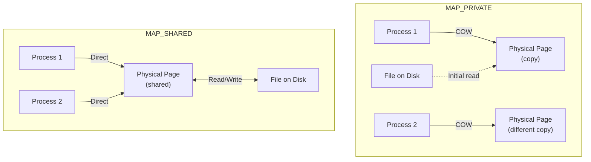
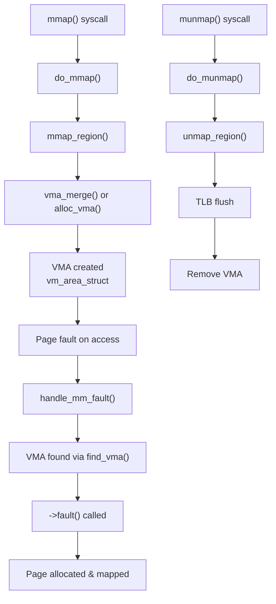

# mmap System Call

## Introduction

The `mmap()` system call is one of the most versatile and powerful interfaces in the Linux memory management subsystem. It maps files or devices into memory, creates anonymous memory regions, enables shared memory between processes, and provides fine-grained control over virtual address space management. Understanding `mmap()` is essential for systems programmers, as it underpins shared libraries, memory-mapped I/O, inter-process communication, and many performance-critical applications.

## mmap Overview

### What mmap Does

`mmap()` creates a new **Virtual Memory Area (VMA)** in the calling process's address space. Depending on the flags, this VMA can:

1. **Map a file**: The file's contents appear at the mapped address.
2. **Create anonymous memory**: No file backing; pages are zero-filled on first access.
3. **Share memory**: Multiple processes can map the same file or shared memory object.
4. **Map devices**: Special files (e.g., `/dev/mem`, GPU memory) can be mapped.

### Function Signature

```c
#include <sys/mman.h>

void *mmap(void *addr, size_t length, int prot, int flags,
           int fd, off_t offset);
```

| Parameter | Description |
|-----------|-------------|
| `addr` | Hint for starting address (usually NULL for kernel to choose) |
| `length` | Size of the mapping in bytes |
| `prot` | Protection flags (PROT_READ, PROT_WRITE, PROT_EXEC, PROT_NONE) |
| `flags` | Behavior flags (MAP_PRIVATE, MAP_SHARED, MAP_ANONYMOUS, etc.) |
| `fd` | File descriptor (-1 for anonymous mappings) |
| `offset` | Offset into the file (must be page-aligned) |

### Return Value

- On success: the mapped virtual address
- On failure: `MAP_FAILED` (which is `(void *)-1`), with `errno` set

## mmap Flags

### Protection Flags (prot)

```c
/* include/uapi/asm-generic/mman-common.h */
#define PROT_NONE       0x0     /* No access */
#define PROT_READ       0x1     /* Read */
#define PROT_WRITE      0x2     /* Write */
#define PROT_EXEC       0x4     /* Execute */
```

### Mapping Flags (flags)

```c
/* include/uapi/asm-generic/mman-common.h */
#define MAP_SHARED      0x01    /* Share changes with other mappings */
#define MAP_PRIVATE     0x02    /* Private copy-on-write mapping */
#define MAP_FIXED       0x10    /* Exact address (replace existing mappings) */
#define MAP_ANONYMOUS   0x20    /* No file backing (fd ignored) */
#define MAP_GROWSDOWN   0x0100  /* Stack-like growth */
#define MAP_LOCKED      0x2000  /* Lock pages in memory (mlock) */
#define MAP_NORESERVE   0x4000  /* Don't reserve swap space */
#define MAP_POPULATE    0x8000  /* Pre-fault all pages */
#define MAP_NONBLOCK    0x10000 /* Don't block on I/O */
#define MAP_STACK       0x20000 /* Suitable for stack */
#define MAP_HUGETLB     0x40000 /* Use huge pages */
#define MAP_FIXED_NOREPLACE 0x100000 /* Like MAP_FIXED but don't replace */
```

### Linux-Specific Flags

```c
/* include/uapi/asm-generic/mman.h */
#define MAP_NORESERVE   0x4000  /* Don't reserve swap */
#define MAP_POPULATE    0x8000  /* Pre-fault pages */
#define MAP_HUGETLB     0x40000 /* Huge page mapping */
#define MAP_SYNC        0x80000 /* DAX synchronous page faults */
#define MAP_FIXED_NOREPLACE 0x100000 /* MAP_FIXED without clobbering */
#define MAP_UNINITIALIZED 0x4000000  /* Don't clear anonymous pages */
```

## Private vs Shared Mappings

### MAP_PRIVATE

A private mapping creates a **copy-on-write** (COW) view of the file. Changes made by the process are **not** written back to the file and are **not** visible to other processes:

```c
/* Private file mapping */
void *addr = mmap(NULL, 4096, PROT_READ | PROT_WRITE,
                  MAP_PRIVATE, fd, 0);

/* Changes are private — not written to file */
memset(addr, 'A', 4096);
```

### MAP_SHARED

A shared mapping creates a shared view. Changes are written back to the file and are visible to all processes that map the same file:

```c
/* Shared file mapping */
void *addr = mmap(NULL, 4096, PROT_READ | PROT_WRITE,
                  MAP_SHARED, fd, 0);

/* Changes are shared — visible to other mappers */
memset(addr, 'B', 4096);
msync(addr, 4096, MS_SYNC);  /* Force writeback */
```

### Comparison



| Aspect | MAP_PRIVATE | MAP_SHARED |
|--------|-------------|------------|
| Visibility | Private to process | Shared across mappers |
| Write-back | No (COW copy) | Yes (to file) |
| Use case | Loading shared libraries | IPC, shared data |
| Modification | Creates private copy on write | Writes affect file and all mappers |
| Fork behavior | COW on fork | Shared between parent/child |

## Anonymous Mappings

Anonymous mappings have no file backing. Pages are zero-filled on first access:

```c
/* Anonymous private mapping (like malloc for large allocations) */
void *addr = mmap(NULL, 4096 * 1024,
                  PROT_READ | PROT_WRITE,
                  MAP_PRIVATE | MAP_ANONYMOUS,
                  -1, 0);

/* Anonymous shared mapping (for IPC without a file) */
void *shared = mmap(NULL, 4096,
                    PROT_READ | PROT_WRITE,
                    MAP_SHARED | MAP_ANONYMOUS,
                    -1, 0);
```

### How Anonymous Pages Work

When an anonymous page is first accessed:
1. Page fault occurs (page not present).
2. Kernel finds the VMA, determines it's anonymous.
3. Allocates a zero-filled physical page.
4. Maps it into the process's address space.

```c
/* mm/memory.c (simplified) */
static vm_fault_t do_anonymous_page(struct vm_fault *vmf)
{
    struct page *page;
    struct folio *folio;

    /* Allocate a zero-filled page */
    folio = vma_alloc_folio(GFP_HIGHUSER_MOVABLE, 0, vmf->vma,
                            vmf->address, false);
    if (!folio)
        return VM_FAULT_OOM;

    /* Clear the page */
    clear_user_highpage(&folio->page, vmf->address);

    /* Map the page into the page table */
    __SetPageUptodate(&folio->page);
    set_pte_at(vmf->vma->vm_mm, vmf->address, vmf->pte,
               mk_pte(&folio->page, vmf->vma->vm_page_prot));

    return 0;
}
```

## File-Backed Mappings

### Reading a File via mmap

```c
#include <stdio.h>
#include <sys/mman.h>
#include <sys/stat.h>
#include <fcntl.h>
#include <unistd.h>

int main(void)
{
    int fd = open("/etc/passwd", O_RDONLY);
    struct stat st;
    fstat(fd, &st);

    /* Map the entire file */
    char *data = mmap(NULL, st.st_size, PROT_READ,
                      MAP_PRIVATE, fd, 0);
    if (data == MAP_FAILED) {
        perror("mmap");
        return 1;
    }

    /* Access file contents directly */
    printf("File size: %ld bytes\n", st.st_size);
    printf("First 100 bytes: %.*s\n", 100, data);

    /* Unmap */
    munmap(data, st.st_size);
    close(fd);
    return 0;
}
```

### Writing to a File via mmap

```c
#include <stdio.h>
#include <string.h>
#include <sys/mman.h>
#include <fcntl.h>
#include <unistd.h>

int main(void)
{
    int fd = open("output.dat", O_RDWR | O_CREAT, 0644);
    ftruncate(fd, 4096);

    /* Map for writing */
    char *data = mmap(NULL, 4096, PROT_READ | PROT_WRITE,
                      MAP_SHARED, fd, 0);
    if (data == MAP_FAILED) {
        perror("mmap");
        return 1;
    }

    /* Write directly to the file through memory */
    strcpy(data, "Hello, mmap!");

    /* Sync to disk */
    msync(data, 4096, MS_SYNC);

    munmap(data, 4096);
    close(fd);
    return 0;
}
```

## VMA Structures

### vm_area_struct (VMA)

Each `mmap()` call creates a `vm_area_struct`:

```c
/* include/linux/mm_types.h (simplified) */
struct vm_area_struct {
    unsigned long vm_start;        /* Start address */
    unsigned long vm_end;          /* End address (exclusive) */
    struct mm_struct *vm_mm;       /* Back-pointer to address space */
    pgprot_t vm_page_prot;         /* Page protection for PTEs */
    unsigned long vm_flags;        /* VM_READ | VM_WRITE | VM_EXEC | ... */

    /* Linked list and red-black tree */
    struct rb_node vm_rb;
    struct vm_area_struct *vm_next, *vm_prev;

    /* For file-backed mappings */
    struct file *vm_file;          /* Backing file (NULL if anonymous) */
    pgoff_t vm_pgoff;              /* Offset in pages within file */

    /* Operations (fault, etc.) */
    const struct vm_operations_struct *vm_ops;

    /* For anonymous mappings */
    struct anon_vma *anon_vma;
    struct list_head anon_vma_chain;
};
```

### VMA Operations

```c
/* include/linux/mm.h */
struct vm_operations_struct {
    void (*open)(struct vm_area_struct *area);
    void (*close)(struct vm_area_struct *area);
    vm_fault_t (*fault)(struct vm_fault *vmf);
    vm_fault_t (*huge_fault)(struct vm_fault *vmf, enum page_entry_size pe_size);
    vm_fault_t (*map_pages)(struct vm_fault *vmf, pgoff_t start_pgoff, pgoff_t end_pgoff);
    unsigned long (*pagesize)(struct vm_area_struct *area);
    /* ... */
};
```

### VMA Lifecycle



## Kernel Implementation

### do_mmap: The Core Function

```c
/* mm/mmap.c (simplified) */
unsigned long do_mmap(struct file *file, unsigned long addr,
                      unsigned long len, unsigned long prot,
                      unsigned long flags, vm_flags_t vm_flags,
                      unsigned long pgoff, unsigned long *populate,
                      struct list_head *uf)
{
    struct mm_struct *mm = current->mm;

    /* 1. Validate parameters */
    if (!len)
        return -EINVAL;

    /* Round up to page boundary */
    len = PAGE_ALIGN(len);
    if (!len)
        return -ENOMEM;

    /* 2. Check for mlock limit */
    if (vm_flags & VM_LOCKED) {
        if (!can_do_mlock())
            return -EPERM;
    }

    /* 3. Find a free virtual address range */
    addr = get_unmapped_area(file, addr, len, pgoff, flags);
    if (IS_ERR_VALUE(addr))
        return addr;

    /* 4. Try to merge with existing VMA */
    vma = vma_merge(mm, addr, addr + len, vm_flags, ...);
    if (vma)
        goto out;

    /* 5. Create new VMA */
    vma = vm_area_alloc(mm);
    vma->vm_start = addr;
    vma->vm_end = addr + len;
    vma->vm_flags = vm_flags;
    vma->vm_page_prot = vm_get_page_prot(vm_flags);
    vma->vm_file = get_file(file);
    vma->vm_pgoff = pgoff;

    /* 6. Call file's mmap handler if present */
    if (file->f_op->mmap) {
        error = file->f_op->mmap(file, vma);
    }

    /* 7. Insert VMA into mm's tree and list */
    vma_link(mm, vma);

out:
    *populate = len;
    return addr;
}
```

### munmap

```c
/* mm/mmap.c (simplified) */
int __do_munmap(struct mm_struct *mm, unsigned long start,
                size_t len, struct list_head *uf)
{
    unsigned long end;
    struct vm_area_struct *vma, *prev, *last;

    end = start + PAGE_ALIGN(len);

    /* Find the first VMA in the range */
    vma = find_vma(mm, start);
    if (!vma || vma->vm_start >= end)
        return 0;  /* Nothing to unmap */

    /* Split VMAs at the boundaries */
    /* ... */

    /* Unmap pages and flush TLB */
    unmap_region(mm, vma, prev, start, end);

    /* Free VMA structures */
    remove_vma_list(mm, vma);

    return 0;
}
```

### VMA Merge Optimization

The kernel tries to merge adjacent VMAs with compatible properties:

```c
/* mm/mmap.c */
static struct vm_area_struct *vma_merge(struct mm_struct *mm,
                                         unsigned long addr,
                                         unsigned long end,
                                         vm_flags_t vm_flags,
                                         struct anon_vma *anon_vma,
                                         struct file *file,
                                         pgoff_t pgoff,
                                         struct mempolicy *policy,
                                         struct vm_userfaultfd_ctx vm_userfaultfd_ctx)
{
    struct vm_area_struct *prev, *next;

    prev = vma_merge_prev(mm, addr, end, vm_flags, anon_vma,
                           file, pgoff);
    next = vma_merge_next(mm, addr, end, vm_flags, anon_vma,
                           file, pgoff);

    if (prev && next)
        return prev;  /* Merged with both neighbors */
    if (prev)
        return prev;  /* Merged with previous */
    if (next)
        return next;  /* Merged with next */

    return NULL;  /* Cannot merge */
}
```

## mmap and the Page Cache

### File-Backed mmap Fault Path

When a file-backed mapping is accessed and the page isn't in memory:

```c
/* mm/filemap.c */
static vm_fault_t filemap_fault(struct vm_fault *vmf)
{
    struct file *file = vmf->vma->vm_file;
    struct address_space *mapping = file->f_mapping;
    struct folio *folio;
    pgoff_t index = vmf->pgoff;

    /* 1. Look up page cache */
    folio = filemap_get_folio(mapping, index);

    if (!folio) {
        /* 2. Cache miss — trigger readahead */
        if (vmf->vma->vm_flags & VM_SEQ_READ)
            page_cache_sync_readahead(mapping, &file->f_ra,
                                      file, index);

        /* 3. Allocate and read from disk */
        folio = filemap_get_folio_gfp(mapping, index,
                                       GFP_KERNEL);
        if (!folio)
            return VM_FAULT_OOM;

        if (!folio_test_uptodate(folio)) {
            mapping->a_ops->read_folio(file, folio);
            folio_wait_locked(folio);
        }
    }

    /* 4. Map into process page table */
    vmf->page = folio_file_page(folio, index);
    return VM_FAULT_LOCKED;
}
```

## Shared Memory via mmap

### POSIX Shared Memory

```c
#include <sys/mman.h>
#include <sys/stat.h>
#include <fcntl.h>
#include <unistd.h>
#include <string.h>

/* Writer process */
int main(void)
{
    int fd = shm_open("/my_shm", O_CREAT | O_RDWR, 0666);
    ftruncate(fd, 4096);

    void *ptr = mmap(NULL, 4096, PROT_READ | PROT_WRITE,
                     MAP_SHARED, fd, 0);

    strcpy(ptr, "Hello from writer!");

    while (1) {
        sleep(1);
        /* Data is automatically visible to readers */
    }

    munmap(ptr, 4096);
    close(fd);
    shm_unlink("/my_shm");
    return 0;
}
```

### Anonymous Shared Memory (fork)

```c
#include <sys/mman.h>
#include <sys/wait.h>
#include <unistd.h>
#include <stdio.h>

int main(void)
{
    /* Create anonymous shared mapping */
    int *shared = mmap(NULL, sizeof(int),
                       PROT_READ | PROT_WRITE,
                       MAP_SHARED | MAP_ANONYMOUS,
                       -1, 0);

    *shared = 0;

    if (fork() == 0) {
        /* Child */
        for (int i = 0; i < 1000; i++)
            (*shared)++;
        _exit(0);
    }

    /* Parent */
    for (int i = 0; i < 1000; i++)
        (*shared)++;

    wait(NULL);
    printf("Shared value: %d\n", *shared);  /* ~2000 */
    return 0;
}
```

## Memory-Mapped I/O

### Device Memory Mapping

```c
#include <sys/mman.h>
#include <fcntl.h>
#include <unistd.h>

/* Map GPU memory or device registers */
int main(void)
{
    int fd = open("/dev/mem", O_RDWR | O_SYNC);

    /* Map 4KB of device registers at physical address 0xFE200000 */
    void *regs = mmap(NULL, 4096, PROT_READ | PROT_WRITE,
                      MAP_SHARED, fd, 0xFE200000);

    /* Read/write device registers directly */
    uint32_t val = *(volatile uint32_t *)(regs + 0x04);
    *(volatile uint32_t *)(regs + 0x08) = 0x01;

    munmap(regs, 4096);
    close(fd);
    return 0;
}
```

### MAP_HUGETLB

```c
/* Map with huge pages */
void *addr = mmap(NULL, 2 * 1024 * 1024,  /* 2 MiB */
                  PROT_READ | PROT_WRITE,
                  MAP_PRIVATE | MAP_ANONYMOUS | MAP_HUGETLB,
                  -1, 0);
```

See [Huge Pages](huge-pages.md) for details.

## mmap Flags for Performance

### MAP_POPULATE

Pre-fault all pages (avoid page faults during access):

```c
/* Pre-fault: all pages loaded at mmap time */
void *addr = mmap(NULL, size, PROT_READ | PROT_WRITE,
                  MAP_PRIVATE | MAP_ANONYMOUS | MAP_POPULATE,
                  -1, 0);
```

### MAP_LOCKED

Lock pages in memory (prevent swapping):

```c
/* Lock pages (requires CAP_IPC_LOCK or RLIMIT_MEMLOCK) */
void *addr = mmap(NULL, size, PROT_READ | PROT_WRITE,
                  MAP_PRIVATE | MAP_ANONYMOUS | MAP_LOCKED,
                  -1, 0);
```

### MAP_NORESERVE

Don't reserve swap space (for large sparse mappings):

```c
/* Large sparse mapping without swap reservation */
void *addr = mmap(NULL, 1UL << 40,  /* 1 TB virtual */
                  PROT_READ | PROT_WRITE,
                  MAP_PRIVATE | MAP_ANONYMOUS | MAP_NORESERVE,
                  -1, 0);
```

### MAP_FIXED_NOREPLACE

```c
/* Map at exact address, but fail if already mapped (safe) */
void *addr = mmap((void *)0x7f0000000000, 4096,
                  PROT_READ | PROT_WRITE,
                  MAP_PRIVATE | MAP_ANONYMOUS | MAP_FIXED_NOREPLACE,
                  -1, 0);
if (addr == MAP_FAILED) {
    /* Address already in use */
}
```

## Related System Calls

### munmap

```c
int munmap(void *addr, size_t length);
```

Unmaps a previously mapped region.

### mprotect

```c
/* Change protection on existing mapping */
int mprotect(void *addr, size_t length, int prot);

/* Example: make a region read-only after initialization */
mprotect(addr, size, PROT_READ);
```

### msync

```c
/* Synchronize a file-backed mapping with disk */
int msync(void *addr, size_t length, int flags);

/* flags:
 * MS_SYNC  — synchronous write (blocks until complete)
 * MS_ASYNC — asynchronous write (returns immediately)
 * MS_INVALIDATE — invalidate cached data
 */
```

### mlock / munlock

```c
/* Lock pages in physical memory (prevent swapping) */
int mlock(const void *addr, size_t length);
int munlock(const void *addr, size_t length);

/* Lock all current and future mappings */
int mlockall(MCL_CURRENT | MCL_FUTURE);
```

### madvise

```c
/* Advise kernel about memory usage patterns */
int madvise(void *addr, size_t length, int advice);

/* advice values:
 * MADV_NORMAL    — Default behavior
 * MADV_RANDOM    — Random access (disable readahead)
 * MADV_SEQUENTIAL — Sequential access (aggressive readahead)
 * MADV_WILLNEED  — Will need soon (prefault)
 * MADV_DONTNEED  — Don't need (free pages, keep mapping)
 * MADV_FREE      — Mark pages as lazy free
 * MADV_HUGEPAGE  — Enable THP for this region
 * MADV_NOHUGEPAGE — Disable THP for this region
 * MADV_DONTDUMP  — Exclude from core dump
 */
```

### mremap

```c
/* Resize an existing mapping */
void *mremap(void *old_address, size_t old_size,
             size_t new_size, int flags, ...);

/* Example: grow a buffer */
buf = mremap(buf, old_size, new_size, MREMAP_MAYMOVE);
```

## Monitoring mmap Usage

### /proc/pid/maps

```bash
$ cat /proc/self/maps | head -10
00400000-0048c000 r-xp 00000000 08:01 131074    /usr/bin/cat
0068b000-0068c000 r--p 0000b000 08:01 131074    /usr/bin/cat
7f8e1a200000-7f8e1a3c2000 r-xp 00000000 08:01 262147 /usr/lib/libc.so.6
```

### /proc/pid/smaps

```bash
$ cat /proc/self/smaps | head -30
00400000-0048c000 r-xp 00000000 08:01 131074     /usr/bin/cat
Size:                560 kB
KernelPageSize:        4 kB
MMUPageSize:           4 kB
Rss:                 416 kB
Pss:                 416 kB
Shared_Clean:          0 kB
Shared_Dirty:          0 kB
Private_Clean:       416 kB
Private_Dirty:         0 kB
Referenced:          416 kB
Anonymous:             0 kB
```

### VMA Count

```bash
# Too many VMAs can cause performance issues
$ cat /proc/<pid>/status | grep VmPeak
VmPeak:   12345678 kB

$ cat /proc/<pid>/maps | wc -l
156
```

## References

- [The Linux Kernel Documentation](https://docs.kernel.org/)
- [GNU Project Documentation](https://www.gnu.org/doc/doc.html)
- [GNU Manuals](https://www.gnu.org/manual/manual.html)
- [Free Software Directory](https://directory.fsf.org/wiki/Main_Page)
- [Planet GNU](https://planet.gnu.org/)
- [Free Software Books](https://www.gnu.org/doc/other-free-books.html)

- **Understanding the Linux Kernel, 3rd Edition** — Chapter 9: Process Address Space
- **Linux System Programming, 2nd Edition** — Robert Love (Chapter 8: Memory Management)
- [Kernel source: mm/mmap.c](https://elixir.bootlin.com/linux/latest/source/mm/mmap.c)
- [Kernel source: mm/filemap.c](https://elixir.bootlin.com/linux/latest/source/mm/filemap.c)
- [Kernel documentation: Memory Mapping](https://www.kernel.org/doc/html/latest/mm/)
- [Gustavo Duarte: Virtual Memory in Linux](https://manybutfinite.com/post/how-the-kernel-manages-your-memory/)
- [LWN: MAP_FIXED_NOREPLACE](https://lwn.net/Articles/732959/)

## Related Topics

- [Virtual Memory](virtual-memory.md) — Page tables, VMA structures
- [Page Cache](page-cache.md) — File-backed page caching
- [Huge Pages](huge-pages.md) — MAP_HUGETLB and THP
- [Swap](swap.md) — Anonymous page swapping
- [Memory Management Overview](overview.md) — High-level overview
