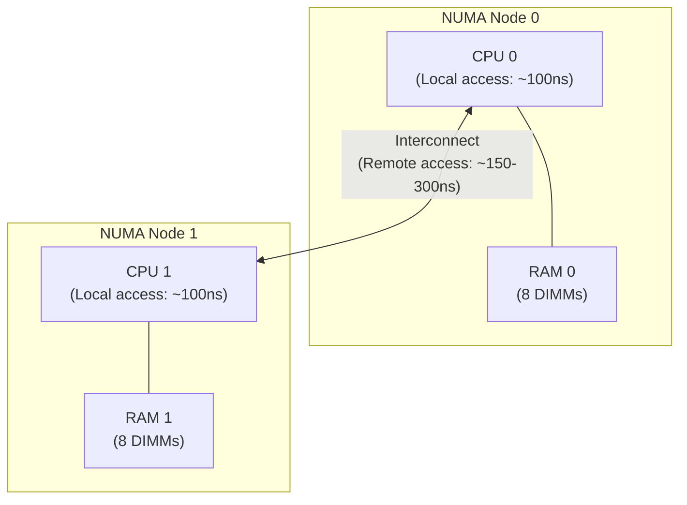
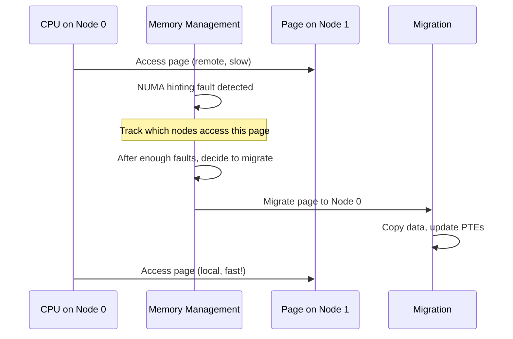

# NUMA Memory

## Introduction

NUMA (Non-Uniform Memory Access) is a memory architecture where the time to access memory depends on which CPU is accessing which memory region. In a NUMA system, each CPU (or group of CPUs) has a "local" memory node that it can access faster than "remote" memory attached to other CPUs. This topology is critical for performance: applications that frequently access remote memory pay a significant latency penalty.

Most modern multi-socket servers are NUMA systems. Even single-socket CPUs with multiple memory controllers (e.g., AMD Zen with multiple CCDs) present NUMA-like behavior. Understanding and optimizing for NUMA is essential for high-performance computing, databases, and latency-sensitive workloads.

## NUMA Architecture

### Physical Topology



### Node Distances

The `numactl` tool shows the NUMA distance matrix:

```bash
$ numactl --hardware
available: 2 nodes (0-1)
node 0 cpus: 0 1 2 3 4 5 6 7 8 9 10 11 12 13 14 15
node 0 size: 32768 MB
node 0 free: 12345 MB
node 1 cpus: 16 17 18 19 20 21 22 23 24 25 26 27 28 29 30 31
node 1 size: 32768 MB
node 1 free: 23456 MB
node distances:
node   0   1
  0:  10  21
  1:  21  10
```

The distance matrix represents relative access latency:
- **10** = local (fastest)
- **21** = remote (slower, ~2x latency)
- Values are relative, not nanoseconds

### Complex NUMA Topology (4-Socket)

```bash
$ numactl --hardware
available: 4 nodes (0-3)
node distances:
node   0   1   2   3
  0:  10  21  31  41
  1:  21  10  21  31
  2:  31  21  10  21
  3:  41  31  21  10
# Notice: distance increases with hop count
```

## NUMA Policies

### Policy Types

```c
/* From include/uapi/linux/mempolicy.h */
enum {
    MPOL_DEFAULT,    /* Use process/system default */
    MPOL_PREFERRED,  /* Prefer a node, fall back to others */
    MPOL_BIND,       /* Bind to specific nodes only */
    MPOL_INTERLEAVE, /* Round-robin across nodes */
    MPOL_LOCAL,      /* Allocate on local node */
    MPOL_PREFERRED_MANY, /* Prefer multiple nodes (5.17+) */
    MPOL_WEIGHTED_INTERLEAVE, /* Weighted interleave (6.9+) */
};
```

### Setting NUMA Policies

```bash
# numactl: set policy for a command
$ numactl --cpunodebind=0 --membind=0 ./myapp
# Run myapp on CPUs from node 0, allocate memory on node 0 only

$ numactl --interleave=all ./myapp
# Interleave memory across all nodes (good for startup/init)

$ numactl --preferred=1 ./myapp
# Prefer node 1, but can use others if node 1 is full

$ numactl --membind=0,1 ./myapp
# Allocate only on nodes 0 and 1

$ numactl --cpunodebind=0 --membind=1 ./myapp
# Run on node 0 CPUs, allocate on node 1 (cross-node, for testing)
```

### Programmatic NUMA Control

```c
#include <numaif.h>
#include <numa.h>
#include <sys/mman.h>

/* Set policy for a specific memory region */
void *ptr = mmap(NULL, size, PROT_READ | PROT_WRITE,
                 MAP_PRIVATE | MAP_ANONYMOUS, -1, 0);

/* Bind this region to node 0 */
unsigned long nodemask = 1 << 0;  /* Node 0 */
mbind(ptr, size, MPOL_BIND, &nodemask, sizeof(nodemask) * 8,
      MPOL_MF_MOVE);

/* Interleave allocation across all nodes */
unsigned long all_nodes = 0x3;  /* Nodes 0 and 1 */
mbind(ptr, size, MPOL_INTERLEAVE, &all_nodes,
      sizeof(all_nodes) * 8, 0);

/* Set default policy for future allocations */
struct bitmask *nodes = numa_allocate_nodemask();
numa_bitmask_setbit(nodes, 0);
numa_set_membind(nodes);

/* Allocate on specific node */
void *local_ptr = numa_alloc_onnode(size, 0);

/* Allocate locally */
void *local = numa_alloc_local(size);

/* Allocate interleaved */
void *interleaved = numa_alloc_interleaved(size);
```

### /proc/<pid>/numa_maps

```bash
# View NUMA memory distribution for a process
$ cat /proc/<pid>/numa_maps
00400000 default file=/usr/bin/myapp mapped=10 N0=5 N1=5
00600000 default file=/usr/bin/myapp anon=1 dirty=1 N0=1
7f1234000000 interleave:0-1 anon=1024 dirty=1024 N0=512 N1=512
7ffc12340000 default anon=32 dirty=32 N0=32

# Fields:
# address policy file/anon pages N0=count N1=count
# N0 = pages on node 0, N1 = pages on node 1
```

## NUMA Balancing

### Automatic NUMA Balancing (Kernel Feature)

The kernel can automatically migrate pages to the node where they are most frequently accessed:



### Configuration

```bash
# Enable/disable automatic NUMA balancing
$ sysctl kernel.numa_balancing
kernel.numa_balancing = 1
# 0 = disabled, 1 = enabled (default)

# Disable for specific workload
$ echo 0 | sudo tee /proc/sys/kernel/numa_balancing

# NUMA balancing scan settings
$ sysctl kernel.numa_balancing_scan_delay_ms
kernel.numa_balancing_scan_delay_ms = 1000

$ sysctl kernel.numa_balancing_scan_period_min_ms
kernel.numa_balancing_scan_period_min_ms = 1000

$ sysctl kernel.numa_balancing_scan_period_max_ms
kernel.numa_balancing_scan_period_max_ms = 60000

$ sysctl kernel.numa_balancing_scan_size_mb
kernel.numa_balancing_scan_size_mb = 256
```

### NUMA Balancing Statistics

```bash
# Check NUMA balancing activity
$ grep -i numa /proc/vmstat
numa_hit 12345678
numa_miss 2345678
numa_foreign 2345678
numa_interleave 12345
numa_local 10000000
numa_other 2345678
numa_pte_updates 567890
numa_huge_pte_updates 12345
numa_hint_faults 89012
numa_hint_faults_local 67890
numa_pages_migrated 45678

# Interpretation:
# numa_hit: allocations on the preferred node
# numa_miss: allocations on non-preferred nodes
# numa_local: allocations on the local node
# numa_pages_migrated: pages moved by NUMA balancing
```

## NUMA in Practice

### Database Tuning (PostgreSQL)

```bash
# Run PostgreSQL with NUMA awareness
$ numactl --interleave=all pg_ctl start
# Interleaving is often better for databases during startup
# because initial data structures span all nodes

# Or bind to specific node
$ numactl --cpunodebind=0 --membind=0 pg_ctl start

# Use pg_numa extension for NUMA-aware memory management
```

### JVM NUMA Support

```bash
# Java NUMA-aware garbage collection
$ java -XX:+UseNUMA -XX:+UseParallelGC -jar app.jar

# G1GC with NUMA
$ java -XX:+UseNUMA -XX:+UseG1GC -jar app.jar
```

### Kernel Compilation

```bash
# Compile kernel on multiple NUMA nodes
$ numactl --interleave=all make -j$(nproc)
# Interleaved allocation prevents one node from being overwhelmed
```

## NUMA Topology Inspection

### Hardware Information

```bash
# Detailed NUMA topology
$ lstopo
# or
$ hwloc-ls

# View NUMA nodes via sysfs
$ ls /sys/devices/system/node/
node0  node1

# Per-node memory info
$ cat /sys/devices/system/node/node0/meminfo
Node 0 MemTotal:       33554432 kB
Node 0 MemFree:        12345678 kB
Node 0 MemUsed:        21208754 kB
Node 0 Active:          8765432 kB
Node 0 Inactive:        5432109 kB

# CPU-to-node mapping
$ cat /sys/devices/system/node/node0/cpulist
0-15

$ cat /sys/devices/system/node/node1/cpulist
16-31
```

### Distance Matrix

```bash
# NUMA distance matrix
$ cat /sys/devices/system/node/node0/distance
10 21

$ cat /sys/devices/system/node/node1/distance
21 10
```

## NUMA Memory Policies in cgroups

```bash
# cgroup v2 NUMA control
$ cat /sys/fs/cgroup/myapp/memory.numa_stat
anon N0=1234 N1=5678
file N0=9012 N1=3456
kernel_stack N0=64 N1=64

# Set NUMA policy for a cgroup
$ echo "bind 0" > /sys/fs/cgroup/myapp/memory.numa_policy
# or via systemd:
# [Service]
# NUMAPolicy=bind
# NUMAMask=0
```

## Implementation Details

### Key Source Files

- **`mm/mempolicy.c`** — NUMA memory policy implementation
- **`mm/migrate.c`** — Page migration for NUMA balancing
- **`mm/memory-failure.c`** — NUMA hinting faults
- **`include/uapi/linux/mempolicy.h`** — Policy definitions
- **`mm/huge_memory.c`** — NUMA huge page handling

### NUMA Hinting Faults

```c
/* Simplified NUMA hinting fault handling */
static int do_numa_page(struct vm_fault *vmf) {
    struct vm_area_struct *vma = vmf->vma;
    struct page *page = vmf->page;
    int nid = page_to_nid(page);
    int last_nid;

    /* Track which node accessed this page */
    last_nid = page_nid_last(page);
    if (nid != last_nid) {
        /* Page accessed from a different node */
        /* Update access tracking */
        task_numa_fault(nid, 1, true);
    }

    /* After enough faults, migrate the page */
    if (should_numa_migrate_memory(task, vma, nid, page)) {
        numa_migrate_prep(page, vma, vmf->address, nid);
        migrate_misplaced_page(page, vma, nid);
    }

    return 0;
}
```

## References

- [NUMA documentation](https://www.kernel.org/doc/html/latest/vm/numa.html)
- [numactl(8) man page](https://man7.org/linux/man-pages/man8/numactl.8.html)
- [mbind(2) man page](https://man7.org/linux/man-pages/man2/mbind.2.html)

## Memory Hotplug

Linux supports adding and removing physical memory at runtime (memory hot(un)plug). This is essential for virtual machines, logical partitions, and systems requiring dynamic memory capacity adjustments without downtime.

### How Memory Hotplug Works

Memory hotplug occurs in two phases:
1. **Adding memory**: Metadata (memmap, page tables) is allocated and initialized, memory blocks are created, and sysfs files appear
2. **Onlining memory blocks**: Memory is exposed to the page allocator and becomes visible in statistics (`/proc/meminfo`)

Memory hotunplug reverses this: first **offline** memory blocks (migrate pages, remove from allocator), then **remove** metadata.

### Granularity

Linux uses the SPARSEMEM memory model. Physical memory is divided into **memory sections** (128 MiB on x86_64, 16 MiB on ppc64). Sections are combined into **memory blocks** — the smallest unit that can be hot(un)plugged.

### Onlining and Offlining

```bash
# View memory blocks
ls /sys/devices/system/memory/
# memory0  memory1  memory2  ...

# Check block state
cat /sys/devices/system/memory/memory42/state
# offline

# Online a memory block
echo online > /sys/devices/system/memory/memory42/state
# Or: echo 1 > /sys/devices/system/memory/memory42/online

# Online to ZONE_MOVABLE (hotpluggable zone)
echo online_movable > /sys/devices/system/memory/memory42/state

# Online to kernel zone (ZONE_NORMAL)
echo online_kernel > /sys/devices/system/memory/memory42/state

# Offline a memory block
echo offline > /sys/devices/system/memory/memory42/state
```

### Auto-Onlining

The kernel can automatically online newly added memory blocks:

```bash
# Check current policy
cat /sys/devices/system/memory/auto_online_blocks
# offline

# Enable auto-onlining
sudo bash -c 'echo online > /sys/devices/system/memory/auto_online_blocks'

# Or via kernel boot parameter: memhp_default_state=online
# Or via systemd: MemoryAccounting=yes in unit file
```

### ACPI Notifications

On ACPI platforms (x86_64), memory hotplug notifications arrive via ACPI:
- Memory device objects with HID "PNP0C80" trigger memory hotplug
- NUMA node objects (HID "ACPI0004", "PNP0A05", "PNP0A06") hotplug entire nodes
- The ACPI driver handles the coordination between firmware and Linux

### ZONE_MOVABLE

`ZONE_MOVABLE` is a zone that only contains movable pages, making it ideal for hotpluggable memory. Memory blocks in ZONE_MOVABLE can always be offlined because all pages are migratable.

```bash
# Check ZONE_MOVABLE size
cat /proc/zoneinfo | grep -A 10 "Node.*zone.*Movable"

# Kernel boot parameter to reserve ZONE_MOVABLE
# kernelcore=nn[KMG]  — amount of non-movable kernel memory
# movablecore=nn[KMG] — amount of movable memory
```

### Use Cases

- **Virtual machines**: Add/remove memory dynamically as workload demands change
- **Capacity on demand**: Cloud providers offer pay-per-use memory scaling
- **Hardware replacement**: Replace failing DIMMs without downtime
- **Energy savings**: Offline unused memory blocks to save power
- **Persistent memory**: PMEM/CXL devices exposed as ordinary RAM via hotplug infrastructure

### Limitations

- Only supported on 64-bit architectures (x86_64, arm64, ppc64, s390x)
- Memory with kernel data (non-movable pages) cannot be offlined
- `ZONE_MOVABLE` ensures hotpluggability but limits what can be allocated there
- Offlining can fail if too many pages are in use and cannot be migrated

## Further Reading

- [The Linux Kernel Documentation](https://docs.kernel.org/)
- [GNU Project Documentation](https://www.gnu.org/doc/doc.html)
- [GNU Manuals](https://www.gnu.org/manual/manual.html)
- [Free Software Directory](https://directory.fsf.org/wiki/Main_Page)
- [Planet GNU](https://planet.gnu.org/)
- [Free Software Books](https://www.gnu.org/doc/other-free-books.html)

- https://www.kernel.org/doc/html/latest/vm/numa.html
- https://man7.org/linux/man-pages/man7/numa.7.html
- https://man7.org/linux/man-pages/man2/set_mempolicy.2.html
- https://man7.org/linux/man-pages/man2/get_mempolicy.2.html
- https://lwn.net/Articles/524977/ — "NUMA scheduling and NUMA memory policy"
- [Memory Hot(Un)Plug Documentation](https://docs.kernel.org/admin-guide/mm/memory-hotplug.html) — Official kernel memory hotplug guide (ACPI, ZONE_MOVABLE, onlining)

## Related Topics

- [zones](./zones.md) — NUMA nodes contain memory zones
- [compaction](./compaction.md) — Per-node compaction
- [barriers](./barriers.md) — NUMA systems need stronger memory barriers
- [ksm](./ksm.md) — `merge_across_nodes` controls NUMA merging
