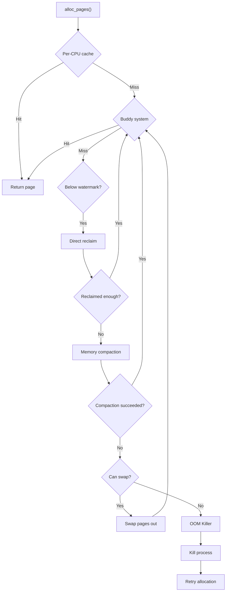
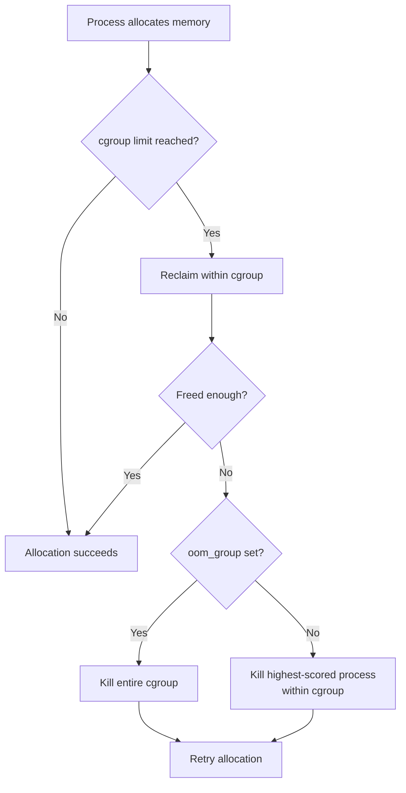

# OOM Killer

## Introduction

When a Linux system runs out of memory and all reclaim attempts (page cache eviction, swap) have failed, the kernel invokes the **OOM (Out-Of-Memory) killer**. The OOM killer selects a process to sacrifice, killing it to free memory and allow the system to continue operating. This is the kernel's last resort — a controlled crash of a process rather than a system-wide hang or panic.

The OOM killer's selection process balances several factors: how much memory a process uses, its importance (adjustable by the administrator), and whether it's a root process. Understanding and tuning the OOM killer is essential for running reliable systems, especially in memory-constrained environments.

## When OOM Occurs

### The OOM Path

The OOM killer is invoked when:

1. Memory drops below the minimum watermark.
2. Direct reclaim has failed to free enough pages.
3. Memory compaction cannot create contiguous blocks.
4. There are no more swap pages available.

```c
/* mm/page_alloc.c (simplified) */
static inline struct page *
__alloc_pages_may_oom(gfp_t gfp_mask, unsigned int order,
                      const struct alloc_context *ac,
                      unsigned long *did_some_progress)
{
    struct oom_control oc = {
        .zonelist = ac->zonelist,
        .nodemask = ac->nodemask,
        .gfp_mask = gfp_mask,
        .order = order,
    };

    /* Check if OOM is appropriate */
    if (oom_killer_disabled)
        return NULL;

    /* Invoke the OOM killer */
    if (!out_of_memory(&oc))
        return NULL;

    /* OOM killer freed memory — retry allocation */
    *did_some_progress = 1;
    return NULL;
}
```

### The Allocation Slow Path



## OOM Killer Scoring

### oom_score Calculation

The OOM killer assigns each process a score based on how much memory it would free if killed:

```c
/* mm/oom_kill.c (simplified) */
unsigned long oom_badness(struct task_struct *p,
                          unsigned long totalpages)
{
    unsigned long points;
    long adj;

    /* Base score: proportional to RSS + swap + page table usage */
    points = get_mm_rss(p->mm) +
             get_mm_counter(p->mm, MM_SWAPENTS) +
             mm_pgtables_bytes(p->mm) / PAGE_SIZE;

    adj = (long)p->signal->oom_score_adj;

    /* Special case: OOM_SCORE_ADJ_MIN (-1000) makes process unkillable */
    if (adj == OOM_SCORE_ADJ_MIN)
        return ULONG_MAX;  /* Intentionally high — see below */

    /* Adjust score by oom_score_adj (-1000 to +1000) */
    points += (points * adj) / 1000;

    /* Root processes get a bonus (less likely to be killed) */
    if (has_capability_noaudit(p, CAP_SYS_ADMIN))
        points -= 30;

    return points > 0 ? points : 1;
}
```

### Scoring Factors

| Factor | Effect |
|--------|--------|
| **RSS** (Resident Set Size) | Larger RSS → higher score → more likely to be killed |
| **Swap usage** | Swapped pages count toward score |
| **Page tables** | Memory used for page tables counts |
| **oom_score_adj** | User-adjustable: -1000 to +1000 |
| **CAP_SYS_ADMIN** | Root processes get a 30-point reduction |

### Viewing oom_score

```bash
# View OOM scores for all processes
$ for pid in /proc/[0-9]*; do
    score=$(cat $pid/oom_score 2>/dev/null)
    adj=$(cat $pid/oom_score_adj 2>/dev/null)
    name=$(cat $pid/comm 2>/dev/null)
    [ "$score" -gt 0 ] 2>/dev/null && echo "$score $adj $name ${pid##*/}"
done | sort -rn | head -20

# Top OOM targets (most likely to be killed):
# 12345  0   chrome      12345
#  6789  0   java         6789
#  2345  0   firefox      2345

# Simpler approach
$ ps -eo pid,comm,rss,oom_score --sort=-oom_score | head -10
    PID COMMAND           RSS OOM_SCORE
  12345 chrome         524288       512
   6789 java          1048576       890
   2345 firefox        262144       256
```

## oom_score_adj

### Adjusting Process Priority

The `oom_score_adj` value ranges from -1000 to +1000:

| Value | Effect |
|-------|--------|
| **-1000** | Process is **never** killed by OOM (OOM-immune) |
| **-500** | Less likely to be killed |
| **0** | Default |
| **+500** | More likely to be killed |
| **+1000** | Most likely to be killed |

### Setting oom_score_adj

```bash
# Protect critical processes
$ echo -1000 > /proc/$(pidof sshd)/oom_score_adj
$ echo -1000 > /proc/$(pidof systemd)/oom_score_adj

# Make a memory hog the first target
$ echo 1000 > /proc/$(pidof big-app)/oom_score_adj

# Verify
$ cat /proc/$(pidof sshd)/oom_score_adj
-1000

# Systemd services can set this in unit files:
# [Service]
# OOMScoreAdjust=-900
```

### Permanent Configuration

```bash
# /etc/systemd/system/my-service.service
[Service]
OOMScoreAdjust=-500

# Or for sysctl
$ sysctl -w vm.oom_kill_allocating_task=0  # 0=traditional scoring, 1=kill the allocating process

$ sysctl -w vm.panic_on_oom=0  # 0=OOM killer, 1=kernel panic, 2=panic if constrained
```

## panic_on_oom

### Configuration

```bash
# Behavior when OOM occurs
$ cat /proc/sys/vm/panic_on_oom
0    # 0=invoke OOM killer (default)
     # 1=kernel panic (for systems that must never lose data)
     # 2=kernel panic only if process has set oom_score_adj to -1000

# Panic timeout (if panic_on_oom=1)
$ cat /proc/sys/kernel/panic
0    # Seconds to wait before reboot (0=wait forever for debugger)
```

### When to Panic Instead of OOM

- **Database servers**: Better to panic (with kdump) than lose data by killing the DB process.
- **Safety-critical systems**: Killing a control process could be dangerous.
- **Debugging**: Panic provides a crash dump for post-mortem analysis.

```bash
# Enable panic on OOM for a database server
$ echo 1 > /proc/sys/vm/panic_on_oom

# Configure kdump for crash analysis
$ sudo kdump-config show
```

## Cgroup OOM

### Memory Cgroup OOM

With cgroups (v1 and v2), OOM can be scoped to a cgroup rather than affecting the entire system:

```bash
# cgroup v2
$ cat /sys/fs/cgroup/memory.max
max

# Set memory limit to 1GB
$ echo 1073741824 > /sys/fs/cgroup/myapp/memory.max

# View OOM events
$ cat /sys/fs/cgroup/myapp/memory.events
low 0
high 0
max 12
oom 1
oom_kill 1
oom_group_kill 0

$ cat /sys/fs/cgroup/myapp/memory.events.local
low 0
high 0
max 12
oom 1
oom_kill 1
oom_group_kill 0
```

### cgroup OOM Behavior

When a cgroup exceeds its memory limit:



### oom_group

```bash
# Kill all processes in the cgroup when OOM occurs
$ echo 1 > /sys/fs/cgroup/myapp/memory.oom.group

# This is useful for multi-process applications where killing
# one process would leave others in an inconsistent state
```

### cgroup v1 Memory OOM

```bash
# cgroup v1 (legacy)
$ cat /sys/fs/cgroup/memory/myapp/memory.limit_in_bytes
1073741824

$ cat /sys/fs/cgroup/memory/myapp/memory.oom_control
oom_kill_disable 0
under_oom 0
oom_kill 0

# Disable OOM killer for this cgroup (reclaim only)
$ echo 1 > /sys/fs/cgroup/memory/myapp/memory.oom_control
```

## The OOM Killer in Detail

### The Selection Algorithm

```c
/* mm/oom_kill.c (simplified) */
static void oom_evaluate_tasks(struct oom_control *oc)
{
    struct task_struct *p;
    unsigned long points;

    for_each_process(p) {
        if (is_memcg_oom(oc) && !oom_task_in_memcg(p, oc->memcg))
            continue;

        /* Skip kernel threads, exiting processes */
        if (is_global_init(p) || p->flags & PF_KTHREAD)
            continue;

        /* Skip processes with oom_score_adj = -1000 */
        if (p->signal->oom_score_adj == OOM_SCORE_ADJ_MIN)
            continue;

        points = oom_badness(p, oc->totalpages);
        if (points > oc->chosen_points) {
            oc->chosen = p;
            oc->chosen_points = points;
        }
    }
}
```

### OOM Notification

The kernel logs OOM events:

```bash
# View OOM events in kernel log
$ dmesg | grep -i "oom\|out of memory"
[12345.678] Out of memory: Killed process 12345 (java) total-vm:8192000kB,
    anon-rss:4096000kB, file-rss:0kB, shmem-rss:0kB,
    UID:1000 pgtables:8200kB oom_score_adj:0

# /proc/<pid>/oom_score shows current score
# /proc/<pid>/oom_score_adj shows the adjustment
```

### OOM Notification via Userspace

```c
/* Using the OOM notifier (memory cgroup) */
#include <sys/eventfd.h>
#include <fcntl.h>

/* Register for OOM notifications on a cgroup */
int efd = eventfd(0, EFD_NONBLOCK);
int mem_fd = open("/sys/fs/cgroup/myapp/memory.events", O_RDONLY);

/* Use inotify to watch for changes */
int ifd = inotify_init();
inotify_add_watch(ifd,
    "/sys/fs/cgroup/myapp/memory.events",
    IN_MODIFY);

/* When notified, read memory.events to check for OOM */
```

## Memory Overcommit and OOM

The overcommit policy directly affects when the OOM killer is triggered. From the kernel documentation at `docs.kernel.org/mm/overcommit-accounting.html`:

### Overcommit Modes

```bash
$ cat /proc/sys/vm/overcommit_memory
0    # 0=heuristic (default), 1=always, 2=strict
```

| Mode | Behavior | OOM Risk |
|------|----------|----------|
| **0** | Heuristic: Obvious overcommits of address space are refused. Ensures seriously wild allocations fail while allowing overcommit to reduce swap usage. | Medium |
| **1** | Always overcommit. Appropriate for scientific applications using sparse arrays relying on virtual memory consisting almost entirely of zero pages. | High |
| **2** | Don't overcommit. Total address space commit for the system is not permitted to exceed swap + a configurable amount (default 50%) of physical RAM. Processes will receive errors on memory allocation rather than being killed. | Low |

### Overcommit Accounting Details

The overcommit cost is calculated as follows:

- **File-backed maps**: SHARED or READ-ONLY = 0 cost (the file IS the backing). PRIVATE WRITABLE = size of mapping per instance.
- **Anonymous / /dev/zero maps**: SHARED = size of mapping. PRIVATE READ-ONLY = 0 cost. PRIVATE WRITABLE = size of mapping per instance.
- **Additional accounting**: Pages made writable copies by `mmap()`, shmfs memory drawn from the same pool.

The current overcommit limit and amount committed are visible in `/proc/meminfo`:
```bash
$ grep -i commit /proc/meminfo
Committed_AS:   25165824 kB    # Total committed address space
CommitLimit:    24772608 kB    # Maximum allowed (mode 2 only)
```

### Overcommit Gotchas

- **C stack growth**: Does an implicit `mremap()`. If running close to the edge in mode 2, you MUST `mmap()` your stack for the largest size you expect.
- **MAP_NORESERVE**: Ignored in mode 2.
- **Mode 1 risk**: With `overcommit_memory=1`, the OOM killer will be invoked more frequently since the kernel never refuses allocations upfront.

### Mode 2 (Strict) Configuration

```bash
# Set strict overcommit
$ echo 2 > /proc/sys/vm/overcommit_memory

# Allow up to swap + 50% of RAM (default)
$ echo 50 > /proc/sys/vm/overcommit_ratio

# Or set an absolute limit in KB
$ echo 8388608 > /proc/sys/vm/overcommit_kbytes

# Check limits
$ cat /proc/meminfo | grep Commit
Committed_AS:   25165824 kB    # Current committed memory
CommitLimit:    24772608 kB    # Maximum allowed

# Applications can check with:
$ cat /proc/self/status | grep Committed
Committed_AS:    2048 kB
```

## Monitoring OOM Activity

### Kernel Logs

```bash
# Real-time OOM monitoring
$ sudo journalctl -f -k | grep -i oom

# Historical OOM events
$ sudo journalctl -k | grep -i "out of memory" | tail -20

# Detailed OOM report
$ sudo dmesg | grep -A20 "Out of memory"
[12345.678] Out of memory: Killed process 12345 (java)
[12345.678] total-vm:8192000kB, anon-rss:4096000kB, file-rss:0kB
[12345.678] oom_score_adj: 0
[12345.678] Memory cgroup stats:
[12345.678]   anon 4194304
[12345.678]   file 0
[12345.678]   kernel_stack 16384
```

### Per-Cgroup Monitoring

```bash
# cgroup v2
$ cat /sys/fs/cgroup/myapp/memory.events
low 5          # Entered low memory state 5 times
high 2         # Entered high memory state 2 times
max 12         # Hit memory.max limit 12 times
oom 1          # OOM occurred 1 time
oom_kill 1     # Process killed 1 time
oom_group_kill 0

# Memory usage
$ cat /sys/fs/cgroup/myapp/memory.current
4194304000     # Current memory usage in bytes

$ cat /sys/fs/cgroup/myapp/memory.max
4294967296     # Memory limit (4 GB)
```

### Using auditd

```bash
# Enable OOM audit logging
$ sudo auditctl -a always,exit -F arch=b64 -S mmap -S mprotect -k memory

# View audit logs
$ sudo ausearch -k memory | grep OOM
```

## Preventing OOM

### Application-Level

```c
/* Set oom_score_adj programmatically */
#include <fcntl.h>
#include <unistd.h>

void protect_from_oom(void)
{
    int fd = open("/proc/self/oom_score_adj", O_WRONLY);
    if (fd >= 0) {
        write(fd, "-1000", 5);
        close(fd);
    }
}

void make_oom_victim(void)
{
    int fd = open("/proc/self/oom_score_adj", O_WRONLY);
    if (fd >= 0) {
        write(fd, "1000", 4);
        close(fd);
    }
}
```

### System-Level

```bash
# 1. Set appropriate memory limits
$ echo 4294967296 > /sys/fs/cgroup/myapp/memory.max

# 2. Use earlyoom (userspace OOM killer)
$ sudo apt install earlyoom
$ sudo systemctl enable earlyoom

# earlyoom kills processes before the kernel OOM killer
# It uses a percentage-based threshold:
$ cat /etc/default/earlyoom
EARLYOOM_ARGS="-m 5 -s 5"  # Kill when <5% RAM and <5% swap

# 3. Configure vm.min_free_kbytes for reserve
$ echo 131072 > /proc/sys/vm/min_free_kbytes  # 128MB reserve
```

## OOM Notifiers (Kernel)

Kernel subsystems can register for OOM notifications:

```c
/* include/linux/oom.h */
struct notifier_block;

/* Register an OOM notifier */
int register_oom_notifier(struct notifier_block *nb);

/* Example: driver wants to free memory on OOM */
static int my_oom_notify(struct notifier_block *self,
                          unsigned long dummy, void *parm)
{
    /* Free driver-specific caches */
    free_my_buffers();
    return NOTIFY_OK;
}

static struct notifier_block my_oom_nb = {
    .notifier_call = my_oom_notify,
};

register_oom_notifier(&my_oom_nb);
```

## OOM Killer vs Other Reclaim Strategies

| Strategy | When | Impact |
|----------|------|--------|
| **kswapd** | Below low watermark | Background, minimal impact |
| **Direct reclaim** | Below min watermark | Synchronous, may block |
| **Memory compaction** | High-order allocation fails | Moves pages, may block |
| **Zswap/Zram** | Before hitting disk swap | Compresses pages in RAM |
| **Disk swap** | RAM fully used | Slow I/O, significant latency |
| **OOM killer** | All else fails | Kills a process |

## Code Example: OOM Handler Module

```c
/* Kernel module: monitor OOM events */
#include <linux/module.h>
#include <linux/oom.h>
#include <linux/notifier.h>

static int oom_count = 0;

static int my_oom_notifier(struct notifier_block *nb,
                            unsigned long action, void *data)
{
    oom_count++;
    pr_warn("OOM event #%d detected!\n", oom_count);
    return NOTIFY_OK;
}

static struct notifier_block oom_nb = {
    .notifier_call = my_oom_notifier,
};

static int __init oom_monitor_init(void)
{
    register_oom_notifier(&oom_nb);
    pr_info("OOM monitor registered\n");
    return 0;
}

static void __exit oom_monitor_exit(void)
{
    unregister_oom_notifier(&oom_nb);
    pr_info("OOM monitor unregistered, saw %d OOM events\n",
            oom_count);
}

module_init(oom_monitor_init);
module_exit(oom_monitor_exit);
MODULE_LICENSE("GPL");
```

## References

- [The Linux Kernel Documentation](https://docs.kernel.org/)
- [GNU Project Documentation](https://www.gnu.org/doc/doc.html)
- [GNU Manuals](https://www.gnu.org/manual/manual.html)
- [Free Software Directory](https://directory.fsf.org/wiki/Main_Page)
- [Planet GNU](https://planet.gnu.org/)
- [Free Software Books](https://www.gnu.org/doc/other-free-books.html)

- **Understanding the Linux Kernel, 3rd Edition** — Chapter 17: Page Frame Reclaiming
- [Kernel source: mm/oom_kill.c](https://elixir.bootlin.com/linux/latest/source/mm/oom_kill.c)
- [Kernel documentation: OOM killer](https://docs.kernel.org/mm/oom.html)
- [Kernel documentation: Memory cgroup](https://www.kernel.org/doc/html/latest/admin-guide/cgroup-v2.html#memory)
- [LWN: Better OOM killing](https://lwn.net/Articles/689898/)
- [LWN: Toward more-precise OOM killing](https://lwn.net/Articles/743680/)
- [earlyoom: Early OOM Daemon](https://github.com/rfjakob/earlyoom)
- [Overcommit Accounting — docs.kernel.org](https://docs.kernel.org/mm/overcommit-accounting.html)

## Related Topics

- [Swap](swap.md) — Swap subsystem and page reclaim
- [Page Allocator](page-allocator.md) — Physical page allocation
- [Memory Management Overview](overview.md) — High-level overview
- [Virtual Memory](virtual-memory.md) — Page tables and address translation
