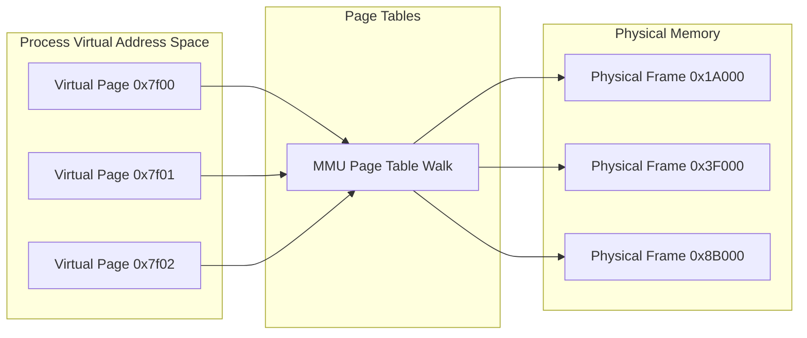
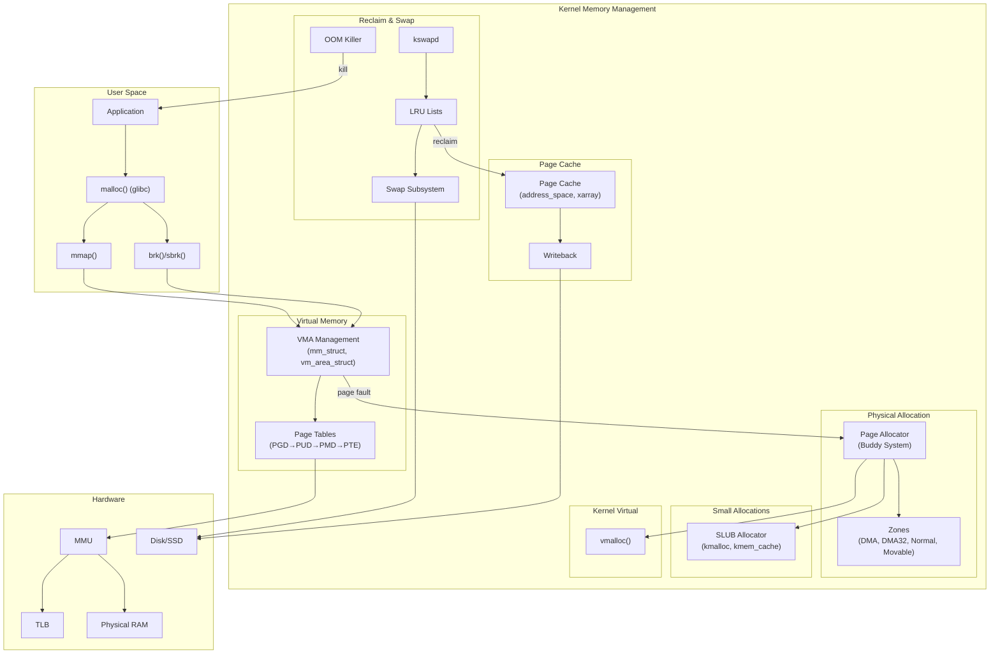

# Memory Management Overview

## Introduction

Memory management is one of the most critical subsystems in the Linux kernel. It is responsible for allocating, tracking, and reclaiming physical memory, providing virtual address spaces to processes, and ensuring efficient utilization of available RAM. The Linux memory management subsystem is a sophisticated blend of hardware abstraction, algorithmic data structures, and heuristic policies that together enable a system to run hundreds or thousands of processes concurrently with each believing it has access to a vast, contiguous address space.

This chapter provides a high-level overview of Linux memory management, covering the distinction between virtual and physical memory, the kernel's own memory layout, and the user-space memory layout on modern systems.

## Virtual Memory vs Physical Memory

### Physical Memory

Physical memory refers to the actual DRAM chips installed in a system. Each byte of physical memory has a unique **physical address**, assigned by the memory controller hardware. On a typical x86_64 system, physical addresses may be up to 52 bits wide (supporting up to 4 PB theoretically), though most systems today ship with 8–256 GB of RAM.

Physical memory is divided into **page frames** — fixed-size blocks (typically 4 KiB on x86_64) that are the fundamental unit of physical memory management. The kernel maintains a `struct page` for every page frame in the system, stored in the **mem_map** array (or equivalent per-node arrays on NUMA systems).

### Virtual Memory

Virtual memory is an abstraction layer that decouples the addresses a process uses from the actual physical locations in RAM. Each process operates in its own **virtual address space**, typically spanning 256 TiB on x86_64 (48-bit virtual addresses, or 128 TiB with 5-level page tables). Virtual addresses are translated to physical addresses by the CPU's **Memory Management Unit (MMU)** using **page tables** maintained by the kernel.

Key benefits of virtual memory include:

- **Isolation**: Processes cannot access each other's memory directly.
- **Demand paging**: Pages are loaded from disk only when accessed.
- **Shared memory**: Multiple processes can map the same physical page.
- **Memory overcommit**: More virtual memory can be promised than physically available.
- **Copy-on-write (COW)**: Forked processes share pages until one writes.



### Address Translation

The translation from virtual to physical address is performed by the MMU using a multi-level page table structure. On x86_64, this is a 4-level (or 5-level) hierarchy:

```
Virtual Address (48-bit):
┌─────────┬─────────┬─────────┬─────────┬──────────┐
│ PGD (9) │ PUD (9) │ PMD (9) │ PTE (9) │ Offset(12)│
└─────────┴─────────┴─────────┴─────────┴──────────┘
```

Each level indexes into a table of 512 entries (2^9), with each entry pointing to the next level. The final PTE contains the physical page frame number. See [Virtual Memory](virtual-memory.md) and [Paging](paging.md) for complete details.

## Kernel Memory Layout

### x86_64 Kernel Address Space

On x86_64, the virtual address space is split between user space and kernel space. With 4-level page tables (48-bit virtual addresses):

```
0xffffffffffffffff ┌──────────────────────┐
                   │                      │
                   │   Kernel Modules     │  (vmalloc area)
                   │                      │
                   ├──────────────────────┤
                   │   vmalloc/ioremap    │
                   ├──────────────────────┤
                   │   Kernel Text        │  (_text → _etext)
                   │   (code + rodata)    │
                   ├──────────────────────┤
                   │   Kernel Data/BSS    │
                   ├──────────────────────┤
                   │   mem_map            │  (struct page array)
                   ├──────────────────────┤
                   │   Direct Mapping     │  (PAGE_OFFSET)
                   │   of All Physical    │
                   │   Memory             │
0xffff800000000000 ├──────────────────────┤
                   │                      │
                   │   Non-canonical      │  (address hole)
                   │   Addresses          │
0x00007fffffffffff ├──────────────────────┤
                   │   User Space         │
0x0000000000000000 └──────────────────────┘
```

### Key Kernel Memory Regions

| Region | Virtual Address Range | Purpose |
|--------|----------------------|---------|
| **Direct Map** (`PAGE_OFFSET`) | `0xffff888000000000` → +physical RAM size | 1:1 linear mapping of all physical memory |
| **Kernel Text** | `0xffffffff80000000` → `+text_size` | Kernel code, read-only data |
| **vmalloc** | `0xffffc90000000000` → `+64 TiB` | Non-contiguous kernel allocations |
| **Kernel Modules** | `0xffffffffa0000000` → `+1536 MB` | Loadable kernel modules |
| **Fixmap** | `0xffffffffff500000` → `+1 MB` | Compile-time fixed addresses (IO APIC, etc.) |

The direct mapping (also called the **linear mapping**) is the simplest kernel memory region. It maps all physical RAM into the kernel's virtual address space at a fixed offset:

```c
/* arch/x86/include/asm/page_64.h */
#define PAGE_OFFSET     ((unsigned long)__PAGE_OFFSET)

/* The kernel virtual address of a physical address: */
#define __va(x)         ((void *)((unsigned long)(x) + PAGE_OFFSET))

/* The physical address of a kernel virtual address: */
#define __pa(x)         ((unsigned long)(x) - PAGE_OFFSET)
```

### Kernel Memory Allocation Methods

| Function | Use Case | Backing |
|----------|----------|---------|
| `kmalloc()` | Small, physically contiguous allocations | SLUB allocator → page allocator |
| `vmalloc()` | Large, virtually contiguous allocations | Page allocator (non-contiguous physical) |
| `__get_free_pages()` | Raw page allocation | Buddy system allocator |
| `alloc_pages()` | NUMA-aware page allocation | Buddy system with node/zone selection |
| `kmem_cache_alloc()` | Fixed-size object pools | SLUB slab allocator |
| `ioremap()` | Map device memory into kernel space | Page table manipulation |

## User Memory Layout

### Standard Linux Process Memory Map

Every user-space process has its own virtual address space. The typical layout on x86_64 Linux is:

```
0xffffffffffffffff ┌──────────────────────┐
                   │  Kernel Space        │  (not accessible from user)
0x00007fffffffffff ├──────────────────────┤
                   │  Stack        ↓      │  (grows downward)
                   │  ...                 │  (with ASLR randomization)
                   ├──────────────────────┤
                   │  Memory Mappings     │  (mmap, shared libs)
                   │  (shared libraries)  │
                   ├──────────────────────┤
                   │  Heap          ↑     │  (brk/sbrk, grows upward)
                   ├──────────────────────┤
                   │  BSS                 │  (uninitialized globals)
                   ├──────────────────────┤
                   │  Data                │  (initialized globals)
                   ├──────────────────────┤
                   │  Text                │  (executable code, read-only)
0x0000000000400000 ├──────────────────────┤
                   │  NULL Guard Page     │  (unmapped, catches NULL derefs)
0x0000000000000000 └──────────────────────┘
```

### Examining a Process Memory Map

You can inspect any process's memory layout using `/proc/<pid>/maps`:

```bash
$ cat /proc/self/maps
00400000-0048c000 r-xp 00000000 08:01 131074     /usr/bin/cat
0068b000-0068c000 r--p 0000b000 08:01 131074     /usr/bin/cat
0068c000-0068d000 rw-p 0000c000 08:01 131074     /usr/bin/cat
02396000-023b7000 rw-p 00000000 00:00 0          [heap]
7f8e1a200000-7f8e1a3c2000 r-xp 00000000 08:01 262147 /usr/lib/libc.so.6
7f8e1a3c2000-7f8e1a5c1000 ---p 001c2000 08:01 262147 /usr/lib/libc.so.6
7f8e1a5c1000-7f8e1a5c5000 r--p 001c1000 08:01 262147 /usr/lib/libc.so.6
7f8e1a5c5000-7f8e1a5c7000 rw-p 001c5000 08:01 262147 /usr/lib/libc.so.6
7f8e1a5c7000-7f8e1a5cd000 rw-p 00000000 00:00 0
7ffcd4e78000-7ffcd4e99000 rw-p 00000000 00:00 0          [stack]
7ffcd4ef0000-7ffcd4ef3000 r--p 00000000 00:00 0          [vvar]
7ffcd4ef3000-7ffcd4ef4000 r-xp 00000000 00:00 0          [vdso]
ffffffffff600000-ffffffffff601000 r-xp 00000000 00:00 0  [vsyscall]
```

The format is: `address-range perms offset dev inode pathname`

- **r**: readable, **w**: writable, **x**: executable, **p**: private (COW), **s**: shared
- **[heap]**: process heap (managed by `brk()`/`sbrk()`)
- **[stack]**: main thread stack
- **[vvar]**: kernel variables mapped read-only into user space (time, etc.)
- **[vdso]**: virtual dynamic shared object (fast syscalls)
- **[vsyscall]**: legacy fast syscall page

### Detailed Memory Statistics

```bash
$ cat /proc/self/status | grep -i vm
VmPeak:     4560 kB    # Peak virtual memory size
VmSize:     4560 kB    # Current virtual memory size
VmLck:         0 kB    # Locked memory
VmPin:         0 kB    # Pinned memory
VmHWM:       420 kB    # Peak resident set size ("high water mark")
VmRSS:       420 kB    # Current resident set size
VmData:      192 kB    # Data + stack segment size
VmStk:       132 kB    # Stack size
VmExe:       348 kB    # Text (code) size
VmLib:      1568 kB    # Shared library size
VmPTE:        40 kB    # Page table entries size
VmSwap:        0 kB    # Swapped-out memory
```

### smaps: Detailed Per-VMA Breakdown

For more granular information, `/proc/<pid>/smaps` provides per-VMA details:

```bash
$ head -20 /proc/self/smaps
00400000-0048c000 r-xp 00000000 08:01 131074     /usr/bin/cat
Size:                560 kB
KernelPageSize:        4 kB
MMUPageSize:           4 kB
Rss:                 416 kB
Pss:                 416 kB
Shared_Clean:          0 kB
Shared_Dirty:          0 kB
Private_Clean:       416 kB
Private_Dirty:         0 kB
Referenced:          416 kB
Anonymous:             0 kB
LazyFree:              0 kB
AnonHugePages:         0 kB
ShmemPmdMapped:        0 kB
Shared_Hugetlb:        0 kB
Private_Hugetlb:       0 kB
Swap:                  0 kB
SwapPss:               0 kB
Locked:                0 kB
```

## ASLR (Address Space Layout Randomization)

Linux implements ASLR to make memory corruption exploits harder. When enabled, the following regions are randomized:

```bash
$ cat /proc/sys/kernel/randomize_va_space
2    # 0=disabled, 1=conservative, 2=full (default)
```

With full ASLR:
- **Stack base**: randomized with ~28 bits of entropy (256 TiB area on x86_64)
- **mmap base**: randomized with ~28 bits of entropy
- **Heap (brk) base**: randomized with ~13 bits of entropy (8 MiB offset)
- **PIE binaries**: base address randomized

```bash
# Observe ASLR in action - run ldd twice, addresses change:
$ ldd /usr/bin/cat
    linux-vdso.so.1 (0x00007ffd3a5f8000)
    libc.so.6 => /usr/lib/libc.so.6 (0x00007f45c8200000)
    /lib64/ld-linux-x86-64.so.2 (0x00007f45c8600000)

$ ldd /usr/bin/cat
    linux-vdso.so.1 (0x00007ffe1b3fe000)
    libc.so.6 => /usr/lib/libc.so.6 (0x00007f8a1c600000)
    /lib64/ld-linux-x86-64.so.2 (0x00007f8a1ca00000)
```

## NUMA (Non-Uniform Memory Access)

On multi-socket systems, memory is organized into NUMA nodes. Each CPU has faster access to its local node's memory:

```bash
$ numactl --hardware
available: 2 nodes (0-1)
node 0 cpus: 0 1 2 3 4 5 6 7
node 0 size: 32768 MB
node 0 free: 12345 MB
node 1 cpus: 8 9 10 11 12 13 14 15
node 1 size: 32768 MB
node 1 free: 15678 MB
node distances:
node   0   1
  0:  10  21
  1:  21  10
```

The kernel's memory allocator respects NUMA topology, attempting to allocate memory from the node local to the requesting CPU. See [Page Allocator](page-allocator.md) for details on NUMA-aware allocation.

## Memory Zones

Physical memory is divided into **zones** that represent ranges with different properties. On x86_64:

| Zone | Range | Purpose |
|------|-------|---------|
| `ZONE_DMA` | 0–16 MB | ISA DMA devices (legacy) |
| `ZONE_DMA32` | 0–4 GB | 32-bit DMA devices |
| `ZONE_NORMAL` | Directly mapped | Regular kernel allocations |
| `ZONE_MOVABLE` | Varies | Hotpluggable memory, anti-fragmentation |
| `ZONE_HIGHMEM` | N/A | Not used on 64-bit (all memory is directly mapped) |

```bash
$ cat /proc/zoneinfo | head -30
Node 0, zone      DMA
  pages free     3973
        boost    0
        min      15
        low      18
        high     21
        spanned  4095
        present  3975
        managed  3973
        cma      0
        protection: (0, 2116, 3570, 3570, 3570)
```

## The struct page: Metadata for Every Physical Page

The kernel tracks every physical page frame using `struct page`. On a system with 16 GB RAM, there are ~4 million pages, each requiring a `struct page` (typically 64 bytes). This is the largest single data structure in the kernel.

```c
/* include/linux/mm_types.h (simplified) */
struct page {
    unsigned long flags;          /* Page flags (PG_locked, PG_dirty, etc.) */
    union {
        struct {
            union {
                struct list_head lru;    /* LRU list linkage */
                struct {                 /* SLUB */
                    slab_t *slab;
                    void *freelist;
                    /* ... */
                };
            };
            struct address_space *mapping; /* Mapped file */
            pgoff_t index;                 /* Offset within mapping */
            unsigned long private;         /* FS-private data */
        };
        /* Other unions for different page states */
    };
    atomic_t _refcount;           /* Reference count */
    atomic_t _mapcount;           /* Page table mappings */
};
```

Key page flags are defined in `include/linux/page-flags.h`:

```c
enum pageflags {
    PG_locked,        /* Page is locked (I/O in progress) */
    PG_referenced,    /* Page has been recently accessed */
    PG_dirty,         /* Page has been written to */
    PG_lru,           /* Page is on an LRU list */
    PG_active,        /* Page is on the active LRU list */
    PG_slab,          /* Page is managed by the SLAB allocator */
    PG_reserved,      /* Page is reserved (kernel, firmware) */
    PG_swapbacked,    /* Page has swap backing */
    PG_swapcache,     /* Page is in swap cache */
    __NR_PAGEFLAGS
};
```

## Key Kernel Data Structures

### Memory Descriptor (mm_struct)

Each process has one `mm_struct` representing its entire address space:

```c
/* include/linux/mm_types.h (simplified) */
struct mm_struct {
    struct vm_area_struct *mmap;        /* List of VMAs */
    struct rb_root mm_rb;               /* VMA red-black tree */
    pgd_t *pgd;                         /* Page global directory (top-level page table) */
    atomic_t mm_users;                  /* Number of processes sharing this mm */
    atomic_t mm_count;                  /* Reference count */
    int map_count;                      /* Number of VMAs */
    unsigned long total_vm;             /* Total pages mapped */
    unsigned long locked_vm;            /* Locked pages */
    unsigned long data_vm;              /* VM_DATA pages */
    unsigned long stack_vm;             /* VM_STACK pages */
    unsigned long start_code, end_code; /* Text segment bounds */
    unsigned long start_data, end_data; /* Data segment bounds */
    unsigned long start_brk, brk;       /* Heap bounds */
    unsigned long start_stack;          /* Stack start */
    /* ... many more fields for RSS tracking, NUMA policy, etc. */
};
```

### VM Area (vm_area_struct)

Each contiguous region of a process's address space with uniform permissions is represented by a `vm_area_struct` (VMA). See [mmap](mmap.md) for the full treatment.

## Monitoring Memory: Key Files and Tools

### System-Wide Memory Info

```bash
$ free -h
              total        used        free      shared  buff/cache   available
Mem:           31Gi        12Gi       2.1Gi       512Mi        17Gi        18Gi
Swap:         8.0Gi       256Mi       7.7Gi
```

| Field | Meaning |
|-------|---------|
| **total** | Total installed RAM |
| **used** | Memory actively used by processes |
| **free** | Completely unused memory |
| **shared** | Memory used by `tmpfs` |
| **buff/cache** | Buffer and page cache memory |
| **available** | Estimated memory available for new allocations (free + reclaimable cache) |

### /proc/meminfo Deep Dive

```bash
$ cat /proc/meminfo
MemTotal:       32768000 kB    # Total usable RAM
MemFree:         2150400 kB    # Completely free
MemAvailable:   18874368 kB    # Estimated available (free + reclaimable)
Buffers:          524288 kB    # Block device buffer cache
Cached:         17825792 kB    # Page cache
SwapCached:       131072 kB    # Swap cache (pages in both RAM and swap)
Active:         12582912 kB    # Recently used (on active LRU list)
Inactive:       10485760 kB    # Not recently used (on inactive LRU list)
Dirty:            262144 kB    # Modified pages waiting to be written back
Writeback:             0 kB    # Currently being written back
AnonPages:       8388608 kB    # Anonymous (non-file-backed) pages
Mapped:          3145728 kB    # Memory-mapped files
Slab:            1048576 kB    # Kernel slab allocator memory
SReclaimable:     786432 kB    # Reclaimable slab memory
SUnreclaim:       262144 kB    # Unreclaimable slab memory
PageTables:       196608 kB    # Page table memory
SwapTotal:       8388608 kB    # Total swap space
SwapFree:        8126464 kB    # Free swap space
Committed_AS:   25165824 kB    # Committed address space (overcommit)
```

## Linux Memory Management: The Big Picture



## Initialization: How Memory Management Boots

During boot, the kernel initializes memory management in stages:

1. **Early boot**: BIOS/UEFI provides a memory map. The kernel's `setup_arch()` parses it.
2. **Paging initialization**: `init_mem_mapping()` sets up the direct mapping of physical memory.
3. **Zone initialization**: `free_area_init()` creates zones and initializes the buddy allocator.
4. **SLUB initialization**: `kmem_cache_init()` creates the first slab caches.
5. **vmalloc initialization**: `vm_area_init()` prepares the vmalloc address range.
6. **Per-CPU page caches**: Per-CPU page caches (PCP) are initialized for fast allocation.

```c
/* mm/page_alloc.c (simplified) */
void __init mem_init(void)
{
    /* Mark reserved pages, calculate total free pages */
    /* ... */
    printk(KERN_INFO "Memory: %luK/%luK available\n",
           nr_free_pages() << (PAGE_SHIFT - 10),
           totalram_pages() << (PAGE_SHIFT - 10));
}
```

## Memory Overcommit

Linux allows **memory overcommit** — allocating more virtual memory than physically available. The policy is controlled by:

```bash
$ cat /proc/sys/vm/overcommit_memory
0    # 0=heuristic (default), 1=always, 2=strict

$ cat /proc/sys/vm/overcommit_ratio
50   # % of RAM allowed in mode 2 (swap + RAM * ratio)
```

| Mode | Behavior |
|------|----------|
| **0** (heuristic) | Kernel uses heuristics to refuse obviously excessive allocations |
| **1** (always) | All allocations succeed; OOM killer handles the fallout |
| **2** (strict) | Total commit limited to swap + RAM × overcommit_ratio |

With `overcommit_memory=2`, you can check current committed memory:

```bash
$ cat /proc/meminfo | grep Commit
Committed_AS:   25165824 kB    # Total committed virtual memory
CommitLimit:    24772608 kB    # Maximum allowed commit
```

## DAMON: Data Access MONitoring

Linux includes DAMON (Data Access MONitoring), a kernel subsystem for efficient data access monitoring and access-aware system operations. DAMON is designed to be accurate (for DRAM-level memory management), light-weight (for production online usage), scalable (in terms of memory size), tunable, and automated.

### How DAMON Works

DAMON monitors memory access patterns by periodically sampling which memory regions are being accessed. It uses a region-based approach: instead of tracking every page, it groups adjacent pages with similar access patterns into regions, then monitors regions at configurable granularity.

Key characteristics:
- **Regions**: DAMON groups memory into regions and tracks access frequency per region
- **Sampling**: Periodically checks access bits in page tables to determine which regions are hot (frequently accessed) or cold (rarely accessed)
- **Adaptive**: Automatically adjusts region boundaries as access patterns change
- **Low overhead**: Designed for production use with minimal performance impact (< 1%)

### DAMOS (DAMON-based Operation Schemes)

DAMON can not only monitor but also take automated actions based on access patterns:
- **Page demotion**: Automatically move cold pages from fast memory (DRAM) to slow memory (CXL, PMEM)
- **Proactive reclaim**: Reclaim cold pages before memory pressure occurs
- **Memory tiering**: Place hot pages on fast nodes and cold pages on slow nodes

### User-Space Interface

DAMON exposes its interface through:
- **DAMON sysfs interface** (`/sys/kernel/mm/damon/`): Configure monitoring targets, parameters, and operation schemes
- **DAMON debugfs interface** (legacy): Older interface for configuration
- **`damo` userspace tool**: Python-based CLI for easy DAMON management

```bash
# Check if DAMON is available
ls /sys/kernel/mm/damon/
# admin  nr_kdamonds

# Configure and run DAMON via sysfs
# (see admin-guide/mm/damon/ for full details)
```

### Use Cases
- **Memory tiering**: Automatically promote hot pages to fast DRAM and demote cold pages to CXL/PMEM
- **Proactive reclaim**: Reclaim cold memory before the OOM killer activates
- **Workload characterization**: Understand which parts of an application's memory are actively used
- **Energy efficiency**: Reduce power by moving cold memory to low-power DIMMs

## HMM (Heterogeneous Memory Management)

From the [kernel HMM documentation](https://docs.kernel.org/mm/hmm.html), HMM provides
infrastructure to integrate non-conventional memory (like GPU onboard memory) into the
kernel's regular memory management path. The cornerstone is using specialized `struct page`
for device memory.

### The Problem HMM Solves

Devices with large onboard memory (GPUs, accelerators) historically managed memory through
dedicated driver APIs, creating a **split address space** where:
- Application memory (malloc, mmap) and device memory are separate
- Complex data structures must be duplicated and pointer relationships remapped
- Libraries cannot transparently use data from other libraries or the core program
- Compilers cannot leverage devices without explicit programmer intervention

### HMM Design

HMM provides two main features:

1. **Address space mirroring**: Duplicates the CPU page table into the device page table,
   so the same virtual address points to the same physical memory on both CPU and device.
   Uses `mmu_interval_notifier` to track CPU page table updates.

2. **DEVICE_PRIVATE memory** (ZONE_DEVICE): Allocates `struct page` for device memory
   pages. The CPU cannot map these directly, but they integrate with existing mm mechanisms.
   Migration to/from device memory uses the standard migration path — from the CPU's
   perspective, a migrated page looks like it was swapped out.

### Key API

```c
/* Register for page table change notifications */
int mmu_interval_notifier_insert(struct mmu_interval_notifier *interval_sub,
                                 struct mm_struct *mm, unsigned long start,
                                 unsigned long length,
                                 const struct mmu_interval_notifier_ops *ops);

/* Populate device page table (triggers CPU page faults if needed) */
int hmm_range_fault(struct hmm_range *range);
```

### Shared Virtual Memory (SVM)

HMM enables SVM — any valid CPU pointer is also a valid device pointer. This simplifies
heterogeneous computing where GPUs, DSPs, or FPGAs perform computations on behalf of a
process. Any CPU access to a device-migrated page triggers a page fault and migration
back to main memory.

### Use Cases

- **GPU computing**: CUDA/ROCm-style unified memory
- **AI/ML accelerators**: Transparent tensor memory management
- **FPGA compute**: Device-side memory with CPU accessibility
- **CXL devices**: Memory expanders with heterogeneous access latency

## References

- [The Linux Kernel Documentation](https://docs.kernel.org/)
- [GNU Project Documentation](https://www.gnu.org/doc/doc.html)
- [GNU Manuals](https://www.gnu.org/manual/manual.html)
- [Free Software Directory](https://directory.fsf.org/wiki/Main_Page)
- [Planet GNU](https://planet.gnu.org/)
- [Free Software Books](https://www.gnu.org/doc/other-free-books.html)

- **Understanding the Linux Kernel, 3rd Edition** — Daniel P. Bovet, Marco Cesati (O'Reilly, 2005)
- **Linux Kernel Development, 3rd Edition** — Robert Love (Addison-Wesley, 2010)
- **Linux Device Drivers, 3rd Edition** — Jonathan Corbet, Alessandro Rubini, Greg Kroah-Hartman
- [Kernel documentation: Memory Management](https://www.kernel.org/doc/html/latest/admin-guide/mm/index.html)
- [Kernel documentation: boot-time-mm](https://www.kernel.org/doc/html/latest/mm/boot-time-mm.html)
- [DAMON Documentation](https://docs.kernel.org/mm/damon/index.html) — DAMON design, API, and administration guide
- [Memory Management Documentation](https://docs.kernel.org/mm/index.html) — Official kernel MM documentation
- [LWN: Memory Management](https://lwn.net/Kernel/Index/#Memory_management)

## Related Topics

- [Virtual Memory](virtual-memory.md) — Page tables, TLB, and address translation
- [Paging](paging.md) — x86_64 paging structures and flags
- [Page Allocator](page-allocator.md) — Buddy system and zone-based allocation
- [Slab Allocator](slab-allocator.md) — SLUB, kmalloc, and object caching
- [vmalloc vs kmalloc](vmalloc-kmalloc.md) — Kernel memory allocation APIs
- [Page Cache](page-cache.md) — File caching and writeback
- [Swap](swap.md) — Swap subsystem and page reclaim
- [OOM Killer](oom-killer.md) — Out-of-memory handling
- [mmap](mmap.md) — Memory mapping system call
- [Huge Pages](huge-pages.md) — Large page support
