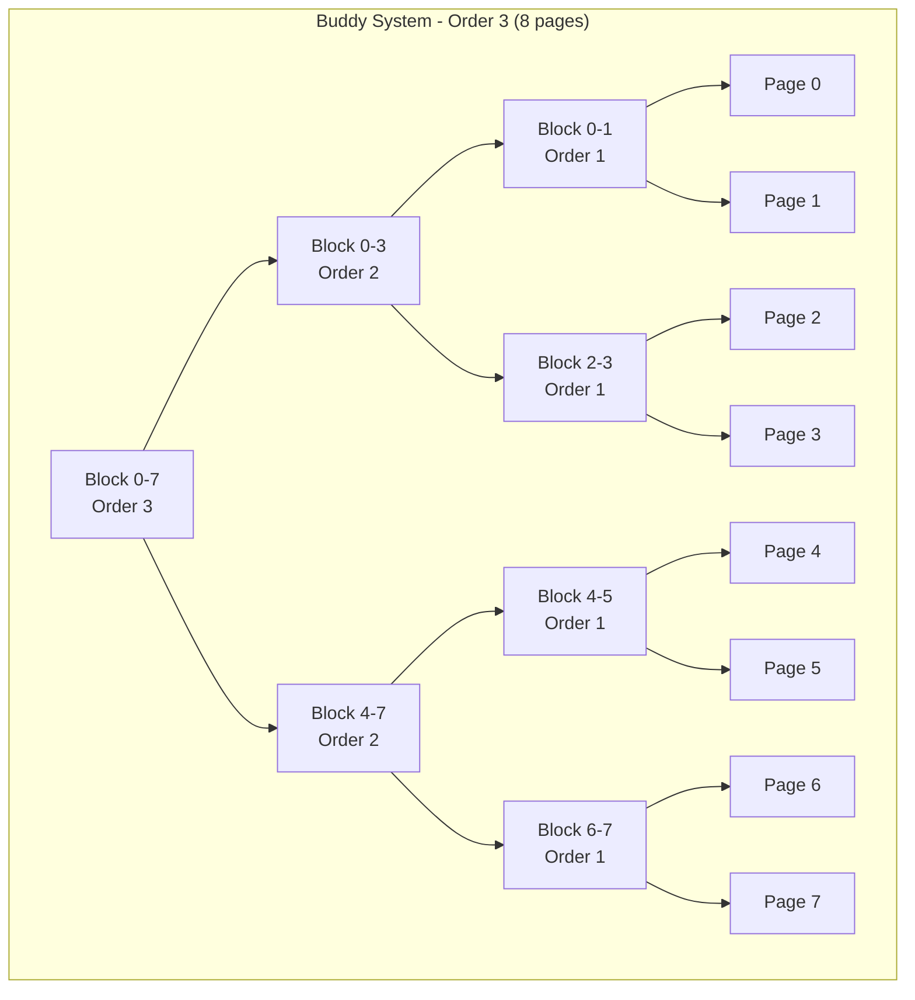
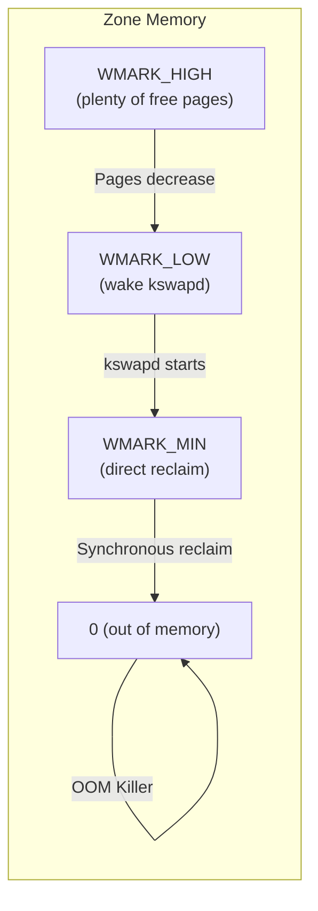
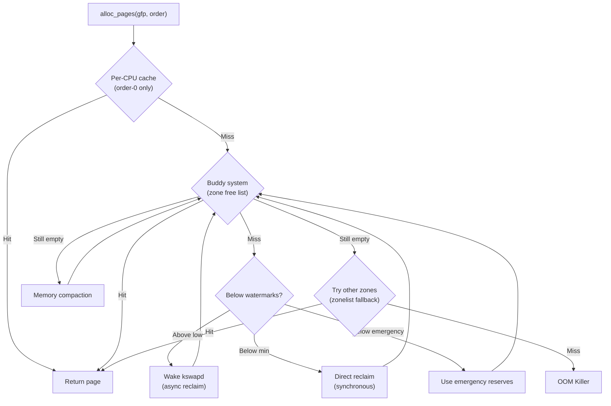

# Page Allocator (Buddy System)

## Introduction

The page allocator is the kernel's primary mechanism for allocating physical memory in units of pages (typically 4 KiB). It implements the **buddy system** algorithm, which manages free page frames organized by size in power-of-two blocks. The page allocator serves as the foundation for all other kernel memory allocators — the slab allocator (SLUB) obtains pages from it, `vmalloc()` uses it, and even the page cache consumes pages through it.

The page allocator is responsible for:
- Tracking free and allocated physical pages across NUMA nodes and zones
- Allocating contiguous blocks of 2^n pages
- Handling different allocation requirements (DMA, normal, highmem)
- Managing memory fragmentation and compaction
- Providing NUMA-aware allocation

## The Buddy System Algorithm

### How It Works

The buddy system maintains free lists organized by **order** (block size). An order-n block contains 2^n contiguous pages:

| Order | Pages | Size |
|-------|-------|------|
| 0 | 1 | 4 KiB |
| 1 | 2 | 8 KiB |
| 2 | 4 | 16 KiB |
| 3 | 8 | 32 KiB |
| ... | ... | ... |
| 10 | 1024 | 4 MiB |
| 11 | 2048 | 8 MiB (MAX_ORDER) |

When allocating 2^n pages:
1. Check the free list for order n. If a block is available, remove and return it.
2. If not, find the smallest order k > n with a free block.
3. Split the order-k block into two order-(k-1) blocks (buddies).
4. Continue splitting until reaching order n.
5. Return one block; put the others back on appropriate free lists.

When freeing:
1. Mark the block as free at order n.
2. Check if its **buddy** (the adjacent block of the same size) is also free.
3. If so, merge them into an order-(n+1) block.
4. Repeat until the buddy is not free or maximum order is reached.

### Buddy Address Calculation

Two blocks are buddies if they differ only in bit (n+1) of their physical page frame number:

```c
/* mm/page_alloc.c */
static inline unsigned long
__find_buddy_pfn(unsigned long page_pfn, unsigned int order)
{
    return page_pfn ^ (1 << order);
}
```

For example, with order 2 (4 pages each):
- Pages 0-3 (PFN 0x00) and Pages 4-7 (PFN 0x04) are buddies (0x00 ^ 0x04 = 0x04)
- Pages 8-11 (PFN 0x08) and Pages 12-15 (PFN 0x0C) are buddies



## Kernel Data Structures

### struct free_area

Each zone maintains an array of free lists, one per order:

```c
/* include/linux/mmzone.h */
struct free_area {
    struct list_head free_list[MIGRATE_TYPES];
    unsigned long nr_free;
};
```

The `MIGRATE_TYPES` dimension groups pages by migration type to reduce fragmentation (see [Fragmentation](#fragmentation-and-anti-fragmentation) below).

### struct zone

A zone represents a contiguous range of physical memory with uniform properties:

```c
/* include/linux/mmzone.h (simplified) */
struct zone {
    unsigned long _watermark[NR_WMARK];   /* Watermark levels */
    long lowmem_reserve[MAX_NR_ZONES];    /* Reserve for higher zones */

    struct pglist_data *zone_pgdat;       /* Back-pointer to node */
    struct per_cpu_pages __percpu *per_cpu_pageset; /* Per-CPU page caches */

    unsigned long zone_start_pfn;         /* First PFN in zone */
    atomic_long_t managed_pages;          /* Managed (free + allocatable) pages */
    unsigned long spanned_pages;          /* Total pages (including holes) */
    unsigned long present_pages;          /* Actually present pages */

    const char *name;
    struct free_area free_area[MAX_ORDER]; /* Buddy system free lists */

    unsigned long flags;                  /* Zone flags */
    spinlock_t lock;

    /* ... many more fields for statistics, compaction, etc. */
};
```

### struct pglist_data (pg_data_t)

Each NUMA node has one `pglist_data` structure:

```c
/* include/linux/mmzone.h (simplified) */
typedef struct pglist_data {
    struct zone node_zones[MAX_NR_ZONES]; /* Zones in this node */
    struct zonelist node_zonelists[MAX_ZONELISTS]; /* Allocation fallback order */
    int nr_zones;                          /* Number of zones */
    int node_id;                           /* NUMA node ID */

    unsigned long node_start_pfn;          /* First PFN on this node */
    unsigned long node_present_pages;      /* Total present pages */
    unsigned long node_spanned_pages;      /* Total spanned pages */

    struct lruvec __percpu *kswapd_lruvec; /* kswapd's LRU context */
    wait_queue_head_t kswapd_wait;         /* kswapd sleep queue */
    /* ... */
} pg_data_t;
```

## Memory Zones

### Zone Types

Physical memory is divided into zones based on hardware addressing limitations:

```c
/* include/linux/mmzone.h */
enum zone_type {
    ZONE_DMA,       /* 0-16 MB: ISA DMA devices */
    ZONE_DMA32,     /* 0-4 GB: 32-bit DMA devices */
    ZONE_NORMAL,    /* Directly mapped: regular allocations */
#ifdef CONFIG_HIGHMEM
    ZONE_HIGHMEM,   /* >896 MB on 32-bit: temporarily mapped */
#endif
    ZONE_MOVABLE,   /* Hotpluggable / anti-fragmentation */
    __MAX_NR_ZONES
};
```

On x86_64, `ZONE_HIGHMEM` does not exist because all physical memory is directly mapped into the kernel's virtual address space.

### Zone Watermarks

Each zone has three watermark levels that trigger different allocation behaviors:

```c
/* include/linux/mmzone.h */
enum {
    WMARK_MIN,   /* Minimum: trigger direct reclaim (synchronous) */
    WMARK_LOW,   /* Low: wake kswapd (asynchronous reclaim) */
    WMARK_HIGH,  /* High: kswapd goes back to sleep */
    NR_WMARK
};
```



Watermarks are calculated based on `vm.min_free_kbytes`:

```bash
$ cat /proc/sys/vm/min_free_kbytes
67584

# View zone watermarks
$ cat /proc/zoneinfo | grep -A5 "Node 0, zone   Normal"
Node 0, zone   Normal
  pages free     123456
        boost    0
        min      1024
        low      1280
        high     1536
```

### Per-CPU Page Cache (PCP)

To avoid taking the zone lock for every small allocation, the kernel maintains per-CPU caches of order-0 pages:

```c
/* mm/page_alloc.c */
struct per_cpu_pages {
    int count;            /* Number of pages in the list */
    int high;             /* High watermark for batch */
    int batch;            /* Pages to add/remove at once */
    struct list_head lists[MIGRATE_TYPES]; /* Free lists per migration type */
};
```

When allocating a single page:
1. Check the per-CPU cache first (fast path, no lock).
2. If empty, refill from the zone's buddy system (slow path, requires zone lock).
3. If zone is also empty, try compaction, reclaim, or other zones.

```c
/* mm/page_alloc.c (simplified) */
static struct page *rmqueue_pcplist(struct zone *preferred_zone,
                                    struct zone *zone, gfp_t gfp_flags)
{
    struct per_cpu_pages *pcp;
    struct list_head *list;
    struct page *page;

    /* Get per-CPU cache */
    pcp = this_cpu_ptr(zone->per_cpu_pageset);
    list = &pcp->lists[migratetype];

    if (list_empty(list)) {
        /* Refill cache from buddy system */
        pcp->count += rmqueue_bulk(zone, 0, pcp->batch, list, migratetype);
    }

    page = list_first_entry(list, struct page, lru);
    list_del(&page->lru);
    pcp->count--;
    return page;
}
```

## Allocation Flags (GFP Flags)

### GFP Flag Categories

GFP (Get Free Pages) flags control allocation behavior:

```c
/* include/linux/gfp.h */
/* Action modifiers - what the allocator can do */
#define __GFP_IO      0x00000040  /* Can initiate disk I/O */
#define __GFP_FS      0x00000080  /* Can call filesystem code */
#define __GFP_DIRECT_RECLAIM 0x00000400  /* Can enter direct reclaim */
#define __GFP_KSWAPD_RECLAIM 0x00080000  /* Allow kswapd reclaim */
#define __GFP_RECLAIM  (__GFP_DIRECT_RECLAIM | __GFP_KSWAPD_RECLAIM)
#define __GFP_NORETRY  0x00000100  /* Don't retry, fail early */
#define __GFP_NOFAIL   0x00000800  /* Never fail (retry forever) */
#define __GFP_NOMEMALLOC 0x00020000  /* Don't use reserves */
#define __GFP_HARDWALL  0x00040000  /* Enforce cpuset/mempolicy */
#define __GFP_THISNODE  0x00400000  /* Allocate on this node only */
#define __GFP_NOWARN    0x00000200  /* Suppress warnings */

/* Watermark modifiers */
#define __GFP_HIGH      0x00000020  /* Access emergency reserves */
#define __GFP_MEMALLOC   0x00020000  /* Use emergency reserves */
#define __GFP_ATOMIC     (__GFP_HIGH | __GFP_DIRECT_RECLAIM)

/* Type modifiers - shorthand combinations */
#define GFP_KERNEL      (__GFP_RECLAIM | __GFP_IO | __GFP_FS)
#define GFP_ATOMIC      (__GFP_HIGH | __GFP_ATOMIC)
#define GFP_USER        (__GFP_RECLAIM | __GFP_IO | __GFP_FS | __GFP_HARDWALL)
#define GFP_HIGHUSER    (GFP_USER | __GFP_HIGHMEM)
#define GFP_DMA         (__GFP_DMA)
#define GFP_DMA32       (__GFP_DMA32)
#define GFP_NOIO        (__GFP_RECLAIM)
#define GFP_NOFS        (__GFP_RECLAIM | __GFP_IO)
#define GFP_NOWAIT      (__GFP_KSWAPD_RECLAIM)
#define GFP_TMPFS       (__GFP_RECLAIM | __GFP_IO | __GFP_FS | __GFP_HARDWALL)
```

### Common GFP Combinations

| GFP Flag | Use Case | Can Sleep? | Can I/O? | Can Reclaim? |
|----------|----------|-----------|----------|-------------|
| `GFP_KERNEL` | General kernel allocation | Yes | Yes | Yes |
| `GFP_ATOMIC` | Interrupt context, spinlock held | No | No | No |
| `GFP_NOIO` | I/O subsystem (avoid recursion) | Yes | No | Yes |
| `GFP_NOFS` | Filesystem code (avoid recursion) | Yes | Yes | No |
| `GFP_USER` | User-space pages | Yes | Yes | Yes |
| `GFP_HIGHUSER` | User pages, prefer highmem (32-bit) | Yes | Yes | Yes |
| `GFP_DMA` | DMA-capable memory (ISA) | Yes | Yes | Yes |
| `GFP_NOWAIT` | Try without blocking | No | No | kswapd only |

### Allocation Path



## Core Allocation Functions

### alloc_pages / __alloc_pages

```c
/* include/linux/gfp.h */
/* Allocate 2^order contiguous pages */
struct page *alloc_pages(gfp_t gfp_mask, unsigned int order);

/* The actual implementation */
static inline struct page *
alloc_pages(gfp_t gfp, unsigned int order)
{
    return __alloc_pages(gfp, order, numa_node_id(), NULL);
}

/* Get virtual address from page */
void *page_address(struct page *page);

/* Convenience: allocate and return virtual address */
static inline void *get_zeroed_page(gfp_t gfp_mask)
{
    return (void *)__get_free_pages(gfp_mask | __GFP_ZERO, 0);
}

unsigned long __get_free_pages(gfp_t gfp_mask, unsigned int order);
```

### __alloc_pages_nodemask — The Core Function

```c
/* mm/page_alloc.c (simplified) */
struct page *__alloc_pages_nodemask(gfp_t gfp_mask, unsigned int order,
                                     int preferred_nid, nodemask_t *nodemask)
{
    struct page *page;
    struct alloc_context ac = {
        .zonelist = node_zonelist(preferred_nid, gfp_mask),
        .nodemask = nodemask,
        .migratetype = gfpflags_to_migratetype(gfp_mask),
    };

    /* 1. First attempt — fast path */
    page = get_page_from_freelist(alloc_flags | ALLOC_WMARK_LOW,
                                  order, &ac);
    if (likely(page))
        goto out;

    /* 2. Slow path — may reclaim, compact, etc. */
    page = __alloc_pages_slowpath(gfp_mask, order, &ac);

out:
    return page;
}
```

## Freeing Pages

```c
/* include/linux/gfp.h */
void __free_pages(struct page *page, unsigned int order);
void free_pages(unsigned long addr, unsigned int order);

/* Free a single page */
static inline void free_page(unsigned long addr)
{
    free_pages(addr, 0);
}
```

The free path is the reverse of allocation — it returns pages to the buddy system and attempts to merge with buddies:

```c
/* mm/page_alloc.c (simplified) */
static inline void __free_one_page(struct page *page, unsigned long pfn,
                                    struct zone *zone, unsigned int order,
                                    int migratetype)
{
    unsigned long buddy_pfn = __find_buddy_pfn(pfn, order);
    struct page *buddy;

    /* Try to merge with buddy up to MAX_ORDER-1 */
    while (order < MAX_ORDER - 1) {
        buddy = page + (buddy_pfn - pfn);
        if (!page_is_buddy(page, buddy, order))
            break;

        /* Merge: remove buddy from its free list */
        del_page_from_free_list(buddy, zone, order);
        combined_pfn = buddy_pfn & pfn;
        page = page + (combined_pfn - pfn);
        pfn = combined_pfn;
        order++;
        buddy_pfn = __find_buddy_pfn(pfn, order);
    }

    /* Add merged block to free list */
    add_to_free_list(page, zone, order, migratetype);
}
```

## Fragmentation and Anti-Fragmentation

### The Problem

External fragmentation occurs when free memory is scattered in small blocks, preventing allocation of large contiguous regions. The buddy system can suffer from this over time as allocations of different sizes interleave.

### Migration Types

Linux groups pages by their ability to be moved or reclaimed:

```c
/* include/linux/mmzone.h */
enum migratetype {
    MIGRATE_UNMOVABLE,    /* Cannot be moved (kernel allocations) */
    MIGRATE_MOVABLE,      /* Can be moved (user pages, page cache) */
    MIGRATE_RECLAIMABLE,  /* Can be reclaimed (dentries, inodes) */
    MIGRATE_PCPTYPES,     /* Number of per-CPU page types */
    MIGRATE_HIGHATOMIC = MIGRATE_PCPTYPES, /* High-order atomic reserves */
    MIGRATE_TYPES
};
```

Each order's free list is separated by migration type. When a page is freed, it goes back to the list matching its type. When a preferred type's list is empty, the allocator falls back to other types:

```c
/* mm/page_alloc.c */
static struct page *get_page_from_freelist(gfp_t gfp_mask,
                                            unsigned int order,
                                            struct alloc_context *ac)
{
    /* Try preferred zone first */
    for_next_zone_zonelist_nodemask(zone, z, ac->zonelist,
                                     ac->high_zoneidx, ac->nodemask) {
        /* Check watermarks */
        if (!zone_watermark_fast(zone, order, mark, ac->highest_zoneidx))
            continue;

        /* Try to allocate from zone */
        page = rmqueue(zone, order, gfp_mask, migratetype);
        if (page)
            return page;
    }
    return NULL;
}
```

### Memory Compaction

The kernel's **compaction** subsystem moves movable pages to create contiguous free regions:

```bash
# Trigger compaction manually
$ echo 1 > /proc/sys/vm/compact_memory

# View compaction stats
$ cat /proc/vmstat | grep compact
compact_success 1234
compact_fail    56
compact_migrate_scanned 1234567
compact_free_scanned 8901234
```

```c
/* mm/compaction.c (simplified) */
static enum compact_result compact_zone(struct compact_control *cc)
{
    /* Scan from bottom for free pages, from top for movable pages */
    /* Migrate movable pages to create contiguous free blocks */
    /* ... */
}
```

### Memory Defragmentation

```bash
# Check fragmentation status
$ cat /proc/buddyinfo
Node 0, zone      DMA      1      0      1      1      1      1      0
Node 0, zone    DMA32    512    321    145     67     32     10      2
Node 0, zone   Normal  12345   6789   3456   1234    567    234     89

# Each column shows the number of free blocks of that order
# Column 0 = order 0 (4K), Column 1 = order 1 (8K), etc.
# Many small blocks + few large blocks = fragmented

# Per-node fragmentation index
$ cat /proc/pagetypeinfo
```

## NUMA-Aware Allocation

### Zonelists and Fallback Order

Each NUMA node has a **zonelist** that defines the fallback order for allocations:

```bash
$ cat /proc/zoneinfo | head -5
# Zones are tried in order: preferred zone → other zones on same node → other nodes
```

```c
/* mm/page_alloc.c */
static void build_zonelists(pg_data_t *pgdat)
{
    /* Build fallback order:
     * 1. All zones on local node (DMA32, Normal, Movable)
     * 2. All zones on next node
     * 3. ... */
}
```

### NUMA Policy

Users can control NUMA allocation policy:

```bash
# Allocate on node 0 only
$ numactl --membind=0 ./myapp

# Prefer node 1 but allow fallback
$ numactl --preferred=1 ./myapp

# Interleave across all nodes
$ numactl --interleave=all ./myapp

# Check NUMA allocation stats
$ numastat
                           node0           node1
numa_hit              12345678        23456789
numa_miss                12345           23456
numa_foreign             23456           12345
interleave_hit            1234            1234
local_node            12340000        23450000
other_node               25678           34567
```

## High-Order Allocations

Allocating contiguous pages (order > 0) is inherently harder and may fail under memory pressure:

```c
/* Allocate 4 contiguous pages (order 2, 16 KiB) */
struct page *pages = alloc_pages(GFP_KERNEL, 2);
if (!pages)
    return -ENOMEM;

void *addr = page_address(pages);
/* Use 16 KiB of contiguous memory */

__free_pages(pages, 2);
```

### Order-0 vs Higher-Order Performance

```bash
# Check allocation failure stats by order
$ cat /proc/vmstat | grep allocstall
allocstall_normal      234
allocstall_movable     123

# Fragmentation can cause high-order failures even with free memory
# Solution: compaction, huge pages, or vmalloc
```

## Reserved Memory and Emergency Reserves

The kernel reserves a portion of memory for critical allocations (e.g., OOM killer needs memory to work):

```c
/* mm/page_alloc.c */
int min_free_kbytes = 1024;  /* Default, adjusted at boot */
```

```bash
# View and adjust minimum free memory
$ cat /proc/sys/vm/min_free_kbytes
67584

# Set to 128 MB (131072 kB)
$ echo 131072 > /proc/sys/vm/min_free_kbytes

# Emergency reserves per zone
$ cat /proc/zoneinfo | grep protection
        protection: (0, 2116, 3570, 3570)
```

## Monitoring the Page Allocator

### /proc/buddyinfo

```bash
$ cat /proc/buddyinfo
Node 0, zone      DMA      1      1      1      0      2      1      1      0
Node 0, zone    DMA32    801    567    320    145     67     32     10      2
Node 0, zone   Normal  42156  23456  12345   6789   3456   1234    567    234
```

Interpretation: Each number is the count of free blocks of that order. Reading left to right: order 0 (4K), order 1 (8K), ..., order 10 (4M).

### /proc/pagetypeinfo

```bash
$ cat /proc/pagetypeinfo
Page block order: 10
Pages per block:  1024

Free pages count per migrate type at order       0      1      2      3
Node    0, zone      DMA, type    Unmovable      1      1      1      0
Node    0, zone      DMA, type      Movable      0      0      0      0
Node    0, zone      DMA, type  Reclaimable      0      0      0      0
Node    0, zone   Normal, type    Unmovable    512    256    128     64
Node    0, zone   Normal, type      Movable  41644  23200  12217   6725
Node    0, zone   Normal, type  Reclaimable    100     50     25     12
```

### vmstat Monitoring

```bash
# Watch allocation activity in real-time
$ vmstat -s
     32768000 K total memory
     12582912 K used memory
     18874368 K active memory
      2150400 K free memory
       524288 K buffer memory
     17825792 K swap cache
      8388608 K total swap
      8126464 K free swap
     28473920 non-nice user cpu ticks
       14256 nice user cpu ticks

# Per-second allocation counters
$ cat /proc/vmstat | grep -E "pgalloc|pgfree|pgfault"
pgalloc_normal    123456789
pgalloc_movable   234567890
pgfree            345678901
pgfault           28473920
pgmajfault        14256
```

## Code Example: Kernel Module Page Allocation

```c
/* Example kernel module demonstrating page allocation */
#include <linux/module.h>
#include <linux/gfp.h>
#include <linux/slab.h>

static int __init page_alloc_demo_init(void)
{
    struct page *page, *pages;
    void *addr;

    /* Allocate a single page (order 0) */
    page = alloc_page(GFP_KERNEL);
    if (!page)
        return -ENOMEM;

    addr = page_address(page);
    pr_info("Single page: %p, PFN: %lu\n", addr, page_to_pfn(page));

    /* Use the page */
    memset(addr, 0xAA, PAGE_SIZE);

    /* Free the page */
    __free_page(page);

    /* Allocate 4 contiguous pages (order 2) */
    pages = alloc_pages(GFP_KERNEL | __GFP_ZERO, 2);
    if (!pages)
        return -ENOMEM;

    pr_info("4 pages: PFN %lu, contiguous: %s\n",
            page_to_pfn(pages),
            (page_to_pfn(pages) & 3) == 0 ? "yes" : "no");

    /* Free all 4 pages */
    __free_pages(pages, 2);

    return 0;
}

static void __exit page_alloc_demo_exit(void)
{
    pr_info("Page allocator demo unloaded\n");
}

module_init(page_alloc_demo_init);
module_exit(page_alloc_demo_exit);
MODULE_LICENSE("GPL");
```

## GFP Flags and Reclaim Behavior (from kernel docs)

From the kernel documentation at `docs.kernel.org/core-api/memory-allocation.html`:

### Recommended GFP Flag Usage

- **`GFP_KERNEL`** is what you need most of the time. Memory for kernel data structures, DMAable memory, inode cache — all can use GFP_KERNEL. It implies `__GFP_RECLAIM`, so direct reclaim may be triggered; the caller must be allowed to sleep.

- **`GFP_NOWAIT`** for atomic context (interrupt handler). Prevents direct reclaim and I/O. Under memory pressure, allocation is likely to fail — provide a suitable fallback.

- **`GFP_ATOMIC`** when accessing memory reserves is justified and the kernel will be stressed unless allocation succeeds.

- **`__GFP_ACCOUNT`** for untrusted allocations from userspace (kmem accounting). Use `GFP_KERNEL_ACCOUNT` as a shortcut.

- **`GFP_USER`**, **`GFP_HIGHUSER`**, **`GFP_HIGHUSER_MOVABLE`** for userspace allocations. The longer the name, the less restrictive:
  - `GFP_HIGHUSER_MOVABLE`: not required to be directly kernel-accessible, implies movable
  - `GFP_HIGHUSER`: not movable, not required to be directly kernel-accessible
  - `GFP_USER`: not movable, must be directly kernel-accessible

### Reclaim Behavior Spectrum

| GFP Flags | Behavior |
|-----------|----------|
| `GFP_KERNEL & ~__GFP_RECLAIM` | Optimistic, no reclaim at all, no kswapd |
| `GFP_KERNEL & ~__GFP_DIRECT_RECLAIM` | No direct reclaim, can wake kswapd |
| `GFP_ATOMIC` | Non-sleeping, can access memory reserves |
| `GFP_KERNEL` | Both background and direct reclaim allowed |
| `GFP_KERNEL | __GFP_NORETRY` | Fail early, no OOM killer |
| `GFP_KERNEL | __GFP_RETRY_MAYFAIL` | Try hard, no OOM killer |
| `GFP_KERNEL | __GFP_NOFAIL` | Never fail (retry forever) — use with caution |

### Selecting an Allocator

The kernel documentation recommends:

1. Use `kzalloc(<size>, GFP_KERNEL)` as the default
2. For arrays, use `kmalloc_array()` or `kcalloc()` with overflow-safe helpers
3. For large allocations, use `vmalloc()` or `kvmalloc()` (tries kmalloc first, falls back to vmalloc)
4. For many identical objects, use `kmem_cache_create()` + `kmem_cache_alloc()`
5. Use `struct_size()`, `array_size()`, `array3_size()` for safe size calculations

`kmalloc()` alignment: at least `ARCH_KMALLOC_MINALIGN` bytes. For power-of-two sizes, alignment is at least the size itself.

## Page Allocator Internals (from docs.kernel.org)

The kernel documentation at `docs.kernel.org/mm/page_allocation.html` covers the buddy system allocator implementation. Key details:

### The Allocation Path

The page allocator's `__alloc_pages()` function follows this path:

1. **Fast path**: `get_page_from_freelist()` checks watermarks and allocates from the per-CPU cache or buddy free lists
2. **Slow path**: `__alloc_pages_slowpath()` may wake `kswapd`, perform direct reclaim, attempt compaction, retry with different zones, or invoke the OOM killer

### GFP Flag Guidance from Kernel Docs

- Use `kzalloc(<size>, GFP_KERNEL)` as the default
- For arrays, use `kmalloc_array()` or `kcalloc()` with overflow-safe helpers
- For large allocations, use `vmalloc()` or `kvmalloc()`
- For many identical objects, use `kmem_cache_create()` + `kmem_cache_alloc()`
- Use `struct_size()`, `array_size()`, `array3_size()` for safe size calculations

`kmalloc()` alignment: at least `ARCH_KMALLOC_MINALIGN` bytes. For power-of-two sizes, alignment is at least the size itself.

### Userspace Allocation GFP Flags

- `GFP_USER`: Not movable, must be directly kernel-accessible
- `GFP_HIGHUSER`: Not movable, not required to be directly kernel-accessible
- `GFP_HIGHUSER_MOVABLE`: Not required to be directly kernel-accessible, implies movable (preferred for user pages)

## References

- [The Linux Kernel Documentation](https://docs.kernel.org/)
- [GNU Project Documentation](https://www.gnu.org/doc/doc.html)
- [GNU Manuals](https://www.gnu.org/manual/manual.html)
- [Free Software Directory](https://directory.fsf.org/wiki/Main_Page)
- [Planet GNU](https://planet.gnu.org/)
- [Free Software Books](https://www.gnu.org/doc/other-free-books.html)

- **Understanding the Linux Kernel, 3rd Edition** — Chapter 8: Memory Management (Buddy System)
- **Linux Kernel Development, 3rd Edition** — Chapter 12: Memory Management
- [Kernel source: mm/page_alloc.c](https://elixir.bootlin.com/linux/latest/source/mm/page_alloc.c)
- [Kernel documentation: Physical Memory](https://www.kernel.org/doc/html/latest/mm/)
- [Kernel documentation: Memory Allocation Guide](https://docs.kernel.org/core-api/memory-allocation.html)
- [Kernel documentation: page_alloc](https://docs.kernel.org/mm/page_allocation.html)
- [Kernel documentation: Page Allocation](https://docs.kernel.org/mm/page_allocation.html) — Official page allocator documentation
- [LWN: Memory compaction](https://lwn.net/Articles/368869/)
- [Mel Gorman: Understanding the Linux Virtual Memory Manager](https://www.kernel.org/doc/gorman/)

## Related Topics

- [Memory Management Overview](overview.md) — High-level overview
- [Slab Allocator](slab-allocator.md) — Small object allocation built on page allocator
- [vmalloc vs kmalloc](vmalloc-kmalloc.md) — Kernel memory allocation APIs
- [Huge Pages](huge-pages.md) — Large page allocation
- [Swap](swap.md) — Page reclaim and swapping
- [OOM Killer](oom-killer.md) — Out-of-memory handling
- [Virtual Memory](virtual-memory.md) — Page tables and address translation
