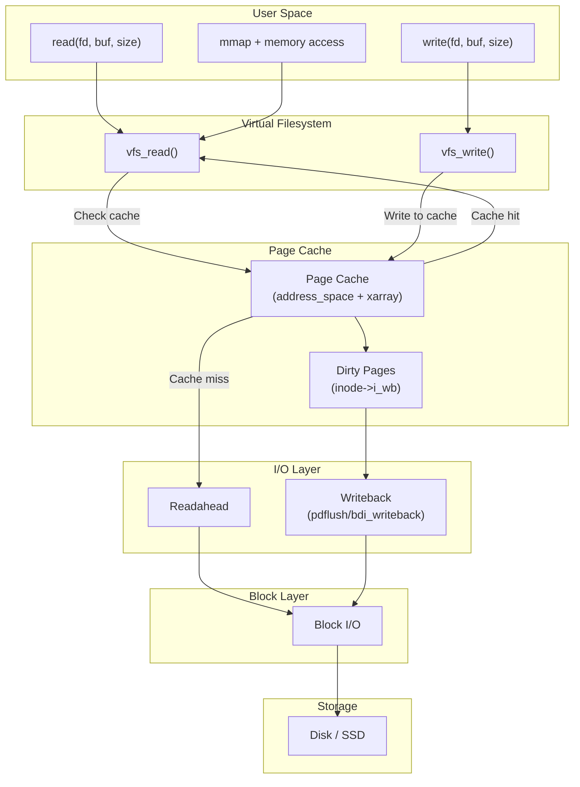
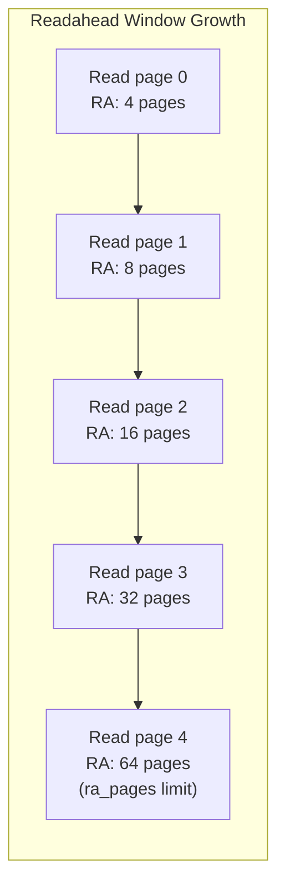
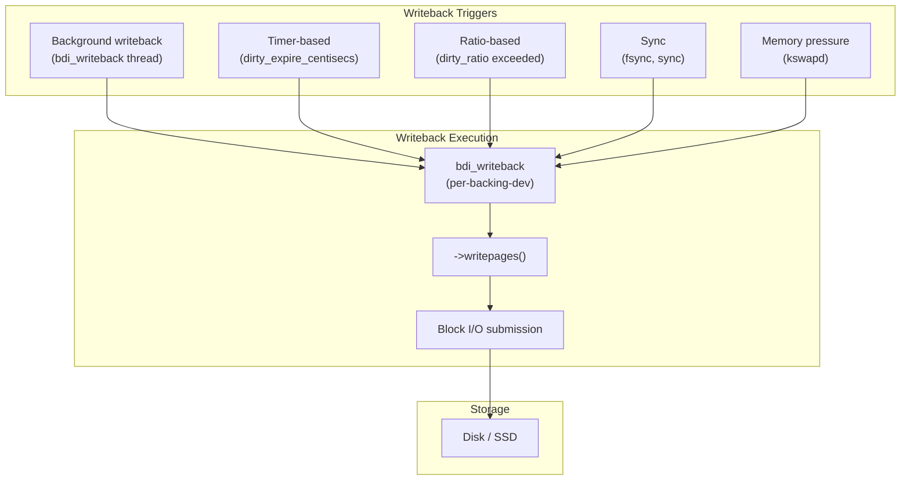
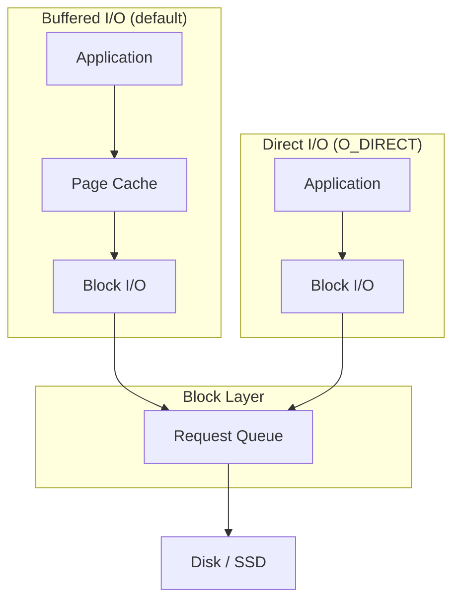

# Page Cache

## Introduction

The page cache is one of the most performance-critical subsystems in the Linux kernel. It caches data from disk (files, block devices) in physical memory, avoiding expensive disk I/O for repeated accesses. When a process reads a file, the kernel first checks the page cache — if the data is present (a **cache hit**), it returns immediately from memory. If not (a **cache miss**), the data is read from disk and stored in the cache for future use.

The page cache also buffers writes. When a process writes to a file, the data is written to the page cache and marked **dirty**. The kernel's writeback mechanism later flushes dirty pages to disk asynchronously, allowing applications to continue without waiting for disk I/O.

## Architecture Overview



## Core Data Structures

### address_space

Each inode has an `address_space` structure that manages its cached pages:

```c
/* include/linux/fs.h (simplified) */
struct address_space {
    struct inode        *host;          /* Owning inode */
    struct xarray       i_pages;        /* Cached pages (xarray/radix tree) */
    struct rw_semaphore i_mmap_rwsem;   /* Protects i_mmap */
    struct rb_root_cached i_mmap;       /* Tree of VMAs mapping this file */
    unsigned long       nrpages;        /* Total number of cached pages */
    pgoff_t             writeback_index;/* Writeback position */
    const struct address_space_operations *a_ops; /* Operations */
    unsigned long       flags;          /* Error flags, etc. */
    errseq_t            wb_err;         /* Most recent writeback error */
    spinlock_t          i_private_lock;
    struct list_head    i_private_list;
};
```

### address_space_operations

```c
/* include/linux/fs.h */
struct address_space_operations {
    int (*writepage)(struct page *, struct writeback_control *);
    int (*read_folio)(struct file *, struct folio *);
    int (*writepages)(struct address_space *, struct writeback_control *);
    bool (*dirty_folio)(struct address_space *, struct folio *);
    void (*readahead)(struct readahead_control *);
    int (*write_begin)(struct file *, struct address_space *,
                       loff_t, unsigned, struct page **, void **);
    int (*write_end)(struct file *, struct address_space *,
                     loff_t, unsigned, unsigned, struct page *, void *);
    sector_t (*bmap)(struct address_space *, sector_t);
    int (*swap_activate)(struct swap_info_struct *, struct file *, sector_t *);
    void (*swap_deactivate)(struct file *);
};
```

### struct folio

Modern Linux uses `struct folio` as the primary unit for the page cache. A folio is a physically contiguous set of pages, always at least PAGE_SIZE, never a tail page:

```c
/* include/linux/mm_types.h */
struct folio {
    union {
        struct {
            unsigned long flags;
            struct list_head lru;
            struct address_space *mapping;
            pgoff_t index;
            void *private;
            atomic_t _mapcount;
            atomic_t _refcount;
            /* ... */
        };
        struct page page;
    };
};
```

## The XArray (Radix Tree)

### Structure

The page cache uses an **XArray** (evolution of the radix tree) to map file offsets (page indices) to `struct folio` pointers:

```c
/* include/linux/xarray.h */
struct xarray {
    spinlock_t      xa_lock;
    gfp_t           xa_flags;
    void __rcu      *xa_head;  /* Root node or single entry */
};
```

The XArray provides:
- O(1) lookup for cached entries in small files
- O(log n) lookup for large files (multi-level radix tree)
- Efficient range operations (batch insert/remove)
- RCU-safe lookups (lock-free readers)

### XArray Operations

```c
/* Insert a folio into the page cache */
void *xa_store(struct xarray *xa, unsigned long index,
               void *entry, gfp_t gfp);

/* Lookup a folio by index */
void *xa_load(struct xarray *xa, unsigned long index);

/* Mark entry as being updated (for multi-order entries) */
int xa_store_range(struct xarray *xa, unsigned long first,
                   unsigned long last, void *entry, gfp_t gfp);

/* Delete an entry */
void xa_erase(struct xarray *xa, unsigned long index);
```

## Finding Pages in the Cache

### find_get_page / filemap_get_folio

When a file is read, the kernel looks up the page cache:

```c
/* mm/filemap.c (simplified) */
struct folio *filemap_get_folio(struct address_space *mapping,
                                pgoff_t index)
{
    struct folio *folio;

    rcu_read_lock();
    folio = xa_load(&mapping->i_pages, index);
    if (folio) {
        /* Try to get a reference */
        if (!folio_try_get_rcu(folio))
            folio = NULL;
        else if (unlikely(folio->mapping != mapping)) {
            folio_put(folio);
            folio = NULL;
        }
    }
    rcu_read_unlock();

    return folio;
}
```

### Generic File Read Path

```c
/* mm/filemap.c (simplified) */
static ssize_t generic_file_read_iter(struct kiocb *iocb,
                                      struct iov_iter *iter)
{
    struct file *file = iocb->ki_filp;
    struct address_space *mapping = file->f_mapping;
    struct folio *folio;
    pgoff_t index;
    loff_t pos = iocb->ki_pos;
    size_t count = iov_iter_count(iter);

    /* Try to find the page in cache */
    index = pos >> PAGE_SHIFT;
    folio = filemap_get_folio(mapping, index);

    if (!folio) {
        /* Cache miss — read from disk */
        folio = filemap_get_folio_gfp(mapping, index,
                                       GFP_KERNEL | __GFP_MOVABLE);
        if (!folio) {
            /* Trigger readahead and retry */
            page_cache_sync_readahead(mapping, ra, file, index);
            folio = filemap_get_folio(mapping, index);
        }
    }

    /* Copy data to user buffer */
    /* ... */

    return bytes_read;
}
```

## Readahead

### How Readahead Works

Readahead (also called prefetching) is a critical performance optimization. When the kernel detects sequential file access, it proactively reads ahead of the current position:

```c
/* mm/readahead.c (simplified) */
void page_cache_sync_readahead(struct address_space *mapping,
                               struct file_ra_state *ra,
                               struct file *file,
                               pgoff_t index)
{
    /* Check if readahead is appropriate */
    if (!ra->ra_pages)
        return;  /* Readahead disabled */

    /* Handle sequential vs random access */
    if (index == ra->start + ra->size) {
        /* Sequential access: continue readahead */
        ra->size = min(ra->size * 2, ra->ra_pages);
    } else if (index != ra->start) {
        /* Random access: reset readahead */
        ra->size = ra->ra_pages / 2;
    }

    ra->start = index;
    do_readahead(mapping, file, index, ra->size);
}
```

### Readahead Window

The readahead window starts small and doubles on each sequential access until it reaches the maximum:



### Tuning Readahead

```bash
# View readahead settings for a block device
$ cat /sys/block/sda/queue/read_ahead_kb
128

# Set readahead to 256 KB
$ echo 256 > /sys/block/sda/queue/read_ahead_kb

# Per-file readahead can be adjusted with fadvise()
# POSIX_FADV_SEQUENTIAL: double the default readahead
# POSIX_FADV_RANDOM: disable readahead
# POSIX_FADV_WILLNEED: trigger immediate readahead
# POSIX_FADV_DONTNEED: drop pages from cache
```

### Readahead Code Example (User Space)

```c
#include <fcntl.h>
#include <unistd.h>
#include <sys/mman.h>

int fd = open("largefile.dat", O_RDONLY);

/* Tell kernel we'll read sequentially */
posix_fadvise(fd, 0, 0, POSIX_FADV_SEQUENTIAL);

/* Tell kernel we'll need this range soon */
posix_fadvise(fd, 0, 1024*1024, POSIX_FADV_WILLNEED);

/* Read data — readahead makes this fast */
char buf[4096];
while (read(fd, buf, sizeof(buf)) > 0) {
    /* Process data */
}

/* We're done with this section — drop from cache */
posix_fadvise(fd, 0, 1024*1024, POSIX_FADV_DONTNEED);
```

## Dirty Pages and Writeback

### What Are Dirty Pages?

When a process writes to a file (via `write()` or memory-mapped writes), the data goes into the page cache and the page is marked **dirty**. Dirty pages must eventually be written to disk.

```c
/* mm/page-writeback.c */
void folio_mark_dirty(struct folio *folio)
{
    struct address_space *mapping = folio->mapping;

    if (mapping->a_ops->dirty_folio)
        mapping->a_ops->dirty_folio(mapping, folio);
    else
        __folio_mark_dirty(folio);

    /* Account as dirty */
    account_page_dirtied(folio);
}
```

### Dirty Page Tracking

```bash
# System-wide dirty page statistics
$ cat /proc/meminfo | grep -E "Dirty|Writeback"
Dirty:            262144 kB    # Dirty pages waiting to be written
Writeback:             0 kB    # Currently being written back
WritebackTmp:          0 kB    # FUSE temporary writeback

$ cat /proc/vmstat | grep -E "dirty|writeback"
nr_dirty 65536
nr_writeback 0
nr_dirty_threshold 131072
nr_dirty_background_threshold 65536
```

### Writeback Tuning Parameters

```bash
# Dirty page thresholds (as % of total memory)
$ cat /proc/sys/vm/dirty_ratio
20          # Max % of dirty pages before sync writeback

$ cat /proc/sys/vm/dirty_background_ratio
10          # % of dirty pages before background writeback starts

# Time-based thresholds (alternative to ratio)
$ cat /proc/sys/vm/dirty_expire_centisecs
3000        # Dirty pages older than 30 seconds are written back

$ cat /proc/sys/vm/dirty_writeback_centisecs
500         # Writeback thread wakes every 5 seconds

# Maximum dirty page limits (in bytes, alternative to ratio)
$ cat /proc/sys/vm/dirty_bytes
0           # 0 = use dirty_ratio instead

$ cat /proc/sys/vm/dirty_background_bytes
0           # 0 = use dirty_background_ratio
```

### Writeback Mechanisms



### The bdi_writeback Structure

Each backing device (filesystem, block device) has a writeback context:

```c
/* include/linux/backing-dev-def.h */
struct bdi_writeback {
    struct backing_dev_info *bdi;
    unsigned long state;
    unsigned long last_old_flush;
    struct list_head b_dirty;       /* Dirty inodes */
    struct list_head b_io;          /* Inodes being written */
    struct list_head b_more_io;     /* More I/O pending */
    struct list_head b_dirty_time;  /* Dirty-time tracked inodes */
    spinlock_t list_lock;
    struct list_head work_list;
    struct delayed_work dwork;
    struct folio_batch fbatch;
    /* ... */
};
```

## Page Cache Eviction (Reclaim)

When memory is low, the kernel reclaims page cache pages. Clean (non-dirty) file-backed pages can be discarded immediately since the data is on disk. Dirty pages must be written back first.

The kernel uses LRU (Least Recently Used) lists to track page cache pages:

```c
/* include/linux/mmzone.h */
enum lru_list {
    LRU_INACTIVE_ANON,  /* Inactive anonymous pages */
    LRU_ACTIVE_ANON,    /* Active anonymous pages */
    LRU_INACTIVE_FILE,  /* Inactive file pages (page cache) */
    LRU_ACTIVE_FILE,    /* Active file pages (page cache) */
    LRU_UNEVICTABLE,    /* mlock'd pages */
    NR_LRU_LISTS
};
```

See [Swap](swap.md) for the complete page reclaim mechanism.

## The Mapping Tree: VMAs and the Page Cache

An `address_space` also tracks which VMAs map its pages via an interval tree:

```c
/* mm/filemap.c */
void vma_interval_tree_insert(struct vm_area_struct *vma,
                               struct rb_root_cached *root)
{
    struct rb_node **link = &root->rb_root.rb_node;
    struct rb_node *parent = NULL;
    unsigned long start = vma->vm_pgoff;
    /* ... insert into interval tree ... */
}
```

This allows the kernel to efficiently find all VMAs that map a given page range, which is needed for:
- Invalidating mappings when a file is truncated
- Implementing `MS_INVALIDATE`
- Tracking which processes have a page mapped

## Filesystem-Specific Page Cache

### ext4 Example

Each filesystem implements `address_space_operations`:

```c
/* fs/ext4/inode.c */
static const struct address_space_operations ext4_aops = {
    .read_folio    = ext4_read_folio,
    .readahead     = ext4_readahead,
    .writepages    = ext4_writepages,
    .write_begin   = ext4_write_begin,
    .write_end     = ext4_write_end,
    .dirty_folio   = ext4_dirty_folio,
    .bmap           = ext4_bmap,
    .swap_activate  = ext4_swap_activate,
    .swap_deactivate = ext4_swap_deactivate,
};
```

### ext4 Write Path

```c
/* fs/ext4/inode.c (simplified) */
static int ext4_write_begin(struct file *file,
                            struct address_space *mapping,
                            loff_t pos, unsigned len,
                            struct page **pagep, void **fsdata)
{
    pgoff_t index = pos >> PAGE_SHIFT;
    struct page *page;

    /* Find or create the page in the cache */
    page = grab_cache_page_write_begin(mapping, index);
    if (!page)
        return -ENOMEM;

    /* If the page is not up to date, read it from disk */
    /* (needed for partial page writes) */
    if (!PageUptodate(page))
        ext4_readpage(file, page);

    *pagep = page;
    return 0;
}
```

## Page Cache and mmap

When a file is memory-mapped, the page cache provides the backing store:

```c
/* mm/filemap.c (simplified) */
static vm_fault_t filemap_fault(struct vm_fault *vmf)
{
    struct file *file = vmf->vma->vm_file;
    struct address_space *mapping = file->f_mapping;
    struct folio *folio;
    pgoff_t index = vmf->pgoff;

    /* Look up the page cache */
    folio = filemap_get_folio(mapping, index);
    if (!folio) {
        /* Cache miss — read from disk */
        folio = filemap_get_folio_gfp(mapping, index,
                                       GFP_KERNEL | __GFP_MOVABLE);
        if (!folio)
            return VM_FAULT_OOM;

        if (!folio_test_uptodate(folio)) {
            /* Read from disk */
            mapping->a_ops->read_folio(file, folio);
            folio_wait_locked(folio);
        }
    }

    /* Map the page into the process's address space */
    vmf->page = folio_file_page(folio, index);
    return VM_FAULT_LOCKED;
}
```

See [mmap](mmap.md) for the complete mmap story.

## Monitoring the Page Cache

### /proc/meminfo

```bash
$ cat /proc/meminfo | grep -E "Cached|Buffers|Active.file|Inactive.file"
Cached:         17825792 kB    # Total page cache
Buffers:          524288 kB    # Block device buffer cache
Active(file):    8912896 kB    # Recently accessed file pages
Inactive(file):  4456448 kB    # Not recently accessed file pages
```

### vmstat

```bash
$ cat /proc/vmstat | grep -E "pgpgin|pgpgout|pswpin|pswpout"
pgpgin    1843200     # Pages read from disk
pgpgout   2457600     # Pages written to disk

# Cache hit ratio can be inferred from page fault statistics
$ cat /proc/vmstat | grep fault
pgfault        28473920
pgmajfault        14256  # Major faults (disk I/O needed)
```

### cachestat (BPF)

On modern kernels, `cachestat` provides real-time page cache hit/miss statistics:

```bash
$ sudo cachestat 1
    HITS   MISSES  DIRTIES HITRATIO   BUFFERS_MB  CACHED_MB
  123456     1234     5678   99.01%          512      17825
  234567      567     6789   99.76%          512      17830
```

### fincore: Per-File Cache Status

```bash
# Check which pages of a file are in cache
$ vmtouch -v /var/log/syslog
Files: 1
     Directories: 0
  Resident Pages: 32768/32768  128M/128M  100%
         Elapsed: 0.000123 seconds

# Evict a file from cache
$ vmtouch -e /var/log/syslog
```

### drop_caches (Testing Only)

```bash
# Drop page cache (for testing — NOT for production!)
$ sync && echo 1 > /proc/sys/vm/drop_caches  # Drop page cache
$ sync && echo 2 > /proc/sys/vm/drop_caches  # Drop dentry/inode caches
$ sync && echo 3 > /proc/sys/vm/drop_caches  # Drop all caches
```

## Page Cache Size Management

The kernel automatically manages page cache size based on memory pressure. Key tunables:

```bash
# Minimum free pages (affects how much cache can grow)
$ cat /proc/sys/vm/min_free_kbytes
67584

# vfs_cache_pressure: controls dentry/inode cache reclaim aggressiveness
$ cat /proc/sys/vm/vfs_cache_pressure
100    # 100 = balanced, >100 = reclaim more aggressively, <100 = keep more

# swappiness: controls balance between reclaiming file pages vs anonymous
$ cat /proc/sys/vm/swappiness
60     # 0 = prefer file cache, 100 = equal preference
```

## Direct I/O: Bypassing the Page Cache

Some applications (e.g., databases) bypass the page cache using `O_DIRECT`:

```c
/* Direct I/O: data goes directly to/from user buffer, no page cache */
int fd = open("database.dat", O_RDWR | O_DIRECT);

/* Alignment requirements: buffer and size must be sector-aligned */
void *buf;
posix_memalign(&buf, 512, 4096);
pread(fd, buf, 4096, offset);
```

Direct I/O is beneficial when:
- The application has its own cache (e.g., database buffer pool)
- Sequential access to large files that would thrash the page cache
- Data is accessed only once (streaming)



## Writeback in Detail: The WB Mechanism

### Periodic Writeback

The kernel periodically wakes up to write dirty pages:

```c
/* mm/page-writeback.c (simplified) */
static long wb_check_background_flush(struct bdi_writeback *wb)
{
    long dirtied = wb_stat(wb, WB_DIRTIED);
    long dirty_thresh = global_dirty_limit(&dom);

    /* Background threshold: 10% of total memory (default) */
    if (dirtied > dirty_thresh / 10)
        return wb_do_writeback(wb);

    return 0;
}
```

### fsync and fdatasync

```c
/* Explicit sync: ensure data reaches disk */
int fd = open("file.txt", O_WRONLY | O_CREAT, 0644);
write(fd, data, len);
fsync(fd);       /* Sync data AND metadata */
fdatasync(fd);   /* Sync data only (skip metadata if size unchanged) */
close(fd);
```

### Linux-Specific: sync_file_range

For fine-grained writeback control:

```c
#include <fcntl.h>

/* Start async writeback for a range */
sync_file_range(fd, offset, count,
                SYNC_FILE_RANGE_WRITE);

/* Wait for previous async writeback to complete */
sync_file_range(fd, offset, count,
                SYNC_FILE_RANGE_WAIT_AFTER);
```

## References

- **Understanding the Linux Kernel, 3rd Edition** — Chapter 15: The Page Cache
- **Linux Kernel Development, 3rd Edition** — Chapter 16: The Page Cache and Page Writeback
- [Kernel source: mm/filemap.c](https://elixir.bootlin.com/linux/latest/source/mm/filemap.c)
- [Kernel source: mm/page-writeback.c](https://elixir.bootlin.com/linux/latest/source/mm/page-writeback.c)
- [Kernel source: mm/readahead.c](https://elixir.bootlin.com/linux/latest/source/mm/readahead.c)
- [LWN: The XArray data structure](https://lwn.net/Articles/745073/)
- [LWN: Folios](https://lwn.net/Articles/849538/)
- [Mel Gorman: Understanding the Linux Virtual Memory Manager](https://www.kernel.org/doc/gorman/)

## Related Topics

- [mmap](mmap.md) — Memory-mapped files and page cache interaction
- [Swap](swap.md) — Page reclaim for page cache and anonymous pages
- [OOM Killer](oom-killer.md) — What happens when reclaim isn't enough
- [Page Allocator](page-allocator.md) — Physical page allocation
- [Memory Management Overview](overview.md) — High-level overview
